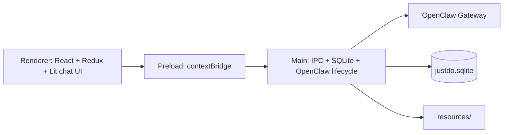

# AGENTS.md

Compact guidance for AI coding agents working in this repo. Keep this file
accurate and dense; detailed design belongs in `docs/architecture/`.

## Project Facts

JustDo is a local-first Electron + React desktop assistant. Agents execute real
tasks through OpenClaw Gateway, with durable state in SQLite and bundled skills.

- App: `v2026.8.5`
- Electron: `42.6.0`
- OpenClaw: `v2026.6.11`
- Node: `>=24 <25` (`.nvmrc`)
- Package manager: npm
- Dev server port: `4175`
- License: MIT

## Branding

- `package.json.name` (`justdo`) is the stable internal ID; never rebrand it.
- `package.json.productName` (`JustDo`) is the external name. Read it through
  `src/shared/productMetadata.ts` / `electron-builder.config.cjs`; do not add
  hardcoded user-facing `JustDo` strings.
- `productName` must match `[A-Za-z]{1,64}`. This does not restrict user-selected
  install paths, which may contain Chinese or spaces.
- It controls installer/UI names, `<appData>/<productName>`, and
  `~/<productName lowercase>/project`; old branded directories are not migrated.
- `appId` is derived as `com.<productName lowercase>.app`; changing the
  lowercase-normalized name intentionally creates a separate OS application
  identity. Case-only changes retain the existing identity.
- Never rename `justdo://`, `justdo.sqlite`, `JUSTDO_*`, `.justdo-tasks`,
  `--justdo-*`, `<justdo-chat>`, provider/export IDs, or source symbols/files.
  `author.name` is separate publisher metadata.

## Commands

```bash
nvm use 24
npm install
npm run dev                    # Vite only
npm run electron:dev           # Compile main + launch Electron
npm run electron:dev:openclaw  # Prepare host OpenClaw runtime + launch
npm run rebuild:electron-native

npm run lint
npm run validate:product-metadata
npm run build
npm run compile:electron
npm test                       # pretest rebuilds better-sqlite3
npm run format:check
npm run pack
npm run dist
npm run dist:win
npm run dist:mac
npm run dist:linux
```

Before non-trivial pushes, prefer `npm run lint && npm run build && npm test`.
For docs-only changes, run `git diff --check`.

Windows packaging uses bundled MinGit/Python runtime assets via
`scripts/setup-mingit.js` and `scripts/setup-python-runtime.js`.

## Architecture



- `src/main/`: Electron main process, IPC, SQLite, runtime/system access.
- `src/main/preload.ts`: only renderer bridge; keep API explicit and small.
- `src/renderer/`: browser-only React/Redux UI. No Node/Electron imports.
- `src/shared/`: pure cross-process contracts/utilities only.
- `resources/`: bundled skills, tray icons, runtime assets, manifests.

Main-process domains:

- `core/`: constants, logging, tray, auto-launch, proxy/runtime helpers, i18n.
- `data/`: SQLite wrapper/stores (`sqliteStore.ts`, `coworkStore.ts`, `groupStore.ts`).
- `ipc/`: app/openclaw/scheduled-task IPC handlers.
- `engine/`: cowork router, OpenClaw adapter, command safety, gateway types.
- `cowork/`: config, model API/readiness, provider config, logging.
- `openclaw/`: config sync, runtime, models, sessions, slash commands.
- `plugins/`: skills, MCP, hooks, extensions, marketplace.
- `scheduler/`: cron runtime and OpenClaw prompt support.

Key files:

- App/preload: `src/main/main.ts`, `src/main/preload.ts`
- Runtime: `src/main/openclaw/runtime/openclawEngineManager.ts`
- Engine: `src/main/engine/coworkEngineRouter.ts`, `src/main/engine/openclawRuntimeAdapter.ts`
- Safety: `src/main/engine/commandSafety.ts`
- Data: `src/main/data/sqliteStore.ts`, `src/main/data/coworkStore.ts`
- Config/history: `src/main/openclaw/config/openclawConfigSync.ts`, `src/main/openclaw/sessions/`
- Chat rendering: `src/renderer/libs/openclaw-chat/`
- Settings/permissions: `src/renderer/features/settings/Settings.tsx`, `src/renderer/features/cowork/components/CoworkPermissionModal.tsx`
- Scheduled tasks: `src/main/scheduler/cronJobService.ts`, `src/main/ipc/scheduledTask/`, `src/shared/scheduledTask/`
- Plugins: `src/main/plugins/skills/`, `src/main/plugins/mcp/`, `src/main/plugins/hooks/`, `src/main/plugins/extensions/`, `src/main/plugins/marketplace/`

## Current State to Remember

Redux store (`src/renderer/store/index.ts`) mounts **6 slices**:
`model`, `cowork`, `skill`, `mcp`, `scheduledTask`, `agent`.
Do not document/use unmounted slices as active state.

SQLite core tables in `src/main/data/sqliteStore.ts`:
`kv`, `cowork_sessions`, `cowork_messages`, `cowork_config`, `agents`,
`mcp_servers`, `openclaw_hooks`, `session_groups`, `scheduled_task_run_receipts`,
`scheduled_task_result_cleanup`.

Built-in skills are declared in `resources/builtin-skills.json`: **15 skills**,
**14 enabled** by default, `agent-browser` disabled.

OpenClaw runtime patches live in `scripts/patches/v2026.6.11/`:
`001-thinking-stream.cjs`, `002-agent-announce-reasoning-stream.cjs`,
`003-openai-content-reasoning-tags.cjs`, `004-windows-mcp-package-runner.cjs`,
`005-history-thinking-and-subagent-yield.cjs`,
`006-sessions-yield-active-guard.cjs`, `007-allow-managed-pip-config-env.cjs`,
`008-dedupe-visible-subagent-announces.cjs`,
`009-reply-session-init-conflict-retry.cjs`,
`010-defer-selected-tool-schemas.cjs`,
`011-retain-user-messages-across-compaction.cjs`,
`012-codex-compaction-template.cjs`,
`013-default-cron-delivery-none.cjs`,
`014-live-context-budget-status.cjs`,
`015-final-system-prompt-replacements.cjs`,
`016-litellm-session-id.cjs`,
`017-tool-error-reasoning-recovery.cjs`,
`018-persistent-interactive-approvals.cjs`.

`docs/res/` was removed because no docs referenced its old image asset.

## Runtime Log Triage

- Start with the daily main log
  (`%APPDATA%/<package.json.productName>/logs/main-YYYY-MM-DD.log` on Windows)
  and `%APPDATA%/<package.json.productName>/openclaw/logs/gateway.log`.
  A user-supplied redirected development-terminal log is only a capture of
  console output, regardless of its filename, and is not the authoritative
  OpenClaw event log.
- Gateway stdout is intentionally condensed by
  `src/main/openclaw/runtime/gatewayLogFilter.ts`: thinking, assistant, and item
  streams keep only the first and last event per run/stream segment, with text
  previews capped at 80 characters. Successful `sessions.list` and `cron.list`
  polling responses remain visible for frequency and latency diagnosis.
- The condensed logs omit per-plugin `loading` lines, sensitive-schema walk
  notices, droppable chat delta notices, and periodic WebSocket tick/health
  broadcasts. Absence from the main/gateway log does not prove the underlying
  Gateway event did not occur.
- For complete WebSocket event sequences or omitted transport diagnostics,
  inspect the OpenClaw native JSON log shown by the `[gateway] log file:` line
  (typically `%TEMP%/openclaw/openclaw-YYYY-MM-DD.log` on Windows), then
  correlate by timestamp, run id, and session id.
- Do not paste or add raw native logs to commits. Check previews and surrounding
  records for credentials or sensitive user content before sharing excerpts.

## Boundaries

- Main may use Node, Electron main APIs, filesystem, SQLite, child processes.
- Renderer must use the preload bridge only. No privileged imports.
- Shared code must not import Electron, Node built-ins, DOM-only APIs, or process state.
- JustDo owns UX, persistence, permissions, packaging, app shell, and product flows.
- OpenClaw owns agent execution, Gateway capabilities, tool semantics, and skill runtime behavior.
- `openclawSkillService.ts` talks to Gateway skill APIs.
- `openclawSkillFiles.ts` only extracts/copies/removes user-imported local skill files; it is not skill metadata authority.

## Coding Rules

- Strict TypeScript; functional React; 2-space indent, single quotes, semicolons.
- Renderer aliases: `@/` -> `src/renderer/`, `@shared/` -> `src/shared/`.
- Organize by feature/domain, not file type.
- Keep top-level `main.ts` and `preload.ts` thin.
- Avoid mutation outside intentional Redux Toolkit Immer reducers.
- Never hardcode user-visible strings; use i18n.
- Add i18n keys to both `zh` and `en`.
- Use constants for discriminants/statuses/IPC names.
- Main logs should use module prefixes like `[CronJobService]`.
- Avoid production-path renderer `console.log`.
- Never log or hardcode secrets, tokens, passwords, raw auth headers, or credential objects.

## Change Patterns

IPC:

1. Define channel constants and payload/return types.
2. Add main handler in the owning `src/main/ipc/` domain.
3. Expose the minimal preload method.
4. Update `src/renderer/types/electron.d.ts`.
5. Add tests when payload/risk is non-trivial.

Redux:

1. Create slice under the feature domain.
2. Mount it in `src/renderer/store/index.ts`.
3. Export typed selectors/actions.
4. Document it here only after mounting.

SQLite:

1. Add schema/migration/compatibility logic.
2. Add CRUD methods and indexes for real query patterns.
3. Handle existing-user compatibility.
4. Update `docs/architecture/10-data-storage.md`.
5. Add focused tests.

Bundled skills:

1. Update `resources/skills/<skill-id>/`.
2. Update `resources/builtin-skills.json`.
3. If runtime behavior changes, update `docs/architecture/07-plugin-system.md`.

Scheduled tasks:

- Touch `src/main/scheduler/`, `src/main/ipc/scheduledTask/`, and
  `src/shared/scheduledTask/` consistently.
- Test schedule parsing, persistence, manual runs, runtime mapping, and IPC payloads.

## Docs

Do not replace detailed design docs with file-path lists. Keep Mermaid diagrams
when they clarify ownership, flow, or lifecycle.

- Architecture docs: `docs/architecture/`
- Feature notes: `docs/features/`
- Patch docs: `docs/patches/`
- User READMEs: `README.md`, `README_zh.md`

When architecture/data flow changes, update the relevant doc in the same change:
`02-architecture`, `03-process-model`, `04-cowork-system`, `05-agent-engine`,
`07-plugin-system`, `08-scheduled-tasks`, `10-data-storage`,
`15-chat-rendering`, or `16-skill-marketplace-adapter`.

## Testing

- Tests use Vitest.
- Co-located unit tests: `src/**/*.test.ts`.
- Integration/snapshot tests: `tests/**/*.test.mjs`.
- Use behavior-focused names and Arrange -> Act -> Assert.
- Use `vi.mock`, `vi.spyOn`, `vi.fn`.

## Git and PR

Use English Conventional Commits:

```text
type(scope): imperative summary
```

Common types: `feat`, `fix`, `refactor`, `chore`, `docs`, `test`, `perf`,
`ci`, `style`.

Useful scopes: `cowork`, `skills`, `scheduledTask`, `engine`, `ui`, `electron`,
`build`, `config`, `security`, `i18n`, `docs`.

Before PR:

- Review full branch history.
- Compare with release base when appropriate: `git diff release_20260625...HEAD`.
- Use `.github/PULL_REQUEST_TEMPLATE.md`.
- Push new branches with `-u`.
