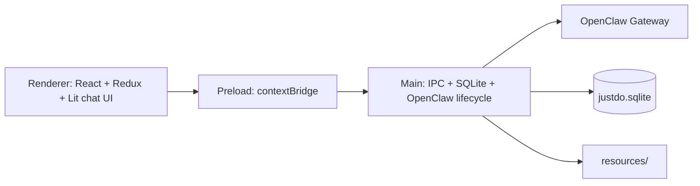

# AGENTS.md

Compact guidance for AI coding agents working in this repo. Keep this file
accurate and dense; detailed design belongs in `docs/architecture/`.

## Project Facts

JustDo is a local-first Electron + React desktop assistant. Agents execute real
tasks through OpenClaw Gateway, with durable state in SQLite and bundled skills.

- App: `v2026.8.27`
- Electron: `42.7.0`
- OpenClaw: `v2026.9.8`
- Node: `24.21.0` via `.nvmrc`; engine `>=24.16.0 <25`
- Package manager: npm
- Dev server port: `43127`
- License: MIT

## Branding

- `package.json.name` (`justdo`) is the stable internal ID; never rebrand it.
- `package.json.productName` (`JustDo`) is the external name. Read it through
  `src/shared/productMetadata.ts` / `electron-builder.config.cjs`; do not add
  hardcoded user-facing `JustDo` strings.
- `productName` must match `[A-Za-z]{1,64}`. This does not restrict user-selected
  install paths, which may contain Chinese or spaces.
- It controls installer/UI names, `<appData>/<productName>`, and
  `~/<productName lowercase>/project`; old branded directories are not migrated.
- `appId` is derived as `com.<productName lowercase>.app`; changing the
  lowercase-normalized name intentionally creates a separate OS application
  identity. Case-only changes retain the existing identity.
- Never rename `justdo://`, `justdo.sqlite`, `JUSTDO_*`,
  `--justdo-*`, `<justdo-chat>`, provider/export IDs, or source symbols/files.
  `author.name` is separate publisher metadata.
- Project task artifacts use the fixed, product-neutral `.agent-tasks/` root;
  keep browser output and Swarm batches under their respective subdirectories.

## Commands

```bash
nvm use 24
npm install
npm run dev                    # Vite only
npm run electron:dev           # Compile main + launch Electron
npm run electron:dev:openclaw  # Prepare host OpenClaw runtime + launch
npm run rebuild:electron-native

npm run lint
npm run validate:product-metadata
npm run build
npm run compile:electron
npm test                       # uses Node better-sqlite3, then restores Electron ABI
npm run format:check
npm run pack
npm run dist
npm run dist:win
npm run dist:mac
npm run dist:linux
```

Before non-trivial pushes, prefer `npm run lint && npm run build && npm test`.
For docs-only changes, run `git diff --check`.

Windows packaging uses bundled MinGit/Python runtime assets via
`scripts/runtime/setup-mingit.js` and `scripts/runtime/setup-python-runtime.js`.
The Windows Python runtime also installs the hashed lock in
`resources/python-requirements.txt` into `Lib/bundled-site-packages`.

## Architecture


```mermaid
flowchart LR
  Renderer[Renderer: React + Redux + Lit chat UI]
  Preload[Preload: contextBridge]
  Main[Main: IPC + SQLite + OpenClaw lifecycle]
  Gateway[OpenClaw Gateway]
  DB[(justdo.sqlite)]
  Resources[resources/]
  Renderer --> Preload --> Main
  Main --> Gateway
  Main --> DB
  Main --> Resources
```

- `src/main/`: Electron main process, IPC, SQLite, runtime/system access.
- `src/main/preload.ts`: only renderer bridge; keep API explicit and small.
- `src/renderer/`: browser-only React/Redux UI. No Node/Electron imports.
- `src/shared/`: pure cross-process contracts/utilities only.
- `resources/`: bundled skills, tray icons, runtime assets, manifests.
- `scripts/`: build/development tooling grouped by responsibility; see `scripts/README.md`.
  Keep new scripts in the owning module and npm command names stable.
- `scripts/theme/`: offline theme CSS generation and the Tailwind build plugin;
  Renderer theme tokens, definitions, CSS, and browser runtime stay in `src/renderer/theme/`.

Main-process domains:

- `core/`: shared constants, logging, and i18n at the root; app lifecycle in
  `app/`, window/session policies in `window/`, proxy/HTTP/TLS in `network/`,
  bundled dependencies in `runtime/`, file operations in `filesystem/`, and
  development startup/config in `development/`. Keep tests beside their modules.
- `data/`: SQLite wrapper/stores (`sqliteStore.ts`, `coworkStore.ts`, `groupStore.ts`).
- `ipc/`: app, cowork, OpenClaw, plugins, speech, security, providers, and
  scheduled-task handlers. Register each capability from its owning domain.
- `engine/`: cowork router, OpenClaw adapter, command safety, gateway types.
- `cowork/`: conversation config, model API/readiness, title generation, logging, approved plans.
- `providers/`: provider API configuration and built-in model credentials, token exchange,
  authentication coordination, and lifecycle. Gateway config projection stays in `openclaw/config/`.
- `openclaw/`: config sync, runtime, models, sessions, slash commands.
- `plugins/`: skills, MCP, hooks, extensions, marketplace.
- `scheduler/`: cron runtime and OpenClaw prompt support.

Key files:

- App/preload: `src/main/main.ts`, `src/main/preload.ts`
- Runtime: `src/main/openclaw/runtime/openclawEngineManager.ts`
- Engine: `src/main/engine/cowork/coworkEngineRouter.ts`, `src/main/engine/openclaw/openclawRuntimeAdapter.ts`
- Safety: `src/main/engine/commandSafety.ts`
- Data: `src/main/data/sqliteStore.ts`, `src/main/data/coworkStore.ts`
- Config/history: `src/main/openclaw/config/openclawConfigSync.ts`, `src/main/openclaw/sessions/`
- Chat rendering: `src/renderer/libs/openclaw-chat/`
- Settings/permissions: `src/renderer/features/settings/Settings.tsx`, `src/renderer/features/cowork/components/approvals/ExecApprovalModal.tsx`
- Scheduled tasks: `src/main/scheduler/cronJobService.ts`, `src/main/ipc/scheduledTask/`, `src/shared/scheduledTask/`
- Plugins: `src/main/plugins/skills/`, `src/main/plugins/mcp/`, `src/main/plugins/hooks/`, `src/main/plugins/extensions/`, `src/main/plugins/marketplace/`

## Current State to Remember

Redux store (`src/renderer/store/index.ts`) mounts **6 slices**:
`model`, `cowork`, `skill`, `mcp`, `scheduledTask`, `agent`.
Do not document/use unmounted slices as active state.

Account entry uses `src/main/core/app/auth/` and explicit `auth` IPC, with no
new Redux slice or SQLite table. The SDK adapter is intentionally unconfigured;
trusted SDK results are committed atomically before existing login/logout callbacks.
Manual `user_info.json` import retains native model startup and is displayed as
local credentials, not an SDK-verified login. Cookie updates preserve mtoken and
use generation/identity leases; real SDK renewal scheduling remains an integration seam.
See `docs/features/login-sdk-template.md`.

SQLite core tables in `src/main/data/sqliteStore.ts`:
`kv`, `cowork_sessions`, `cowork_external_sessions`, `cowork_external_session_tombstones`,
`cowork_session_runs`, `cowork_plan_handoffs`, `cowork_config`, `agents`, `mcp_servers`,
`cowork_run_diagnostic_events`, `cowork_run_diagnostic_coverage`,
`openclaw_hooks`, `session_groups`, `collaboration_rooms`, `collaboration_members`,
`collaboration_rounds`, `collaboration_deliveries`, `collaboration_deletions`,
`collaboration_deleted_members`, `scheduled_task_run_receipts`,
`scheduled_task_result_cleanup`, `scheduled_task_result_tombstones`.

OpenClaw owns durable message transcripts in its native SQLite store. JustDo
must not recreate a `cowork_messages`, Main-process, or Redux transcript cache.
The Renderer consumes Gateway history and live Thinking/Tool/Content directly;
Main keeps only product lifecycle, run identity, approval, and goal state.

Session context-menu diagnostics retain bounded, content-free run evidence in Main.
Only `executionSettled: true` lifecycle terminals establish whole-run outcomes;
chat final and attempt finishing are separate observations. Diagnostic reads never
start the Gateway. Persistent diagnostic storage uses closed-value metadata; exported metadata uses archive-local
identity aliases. User-requested ZIP exports additionally include credential-masked matching
log text, collected only at export time, never cached or sent to Renderer. Transcript files
are not accessed directly. On-demand `chat.history` scans the native conversation database through
the connected Gateway, retaining only bounded redacted failure excerpts in expiring report snapshots
and exports, never a transcript cache. Logs/excerpts may contain task content; review before sharing.
See `docs/features/session-diagnostics.md`.
Opening or refreshing diagnostics collects bounded safe projections from Main/Cowork/Gateway logs
and native files identified by an existing local client's structured `logs.tail.file`;
never read paths supplied by log text or Renderer. Scan discovered files in bounded chunks
without a total tail/byte/time cutoff; sample limits never stop scanning or category counts.
Report scan gaps, support progress/cancellation, and never claim deleted history is complete.
Log hints retain association/coverage and cannot override lifecycle conclusions.

The v2 built-in skill manifest also retains upstream `coding-agent` under `skills/`
and `diagnose-gateway` under `custodian-skills/` through explicit allowlists;
all other upstream skills are excluded.

Built-in skills are declared in `resources/builtin-skills.json`: **8 skills**,
all **8 enabled** by default. TypeSafe supplies a decision provider through its optional extension. The native
`decision_evaluate` tool follows `agents.defaults.decisionModel`; no separate
TypeSafe tool or skill is bundled.

OpenClaw runtime patches live in `scripts/patches/v2026.9.8/`. They are
new-version capability patches, not migrations of the historical
`scripts/patches/v2026.8.2/` files. The target directory README is the
authoritative capability-to-patch and upstream-disposition inventory.

Do **not** add compatibility, migration, or in-place upgrade logic for a local
runtime that already contains an older revision of a JustDo patch. Patch
transformers may be idempotent only for their current exact patch shape; when
they detect historical or partially applied patch markers, they must fail
clearly. Rebuild the runtime from the locked pristine OpenClaw package and
apply the current patch set instead.

The 9.6 build was never released. At the user's request, the 9.8 upgrade's
application-owned legacy SQLite migration bridge, startup gate, tests and build
assets have been removed. Do not reintroduce 9.6→9.8 schema compatibility or
automatic legacy-data migration for this upgrade. This does not remove existing
product-database initialization rules or change native OpenClaw storage ownership.
See `docs/architecture/10-data-storage.md`.

`docs/res/` was removed because no docs referenced its old image asset.

## Runtime Log Triage

- Start with the daily main log
  (`%APPDATA%/<package.json.productName>/logs/main-YYYY-MM-DD.log` on Windows)
  and `%APPDATA%/<package.json.productName>/openclaw/logs/gateway.log`.
  A user-supplied redirected development-terminal log is only a capture of
  console output, regardless of its filename, and is not the authoritative
  OpenClaw event log.
- Gateway stdout is intentionally condensed by
  `src/main/openclaw/runtime/gatewayLogFilter.ts`: thinking, assistant, and item
  streams keep only the first and last event per run/stream segment, with text
  previews capped at 80 characters. Successful `sessions.list` and `cron.list`
  polling responses remain visible for frequency and latency diagnosis.
- The condensed logs omit per-plugin `loading` lines, sensitive-schema walk
  notices, droppable chat delta notices, and periodic WebSocket tick/health
  broadcasts, plus routine `[scheduler] running event-loop-health` records.
  Scheduler failures and health warnings remain visible. Absence from the
  main/gateway log does not prove the underlying Gateway event did not occur.
- For complete WebSocket event sequences or omitted transport diagnostics,
  inspect the OpenClaw native JSON log shown by the `[gateway] log file:` line
  (typically `%TEMP%/openclaw/openclaw-YYYY-MM-DD.log` on Windows), then
  correlate by timestamp, run id, and session id.
- Do not paste or add raw native logs to commits. Check previews and surrounding
  records for credentials or sensitive user content before sharing excerpts.

## Boundaries

- Main may use Node, Electron main APIs, filesystem, SQLite, child processes.
- Login integrations and built-in model token exchange share Main's
  `core/network/macAddress.ts` (`getMacAddress`): uppercase colon-free MAC only,
  with an error when unavailable; no UUID fallback or persisted device ID.
- Terminal panels use Gateway terminal RPCs. Gateway owns PTYs and buffers;
  Main retains only window/tab ownership, native IDs, connection identity and offsets.
  Bind new chat terminals to the prepared native session; homepage terminals remain
  connection-owned. Reconnect by attach, never reopen or replay uncertain input.
- Renderer must use the preload bridge only. No privileged imports.
- Shared code must not import Electron, Node built-ins, DOM-only APIs, or process state.
- Shared contracts are grouped by domain: `agents/`, `app/`, `browser/`, `cowork/`,
  `integrations/`, `network/`, `openclaw/`, `plugins/`, `preview/`, `prompts/`,
  `providers/`, `scheduledTask/`, `security/`, and `speech/`. Keep tests and JSON
  config beside their owning modules; only product metadata stays at the root.
- `shared/openclaw/` retains native Gateway protocol and runtime contracts.
  Agent identity/settings, model identity, external-agent integration, permissions,
  prompt rules and plugin management belong to their corresponding shared domains.
  Cowork interactions and diagnostics live in `shared/cowork/interactions/` and
  `shared/cowork/diagnostics/`; plugin/tool IDs live in `shared/plugins/nativeIds.ts`.
- JustDo owns UX, persistence, permissions, packaging, app shell, and product flows.
- OpenClaw owns agent execution, Gateway capabilities, tool semantics, and skill runtime behavior.
- `openclawSkillService.ts` talks to Gateway skill APIs.
- Skill proposal review lives in `skillWorkshopService.ts` / `SkillWorkshopPanel.tsx`:
  main-owned native proposals, revision-bound decisions, no app transcript/proposal cache.
  Learning uses `/learn` directly in normal chat; the review dialog neither starts
  sessions nor changes global learning or publication policy.
- `openclawSkillFiles.ts` only extracts/copies/removes user-imported local skill files; it is not skill metadata authority.
- Browser-extension pairing/relay code lives in the OpenClaw-owned `openclaw/` baseline; side-panel chat lives in the separate `conversation-overlay/`. Keep their changes separate according to `docs/features/browser-settings-design.md`. OpenClaw upgrades replace the pairing baseline first, then reapply and review only the explicit build-time integration seams; do not fold chat behavior into relay modules.
  Product settings HTML/CSS/JS and translations also live in `conversation-overlay/`;
  compose them over upstream options and copy application PNG icons at build time.
  Keep settings in English with Automatic connection, Manual connection, Tab Access
  and Background color headings; preserve native pairing, unpair and custody safeguards across upgrades.
  Automatic relay pairing injects the product discovery transport at build time;
  keep the native bootstrap controller's opt-out, late-response and manual-priority rules intact.

## Coding Rules

- Strict TypeScript; functional React; 2-space indent, single quotes, semicolons.
- Renderer aliases: `@/` -> `src/renderer/`, `@shared/` -> `src/shared/`.
- Organize by feature/domain, not file type.
- Settings use `models/`, `browser/`, `computer/`, `speech/`, `updates/`, `integrations/`,
  `preferences/`, `runtime/`, and `usage/`; keep each area's UI, helpers, and
  tests together. `Settings.tsx` and cross-tab persistence/preview helpers stay at the root.
- Renderer plugins use `skills/`, `mcp/`, `hooks/`, `extensions/`, and
  `marketplace/`; co-locate services, types, slices, components, and tests by
  capability. `PluginsView.tsx` composes the page; `shared/` holds plugin-wide UI.
- Browser lifecycle entry points stay at `main/browser/browserAgentBridge.ts`
  and `renderer/features/browser/BrowserPanel.tsx`. Main browser operations use
  `agent/`, `downloads/`, `extension/`, `history/`, `data/`, `recording/`, `pdf/`,
  and `preview/`; Renderer uses `annotation/`, `recording/`, `intervention/`,
  `data/`, and `pdf/`. Keep process-local tests beside their modules.
- Renderer UI primitives live in `shared/components/ui/`; application startup
  presentation belongs to `app/shell/`, and plugin operation feedback belongs
  to `features/plugins/shared/`. Keep domain-only helpers beside their consumers.
- Do not split or merge directories solely to equalize file counts. Preserve
  process boundaries and independent entry points; small cohesive domains are valid.
- Application constants live in `src/renderer/app/constants.ts`; avoid a singleton
  file-type directory around them. Keep `store/index.ts`, process-local `types/`,
  and single-file feature/contract domains when they define a real ownership boundary.
- Cowork components use one level of domain folders: `chat`, `composer`,
  `sessions`, `goals`, `subagents`, `swarm-workflow`, `approvals`, `questions`,
  `display`, `preview`, `terminal`, `review`, `status`.
  Keep helpers, tests, and CSS beside their owning components; `shared` is only
  for UI/helpers reused across these folders. Keep `CoworkView.tsx` at the root.
  `display/` owns tab composition and selection; `preview/` owns file rendering
  and workspace browsing. Plan review belongs to `approvals/`. Native subtask
  graphs stay in `subagents/`; the independent Workflow plugin UI stays in
  `swarm-workflow/`. Shared graph/document styles do not own lifecycle state.
- Keep top-level `main.ts` and `preload.ts` thin.
- Large controllers keep lifecycle/state ownership in the entry class and delegate
  domain operations through explicit typed contexts. `shared/app/propertyContext.ts`
  provides live accessors: never replace them with copied state or pass the whole
  controller to a domain module. Contexts are created once per controller instance.
- Chat controller domains live beside `gateway/chat-controller.ts`; chat styles
  live in `components/justdo-chat.styles.ts`. Runtime adapter domains live beside
  `main/engine/openclaw/openclawRuntimeAdapter.ts`. Keep their behavior tests grouped
  by domain and their public entry points stable.
- Translation dictionaries in `renderer/services/i18n/` are grouped by domain,
  with both languages together; `translations.ts` only composes them. Keep key/value
  parity when moving entries.
- Avoid mutation outside intentional Redux Toolkit Immer reducers.
- Never hardcode user-visible strings; use i18n.
- Add i18n keys to both `zh` and `en`.
- Use constants for discriminants/statuses/IPC names.
- Main logs should use module prefixes like `[CronJobService]`.
- Avoid production-path renderer `console.log`.
- Never log or hardcode secrets, tokens, passwords, raw auth headers, or credential objects.

## Change Patterns

IPC:

1. Define channel constants and payload/return types.
2. Add main handler in the owning `src/main/ipc/` domain.
3. Expose the minimal preload method.
4. Update `src/renderer/types/electron.d.ts`.
5. Add tests when payload/risk is non-trivial.

Redux:

1. Create slice under the feature domain.
2. Mount it in `src/renderer/store/index.ts`.
3. Export typed selectors/actions.
4. Document it here only after mounting.

SQLite:

1. Add schema/migration/compatibility logic.
2. Add CRUD methods and indexes for real query patterns.
3. Handle existing-user compatibility.
4. Update `docs/architecture/10-data-storage.md`.
5. Add focused tests.

Bundled skills:

1. Update `resources/skills/<skill-id>/`.
2. Update `resources/builtin-skills.json`.
3. If runtime behavior changes, update `docs/architecture/07-plugin-system.md`.

Scheduled tasks:

- Touch `src/main/scheduler/`, `src/main/ipc/scheduledTask/`, and
  `src/shared/scheduledTask/` consistently.
- Test schedule parsing, persistence, manual runs, runtime mapping, and IPC payloads.

## Docs

Do not replace detailed design docs with file-path lists. Keep Mermaid diagrams
when they clarify ownership, flow, or lifecycle.

- Architecture docs: `docs/architecture/`
- Feature notes: `docs/features/`
- Runtime patch developer guide: `docs/openclaw-runtime-patches.md`
- User READMEs: `README.md`, `README_zh.md`
- Offline downloads: `docs/offline-downloads.md`. Keep all future offline-download
  instructions here, including URLs, filenames, destination paths and preparation
  commands; update them when resource versions change.

When architecture/data flow changes, update the relevant doc in the same change:
`02-architecture`, `03-process-model`, `04-cowork-system`, `05-agent-engine`,
`07-plugin-system`, `08-scheduled-tasks`, `10-data-storage`,
`15-chat-rendering`, or `16-skill-marketplace-adapter`.

## Testing

- Tests use Vitest.
- Co-located unit tests: `src/**/*.test.ts`.
- Integration/snapshot tests: `tests/**/*.test.mjs`.
- Use behavior-focused names and Arrange -> Act -> Assert.
- Use `vi.mock`, `vi.spyOn`, `vi.fn`.

## Git and PR

Use English Conventional Commits:

```text
type(scope): imperative summary
```

Common types: `feat`, `fix`, `refactor`, `chore`, `docs`, `test`, `perf`,
`ci`, `style`.

Useful scopes: `cowork`, `skills`, `scheduledTask`, `engine`, `ui`, `electron`,
`build`, `config`, `security`, `i18n`, `docs`.

Before PR:

- Review full branch history.
- Compare with release base when appropriate: `git diff release_20260625...HEAD`.
- Use `.github/PULL_REQUEST_TEMPLATE.md`.
- Push new branches with `-u`.

Independent Agent profiles are managed in Settings → Assistants. Keep the managed
roster under the application config synchronizer. Manual profile saves apply the managed config synchronizer; model-driven creation
uses Gateway agents.create/update. The application stores product-facing profile
mappings, and user conversations default to main. The opt-in assistant switch in Settings allows enabled profiles for new conversations; switching from an existing chat creates a new conversation in the same project without moving native history. OpenClaw layers the selected assistant bootstrap files with project AGENTS.md; never overwrite project rules when switching. All native profiles, including main, use stable `stateDir/agent-workspaces/<agentId>` role homes; project directories use native cwd and sessionRoot. Do not move or rewrite project role files automatically. Native agents.files APIs own role-file text.
Empty profile models inherit the application default. Disable is an application
chat-entry restriction, not native authorization revocation. See
`docs/features/assistants-and-collaboration.md` for the current P0/P1 scope and limitations.

Deleted assistant profiles retain `agents.deleted_at`, disabled identity rows and
native ownership for historical transcripts. Hide them from Settings and reject
profile mutations; do not call native agents.delete for this history-preserving
flow because it purges session indexes even with deleteFiles:false.

Persistent peer collaboration is the optional `openclaw-extensions/agent-team`
extension, disabled by default and user-toggleable. Keep its tools, native-send
hooks and skill together; do not inject a roster or collaboration instructions
on every turn. Runtime Services owns receipt history reads and blocks managed
peer sends when the extension is disabled. Config sync must preserve the user's
explicit extension state.

Swarm Workflow is the independent `openclaw-extensions/swarm-workflow` plugin, with a
per-submit composer option and a dependency graph Tab. Its Gateway service owns
the durable DAG and stage results in stateDir/swarm-workflow/flows.sqlite. It uses
plugin-owned native execution sessions, not forged spawnedBy relationships.
Do not duplicate transcripts or retry uncertain launches. No Workboard/agent-team
dependency; Workboard defaults off, preserving explicit user choices for both plugins.
Batch snapshots and attempts use the parent project's `.agent-tasks/swarm-workflow/`;
do not add compatibility or migration for the old Swarm directory layout.
See `docs/features/swarm-workflow.md`.

Local audio attachment transcription is the `openclaw-extensions/stt-local-cli`
extension (`transcribe_audio`). Config sync supplies installed Sherpa ONNX paths;
file transcription is independent of the microphone toggle. Preserve explicit
plugin disable state. The host tool is unavailable in sandboxed sessions and
respects effective filesystem policy. External audio attachments are staged in
the project before sending. See `docs/architecture/07-plugin-system.md`.

Jev evaluations use the vendored upstream `typesafe` extension. Settings → Models
→ Decision models owns the required URL/API Key, default model and activation
once configured; TypeSafe then becomes managed in the extension panel.
Sync selects `agents.defaults.decisionModel`,
using file SecretRefs in restricted `extension-secrets.json`. The documented
`serviceUrl` transport seam supports authenticated intranet System One endpoints
without redirects, environment proxies or hosted fallback. Preserve native
OpenClaw decision semantics and response validation. Users without this settings
category retain explicit extension state. See `docs/features/jev-integration.md`.

The intranet runtime excludes `anthropic`, `elevenlabs`, `github`, `kie`, `zai`,
and `novita` through `resources/openclaw-extension-prune.json`. Keep `openai` as
the protocol adapter for configured intranet speech/model/media endpoints; do not
equate the adapter with a requirement to call the public OpenAI service.
The desktop runtime also excludes `admin-http-rpc` and `file-transfer`: application
management uses Gateway WebSocket RPC, and paired-node file transfers and remote
workspace mappings are not integrated. Keep the remote file-tool deny policy.
Managed speech providers are `openai` and `tts-local-cli`.
Online speech IPC reports registered adapters and explicit configuration only;
do not add vendor model/voice presets or fallback catalogs when Gateway is unavailable.

OpenAI Provider and QuickJS Code Mode are application-managed required adapters;
keep bundled entries enabled and admitted in full/minimal/auth config sync, preserving
unrelated plugin configuration and tool permissions. Generic extension controls must
reject enable/disable, configuration and deletion. Runtime settings own Code Mode use.
Document Extraction and Web Readability Extraction remain default-enabled and
user-toggleable. Locked cards and details explain their management source.

Retain `cua-computer` in the runtime. Desktop control defaults off and is user-toggleable
in Settings → Computer control. Its single switch atomically changes the native plugin
entry and global `computer` tool admission. The extension panel locks this managed
plugin; only the Settings switch changes its enablement. Config sync keeps both aligned with that
plugin entry; preserve unrelated policies and sandbox boundaries. Use the current
conversation's image-capable model without separate computer model configuration.
Native OpenClaw owns `computer` execution and screenshots.
Keep the CUA SDK/image native loaders external during plugin precompilation. Do not
automatically allow host desktop control in sandboxed sessions. macOS still requires
the upstream app-owned driver endpoint and OS grants; retaining the plugin is not
Electron-native macOS computer-control support. See `docs/architecture/07-plugin-system.md`.

Video settings include the bundled `openclaw-extensions/video-openai`
native provider for configured OpenAI-compatible Videos endpoints.
Video, image and decision settings share the same provider/model editor; retain
provider lists, credential cards, model dialogs and explicit default selection.
Video model discovery runs only on user request against the configured endpoint.
Require an explicit base URL and model ID, with optional API Key; keep its
`models.providers.video-openai` endpoint and file SecretRefs isolated from
chat/image providers. Native `video_generate` owns tool admission, input loading
and delivery; the plugin implements multipart submission, polling and bounded
content download under one deadline, without public defaults, redirects or
uncertain submission retries. Kie/Z.AI/Novita contracts remain supported only
when installed; these plugins are not bundled. Config sync clears unavailable
video selections and registrations without publishing credentials. The bundled
video adapter is always application-managed; enable it only with a valid default
video model, and disable it when that selection is cleared or absent. It has no
preset model for automatic discovery. Retain explicit state for other installed
providers, which may share non-video capabilities. Incomplete inventory must not enable
new providers, but explicit clears still disable an existing managed video adapter.
Do not add compatibility or migration for the retired custom video configuration.
See `docs/features/model-management.md`.
