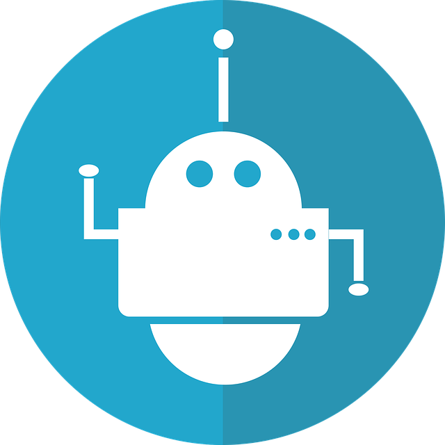
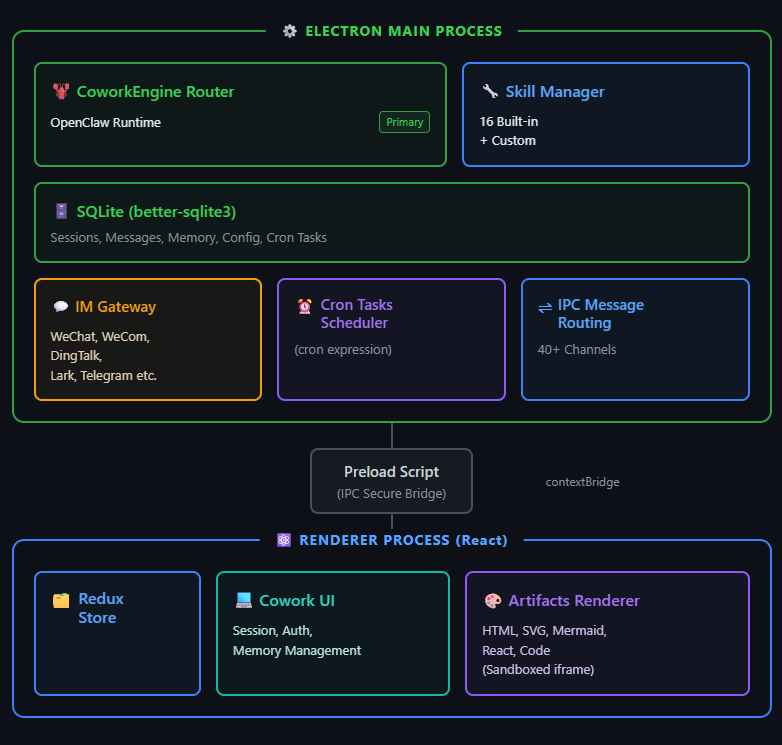

# GucciAI — All-in-One Personal Assistant Agent

<p align="center">
  
</p>

<p align="center">
  <strong>A 24/7 personal assistant Agent that gets things done</strong>
</p>

<p align="center">
  <a href="LICENSE"></a>
  
  <br>
  
  
  
</p>

<p align="center">
  English · <a href="README_zh.md">中文</a>
</p>

---

**GucciAI** is an all-in-one personal assistant Agent. It works around the clock to handle your everyday tasks — data analysis, making presentations, generating videos, writing documents, searching the web, sending emails, scheduling tasks, and more.

At its core is **Cowork mode** — it executes tools, manipulates files, and runs commands in a local or sandboxed environment, all under your supervision.

## Key Features

| Feature | Description |
|---------|-------------|
| **All-in-One Productivity** | Data analysis, PPT creation, video generation, document writing, web search, email — covers the full range of daily work |
| **Local + Sandbox Execution** | Run tasks directly on your machine or in an OpenClaw sandbox environment |
| **Built-in Skills** | Office documents (Word/Excel/PPT/PDF), browser automation, data analysis, diagram creation, web search, AI art, skill creation — 17 skills bundled |
| **Windows Python Runtime** | Windows packages bundle a ready-to-use Python interpreter; dependencies install on demand |
| **Scheduled Tasks** | Create recurring tasks via conversation or GUI — daily news digests, inbox cleanup, periodic reports |
| **Persistent Memory** | Automatically extracts preferences and facts from conversations, remembers across sessions |
| **IM Integration** | Remote control via IM platforms (Telegram, Discord) — in development with UI placeholders |
| **Subagents** | Delegate sub-sessions for parallel or scoped task execution — tracked in `cowork_subagents` |
| **Permission Gating** | All tool invocations require explicit user approval before execution |
| **Cross-Platform** | macOS (Intel + Apple Silicon), Windows, Linux desktop |
| **Local Data** | SQLite storage keeps your chat history, sessions, and configuration on your device |

## Architecture Overview

<p align="center">
  
</p>

## Getting Started

### Prerequisites

- **Node.js** >= 24 < 25
- **npm**

### Development

```bash
git clone https://github.com/liangxhao/GucciAI.git
cd GucciAI
git checkout dev
npm install

# Start development (Vite + Electron with hot reload)
npm run electron:dev

# With OpenClaw agent engine (auto clones & builds on first run)
npm run electron:dev:openclaw
```

Dev server runs at `http://localhost:5175` with HMR. OpenClaw source defaults to `../openclaw`.

<details>
<summary>OpenClaw Environment Variables</summary>

| Variable | Description | Default |
|----------|-------------|---------|
| `OPENCLAW_SRC` | OpenClaw source path | `../openclaw` |
| `OPENCLAW_FORCE_BUILD` | Force rebuild | — |
| `OPENCLAW_SKIP_ENSURE` | Skip version checkout | — |

</details>

### Production Build & Packaging

```bash
npm run build           # TypeScript + Vite bundle
npm run lint            # ESLint check

# Platform-specific installers (output to release/)
npm run dist:mac        # macOS .dmg
npm run dist:win        # Windows .exe (NSIS)
npm run dist:linux      # Linux .AppImage & .deb
```

Desktop packages bundle a prebuilt OpenClaw runtime — no manual setup needed.

## Core Systems

### Cowork System

An AI working session system powered by OpenClaw, autonomously completing complex tasks.

| Mode | Description |
|------|-------------|
| `auto` | Automatically selects execution context |
| `local` | Direct local execution, full speed |

All tool invocations (filesystem, terminal, network) require explicit approval via `CoworkPermissionModal`.

### Skills System (17 bundled skills)

| Skill | Category |
|-------|----------|
| `docx` / `xlsx` / `pptx` / `pdf` | Office documents |
| `multi-search-engine` | Multi-engine web search |
| `playwright` / `agent-browser` | Browser automation |
| `data-analysis` | Data processing & visualization |
| `diagram-generator` | Diagrams & flowcharts |
| `algorithmic-art` | Generative AI art |
| `taskflow` | Multi-step workflows |
| `mcp-builder` | MCP server creation |
| `self-improvement` | Agent self-optimization |
| `ontology` | Domain knowledge modeling |
| `theme-factory` | UI theme generation |
| `healthcheck` | System diagnostics |

Custom skills can be created via `skill-creator` and hot-loaded at runtime. User-imported skills stored in `userData/openclaw/state/skills/`. Bundled skills take priority on ID conflict.

### Scheduled Tasks

Create recurring tasks via natural language or GUI using OpenClaw's cron engine. Examples: daily news collection, weekly reports, email cleanup. Managed by `cronJobService.ts`.

### Persistent Memory

| File | Purpose |
|------|---------|
| `MEMORY.md` | Durable facts and preferences |
| `memory/YYYY-MM-DD.md` | Daily notes |
| `USER.md` | User profile |
| `SOUL.md` | Agent personality |

## Technical Details

### Process Model

Electron strict process isolation with IPC communication.

| Process | Responsibilities |
|---------|------------------|
| **Main** (`src/main/`) | Window lifecycle, SQLite, OpenClaw engine, 40+ IPC handlers |
| **Preload** (`src/main/preload.ts`) | `contextBridge` API, `cowork` namespace |
| **Renderer** (`src/renderer/`) | React 18 + Redux + Tailwind, all UI logic |

### Directory Structure

```
src/
├── main/           # Electron main process (IPC handlers)
│   ├── main.ts     # Entry point
│   ├── preload.ts  # contextBridge security layer
│   └── libs/       # Engine manager, skill manager, MCP bridge, cowork store, config sync
├── renderer/       # React frontend
│   ├── App.tsx     # Root component
│   ├── components/ # Cowork UI, Settings, scheduled tasks, quick actions
│   └── store/      # Redux slices (agent, skill, mcp, cowork, scheduledTask, quickAction)
├── scheduledTask/  # Cron engine, migration, policies
└── shared/         # Platform & provider constants
resources/skills/   # 17 bundled skill definitions (Gateway-managed)
```

### Cowork Engine Architecture

Cowork sessions use a Gateway-based process lifecycle (`idle → downloading → installing → ready → running`). History reconciliation via `historyReconciler.ts`, subagent dispatch via `subagentGateway.ts`.

### Data Storage

Local SQLite (`gucciai.sqlite`): app config, sessions, messages, subagents, memories, agents, MCP servers, scheduled tasks.

### Tech Stack

| Layer | Technology |
|-------|-----------|
| Framework | Electron 41 |
| Frontend | React 18 + TypeScript |
| Build | Vite 5 |
| Styling | Tailwind CSS 3 |
| State | Redux Toolkit |
| AI Engine | OpenClaw (runtime download, auto-install, Gateway lifecycle) |
| Storage | better-sqlite3 |

### Security

- Context isolation enabled, node integration disabled
- Permission gating for sensitive tool invocations
- Optional OpenClaw sandbox
- HTML sandbox, DOMPurify, Mermaid strict mode
- Enterprise config sync support via `enterpriseConfigSync.ts`

## Configuration

### App & Cowork

- **Working Directory** — Root for Agent operations
- **System Prompt** — Customize Agent behavior
- **Execution Mode** — `auto` / `local`

### OpenClaw Integration

Version pinned in `package.json`:

```json
{
  "openclaw": {
    "version": "v2026.6.5",
    "repo": "https://github.com/openclaw/openclaw.git"
  }
}
```

To update: change version in `package.json`, run build, commit.

### Internationalization

English and Chinese supported. Switch in Settings panel.

## Development

- TypeScript strict mode, functional components + Hooks
- 2-space indentation, single quotes, semicolons
- Components: `PascalCase`; functions/variables: `camelCase`
- Tailwind CSS preferred

### Testing

```bash
npm test              # All tests (Vitest)
npm test -- logger    # Specific module
```

## Contributing

1. Fork → Create feature branch → Commit → Push → Open PR
2. Follow conventional commits: `type: short summary`

## License

[MIT License](LICENSE)

## Acknowledgments

Developed with reference to [LobsterAI](https://github.com/netease-youdao/LobsterAI). Thanks to the LobsterAI team for their pioneering work.
