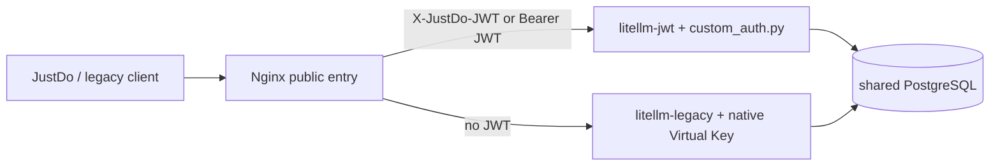

# LiteLLM JWT、Team 与旧版 30 天兼容

本目录把新版与旧版客户端明确分成两条认证数据面：

| 客户端      | 请求凭证                                | LiteLLM 授权主体                   | 有效期                         |
| ----------- | --------------------------------------- | ---------------------------------- | ------------------------------ |
| 新版 JustDo | 登录服务签发的短期 JWT                  | 长期存在的 User + 唯一 JustDo Team | JWT 最长 5 分钟；Team 长期有效 |
| 未升级旧版  | 历史共享值注册成一枚 legacy Virtual Key | 专用 legacy Team                   | 30 天，禁止续期                |

新版用户**不会创建 Virtual Key**。Team 的模型白名单、预算、blocked、TPM 和 RPM
由 LiteLLM 数据库长期保存；短期 JWT 只证明“当前请求是谁”。

这里需要特别区分两个数据库：

- JustDo 本地 SQLite 的内置 provider `apiKey` 始终为空，Renderer 也拿不到 JWT；
- OpenClaw 配置只保存指向登录交接文件的 SecretRef，不保存 JWT 明文；
- LiteLLM PostgreSQL 会长期保存 User、Team 和成员关系，并保存那**一枚旧版兼容
  Virtual Key 的 SHA-256 哈希及 30 天过期时间**。这是服务端兼容状态，不是新版客户端凭证。

JWT 仍是 bearer token：被抓包后，在剩余的几分钟内仍可能被重放。该方案消除了可长期
盗用的固定 Key，并把泄露窗口限制为最多 5 分钟。若要求“抓到也一次都不能重放”，下一步
必须引入 DPoP、mTLS 或设备私钥签名；这需要登录服务登记设备公钥，不是单独改 LiteLLM
Hook 就能完成。

## 为什么是两个 LiteLLM 实例

LiteLLM 原生 JWT Authentication 是 Enterprise 功能；OSS 自定义认证可以运行 Team
通用权限检查，但“自定义认证与原生 Virtual Key 在同一个实例并存”的 auto 模式同样是
Enterprise 功能。因此默认部署不假设许可证，而是：



带 JWT 的请求只会进入 `litellm-jwt`，JWT 无效时不会回退到旧 Key。无 JWT 的管理请求和
旧版请求进入 `litellm-legacy`。两个实例不直接暴露端口，只有 Nginx `gateway` 暴露
`${LITELLM_PORT:-9108}`。

参考 LiteLLM 官方文档：[Custom Authentication](https://docs.litellm.ai/docs/proxy/custom_auth)、
[Virtual Keys](https://docs.litellm.ai/docs/proxy/virtual_keys)、
[Team Budgets](https://docs.litellm.ai/docs/proxy/team_budgets)、
[Model Access](https://docs.litellm.ai/docs/proxy/model_access)。

## 1. 登录服务签发 JWT

登录服务必须使用非对称算法签名并提供 HTTPS JWKS。默认只启用 `RS256`。每枚 JWT 必须
包含：

- `kid`：JWT header 中的签名公钥 ID；
- `iss`：与 `JUSTDO_JWT_ISSUER` 完全一致；
- `aud`：包含 `JUSTDO_JWT_AUDIENCE`；
- `sub`：LiteLLM `user_id`，并与 `X-User-Account` 一致；
- `iat`、`exp`：整数时间戳，`exp - iat <= 300` 秒；
- `jti`：每枚 token 唯一。

登录组件以原子替换方式维护：

```json
{
  "X-JustDo-JWT": "<short-lived-jwt>",
  "X-User-Account": "user-001",
  "X-Cookie": "<existing-login-cookie>"
}
```

文件位置仍是 `%APPDATA%/<productName>/huawei/user_info.json`。`X-Cookie` 保持现有用途，
LiteLLM Hook 不读取它。登录服务应在 JWT 剩余 30–60 秒时写入新 token；JustDo 会监视
文件变化，在 Main 内存中重新校验、刷新模型列表，并调用 OpenClaw `secrets.reload` 原子
替换运行时 SecretRef。若没有及时续签，JustDo 在 token 到期前移除内置 provider，拒绝
继续使用旧 token。

Hook 会再次用 JWKS 校验签名、算法、issuer、audience、时间与 claims；客户端本地解析不
构成信任边界。

## 2. 配置服务

复制示例环境文件并设置随机密码、全新的 LiteLLM master key 与 JWT issuer：

```powershell
Copy-Item .env.example .env
docker compose up -d
docker compose ps
```

模型可继续通过 LiteLLM UI 或共享数据库配置。`config.yaml` 是 legacy 实例配置；
`config.jwt.yaml` 加载 `custom_auth.py` 并开启：

```yaml
custom_auth_run_common_checks: true
```

不能删除该开关，否则自定义认证成功后不会执行 Team 的模型、预算和限流检查。

## 3. 创建 Team 和用户分组

推荐编辑 `groups.json`（可从 `groups.example.json` 复制）后运行幂等脚本：

```powershell
$env:LITELLM_MASTER_KEY = '<new-server-master-key>'
python .\provision_groups.py .\groups.json --base-url http://127.0.0.1:9108
```

脚本会：

1. 创建或更新每个长期 Team，并设置 `metadata.justdo_managed=true`；
2. 创建 `internal_user`，明确设置 `auto_create_key=false`；
3. 把每个用户放入且只放入一个非 legacy 的 JustDo-managed Team；
4. 不生成、不输出任何新用户 Virtual Key。

一个用户不能同时出现在两个配置组中。Team 的 `models` 必须显式填写；可同时设置
`max_budget`、`budget_duration`、`tpm_limit`、`rpm_limit` 和 `blocked`。

也可在 LiteLLM UI 中完成同样操作：创建 Team、设置 Models/Budget/Limits，然后创建
Internal User 并添加为 Team member。使用 UI 时仍需把 Team metadata 标记为
`{"justdo_managed": true}`；Hook 只承认恰好一个此类非 legacy Team，避免模糊授权。

## 4. 旧版客户端只兼容 30 天

若历史客户端使用的固定值也是当前 `LITELLM_MASTER_KEY`，必须先生成新 master key、修改
`.env` 并重启服务。绝不能直接把 master key 当 legacy Key；否则它仍拥有管理权限。
旧值也不能恰好是三段 base64url 的 JWT 外形；网关会把这种 Authorization 明确送入新版
JWT 数据面，避免无效或伪造 JWT 回退到旧版认证。

随后只在当前 PowerShell 进程中放入旧值：

```powershell
$env:LITELLM_MASTER_KEY = '<new-server-master-key>'
$env:JUSTDO_LEGACY_KEY = '<exact-old-client-key>'
python .\provision_groups.py .\groups.json `
  --base-url http://127.0.0.1:9108 `
  --legacy-key-env JUSTDO_LEGACY_KEY
Remove-Item Env:JUSTDO_LEGACY_KEY
```

脚本把该值登记成 alias 为 `justdo-legacy-client` 的**唯一 legacy Virtual Key**，并强制：

- `allowed_routes=["llm_api_routes", "/models", "/v1/models"]`，只开放推理与客户端模型发现；
- 只继承 legacy Team 的模型列表；
- `duration=30d`。

第一次补迁移一个原先无过期时间的同 alias Key 时，脚本会加上 30 天期限；之后重复运行
不会延长已有期限。已经过期或过期时间超过迁移窗口时脚本直接拒绝。

旧 Key 若短于 16 字符，可在迁移时把 `MINIMUM_CUSTOM_KEY_LENGTH` 临时降到旧值长度，完成
后立刻恢复为 16 并重启。该设置不会改变现有 Key。

30 天后 LiteLLM 会自动拒绝过期 Key。确认旧版流量结束后再删除记录：

```powershell
$body = @{ key_aliases = @('justdo-legacy-client') } | ConvertTo-Json
Invoke-RestMethod -Method Post -Uri http://127.0.0.1:9108/key/delete `
  -Headers @{ Authorization = "Bearer $env:LITELLM_MASTER_KEY" } `
  -ContentType 'application/json' -Body $body
```

然后可移除 `legacy_client` 配置以及 `litellm-legacy` 路由。未升级客户端从此按计划停止模型
服务。

## 5. 验证

```powershell
$env:PYTHONPATH = 'E:\workspace\litellm'
E:\workspace\litellm\.venv\Scripts\python.exe -m pytest -q `
  .\test_custom_auth.py .\test_provision_groups.py
docker compose config
```

上线前至少验证：同一 Team 只能看到自己的模型；跨 Team 模型返回 403；blocked、预算和
RPM/TPM 生效；篡改签名、issuer、audience、`sub` 或账号 header 均返回 401/403；带无效
JWT 的请求不回退 legacy；旧 Key 到期后返回 401；任何日志中都不出现 JWT、Cookie、
Authorization 或 master key 明文。
