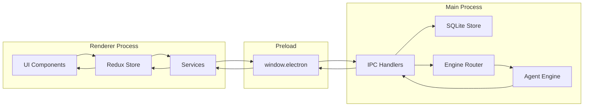

# GucciAI 系统架构设计

## 1. 架构概述

GucciAI 采用 Electron 的严格进程隔离架构，所有跨进程通信通过 IPC 实现。系统分为三层：UI 层（Renderer）、服务层（IPC + Redux）、主进程层（Main + Agent Runtime）。

### 1.1 分层架构

```
┌─────────────────────────────────────────────────────────────┐
│                     Renderer Process                         │
│                     (React 18 + Redux)                       │
│                                                             │
│  ┌─────────────────┐  ┌─────────────────┐  ┌─────────────┐  │
│  │   CoworkView    │  │    Settings     │  │  IMSettings │  │
│  └─────────────────┘  └─────────────────┘  └─────────────┘  │
│                                                             │
│  ┌─────────────────────────────────────────────────────┐    │
│  │                   Redux Store                        │    │
│  │  coworkSlice | artifactSlice | imSlice | agentSlice │    │
│  └─────────────────────────────────────────────────────┘    │
│                                                             │
│  ┌─────────────────────────────────────────────────────┐    │
│  │                   Services                           │    │
│  │  coworkService | apiService | imService | i18n      │    │
│  └─────────────────────────────────────────────────────┘    │
├─────────────────────────────────────────────────────────────┤
│                     Preload Script                           │
│               (contextBridge + window.electron)              │
│                                                             │
│  cowork.* | openclaw.engine.* | im.* | store.* | artifact.* │
├─────────────────────────────────────────────────────────────┤
│                     Main Process                             │
│                     (Node.js + SQLite)                       │
│                                                             │
│  ┌─────────────────┐  ┌─────────────────┐  ┌─────────────┐  │
│  │   SQLiteStore   │  │   CoworkStore   │  │   IMStore   │  │
│  └─────────────────┘  └─────────────────┘  └─────────────┘  │
│                                                             │
│  ┌─────────────────────────────────────────────────────┐    │
│  │               Agent Engine Router                    │    │
│  │  OpenClawRuntimeAdapter (主要) | ClaudeRuntimeAdapter │    │
│  └─────────────────────────────────────────────────────┘    │
│                                                             │
│  ┌─────────────────────────────────────────────────────┐    │
│  │                  IM Gateways                         │    │
│  │     Multi-platform Bot Integration (Planned)        │    │
│  └─────────────────────────────────────────────────────┘    │
│                                                             │
│  ┌─────────────────────────────────────────────────────┐    │
│  │              OpenClaw Engine Manager                 │    │
│  │  runtime lifecycle | config sync | gateway bridge   │    │
│  └─────────────────────────────────────────────────────┘    │
├─────────────────────────────────────────────────────────────┤
│                     Agent Runtime                            │
│                    (OpenClaw Gateway)                        │
│                                                             │
│  Tool Execution | Memory | Sandbox | WebSocket              │
└─────────────────────────────────────────────────────────────┘
```

### 1.2 数据流向



## 2. 核心模块

### 2.1 Renderer Process（渲染进程）

**职责**：所有 UI 展示和业务逻辑。

**关键目录**：
```
src/renderer/
├── App.tsx                    # 根组件
├── types/                     # TypeScript 类型定义
│   ├── cowork.ts              # Cowork 类型
│   ├── agent.ts               # Agent 类型
│   ├── im.ts                  # IM 类型
│   └── chat.ts                # Chat 类型
├── store/slices/              # Redux slices
│   ├── coworkSlice.ts         # Cowork 状态
│   ├── artifactSlice.ts       # Artifact 状态
│   ├── imSlice.ts             # IM 状态
│   └── agentSlice.ts          # Agent 状态
├── services/                  # 业务服务
│   ├── cowork.ts              # Cowork IPC 服务
│   ├── api.ts                 # LLM API 服务
│   ├── im.ts                  # IM 服务
│   └── i18n.ts                # 国际化
└── components/                # UI 组件
    ├── cowork/                # Cowork 组件
    ├── artifacts/             # Artifact 渲染器
    ├── im/                    # IM 组件
    ├── agent/                 # Agent 组件
    ├── skills/                # Skills 组件
    └── Settings.tsx           # 设置面板
```

### 2.2 Main Process（主进程）

**职责**：系统级操作、数据持久化、Agent 引擎管理、IM 网关。

**关键目录**：
```
src/main/
├── main.ts                    # 入口，IPC handlers
├── preload.ts                 # contextBridge API
├── sqliteStore.ts             # SQLite 数据库
├── coworkStore.ts             # Cowork CRUD
├── skillManager.ts            # Skills 管理
├── agentManager.ts            # Agent 管理
├── autoLaunchManager.ts       # 自动启动
├── trayManager.ts             # 系统托盘
├── im/                        # IM 网关
│   ├── index.ts               # IM 入口
│   ├── imStore.ts             # IM 数据存储
│   ├── imGatewayManager.ts    # 网关状态
│   ├── imCoworkHandler.ts     # IM → Cowork 路由
│   ├── imChatHandler.ts       # IM 聊天处理
│   └── imScheduledTaskHandler.ts # 定时任务
│   └── types.ts               # IM 类型
└── libs/                      # 核心库
    ├── agentEngine/           # Agent 引擎
    │   ├── coworkEngineRouter.ts    # 引擎路由
    │   ├── openclawRuntimeAdapter.ts # OpenClaw 适配
    │   └── claudeRuntimeAdapter.ts  # 内置适配
    ├── openclawEngineManager.ts     # OpenClaw 管理
    ├── openclawConfigSync.ts        # 配置同步
    ├── openclawChannelSessionSync.ts # Channel 同步
    ├── coworkMemoryExtractor.ts     # 记忆提取
    ├── coworkMemoryJudge.ts         # 记忆判断
    └── skillSecurity/               # Skills 安全
```

### 2.3 Preload Script

**职责**：安全桥接，通过 contextBridge 暴露 API。

**暴露的 API 命名空间**：
```typescript
window.electron = {
  store: {
    get, set, delete
  },
  cowork: {
    startSession, continueSession, stopSession,
    getSession, listSessions, deleteSession,
    getConfig, setConfig,
    respondToPermission,
    onStreamMessage, onStreamMessageUpdate,
    onStreamPermissionRequest, onStreamComplete, onStreamError
  },
  openclaw: {
    engine: {
      getStatus, start, stop, install,
      onProgress, onStatusChange
    }
  },
  im: {
    getStatus, getConfig, setConfig,
    // 多实例 API
    addDingTalkInstance, deleteDingTalkInstance,
    setDingTalkInstanceConfig,
    // ... 其他平台类似
  },
  agent: {
    list, create, update, delete,
    getBindings, setBindings
  },
  artifact: {
    parse, render
  },
  scheduledTask: {
    list, create, update, delete,
    getMeta, setMeta
  },
  shortcut: {
    register, unregister
  }
}
```

## 3. IPC 通信设计

### 3.1 IPC Channel 常量

所有 IPC channel 名称定义在常量中，避免裸字符串：

```typescript
// src/shared/ipcChannels.ts
export const IpcChannel = {
  // Cowork
  CoworkStartSession: 'cowork:startSession',
  CoworkContinueSession: 'cowork:continueSession',
  CoworkStopSession: 'cowork:stopSession',
  CoworkGetSession: 'cowork:getSession',
  CoworkListSessions: 'cowork:listSessions',
  CoworkDeleteSession: 'cowork:deleteSession',
  CoworkRespondToPermission: 'cowork:respondToPermission',
  CoworkGetConfig: 'cowork:getConfig',
  CoworkSetConfig: 'cowork:setConfig',
  
  // OpenClaw Engine
  OpenClawEngineGetStatus: 'openclaw:engine:getStatus',
  OpenClawEngineStart: 'openclaw:engine:start',
  OpenClawEngineStop: 'openclaw:engine:stop',
  OpenClawEngineInstall: 'openclaw:engine:install',
  
  // IM
  ImGetStatus: 'im:getStatus',
  ImGetConfig: 'im:getConfig',
  ImSetConfig: 'im:setConfig',
  ImDingTalkInstanceAdd: 'im:dingtalk:instance:add',
  // ...
} as const;
```

### 3.2 流式事件

Cowork 使用 IPC事件进行实时双向通信：

| 事件 | 方向 | 用途 |
|------|------|------|
| `cowork:stream:message` | Main → Renderer | 新消息添加 |
| `cowork:stream:messageUpdate` | Main → Renderer | 流式内容更新 |
| `cowork:stream:permissionRequest` | Main → Renderer | 工具审批请求 |
| `cowork:stream:complete` | Main → Renderer | 会话完成 |
| `cowork:stream:error` | Main → Renderer | 执行错误 |
| `openclaw:engine:onProgress` | Main → Renderer | 安装进度 |
| `openclaw:engine:onStatusChange` | Main → Renderer | 引擎状态变化 |

### 3.3 请求-响应模式

```typescript
// Renderer 调用
const session = await window.electron.cowork.startSession({
  workingDirectory: '/path/to/work',
  prompt: '分析这份 Excel'
});

// Main 处理
ipcMain.handle(IpcChannel.CoworkStartSession, async (event, params) => {
  const sessionId = uuid();
  // 创建会话...
  return { sessionId, status: 'running' };
});
```

## 4. 安全设计

### 4.1 进程隔离

- **Context Isolation**：启用，Renderer 无法直接访问 Node.js
- **Node Integration**：禁用，Renderer 无 require 能力
- **Sandbox**：启用，Renderer 运行在沙箱环境

### 4.2 Preload 安全

```typescript
// preload.ts
contextBridge.exposeInMainWorld('electron', {
  cowork: {
    startSession: (params) => ipcRenderer.invoke('cowork:startSession', params),
    // 仅暴露必要的 API，不暴露 ipcRenderer 本身
  }
});
```

### 4.3 权限控制

所有工具调用需要用户明确授权：

```typescript
// 权限请求事件
{
  type: 'permissionRequest',
  sessionId: 'xxx',
  toolName: 'write_file',
  toolInput: { path: '/path/to/file', content: '...' },
  riskLevel: 'medium' // low/medium/high
}
```

### 4.4 工作目录边界

文件操作限制在工作目录内：

```typescript
// 检查路径是否在工作目录内
function isWithinWorkingDirectory(path: string, workingDir: string): boolean {
  const resolved = resolve(path);
  const workingResolved = resolve(workingDir);
  return resolved.startsWith(workingResolved);
}
```

## 5. 扩展机制

### 5.1 Skills 技能扩展

Skills 定义在 `SKILLs/` 目录，通过 `skills.config.json` 配置：

```json
{
  "skills": [
    { "id": "web-search", "enabled": true },
    { "id": "docx", "enabled": true },
    { "id": "xlsx", "enabled": true }
  ]
}
```

### 5.2 Agent 自定义

用户可创建自定义 Agent，绑定特定的 Skills：

```typescript
interface AgentConfig {
  id: string;
  name: string;
  systemPrompt: string;
  skills: string[];        // 启用的 Skills
}
```

### 5.3 MCP 服务器

支持 Model Context Protocol 服务器扩展：

```typescript
interface MCPServerConfig {
  id: string;
  name: string;
  command: string;
  args: string[];
  env: Record<string, string>;
}
```

## 6. 配置管理

### 6.1 配置存储

| 配置类型 | 存储位置 | 表/Key |
|----------|----------|---------|
| 应用配置 | SQLite kv | `kv.key = 'appConfig'` |
| Cowork 配置 | SQLite | `cowork_config` 表 |
| IM 配置 | SQLite | `im_config` 表 |
| Agent 配置 | SQLite | `agents` 表 |
| Skills 配置 | 文件 | `SKILLs/skills.config.json` |
| OpenClaw 版本 | package.json | `openclaw.version` |

### 6.2 国际化

支持中文（默认）和英文：

```typescript
// i18n.ts
const translations = {
  zh: {
    coworkTitle: '工作助手',
    startSession: '开始会话',
    // ...
  },
  en: {
    coworkTitle: 'Work Assistant',
    startSession: 'Start Session',
    // ...
  }
};
```

语言自动检测系统 locale，用户可在设置中切换。

## 7. 关键设计决策

### 7.1 OpenClaw 作为主要引擎

**决策**：采用 OpenClaw 作为主要 Agent 引擎。

**理由**：
- OpenClaw 提供完整的 Agent 运行时能力
- 支持沙箱执行、持久化记忆、工具调用
- WebSocket 实时通信
- 版本管理清晰

**备选方案**：内置 Claude Agent SDK 适配器（已弃用，代码保留但不再推荐）。

### 7.2 SQLite 本地存储

**决策**：使用 SQLite 作为唯一数据存储。

**理由**：
- 单文件，易于备份和迁移
- 支持复杂查询
- better-sqlite3 性能优秀
- 无需额外服务

### 7.3 IPC 双通道设计

**决策**：Cowork 会话和 OpenClaw 引擎使用独立 IPC 通道。

**理由**：
- `cowork:*` 专注于会话业务
- `openclaw:engine:*` 专注于引擎生命周期
- 解耦会话和引擎管理
- 前端无需感知底层引擎

### 7.4 IM 多实例支持

**决策**：支持多机器人实例配置（功能规划中）。

**理由**：
- 企业用户可能需要多个机器人（客服、技术支持等）
- 每个实例独立配置和状态