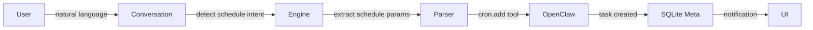
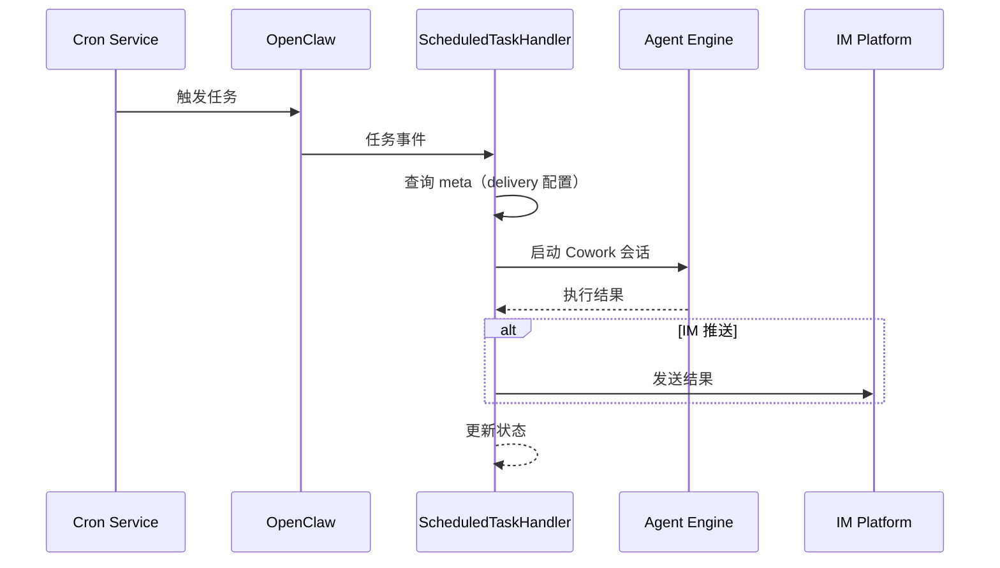

# GucciAI 定时任务系统设计

## 1. 概述

GucciAI 支持定时任务功能，用户可以通过自然语言或 GUI 创建定时任务，Agent 会按计划自动执行。任务结果可推送到桌面或 IM 平台。

### 1.1 创建方式

| 方式 | 说明 | 示例 |
|------|------|------|
| **自然语言** | 通过对话创建 | "每天早上 9 点给我推送科技新闻" |
| **GUI** | 在定时任务面板手动配置 | 设置 Cron 表达式和任务内容 |

### 1.2 典型场景

| 场景 | 说明 |
|------|------|
| 新闻收集 | 每日自动聚合行业新闻 |
| 邮件清理 | 定期检查邮箱并整理 |
| 数据报告 | 定期生成业务分析报告 |
| 内容监控 | 定期检查网站变化 |
| 工作提醒 | 定时生成待办或会议提醒 |

## 2. 数据模型

### 2.1 任务定义

定时任务定义存储在 OpenClaw 的管理目录中：

```typescript
interface ScheduledTaskDefinition {
  id: string;                // 任务 ID
  name: string;              // 任务名称
  description: string;       // 任务描述
  cron: string;              // Cron 表达式
  prompt: string;            // 执行时的 prompt
  workingDirectory: string;  // 工作目录
  agentId?: string;          // 绑定的 Agent ID
  timezone?: string;         // 时区
  enabled: boolean;          // 是否启用
}
```

### 2.2 任务元数据

元数据存储在 SQLite，用于追踪任务来源和绑定关系：

```sql
CREATE TABLE scheduled_task_meta (
  task_id TEXT PRIMARY KEY,
  origin TEXT,               -- 'conversation' | 'gui' | 'migration'
  origin_session_id TEXT,    -- 来源会话 ID
  origin_message_id TEXT,    -- 来源消息 ID
  agent_id TEXT,             -- 绑定的 Agent ID
  im_delivery TEXT,          -- IM 推送配置 JSON
  created_at INTEGER,
  updated_at INTEGER
);
```

### 2.3 任务常量

```typescript
// src/scheduledTask/constants.ts
export const ScheduleKind = {
  At: 'at',
  Every: 'every',
} as const;

export const PayloadKind = {
  Prompt: 'prompt',
  Workflow: 'workflow',
} as const;

export const DeliveryMode = {
  Cowork: 'cowork',
  IM: 'im',
  Both: 'both',
} as const;

export const SessionTarget = {
  Main: 'main',
  Isolated: 'isolated',
} as const;

export const WakeMode = {
  Direct: 'direct',
  Bridge: 'bridge',
} as const;

export const OriginKind = {
  Conversation: 'conversation',
  GUI: 'gui',
  Migration: 'migration',
} as const;

export const BindingKind = {
  Agent: 'agent',
  IMConversation: 'im_conversation',
} as const;

export const TaskStatus = {
  Pending: 'pending',
  Running: 'running',
  Completed: 'completed',
  Failed: 'failed',
} as const;

export const IpcChannel = {
  ScheduledTaskList: 'scheduledTask:list',
  ScheduledTaskCreate: 'scheduledTask:create',
  ScheduledTaskUpdate: 'scheduledTask:update',
  ScheduledTaskDelete: 'scheduledTask:delete',
  ScheduledTaskGetMeta: 'scheduledTask:getMeta',
  ScheduledTaskSetMeta: 'scheduledTask:setMeta',
} as const;
```

## 3. 任务生命周期

### 3.1 任务创建



### 3.2 任务执行



### 3.3 Session Key 格式

| 类型 | 格式 | 示例 |
|------|------|------|
| Cron 任务 | `cron:{taskId}` | `cron:task-001` |
| Agent 绑定 | `agent:{agentId}:cron:{taskId}` | `agent:bot1:cron:task-001` |

## 4. 任务管理

### 4.1 ScheduledTaskHandler

**文件**：`src/main/ipcHandlers/scheduledTask/handlers.ts`

```typescript
class ScheduledTaskHandler {
  // 处理定时任务执行
  async handleTaskExecution(taskId: string): Promise<void> {
    // 1. 获取任务元数据
    const meta = this.getTaskMeta(taskId);

    // 2. 获取任务定义
    const definition = await this.getTaskDefinition(taskId);

    // 3. 启动 Cowork 会话
    const sessionKey = this.buildSessionKey(taskId, meta);

    await this.engineRouter.startSession(sessionKey, definition.prompt);

    // 4. 等待执行完成
    const result = await this.waitForCompletion(sessionKey);

    // 5. 处理推送（规划中：IM 推送）
    // 待 IM 集成后实现结果推送功能
  }

  // 获取任务元数据
  private getTaskMeta(taskId: string): ScheduledTaskMeta {
    return this.db.get(`
      SELECT * FROM scheduled_task_meta WHERE task_id = ?
    `, [taskId]);
  }

  // 构建 Session Key
  private buildSessionKey(taskId: string, meta: ScheduledTaskMeta): string {
    if (meta.agentId) {
      return `agent:${meta.agentId}:cron:${taskId}`;
    }
    return `cron:${taskId}`;
  }
}
```

### 4.2 IPC Handlers

```typescript
// src/main/ipcHandlers/scheduledTask/handlers.ts

async function handleScheduledTaskList(): Promise<ScheduledTaskDefinition[]> {
  // 查询 OpenClaw 任务列表
  const tasks = await openclawClient.cron.list();
  
  // 附加元数据
  for (const task of tasks) {
    const meta = getTaskMeta(task.id);
    task.meta = meta;
  }
  
  return tasks;
}

async function handleScheduledTaskCreate(
  params: CreateTaskParams
): Promise<ScheduledTaskDefinition> {
  // 1. 创建任务定义
  const task: ScheduledTaskDefinition = {
    id: uuid(),
    name: params.name,
    description: params.description,
    cron: params.cron,
    prompt: params.prompt,
    workingDirectory: params.workingDirectory,
    agentId: params.agentId,
    enabled: true,
  };
  
  // 2. 在 OpenClaw 创建任务
  await openclawClient.cron.add(task);
  
  // 3. 存储元数据
  setTaskMeta(task.id, {
    origin: OriginKind.GUI,
    agentId: params.agentId,
    imDelivery: params.imDelivery,
  });
  
  return task;
}

async function handleScheduledTaskUpdate(
  taskId: string,
  params: UpdateTaskParams
): Promise<void> {
  // 更新 OpenClaw 任务
  await openclawClient.cron.update(taskId, params);
  
  // 更新元数据
  if (params.agentId || params.imDelivery) {
    updateTaskMeta(taskId, {
      agentId: params.agentId,
      imDelivery: params.imDelivery,
    });
  }
}

async function handleScheduledTaskDelete(taskId: string): Promise<void> {
  // 删除 OpenClaw 任务
  await openclawClient.cron.remove(taskId);
  
  // 删除元数据
  deleteTaskMeta(taskId);
}
```

## 5. 自然语言创建

### 5.1 意图检测

Agent 通过内置工具识别定时任务意图：

```typescript
// 提取定时任务参数
interface ExtractedSchedule {
  kind: ScheduleKind;        // 'at' | 'every'
  time: string;              // 时间描述
  interval?: string;         // 间隔描述
  prompt: string;            // 任务内容
}

// 示例
"每天早上 9 点给我推送科技新闻"
→ {
  kind: 'every',
  time: '09:00',
  interval: 'daily',
  prompt: '推送科技新闻'
}

"提醒我 5 分钟后开会"
→ {
  kind: 'at',
  time: '+5min',
  prompt: '提醒开会'
}
```

### 5.2 Cron 表达式生成

```typescript
// 将自然语言时间转换为 Cron 表达式
function scheduleToCron(schedule: ExtractedSchedule): string {
  if (schedule.kind === 'every') {
    switch (schedule.interval) {
      case 'daily':
        return `${schedule.time.split(':')[1]} ${schedule.time.split(':')[0]} * * *`;
      case 'weekly':
        // 每周一
        return `${schedule.time.split(':')[1]} ${schedule.time.split(':')[0]} * * 1`;
      case 'hourly':
        return `0 * * * *`;
      default:
        // 自定义间隔
        return parseCustomInterval(schedule.interval);
    }
  }
  
  if (schedule.kind === 'at') {
    // 单次任务
    const targetTime = parseAtTime(schedule.time);
    return formatOneTimeCron(targetTime);
  }
  
  throw new Error('无法解析时间');
}
```

### 5.3 cron.add 工具

Agent 通过 `cron.add` 工具创建任务：

```typescript
interface CronAddInput {
  name: string;              // 任务名称
  cron: string;              // Cron 表达式
  prompt: string;            // 任务 prompt
  workingDirectory?: string; // 工作目录
  timezone?: string;         // 时区
}

// 工具实现
async function executeCronAdd(input: CronAddInput): Promise<{ taskId: string }> {
  const taskId = uuid();
  
  // 创建任务
  await openclawClient.cron.add({
    id: taskId,
    name: input.name,
    cron: input.cron,
    prompt: input.prompt,
    workingDirectory: input.workingDirectory || defaultWorkingDir,
    timezone: input.timezone,
    enabled: true,
  });
  
  // 存储元数据（标记来源为 conversation）
  setTaskMeta(taskId, {
    origin: OriginKind.Conversation,
    originSessionId: currentSessionId,
    originMessageId: currentMessageId,
  });
  
  return { taskId };
}
```

## 6. IM 推送配置

### 6.1 推送选项

任务执行结果可推送到 IM：

```typescript
interface IMDeliveryConfig {
  platform: IMPlatform;      // IM 平台
  conversationId: string;    // IM 会话 ID
  format?: 'full' | 'summary'; // 推送格式
}
```

### 6.2 后台投递

定时任务通常没有活跃的 Accumulator，使用后台投递机制：

```typescript
// 确保后台 Accumulator
function ensureBackgroundAccumulator(
  sessionId: string,
  platform: IMPlatform,
  conversationId: string
): MessageAccumulator {
  const accumulator: MessageAccumulator = {
    messages: [],
    resolve: (text) => {
      // 后台投递，不等待
      sendAsyncReply(platform, conversationId, text);
    },
    reject: (error) => {
      sendAsyncReply(platform, conversationId, `[执行失败: ${error.message}]`);
    },
    timeoutId: setTimeout(() => {
      // 超时处理
      const partial = formatPartialReply(accumulator.messages);
      sendAsyncReply(platform, conversationId, partial);
    }, ACCUMULATOR_TIMEOUT_MS),
    backgroundDelivery: {
      conversationId,
      platform,
    },
  };
  
  return accumulator;
}
```

### 6.3 提醒守卫

`imReplyGuard.ts` 确保提醒内容准确：

```typescript
// 检测提醒相关的 misleading 响应
function checkReminderGuard(response: string, toolCalls: ToolCall[]): string {
  // 检测模式
  const reminderPatterns = [
    '我会提醒你',
    '已创建定时任务',
    '已设置提醒',
    'I will remind you',
    'Reminder created',
  ];
  
  const hasReminderPattern = reminderPatterns.some(p => 
    response.toLowerCase().includes(p.toLowerCase())
  );
  
  // 检查是否有失败的 cron.add 调用
  const failedCronAdds = toolCalls.filter(
    tc => tc.name === 'cron.add' && tc.status === 'failed'
  );
  
  if (hasReminderPattern && failedCronAdds.length > 0) {
    // 替换为正确信息
    return `抱歉，定时任务创建失败：${failedCronAdds[0].error}。请稍后重试。`;
  }
  
  return response;
}
```

## 7. GUI 管理

### 7.1 Scheduled Tasks 面板

**文件**：`src/renderer/components/scheduledTasks/ScheduledTaskPanel.tsx`

```typescript
function ScheduledTaskPanel() {
  const [tasks, setTasks] = useState<ScheduledTask[]>([]);
  
  useEffect(() => {
    loadTasks();
  }, []);
  
  const loadTasks = async () => {
    const taskList = await window.electron.scheduledTask.list();
    setTasks(taskList);
  };
  
  const createTask = async (params: CreateTaskParams) => {
    await window.electron.scheduledTask.create(params);
    loadTasks();
  };
  
  const deleteTask = async (taskId: string) => {
    await window.electron.scheduledTask.delete(taskId);
    loadTasks();
  };
  
  const toggleTask = async (taskId: string, enabled: boolean) => {
    await window.electron.scheduledTask.update(taskId, { enabled });
    loadTasks();
  };
  
  return (
    <div className="scheduled-task-panel">
      <div className="task-list">
        {tasks.map(task => (
          <div key={task.id} className="task-entry">
            <span className="task-name">{task.name}</span>
            <span className="task-cron">{cronstrue.toString(task.cron)}</span>
            <Toggle
              checked={task.enabled}
              onChange={(checked) => toggleTask(task.id, checked)}
            />
            <button onClick={() => deleteTask(task.id)}>删除</button>
          </div>
        ))}
      </div>
      
      <button onClick={() => setShowCreateModal(true)}>创建任务</button>
      
      {showCreateModal && (
        <CreateTaskModal
          onCreate={createTask}
          onClose={() => setShowCreateModal(false)}
        />
      )}
    </div>
  );
}
```

### 7.2 创建任务 Modal

```typescript
function CreateTaskModal({ onCreate, onClose }: Props) {
  const [name, setName] = useState('');
  const [cron, setCron] = useState('');
  const [prompt, setPrompt] = useState('');
  const [imDelivery, setImDelivery] = useState<IMDeliveryConfig | null>(null);
  
  const handleSubmit = () => {
    onCreate({
      name,
      cron,
      prompt,
      workingDirectory: coworkConfig.workingDirectory,
      imDelivery,
    });
    onClose();
  };
  
  return (
    <Modal>
      <input
        placeholder="任务名称"
        value={name}
        onChange={(e) => setName(e.target.value)}
      />
      
      <input
        placeholder="Cron 表达式（如 0 9 * * *）"
        value={cron}
        onChange={(e) => setCron(e.target.value)}
      />
      
      <p className="cron-human">
        {cronstrue.toString(cron)}
      </p>
      
      <textarea
        placeholder="任务内容（Agent 执行的 prompt）"
        value={prompt}
        onChange={(e) => setPrompt(e.target.value)}
      />
      
      <IMDeliverySelector
        value={imDelivery}
        onChange={setImDelivery}
      />
      
      <button onClick={handleSubmit}>创建</button>
      <button onClick={onClose}>取消</button>
    </Modal>
  );
}
```

## 8. Cron 服务管理

### 8.1 CronJobServiceManager

**文件**：`src/main/ipcHandlers/scheduledTask/cronJobServiceManager.ts`

```typescript
class CronJobServiceManager {
  private cronService: CronService | null;
  
  // 启动 Cron 服务
  async start(): Promise<void> {
    if (this.cronService) return;
    
    this.cronService = new CronService();
    
    // 注册任务执行回调
    this.cronService.on('task.triggered', (taskId) => {
      this.handleTaskTrigger(taskId);
    });
    
    await this.cronService.start();
  }
  
  // 停止 Cron 服务
  async stop(): Promise<void> {
    if (this.cronService) {
      await this.cronService.stop();
      this.cronService = null;
    }
  }
  
  // 处理任务触发
  private async handleTaskTrigger(taskId: string): Promise<void> {
    console.log(`[Cron] Task triggered: ${taskId}`);
    
    const handler = new ImScheduledTaskHandler();
    await handler.handleTaskExecution(taskId);
  }
}
```

## 9. 关键文件清单

| 文件 | 职责 |
|------|------|
| `src/scheduledTask/constants.ts` | 任务常量定义 |
| `src/scheduledTask/enginePrompt.ts` | Agent prompt 模板 |
| `src/main/im/imScheduledTaskHandler.ts` | 任务执行处理 |
| `src/main/ipcHandlers/scheduledTask/handlers.ts` | IPC handlers |
| `src/main/ipcHandlers/scheduledTask/cronJobServiceManager.ts` | Cron 服务管理 |
| `src/main/ipcHandlers/scheduledTask/helpers.ts` | 辅助函数 |
| `src/renderer/components/scheduledTasks/ScheduledTaskPanel.tsx` | GUI 面板 |
| `src/renderer/components/scheduledTasks/CreateTaskModal.tsx` | 创建 Modal |