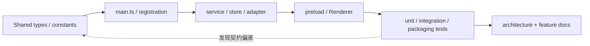

# JustDo 工程文档

本文档集描述 `v2026.8.12` 的实际实现。内容于 2026-08-22 按源代码、构建配置、SQLite schema、IPC 合约和测试重新核对；`docs/releases/` 是发布记录，不属于本轮架构重写范围。

## 阅读约定

- “权威”指某类数据或行为最终由哪个组件决定，而不是哪个界面暂时持有副本。
- 文件路径均相对仓库根目录。代码移动后，应同步修正文档中的入口和数据流，而不是只修链接。
- `package.json.name` 的 `justdo` 是稳定内部标识；用户可见产品名来自 `package.json.productName`，由 `src/shared/productMetadata.ts` 和 `electron-builder.config.cjs` 读取。
- OpenClaw Gateway 版本由 `package.json.openclaw.version` 固定为 `v2026.8.1`。运行时补丁位于 `scripts/patches/v2026.8.1/`，补丁目录 README 是补丁清单的最终依据。
- 设计/计划类文件也以当前代码状态为基线，明确区分“已实现”“保留约束”和“尚未实现”，不能把历史提案写成现状。

## 当前系统事实

| 项目          | 当前值                             | 权威来源                                 |
| ------------- | ---------------------------------- | ---------------------------------------- |
| 应用版本      | `v2026.8.12`                       | `package.json.version`                   |
| Electron      | `^42.6.2`（42.6 系列）             | `package.json`、lockfile                 |
| OpenClaw      | `v2026.8.1`                        | `package.json.openclaw`                  |
| Node.js       | `>=24.15.0 <25`                    | `package.json.engines`、`.nvmrc`         |
| 包管理器      | npm                                | `package-lock.json`、scripts             |
| Vite 开发端口 | `43127`                            | `package.json.devServer.port`            |
| Renderer 状态 | 6 个 Redux slice                   | `src/renderer/store/index.ts`            |
| 内置 Skills   | 8 个，全部默认启用                 | `resources/builtin-skills.json`          |
| 本地数据库    | SQLite/WAL，文件名 `justdo.sqlite` | `src/main/data/sqliteStore.ts`           |
| Agent 执行    | OpenClaw Gateway                   | `src/main/engine/`、`src/main/openclaw/` |

## 推荐阅读顺序

1. [产品与系统总览](architecture/01-overview.md)：产品边界、用户能力和核心不变量。
2. [系统架构](architecture/02-architecture.md)：进程、模块、依赖方向和启动/退出生命周期。
3. [进程模型与 IPC](architecture/03-process-model.md)：Renderer、Preload、Main、Gateway 的通信边界。
4. [Cowork 系统](architecture/04-cowork-system.md) 与 [Agent Engine](architecture/05-agent-engine.md)：会话、执行、目标续跑、模型和 Gateway 生命周期。
5. 按领域阅读插件、定时任务、存储、安全、聊天渲染等专题。

## 架构文档

| 文档                                                                                     | 解决的问题                               | 主要代码依据                                         |
| ---------------------------------------------------------------------------------------- | ---------------------------------------- | ---------------------------------------------------- |
| [01-overview](architecture/01-overview.md)                                               | 产品是什么、谁负责什么                   | `package.json`、`src/main/main.ts`、Renderer feature |
| [02-architecture](architecture/02-architecture.md)                                       | 系统如何分层、启动和协作                 | `src/main/`、`src/renderer/`、`src/shared/`          |
| [03-process-model](architecture/03-process-model.md)                                     | IPC/事件如何跨进程传递                   | `src/main/preload.ts`、`src/main/ipc/`               |
| [04-cowork-system](architecture/04-cowork-system.md)                                     | 会话、消息、目标、subagent 如何运行      | `src/main/engine/`、cowork UI/IPC                    |
| [05-agent-engine](architecture/05-agent-engine.md)                                       | OpenClaw 如何启动、配置、连接和恢复      | `src/main/openclaw/`、runtime adapter                |
| [07-plugin-system](architecture/07-plugin-system.md)                                     | Skill、MCP、Hook、Extension、Marketplace | `src/main/plugins/`、plugins UI                      |
| [08-scheduled-tasks](architecture/08-scheduled-tasks.md)                                 | 原生 cron 与应用内结果收件箱             | scheduler、scheduled-task IPC/UI                     |
| [10-data-storage](architecture/10-data-storage.md)                                       | SQLite schema、Store、迁移和权威边界     | `src/main/data/`                                     |
| [11-security-model](architecture/11-security-model.md)                                   | 信任边界、权限、文件/网络/命令安全       | main core、IPC、permission coordinator               |
| [12-tech-stack](architecture/12-tech-stack.md)                                           | 依赖、构建、打包和运行时资产             | `package.json`、构建脚本                             |
| [13-pure-frontend-design](architecture/13-pure-frontend-design.md)                       | “薄前端”具体意味着什么                   | Renderer、Gateway adapter                            |
| [14-openclaw-frontend-boundary-plan](architecture/14-openclaw-frontend-boundary-plan.md) | JustDo 与 OpenClaw 的所有权判定          | config sync、Gateway APIs、stores                    |
| [15-chat-rendering](architecture/15-chat-rendering.md)                                   | 历史、实时流、工具卡和 Markdown          | `src/renderer/libs/openclaw-chat/`                   |
| [16-skill-marketplace-adapter](architecture/16-skill-marketplace-adapter.md)             | Marketplace 适配与安装事务               | marketplace contract/service                         |
| [Gateway capability matrix](architecture/openclaw-gateway-capability-matrix.md)          | 能力由 Gateway 还是本地实现              | adapter、IPC、patch tests                            |

编号 06 和 09 当前没有文档；不要为了补齐编号创建无实际主题的占位文件。

## 功能与实现审计

`docs/features/` 保存跨多个架构域的功能说明、实现审计与历史方案的当前化结论。文件名中保留日期或 `plan` 不表示内容仍停留在规划阶段；每篇开头必须声明当前状态。

| 主题                          | 文档                                                                                          |
| ----------------------------- | --------------------------------------------------------------------------------------------- |
| 内置模型认证生命周期          | [authentication-builtin-model-lifecycle](features/authentication-builtin-model-lifecycle.md)  |
| 浏览器模式、扩展配对和诊断    | [browser-settings-design](features/browser-settings-design.md)                                |
| Chat 端到端审计               | [chat-message-flow-review](features/chat-message-flow-review-2026-07-26.md)                   |
| Chat timeline 重构现状        | [chat-message-timeline-refactor-plan](features/chat-message-timeline-refactor-plan.md)        |
| 当前版本能力快照              | [v2026.8.12 当前实现状态](features/current-state-v2026.8.10.md)                               |
| Execution plan timeline       | [openclaw-execution-plan-ui](features/openclaw-execution-plan-ui-implementation-plan.md)      |
| 权限管理与 fail-closed 约束   | [openclaw-permission-management](features/openclaw-permission-management-remediation-plan.md) |
| 薄前端重构状态                | [openclaw-thin-frontend](features/openclaw-thin-frontend-refactor-plan.md)                    |
| 出站 Header 代理              | [outbound-header-proxy](features/outbound-header-proxy-analysis-and-redesign.md)              |
| 定时任务应用内结果            | [scheduled-task-results](features/scheduled-task-in-app-results-implementation-plan.md)       |
| Subagent 重试与完成通知一致性 | [subagent-model-retry](features/subagent-model-retry-and-announce-consistency-plan.md)        |
| Agent runtime 参数            | [subagent-runtime-settings](features/subagent-runtime-settings-audit.md)                      |
| Thinking stream               | [thinking-stream](features/thinking-stream-implementation.md)                                 |

## Runtime Patch 文档

[OpenClaw Runtime Patch Guide](patches/openclaw-patch-guide.md) 说明补丁来源、顺序、验证、升级和故障定位。具体能力对应哪个补丁，必须以 `scripts/patches/v2026.8.1/README.md` 与 manifest/测试为准，旧版本目录仅用于追溯。

## 文档维护契约

代码变更满足下列任一条件时，必须在同一 change 中更新相应文档：

- 进程职责、IPC namespace、Gateway 方法或事件语义变化；
- SQLite 表、字段、索引、迁移或数据权威变化；
- 会话/目标/审批/定时任务/插件的生命周期变化；
- Renderer chat pipeline、历史窗口、身份或 reconciliation 变化；
- OpenClaw 版本、patch 顺序、运行时打包资产或验证脚本变化；
- 产品名、安装路径、默认 workspace、内部稳定标识的规则变化。

文档修改至少运行 `git diff --check`。涉及路径、链接或代码符号时，还应检查 Markdown 中引用的本地路径是否存在；涉及行为变更时运行对应 Vitest，非平凡提交建议执行 `npm run lint && npm run build && npm test`。

## 详细度验收标准

本文档集的目标不是提供“源码目录导览”，而是让没有参与实现的人能够据此完成设计审查、故障定位和安全修改。每篇专题文档应按主题适用性覆盖以下内容：

1. **范围与非目标**：说明文档解决什么问题，以及容易混淆但不属于该组件的职责。
2. **权威与所有权**：指出 Gateway、Main、SQLite、Shared、Renderer 中谁拥有最终事实，其他副本是缓存、投影、receipt 还是 optimistic state。
3. **代码地图**：列出 composition root、核心 service、shared contract、IPC/preload、Renderer consumer 和对应测试；不能只列一个目录。
4. **数据结构与约束**：说明关键字段、枚举、默认值、上限、identity、索引或 schema compatibility。
5. **正常调用链**：至少描述一条 UI/调用方到权威实现再返回的完整路径，复杂流程使用 Mermaid。
6. **生命周期或状态机**：覆盖初始化、工作态、终态、清理、重连、应用重启和并发调用。
7. **失败语义**：区分 validation、admission、transport、runtime、持久化和展示失败，说明是 fail closed、重试、回滚还是可诊断降级。
8. **安全边界**：说明 credential、文件路径、命令、网络、HTML、IPC 等输入在哪一层验证或清洗。
9. **测试证据**：把关键不变量映射到现有测试；若缺测试，要明确写成缺口，不能用“已有实现”掩盖。
10. **变更清单与已知限制**：告诉维护者新增字段/能力时要同步哪些层，并区分当前交付、基础设施和未来工作。

并非所有文档都需要机械地使用十个同名章节。例如技术栈文档更应强调构建产物和版本锁定，安全文档更应强调威胁、控制和剩余风险。但仅有愿景、文件路径和用户可见能力列表，不满足“详细”要求。

## 从代码更新文档的方法

彻底更新专题文档时按以下证据顺序工作：

- 先用 `rg` 找到实际注册和调用，不因文件名存在就认定功能已接入。
- 从 shared type、runtime payload 和 SQLite DDL 提取精确字段，不凭旧文档转述。
- 检查 success path 之外的 catch、timeout、cleanup、restart 和 compatibility 分支。
- 读取测试确认维护者真正依赖的不变量；测试与实现冲突时先报告冲突，不能择一美化。
- 最后检查 UI 是否实际消费该能力。只有 service/type 而没有 composition/consumer 的功能应标为基础设施。

## 代码变更到文档的路由

| 代码区域或变化                              | 最少需要复核的文档                                                                      |
| ------------------------------------------- | --------------------------------------------------------------------------------------- |
| `src/main/main.ts`、preload、IPC namespace  | `02-architecture`、`03-process-model`、当前状态                                         |
| Cowork router/adapter/session/goal/subagent | `04-cowork-system`、`05-agent-engine`、capability matrix 和相关 feature audit           |
| OpenClaw config/runtime/patch               | `05-agent-engine`、`14-openclaw-frontend-boundary-plan`、patch guide、capability matrix |
| SQLite table/store/migration                | `10-data-storage` 及拥有该数据的专题                                                    |
| Skill/MCP/Hook/Extension/Marketplace        | `07-plugin-system`；Marketplace 还需 `16-skill-marketplace-adapter`                     |
| Cron job/run/receipt                        | `08-scheduled-tasks`、scheduled-task results feature                                    |
| Chat identity/history/reducer/rendering     | `15-chat-rendering` 及三篇 chat/thinking/plan 审计                                      |
| Permission/approval/file/network policy     | `11-security-model` 及 permission/proxy/browser 专题                                    |
| 构建、运行时资产、版本、平台                | `12-tech-stack`、patch guide、当前状态                                                  |

## 文档审查反例

- 写“支持某能力”但没有指出注册入口、consumer 和失败时的用户结果。
- 把 `interface`、未挂载 Redux slice、空 provider 列表或未调用 lifecycle 当成完整功能。
- 只描述当前 happy path，不描述应用重启、Gateway 断线、重复事件或部分写入。
- 用源文件路径替代设计解释，或复制大段源码而不提炼不变量。
- 为了显得完整而填入源码无法证明的版本、数量、默认值或安全承诺。
- 修改旧文件名中的版本号导致外部链接失效；兼容文件名可以保留，但正文必须声明实际版本。

## 全量审计清单

每次大规模文档刷新结束前，应生成并人工检查全部非 release Markdown 清单，确认：

- 每个文件都被重新核对，而不是只更新索引或高频专题；
- `docs/releases/` 没有被架构重写改动；
- 所有相对 Markdown 链接可解析，显式代码路径存在；
- 版本、表数量、slice 数量、内置 skill 数量和 patch 序列来自当前权威文件；
- 计划类文档逐项标明 implemented / retained constraint / not implemented；
- `git diff --check` 和 Prettier 通过，且没有覆盖用户无关改动。
