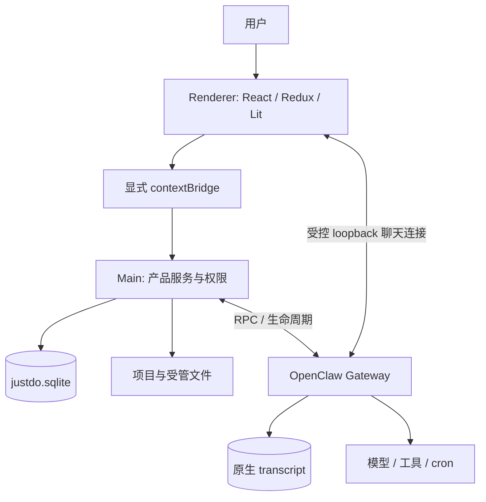
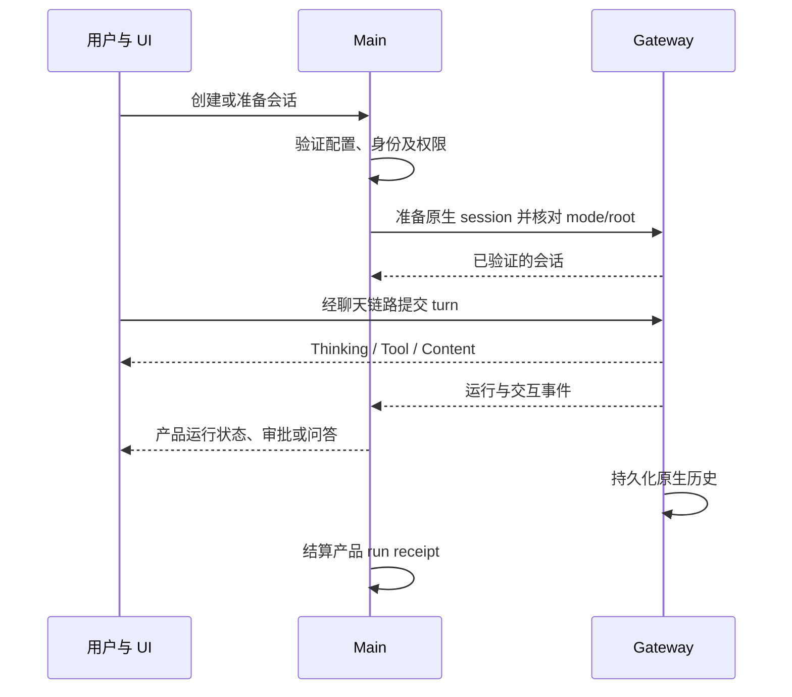

# 产品与系统总览

本页按 2026-09-24 的源码组织现行架构。应用版本 `v2026.8.27`，OpenClaw `v2026.9.6`；依赖版本、数量和能力摘要集中维护在[当前实现状态](../features/current-state-v2026.8.10.md)。

## 1. 产品如何工作

用户在桌面会话中提出任务、提供附件并选择项目目录、模型和权限。应用准备原生会话后，由 OpenClaw 调用模型和工具。用户可以查看执行、处理审批或问题、审核计划、停止任务，再从原生历史继续。

普通用户会话固定归属 main。设置中的长期助手提供可复用身份及角色文件；启用可选协作扩展后，模型可为当前任务准备助手会话。子任务委派、平级协作、定时任务属于不同执行关系，界面分别展示。

“本地优先”表示桌面壳、产品数据库、配置、项目与受管运行时在本机。它不保证离线推理：模型、MCP、插件和工具的联网行为取决于用户配置与权限。

## 2. 进程与通信

Renderer 运行在浏览器权限域，不能导入 Node/Electron 或直接打开 SQLite。preload 是系统能力入口。聊天控制器通过该入口获得 Gateway 连接信息，再直接消费历史与实时流；连接凭据不得进入普通业务状态、日志或持久存储。

Main 管理 Gateway 子进程、配置同步、数据库、文件授权、审批和应用生命周期。Gateway 拥有执行与消息语义，Main adapter 负责映射身份、协调产品状态。[系统架构](02-architecture.md)说明组合关系，[进程模型](03-process-model.md)说明跨进程合约。

## 3. 数据由谁负责

| 数据                                     | 权威                  | 应用中的用途               |
| ---------------------------------------- | --------------------- | -------------------------- |
| 消息、工具结果、原生任务与 run           | Gateway               | Renderer 历史和实时投影    |
| 会话标题、分组、项目目录、模型与期望权限 | 产品 SQLite           | 导航、发送准备、恢复       |
| Goal 内容、状态、预算                    | Gateway session       | 目标卡与续跑判断           |
| Goal 自动续跑阶段                        | Main 协调器及持久快照 | 等待输入、重试、停止与恢复 |
| 助手档案、成员、投递元数据               | 产品 SQLite           | 配置投影、任务归属与协作图 |
| 助手角色文件                             | 原生 agents.files     | 编辑、冲突检测与运行身份   |
| Cron 定义与运行历史                      | Gateway               | 任务管理与结果同步         |
| 结果未读、删除补偿记录                   | 产品 SQLite           | 应用内收件箱               |
| Skill 可用性与运行状态                   | Gateway skills API    | 插件列表与操作反馈         |

`justdo.sqlite` 不保存 `cowork_messages`。Renderer 的历史窗口和乐观消息是可重建显示状态；协作消息正文按原生回执读取，不加入投递表。SQLite 事务无法回滚 Gateway 或文件系统操作，跨边界流程需要幂等身份和补偿记录。

## 4. 一次任务的生命周期

首轮及产品控制动作也可经 Main router 发送，具体路径见 [Cowork](04-cowork-system.md)。无论发送方是谁，都不能绕过 Main 的会话准备与权限收敛。主运行结束不一定意味着任务全部结束，还需考虑原生活动子任务及 Goal 续跑阶段。

停止、断线和重启的语义不同：停止是显式取消；断线需要与 Gateway 对账；完整应用重启使用运行时 app-start boundary。同一应用进程内重启 Gateway 则遵循原生恢复机制，不能仅靠本地旧 running 字段自动重发。

## 5. 功能扩展的边界

插件页统一管理 Skill、MCP、Hook 和 Extension。文件导入不等于运行可用，运行状态仍需原生 API 核对。Marketplace 是业务服务适配接口，仓库默认没有市场 provider。

浏览器扩展分为 OpenClaw 配对/relay 基线与独立 conversation-overlay，前者升级不能覆盖后者的聊天功能。嵌入式页面、操作演示、侧栏对话的权限和生命周期见[浏览器设计](../features/browser-settings-design.md)。

本地语音模型按需安装；附件转录与麦克风开关独立。Windows 命令沙盒约束工具进程，不能代替 Electron Renderer 的隔离。详见[插件系统](07-plugin-system.md)和[安全模型](11-security-model.md)。

## 6. 产品标识与文件位置

`package.json.name=justdo` 是稳定内部 ID，`productName` 是外部名称。`src/shared/productMetadata.ts` 与打包配置派生 UI、安装器、`<appData>/<productName>`、默认 `~/<productName lowercase>/project` 及 `com.<productName lowercase>.app`。

改变小写归一化后的产品名会形成不同 OS 应用身份，旧品牌目录不自动迁移。内部协议与标识 `justdo://`、`justdo.sqlite`、`JUSTDO_*`、`.justdo-tasks`、`--justdo-*`、`<justdo-chat>` 不随品牌改名。产品名只允许 1–64 个英文字母；用户选择的安装或项目路径允许中文和空格。

## 7. 修改前的检查点

- 更改协议时同步 shared、Main handler、preload、Renderer 类型及消费方。
- 更改持久数据时处理旧数据库、事务、索引和失败恢复，并更新[存储设计](10-data-storage.md)。
- 更改运行时能力时先检查原生实现与当前补丁清单，从 pristine 包重建；不兼容重写旧补丁产物。
- 更改聊天显示时验证历史、实时、重连和乱序事件；不引入新的消息权威。
- 文档中的功能“已接入”与“真实模型、平台安装验证通过”分别记录，不能互相替代。
