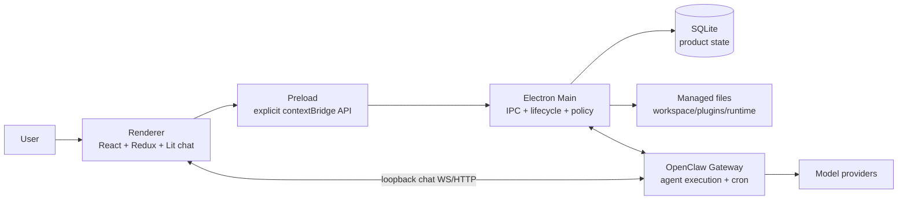
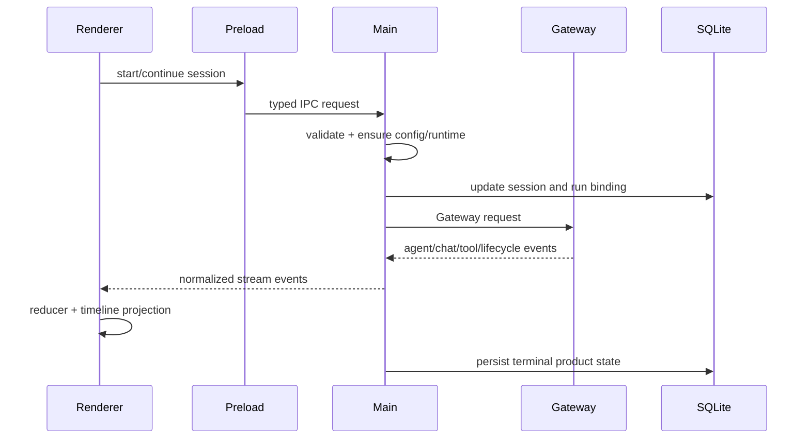
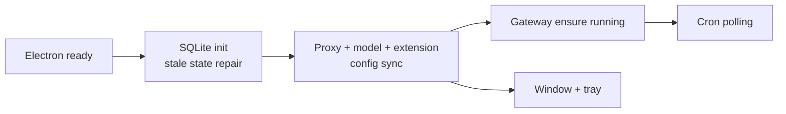

# JustDo 产品与系统总览

本文按 `v2026.8.12` 代码重写，描述 JustDo 当前已实现的产品能力、系统边界和不可破坏的工程约束。它是入口文档，不替代后续领域文档。

## 1. 产品定位

JustDo 是 local-first 的 Electron 桌面助手。用户在桌面 UI 中创建长期或一次性任务，选择模型、workspace 与权限模式；应用把 Agent 执行委托给随应用管理的 OpenClaw Gateway，并在本地持久化产品状态、会话索引、运行记录、插件配置和定时任务结果。

“local-first”在本项目中表示：

- 应用壳、配置、SQLite 数据库、用户导入的插件文件和默认 workspace 位于本机；
- Renderer 不直接访问 Node.js、SQLite 或文件系统。聊天控制器是明确例外：它通过受控 preload API 取得本地 Gateway 的 port/token，并直连 loopback WebSocket/HTTP；token 不得进入 Redux、日志或持久化；
- 模型请求是否离开本机取决于用户配置的 provider；local-first 不等同于离线模型；
- Agent 执行事实、工具语义、原生 cron 和 Gateway session/history 由 OpenClaw 负责；
- JustDo 负责把这些能力组织成桌面产品，包括权限、导航、状态恢复、错误呈现和打包。

## 2. 当前版本基线

| 维度              | 当前实现                                                           |
| ----------------- | ------------------------------------------------------------------ |
| 应用              | `v2026.8.12`                                                       |
| OpenClaw runtime  | `v2026.8.2`，按平台安装/同步、bundle、patch、prune 后打包          |
| Electron          | 42.6 系列                                                          |
| Node.js           | 24.15+ 且小于 25                                                   |
| UI                | React 18 + Redux Toolkit + Tailwind；聊天核心是 Lit custom element |
| Main persistence  | `better-sqlite3`，WAL 模式                                         |
| Gateway transport | 本地 WebSocket/RPC，由 Main 管理端口、token 与生命周期             |
| 测试              | Vitest；源码单测与 `tests/` 中 runtime/packaging 集成测试          |

## 3. 产品标识与目录

`package.json.name = justdo` 是稳定内部 ID，`productName` 是外部品牌。两者不能混用。

- 用户可见名称、安装器名称、`<appData>/<productName>` 和默认 `~/<productName lowercase>/project` 由 `src/shared/productMetadata.ts` 统一派生。
- `appId` 是 `com.<productName lowercase>.app`。仅改大小写不改变归一化后的 OS identity；改归一化值会形成另一应用身份。
- `justdo://`、`justdo.sqlite`、`JUSTDO_*`、`.justdo-tasks`、`--justdo-*`、`<justdo-chat>` 和代码符号属于兼容性接口，不随品牌改名。
- 旧品牌目录不会自动迁移。这是明确的数据边界，不应被安装器或启动代码隐式合并。

## 4. 用户能力

### 4.1 Cowork 与持续目标

Cowork 支持创建、继续、停止和删除会话，选择 agent、模型、工作目录和权限模式，发送附件，查看 thinking、工具执行、execution plan、目标状态和 subagent 活动。会话可以分组、固定、重命名、导出并恢复历史。

目标状态由 Gateway session goal metadata 与 Main 协调器共同维护；SQLite 只保存产品侧的 goal execution snapshot，不是目标权威。当前实际状态为 active、paused、blocked、complete；共享契约保留的 usage/budget limited 兼容值在读取时统一归一为 blocked。执行阶段支持 running、continuing、retrying、等待输入/确认等。UI 只呈现并发起继续或反馈，不自行认定任务完成。

### 4.2 设置、模型和浏览器

设置页管理自定义 provider、内置模型生命周期、默认模型、Agent runtime 参数、三档权限、浏览器模式、代理、外观、快捷键、自动更新与日志。配置变更通过 Main 同步到 OpenClaw，并在需要时安全重连或重启 Gateway。

### 4.3 Plugins

Plugins 页面统一呈现 Skill、MCP server、Hook、Extension 和 Marketplace。Gateway API 是 Skill 运行态权威；SQLite 管理用户 MCP/Hook 产品配置；用户导入文件由受管目录事务处理。

当前 manifest 声明 8 个默认启用 Skill：`data-analysis`、`diagram-generator`、`frontend-design`、`docx`、`pdf`、`pptx`、`skill-creator`、`xlsx`，并禁用 OpenClaw 自带 defaults。数量和默认状态只能从 `resources/builtin-skills.json` 得出。

### 4.4 Scheduled Tasks、Memory 和 Usage

定时任务 UI 映射到 OpenClaw 原生 `cron.*` API。Agent-turn 任务固定分配给隔离的 `justdo-scheduler` agent；任务定义和 run history 的权威是 Gateway。JustDo 额外把已观察到的 run 写入本地结果收件箱，提供未读、分页、删除和 session 跳转。

Memory 页面通过 Gateway 管理的 memory API 展示长期、每日、dream/dreaming 文档和索引状态。Usage 页面按 7/14/30 日聚合 token 使用。附件与本地文件预览通过 Main 授权读取；编辑使用短期 token，不允许 Renderer 任意写路径。

## 5. 高层架构

### 5.1 Renderer

Renderer 是浏览器权限域。它包含 6 个已挂载 Redux slice：`model`、`cowork`、`skill`、`mcp`、`scheduledTask`、`agent`。聊天库完成协议归一化、实时 reducer、历史 reconciliation、timeline projection、Markdown 清洗和滚动调度。

### 5.2 Preload 与 Main

`src/main/preload.ts` 是 Renderer 获取 Electron/OS 能力以及本地 Gateway 连接信息的唯一桥，用 `contextBridge` 暴露语义化 namespace。Main 是权限和生命周期边界：窗口、日志、SQLite、IPC、系统代理、extension host、配置同步、Gateway、审批、文件协议、插件目录事务、cron 轮询和退出清理。聊天控制器取得 port/token 后会直接连接 loopback Gateway；这条受控数据通道不赋予 Node/Electron 权限。`main.ts` 是 composition root，领域逻辑应留在对应服务。

### 5.3 OpenClaw Gateway

Gateway 负责 agent run、模型/tool 调用、session/history、skills 运行态、MCP/hook/extension 能力和 cron。JustDo adapter 归一化事件并建立产品会话映射，但不维护一套与 Gateway 冲突的执行真相。

## 6. 数据权威

| 数据                            | 权威方             | JustDo 用途                                 |
| ------------------------------- | ------------------ | ------------------------------------------- |
| Agent run、工具状态、transcript | Gateway            | timeline、历史和运行映射                    |
| 会话产品元数据                  | SQLite             | 标题、固定、分组、cwd、model、permission    |
| Session goal                    | Gateway session    | Main coordinator；SQLite execution snapshot |
| 当前运行绑定                    | SQLite + runtime   | 恢复与终态核对                              |
| Provider/UI 设置                | SQLite             | 生成 OpenClaw 配置                          |
| Cron job 与 run history         | Gateway            | UI 映射和本地结果同步                       |
| 定时任务结果未读状态            | SQLite             | 结果收件箱                                  |
| Skill 运行态元数据              | Gateway skill API  | Renderer 列表缓存                           |
| 用户导入插件文件                | 受管 OpenClaw 目录 | 事务化导入/删除                             |

## 7. 核心执行链路

重连后，系统通过 runtime status、Gateway history 和本地 session metadata 恢复；WebSocket 断开本身不等于业务 run 终止。

## 8. 核心不变量

- Renderer 禁止导入 Electron、Node built-ins、SQLite 或直接读写文件系统。
- Shared 只能包含纯合约/工具，不能读取 process state、DOM 或 Electron。
- 密钥、token、密码、Authorization header 和完整 credential object 不得记录日志。
- 权限配置成功同步并验证 active Gateway policy 后才允许新工作进入；失败应 fail closed。
- 交互审批与无人值守 scheduler 使用不同语义；定时任务不能等待不会出现的弹窗。
- Gateway 事件按 session/run/domain 分类，旧 run、其他 session 或 sequence 回退不能污染当前 timeline。
- 插件受管目录变更必须经协调器安全停启 runtime 并保证事务完整性。
- Schema 变更必须兼容现有数据库，并同步数据文档与测试。

## 9. 非目标

- 不在 Renderer 重写 OpenClaw agent、tool loop、cron scheduler 或 skill runtime。
- 不把 SQLite 消息缓存升级为 Gateway transcript 的竞争权威。
- 不把开发终端重定向日志当作完整 Gateway event log。
- 不通过品牌变化迁移内部协议和历史数据标识。
- 不承诺任意 provider 离线可用。

## 10. 继续阅读

- [系统架构](02-architecture.md)
- [进程模型与 IPC](03-process-model.md)
- [Cowork 系统](04-cowork-system.md)
- [Agent Engine](05-agent-engine.md)
- [数据存储](10-data-storage.md)
- [安全模型](11-security-model.md)

## 11. 启动与退出概览

启动不是先创建窗口再逐步补服务。Main 在窗口出现前完成 SQLite 初始化、残留 run/session 修复、代理恢复、内置模型刷新、Extension Host callback 建立和 startup config sync。Gateway 自动启动是 config sync 成功后的异步步骤；Gateway 或 Python runtime 失败时保留产品壳用于设置与诊断。

退出顺序反向保护依赖：先阻止 cron 新工作、停止 Cowork session，再停止 Gateway；随后释放 Extension Host/MCP transport、代理，最后关闭 SQLite。安装器和自动更新也应复用同一优雅清理链。

## 12. 一次用户任务涉及的状态

| 阶段      | 主要状态                                  | 权威/协调者              | 恢复依据                            |
| --------- | ----------------------------------------- | ------------------------ | ----------------------------------- |
| 创建会话  | title、cwd、agent、model、permission      | SQLite / Main            | `cowork_sessions`                   |
| 提交 turn | `clientTurnId`、root run receipt          | Main / SQLite            | 幂等键与 `cowork_session_runs`      |
| 执行      | run/tool/thinking/assistant/subagent      | Gateway                  | runtime status + event + history    |
| 需要用户  | ask-user、exec/plugin approval            | Gateway + Main admission | pending snapshot/query              |
| 终止      | lifecycle terminal、goal state            | Gateway + coordinator    | terminal event/history/session goal |
| 展示      | timeline、scroll、search、optimistic tail | Renderer projection      | history + live reconciliation       |

“会话存在”“本次 turn 已提交”“Gateway 正在执行”“UI 显示 running”是四个不同事实。修复状态 bug 时必须找到发生分歧的层，而不是同时写多个 boolean 让它们暂时一致。

## 13. 主要领域地图

### 13.1 Cowork

入口位于 `src/main/ipc/cowork/`，产品路由由 `src/main/engine/cowork/coworkEngineRouter.ts` 管理，OpenClaw 适配位于 `src/main/engine/openclaw/`。Renderer 的 `features/cowork/` 组织会话导航和交互，聊天 transcript 单独位于 `libs/openclaw-chat/`。

### 13.2 配置与 Runtime

`src/main/openclaw/config/` 负责受管 config projection、同步串行化和 reload 判定；`src/main/openclaw/runtime/` 负责 Gateway bundle、port/token、进程、readiness 和日志。配置写成功不自动等同 runtime 已应用，高风险 policy 需要进一步验证。

### 13.3 Plugins

`src/main/plugins/skills/`、`mcp/`、`hooks/`、`extensions/`、`marketplace/` 是不同 owner 的组合页面，不是一个统一文件格式。导入/安装、启用状态、runtime discovery 与产品配置各有独立权威。

### 13.4 Scheduled Tasks

`src/main/scheduler/` 映射 Gateway cron 并同步结果，`src/main/ipc/scheduledTask/` 暴露产品 API，`src/shared/scheduledTask/` 定义合约。Gateway 拥有 schedule/run，SQLite 只拥有 result inbox 投影和清理 receipt。

### 13.5 本机能力

文件预览/编辑、浏览器控制、代理、日志导出、auto-launch、prevent-sleep、更新等只在 Main 调用 OS/Electron。Renderer 只能通过专用 preload 方法表达意图。

## 14. 正常、降级和阻断三类结果

| 类型             | 何时使用                           | 示例                                                 |
| ---------------- | ---------------------------------- | ---------------------------------------------------- |
| 正常             | 权威动作已确认，状态可重建         | Gateway 接纳 turn；SQLite 完成 pin 更新              |
| 可诊断降级       | 非核心依赖失败，产品壳仍能帮助恢复 | Gateway/Python/Extension Host 启动失败后设置页仍可开 |
| 阻断/fail closed | 继续会扩大权限或产生错误执行       | session mode/root 未验证、路径越界、安装包校验失败   |

不要为了“应用还能打开”把所有失败都吞掉；降级路径必须记录带模块前缀的错误并在 UI 提供正确能力状态。也不要把普通网络超时都升级为不可恢复 fatal。

## 15. 本地文件与目录边界

- SQLite 位于 Electron userData 下，文件名固定 `justdo.sqlite`。
- 默认 workspace 位于用户主目录下由 productName 小写派生的目录；用户选定的其他 cwd 可含中文和空格。
- OpenClaw state/runtime、用户导入 plugin、extension host 配置和浏览器配对 secret 各有受管位置；它们不能通过字符串拼接暴露给 Renderer。
- 发布资源位于 `resources/` 并由 builder/scripts 明确包含；开发源码存在不代表打包产物自动包含。
- 日志分 Main daily log、Gateway log 和 OpenClaw native JSON log；开发终端捕获不替代上述权威日志。

## 16. 故障定位入口

| 现象                       | 第一检查点                              | 第二检查点                               |
| -------------------------- | --------------------------------------- | ---------------------------------------- |
| 应用窗口不出现             | Main daily log、SQLite/native ABI       | `initApp()` startup 阶段                 |
| 窗口可开但 Agent 不工作    | runtime status、Gateway log             | native JSON log、config sync             |
| 消息重复/丢失/串会话       | session/run identity、history reconcile | Renderer reducer admission               |
| 权限选择未生效             | config sync result                      | Gateway active policy verification       |
| 定时任务有 run 无收件箱    | cron run query                          | result sync baseline/receipt store       |
| Plugin 页面与文件不一致    | 各 kind 权威 API/store                  | config sync/安装事务日志                 |
| Browser extension 无法连接 | pairing/status/test result              | loopback relay 与 Chrome extension state |

Gateway stdout 会被 `gatewayLogFilter.ts` 有意压缩；缺少某条 stream 不能证明 Gateway 未发送。需要完整序列时按主日志中的 native log 路径，用 timestamp、run id 和 session id 关联，分享前清理敏感内容。

## 17. 当前明确限制

- 内置模型完整认证 UI/handler 尚未接入，启动暂使用 Enabled access。
- Marketplace adapter/安装框架已存在，但默认 provider 列表为空。
- 本地 SQLite 与 OpenClaw state 未做全库静态加密。
- Windows/Linux 当前有 `no-sandbox` 启动开关；这提高了保持 preload/Renderer 边界的必要性。
- CSP 的 `connect-src *`、local file protocol 边界和 Windows updater 签名验证配置仍需持续收紧。
- Browser extension 首次 debugger 确认依赖用户操作，配对 token 在复制阶段属于剪贴板敏感信息。

这些限制是当前实现事实，不应在其他文档中被改写为已完成能力。

## 18. 总览级验收

对跨领域功能做合并前检查：

1. 产品状态、runtime 事实与 UI 投影的 owner 是否唯一。
2. 产品命令的 Renderer → preload → Main → service/Gateway 路径，以及聊天直连 loopback Gateway 的订阅/history 路径，是否都具有输入、身份和连接代次验证。
3. startup、shutdown、断线、强退恢复和重复调用是否有定义。
4. 日志能否定位失败，同时不包含 secret 或原始 credential。
5. SQLite/config 变化是否兼容旧用户，打包资源是否在目标平台存在。
6. 对应专题文档和测试是否一起更新；总览只保留跨域不变量，不替代细节。
