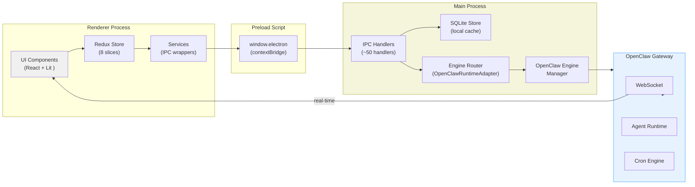

# JustDo 系统架构设计

**Last Updated:** 2026-06-30

## 1. 架构概述

JustDo 采用 Electron 的严格进程隔离架构，所有跨进程通信通过 IPC 实现。系统分为三层：UI 层（Renderer）、服务层（IPC + Redux）、主进程层（Main + OpenClaw Gateway Runtime）。

JustDo 是一个 **Thin Frontend** 客户端 —— 所有 Agent 执行逻辑、会话生命周期、消息历史、子 Agent 管理全部由 OpenClaw Gateway 负责。JustDo 的 SQLite 是 Gateway 数据的 UI 缓存，仅此而已。

### 1.1 分层架构

```
+--------------------------------------------------------------------+
|                      Renderer Process                                |
|                      (React 18 + Redux + Lit)                        |
|                                                                      |
|  +-----------------+  +------------------+  +--------------------+   |
|  |   CoworkView    |  |    Settings      |  | JustDoChatWrapper |   |
|  |                 |  |  (无 IMSettings)  |  | <justdo-chat> Lit |   |
|  +-----------------+  +------------------+  +--------------------+   |
|                                                                      |
|  +----------------------------------------------------------------+  |
|  |                     Redux Store (8 slices)                      |  |
|  | modelSlice | coworkSlice | skillSlice | mcpSlice | agentSlice  |  |
|  | scheduledTaskSlice | quickActionSlice | coworkDeleteState      |  |
|  +----------------------------------------------------------------+  |
|                                                                      |
|  +----------------------------------------------------------------+  |
|  |                    Services                                     |  |
|  | cowork.ts | skill.ts | mcp.ts | agent.ts | config.ts | i18n.ts |  |
|  +----------------------------------------------------------------+  |
+--------------------------------------------------------------------+
                               |
                               | IPC (contextBridge)
                               v
+--------------------------------------------------------------------+
|                      Preload Script                                  |
|                (contextBridge + window.electron)                     |
|                                                                      |
|  cowork.* | store.* | skills.* | mcp.* | permissions.* |           |
|  enterprise.* | api.* | dialog.* | shell.* | autoLaunch.* |        |
|  preventSleep.* | appInfo.* | log.* | scheduledTasks.* |            |
|  agents.* | openclaw.engine.*                                       |
+--------------------------------------------------------------------+
                               |
                               | IPC Handlers
                               v
+--------------------------------------------------------------------+
|                      Main Process                                    |
|                      (Node.js + SQLite)                              |
|                                                                      |
|  +-----------------+  +---------------------------+                  |
|  |   SQLiteStore   |  |      CoworkStore          |                  |
|  |   (kv store)    |  |  (session/message DB)     |                  |
|  +-----------------+  +---------------------------+                  |
|                                                                      |
|  +---------------------------------------------------------------+   |
|  |              Agent Engine Router                                 |   |
|  |  coworkEngineRouter.ts | openclawRuntimeAdapter.ts              |   |
|  |  gateway/types.ts | history/historyReconciler.ts                |   |
|  |  subagentGateway.ts | webchatToolStream.ts | skillRpc.ts        |   |
|  +---------------------------------------------------------------+   |
|                                                                      |
|  +---------------------------------------------------------------+   |
|  |              Core Library Modules                                |   |
|  |  openclawEngineManager.ts (runtime lifecycle)                    |   |
|  |  openclawConfigSync.ts (Gateway config sync)                     |   |
|  |  openclawHistory.ts (history sync)                               |   |
|  |  openclawAgentModels.ts (model config)                           |   |
|  |  openclawAssistantText.ts (assistant text config)                |   |
|  |  openclawChannelSessionSync.ts (channel sync)                    |   |
|  |  openclawLocalExtensions.ts (local extensions)                   |   |
|  |  openclawTokenProxy.ts (token proxy)                             |   |
|  |  mcpServerManager.ts | mcpBridgeServer.ts                       |   |
|  |  claudeSettings.ts | coworkModelApi.ts                          |   |
|  |  coworkConfigStore.ts | coworkFormatTransform.ts                |   |
|  |  coworkLogger.ts | coworkOpenAICompatProxy.ts                   |   |
|  |  coworkUtil.ts | commandSafety.ts                               |   |
|  |  enterpriseConfigSync.ts | logExport.ts                         |   |
|  |  pythonRuntime.ts | systemProxy.ts                              |   |
|  +---------------------------------------------------------------+   |
+--------------------------------------------------------------------+
                               |
                               | HTTP/WS
                               v
+--------------------------------------------------------------------+
|                  OpenClaw Gateway (Runtime)                          |
|              (pre-built npm package, NOT cloned from git)            |
|                                                                      |
|  Tool Execution | Memory | Sandbox | WebSocket | Cron Engine        |
|  Session Lifecycle | Subagent Management | Skill Hosting            |
+--------------------------------------------------------------------+
```

### 1.2 数据流向



## 2. 核心模块

### 2.1 Renderer Process（渲染进程）

**职责**：所有 UI 展示和业务逻辑。JustDo 的 Renderer 不含任何 Agent 执行逻辑 —— 纯展示层。

**关键目录**：
```
src/renderer/
├── App.tsx                          # 根组件
├── types/                           # TypeScript 类型定义
│   ├── cowork.ts                    # Cowork 类型
│   ├── agent.ts                     # Agent 类型
│   ├── electron.d.ts                # window.electron 类型声明
│   ├── skill.ts, mcp.ts, quickAction.ts
├── store/slices/                    # Redux slices（8个）
│   ├── modelSlice.ts                # 模型配置状态
│   ├── coworkSlice.ts               # Cowork 会话状态
│   ├── skillSlice.ts                # Skills 状态
│   ├── mcpSlice.ts                  # MCP 服务器状态
│   ├── agentSlice.ts                # Agent 配置状态
│   ├── scheduledTaskSlice.ts        # 定时任务状态
│   ├── quickActionSlice.ts          # 快捷操作状态
│   └── coworkDeleteState.ts         # 会话删除状态（跨组件）
├── services/                        # 业务服务
│   ├── cowork.ts                    # Cowork IPC 服务
│   ├── skill.ts                     # Skills IPC 服务
│   ├── mcp.ts                       # MCP IPC 服务
│   ├── agent.ts                     # Agent IPC 服务
│   ├── config.ts                    # 配置服务
│   ├── i18n.ts                      # 国际化（中文/英文）
│   ├── store.ts                     # 存储服务
│   ├── theme.ts                     # 主题服务
│   ├── encryption.ts                # 加密服务
│   ├── quickAction.ts              # 快捷操作服务
│   ├── scheduledTask.ts            # 定时任务服务
│   └── shortcuts.ts                # 快捷键服务
├── components/                      # UI 组件
│   ├── cowork/                      # Cowork 组件（20个）
│   │   ├── CoworkView.tsx           # 主视图
│   │   ├── CoworkSessionItem.tsx    # 会话列表项
│   │   ├── CoworkSessionList.tsx    # 会话列表
│   │   ├── CoworkPromptInput.tsx    # 输入框
│   │   ├── CoworkPermissionModal.tsx # 权限审批弹窗
│   │   ├── CoworkQuestionWizard.tsx # 提问向导
│   │   ├── SessionGroupPanel.tsx    # 会话分组面板
│   │   ├── SessionGroupHeader.tsx    # 分组标头
│   │   ├── JustDoChatWrapper.tsx    # Lit <justdo-chat> 包装组件
│   │   ├── ChatMessageDisplay.tsx   # 消息展示包装
│   │   ├── DiffView.tsx             # Diff 视图
│   │   ├── SubagentMenu.tsx         # 子 Agent 菜单
│   │   ├── EngineStartupOverlay.tsx # 引擎启动覆盖层
│   │   ├── FolderSelectorPopover.tsx # 目录选择器
│   │   ├── CreateGroupModal.tsx     # 创建分组弹窗
│   │   ├── AttachmentCard.tsx       # 附件卡片
│   │   ├── agentModelSelection.tsx  # Agent 模型选择
│   │   └── index.ts                # 组件导出
│   └── artifacts/                   # Artifact 渲染器
└── libs/                            # 核心库
    └── openclaw-chat/               # Lit 聊天渲染管道
        ├── components/              # 自定义元素
        │   ├── justdo-chat.ts       # <justdo-chat> 主元素
        │   ├── chat-avatar.ts       # 头像
        │   ├── grouped-render.ts    # 分组渲染
        │   ├── markdown.ts          # Markdown 渲染
        │   └── tool-display.ts      # 工具调用展示
        ├── conversion/              # 消息格式转换
        │   └── cowork-to-gateway.ts # Cowork 消息 -> Gateway 格式
        ├── gateway/                 # Gateway WebSocket 连接
        │   ├── chat-controller.ts   # 聊天控制器
        │   └── client.ts            # WebSocket 客户端
        ├── pipeline/                # 渲染管道（13个模块）
        │   ├── build-chat-items.ts  # 构建聊天项
        │   ├── message-normalizer.ts# 消息标准化
        │   ├── role-normalizer.ts   # 角色标准化
        │   ├── stream-text.ts       # 流式文本
        │   ├── tool-cards.ts        # 工具卡片
        │   ├── heartbeat-display.ts # 心跳显示
        │   └── ...                  # 其他管道模块
        ├── shims/                   # 后端兼容层
        └── types/                   # 类型定义
```

### 2.2 Main Process（主进程）

**职责**：所有系统级操作：窗口管理、SQLite 持久化、Gateway 引擎生命周期管理、系统能力暴露。

**入口文件**：`src/main/main.ts`

**关键目录**：
```
src/main/
├── main.ts                          # 主入口，~5000 行
├── preload.ts                       # contextBridge API 暴露
├── coworkStore.ts                   # Cowork 数据存储
├── libs/
│   ├── agentEngine/                 # Agent 引擎路由层
│   │   ├── coworkEngineRouter.ts    # 引擎请求路由
│   │   ├── openclawRuntimeAdapter.ts# OpenClaw 运行时适配
│   │   ├── types.ts                 # 类型定义
│   │   ├── gateway/                 # Gateway 集成
│   │   │   └── types.ts             # Gateway 类型
│   │   ├── history/                 # 历史记录同步
│   │   │   └── historyReconciler.ts # Gateway-本地历史协调
│   │   ├── rpc/                     # 工具调用 RPC
│   │   │   └── skillRpc.ts          # Skill RPC 处理
│   │   ├── utils/                   # 工具函数
│   │   │   └── gatewayHelpers.ts    # Gateway 辅助函数
│   │   ├── openclaw/                # OpenClaw 特定
│   │   │   ├── subagentGateway.ts   # 子 Agent Gateway 桥接
│   │   │   └── webchatToolStream.ts # WebChat 工具流处理
│   │   └── index.ts                 # 模块导出
│   ├── openclawEngineManager.ts     # Gateway 引擎生命周期
│   ├── openclawConfigSync.ts        # 配置同步
│   ├── openclawHistory.ts           # 历史同步
│   ├── openclawAgentModels.ts       # Agent 模型配置
│   ├── openclawAssistantText.ts     # 助理文本
│   ├── openclawChannelSessionSync.ts# Channel 会话同步
│   ├── openclawLocalExtensions.ts   # 本地扩展
│   ├── openclawTokenProxy.ts        # Token 代理
│   ├── mcpServerManager.ts         # MCP 服务器管理
│   ├── mcpBridgeServer.ts          # MCP 桥接服务器
│   ├── claudeSettings.ts           # Claude 设置
│   ├── coworkModelApi.ts           # 模型 API
│   ├── coworkConfigStore.ts        # 配置存储
│   ├── coworkFormatTransform.ts    # 格式转换
│   ├── coworkLogger.ts             # 日志系统
│   ├── coworkOpenAICompatProxy.ts  # OpenAI 兼容代理
│   ├── coworkUtil.ts               # 工具函数
│   ├── commandSafety.ts            # 命令安全检查
│   ├── enterpriseConfigSync.ts     # 企业配置同步
│   ├── logExport.ts                # 日志导出
│   ├── pythonRuntime.ts            # Python 运行时
│   ├── systemProxy.ts              # 系统代理
│   └── skillSecurity/              # Skills 安全检查
│       ├── skillSecurityPromptAudit.ts
│       ├── skillSecurityRules.ts
│       ├── skillSecurityScanner.ts
│       └── skillSecurityTypes.ts
├── scheduledTask/                   # 定时任务
```

### 2.3 Preload Script

**职责**：安全桥接，通过 `contextBridge` 暴露有限的 API 集合给 Renderer。

**暴露的 API 命名空间**：
```typescript
window.electron = {
  platform, arch,                    // 基本信息
  store:                             // 键值存储
    { get, set, remove },
  skills:                            // Skills 管理
    { list, setEnabled, install, import, importFolder,
      search, detail, delete, getRoot, autoRoutingPrompt,
      getConfig, setConfig, testEmailConnectivity, onChanged },
  mcp:                               // MCP 服务器
    { list, create, update, delete, setEnabled,
      refreshBridge, onBridgeSyncStart, onBridgeSyncDone },
  permissions:                       // 系统权限
    { checkCalendar, requestCalendar },
  enterprise:                        // 企业配置
    { getConfig },
  api:                               // API 请求（含流式）
    { fetch, stream, cancelStream,
      onStreamData, onStreamDone, onStreamError, onStreamAbort },
  ipcRenderer:                       // 通用 IPC（受限）
    { send, on },
  window:                            // 窗口控制
    { minimize, toggleMaximize, close, isMaximized, showSystemMenu, onStateChanged },
  getApiConfig, checkApiConfig, saveApiConfig,  // API 配置
  generateSessionTitle, getRecentCwds,           // 工具函数
  openclaw:                          // 引擎管理
    { engine: { getStatus, install, retryInstall, restartGateway,
                getPort, getToken, setPort, onProgress } },
  agents:                            // Agent 管理
    { list, get, create, update, delete, presets, addPreset },
  cowork:                            // Cowork 会话
    { startSession, continueSession, stopSession,
      deleteSession, deleteSessions, setSessionPinned, renameSession,
      getSession, remoteManaged, patchSessionModel, listSessions,
      getContextUsage,
      deleteMessage, deleteMessagesFrom,
      exportResultImage, captureImageChunk, saveResultImage, exportSessionText,
      respondToPermission, getConfig, setConfig,
      listMemoryEntries, createMemoryEntry, updateMemoryEntry, deleteMemoryEntry,
      listPresetPrompts, getPresetPrompt, setPresetPrompt, deletePresetPrompt,
      onStreamMessage, onStreamMessageUpdate, onStreamThinkingUpdate,
      onStreamMessageMetadataUpdate, onStreamPermission,
      onStreamComplete, onStreamError, onSessionsChanged },
  dialog:                            // 文件对话框
    { selectDirectory, selectFile, selectFiles,
      saveInlineFile, readFileAsDataUrl },
  shell:                             // Shell 操作
    { openPath, showItemInFolder, openExternal },
  autoLaunch:                        // 自动启动
    { get, set },
  preventSleep:                      // 防止睡眠
    { get, set },
  appInfo:                           // 应用信息
    { getVersion, getSystemLocale },
  log:                               // 日志管理
    { getPath, openFolder, exportZip },
  scheduledTasks:                    // 定时任务
    { list, get, create, update, delete, toggle,
      runManually, stop, listRuns, listChannels,
      onStatusUpdate, onRunUpdate }
};
```

## 3. IPC 通信设计

### 3.1 IPC Channel 常量

所有 IPC channel 名称定义在常量中，避免裸字符串：

```typescript
// src/shared/ipcChannels.ts
export const IpcChannel = {
  // Store
  StoreGet: 'store:get',
  StoreSet: 'store:set',
  StoreDelete: 'store:delete',

  // Cowork Session
  CoworkSessionStart: 'cowork:session:start',
  CoworkSessionContinue: 'cowork:session:continue',
  CoworkSessionStop: 'cowork:session:stop',
  CoworkSessionDelete: 'cowork:session:delete',
  CoworkSessionGet: 'cowork:session:get',
  CoworkSessionList: 'cowork:session:list',
  CoworkSessionPin: 'cowork:session:pin',
  CoworkSessionRename: 'cowork:session:rename',
  CoworkSessionPatchModel: 'cowork:session:patchModel',
  CoworkSessionExportResultImage: 'cowork:session:exportResultImage',
  CoworkSessionCaptureImageChunk: 'cowork:session:captureImageChunk',
  CoworkSessionSaveResultImage: 'cowork:session:saveResultImage',
  CoworkSessionExportText: 'cowork:session:exportText',

  // Cowork Permission
  CoworkPermissionRespond: 'cowork:permission:respond',

  // Cowork Config
  CoworkConfigGet: 'cowork:config:get',
  CoworkConfigSet: 'cowork:config:set',

  // Cowork Memory
  CoworkMemoryListEntries: 'cowork:memory:listEntries',
  CoworkMemoryCreateEntry: 'cowork:memory:createEntry',
  CoworkMemoryUpdateEntry: 'cowork:memory:updateEntry',
  CoworkMemoryDeleteEntry: 'cowork:memory:deleteEntry',
  CoworkMemoryGetStats: 'cowork:memory:getStats',

  // Stream Events
  CoworkStreamMessage: 'cowork:stream:message',
  CoworkStreamMessageUpdate: 'cowork:stream:messageUpdate',
  CoworkStreamThinkingUpdate: 'cowork:stream:thinkingUpdate',
  CoworkStreamMessageMetadataUpdate: 'cowork:stream:messageMetadataUpdate',
  CoworkStreamPermissionRequest: 'cowork:stream:permissionRequest',
  CoworkStreamComplete: 'cowork:stream:complete',
  CoworkStreamError: 'cowork:stream:error',

  // OpenClaw Engine
  OpenClawEngineGetStatus: 'openclaw:engine:getStatus',
  OpenClawEngineInstall: 'openclaw:engine:install',
  OpenClawEngineRetryInstall: 'openclaw:engine:retryInstall',
  OpenClawEngineRestartGateway: 'openclaw:engine:restartGateway',
  OpenClawEngineGetPort: 'openclaw:engine:getPort',
  OpenClawEngineGetToken: 'openclaw:engine:getToken',
  OpenClawEngineSetPort: 'openclaw:engine:setPort',

  // Skills
  SkillsList: 'skills:list',
  SkillsSetEnabled: 'skills:setEnabled',
  SkillsInstall: 'skills:install',
  SkillsSearch: 'skills:search',
  SkillsDetail: 'skills:detail',
  SkillsImport: 'skills:import',
  SkillsImportFolder: 'skills:importFolder',
  SkillsDelete: 'skills:delete',
  SkillsGetRoot: 'skills:getRoot',
  SkillsAutoRoutingPrompt: 'skills:autoRoutingPrompt',
  SkillsGetConfig: 'skills:getConfig',
  SkillsSetConfig: 'skills:setConfig',

  // MCP
  McpList: 'mcp:list',
  McpCreate: 'mcp:create',
  McpUpdate: 'mcp:update',
  McpDelete: 'mcp:delete',
  McpSetEnabled: 'mcp:setEnabled',
  McpRefreshBridge: 'mcp:refreshBridge',

  // Agents
  AgentList: 'agents:list',
  AgentGet: 'agents:get',
  AgentCreate: 'agents:create',
  AgentUpdate: 'agents:update',
  AgentDelete: 'agents:delete',
  AgentPresets: 'agents:presets',
  AgentAddPreset: 'agents:addPreset',

  // Scheduled Task
  ScheduledTaskList: 'scheduledTask:list',
  ScheduledTaskCreate: 'scheduledTask:create',
  // ... (full list in scheduledTask/constants.ts)
} as const;

export type IpcChannelName = typeof IpcChannel[keyof typeof IpcChannel];
```

### 3.2 流式事件

Cowork 使用 IPC 事件进行实时双向通信：

| 事件 | 方向 | 用途 |
|------|------|------|
| `cowork:stream:message` | Main -> Renderer | 新消息添加 |
| `cowork:stream:messageUpdate` | Main -> Renderer | 流式内容更新 |
| `cowork:stream:thinkingUpdate` | Main -> Renderer | 思考内容增量 |
| `cowork:stream:messageMetadataUpdate` | Main -> Renderer | 消息元数据更新 |
| `cowork:stream:permissionRequest` | Main -> Renderer | 工具审批请求 |
| `cowork:stream:complete` | Main -> Renderer | 会话完成 |
| `cowork:stream:error` | Main -> Renderer | 执行错误 |
| `openclaw:engine:onProgress` | Main -> Renderer | 安装进度 |

### 3.3 Chat 渲染管道（Lit <justdo-chat>）

v2026.6 引入的新的聊天渲染方式。`<justdo-chat>` 是一个 Lit 自定义元素，它不通过 Redux - IPC 路径渲染消息，而是直接连接 Gateway WebSocket：

```
JustDoChatWrapper (React)
  -> ChatController (gateway/chat-controller.ts)
    -> WebSocket Client (gateway/client.ts)
      -> Gateway WS endpoint
        -> pipeline/ (消息标准化、渲染数据构建)
          -> <justdo-chat> Lit 元素渲染
```

此管道替代了旧版 CoworkSessionDetail.tsx（3800+ 行）的所有功能。Redux 中的 `coworkSlice` 仍然维护会话元数据，但消息内容的渲染完全交由 Lit 管道处理。

### 3.4 请求-响应模式

```typescript
// Renderer 调用
const session = await window.electron.cowork.startSession({
  cwd: '/path/to/work',
  prompt: '分析这份 Excel'
});

// Main 处理
ipcMain.handle('cowork:session:start', async (event, params) => {
  const sessionId = uuid();
  // 1. 确保引擎运行
  await openclawEngineManager.ensureRunning();
  // 2. 创建会话（本地 SQLite）
  coworkStore.createSession(sessionId, { ... });
  // 3. 通过 Gateway 启动 Agent 执行
  const router = new CoworkEngineRouter(coworkStore, openclawEngineManager);
  router.startSession(sessionId, params.prompt, { ... });
  return { sessionId, status: 'running' };
});
```

## 4. 安全设计

### 4.1 进程隔离

- **Context Isolation**：启用，Renderer 无法直接访问 Node.js
- **Node Integration**：禁用，Renderer 无 require 能力
- **Sandbox**：启用，Renderer 运行在沙箱环境

### 4.2 Preload 安全

```typescript
// preload.ts
contextBridge.exposeInMainWorld('electron', {
  cowork: {
    startSession: (params) => ipcRenderer.invoke('cowork:session:start', params),
    // 仅暴露必要的 API，不暴露 ipcRenderer 本身
  }
});
```

### 4.3 权限控制

所有工具调用需要用户明确授权：

```typescript
// 权限请求事件
{
  type: 'permissionRequest',
  sessionId: 'xxx',
  toolName: 'write_file',
  toolInput: { path: '/path/to/file', content: '...' },
  riskLevel: 'medium' // low/medium/high
}
```

### 4.4 工作目录边界

文件操作限制在工作目录内：

```typescript
function isWithinWorkingDirectory(path: string, workingDir: string): boolean {
  const resolved = resolve(path);
  const workingResolved = resolve(workingDir);
  return resolved.startsWith(workingResolved);
}
```

## 5. 扩展机制

### 5.1 Skills 技能扩展

Skills 定义在 `resources/builtin-skills.json`，通过 OpenClaw Gateway 加载。技能目录位于 `resources/skills/`：

```json
{
  "version": 1,
  "description": "JustDo built-in skills configuration for OpenClaw runtime",
  "skills": [
    { "id": "data-analysis", "enabled": true },
    { "id": "docx", "enabled": true },
    { "id": "multi-search-engine", "enabled": true },
    { "id": "playwright", "enabled": true }
  ],
  "disableOpenClawDefaults": true
}
```

### 5.2 Agent 自定义

用户可创建自定义 Agent，绑定特定的 Skills：

```typescript
interface AgentConfig {
  id: string;
  name: string;
  systemPrompt: string;
  skills: string[];        // 启用的 Skills
  model?: string;          // 模型选择
  icon?: string;           // 图标
  identity?: string;       // 身份设定
}
```

### 5.3 MCP 服务器

支持 Model Context Protocol 服务器扩展，通过 `mcpServerManager.ts` 和 `mcpBridgeServer.ts` 桥接：

```typescript
interface MCPServerConfig {
  id: string;
  name: string;
  command: string;
  args: string[];
  env: Record<string, string>;
}
```

## 6. 配置管理

### 6.1 配置存储

| 配置类型 | 存储位置 | 表/Key |
|----------|----------|--------|
| 应用配置 | SQLite kv | `kv.key = 'appConfig'` |
| Cowork 配置 | SQLite | `cowork_config` 表 |
| Agent 配置 | SQLite | `agents` 表 |
| Skills 配置 | 文件 | `resources/builtin-skills.json` |
| 会话分组 | SQLite | `session_groups` 表 |
| 子 Agent | SQLite | `cowork_subagents` 表（Gateway 驱动） |
| OpenClaw 版本 | package.json | `openclaw.version` |

### 6.2 国际化

支持中文（默认）和英文：

```typescript
const translations = {
  zh: {
    coworkTitle: '工作助手',
    startSession: '开始会话',
  },
  en: {
    coworkTitle: 'Work Assistant',
    startSession: 'Start Session',
  }
};
```

语言自动检测系统 locale，用户可在设置中切换。

## 7. 关键设计决策

### 7.1 OpenClaw Gateway 为唯一引擎

**决策**：JustDo 使用 OpenClaw Gateway 作为唯一的 Agent 引擎。

**理由**：
- OpenClaw 提供完整的 Agent 运行时能力（工具执行、记忆、WebSocket 实时通信）
- Gateway 全权管理会话生命周期、消息历史、子 Agent —— JustDo 作为薄前端
- 运行时作为预构建 npm 包分发，无需从 git 克隆和构建
- Subagent 逻辑完全收缩至 Gateway，JustDo 不再维护本地子 Agent 状态

**历史**：旧版曾包含 `yd_cowork` 引擎和 Claude Agent SDK 适配器，v2026.5 起已全部移除。

### 7.2 SQLite 本地存储（UI 缓存）

**决策**：使用 SQLite 作为本地缓存存储，所有权威数据由 Gateway 持有。

**理由**：
- 单文件，易于备份和迁移
- better-sqlite3 性能优秀
- 无需额外服务
- 注意：SQLite 中的数据是 Gateway 数据的子集缓存，UI 离线时可读取历史会话

### 7.3 IPC 通道设计

**决策**：所有 IPC 通道使用命名空间前缀组织。

**理由**：
- `cowork:*` 专注于会话业务
- `openclaw:engine:*` 专注于引擎生命周期
- `skills:*`、`mcp:*`、`agents:*` 等按模块划分
- 前端无需感知底层引擎实现细节

### 7.4 Lit <justdo-chat> 渲染管道

**决策**：使用 Lit 自定义元素替代 React 组件渲染聊天消息。

**理由**：
- 与 OpenClaw WebChat 共享相同的渲染管道和 Gateway 连接逻辑
- 减少 React 重渲染开销 —— Lit 原生 DOM 操作更高效
- 直接 WebSocket 连接 Gateway，避免 IPC 中继延迟
- 使用 CSS 自定义属性（`--justdo-chat-*`）实现主题集成
