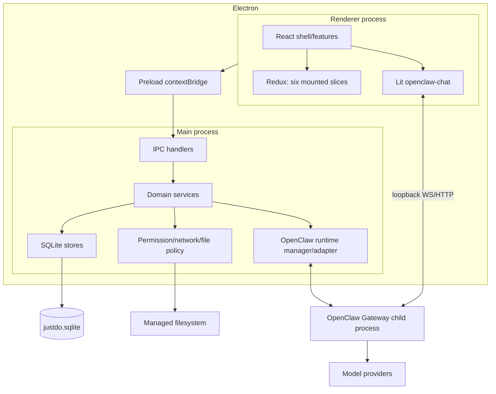
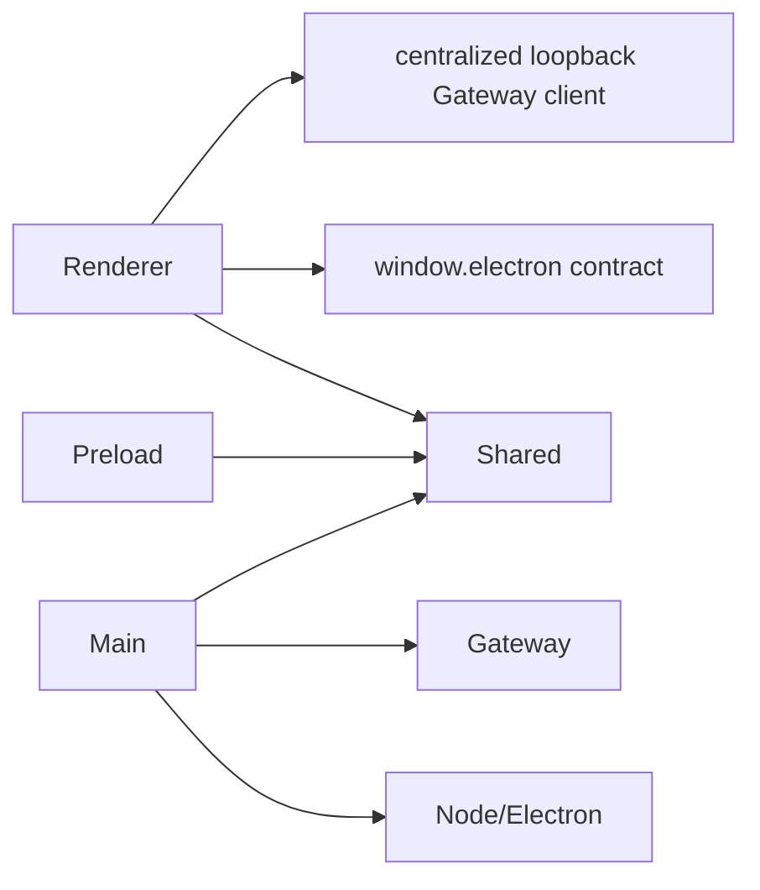
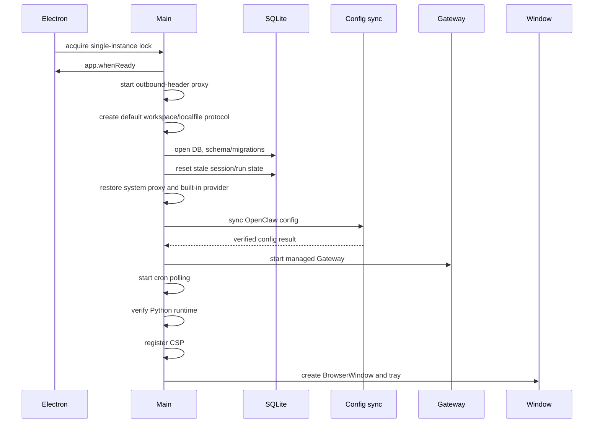

# 系统架构

本文描述 `v2026.8.12` 的代码结构、依赖方向、启动/退出顺序和跨领域协作。事实来源是 `src/main/main.ts`、`src/main/preload.ts`、`src/main/**`、`src/renderer/**`、`src/shared/**` 与构建配置。

## 1. 架构目标

系统采用 Electron 三层进程边界，加一个由 Main 托管的 OpenClaw Gateway：

- Renderer 专注产品 UI 和显示状态，不持有系统权限。
- Preload 是显式、最小、可审计的能力桥。
- Main 组合领域服务，拥有 SQLite、文件、进程、系统网络和安全策略。
- Gateway 拥有 Agent 执行、session/history、工具、Skill runtime 与 cron 语义。
- Shared 只承载可序列化合约与纯函数，确保 Main/Renderer 对协议的理解一致。

## 2. 分层与部署图

```mermaid
flowchart TB
  subgraph Electron
    subgraph RendererProcess[Renderer process]
      React[React shell/features]
      Redux[Redux: six mounted slices]
      Chat[Lit openclaw-chat]
      React --> Redux
      React --> Chat
    end
    Preload[Preload contextBridge]
    subgraph MainProcess[Main process]
      IPC[IPC handlers]
      Domain[Domain services]
      Policy[Permission/network/file policy]
      Stores[SQLite stores]
      Runtime[OpenClaw runtime manager/adapter]
      IPC --> Domain
      Domain --> Policy
      Domain --> Stores
      Domain --> Runtime
    end
  end
  DB[(justdo.sqlite)]
  FS[Managed filesystem]
  Gateway[OpenClaw Gateway child process]
  Models[Model providers]
  RendererProcess --> Preload --> IPC
  Chat <-->|loopback WS/HTTP| Gateway
  Stores --> DB
  Policy --> FS
  Runtime <--> Gateway
  Gateway --> Models
```

开发时 Renderer 从 Vite `43127` 加载；生产时加载 `dist/`。Main/preload 产物位于 `dist-electron/`。Gateway 是独立子进程，不是 Electron Renderer 的一部分。

## 3. 源码目录职责

### 3.1 `src/main/`

| 目录         | 职责                                                                | 代表入口                                                 |
| ------------ | ------------------------------------------------------------------- | -------------------------------------------------------- |
| `core/`      | app/window/tray/update/log、CSP、本地协议、代理、Python、受管目录   | `mainWindowFactory.ts`、`outboundHeaderProxy.ts`         |
| `data/`      | SQLite schema 和面向领域的 store                                    | `sqliteStore.ts`、`coworkStore.ts`、`groupStore.ts`      |
| `engine/`    | Cowork router、Gateway adapter、事件转发、命令安全                  | `coworkEngineRouter.ts`、`openclawRuntimeAdapter.ts`     |
| `cowork/`    | provider 配置、内置模型、日志、模型 API/readiness                   | `providerApiConfig.ts`、`builtinModelLifecycle.ts`       |
| `ipc/`       | 按 app/cowork/openclaw/scheduledTask 注册 handler                   | 各目录 `index.ts` 与 handler 文件                        |
| `openclaw/`  | config sync、runtime、models、permissions、sessions、slash commands | `openclawEngineManager.ts`、config sync service          |
| `plugins/`   | Marketplace、Skill/MCP/Hook/Extension 文件与配置                    | `pluginManager.ts`、各 service/store                     |
| `scheduler/` | Gateway cron 映射、轮询、结果同步和本地 receipt                     | `cronJobService.ts`、`scheduledTaskResultSyncService.ts` |

`src/main/main.ts` 仅是 composition root：创建单例、注入依赖、注册 handler、绑定事件和管理应用生命周期。新增领域逻辑不应继续堆入该文件。

### 3.2 `src/renderer/`

- `app/`：应用壳、路由/导航、全局布局和产品级组合。
- `features/`：`agents`、`cowork`、`memory`、`models`、`plugins`、`scheduled-tasks`、`settings` 等领域 UI。
- `libs/openclaw-chat/`：独立聊天显示栈，包括 Gateway client/controller、模型 reducer、history reconciliation、pipeline、Lit 组件和滚动调度。
- `services/`：Renderer 配置适配、i18n、theme、shortcut 等浏览器侧服务。
- `shared/components/`：跨 feature UI 原语。
- `store/index.ts`：只挂载 `model`、`cowork`、`skill`、`mcp`、`scheduledTask`、`agent` 六个 slice。

没有挂载到 store 的 slice 不能在文档中描述为运行态全局状态。

### 3.3 `src/shared/`

Shared 由两个进程共同编译，适合放：IPC channel 常量、可序列化 interface/type、验证/normalize 函数、稳定 discriminant。禁止放 Electron、Node 内置模块、DOM-only API、环境变量读取和有副作用的单例。

## 4. 依赖规则

```mermaid
flowchart LR
  Renderer --> Shared
  Renderer --> PreloadContract[window.electron contract]
  Renderer --> LocalGateway[centralized loopback Gateway client]
  Preload --> Shared
  Main --> Shared
  Main --> NodeElectron[Node/Electron]
  Main --> Gateway
```

允许与禁止：

| 调用方   | 可以依赖                                         | 禁止依赖                                    |
| -------- | ------------------------------------------------ | ------------------------------------------- |
| Renderer | Renderer feature、shared、浏览器库、preload 类型 | `electron`、`fs`、`path`、SQLite、Main 实现 |
| Preload  | Electron IPC、shared types                       | 数据库/领域业务、任意通配 API               |
| Main     | Node/Electron、shared、Main 领域                 | Renderer 组件/DOM                           |
| Shared   | TypeScript 纯逻辑                                | Node/Electron/DOM/process state             |

Electron/OS/SQLite 与产品命令统一走 `Renderer -> window.electron -> ipcRenderer -> ipcMain -> service`。聊天数据面是受控例外：`JustDoChatWrapper` 通过 preload 取得本地 port/token，集中式 `GatewayClient` 直连 loopback Gateway，处理订阅、Gateway history 和 chat abort。Gateway token 不得进入普通 Renderer 业务、Redux、日志或持久化。

## 5. Main 的组合关系

Main 启动时延迟创建重型服务，主要对象关系如下：

- `SqliteStore` 提供数据库连接和 KV；`CoworkStore`、`GroupStore` 复用该连接。
- `CoworkEngineService` 持有当前 router/runtime adapter。
- `OpenClawEngineManager` 管理 runtime 状态、端口、token、进程与网络环境。
- `OpenClawConfigSyncService` 汇总 provider、agent、全局权限兜底、MCP、Hook、Extension、browser 等配置并串行写入。
- `SessionPermissionModeCoordinator` 串行写入并验证原生 session mode/root，成功后更新本地投影。
- `ManagedDirectoryOperationCoordinator` 在插件目录变更前识别/停止相关进程，完成后恢复。
- `CronJobService`、result store/sync service 共享 Gateway adapter 与 SQLite。
- `OutboundHeaderProxy` 向 Gateway generation 及显式 opt-in 的 OpenClaw one-shot CLI
  构造网络环境；当前 memory search/index CLI 会复用该环境，但它不应成为 Renderer
  的通用网络层。

依赖通过 getter 注入，以避免 app ready 前访问 SQLite、打破初始化次序或产生循环构造。

## 6. 启动生命周期

```mermaid
sequenceDiagram
  participant E as Electron
  participant M as Main
  participant D as SQLite
  participant C as Config sync
  participant G as Gateway
  participant W as Window
  E->>M: acquire single-instance lock
  M->>E: app.whenReady
  M->>M: start outbound-header proxy
  M->>M: create default workspace/localfile protocol
  M->>D: open DB, schema/migrations
  M->>D: reset stale session/run state
  M->>M: restore system proxy and built-in provider
  M->>C: sync OpenClaw config
  C-->>M: verified config result
  M->>G: start managed Gateway
  M->>M: start cron polling
  M->>M: verify Python runtime
  M->>M: register CSP
  M->>W: create BrowserWindow and tray
```

关键顺序：

1. 在 module initialization 阶段设置 userData 路径、依赖管理器环境、日志和系统 CA。
2. IPC handler 可以提前注册，但所有 store getter 在数据库 ready 前会抛错，防止静默使用空状态。
3. DB 打开后重置上次强退遗留的 running session；open run 的计时从本次启动重新计算，离线时间不计入。
4. 先恢复代理，再刷新 built-in provider，否则模型发现可能使用错误网络路径。
5. config sync 成功后才自动启动 Gateway 和 cron polling；失败被记录且新 Cowork admission 会 fail closed。
6. 窗口创建晚于核心本地服务初始化，UI 不会在数据库不可用时假装 ready。

## 7. Cowork 数据流

一次 turn 涉及三个不同层次的状态：

1. SQLite session/run：产品索引、cwd/model/permission、goal execution snapshot、client turn 与 root run 绑定；Gateway session goal 仍是目标权威。
2. Gateway：执行、工具、真实 transcript 和 session runtime。
3. Renderer：当前页面的历史窗口、乐观 user message、active turn reducer 和派生 timeline。

Start/continue handler 先等待待处理配置更新并确保 Gateway 的全局安全兜底可验证，然后建立 run receipt、调用 router/adapter。每个 turn 在 `chat.send` 前以 `sessions.create` 幂等写入并核对该 session 的原生 permission mode 与 root；Renderer 直接发送后续 turn 时也先经 Main 执行同一 reconcile。Main adapter 的事件经 forwarder 更新产品 session/Redux；Renderer chat controller 同时通过集中式 loopback Gateway client 接收聊天协议事件，并优先经 IPC、必要时经认证 REST fallback 加载历史。两条投影都必须按 domain/session/run/sequence/generation 收敛到同一 Gateway 事实。

## 8. 配置流

配置来源不是单一 JSON：

- `kv` 中的 `app_config` 保存语言、provider、proxy、browser 等应用设置。
- `cowork_config` 保存 Cowork/runtime 相关键值。
- `agents`、`mcp_servers`、`openclaw_hooks` 是结构化产品配置。
- extension/skill 文件与 manifest 位于 OpenClaw state/受管目录。

`OpenClawConfigSyncService` 在 config mutation lock 内读取这些来源，生成/更新 Gateway 配置，必要时断开 adapter、重启 Gateway、重连并验证全局 restricted fallback 与 scheduler 隔离。会话权限不通过全局 config sync；它由原生 session RPC 单独写入、回读和报错。

## 9. 退出生命周期

退出由统一 shutdown coordinator 保证只执行一次：

1. 停止 customer registration、tray 和 cron polling，阻止新后台工作。
2. 停止全部 Cowork session。
3. 停止 Gateway，使其不再发起 extension/tool 调用。
4. 停止 outbound-header proxy。
5. 关闭 SQLite，flush WAL 并释放锁。
6. 自动更新安装也复用同一 cleanup，再交给 updater。

这个顺序不能随意反转；例如先关闭 proxy 可能让仍在运行的 Gateway 进入不完整失败状态。

## 10. 故障恢复

- Renderer crash：仅对 crash/killed/OOM/launch/integrity 等原因节流 reload；普通 child-process-gone 默认不导致无限刷新。
- 系统唤醒：`powerMonitor.resume` 通知 runtime adapter 重新建立 Gateway WebSocket。
- Gateway 启动并发：manager 合并 in-flight start；调用方可重复 ensure-running。
- 代理切换：应用最新 generation，断开旧 adapter，重启 Gateway 后重连；重连失败时停止 Gateway，避免假 running。
- 强制退出恢复：启动时把遗留 running session 归一为 idle，并重置未结束 run receipt。
- config sync 失败：记录 external engine error，拒绝依赖该配置的新 turn，而不是继续使用未知 policy。

## 11. 扩展架构的正确方式

- 新 IPC：shared 常量/type -> Main handler -> preload 最小方法 -> Renderer declaration -> 测试。
- 新 SQLite 数据：schema/兼容迁移 -> store API/index -> 行为测试 -> 数据文档。
- 新 Gateway 能力：优先调用上游 API；缺失时先记录 capability gap，再评估版本化 patch，不能默认在 Renderer 模拟。
- 新 UI feature：局部 state 优先；只有跨页面、可恢复的共享状态才考虑 Redux，并在真正 mount 后更新文档。
- 新插件类型：先定义 owner、安装事务、配置同步、权限与卸载语义，再接 Marketplace 展示。

## 12. 相关文档

- [进程模型与 IPC](03-process-model.md)
- [Cowork 系统](04-cowork-system.md)
- [Agent Engine](05-agent-engine.md)
- [数据存储](10-data-storage.md)
- [安全模型](11-security-model.md)
