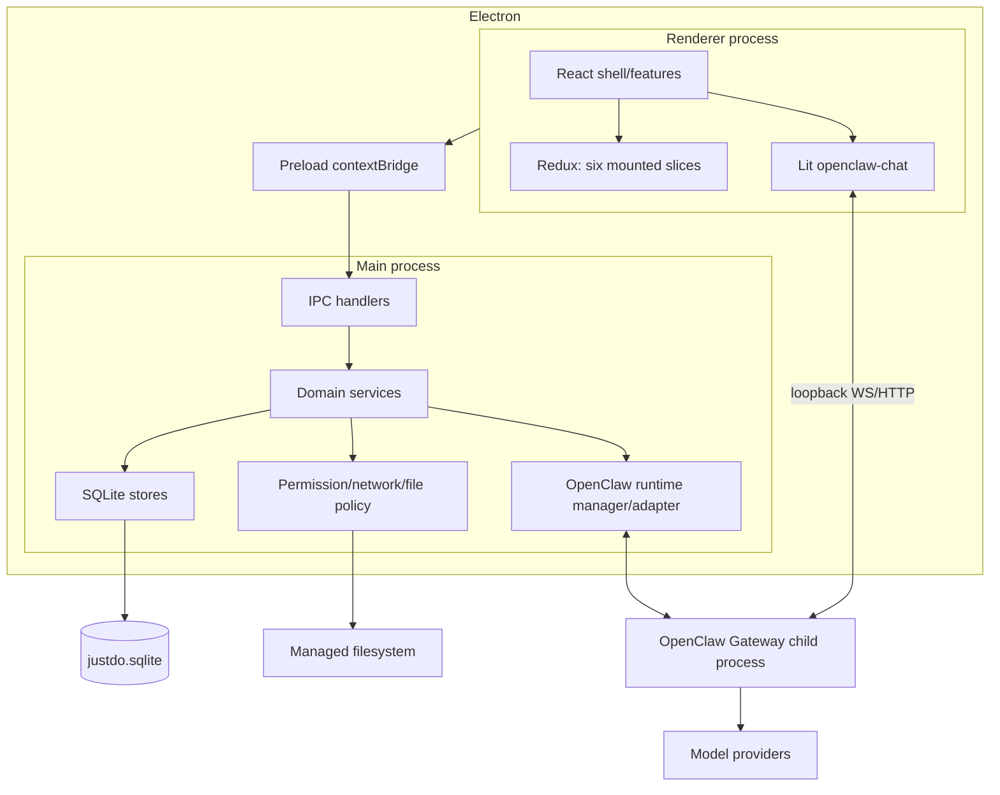
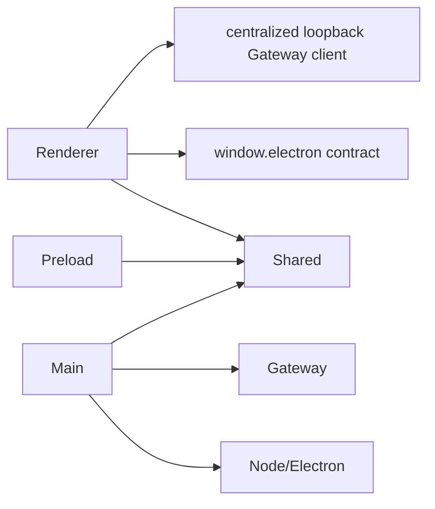
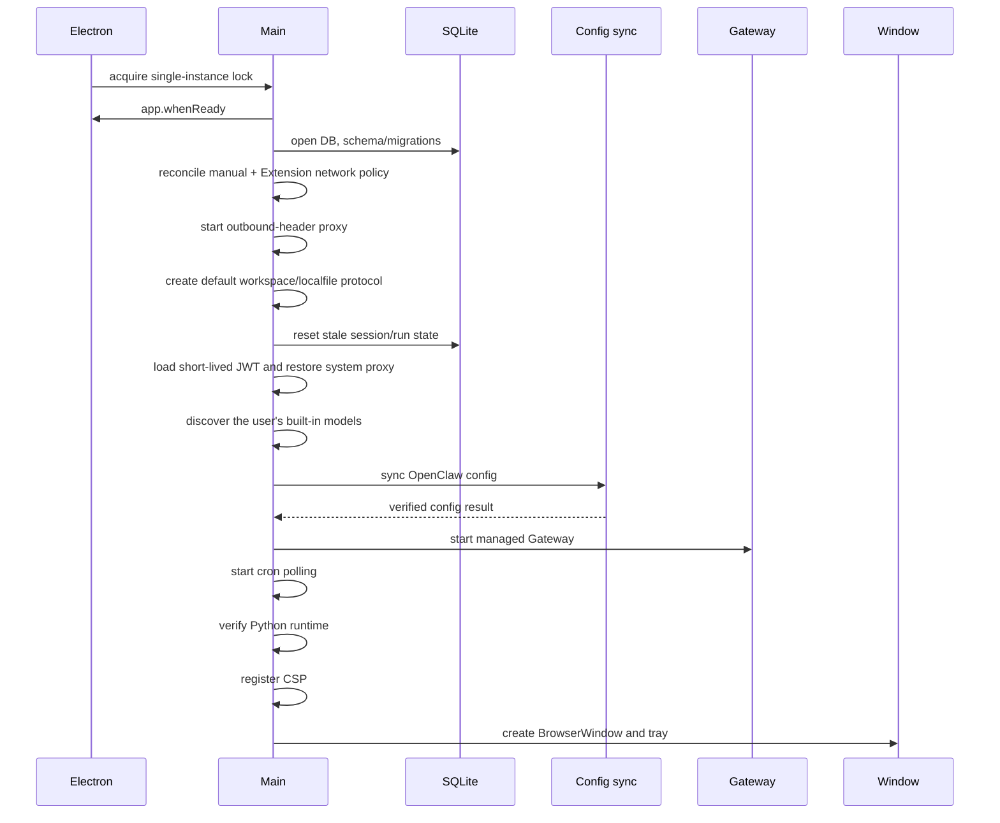

# 系统架构

本文描述 `v2026.8.12` 的代码结构、依赖方向、启动/退出顺序和跨领域协作。事实来源是 `src/main/main.ts`、`src/main/preload.ts`、`src/main/**`、`src/renderer/**`、`src/shared/**` 与构建配置。

## 1. 架构目标

系统采用 Electron 三层进程边界，加一个由 Main 托管的 OpenClaw Gateway：

- Renderer 专注产品 UI 和显示状态，不持有系统权限。
- Preload 是显式、最小、可审计的能力桥。
- Main 组合领域服务，拥有 SQLite、文件、进程、系统网络和安全策略。
- Gateway 拥有 Agent 执行、session/history、工具、Skill runtime 与 cron 语义。
- Shared 只承载可序列化合约与纯函数，确保 Main/Renderer 对协议的理解一致。

## 2. 分层与部署图

```mermaid
flowchart TB
  subgraph Electron
    subgraph RendererProcess[Renderer process]
      React[React shell/features]
      Redux[Redux: six mounted slices]
      Chat[Lit openclaw-chat]
      React --> Redux
      React --> Chat
    end
    Preload[Preload contextBridge]
    subgraph MainProcess[Main process]
      IPC[IPC handlers]
      Domain[Domain services]
      Policy[Permission/network/file policy]
      Stores[SQLite stores]
      Runtime[OpenClaw runtime manager/adapter]
      IPC --> Domain
      Domain --> Policy
      Domain --> Stores
      Domain --> Runtime
    end
  end
  DB[(justdo.sqlite)]
  FS[Managed filesystem]
  Gateway[OpenClaw Gateway child process]
  Models[Model providers]
  RendererProcess --> Preload --> IPC
  Chat <-->|loopback WS/HTTP| Gateway
  Stores --> DB
  Policy --> FS
  Runtime <--> Gateway
  Gateway --> Models
```

开发时 Renderer 从 Vite `43127` 加载；生产时加载 `dist/`。Main/preload 产物位于 `dist-electron/`。Gateway 是独立子进程，不是 Electron Renderer 的一部分。

## 3. 源码目录职责

### 3.1 `src/main/`

| 目录         | 职责                                                                | 代表入口                                                 |
| ------------ | ------------------------------------------------------------------- | -------------------------------------------------------- |
| `core/`      | 按 app/window/network/runtime/filesystem/development 分组的主进程基础能力 | `window/mainWindowFactory.ts`、`network/outboundHeaderProxy.ts` |
| `data/`      | SQLite schema 和面向领域的 store                                    | `sqliteStore.ts`、`coworkStore.ts`、`groupStore.ts`      |
| `engine/`    | Cowork router、Gateway adapter、事件转发、命令安全                  | `coworkEngineRouter.ts`、`openclawRuntimeAdapter.ts`     |
| `cowork/`    | 会话配置、日志、模型 API/readiness、标题生成、已批准计划             | `coworkModelReadiness.ts`、`sessionTitleGenerator.ts`     |
| `providers/` | 供应商 API 配置、内置模型凭据、换证、认证协调与生命周期             | `providerApiConfig.ts`、`builtinModelLifecycle.ts`       |
| `ipc/`       | 按 app/cowork/openclaw/scheduledTask 注册 handler                   | 各目录 `index.ts` 与 handler 文件                        |
| `openclaw/`  | config sync、runtime、models、permissions、sessions、slash commands | `openclawEngineManager.ts`、config sync service          |
| `plugins/`   | Marketplace、Skill/MCP/Hook/Extension 文件与配置                    | `pluginManager.ts`、各 service/store                     |
| `scheduler/` | Gateway cron 映射、轮询、结果同步和本地 receipt                     | `cronJobService.ts`、`scheduledTaskResultSyncService.ts` |

`src/main/main.ts` 仅是 composition root：创建单例、注入依赖、注册 handler、绑定事件和管理应用生命周期。新增领域逻辑不应继续堆入该文件。

`providers/` 拥有应用侧的供应商配置和认证能力，供启动流程、网络 IPC、会话模型准备和 OpenClaw 配置同步调用。它不属于某个聊天页面，也不负责 Gateway 的原生配置投影；投影仍由 `openclaw/config/` 完成。本轮只调整源码归属，不改变凭据保存方式、认证生命周期或调用关系。

`core/` 按职责保留一层分组，测试与所属模块同目录：

| 分组 | 职责 |
| --- | --- |
| `app/` | 应用退出、自启动、更新、安装识别、客户注册与托盘生命周期 |
| `window/` | 主窗口、浏览器面板请求状态与安全策略、媒体权限、CSP 和本地文件协议 |
| `network/` | Main HTTP 请求、系统代理、出站请求头策略、证书与 Gateway 网络环境 |
| `runtime/` | 随应用提供的 Python、Git 和包管理器配置 |
| `filesystem/` | 受管目录操作、文件复制、ZIP 解压、任务工作目录和 Windows 文件锁诊断 |
| `development/` | 开发配置、开发服务器交接与会话生命周期 |

根目录仅保留跨组使用的 `appConstants.ts`、`i18n.ts` 和 `logger.ts` 及其测试。调用方直接引用所属模块；新增代码按职责归组，避免再次向根目录堆积。该分组不改变进程边界或服务生命周期；`window/` 管理 Electron 窗口与 session 策略，`src/main/browser/` 继续承载浏览器业务服务。

### 3.2 `src/renderer/`

窗口首行统一由 `app/shell/window/WindowHeader.tsx` 提供：固定 30px 高度、拖拽区域、底部分隔线及紧凑窗口按钮。对话、定时任务（含加载态）、任务看板、记忆、插件与设置复用同一组件；页面导航位于其下方，内容滚动不影响窗口栏。

- `app/`：应用壳、路由/导航、全局布局和产品级组合。
- `features/`：`agents`、`cowork`、`memory`、`models`、`plugins`、`scheduled-tasks`、`workboard`、`settings` 等领域 UI。
- `libs/openclaw-chat/`：独立聊天显示栈，包括 Gateway client/controller、模型 reducer、history reconciliation、pipeline、Lit 组件和滚动调度。
- `services/`：Renderer 配置适配、i18n、theme、shortcut 等浏览器侧服务。
- `shared/components/`：跨 feature UI 原语。
- `store/index.ts`：只挂载 `model`、`cowork`、`skill`、`mcp`、`scheduledTask`、`agent` 六个 slice。

应用常量直接放在 `app/constants.ts`，不额外套一层仅含 `app.ts` 的目录。`theme/` 保留主题 token、主题定义、CSS 和浏览器运行时；离线生成脚本及 Tailwind 插件统一放在仓库的 `scripts/theme/`。Tailwind 配置直接引用该插件，生成脚本的输出仍是 `src/renderer/theme/css/themes.css`。

`store/` 是跨 feature 的 Redux 组合入口，`types/` 是 Renderer 的环境声明边界；即便当前各只有一个文件，也保留明确的入口与所有权。`features/memory/` 是独立功能，不为了减少单文件目录而混入通用 UI。主进程的 `types/` 和共享的 `integrations/` 同样分别保留编译环境与跨进程集成合约边界。

没有挂载到 store 的 slice 不能在文档中描述为运行态全局状态。

`features/settings/` 按设置领域组织，组件、专属辅助函数和测试位于同一目录：

| 分组 | 职责 |
| --- | --- |
| `models/` | 语言及非语言模型配置、供应商导入导出、连接测试、表单验证 |
| `browser/` | 浏览器连接验证、设置、下载与历史管理页面 |
| `speech/` | 语音设置与输入输出诊断 |
| `updates/` | 更新设置、更新状态与更新提示 |
| `integrations/` | 外部助手、应用接入与 Multica 集成设置 |
| `preferences/` | 外观和快捷键偏好 |
| `runtime/` | Agent 运行参数与 Windows 沙箱设置 |
| `usage/` | 用量统计 |

根目录的 `Settings.tsx` 负责页面组合；`settingsPersistence` 和 `settingsPreviewRestore` 协调跨页签的保存、取消与预览恢复。`settings/models/` 管理设置编辑流程，`features/models/` 继续管理运行中的模型目录、选择器和 Redux 状态，两者不因名称相似而合并。

`features/plugins/` 按 `skills/`、`mcp/`、`hooks/`、`extensions/` 和 `marketplace/` 组织，每种能力就近维护组件、服务、类型、数据和 slice。`PluginsView.tsx` 负责页面组合，`shared/` 放置跨插件能力复用的展示组件。Renderer 服务仍通过原有 preload/Gateway 接口调用，Redux 的挂载位置及状态名称保持不变。

目录规模不是硬性配额：领域边界清楚的小目录保留，只有职责混杂或同一功能散落在多处时才重新分组。独立的 `image-preview/` 入口和聊天显示库保持自身边界。本轮分析及后续候选见 [源码目录重构记录](../features/src-directory-refactor.md)。

`features/cowork/components/` 按业务职责分为 `chat`、`composer`、`sessions`、`goals`、`subagents`、`approvals`、`questions`、`preview` 和 `status`。`CoworkView.tsx` 留在根目录负责页面组合；各组就近维护专属辅助逻辑、测试和 CSS，`shared/` 仅承载 cowork 内跨组复用的 UI 和 hooks。目录分组不改变 Gateway 历史与实时事件的消费方式，也不引入新的状态层。

### 3.3 `src/shared/`

Shared 由两个进程共同编译，适合放：IPC channel 常量、可序列化 interface/type、验证/normalize 函数、稳定 discriminant。禁止放 Electron、Node 内置模块、DOM-only API、环境变量读取和有副作用的单例。

共享合约按业务领域组织，测试和 JSON 配置就近放置。根目录仅保留跨领域的 `productMetadata.ts` 及其测试；调用方通过具体模块路径引用，例如 `@shared/speech/localTts`，主进程使用对应的相对路径。

| 分组 | 共享职责 |
| --- | --- |
| `agents/` | 产品侧助手档案、角色文件与管理 IPC 合约 |
| `app/` | 应用更新及配置、开发配置、对话框、日志、快捷键、终端和媒体捕获 IPC |
| `browser/` | 浏览器合约与扩展流事件 |
| `cowork/` | 会话、附件、计划、目标、斜杠命令和展示标签保留策略 |
| `integrations/` | 外部集成状态与会话元数据 |
| `network/` | HTTP 请求与代理配置合约 |
| `openclaw/` | Gateway、agent、历史、权限及运行时能力合约 |
| `plugins/` | 插件、技能与市场管理合约 |
| `preview/` | 文件和图片预览合约及纯函数 |
| `prompts/` | 跨进程复用的提示词构造 |
| `providers/` | 模型供应商、内置模型、媒体生成模型和请求头策略 |
| `scheduledTask/` | 定时任务类型、常量与结果展示辅助逻辑 |
| `security/` | Windows 沙箱合约与原生二进制清单 |
| `speech/` | 本地/在线 ASR、TTS、语音模型和设置 |

构建脚本直接读取 `src/config/appUpdate.ts` 与 `security/mxcNativeBinaries.json`，与应用代码共用同一配置源。目录分组不改变 IPC 名称、数据结构或进程权限边界。

## 4. 依赖规则

```mermaid
flowchart LR
  Renderer --> Shared
  Renderer --> PreloadContract[window.electron contract]
  Renderer --> LocalGateway[centralized loopback Gateway client]
  Preload --> Shared
  Main --> Shared
  Main --> NodeElectron[Node/Electron]
  Main --> Gateway
```

允许与禁止：

| 调用方   | 可以依赖                                         | 禁止依赖                                    |
| -------- | ------------------------------------------------ | ------------------------------------------- |
| Renderer | Renderer feature、shared、浏览器库、preload 类型 | `electron`、`fs`、`path`、SQLite、Main 实现 |
| Preload  | Electron IPC、shared types                       | 数据库/领域业务、任意通配 API               |
| Main     | Node/Electron、shared、Main 领域                 | Renderer 组件/DOM                           |
| Shared   | TypeScript 纯逻辑                                | Node/Electron/DOM/process state             |

Electron/OS/SQLite 与产品命令统一走 `Renderer -> window.electron -> ipcRenderer -> ipcMain -> service`。聊天数据面是受控例外：`JustDoChatWrapper` 通过 preload 取得本地 port/token，集中式 `GatewayClient` 直连 loopback Gateway，处理订阅、Gateway history 和 chat abort。Gateway token 不得进入普通 Renderer 业务、Redux、日志或持久化。

## 5. Main 的组合关系

Main 启动时延迟创建重型服务，主要对象关系如下：

- `SqliteStore` 提供数据库连接和 KV；`CoworkStore`、`GroupStore` 复用该连接。
- `CoworkEngineService` 持有当前 router/runtime adapter。
- `OpenClawEngineManager` 管理 runtime 状态、端口、token、进程与网络环境。
- `OpenClawConfigSyncService` 汇总 provider、agent、全局权限兜底、MCP、Hook、Extension、browser 等配置并串行写入。
- `SessionPermissionModeCoordinator` 串行写入并验证原生 session mode/root，成功后更新本地投影。
- `ManagedDirectoryOperationCoordinator` 在插件目录变更前识别/停止相关进程，完成后恢复。
- `CronJobService`、result store/sync service 共享 Gateway adapter 与 SQLite。
- `OutboundHeaderPolicyService` 合并永久手工配置与已启用且校验通过的 Extension sidecar；
  canonical digest 只用于变化检测，不写入 SQLite。
- `OutboundHeaderProxy` 向 Gateway generation 及显式 opt-in 的 OpenClaw one-shot CLI
  构造网络环境；Memory 搜索使用 Gateway 原生 `memory.search`，手动 index CLI 会复用该环境，
  但它不应成为 Renderer 的通用网络层。

依赖通过 getter 注入，以避免 app ready 前访问 SQLite、打破初始化次序或产生循环构造。

## 6. 启动生命周期

```mermaid
sequenceDiagram
  participant E as Electron
  participant M as Main
  participant D as SQLite
  participant C as Config sync
  participant G as Gateway
  participant W as Window
  E->>M: acquire single-instance lock
  M->>E: app.whenReady
  M->>D: open DB, schema/migrations
  M->>M: reconcile manual + Extension network policy
  M->>M: start outbound-header proxy
  M->>M: create default workspace/localfile protocol
  M->>D: reset stale session/run state
  M->>M: load short-lived JWT and restore system proxy
  M->>M: discover the user's built-in models
  M->>C: sync OpenClaw config
  C-->>M: verified config result
  M->>G: start managed Gateway
  M->>M: start cron polling
  M->>M: verify Python runtime
  M->>M: register CSP
  M->>W: create BrowserWindow and tray
```

关键顺序：

1. 在 module initialization 阶段设置 userData 路径、依赖管理器环境、日志和系统 CA。
2. IPC handler 可以提前注册，但所有 store getter 在数据库 ready 前会抛错，防止静默使用空状态。
3. DB 打开后先用冷态 Extension inventory 和手工文件构造 effective outbound policy，再启动
   Proxy；随后重置上次强退遗留的 running session。
4. 先恢复代理，再刷新 built-in provider，否则模型发现可能使用错误网络路径。Gateway 每次
   start/restart 都会先核对 policy digest，并在构造新进程环境前完成必要的 Proxy generation 切换。
5. config sync 成功后才自动启动 Gateway 和 cron polling；失败被记录且新 Cowork admission 会 fail closed。
6. 窗口创建晚于核心本地服务初始化，UI 不会在数据库不可用时假装 ready。
7. 从 `user_info.json` 读取 mtoken，向显式配置的换证服务取得 JWT；JWT `sub` 必须匹配账号，缺失或临近过期时停止内置模型访问，`X-Cookie` 不参与模型认证。

## 7. Cowork 数据流

一次 turn 涉及三个不同层次的状态：

1. SQLite session/run：产品索引、cwd/model/permission、goal execution snapshot、client turn 与 root run 绑定；Gateway session goal 仍是目标权威。
2. Gateway：执行、工具、真实 transcript 和 session runtime。
3. Renderer：当前页面的历史窗口、乐观 user message、active turn reducer 和派生 timeline。

Start/continue handler 先等待待处理配置更新并确保 Gateway 的全局安全兜底可验证，然后建立 run receipt、调用 router/adapter。每个 turn 在 `chat.send` 前以 `sessions.create` 幂等写入并核对该 session 的原生 permission mode 与 root；Renderer 直接发送后续 turn 时也先经 Main 执行同一 reconcile。Main adapter 的事件经 forwarder 更新产品 session/Redux；Renderer chat controller 同时通过集中式 loopback Gateway client 接收聊天协议事件，并优先经 IPC、必要时经认证 REST fallback 加载历史。两条投影都必须按 domain/session/run/sequence/generation 收敛到同一 Gateway 事实。

## 8. 配置流

配置来源不是单一 JSON：

- `kv` 中的 `app_config` 保存语言、provider、proxy、browser 等应用设置。
- `cowork_config` 保存 Cowork/runtime 相关键值。
- `agents`、`mcp_servers`、`openclaw_hooks` 是结构化产品配置。
- extension/skill 文件与 manifest 位于 OpenClaw state/受管目录。

`OpenClawConfigSyncService` 在 config mutation lock 内读取这些来源，生成/更新 Gateway 配置，必要时断开 adapter、重启 Gateway、重连并验证全局 restricted fallback 与 scheduler 隔离。会话权限不通过全局 config sync；它由原生 session RPC 单独写入、回读和报错。

## 9. 退出生命周期

退出由统一 shutdown coordinator 保证只执行一次：

1. 清除内存中的内置模型 JWT，停止凭据文件监听、tray 和 cron polling，阻止新后台工作。
2. 停止全部 Cowork session。
3. 停止 Gateway，使其不再发起 extension/tool 调用。
4. 停止 outbound-header proxy。
5. 关闭 SQLite，flush WAL 并释放锁。
6. 自动更新安装也复用同一 cleanup，再交给 updater。

这个顺序不能随意反转；例如先关闭 proxy 可能让仍在运行的 Gateway 进入不完整失败状态。

## 10. 故障恢复

- Renderer crash：仅对 crash/killed/OOM/launch/integrity 等原因节流 reload；普通 child-process-gone 默认不导致无限刷新。
- 系统唤醒：`powerMonitor.resume` 通知 runtime adapter 重新建立 Gateway WebSocket。
- Gateway 启动并发：manager 合并 in-flight start；调用方可重复 ensure-running。
- 代理切换：应用最新 generation，断开旧 adapter，重启 Gateway 后重连；重连失败时停止 Gateway，避免假 running。
- 强制退出恢复：启动时把遗留 running session 归一为 idle，并重置未结束 run receipt。
- config sync 失败：记录 external engine error，拒绝依赖该配置的新 turn，而不是继续使用未知 policy。

## 11. 扩展架构的正确方式

- 新 IPC：shared 常量/type -> Main handler -> preload 最小方法 -> Renderer declaration -> 测试。
- 新 SQLite 数据：schema/兼容迁移 -> store API/index -> 行为测试 -> 数据文档。
- 新 Gateway 能力：优先调用上游 API；缺失时先记录 capability gap，再评估版本化 patch，不能默认在 Renderer 模拟。
- 新 UI feature：局部 state 优先；只有跨页面、可恢复的共享状态才考虑 Redux，并在真正 mount 后更新文档。
- 新插件类型：先定义 owner、安装事务、配置同步、权限与卸载语义，再接 Marketplace 展示。

## 12. 模型服务端扩展

`deploy/litellm` 每种 Hook 独占 `hooks/` 下一个子模块，`register.py` 统一注册，
`start.py` 为 Docker 与普通机器部署共用的入口。启动时先配置强制模型认证，
再按 `LITELLM_HOOKS` 组装可选 HTTP Hook。注册表只列允许加载的模块；未启用的可选模块不导入。
请求按配置顺序进入中间件，响应按相反顺序返回。关闭可选 Hook 不影响 JWT、Team 及模型权限检查。
必选的 `model_headers` 在模型请求进入下游前检查账号及 Cookie 格式，不读取正文或验证 Cookie 会话，
不代替身份认证。管理、健康和模型目录查询不受该检查限制。
校验错误共用服务端生成的请求 ID、结构化响应及无凭证日志；请求头错误模糊提示，
JWT/Team 错误使用固定的原因说明。LiteLLM 原生异常处理保留这些业务错误码，原生预算和上游错误不重写。

每个 Hook 通过 `wrap(app, environ)` 接收下游应用和配置，独立拥有自己的路由、校验与资源。
活动上报按工厂、HTTP 中间件、纯事件逻辑、数据库存储分层；受保护的扩展接口复用 JWT 身份校验，
但必须自行实施端点权限。数据库连接延迟创建，通过 lifespan 释放；模型流式响应逐条透传。

数据库初始化只在显式 `init` 命令中执行。默认 Team 仅创建一次，成员、模型和限额由网页动态维护，
服务启动不回写这些设置。新增 Hook 的注册方式与示例见 [Hook 开发指南](../../deploy/litellm/hooks/README.md)。
模型调用生命周期回调由 LiteLLM 自身的 callbacks 机制负责，不与 HTTP Hook 混用。

## 13. 相关文档

- [进程模型与 IPC](03-process-model.md)
- [Cowork 系统](04-cowork-system.md)
- [Agent Engine](05-agent-engine.md)
- [数据存储](10-data-storage.md)
- [安全模型](11-security-model.md)
