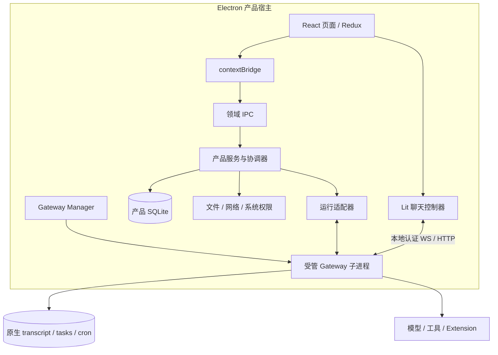
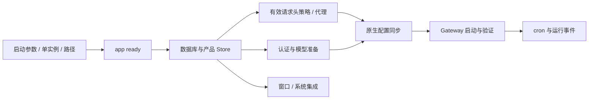

# 系统架构：产品宿主与执行运行时

本文描述 2026-09-24 源码中的组合、依赖和生命周期。产品概念见[总览](01-overview.md)，具体跨进程接口见[进程模型](03-process-model.md)。这里的核心问题是：一次产品操作如何跨组件完成，以及组件失败后谁负责恢复。

## 1. 两个状态所有者，一个桌面产品

应用由 Electron 产品宿主和 OpenClaw 执行运行时组成。Main 持有产品配置、会话索引、权限期望、运行回执和系统资源；Gateway 持有原生会话、消息、工具、任务与 cron。两者通过身份映射和明确的准备/确认过程协作，不能互相复制成第二套权威。

Renderer 同时接收两类数据：preload 提供产品命令与系统能力；集中式聊天控制器连接 loopback Gateway，接收消息与执行流。React 负责页面和工作区，Lit 负责高频聊天渲染，Redux 负责产品 UI 状态。

```mermaid
flowchart TB
  subgraph Desktop[Electron 产品宿主]
    UI[React 页面 / Redux] --> Chat[Lit 聊天控制器]
    UI --> Preload[contextBridge]
    Preload --> IPC[领域 IPC]
    IPC --> Product[产品服务与协调器]
    Product --> DB[(产品 SQLite)]
    Product --> Policy[文件 / 网络 / 系统权限]
    Product --> Adapter[运行适配器]
    Manager[Gateway Manager] --> Process[受管 Gateway 子进程]
    Adapter <--> Process
  end
  Chat <-->|本地认证 WS / HTTP| Process
  Process --> Native[(原生 transcript / tasks / cron)]
  Process --> Runtime[模型 / 工具 / Extension]
```

数据面直连只属于聊天库，不允许普通页面自行读取 token、创建任意 Gateway client 或调用 Node。Gateway 的进程独立性也不代表它不受产品权限约束：每次任务发送仍要先准备并核对原生 session mode/root。

## 2. 组合根与依赖注入

`src/main/main.ts` 负责创建服务、注入依赖、注册 handler、绑定运行事件和关闭资源。数据库及重型服务通过 getter 延迟访问，避免模块加载期间使用未就绪的 app 路径或 SQLite。领域逻辑留在所属模块，不能把所有恢复与业务分支放回 main.ts。

| 组件                         | 输入与职责                                    | 不负责的事实              |
| ---------------------------- | --------------------------------------------- | ------------------------- |
| SqliteStore / 领域 Store     | schema、同步事务、产品查询                    | 原生消息与执行结论        |
| CoworkEngineService / Router | 产品 session 到原生运行的路由和生命周期       | UI timeline               |
| OpenClawEngineManager        | runtime 资源、端口、token、进程、readiness    | 单条工具的业务结果        |
| ConfigSyncService            | 受管配置投影、串行写入、reload/restart 与验证 | 会话级权限的即时修改      |
| Permission coordinator       | session 权限/root 写入和回读                  | 扩大其他会话权限          |
| Goal coordinator             | 根据原生 Goal 决定续跑、等待和重试            | 原生目标内容与预算        |
| CollaborationCoordinator     | 成员、轮次、发送准入、停止与删除补偿          | peer 消息正文和执行调度器 |
| Cron/result sync             | 原生任务映射与本地结果收件箱                  | 第二套时钟或 cron 引擎    |

协调器不是通用事件总线。它们各自保留必要状态，并通过窄接口协作；同一产品状态不能被多个模块独立判定和反复写回。

## 3. 源码按责任组织

Main 的 `core/` 分为 app、window、network、runtime、filesystem、development。浏览器、语音、外部集成和 Windows 沙盒有自己的领域，不塞入通用工具文件。`providers/` 管理产品模型配置与认证；`openclaw/config/` 管理它们向原生配置的投影。

Renderer 的 feature 负责页面行为，settings 内按 models/browser/speech/integrations/runtime 等领域组织。插件按 skills/mcp/hooks/extensions/marketplace 组织。Cowork 组件按 chat/composer/sessions/goals/subagents/approvals/questions/preview/status 组织；跨领域组合仍由 CoworkView 承担。

Shared 只放可序列化合约、常量、校验和纯函数。不能依赖 Node、Electron、DOM 或进程环境。主题运行时在 Renderer，离线生成和 Tailwind 插件在 `scripts/theme/`。

大控制器入口持有实例状态和生命周期，领域模块接收显式类型上下文。`src/shared/app/propertyContext.ts` 提供实时访问器，使异步分支读取当前连接、会话和取消状态；不能用对象展开复制状态，也不能把整个控制器交给子模块。拆文件不意味着新增独立状态机。

## 4. 启动：从本地资源到可执行任务

启动不是“窗口出现即运行就绪”。关键依赖关系如下：

```mermaid
flowchart LR
  Entry[启动参数 / 单实例 / 路径] --> Ready[app ready]
  Ready --> Stores[数据库与产品 Store]
  Stores --> Network[有效请求头策略 / 代理]
  Stores --> Identity[认证与模型准备]
  Network --> Sync[原生配置同步]
  Identity --> Sync
  Sync --> Gateway[Gateway 启动与验证]
  Gateway --> Poll[cron 与运行事件]
  Stores --> Window[窗口 / 系统集成]
```

特殊 Multica bridge client 模式在普通 UI 初始化之前处理。正常启动设置产品 userData、日志、依赖管理器环境和系统 CA；ready 后初始化数据库，整理上次中断的产品运行状态，恢复网络偏好，再准备内置模型与受管配置。

有效请求头策略由手工配置和已启用、验证通过的 Extension 声明合成，不能等 Gateway 已发出请求后才切换代理 generation。配置同步失败会记录原因，后续执行准入不得把失败状态当可用。

浏览器侧栏 app-server、Native Messaging 发现文件、Multica 本机桥和托盘属于产品生命周期。它们有各自凭据和清理逻辑，不共用 Gateway token。UI 可显示启动或配置错误；窗口存在本身不证明模型可用。

## 5. 三条核心操作链

### 发送任务

产品会话先确定 main 身份、cwd、模型和权限。Main 等待配置更新、确认 Gateway readiness，并建立 clientTurnId/run receipt。原生会话准备核对 mode/root；发送后 Gateway 产生消息与运行事件。Main 更新生命周期，Renderer 合并实时与历史。发送超时需要确认原生是否接收，不能通过重复创建会话消除不确定性。

### 保存设置

Renderer 提交产品期望 → Main 校验并持久化 → 配置同步器生成受管字段 → 原生 reload 或必要的 restart → 回读验证 → UI 展示结果。不是所有字段都需要重启；会话权限走独立 RPC。可选扩展的显式关闭状态必须保留，不能被“补齐默认配置”覆盖。

### 安装插件

安装器先验证来源和格式，再在受管目录协调进程占用及文件变更，随后交原生管理接口应用，最后重新读取 inventory。下载成功、目录存在和运行注册成功是三个不同阶段。跨文件、SQLite、Gateway 的失败需要清理或明确补偿，不能用单个 SQLite transaction 声称全部原子。

## 6. 退出与更新安装

`registerAppShutdown` 保证 cleanup 只进入一次。main.ts 的清理顺序具有依赖：

1. 停止开发服务监控、凭据监控与活动上报，失效内存认证。
2. 清理浏览器 app-server 发现信息并关闭服务；销毁托盘，停止 Multica bridge。
3. 停止 cron 轮询，防止关闭过程中再启动后台工作。
4. 停止 Cowork 会话，再停止 Gateway。
5. 关闭 browser agent bridge、出站代理，最后关闭 SQLite。

更新安装复用同一清理过程。开发模式有 10 秒清理期限，超时独立尝试停止 Gateway 并最终退出；安装版不能照搬开发兜底为业务成功。先停数据库或代理会使仍工作的运行时失去依赖。

## 7. 故障按所有者恢复

| 故障                    | 恢复者                                  | 不能采取的捷径                 |
| ----------------------- | --------------------------------------- | ------------------------------ |
| Renderer 重载或会话切换 | UI 重订阅、查询产品索引并加载原生历史   | 从 Main 消息副本恢复           |
| Gateway 连接中断        | Adapter/client 新 generation 与状态对账 | 无条件重发最后一次写操作       |
| 配置应用失败            | ConfigSyncService 报错或按领域回滚      | UI 只显示“已保存”              |
| 整任务删除部分完成      | 持久删除进度继续补偿                    | 先隐藏全部本地行再丢失原生身份 |
| 原生接收结果未知        | 保留 unknown，按协议确认                | 将超时认定为未执行             |
| 文件被其他进程修改      | 文件授权版本校验拒绝或用户重载          | 覆盖冲突版本                   |

完整应用重启和同进程 Gateway 重启的恢复边界不同，见[执行引擎](05-agent-engine.md)。产品数据库也可能需要迁移，但运行时补丁不支持旧修订就地升级。

## 8. 验证与修改范围

架构变更应从共享合约追到实际注册、服务、消费方及测试。重点验证启动配置失败、快速停止、重连、卸载和部分删除，不能只跑首次成功发送。

入口测试包括 `core/app/appShutdown.test.ts`、运行时 manager 测试、cowork handler/adapter 测试和 config sync 测试，均位于 `src/main/` 相应领域。本页说明现有责任和检查范围，不把测试文件存在等同于当前平台已通过验收。
