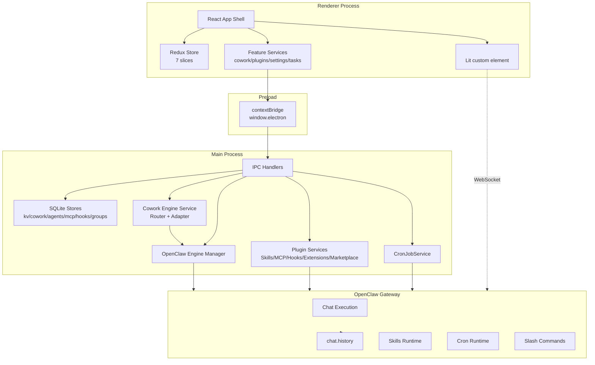
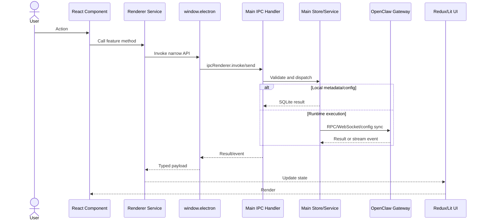
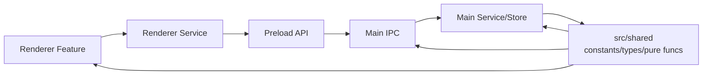
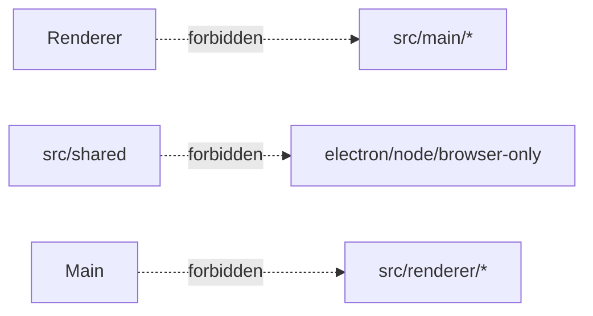

# 系统架构

JustDo 使用严格的 Electron 进程隔离架构：Renderer 只负责浏览器侧 UI，Preload 暴露受控 API，Main 进程负责本地能力、SQLite、IPC、OpenClaw Gateway 生命周期和插件服务。

## 分层图


```mermaid
flowchart TB
  subgraph R["Renderer Process"]
    App["React App Shell"]
    Store["Redux Store\n7 slices"]
    Chat["<justdo-chat>\nLit custom element"]
    Features["Feature Services\ncowork/plugins/settings/tasks"]
  end

  subgraph P["Preload"]
    Bridge["contextBridge\nwindow.electron"]
  end

  subgraph M["Main Process"]
    IPC["IPC Handlers"]
    SQLite["SQLite Stores\nkv/cowork/agents/mcp/hooks/groups"]
    Engine["Cowork Engine Service\nRouter + Adapter"]
    Runtime["OpenClaw Engine Manager"]
    Plugins["Plugin Services\nSkills/MCP/Hooks/Extensions/Marketplace"]
    Scheduler["CronJobService"]
  end

  subgraph G["OpenClaw Gateway"]
    Exec["Chat Execution"]
    History["chat.history"]
    SkillRuntime["Skills Runtime"]
    Cron["Cron Runtime"]
    Slash["Slash Commands"]
  end

  App --> Store
  App --> Features
  App --> Chat
  Features --> Bridge
  Bridge --> IPC
  IPC --> SQLite
  IPC --> Engine
  IPC --> Runtime
  IPC --> Plugins
  IPC --> Scheduler
  Engine --> Runtime
  Runtime --> G
  Chat -. "WebSocket" .-> G
  Scheduler --> G
  Plugins --> G
  G --> History
```

## 核心边界

| 层 | 路径 | 责任 |
| --- | --- | --- |
| Main | `src/main/` | Electron 生命周期、IPC、SQLite、Gateway、插件、定时任务 |
| Preload | `src/main/preload.ts` | 暴露 `window.electron`，不放业务状态 |
| Renderer | `src/renderer/` | React/Lit UI、Redux、用户交互 |
| Shared | `src/shared/` | 跨进程类型、常量和纯函数 |
| Resources | `resources/` | 内置 skills、tray 图标、runtime 辅助资源 |
| Vendor | `vendor/openclaw-runtime/` | 下载并同步的 OpenClaw runtime |

## Renderer 结构

```text
src/renderer/
  app/
    App.tsx
    shell/
  features/
    agents/
    cowork/
    models/
    plugins/
    scheduled-tasks/
    settings/
  libs/openclaw-chat/
  services/
  shared/
  store/index.ts
```

Redux store 当前挂载：

- `model`
- `cowork`
- `skill`
- `mcp`
- `scheduledTask`
- `agent`

## Main 结构

```text
src/main/
  core/
  cowork/
  data/
  engine/
  ipc/
  openclaw/
  plugins/
  scheduler/
  main.ts
  preload.ts
```

关键入口：

- `src/main/main.ts` 初始化应用、store、Gateway、IPC、窗口和托盘。
- `src/main/openclaw/runtime/openclawEngineManager.ts` 管理 Gateway 下载、安装、启动、停止和状态。
- `src/main/engine/coworkEngineService.ts` 和 `coworkEngineRouter.ts` 负责 Cowork 调度外观。
- `src/main/plugins/index.ts` 汇总 skills、MCP、hooks、extensions 和 marketplace 服务。
- `src/main/ipc/**` 注册 renderer 可调用的主进程 API。

## 数据流


```mermaid
sequenceDiagram
  actor User
  participant UI as React Component
  participant Service as Renderer Service
  participant Preload as window.electron
  participant IPC as Main IPC Handler
  participant Domain as Main Store/Service
  participant Gateway as OpenClaw Gateway
  participant Redux as Redux/Lit UI

  User->>UI: Action
  UI->>Service: Call feature method
  Service->>Preload: Invoke narrow API
  Preload->>IPC: ipcRenderer.invoke/send
  IPC->>Domain: Validate and dispatch
  alt Local metadata/config
    Domain-->>IPC: SQLite result
  else Runtime execution
    Domain->>Gateway: RPC/WebSocket/config sync
    Gateway-->>Domain: Result or stream event
  end
  IPC-->>Preload: Result/event
  Preload-->>Service: Typed payload
  Service-->>Redux: Update state
  Redux-->>UI: Render
```

## 设计约束

- Renderer 不导入 Node.js、Electron 或 main-process-only 代码。
- Shared 不导入 Node.js、Electron 或 DOM-only API。
- IPC channel、状态值、判别字符串优先放在 shared constants。
- 用户可见字符串必须进入 i18n map。
- SQLite 只保存本地产品数据、配置和 UI cache；Gateway history 是执行事实来源。

## 详细模块设计

### Renderer Layer

Renderer 是产品交互层，而不是系统能力层。它可以持有用户正在看的列表、选中的会话、弹窗状态、临时输入内容和渲染缓存，但不能直接持有文件系统、SQLite、Gateway process 或 shell 权限。

```text
src/renderer/
  app/
    App.tsx                  应用根组件
    shell/                   Sidebar、Toast、WindowTitleBar
    constants/               renderer app constants

  features/
    cowork/                  会话、输入、附件、权限、搜索、子任务 UI
    agents/                  Agent 列表、类型和 service
    models/                  模型选择和 OpenClaw model ref 解析
    plugins/                 Skills、MCP、Hooks、Extensions UI
    scheduled-tasks/         定时任务 CRUD、运行历史、会话跳转
    settings/                应用设置、模型设置、快捷键

  libs/openclaw-chat/        Lit chat renderer 和 Gateway websocket client
  services/                  i18n、theme、config、store、shortcuts
  shared/                    renderer-only UI 基础组件和图标
  store/index.ts             Redux root store
```

Renderer service 的职责是把 UI 事件变成 `window.electron` 调用，并把失败结果转换成 UI 可理解的错误状态。Renderer service 不应该绕过 preload 去 import main 文件，也不应该把 IPC channel 字符串散落在组件里。

### Preload Layer

Preload 是安全门面。它暴露的是面向业务的窄 API，而不是 `ipcRenderer` 的完整能力。历史上保留的 `ipcRenderer.send/on` 只适合少数旧的事件型场景，新功能应优先添加明确 namespace。

设计要求：

- 参数尽量使用对象，便于后续兼容扩展。
- 事件 listener 必须返回 unsubscribe 函数。
- 不在 preload 中保存复杂业务状态。
- 不在 preload 中读取文件或执行网络请求，交给 Main process。

### Main Layer

Main process 是本地能力层，负责所有可能影响系统、文件、进程、网络、SQLite 和 Gateway 的操作。

```text
src/main/
  main.ts                    bootstrap 和依赖装配
  preload.ts                 contextBridge API
  core/                      桌面基础设施
  data/                      SQLite store
  ipc/                       IPC handler 分域注册
  engine/                    Cowork engine facade
  openclaw/                  Gateway runtime/config/session/model/slash commands
  plugins/                   skills/mcp/hooks/extensions/marketplace
  scheduler/                 CronJobService 和执行 prompt
```

Main 中的服务通常由 `main.ts` 通过 getter 懒加载注入，例如 `getCoworkStore()`、`getOpenClawEngineManager()`、`getMcpServices()`。这种方式避免启动时循环依赖，也让 IPC handler 可以在 app ready 后访问实际资源。

## 依赖方向


```mermaid
flowchart LR
  RF["Renderer Feature"] --> RS["Renderer Service"]
  RS --> PL["Preload API"]
  PL --> IPC["Main IPC"]
  IPC --> MS["Main Service/Store"]
  Shared["src/shared\nconstants/types/pure funcs"] --> RF
  Shared --> IPC
  Shared --> MS
  MS --> Shared
```

禁止方向：


```mermaid
flowchart LR
  Renderer["Renderer"] -. "forbidden" .-> Main["src/main/*"]
  SharedBad["src/shared"] -. "forbidden" .-> Platform["electron/node/browser-only"]
  MainBad["Main"] -. "forbidden" .-> RendererFiles["src/renderer/*"]
```

## 启动序列

1. `main.ts` 设置 `userData` 到 `JustDo` 专用目录。
2. 初始化日志、Electron command line、异常处理。
3. 注册 IPC handlers。
4. `app.whenReady()` 后启动 outbound proxy、注册本地协议。
5. 初始化 SQLite，执行 schema 兼容和旧数据迁移。
6. 初始化 Cowork store、provider config getter、内置模型 provider。
7. 绑定 Cowork runtime event forwarder 和 Gateway 状态 forwarder。
8. 同步 OpenClaw config。
9. 启动 Gateway，并在 ready 后启动 scheduled task polling。
10. 创建 BrowserWindow、tray，并把 engine status 推给 renderer。

## 错误处理策略

- Main process 捕获未处理异常并写日志，但不把内部 stack 原样暴露给用户。
- IPC handler 返回 typed failure result，renderer 负责转成用户可见文案。
- Gateway 未就绪时返回 `ENGINE_NOT_READY` 和当前 engine status。
- SQLite migration/cleanup 失败应记录 warning，不应阻止可恢复启动。
- Proxy/Gateway restart 是异步流程，UI 通过 status event 得知变化。

## 可扩展点

| 扩展点 | 推荐落点 | 注意事项 |
| --- | --- | --- |
| 新设置项 | renderer settings + `kv` / domain store | 增加 i18n 和迁移默认值 |
| 新 IPC 功能 | `src/main/ipc/<domain>/` + preload namespace | 使用 shared constants |
| 新 Gateway 能力 | `src/main/openclaw/<domain>/` 或 adapter | 不把 execution truth 放进 SQLite |
| 新 plugin 类型 | `src/main/plugins/` + `src/renderer/features/plugins/` | Main owns transport |
| 新 UI 缓存 | SQLite domain store | 明确 authority |
