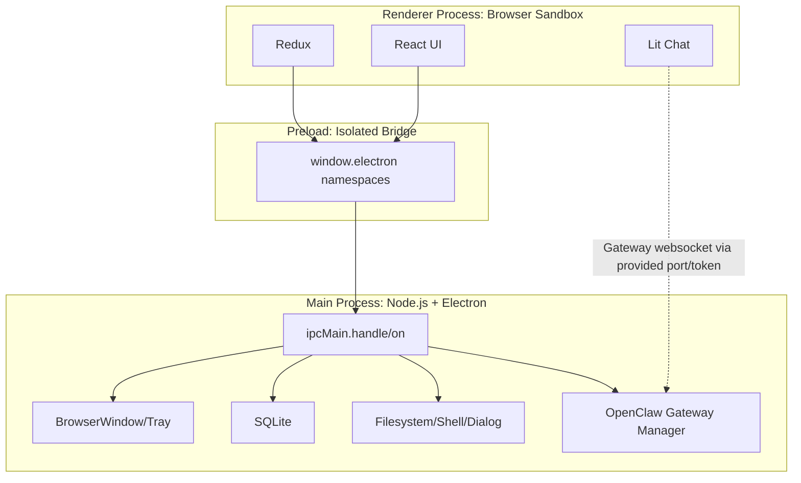
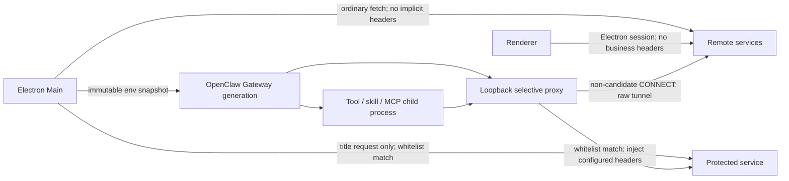
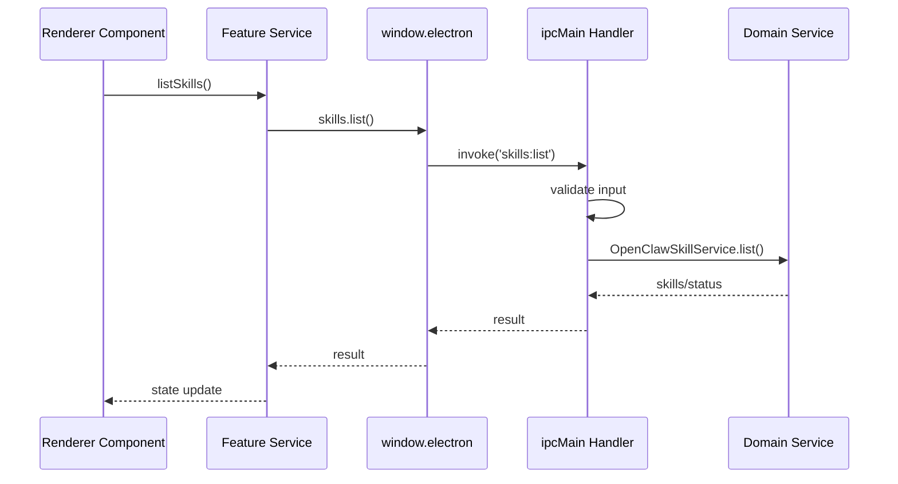
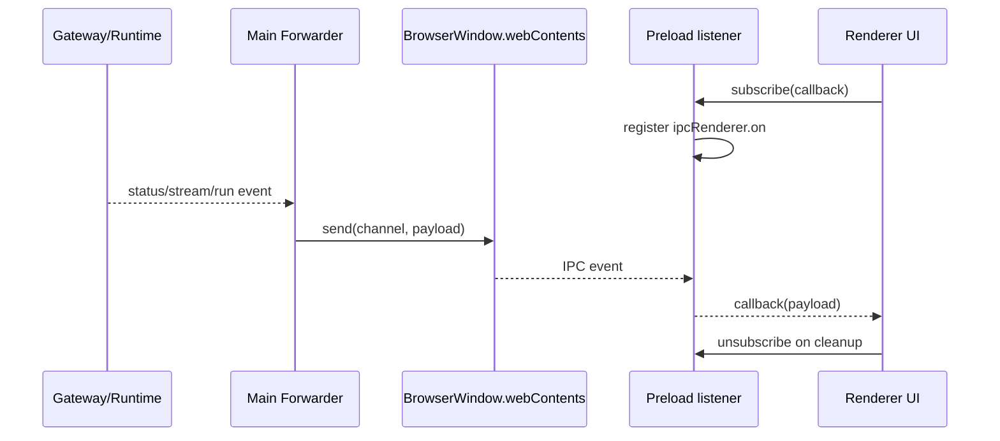

# 进程模型与 IPC

JustDo 使用 Electron 的 Main / Preload / Renderer 三层隔离。Renderer 只能通过 `src/main/preload.ts` 暴露的 `window.electron` API 访问本地能力。

## 进程职责

| 进程     | 路径                                | 能力                                                                     |
| -------- | ----------------------------------- | ------------------------------------------------------------------------ |
| Main     | `src/main/main.ts` 和 `src/main/**` | Electron API、SQLite、文件系统、OpenClaw Gateway、插件服务、IPC handlers |
| Preload  | `src/main/preload.ts`               | `contextBridge.exposeInMainWorld('electron', ...)`                       |
| Renderer | `src/renderer/**`                   | React、Redux、Lit、UI 状态、用户交互                                     |



## Preload API 分组

`window.electron` 当前暴露的主要分组：

| 分组               | 用途                                                    |
| ------------------ | ------------------------------------------------------- |
| `store`            | `kv` 配置读写                                           |
| `skills`           | skill 列表、启停、安装、搜索、详情、本地导入、删除      |
| `hooks`            | OpenClaw hooks 列表和启停                               |
| `slashCommands`    | 从 Gateway/策略读取 slash command 列表                  |
| `mcp`              | MCP server CRUD、配置同步、探测、resource 读取          |
| `permissions`      | 系统权限，例如日历权限                                  |
| `api`              | main-process 代理的普通 HTTP fetch                      |
| `window`           | 窗口最小化、最大化、关闭、系统菜单、窗口状态            |
| `openclaw.engine`  | Gateway 状态、端口、token、重启、打开终端、进度事件     |
| `openclaw.history` | 工具输入和分页历史读取                                  |
| `agents`           | Agent 列表                                              |
| `cowork`           | session CRUD、执行、ask-user 响应、流式事件、子任务状态 |
| `sessionGroup`     | 会话分组 CRUD、排序、移动会话                           |
| `dialog`           | 文件/目录选择、文本保存、inline file、本地文件 data URL |
| `shell`            | 打开路径、预览文件、定位文件、外部链接                  |
| `autoLaunch`       | 开机启动                                                |
| `preventSleep`     | 防休眠                                                  |
| `developerConfig`  | 读取启动时加载的开发者功能可见性配置                    |
| `appInfo`          | 应用版本、OpenClaw 版本、系统语言                       |
| `appUpdate`        | Windows 更新状态、手动检查、重启安装和状态事件         |
| `builtinModels`    | 刷新内置模型 provider                                   |
| `log`              | 日志路径、打开日志目录、导出 zip、debug 日志            |
| `scheduledTasks`   | 定时任务 CRUD、手动运行、运行历史、状态事件             |
| `networkStatus`    | renderer 网络状态上报                                   |

## IPC 注册位置

| 领域                                                    | Main handler 路径             |
| ------------------------------------------------------- | ----------------------------- |
| app/window/dialog/shell/log/network/store               | `src/main/ipc/app/`           |
| cowork sessions/config/ask-user/agents/subtasks/groups  | `src/main/ipc/cowork/`        |
| OpenClaw engine/history/skills/mcp/hooks/slash commands | `src/main/ipc/openclaw/`      |
| scheduled tasks                                         | `src/main/ipc/scheduledTask/` |

## 事件流

```text
Renderer service
  -> window.electron.<domain>.<method>()
  -> ipcRenderer.invoke/send
  -> main IPC handler
  -> store/service/runtime adapter
  -> return value or event
```

Streaming Cowork events use IPC event listeners such as:

- `cowork:stream:message`
- `cowork:stream:messageUpdate`
- `cowork:stream:thinkingUpdate`
- `cowork:stream:interaction`
- `cowork:stream:complete`
- `cowork:sessions:changed`

Scheduled task events use constants from `src/shared/scheduledTask/constants.ts`.

Windows 正式安装包的自动更新由 Main 中的更新服务独占。NSIS 安装完成后会在 resources
目录写入安装标记；Main 同时检查 packaged、Windows、安装标记、构建配置标记和
`app-update.yml`，避免 `win-unpacked`、复制版或未配置 feed 的本地验证包误启用更新。Renderer 只能读取带单调
revision 的状态、请求检查或
请求安装，不能指定 feed URL 和本地安装包。更新下载完成后，Main 先执行与正常退出相同的
OpenClaw、扩展宿主、定时任务和 SQLite 清理，再启动 NSIS 安装器；开发环境和非 Windows
平台返回 `unsupported`。如果安装器在清理完成后启动失败，Main 会重新启动当前应用，避免
Renderer 停留在数据库和后台服务已关闭的半退出状态。

## Rules

- Do not expose raw `ipcRenderer` for new app features unless a narrow API cannot cover the use case.
- New IPC channels should use shared constants when they are referenced from both sides.
- All handler inputs must be normalized in main process before touching filesystem, SQLite, Gateway, or marketplace services.
- Renderer must treat every IPC result as fallible and show localized errors.

## OpenClaw 出站 Header 代理边界

Outbound Header Proxy 的代理数据面只属于 OpenClaw Gateway generation，不是 Electron
Main 或 Renderer 的全局网络层。代理启动后，Main 为即将启动的 Gateway 构造一份新的环境
快照，并仅通过 Gateway spawn 的 `env` 传入代理、CA 和 `NO_PROXY` 设置；不得改写 Main
的 `process.env`，也不得替换 Main `fetch` 或注册 Renderer `webRequest` Header listener。
Gateway 的 MITM CA bundle 使用独立文件，不能与普通运行时的基础信任 bundle 共用输出
路径，避免后续基础证书刷新覆盖代理 CA。
唯一例外是确定性的 Main 标题生成请求：该调用点按同一 URL 白名单匹配，命中后显式加入
配置 Header，但仍使用 Main 自己的普通网络 transport，不经过本地 MITM 代理。



每个 Gateway generation 使用新的随机本地代理 capability。普通 HTTP 代理请求和 CONNECT
必须先通过代理认证；认证信息在本地一跳消费，不能发送到目标或复用为上游代理认证。
部分 Gateway HTTP 客户端也会用 CONNECT 承载明文 HTTP，因此代理在 CONNECT 建立后根据
首个 tunnel 数据包区分 HTTP 与 TLS，再按对应协议的 origin 决定解析或 raw tunnel。命中的
明文 HTTP tunnel 继承已验证的 CONNECT capability，并在解析后按完整 URL/path 决定是否
注入；非候选 HTTPS origin 只建立原始 tunnel，不生成本地证书。普通 loopback 地址保留在
`NO_PROXY` 中；当前 env-proxy 模式忽略 loopback 白名单，以免为了一个本地目标破坏全部
本地服务访问。

远程 Header 白名单与用户 `NO_PROXY` 属于不同代理层，不能把用户规则当作配置错误。
Main 为 Gateway 构造环境快照时，第一跳 `NO_PROXY` 只保留 loopback 和 Gateway 自身端口，
使当前白名单以及 generation 运行期间刷新的白名单都能到达本地代理；同时把未经修改的
用户 `NO_PROXY` 保存为该 Gateway generation 的上游路由策略。本地代理完成选择性 Header
注入后，命中原始用户 bypass 的请求仍然直连目标，不会转发给系统或自定义上游代理。由于
`NO_PROXY` 不支持“域名后缀整体直连、其中一个 origin 先走本地代理”的反向例外，类似
`*.huawei.com` 的远程 bypass 规则会让该后缀流量先经过本地 socket，但非白名单 HTTPS
仍使用原始 raw tunnel，最终上游直连语义保持不变。启动时已知白名单发生重叠时，Main
日志记录冲突的
`NO_PROXY` 条目、涉及的 Header 名称、未禁用任何 Header 的处理结果，以及 Tool 在运行期
重新设置冲突规则仍可能绕过注入的限制；日志不得包含 Header 值。

关闭时先停止 Cowork 请求和 Gateway 进程树，最后关闭本地代理，避免仍在退出的 tool
请求命中已经释放的代理端口。

env-proxy 无法精确表达“同一 loopback 主机只有某个端口经过代理”。因此 loopback 白名单
不会让应用启动失败，但会从 Gateway 代理策略中忽略并给出脱敏警告；普通 loopback 流量
继续直连。确定性的 Main 标题请求不依赖 env proxy，仍可在调用点匹配这类 URL。

### 内网运行默认值

JustDo 生成的 OpenClaw 配置关闭启动版本检查、自动更新、远程模型价格目录、
`web_search` 和 OTEL 导出。Gateway 环境同时设置 `OPENCLAW_OFFLINE=1`，避免缺少
`fd`/`rg` 时从 GitHub 自动下载。`web_fetch` 与 browser 保持开启；`web_fetch` 使用
JustDo 传给 Gateway 的受信任出口代理解析域名，并额外兼容 RFC 2544 的
`198.18.0.0/15` Fake-IP 范围。browser 允许私网和特殊地址，以兼容 Clash/Surge 等
代理的非标准 Fake-IP 地址池，并与本地命令、Python、MCP 和 skill 子进程已有的网络
能力保持一致。这些应用层配置不是网络隔离边界；需要限制公网或内网访问的部署必须
使用防火墙、出口网关或受控代理统一限制所有进程。

## IPC API 详细说明

### 调用型 IPC

调用型 API 使用 `ipcRenderer.invoke()` / `ipcMain.handle()`。它适合 CRUD、查询、保存、启动一次动作等有明确返回值的操作。



调用型 handler 的返回值应该是稳定结构。推荐形态：

```typescript
type IpcSuccess<T> = { success: true; data: T };
type IpcFailure = {
  success: false;
  code?: string;
  error: string;
  details?: unknown;
};
```

现有代码仍有部分历史 API 直接返回数组或 domain object；新增 API 应优先使用 typed result，便于 renderer 做统一错误处理。

### 事件型 IPC

事件型 API 使用 `ipcRenderer.on()` / `webContents.send()`，适合 Gateway status、Cowork stream、scheduled task polling 等异步状态。



所有事件 listener 都应在 preload 中返回 unsubscribe：

```typescript
onStatusUpdate: callback => {
  const handler = (_event, data) => callback(data);
  ipcRenderer.on(IpcChannel.StatusUpdate, handler);
  return () => ipcRenderer.removeListener(IpcChannel.StatusUpdate, handler);
};
```

Renderer component 必须在 `useEffect` cleanup 中调用 unsubscribe，避免切换会话或反复打开弹窗后重复监听。

## Preload Namespace 设计

### `cowork`

`cowork` 是最大的一组 API，覆盖：

- session create/continue/stop/delete/list/get
- pin/rename/model patch
- runtime status/context usage
- ask-user interaction response
- stream message/thinking/interaction/complete/error events
- subtask status/session lookup

设计重点是区分“用户请求”和“runtime event”。用户请求走 `invoke`，runtime event 走 listener。不要在 renderer 中根据 event 自行推断 Gateway truth；必要时通过 `getSessionRuntimeStatus()` 或 Gateway history 再查询一次。

### `openclaw.engine`

`openclaw.engine` 只暴露 runtime lifecycle 的必要控制：

- 查询状态
- 查询端口/token
- 设置端口
- 重启 Gateway
- 打开 terminal
- 订阅 progress

Renderer 不知道 runtime 安装路径、patch 细节或 child process handle。

### `mcp` / `hooks` / `skills`

这三类 plugin API 都遵循同一个原则：

```text
Renderer UI -> Main local store/service -> OpenClaw config/RPC sync -> Gateway
```

Renderer 不直接读取 `openclaw.json`，不直接管理 stdio process，也不直接访问 marketplace。

### `dialog` / `shell`

`dialog` 用于显式用户选择文件/目录。`shell` 用于打开、定位、预览本地文件和外部 URL。新增文件能力时优先放进这两个 namespace，避免组件直接构造本地路径访问。

## Main Handler 注册策略

`src/main/main.ts` 负责组合依赖并注册 handler。handler 本身应保持薄：

1. 校验输入。
2. 调用 domain service/store。
3. 处理异常并返回稳定结果。
4. 必要时触发 event。

复杂逻辑不要塞进 IPC 文件；放进 domain service，例如：

- `OpenClawConfigSyncService`
- `McpServices`
- `OpenClawHookServices`
- `OpenClawSkillService`
- `CoworkEngineService`
- `CronJobService`

## 安全注意事项

- `ipcRenderer` raw send/on 是历史兼容口，不作为新能力入口。
- 不允许 renderer 传入任意 IPC channel 后由 main 动态执行。
- 文件路径要在 main process 归一化，并结合用户选择或 workspace 语义判断。
- URL 打开前应区分 local path、external URL 和 custom protocol。
- 日志 API 不应泄漏 token/API key。
