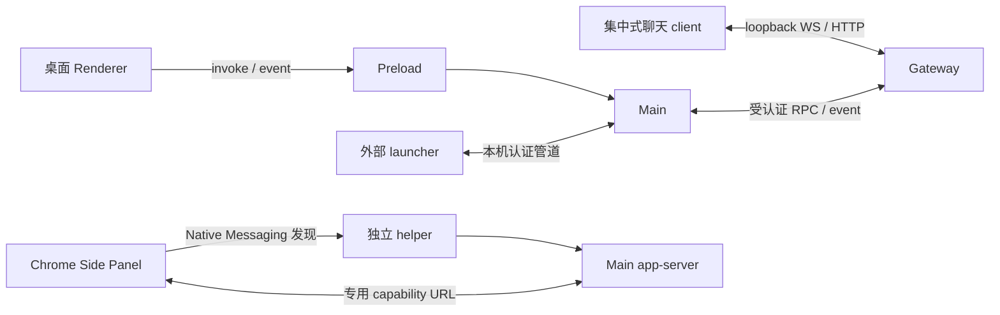
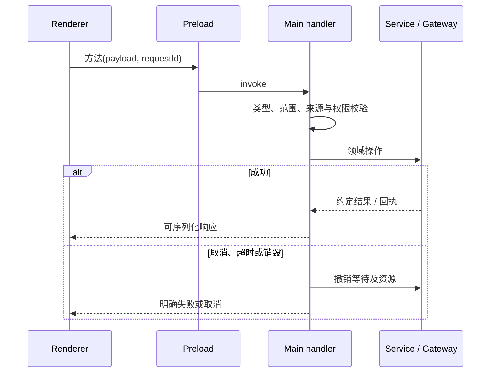

# 进程模型、通信与请求生命周期

本页按当前 preload、Main 注册入口和共享合约描述通信机制。接口常量及 payload 以 `src/shared/` 为准；这里解释为什么不同通道分开、请求如何结束、旧响应如何失效。

## 1. 运行实体和信任范围

| 实体           | 可访问资源                                  | 通信边界                                                    |
| -------------- | ------------------------------------------- | ----------------------------------------------------------- |
| 主 Renderer    | React/Lit UI、浏览器 API、显式 preload 能力 | 不能直接访问 Node/Electron/SQLite                           |
| Browser guest  | 外部网页及隔离 partition                    | 固定 guest preload；不获得 window.electron 或 Gateway token |
| 图片预览窗口   | 独立图片展示                                | 沙箱窗口与受限参数                                          |
| Preload        | contextBridge 与 Electron IPC               | 固定方法和可取消订阅                                        |
| Main           | 文件、数据库、网络、子进程、窗口            | 校验来自所有客户端的输入                                    |
| Gateway        | 原生执行与 transcript                       | 本地认证 RPC/event 和受控插件桥                             |
| Chrome 扩展    | Side Panel、用户浏览器上下文                | Native Messaging 发现产品 app-server                        |
| Multica client | 当前用户本机进程                            | 受认证 named pipe/Unix socket                               |

主 Renderer 与图片预览 HTML 分别由 `src/renderer/index.html` 和 `image-preview.html` 构建。开发由 Vite 提供，生产从 dist 加载。外部 guest 始终是另一权限域，即使视觉上位于同一侧栏。

## 2. 四类通道不能混用

### 产品命令与查询

`ipcRenderer.invoke`/`ipcMain.handle` 用于会话管理、设置、文件预览、插件和定时任务。handler 负责边界校验，service 负责业务并发和资源生命周期。返回可序列化数据，不返回 Error、数据库对象或完整凭据。

同一名称的“成功”必须明确阶段。例如会话创建成功可能仅意味着产品行存在；原生运行接收与执行完成仍有各自回执。接口不能把这几个阶段压成一个无说明的布尔值。

### 产品通知

Main 通过 webContents 事件通知会话变化、目标执行、审批、结果和更新状态。preload 为监听器返回 unsubscribe。通知可以丢失或重复，消费者重连后应查询权威状态，而不是假设收到过全部历史事件。

### 聊天数据

桌面聊天 wrapper 从 preload 取得 Main 管理的本地连接信息，集中式 GatewayClient/ChatController 消费原生事件和历史。分页历史还使用 Main history bridge，必要时走认证 loopback REST fallback。token 只用于受控聊天连接，不进入 Redux、导出或外部网页。

Thinking/Tool/Content 不经过 Main 复制给 UI。Main 只消费生命周期、身份、审批和 Goal 等产品所需事件。聊天 wire 校验与 Renderer timeline 的职责见[聊天渲染](15-chat-rendering.md)。

### 扩展与外部客户端

Chrome Side Panel 不取得 Gateway token。Native host 发现或拉起桌面进程，返回动态 app-server URL；Main 校验 capability、精确 Origin、path 和消息大小。初始化完成后只接受实现的 thread/composer/turn 方法。协议详见[扩展 API](../browser-extension-api/README.md)。

Multica launcher 通过当前用户管道提交白名单命令和任务环境。Main 验证 token、frame、cwd、argv 与生命周期后调用受管 CLI。外部 CLI stdout 只返回约定可见结果，不透出运行凭据。它不复用 Chrome 的 URL capability。

## 3. 一次 IPC 请求必须有完整生命期

请求 ID、clientTurnId、原生 runId 有不同用途，不能相互替代。对有副作用的调用，取消等待也不必然撤销远端副作用；handler 必须知道原生是否已接收，再决定停止、查询或返回未知。

文件编辑 grant、PDF 读取和网络请求按调用者绑定；窗口销毁清理其资源。会话切换不应取消属于另一后台任务的原生执行，但应使旧 UI 请求结果失效。确认按钮或 modal 被卸载也不是审批允许。

## 4. Cowork 通道的关键契约

首轮 `cowork:session:start` 校验消息、main 身份、工作目录与 clientTurnId，等待配置和引擎准备后创建会话及运行绑定。`SessionStartIpc.Cancel` 可取消准入前等待；已经产生 session 时走停止；迟到取消必须匹配当前 turn，不能停止后续新运行。

后续直接发送仍需 Main 准备会话权限。run begin/bind/fail/unknown 等产品回执区别本地意图与原生接收，UI 不能从“invoke 已返回”推断模型完成。批量运行状态需合并原生主运行、子任务和 Goal 续跑阶段。

interaction response/replay 使用固定请求身份。AskUserQuestion 与 PresentPlan 的 pending 权威在对应 Extension；审批请求由原生机制拥有。Main 转接并验证，Renderer 只展示、提交选择和恢复待处理交互。

## 5. Browser guest 是单独的资源边界

Main 在 will-attach-webview 中覆盖为固定 preload，强制 sandbox、context isolation、无 Node 和合法导航。tab 注册同时验证主窗口归属、webContents 类型、profile partition 与存储路径，不能只相信 Renderer 提交的数字 ID。

普通人工点击由 Chromium 直接处理；Agent 操作通过 embedded-browser 的受控插件事件到 Main，再定位真实 guest。同一 guest 命令串行。截图、DOM、页面文本是外部不可信输入；文件上传和下载输出还要经过任务工作区校验。

用户标注、操作演示与 Agent 控制存在互斥 lease。录制内容走 guest → Renderer，Main 只管理保护与归属；停止、导航、崩溃和窗口销毁释放资源。录制内容的字段及隐私限制见[操作演示](../features/browser-operation-recording.md)。

HTTP 登录请求、媒体权限、PDF 读取各有独立超时和销毁语义，不能共用一个页面全局授权布尔值。详细 guest 行为在[浏览器设计](../features/browser-settings-design.md)，不再散放到通用 IPC 清单。

## 6. 注册、订阅与重连

`main.ts` 组合并注册 app/cowork/openclaw/scheduledTask 等 handler；preload 与 `src/renderer/types/electron.d.ts` 必须同步。IPC 兼容入口也只能允许白名单 channel，不能演变成任意 invoke。

订阅建立时捕获的 session、连接 generation 和请求代次必须参与响应准入。页面卸载移除 listener；Gateway 重启刷新连接与待处理交互；系统唤醒触发连接恢复。不会因为网络恢复而重放所有未完成写请求。

开发窗口跟随其 loopback Vite 服务：周期探测连续失败后进入正常退出，开发 URL 交接使旧探测结果失效。该行为不依赖终端父子进程关系，也不应影响安装版生命周期。

## 7. 错误要保留可操作的区别

| 错误             | 通信层结果           | 消费方处理                   |
| ---------------- | -------------------- | ---------------------------- |
| payload 不合法   | 拒绝，领域操作不开始 | 修正输入，不重试原样请求     |
| 引擎未就绪       | 状态/错误随响应返回  | 展示配置或启动问题           |
| 明确原生拒绝     | failed               | 展示拒绝原因                 |
| 超时且可能已接收 | unknown 或查询结果   | 不盲目再次发送               |
| 旧请求结果       | 丢弃 UI 更新         | 不覆盖当前会话               |
| 审批过期/已解决  | 原生终态             | 关闭过期交互，不提交默认允许 |
| 窗口销毁         | 释放 owner 资源      | 后台执行按其任务生命周期处理 |

## 8. 新增能力如何检查

先在 shared 定义 channel、请求和返回契约；Main 边界验证并调用领域服务；preload 暴露最小方法；Renderer 声明与消费方同步；最后覆盖不合法参数、取消、销毁、迟到响应和重复请求。

高风险接口还要验证来源身份和资源归属。不能只给 TypeScript interface 加字段就认定运行时边界成立。已有测试可从 `ipc/cowork/sessionExecution`、`ipc/app`、browser server 和聊天 controller 的领域测试开始定位。
