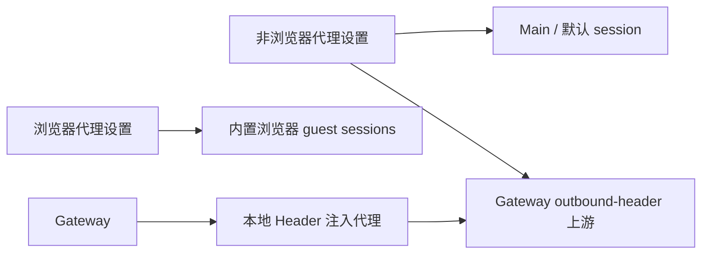
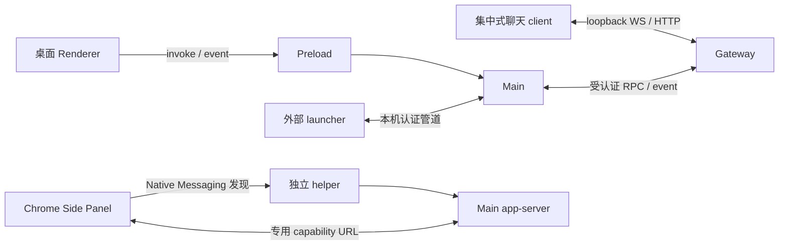
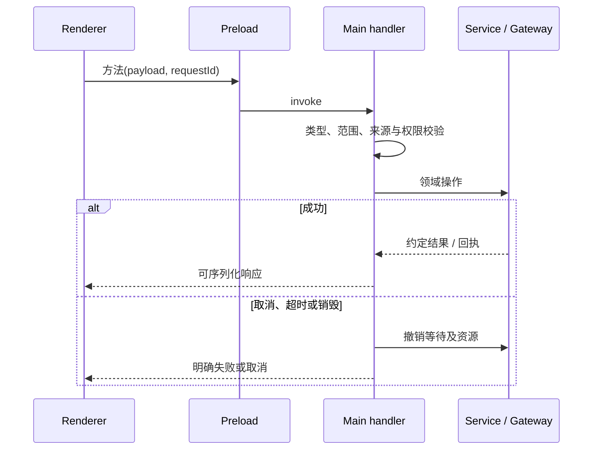
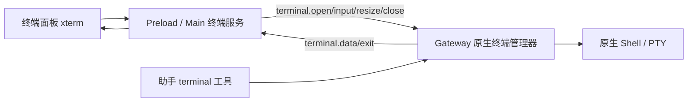

# 进程模型、通信与请求生命周期

本页按当前 preload、Main 注册入口和共享合约描述通信机制。接口常量及 payload 以 `src/shared/` 为准；这里解释为什么不同通道分开、请求如何结束、旧响应如何失效。

## 1. 运行实体和信任范围

| 实体           | 可访问资源                                  | 通信边界                                                    |
| -------------- | ------------------------------------------- | ----------------------------------------------------------- |
| 主 Renderer    | React/Lit UI、浏览器 API、显式 preload 能力 | 不能直接访问 Node/Electron/SQLite                           |
| Browser guest  | 外部网页及隔离 partition                    | 固定 guest preload；不获得 window.electron 或 Gateway token |
| 图片预览窗口   | 独立图片展示                                | 沙箱窗口与受限参数                                          |
| Preload        | contextBridge 与 Electron IPC               | 固定方法和可取消订阅                                        |
| Main           | 文件、数据库、网络、子进程、窗口            | 校验来自所有客户端的输入                                    |
| Gateway        | 原生执行与 transcript                       | 本地认证 RPC/event 和受控插件桥                             |
| Chrome 扩展    | Side Panel、用户浏览器上下文                | Native Messaging 发现产品 app-server                        |
| Multica client | 当前用户本机进程                            | 受认证 named pipe/Unix socket                               |

主 Renderer 与图片预览 HTML 分别由 `src/renderer/index.html` 和 `image-preview.html` 构建。开发由 Vite 提供，生产从 dist 加载。外部 guest 始终是另一权限域，即使视觉上位于同一侧栏。

### 浏览器与非浏览器的代理范围

产品配置为两类请求保留独立代理偏好。`proxy`（以及既有 `useSystemProxy` 标志）只用于 Main、默认 Electron session 与 Gateway 进程环境，默认直连；`browserProxy` 只用于应用持有的浏览器 guest sessions，默认系统代理。浏览器模式与用户 Chrome 自身的网络配置不由这个 guest 偏好改写。

```mermaid
flowchart LR
  AP[非浏览器代理设置] --> Default[Main / 默认 session]
  AP --> Header[Gateway outbound-header 上游]
  BP[浏览器代理设置] --> Guest[内置浏览器 guest sessions]
  Gateway[Gateway] --> Inject[本地 Header 注入代理] --> Header
```

非浏览器代理变化保留原有 Gateway 空闲重启流程。浏览器代理变化在独立队列中更新现有 guest sessions、关闭旧连接；新 profile 注册也使用该队列，避免快速切换时旧偏好覆盖新配置。它不改变默认 session、Main 代理状态或 Gateway 环境。自定义浏览器代理的认证只取 `browserProxy` 凭据，不能借用非浏览器代理凭据。详见[浏览器设置](../features/browser-settings-design.md)。

### Gateway 启动与数据边界

Gateway 启动由 Main 管理运行包准备、配置与进程生命周期。9.6 版本未发布，按用户要求，本次 9.8 升级新增的旧 SQLite 数据迁移桥接、启动门禁及对应构建资产已移除；启动链不再包含该独立迁移子进程。

原生数据库继续由 OpenClaw 管理，本软件不为此次未发布版本之间的切换新增兼容迁移。已有产品数据库初始化及旧 JSON 会话处理不因此扩大或重写；运行包补丁仍从锁定 pristine 包重新构建。

热加载必须等待原生 applied／failed 回执，不能把 detected 当作成功。原生 coordinator 已接受的 deferred/coalesced 热重启保持其所有权，不竞争启动另一个进程。Windows 启动环境及两个 CJS 启动器都执行 9.8 的长编译缓存路径保护。

## 2. 四类通道不能混用

```mermaid
flowchart LR
  UI[桌面 Renderer] -->|invoke / event| P[Preload] --> M[Main]
  Chat[集中式聊天 client] <-->|loopback WS / HTTP| G[Gateway]
  M <-->|受认证 RPC / event| G
  Extension[Chrome Side Panel] -->|Native Messaging 发现| Host[独立 helper]
  Host --> Server[Main app-server]
  Extension <-->|专用 capability URL| Server
  Multica[外部 launcher] <-->|本机认证管道| M
```

### 产品命令与查询

`ipcRenderer.invoke`/`ipcMain.handle` 用于会话管理、设置、文件预览、插件和定时任务。handler 负责边界校验，service 负责业务并发和资源生命周期。返回可序列化数据，不返回 Error、数据库对象或完整凭据。

同一名称的“成功”必须明确阶段。例如会话创建成功可能仅意味着产品行存在；原生运行接收与执行完成仍有各自回执。接口不能把这几个阶段压成一个无说明的布尔值。

### 产品通知

Main 通过 webContents 事件通知会话变化、目标执行、审批、结果和更新状态。preload 为监听器返回 unsubscribe。通知可以丢失或重复，消费者重连后应查询权威状态，而不是假设收到过全部历史事件。

账号入口通过 `auth` 的四个显式操作查询、登录、退出和重试服务同步，仅主窗口 main frame
可调用。Main 的 LoginService 持有账号操作队列与 SDK 取消身份；SDK 在 Main 确认身份后
返回凭据，产品原子写入登录文件，再 await 现有模型与 Header 生命周期入口。
Renderer 仅接收含 revision 的显示资料、闭合错误码和独立账号/同步状态，先订阅再读取快照，
不接收 token、Cookie 或 SDK 原始结果。文件导入只恢复 local-credentials 显示，不门禁原有
模型启动；SDK 确认后才显示 signed-in。见[登录模板](../features/login-sdk-template.md)。

### 聊天数据

桌面聊天 wrapper 从 preload 取得 Main 管理的本地连接信息，集中式 GatewayClient/ChatController 消费原生事件和历史。分页历史还使用 Main history bridge，必要时走认证 loopback REST fallback。token 只用于受控聊天连接，不进入 Redux、导出或外部网页。

Thinking/Tool/Content 不经过 Main 复制给 UI。Main 只消费生命周期、身份、审批和 Goal 等产品所需事件。聊天 wire 校验与 Renderer timeline 的职责见[聊天渲染](15-chat-rendering.md)。

### 扩展与外部客户端

Chrome Side Panel 不取得 Gateway token。Native host 发现或拉起桌面进程，返回动态 app-server URL；Main 校验 capability、精确 Origin、path 和消息大小。初始化完成后只接受实现的 thread/composer/turn 方法及独立的 `browser/extension/pair` 自动化配对方法。自动配对确认 Gateway 已运行后调用锁定 CLI 的本地 Gateway 唤醒入口，仅向扩展后台返回 relay pairing；不经过聊天 Controller，不将凭据交给桌面 Renderer 或写入发现文件／日志。协议详见[扩展 API](../browser-extension-api/README.md)。

Multica launcher 通过当前用户管道提交白名单命令和任务环境。Main 验证 token、frame、cwd、argv 与生命周期后调用受管 CLI。外部 CLI stdout 只返回约定可见结果，不透出运行凭据。它不复用 Chrome 的 URL capability。

## 3. 一次 IPC 请求必须有完整生命期

```mermaid
sequenceDiagram
  participant R as Renderer
  participant P as Preload
  participant H as Main handler
  participant S as Service / Gateway
  R->>P: 方法(payload, requestId)
  P->>H: invoke
  H->>H: 类型、范围、来源与权限校验
  H->>S: 领域操作
  alt 成功
    S-->>H: 约定结果 / 回执
    H-->>R: 可序列化响应
  else 取消、超时或销毁
    H->>S: 撤销等待及资源
    H-->>R: 明确失败或取消
  end
```

请求 ID、clientTurnId、原生 runId 有不同用途，不能相互替代。对有副作用的调用，取消等待也不必然撤销远端副作用；handler 必须知道原生是否已接收，再决定停止、查询或返回未知。

文件编辑 grant、PDF 读取和网络请求按调用者绑定；窗口销毁清理其资源。会话切换不应取消属于另一后台任务的原生执行，但应使旧 UI 请求结果失效。确认按钮或 modal 被卸载也不是审批允许。

## 4. Cowork 通道的关键契约

首轮 `cowork:session:start` 校验消息、助手切换设置及助手可用性、工作目录与 clientTurnId，等待配置和引擎准备后创建会话及运行绑定。`SessionStartIpc.Cancel` 可取消准入前等待；已经产生 session 时走停止；迟到取消必须匹配当前 turn，不能停止后续新运行。

后续直接发送仍需 Main 准备会话权限。run begin/bind/fail/unknown 等产品回执区别本地意图与原生接收，UI 不能从“invoke 已返回”推断模型完成。批量运行状态需合并原生主运行、子任务和 Goal 续跑阶段。

interaction response/replay 使用固定请求身份。AskUserQuestion 与 PresentPlan 的 pending 权威在对应 Extension；审批请求由原生机制拥有。Main 转接并验证，Renderer 只展示、提交选择和恢复待处理交互。

## 5. Browser guest 是单独的资源边界

Main 在 will-attach-webview 中覆盖为固定 preload，强制 sandbox、context isolation、无 Node 和合法导航。tab 注册同时验证主窗口归属、webContents 类型、profile partition 与存储路径，不能只相信 Renderer 提交的数字 ID。

普通人工点击由 Chromium 直接处理；Agent 操作通过 embedded-browser 的受控插件事件到 Main，再定位真实 guest。同一 guest 命令串行。截图、DOM、页面文本是外部不可信输入；文件上传和下载输出还要经过任务工作区校验。

Tab 图标同样属于对应 guest 的网络边界。Main 从原生 favicon 事件选择候选，在该 guest session 中按浏览器代理、Cookie 与资源保护读取受限图片，经单向 `browser:panelFaviconUpdated` 事件发送 data URL；Renderer 按 guest ID 和当前页面匹配，只负责展示及解码失败回退。主文档导航与 guest 销毁取消旧读取，主界面默认 session 不再重新请求网站图标。详细限制见[浏览器设计](../features/browser-settings-design.md)。

最近访问由 Main 保存并复用历史记录对应的已加载图标图片；`browser:loadHistoryFavicon` 只允许主窗口主 frame 按已存在页面读取，缺图时通过默认浏览器 partition 补取，不开放任意 Renderer URL 读取。列表元数据与单张图片分开返回，避免历史列表批量携带图片正文。图片与历史记录一起删除，缓存清理则仅清空图片。字段与初始化规则见[数据存储](10-data-storage.md)。

用户标注、操作演示与 Agent 控制存在互斥 lease。录制内容走 guest → Renderer，Main 只管理保护与归属；停止、导航、崩溃和窗口销毁释放资源。录制内容的字段及隐私限制见[操作演示](../features/browser-operation-recording.md)。

HTTP 登录请求、媒体权限、PDF 读取各有独立超时和销毁语义，不能共用一个页面全局授权布尔值。详细 guest 行为在[浏览器设计](../features/browser-settings-design.md)，不再散放到通用 IPC 清单。

### 原生子任务查询与精确操作

Renderer 通过显式 preload 方法 `listSubTaskChildren(sessionId, parentTaskId?, cursor?)` 和 `controlSubTask(sessionId, taskId, action)` 访问子任务。shared 合约只开放 `cancel`；Main 调用 `sessions.abort({ key, clearQueued: true })`，不提供任意 Gateway 方法转发。OpenClaw v2026.9.8 移除了任务账本 RPC 与结果重新投递/忽略操作，因此产品同步移除这两个操作入口，不重建旧任务账本。

Main 先检查产品会话仍存在，再用 `sessions.describe` 读取精确原生 session key。子任务产品 ID 就是该 key，`spawnedBy` 表示原生执行控制归属；`parentSessionKey` 仅为导航关系，不能用于授权。嵌套任务最多逐级核对 64 层控制归属，并拒绝循环、跨产品会话、缺失节点或已删除会话。Renderer 提交的 ID、显示名称及 session key 不能单独充当归属证明。

子树读取使用 `sessions.list({ spawnedBy, archived: 'all', limit: 50, offset })`，游标绑定当前根集合，并再次过滤原生控制归属。分页不前进、缺少继续偏移量或归属验证失败按错误返回，不伪装为空列表。取消只接受原生明确的 aborted/no-active-run 回执；超时不自动重发。UI 在后续操作前重新核对精确子会话状态。执行、完成通知与持久化仍由 OpenClaw 管理，不新增 SQLite 任务或 transcript 缓存。

## 6. 注册、订阅与重连

`main.ts` 组合并注册 app/cowork/openclaw/scheduledTask 等 handler；preload 与 `src/renderer/types/electron.d.ts` 必须同步。IPC 兼容入口也只能允许白名单 channel，不能演变成任意 invoke。

订阅建立时捕获的 session、连接 generation 和请求代次必须参与响应准入。页面卸载移除 listener；Gateway 重启刷新连接与待处理交互；系统唤醒触发连接恢复。不会因为网络恢复而重放所有未完成写请求。

开发窗口跟随其 loopback Vite 服务：周期探测连续失败后进入正常退出，开发 URL 交接使旧探测结果失效。该行为不依赖终端父子进程关系，也不应影响安装版生命周期。

## 7. 错误要保留可操作的区别

| 错误             | 通信层结果           | 消费方处理                   |
| ---------------- | -------------------- | ---------------------------- |
| payload 不合法   | 拒绝，领域操作不开始 | 修正输入，不重试原样请求     |
| 引擎未就绪       | 状态/错误随响应返回  | 展示配置或启动问题           |
| 明确原生拒绝     | failed               | 展示拒绝原因                 |
| 超时且可能已接收 | unknown 或查询结果   | 不盲目再次发送               |
| 旧请求结果       | 丢弃 UI 更新         | 不覆盖当前会话               |
| 审批过期/已解决  | 原生终态             | 关闭过期交互，不提交默认允许 |
| 窗口销毁         | 释放 owner 资源      | 后台执行按其任务生命周期处理 |

## 8. 新增能力如何检查

先在 shared 定义 channel、请求和返回契约；Main 边界验证并调用领域服务；preload 暴露最小方法；Renderer 声明与消费方同步；最后覆盖不合法参数、取消、销毁、迟到响应和重复请求。

高风险接口还要验证来源身份和资源归属。不能只给 TypeScript interface 加字段就认定运行时边界成立。已有测试可从 `ipc/cowork/sessionExecution`、`ipc/app`、browser server 和聊天 controller 的领域测试开始定位。

## 内置浏览器人工介入

主窗口通过显式 `browser:intervention` IPC 请求 begin/read/confirmStop/resume/complete。Main 校验主 frame 和窗口所有权，首次介入要求真实注册 guest；既有介入绑定窗口，网页关闭后仍允许原窗口恢复。原窗口销毁后，只有持有同会话真实 guest 的新可信窗口可接管。BrowserAgentBridge 的会话级介入状态阻止新 browser 调用；取消信号与实际操作结束分别跟踪。Renderer 复用任务停止与运行状态核对，不能仅凭取消 RPC 返回开放人工输入。介入 token 限制重复或过期的继续请求，状态保留于 Main 内存，Renderer 重载不会自动释放。没有 SQLite 迁移或消息缓存。真实网页和会话回执仍由既有系统负责。

停止回执与运行状态更新可以先后到达。Renderer 在介入 `stopping` 且 `stopConfirmed=false` 时每两秒复查会话及子任务的权威运行状态，并等待待发送任务取消完成；确认空闲后以原 token 补交停止确认。Main 分别保留停止确认和原始浏览器动作收尾状态，后者未完成时继续阻止人工交互。面板重新打开会恢复核对，过期异步结果不能更新新介入，不自动重发停止或继续请求。

## 共享终端 IPC

终端面板的 xterm 仍由 Renderer 渲染；`terminal:create/write/resize/close`
通过 preload 调用 Main 的受限终端服务。Main 只保存标签、窗口所有权、原生
PTY ID、连接身份和输出偏移，不再创建或持有 node-pty 进程。OpenClaw Gateway
统一拥有终端进程、输出环形缓冲区和助手共享权限。

```mermaid
flowchart LR
  UI[终端面板 xterm] --> IPC[Preload / Main 终端服务]
  IPC -->|terminal.open/input/resize/close| G[Gateway 原生终端管理器]
  G -->|terminal.data/exit| IPC
  IPC --> UI
  Tool[助手 terminal 工具] --> G
  G --> PTY[原生 Shell / PTY]
```

聊天中创建终端时，Renderer 仅提供产品会话 ID；Main 从产品会话读取工程目录
和助手身份，准备原生会话并将 canonical sessionKey 传给 `terminal.open`。
绑定由 Gateway 核对原生 session ID，助手的 `terminal.list/read/input` 使用同一
PTY。首页终端显式使用 `main` 助手的启动策略，避免多助手配置的身份歧义，
但仍归属操作连接，不创建聊天；首页已有终端随工作区延续时保留该
归属，进入聊天后新建的终端才共享给该聊天的助手。切换聊天或助手不会转移
既有终端归属。用户输入走 operator RPC，助手输入仍走原生执行策略和审批。

Gateway 连接替换后，只通过 `terminal.attach` 接回仍存活的已知 PTY，重播原生缓冲区；
输出偏移用于去重和发现缺口，补齐期间的并发输出使用有界临时队列。Renderer
重绘历史输出期间抑制 xterm 的自动输入，避免重新回答历史控制查询。终端或
Gateway 进程丢失时显示本地化提示，不创建替代进程，不自动重发未知结果的
输入。标签关闭、窗口销毁和创建途中取消结束对应的原生 PTY；暂时断线时保留
关闭意图，接回同一 PTY 后完成关闭。Main 不保存终端输出到 SQLite。

创建回复前的事件队列溢出时，首次显示也通过原生 `terminal.attach` 获取权威快照，
避免没有后续输出可暴露缺口时遗漏唯一输出或退出状态。旧连接迟到的请求失败不能
覆盖新连接的恢复状态。标签卸载在保留 StrictMode 的一任务延迟后立即取消创建；
已有原生 PTY 的关闭超时保留其身份和关闭意图，不将未知结果视为进程已结束。

原生 Gateway 仍控制断线时的进程保留：尚未交互/采用的聊天终端可能被清理，
首页终端受原生 detachedSessionTimeoutSeconds 配置约束；Gateway 重启会结束全部
PTY。附着失败会提示终端不可用，需要用户新开标签，不会自动创建替代终端。

当前原生接口缺少指定工程目录/PowerShell 参数和明确结束已共享 PTY的能力，
由当前版本补丁 036 补齐 operator.admin 的 launch 和 terminate 参数。沙箱全隔离
会话仍由原生终端策略拒绝，不通过主进程另建宿主终端绕过它。构建契约见
[运行时补丁总账](../../scripts/patches/v2026.9.8/README.md)。

新操作终端的欢迎句由补丁 037 在构建时读取 `package.json.productName`，显示
`Welcome to the <productName>.` 并去掉原生龙虾 ASCII 图。软件图标缩成紧凑字符图后
辨识度不足，因此仅保留欢迎句及原有主题色、换行；原生缓冲区播种与偏移不变。

### 多个终端的选择歧义

状态：已知限制，待处理。

同一聊天可以拥有多个共享终端。OpenClaw 原生 `terminal` 工具不能创建终端；
它通过 `action=list` 返回当前原生会话所属、仍存活的终端，按创建时间升序排列，
随后以明确的原生 `sessionId` 执行 read/input/resize/close。列表顺序不代表默认
操作对象，也不会自动选择最新终端或当前可见标签。其他聊天和首页连接所属的
终端不在该聊天助手的列表中。

当前接入沿用原生机制：列表包含终端 ID、目录、Shell、创建时间等信息，助手
可以读取输出辅助判断；侧边栏的标签名称和选中状态没有传给助手。原生 Control UI
同样只在界面中保存标签选择。因此，多个终端使用相同目录和 Shell 时，用户说
“操作当前选中的终端”或“操作终端 2”，助手无法可靠地将其对应到具体 PTY。

后续需要建立用户可见标签与原生终端 ID 的明确关联，并在用户指定终端或发送
相关请求时携带选定对象。具体交互和协议尚未实现；设计需明确选择的捕获时点，
在执行前核对原生会话与终端归属，标签关闭或会话变化后提示重新选择，避免
将原目标静默替换为另一终端。继续保留原生会话隔离与输入审批。

## 工作区审阅 IPC

`cowork:sessionReview:load` 和 `cowork:sessionReview:file` 由主窗口 preload 的
`cowork.review` 暴露。Renderer 仅提交产品 session ID、比较范围、可选 commit
及文件相对路径/动作，不提交原生 key、repo root 或任意 Git 命令。

Main 校验来源为窗口、产品会话存在、参数合法后，由 Runtime Adapter 解析
受管原生 key；`sessions.describe` 在 Diff 前后核对 instance，客户端或会话映射
变化即失败。读取直接调用原生 `sessions.diff`，沿用原生会话基线过滤和比较范围；
Main 不执行 Git、不采集或存储 Git 快照。

文件动作重新读取差异验证文件归属，拒绝删除文件、缺失远程 root、绝对路径、
越界、Git 元数据和 Windows ADS 路径。对仓库 root、产品 cwd、目标 realpath
做包含关系校验，防止链接/目录联接逃逸；完成路径解析后再核对原生 instance。
文件打开仅允许单链接的普通文件，避免通过硬链接绕过原生 Diff 的内容保护。
预览/Files 只返回核验过的路径，编辑器动作在 Main 调用现有 Windows 系统
Open With 选择器。Renderer 不把原生远程路径交给本机 shell。
