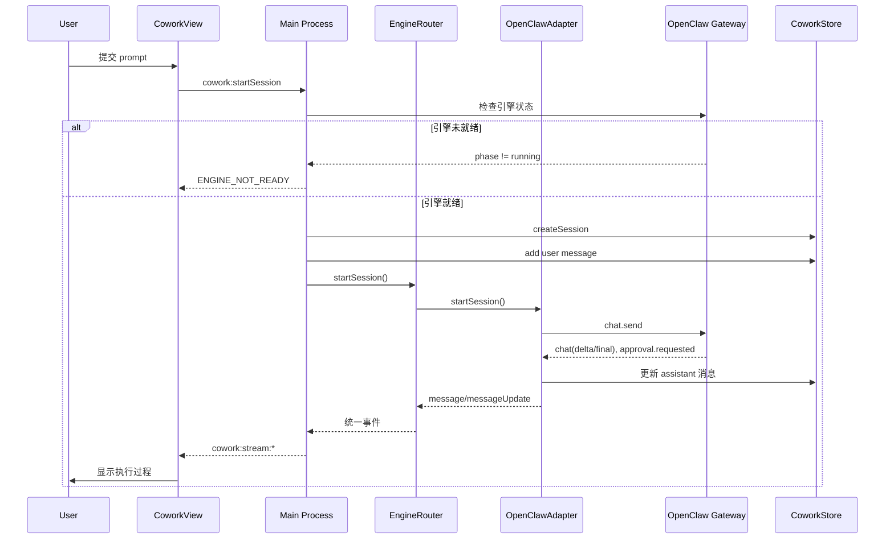
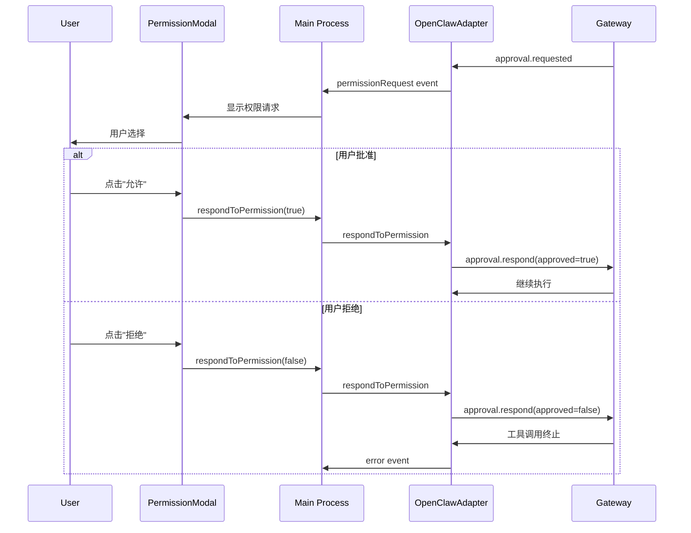
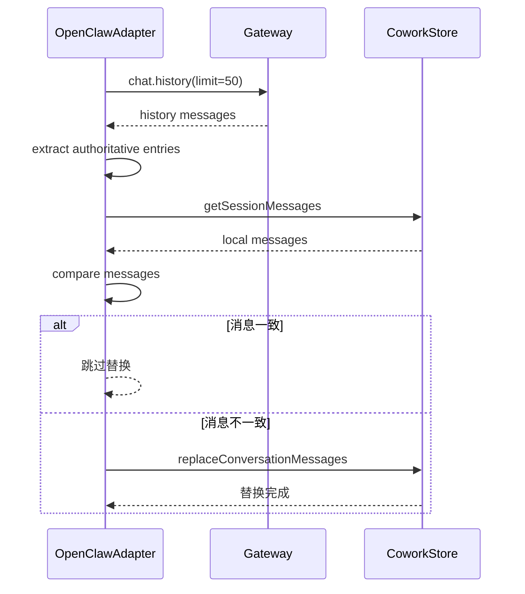

# GucciAI Cowork 会话系统设计

## 1. 系统概述

Cowork 是 GucciAI 的核心功能 —— 一个 AI 工作会话系统，以 OpenClaw 作为主要 Agent 引擎。设计用于生产力场景，能够自主完成数据分析、文档生成、信息检索等复杂任务。

### 1.1 设计原则

1. **OpenClaw 为主要引擎** —— OpenClaw Gateway 作为执行层
2. **统一抽象** —— GUI 无需感知底层引擎差异
3. **权限控制** —— 所有工具调用需用户明确授权
4. **流式交互** —— 实时反馈执行过程
5. **持久化记忆** —— 跨会话记忆用户偏好

### 1.2 执行模式

| 模式 | 说明 |
|------|------|
| `auto` | 自动选择执行方式 |
| `local` | 直接本地执行，全速运行 |

### 1.3 流式事件

Cowork 使用 IPC 事件进行实时双向通信：

| 事件 | 用途 |
|------|------|
| `message` | 新消息添加到会话 |
| `messageUpdate` | 流式内容增量更新 |
| `thinkingUpdate` | 思考内容流式增量更新 |
| `messageMetadataUpdate` | 消息元数据更新（如思考完成标记） |
| `permissionRequest` | 工具执行需要用户授权 |
| `complete` | 会话执行完成 |
| `error` | 执行错误发生 |

## 2. 核心组件

### 2.1 CoworkEngineRouter

**职责**：引擎路由层，根据配置选择运行时，统一事件抽象。

**文件**：`src/main/libs/agentEngine/coworkEngineRouter.ts`

```typescript
class CoworkEngineRouter {
  private activeEngine: 'openclaw' | 'yd_cowork';
  private openclawAdapter: OpenClawRuntimeAdapter;
  private claudeAdapter: ClaudeRuntimeAdapter; // 弃用但保留
  
  constructor(
    coworkStore: CoworkStore,
    openclawManager: OpenClawEngineManager
  ) {
    this.openclawAdapter = new OpenClawRuntimeAdapter(coworkStore, openclawManager);
    this.claudeAdapter = new ClaudeRuntimeAdapter(coworkStore);
  }
  
  // 启动会话
  startSession(sessionId: string, prompt: string): void {
    const engine = this.getActiveEngine();
    if (engine === 'openclaw') {
      this.openclawAdapter.startSession(sessionId, prompt);
    } else {
      this.claudeAdapter.startSession(sessionId, prompt);
    }
  }
  
  // 继续会话
  continueSession(sessionId: string, prompt: string): void {
    const engine = this.getActiveEngine();
    // 路由到对应引擎
  }
  
  // 响应权限请求
  respondToPermission(sessionId: string, permissionId: string, approved: boolean): void {
    // 路由到活动引擎
  }
  
  // 停止会话
  stopSession(sessionId: string): void {
    // 停止活动引擎
  }
  
  // 统一事件暴露
  on(event: string, callback: Function): void {
    // 路由到活动引擎的事件
  }
}
```

### 2.2 OpenClawRuntimeAdapter

**职责**：OpenClaw Gateway 适配，转换 Gateway 事件为 Cowork 标准事件。

**文件**：`src/main/libs/agentEngine/openclawRuntimeAdapter.ts`

```typescript
class OpenClawRuntimeAdapter {
  private gatewayClient: OpenClawGatewayClient | null;
  private sessionTurnTokens: Map<string, TurnToken>;
  
  // 启动会话
  startSession(sessionId: string, prompt: string): void {
    // 1. 获取 Gateway 连接
    const client = this.ensureGatewayClient();
    
    // 2. 获取 session key
    const sessionKey = this.getSessionKey(sessionId);
    
    // 3. 发送 chat 请求
    client.chat.send({
      sessionKey,
      prompt,
      onDelta: (delta) => this.handleChatDelta(sessionId, delta),
      onFinal: (final) => this.handleChatFinal(sessionId, final),
      onError: (error) => this.handleChatError(sessionId, error),
    });
  }
  
  // 处理流式 delta
  private handleChatDelta(sessionId: string, delta: ChatDelta): void {
    // 转换为 messageUpdate 事件
    this.emit('messageUpdate', {
      sessionId,
      messageId: delta.messageId,
      content: delta.content,
      isStreaming: true,
    });
  }
  
  // 处理完成
  private async handleChatFinal(sessionId: string, final: ChatFinal): void {
    // 1. 对账历史
    await this.reconcileWithHistory(sessionId, sessionKey);
    
    // 2. 更新会话状态
    this.coworkStore.updateSessionStatus(sessionId, 'completed');
    
    // 3. 发送 complete 事件
    this.emit('complete', { sessionId });
  }
  
  // 处理权限请求
  private handleApprovalRequest(sessionId: string, request: ApprovalRequest): void {
    // 转换为 permissionRequest 事件
    this.emit('permissionRequest', {
      sessionId,
      permissionId: request.id,
      toolName: request.toolName,
      toolInput: request.toolInput,
      riskLevel: this.assessRiskLevel(request),
    });
  }
  
  // 响应权限
  respondToPermission(sessionId: string, permissionId: string, approved: boolean): void {
    const client = this.gatewayClient;
    if (!client) return;
    
    client.approval.respond({
      requestId: permissionId,
      approved,
    });
  }
  
  // 历史对账
  private async reconcileWithHistory(
    sessionId: string,
    sessionKey: string
  ): Promise<void> {
    // 调用 chat.history 获取权威消息列表
    const history = await this.gatewayClient.chat.history({
      sessionKey,
      limit: 50,
    });
    
    // 与本地消息对账
    const localMessages = this.coworkStore.getSessionMessages(sessionId);
    const authoritativeMessages = this.extractAuthoritativeMessages(history);
    
    if (!this.messagesMatch(localMessages, authoritativeMessages)) {
      // 替换本地消息为权威版本
      this.coworkStore.replaceConversationMessages(sessionId, authoritativeMessages);
    }
  }
}
```

### 2.3 CoworkStore

**职责**：会话和消息的 CRUD 操作，SQLite 持久化。

**文件**：`src/main/coworkStore.ts`

```typescript
class CoworkStore {
  private db: Database;
  
  // 会话 CRUD
  createSession(sessionId: string, meta: SessionMeta): void {
    this.db.run(`
      INSERT INTO cowork_sessions (id, title, working_directory, status, created_at)
      VALUES (?, ?, ?, ?, ?)
    `, [sessionId, meta.title, meta.workingDirectory, meta.status, meta.createdAt]);
  }
  
  getSession(sessionId: string): Session | null {
    return this.db.get(`
      SELECT * FROM cowork_sessions WHERE id = ?
    `, [sessionId]);
  }
  
  listSessions(): Session[] {
    return this.db.all(`
      SELECT * FROM cowork_sessions ORDER BY created_at DESC
    `);
  }
  
  deleteSession(sessionId: string): void {
    this.db.run(`DELETE FROM cowork_sessions WHERE id = ?`, [sessionId]);
    this.db.run(`DELETE FROM cowork_messages WHERE session_id = ?`, [sessionId]);
  }
  
  updateSessionStatus(sessionId: string, status: SessionStatus): void {
    this.db.run(`
      UPDATE cowork_sessions SET status = ? WHERE id = ?
    `, [status, sessionId]);
  }
  
  // 消息 CRUD
  addMessage(sessionId: string, message: CoworkMessage): void {
    this.db.run(`
      INSERT INTO cowork_messages (id, session_id, type, content, timestamp, sequence)
      VALUES (?, ?, ?, ?, ?, ?)
    `, [message.id, sessionId, message.type, message.content, message.timestamp, message.sequence]);
  }
  
  getSessionMessages(sessionId: string): CoworkMessage[] {
    return this.db.all(`
      SELECT * FROM cowork_messages WHERE session_id = ? ORDER BY sequence
    `, [sessionId]);
  }
  
  updateMessageContent(sessionId: string, messageId: string, content: string): void {
    this.db.run(`
      UPDATE cowork_messages SET content = ? WHERE id = ?
    `, [content, messageId]);
  }
  
  // 消息替换（对账使用）
  replaceConversationMessages(
    sessionId: string,
    authoritative: Array<{ role: 'user' | 'assistant'; text: string }>
  ): void {
    // 1. 删除现有 user/assistant 消息（保留 tool/system）
    this.db.run(`
      DELETE FROM cowork_messages 
      WHERE session_id = ? AND type IN ('user', 'assistant')
    `, [sessionId]);
    
    // 2. 获取最大 sequence
    let nextSeq = this.getMaxSequence(sessionId) + 1;
    
    // 3. 按顺序重新插入
    for (const entry of authoritative) {
      this.db.run(`
        INSERT INTO cowork_messages (id, session_id, type, content, timestamp, sequence)
        VALUES (?, ?, ?, ?, ?, ?)
      `, [uuid(), sessionId, entry.role, entry.text, Date.now(), nextSeq++]);
    }
  }
  
  // 配置管理
  getConfig(): CoworkConfig {
    const row = this.db.get(`
      SELECT * FROM cowork_config LIMIT 1
    `);
    return row || DEFAULT_COWORK_CONFIG;
  }
  
  setConfig(config: CoworkConfig): void {
    this.db.run(`
      UPDATE cowork_config SET 
        working_directory = ?, system_prompt = ?, execution_mode = ?, agent_engine = ?
    `, [config.workingDirectory, config.systemPrompt, config.executionMode, config.agentEngine]);
  }
}
```

## 3. 会话流程

### 3.1 会话启动流程



### 3.2 权限处理流程



### 3.3 历史对账流程



## 4. 会话状态机

### 4.1 会话状态

```typescript
type SessionStatus = 
  | 'idle'      // 空闲，等待输入
  | 'running'   // 执行中
  | 'waiting_permission' // 等待权限确认
  | 'completed' // 已完成
  | 'error'     // 出错
  | 'stopped'   // 用户停止
```

### 4.2 状态转换

```
idle ──────────────────> running
      │ (startSession)      │
      │                     │
      │                     ▼
      │              waiting_permission
      │                     │
      │                     ├─> running (approved)
      │                     │
      │                     ├─> error (denied)
      │                     │
      │                     ▼
      │              running ─────> completed
      │                     │         │
      │                     │         │
      │                     ▼         │
      │                 stopped ──────│
      │                     │         │
      └─────────────────────┴─────────┘
```

## 5. 权限控制

### 5.1 工具风险评估

| 级别 | 工具类型 | 示例 |
|------|----------|------|
| `low` | 信息获取 | read_file, list_directory |
| `medium` | 修改操作 | write_file, create_directory |
| `high` | 系统操作 | execute_command, network_request |

### 5.2 权限请求结构

```typescript
interface PermissionRequest {
  sessionId: string;
  permissionId: string;
  toolName: string;
  toolInput: Record<string, unknown>;
  riskLevel: 'low' | 'medium' | 'high';
  description: string; // 工具用途描述
}
```

### 5.3 权限响应

```typescript
interface PermissionResponse {
  sessionId: string;
  permissionId: string;
  approved: boolean;
  scope?: 'single' | 'session'; // 单次或会话级授权
}
```

### 5.4 CoworkPermissionModal

**文件**：`src/renderer/components/cowork/CoworkPermissionModal.tsx`

```typescript
function CoworkPermissionModal({ request, onRespond }: Props) {
  return (
    <Modal>
      <div className="permission-request">
        <h3>工具执行请求</h3>
        <p className="tool-name">{request.toolName}</p>
        <p className="risk-level">{request.riskLevel}</p>
        <p className="description">{request.description}</p>
        
        <div className="actions">
          <button onClick={() => onRespond({ approved: true, scope: 'single' })}>
            允许（本次）
          </button>
          <button onClick={() => onRespond({ approved: true, scope: 'session' })}>
            允许（本次会话）
          </button>
          <button onClick={() => onRespond({ approved: false })}>
            拒绝
          </button>
        </div>
      </div>
    </Modal>
  );
}
```

## 6. 数据模型

### 6.1 Session 表

```sql
CREATE TABLE cowork_sessions (
  id TEXT PRIMARY KEY,
  title TEXT,
  working_directory TEXT,
  status TEXT,
  created_at INTEGER,
  updated_at INTEGER
);
```

### 6.2 Message 表

```sql
CREATE TABLE cowork_messages (
  id TEXT PRIMARY KEY,
  session_id TEXT,
  type TEXT, -- 'user' | 'assistant' | 'tool_use' | 'tool_result' | 'system'
  content TEXT,
  thinking_content TEXT, -- 思考/推理内容（模型 thinking 流）
  metadata TEXT, -- JSON
  timestamp INTEGER,
  sequence INTEGER
);
```

> **Thinking Stream 功能**：详见 [thinking-stream-implementation.md](../features/thinking-stream-implementation.md)，支持实时显示模型思考内容并持久化到数据库。

### 6.3 Config 表

```sql
CREATE TABLE cowork_config (
  working_directory TEXT,
  system_prompt TEXT,
  execution_mode TEXT, -- 'auto' | 'local'
  agent_engine TEXT,   -- 'openclaw' | 'yd_cowork'
  updated_at INTEGER
);
```

## 7. 配置同步

### 7.1 OpenClawConfigSync

**职责**：将 Cowork 配置同步到 OpenClaw 配置文件。

**文件**：`src/main/libs/openclawConfigSync.ts`

```typescript
class OpenClawConfigSync {
  // 同步配置到 OpenClaw
  sync(config: CoworkConfig, imConfig: IMConfig): void {
    const managedConfig = this.buildManagedConfig(config, imConfig);
    this.writeManagedConfig(managedConfig);
  }
  
  // 构建 managed config
  private buildManagedConfig(config: CoworkConfig, imConfig: IMConfig): ManagedConfig {
    return {
      session: {
        scope: 'per-account-channel-peer',
      },
      sandbox: {
        mode: this.mapExecutionMode(config.executionMode),
      },
      channels: this.buildChannelConfigs(imConfig),
    };
  }
  
  // 映射执行模式
  private mapExecutionMode(mode: ExecutionMode): SandboxMode {
    switch (mode) {
      case 'local': return 'off';
      case 'auto': return 'non-main';
      default: return 'off';
    }
  }
  
  // 构建环境变量
  buildEnv(): Record<string, string> {
    // 为 IM 平台 secrets 生成环境变量
  }
}
```

## 8. 会话初始化流程

```typescript
// src/renderer/App.tsx
function App() {
  const dispatch = useDispatch();
  
  useEffect(() => {
    // 初始化 Cowork 服务
    coworkService.init().then(({ config, sessions }) => {
      dispatch(coworkSlice.actions.setConfig(config));
      dispatch(coworkSlice.actions.setSessions(sessions));
      
      // 设置流式监听器
      setupStreamListeners(dispatch);
    });
    
    return () => {
      window.electron.cowork.removeStreamListeners();
    };
  }, [dispatch]);
}
```

## 9. 关键文件清单

| 文件 | 职责 |
|------|------|
| `src/main/libs/agentEngine/coworkEngineRouter.ts` | 引擎路由层 |
| `src/main/libs/agentEngine/openclawRuntimeAdapter.ts` | OpenClaw 适配（含 thinking 流处理） |
| `src/main/coworkStore.ts` | 会话持久化 |
| `src/main/libs/openclawConfigSync.ts` | 配置同步 |
| `src/renderer/services/cowork.ts` | Cowork IPC 服务 |
| `src/renderer/store/slices/coworkSlice.ts` | Redux 状态（含 thinkingExpanded） |
| `src/renderer/components/cowork/CoworkView.tsx` | 主界面 |
| `src/renderer/components/cowork/CoworkSessionDetail.tsx` | 消息详情（含 ThinkingStreamBlock） |
| `src/renderer/components/cowork/CoworkPermissionModal.tsx` | 权限 UI |

> **Thinking Stream Display**：参见 [thinking-stream-implementation.md](../features/thinking-stream-implementation.md) 了解思考内容流式显示的完整实现。