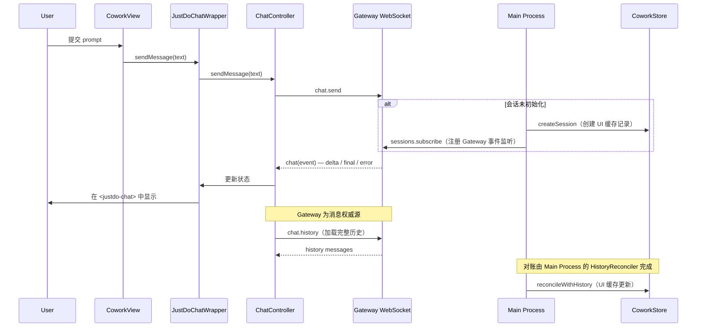
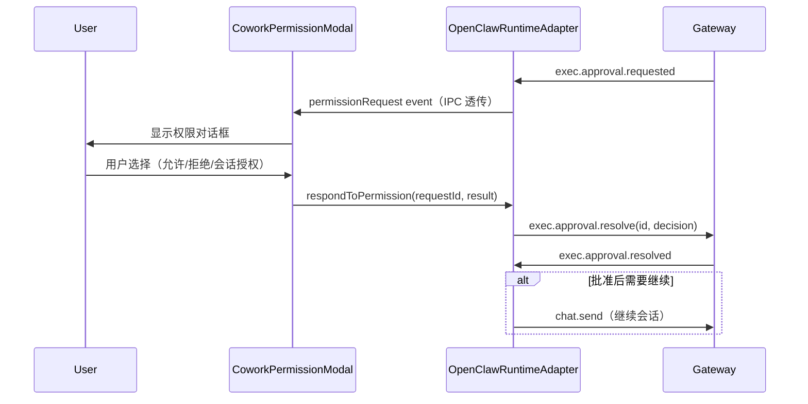
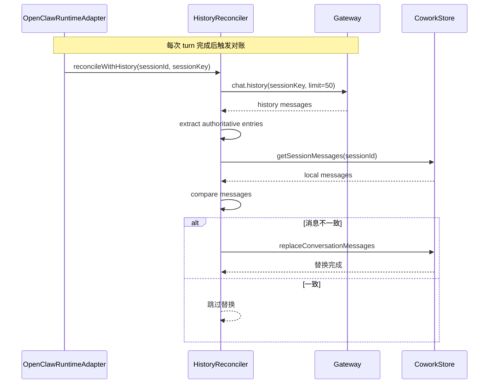
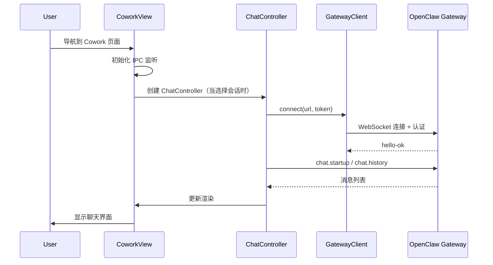

# JustDo Cowork 会话系统设计

## 1. 系统概述

Cowork 是 JustDo 的核心功能 —— 一个 AI 工作会话系统，JustDo 以**纯薄前端**角色运行，所有会话逻辑由 OpenClaw Gateway 全权负责。JustDo 提供 UI 层，Gateway 拥有全部会话生命周期、消息历史和子代理管理。

### 1.1 设计原则

1. **Gateway 为单一权威** —— Gateway 的 `chat.history` 是消息权威来源，JustDo SQLite 仅为 UI 缓存
2. **OpenClaw 唯一引擎** —— 不再有多引擎支持，OpenClaw 是唯一执行引擎
3. **权限控制** —— 所有工具调用需用户明确授权（JustDo 负责门控 UI）
4. **流式交互** —— 实时反馈执行过程，对话事件通过 Gateway WebSocket 推送
5. **持久化记忆** —— 跨会话记忆用户偏好

### 1.2 执行模式

| 模式 | 说明 |
|------|------|
| `auto` | 自动选择执行方式 |
| `local` | 直接本地执行，全速运行 |
| `sandbox` | 沙箱执行 |

### 1.3 流式事件（Gateway 推送）

ChatController 通过 Gateway WebSocket 接收事件，直接在渲染进程中处理：

| Gateway 事件 | 说明 |
|-------------|------|
| `chat` (state=`delta`) | 流式内容增量 |
| `chat` (state=`final`) | 消息完成 |
| `chat` (state=`aborted`) | 会话被终止 |
| `chat` (state=`error`) | 执行错误 |
| `agent` | 子代理解析/工具流事件 |
| `exec.approval.requested` | 工具执行需要用户授权 |
| `exec.approval.resolved` | 权限请求已处理 |
| `session.message` | 会话级消息（非 chat 上下文） |
| `session.tool` | 会话级工具流 |
| `sessions.changed` | 会话列表发生变化（跨进程通知） |
| `tick` | 心跳 |

## 2. 核心组件

### 2.1 CoworkEngineRouter

**职责**：简化的透传路由层，将所有调用委托给 OpenClaw runtime。不再有多引擎选择。

**文件**：`src/main/libs/agentEngine/coworkEngineRouter.ts`

```typescript
class CoworkEngineRouter extends EventEmitter implements CoworkRuntime {
  private readonly runtime: CoworkRuntime;

  constructor(deps: { openclawRuntime: CoworkRuntime }) {
    super();
    this.runtime = deps.openclawRuntime;
    this.bindRuntimeEvents(this.runtime);
  }

  startSession(sessionId: string, prompt: string, options: CoworkStartOptions): Promise<void> {
    return this.runtime.startSession(sessionId, prompt, options);
  }

  stopSession(sessionId: string): void {
    this.runtime.stopSession(sessionId);
  }

  respondToPermission(requestId: string, result: PermissionResult): void {
    this.runtime.respondToPermission(requestId, result);
  }
  // 其他方法均为传递委托
}
```

### 2.2 OpenClawRuntimeAdapter

**职责**：Gateway 客户端 + 事件映射层。不再是厚重编排层，而是 Gateway 的轻量代理。

**文件**：`src/main/libs/agentEngine/openclawRuntimeAdapter.ts`

```typescript
class OpenClawRuntimeAdapter {
  private gatewayClient: GatewayClientLike | null;
  private activeTurns: Map<string, SessionTurn>;

  // 启动会话：通过 Gateway RPC 发送 chat.send
  async startSession(sessionId: string, prompt: string, options: CoworkStartOptions): Promise<void> {
    const client = this.requireGatewayClient();
    const sessionKey = this.getSessionKey(sessionId);
    const runId = crypto.randomUUID();
    await client.request('chat.send', {
      sessionKey,
      message: prompt.trim(),
      deliver: false,
      idempotencyKey: runId,
      ...(options.imageAttachments ? { attachments: [...] } : {}),
    });
    // 等待 completionPromise（由 Gateway 事件解决）
    await completionPromise;
  }

  // 事件路由：Gateway WebSocket 事件 → Cowork 事件
  private handleGatewayEvent(event: GatewayEventFrame): void {
    if (event.event === 'chat') {
      this.handleChatEvent(event.payload, event.seq);
    } else if (event.event === 'exec.approval.requested') {
      this.handleApprovalRequested(event.payload);
    } else if (event.event === 'agent') {
      this.handleAgentEvent(event.payload, event.seq);
    }
    // ...
  }

  // 历史对账（委托给 HistoryReconciler）
  private async reconcileWithHistory(sessionId: string, sessionKey: string): Promise<void> {
    await this.historyReconciler.reconcileWithHistory(sessionId, sessionKey);
  }
}
```

### 2.3 CoworkStore

**职责**：会话和消息的 SQLite CRUD 操作。数据仅为 UI 缓存，Gateway 的 `chat.history` 才是权威来源。

**文件**：`src/main/coworkStore.ts`

```typescript
class CoworkStore {
  private db: Database;

  // 会话 CRUD
  createSession(title, cwd, executionMode, activeSkillIds, agentId): CoworkSession { ... }
  getSession(sessionId): CoworkSession | null { ... }
  listSessions(): CoworkSessionSummary[] { ... }
  deleteSession(sessionId): void { ... }
  updateSession(sessionId, updates): void { ... }

  // 消息 CRUD（UI 缓存，非权威）
  addMessage(sessionId, message): void { ... }
  getSessionMessages(sessionId): CoworkMessage[] { ... }
  updateMessageContent(sessionId, messageId, content): void { ... }

  // 消息替换（由 HistoryReconciler 在对账后调用）
  replaceConversationMessages(sessionId, authoritative): void { ... }

  // 配置管理
  getConfig(): CoworkConfig { ... }
  updateConfig(key, value): void { ... }
}
```

### 2.4 新的聊天渲染管线

#### <justdo-chat> Lit 自定义元素

**文件**: `src/renderer/libs/openclaw-chat/components/justdo-chat.ts`

基于 Lit 的自定义元素，在 Shadow DOM 中渲染 OpenClaw 格式消息。可以通过以下两种方式接收消息：
1. 直接通过属性（`messages`、`stream` 等）
2. 通过 ChatController 引用（推荐，直连 Gateway）

#### ChatController

**文件**: `src/renderer/libs/openclaw-chat/gateway/chat-controller.ts`

渲染进程内的 Gateway 客户端控制器。直接复制 OpenClaw webchat 的 chat 控制器模式：
- 通过 `GatewayClient` 连接到 Gateway WebSocket
- 通过 `chat.history` / `chat.startup` RPC 加载历史消息
- 处理流式事件（delta、final、aborted、error）
- 通过 `chat.send` RPC 发送消息

**无需 JustDo 适配器、Redux 或 IPC** —— 直连 Gateway。

#### GatewayClient

**文件**: `src/renderer/libs/openclaw-chat/gateway/client.ts`

WebSocket 客户端，实现 Gateway 协议：
- 连接握手：`connect.challenge` → `connect`（带 token）→ `hello-ok`
- 请求-响应模式：`{ type: "req", id, method, params }` → `{ type: "res", id, ok, payload }`
- 事件推送：`{ type: "event", event, payload }`
- 自动重连：指数退避

#### ChatMessageDisplay（React 包装）

**文件**: `src/renderer/components/cowork/ChatMessageDisplay.tsx`

React 组件，包装 `<justdo-chat>` Lit 元素。接收 ChatController 引用或 CoworkMessage[]，提供 Shadow DOM 主题同步和滚动行为。

#### JustDoChatWrapper

**文件**: `src/renderer/components/cowork/JustDoChatWrapper.tsx`

管理 `<justdo-chat>` Lit 元素的 React 组件。创建 ChatController 并传递给 Lit 元素。

#### 转换层

**文件**: `src/renderer/libs/openclaw-chat/conversion/cowork-to-gateway.ts`

将 JustDo 的 `CoworkMessage[]` 转换为 Gateway 格式的消息，以便可以重用 OpenClaw webchat 的渲染管线。

#### 消息渲染管线

**目录**: `src/renderer/libs/openclaw-chat/pipeline/`

完整的消息变换和渲染管线，包含多个阶段：
- `build-chat-items.ts` — 构建聊天项列表的主管道
- `message-normalizer.ts` — 消息规范化
- `role-normalizer.ts` — 角色分组规整化
- `stream-text.ts` — 流文本处理
- `tool-cards.ts` — 工具调用卡片提取
- `heartbeat-display.ts` — 心跳显示
- `text-direction.ts` — RTL/LTR 文本方向检测
- `search-match.ts` — 搜索匹配高亮
- `user-message-content.ts` — 用户消息内容块构建
- `history-limits.ts` — 历史消息渲染限制
- `message-extract.ts` — 消息文本提取

#### 渲染组件

**目录**: `src/renderer/libs/openclaw-chat/components/`
- `justdo-chat.ts` — 主 `justdo-chat` 自定义元素
- `chat-avatar.ts` — 头像组件
- `markdown.ts` — Markdown 渲染
- `tool-display.ts` — 工具调用显示
- `grouped-render.ts` — 分组消息渲染

## 3. 会话流程

### 3.1 会话启动流程

```
User → CoworkView → JustDoChatWrapper → ChatController → GatewayClient(WebSocket) → OpenClaw Gateway
```



### 3.2 权限处理流程



### 3.3 历史对账流程



## 4. 会话状态机

### 4.1 会话状态

```typescript
type CoworkSessionStatus = 
  | 'idle'      // 空闲，等待输入
  | 'running'   // 执行中
  | 'completed' // 已完成
  | 'error'     // 出错
```

注意：这些状态反映 Gateway 端的状态，不是本地状态。JustDo 不再跟踪 `waiting_permission` 或 `stopped` 作为持久化状态 —— 这些是运行时状态，由 ChatController 管理。

### 4.2 状态转换

```
idle ──────────────────> running
      │ (startSession)      │
      │                     │
      │                     │
      │                     ▼
      │              running ─────> completed
      │                     │
      │                     ▼
      │                  error
      │                     │
      └─────────────────────┘
```

## 5. 权限控制

### 5.1 工具风险评估

| 级别 | 工具类型 | 示例 |
|------|----------|------|
| `safe` | 信息获取 | read_file, list_directory |
| `caution` | 修改操作 | write_file, create_directory, git push |
| `destructive` | 危险操作 | rm -rf, git push --force, git reset --hard |

### 5.2 权限请求结构

```typescript
interface CoworkPermissionRequest {
  sessionId: string;
  permissionId: string;
  toolName: string;
  toolInput: Record<string, unknown>;
  riskLevel?: 'safe' | 'caution' | 'destructive';
  description: string;
}
```

### 5.3 权限响应

```typescript
interface CoworkPermissionResult {
  permissionId: string;
  approved: boolean;
  scope?: 'single' | 'session';
  selected?: string[];
}
```

### 5.4 CoworkPermissionModal

**文件**：`src/renderer/components/cowork/CoworkPermissionModal.tsx`

支持两种模式：
- **确认模式 (Confirm)**：当工具调用是 `AskUserQuestion` 时，显示问题选择界面
- **标准模式 (Standard)**：普通工具执行请求，显示工具名称、输入和危险级别

对于危险操作，根据命令内容自动检测危险等级：
- `recursive-delete`：递归删除
- `git-force-push`：强制推送
- `git-reset-hard`：硬重置
- 等

## 6. 数据模型

### 6.1 cowork_sessions 表（UI 缓存）

```sql
CREATE TABLE cowork_sessions (
  id TEXT PRIMARY KEY,
  title TEXT NOT NULL,
  claude_session_id TEXT,
  status TEXT NOT NULL DEFAULT 'idle',
  pinned INTEGER NOT NULL DEFAULT 0,
  cwd TEXT NOT NULL,
  execution_mode TEXT,
  active_skill_ids TEXT,
  agent_id TEXT,
  created_at INTEGER NOT NULL,
  updated_at INTEGER NOT NULL
);
```

**注意**：此表存储 UI 缓存状态。Gateway 的会话列表是权威来源。

### 6.2 cowork_messages 表（UI 缓存）

```sql
CREATE TABLE cowork_messages (
  id TEXT PRIMARY KEY,
  session_id TEXT NOT NULL,
  type TEXT NOT NULL,
  content TEXT NOT NULL,
  metadata TEXT,
  created_at INTEGER NOT NULL,
  sequence INTEGER,
  thinking_content TEXT,  -- 思考/推理内容
  model_name TEXT,        -- 模型名称
  usage TEXT,             -- Token 用量（JSON）
  FOREIGN KEY (session_id) REFERENCES cowork_sessions(id) ON DELETE CASCADE
);
```

**重要**：此表是 UI 缓存。Gateway 的 `chat.history` 是消息的权威来源。对账过程（由 `historyReconciler.ts` 执行）会在此表与 Gateway 历史不一致时自动替换。

### 6.3 cowork_config 表

```sql
CREATE TABLE cowork_config (
  key TEXT PRIMARY KEY,
  value TEXT NOT NULL,
  updated_at INTEGER NOT NULL
);
```

存储 JustDo 管理的配置项，如 `workingDirectory`、`executionMode`、`systemPrompt` 等。

### 6.4 session_groups 表

```sql
CREATE TABLE session_groups (
  id TEXT PRIMARY KEY,
  name TEXT NOT NULL,
  color TEXT DEFAULT '#6366f1',
  sort_order INTEGER DEFAULT 0,
  created_at INTEGER NOT NULL
);
```

会话分组是 JustDo UI 概念，用于组织会话列表。Gateway 不感知分组。

## 7. 配置同步

### 7.1 OpenClawConfigSync

**职责**：将 JustDo 配置同步到 OpenClaw 的 `managed.yaml` 配置文件。

**文件**：`src/main/libs/openclawConfigSync.ts`

```typescript
class OpenClawConfigSync {
  sync(config: CoworkConfig, agents: Agent[]): void {
    const managedConfig = this.buildManagedConfig(config, agents);
    this.writeManagedConfig(managedConfig);
  }

  buildManagedConfig(config: CoworkConfig, agents: Agent[]): ManagedConfig {
    return {
      session: { scope: 'per-account-channel-peer' },
      sandbox: { mode: this.mapExecutionMode(config.executionMode) },
      agents: buildManagedAgentEntries(agents),
      channels: { /* IM 平台配置 */ },
    };
  }

  mapExecutionMode(mode: ExecutionMode): string {
    switch (mode) {
      case 'local': return 'off';
      case 'auto': return 'non-main';
      default: return 'off';
    }
  }

  buildEnv(agents: Agent[]): Record<string, string> {
    // 为 IM 平台 secrets 生成环境变量
  }
}
```

## 8. 会话初始化流程



## 9. 关键文件清单

### 主进程（Main Process）

| 文件 | 职责 |
|------|------|
| `src/main/libs/agentEngine/coworkEngineRouter.ts` | 引擎路由层（透传委托） |
| `src/main/libs/agentEngine/openclawRuntimeAdapter.ts` | Gateway 客户端 + 事件映射（含流式处理） |
| `src/main/libs/agentEngine/history/historyReconciler.ts` | 历史对账（Gateway 权威 → UI 缓存) |
| `src/main/libs/agentEngine/openclaw/subagentGateway.ts` | 子代理网关（Gateway 为权威） |
| `src/main/libs/agentEngine/openclaw/webchatToolStream.ts` | Webchat 工具流同步 |
| `src/main/libs/agentEngine/gateway/types.ts` | Gateway 类型定义 |
| `src/main/libs/agentEngine/utils/gatewayHelpers.ts` | Gateway 辅助函数 |
| `src/main/libs/agentEngine/rpc/skillRpc.ts` | 技能 RPC 处理器 |
| `src/main/coworkStore.ts` | SQLite CRUD（UI 缓存） |
| `src/main/libs/openclawEngineManager.ts` | Gateway 进程生命周期管理 |
| `src/main/libs/openclawConfigSync.ts` | 配置同步到 managed.yaml |
| `src/main/libs/openclawChannelSessionSync.ts` | Channel 会话同步 |
| `src/main/libs/openclawHistory.ts` | Gateway 历史提取工具 |

### 渲染进程（Renderer Process）— 聊天渲染管线

| 文件 | 职责 |
|------|------|
| `src/renderer/libs/openclaw-chat/gateway/client.ts` | Gateway WebSocket 客户端 |
| `src/renderer/libs/openclaw-chat/gateway/chat-controller.ts` | 会话控制器（直连 Gateway） |
| `src/renderer/libs/openclaw-chat/components/justdo-chat.ts` | `<justdo-chat>` Lit 自定义元素 |
| `src/renderer/libs/openclaw-chat/components/chat-avatar.ts` | 头像组件 |
| `src/renderer/libs/openclaw-chat/components/markdown.ts` | Markdown 渲染 |
| `src/renderer/libs/openclaw-chat/components/tool-display.ts` | 工具调用显示 |
| `src/renderer/libs/openclaw-chat/components/grouped-render.ts` | 分组消息渲染 |
| `src/renderer/libs/openclaw-chat/conversion/cowork-to-gateway.ts` | CoworkMessage → Gateway 格式转换 |
| `src/renderer/libs/openclaw-chat/pipeline/build-chat-items.ts` | 聊天项构建管道 |
| `src/renderer/libs/openclaw-chat/pipeline/message-normalizer.ts` | 消息规范化 |
| `src/renderer/libs/openclaw-chat/pipeline/role-normalizer.ts` | 角色分组规整化 |
| `src/renderer/libs/openclaw-chat/pipeline/stream-text.ts` | 流文本处理 |
| `src/renderer/libs/openclaw-chat/pipeline/tool-cards.ts` | 工具调用卡片提取 |
| `src/renderer/libs/openclaw-chat/pipeline/tool-helpers.ts` | 工具辅助函数 |
| `src/renderer/libs/openclaw-chat/pipeline/heartbeat-display.ts` | 心跳显示 |
| `src/renderer/libs/openclaw-chat/pipeline/text-direction.ts` | RTL/LTR 文本方向 |
| `src/renderer/libs/openclaw-chat/pipeline/search-match.ts` | 搜索匹配高亮 |
| `src/renderer/libs/openclaw-chat/pipeline/user-message-content.ts` | 用户消息内容块 |
| `src/renderer/libs/openclaw-chat/pipeline/history-limits.ts` | 历史消息渲染限制 |
| `src/renderer/libs/openclaw-chat/pipeline/message-extract.ts` | 消息文本提取 |
| `src/renderer/libs/openclaw-chat/pipeline/constants.ts` | 管道常量 |
| `src/renderer/libs/openclaw-chat/types.ts` | 类型定义 |
| `src/renderer/libs/openclaw-chat/shims/backend-helpers.ts` | 后端辅助 shim |
| `src/renderer/libs/openclaw-chat/shims/media-core.ts` | 媒体核心 shim |
| `src/renderer/libs/openclaw-chat/shims/normalization-core.ts` | 规范化核心 shim |

### 渲染进程（Renderer Process）— React 组件

| 文件 | 职责 |
|------|------|
| `src/renderer/components/cowork/CoworkView.tsx` | 主 Cowork 界面 |
| `src/renderer/components/cowork/JustDoChatWrapper.tsx` | `<justdo-chat>` Lit 元素的 React 包装 |
| `src/renderer/components/cowork/ChatMessageDisplay.tsx` | 共享消息显示表面 |
| `src/renderer/components/cowork/CoworkPermissionModal.tsx` | 权限请求对话框 |
| `src/renderer/components/cowork/CoworkPromptInput.tsx` | 提示输入组件 |
| `src/renderer/components/cowork/SubagentMenu.tsx` | 子代理菜单 |
| `src/renderer/components/cowork/RunSessionModal.tsx` | 运行会话模态框 |

---

> **注意**：此文档反映 JustDo v2026.7.1 架构。当前 OpenClaw 版本为 v2026.6.9。
