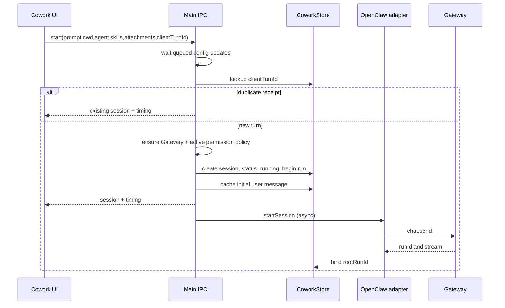
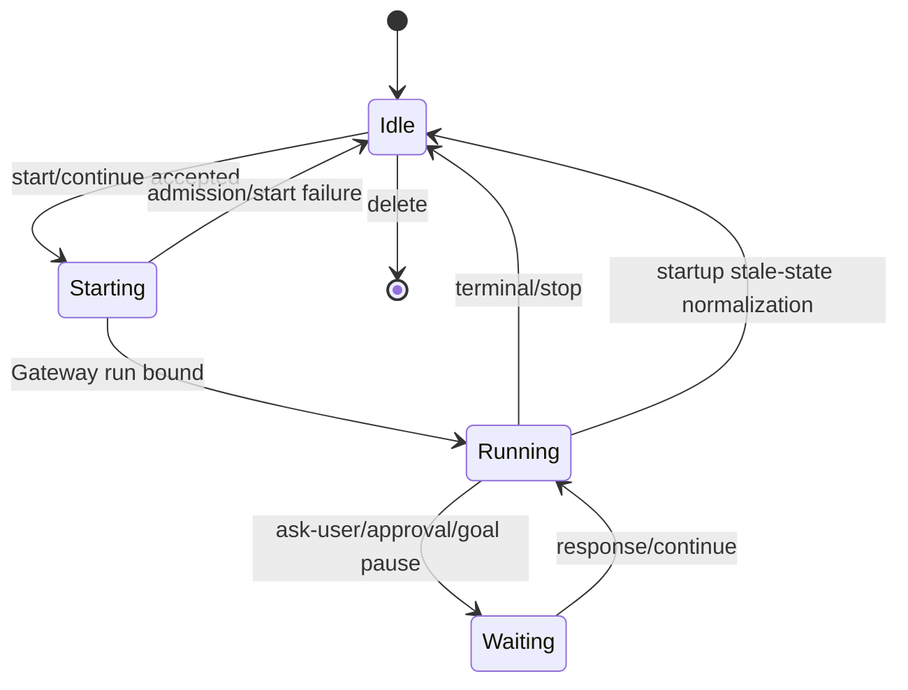

# Cowork 系统

本文按 `v2026.8.12` 的会话 handler、SQLite store、OpenClaw adapter、Renderer feature 和 shared 合约重写。Cowork 是产品会话层，不是另一套 Agent engine。

## 1. 职责与边界

Cowork 负责把本地产品会话映射到 OpenClaw session/run：

- 保存标题、cwd、agent、model、permission、active skills、group、pin，以及与 Gateway goal 分离的本地 execution snapshot；
- 对 start/continue/stop/delete 建立安全 admission 和幂等语义；
- 把 Gateway message/agent/tool/lifecycle 事件归一化并广播；
- 在重连、强退和历史加载后恢复 UI；
- 提供审批、ask-user、附件、subagent、goal、上下文用量和导出 UX。

Gateway 仍是执行与 transcript 权威；`cowork_messages` 是本地产品缓存，不能覆盖 Gateway history。

## 2. 主要实现

| 层         | 入口                                                                | 职责                                                             |
| ---------- | ------------------------------------------------------------------- | ---------------------------------------------------------------- |
| Shared     | `src/shared/cowork/`、`sessionGoal.ts`、`openclaw/messageDomain.ts` | 附件、run、title、目标、事件分类                                 |
| Main store | `src/main/data/coworkStore.ts`                                      | session/message/run/config/agent CRUD 与恢复                     |
| Main IPC   | `src/main/ipc/cowork/`                                              | execution、session、runtime、config、interaction、subtask、group |
| Router     | `src/main/engine/cowork/coworkEngineRouter.ts`                      | 仅转发到 OpenClaw runtime；不再多引擎路由                        |
| Adapter    | `src/main/engine/openclaw/openclawRuntimeAdapter.ts`                | session mapping、Gateway RPC/事件、history reconciliation        |
| Renderer   | `src/renderer/features/cowork/`                                     | 列表、输入、权限/审批、goal、subagent、文件预览                  |
| Chat       | `src/renderer/libs/openclaw-chat/`                                  | history/live 状态与 timeline 渲染                                |

## 3. 三种身份

一次用户提交必须区分：

| 标识                         | 生成方                      | 用途                                            |
| ---------------------------- | --------------------------- | ----------------------------------------------- |
| local `sessionId`            | `CoworkStore.createSession` | 产品导航和 SQLite foreign key                   |
| Gateway `sessionKey`         | managed-key 规则/Gateway    | transcript、session RPC、审批与 subagent parent |
| `clientTurnId` / `rootRunId` | Renderer/Main / Gateway     | 幂等提交和事件归属                              |

`cowork_session_runs` 用唯一 `client_turn_id` 防止双击或 IPC 重试创建第二个 session；Gateway 接受后将真实 `root_run_id` 绑定到 receipt。事件优先按 run id 映射，必要时再按受管 session key 解析。任意远端 key 不得自动映射到本地 session。

## 4. Session 数据模型

本地 session 包含：`id`、`title`、`status`、`pinned`、`cwd`、`executionMode`、`permissionMode`、`activeSkillIds`、`agentId`、`modelRef`、`groupId` 和时间戳。当前 engine 固定为 OpenClaw，历史 `container` execution mode 会迁移为 `local`。

状态字段是产品快照，不是判断运行中的唯一依据。实际 `running` 由 adapter memory、Gateway `sessions.list/describe`、root run 和 subagent 状态共同计算；启动时遗留的本地 running 会恢复为 idle。

## 5. Start 流程

```mermaid
sequenceDiagram
  participant UI as Cowork UI
  participant IPC as Main IPC
  participant DB as CoworkStore
  participant RT as OpenClaw adapter
  participant GW as Gateway
  UI->>IPC: start(prompt,cwd,agent,skills,attachments,clientTurnId)
  IPC->>IPC: wait queued config updates
  IPC->>DB: lookup clientTurnId
  alt duplicate receipt
    IPC-->>UI: existing session + timing
  else new turn
    IPC->>IPC: ensure Gateway + active permission policy
    IPC->>DB: create session, status=running, begin run
    IPC->>DB: cache initial user message
    IPC-->>UI: session + timing
    IPC->>RT: startSession (async)
    RT->>GW: chat.send
    GW-->>RT: runId and stream
    RT->>DB: bind rootRunId
  end
```

细节：

- cwd 必须来自请求或 Cowork config，空值直接拒绝；真正任务目录由 `resolveTaskWorkingDirectory` 解析。
- permission 使用 shared `resolvePermissionMode`；UI 传值不能越过已保存的应用 policy。
- 初始 model 从所选 agent 读取并写入 session/run，保证统计和显示可追溯。
- handler 不等待完整 Agent run；启动调用异步执行，错误经 stream 广播并落终态。
- `skipInitialUserMessage` 避免 adapter 再写一份已经由 handler 保存的用户消息。

## 6. Continue 与模型切换

Continue 先确认本地 session 存在、等待 config queue、ensure engine，然后调用 adapter。Renderer 的 submit helper负责 optimistic user message、client turn timing 和串行队列；Main/Gateway history 最终负责对账。

会话模型读写通过 `sessions.patch/get`：

- 输入必须是 qualified `provider/model`；旧的裸 model id 在启动迁移时只在唯一匹配时补齐 provider。
- 返回声明 `appliesTo` 是 next turn 或 subsequent calls，并标记来源是 gateway、local cache 或 agent default。
- UI 不应在 Gateway patch 失败时永久保留乐观模型；需回退显示并提示。

## 7. Stop、删除与终态

Stop 会发现主 session 与仍运行的 subagent key，逐一调用 `sessions.abort`，清除 pending approval/session grant、active turn、goal 控制 run 和缓存。`bestEffort` 仅允许在 Gateway confirmation 不可得时继续本地清理，不代表 abort 成功。

删除 session 的顺序包括停止活动、删除本地 row（级联 messages/runs）、通知 adapter 清映射，并递归删除受管 subagent transcript；不能删除通用 `:main` 或不属于本产品的 Gateway session。

业务终态来自明确 chat/lifecycle/runtime 证据。WebSocket disconnect 只触发连接恢复和必要的错误提示，不能自动将所有 run 标成 error。完成后启动 history reconciliation，以 Gateway final text、usage、thinking 和 tool 结果校正缓存。

对 managed JustDo 会话，模型回合终止不等于编排任务终止。Gateway 在提交 terminal assistant
reply（包括 `NO_REPLY`）前检查 durable subagent registry：若仍有要求 completion message 的
child，就进入隐式 managed join，等待一批成功或失败结果并续跑同一父会话；只有 required
children 均已呈现且后续 assistant continuation 成功提交，父 run 才能结束。显式
`expectsCompletionMessage=false` 是 fire-and-forget，不形成该 obligation；用户 stop/abort 仍会
立即中断等待并恢复原生 completion delivery。自动 obligation 只属于 child 的精确 requester；
native announce 自身不会递归接管同一结果，并在等待 requester 结束后再次核对 durable
delivery ownership，以关闭 announce 与 terminal guard 之间的竞态窗口。

显式 `sessions_yield` 可能只呈现已完成的一批 child；这不会解除仍在运行 sibling 的 obligation。
若模型此时给出 terminal reply，Gateway 会把同一 controller 的剩余 `waiting` ownership 持久化
转交给 implicit join，完成后再次呈现并续跑。该转换同时覆盖 embedded 与 Codex app-server；
Codex companion 在任何 plugin import 前按锁定版本/hash补齐 managed commit/recovery/handoff 合约。
转换持久化失败时 fail closed 并返回可见 runtime error；abort/timeout 则恢复 native completion，
不能静默结束，也不能通过无界 revision 重试掩盖 durability failure。

## 8. Event 模型

`CoworkRuntimeEvents` 包含：

- `message`：创建 user/assistant/thinking/tool/system item；
- `messageUpdate`：正文快照或合并后的 streaming text；
- `thinkingUpdate`：thinking delta；
- `messageMetadataUpdate`：tool/lifecycle/model/usage/plan 等元数据；
- `messageDelete`：移除临时或被权威历史取代的 item；
- `complete`：session 的明确终态；
- `error`：可见错误，不一定等价 terminal；
- `sessionStopped`：本地停止完成；
- `cronChanged`：触发 scheduled task refresh/reconcile。

共享 `messageDomain` 按 session/run 判定 current、related、foreign、stale 等 admission，并统一 tool terminal status。Main 与 Renderer 都应复用 shared normalize，避免协议分叉。

## 9. 历史与缓存

Main `HistoryReconciler` 在 final、detached run 或显式同步后调用 `chat.history`：

- 抽取稳定 message identity，合并当前 turn assistant text；
- 按 occurrence 匹配 usage，不能只靠相同文本；
- 恢复 thinking、tool 输入/结果、模型名、compaction 和 subagent completion；
- 删除被权威历史证明为重复的临时项；
- 对 history 边界丢失的文本只做安全 suffix/prefix merge。

Renderer 另有分页 history window 和 persisted timeline cache，用于性能与切页恢复。两者是显示缓存，不改变 Gateway 权威。

会话列表的“会话详情”通过专用 `cowork:session:details` IPC 读取 Gateway 精确 session row，并以 `sessions.usage` 的 `range=all`、family 聚合读取原始 transcript 用量。对话消息、用户/助手消息和 Tool 调用按 SQLite 中实际展示的消息统计；各类 Token 累计和实际使用模型来自 Gateway 权威用量。每个 assistant 模型请求分别累计，总 Token 优先使用每次模型返回的 `total`，缺失时才把 input/output/cacheRead/cacheWrite 相加。`sessions.usage` 仅在 `cacheStatus=fresh` 时可用；refreshing、partial 或 stale 必须有界等待刷新，超时则整体回退，不能展示部分 lifetime 总计。界面中的 Session ID 只使用 Gateway `sessionId`，不能用通用 row `id` 或 `cowork_sessions.id` 代替。仅当权威统计没有模型时，才用 session row、run receipt、当前 session model 和本地 agent 默认值补空。

## 10. Goal 生命周期

`SessionGoalStatus` 契约枚举包含 `active`、`paused`、`blocked`、`usage_limited`、`budget_limited`、`complete`；其中 `usage_limited` 和 `budget_limited` 是历史兼容输入，`normalizeSessionGoal` 会将二者统一转成 `blocked`，Coordinator 不把它们当作独立运行状态。`GoalExecutionPhase` 包含 `waiting`、`running`、`continuing`、`retrying`、`awaiting_input`、`awaiting_confirmation`、`stopped`。

Goal continuation coordinator 监听 tool/lifecycle：

- active goal 在普通 run 结束且无托管 subagent 未完成时，可发起继续；
- control run 与 user-input run 单独登记，避免把 `/goal resume` 当普通任务；
- blocked goal 的 resume 先通过 `sessions.describe` 验证相同 goal id；
- completed goal 接收反馈时，先原子确认 goal 未变化，再 clear 并用 follow-up prompt 建立新目标上下文；
- reconnect 会从本地 snapshot 与 Gateway goal/runtime 恢复，完整 `sessions.list` 优先于逐个 describe；
- UI 的 continue/resume/feedback 操作使用 single-flight，避免重复控制。

Renderer 的 GoalStatusCard 只按 snapshot 派生文案和按钮，不自行改服务端状态。

## 11. Ask-user 与 Approval

Ask-user extension 通过本地 callback host 产生 interaction。Main 将 request id 绑定到 session，广播问题；Renderer 使用初始居中的非模态悬浮框收集结构化答案，不改变消息区布局。框外区域不拦截指针事件，标题栏可在视口范围内拖动，因此用户能在回答前滚动、选择和复制对话内容。悬浮框只在 interaction 所属 session 为当前会话时显示，切换会话时保留未提交答案与拖动位置；显示期间仅锁定当前会话的消息输入区，防止模型切换、发送或停止操作绕过待回答问题。Main 校验 question id、选项和 required/timeout policy 后响应。重连/刷新可 replay pending interactions；dismiss 是 UI 生命周期，不代表拒绝或完成。

Exec/plugin approval 走独立 Gateway approval API，并继续使用阻塞式 modal；不得复用 ask-user 的非模态展示语义。session 级 exec grant 绑定 session key，结束/停止/删除时清除。权限 modal、文本确认模式和 scheduler 的无人值守模式不得共用含糊的 boolean `autoApprove`。

## 12. Attachments 与文件预览

附件先用 shared normalizer 验证类型、名称、路径/内容，再作为结构化 metadata 和 Gateway payload 发送。历史解析会提取实际发送路径用于展示。预览读取通过 Main；编辑必须先取得绑定目标的授权 token。会话导出会把 timeline 转成明确格式，不直接复制内部 Gateway JSON。

## 13. Subagent

Subagent 列表优先通过选择性的 Gateway tool/API，必要时从 persisted sessions 查询；状态统一为 pending/running/finished/failed 等。label 来源会区分 task name、metadata 和 fallback，避免把随机 session key 当用户标题。

当前状态仍以结构化 `subagents` 工具输出为权威，`sessions.list` 只补 projection 与超过 24 小时的持久历史。Main 对一次状态刷新做 single-flight 和 8 秒结果缓存；全量 persisted-session 分页扫描使用独立的 60 秒历史快照，期间把实时工具结果合并回历史，扫描失败时保留上一次完整快照且不推进 TTL。运行状态的低频 discovery sweep，以及会话结算、失败结算和重启 checkpoint 后的新轮次准入等必须证明 aggregate idle 的检查，都会分页覆盖全部 session，不能把截断的第一页当成完整父子树。菜单在父会话或任一 child 活动时每 5 秒刷新，全部终态后退避到 30 秒；抽屉只在所选 child 活动时持续刷新，终态只做一次确认。Gateway runtime patch `049` 仅将认证后的 out-of-band `subagents list` 查询排除出 agent tool-loop accounting，其他工具/动作仍保留循环检测，hook、授权与审批不变。

Subagent 详情的 Token 用量不使用 `sessions.list.totalTokens`，因为该字段是上下文快照而非生命周期消耗。详情打开时通过专用 `cowork:subTask:details` IPC 读取该 subagent 的 `sessions.usage` 原始 transcript 聚合，按每个 assistant 模型请求实际返回的 `usage` 累计输入、输出、缓存读取和缓存写入；“总 Token”严格等于这四项之和。tool-only 与控制类 assistant 轮次会计入；当前 transcript 不持久化上下文压缩和 exec review 请求的 `usage`，因此这两类请求尚不在详情累计中。读取失败时保留上一次完整结果，不展示部分累计值。

父会话运行状态包含 `mainRunning || subagentRunning`。stop 会递归发现活动子树；完成通知、工具卡和抽屉必须按 parent/session/run identity 归属，迟到 announce 不能写入另一 turn。该 UI 聚合规则不替代 Gateway 的 terminal guard：前者决定展示 active，后者保证 required child 未被父模型处理时 run 本身不会静默结束。

## 14. Renderer 状态

`coworkSlice` 保存 session 列表、选择、加载/错误等产品状态。大体量 transcript/live reducer 留在 chat component 内，避免 Redux 每个 delta 触发全应用 render。选择器、删除状态机、session presentation、latest serial queue、run activity、context usage refresh 都有独立纯函数和测试。

## 15. 失败与排障

| 现象              | 首查                                                               |
| ----------------- | ------------------------------------------------------------------ |
| 提交立即失败      | engine status、config sync、permission verification、cwd           |
| UI 一直 running   | runtime status、open run receipt、Gateway sessions、subagent       |
| 消息重复/缺失     | session/run identity、sequence、history reconciliation             |
| stop 后审批仍出现 | session key grant/pending approval cleanup                         |
| goal 不续跑       | goal snapshot、control run、managed subagent join、lifecycle patch |
| 重启后状态错误    | startup reset、Gateway list/describe、channel session sync         |

日志先看每日 main log 与 Gateway condensed log；需要完整 event sequence 时按 `[gateway] log file:` 查看 native JSON log并按时间、run id、session id 关联。

## 16. 维护与测试

变更至少覆盖：重复 client turn、start failure、异步 error broadcast、stop best-effort、run bind/terminal、session key 隔离、重连、history reconcile、goal single-flight、subagent parent、approval cleanup、附件 normalize 和长历史性能。对应测试集中在 cowork handler/store/adapter、shared message/goal 与 Renderer chat/cowork 目录。

## 17. Session 与 Run 状态转换

```mermaid
stateDiagram-v2
  [*] --> Idle
  Idle --> Starting: start/continue accepted
  Starting --> Running: Gateway run bound
  Starting --> Idle: admission/start failure
  Running --> Waiting: ask-user/approval/goal pause
  Waiting --> Running: response/continue
  Running --> Idle: terminal/stop
  Running --> Idle: startup stale-state normalization
  Idle --> [*]: delete
```

SQLite `session.status` 是产品快照，不是完整状态机权威。Gateway runtime、open root run、goal execution 和 managed subagent 共同决定 UI 是否展示 active。任何转换都要保持 terminal 幂等：重复 final、stop 后迟到 event、应用重启修复不能再次结算计时或生成第二条完成消息。

## 18. 并发与幂等约束

- `clientTurnId` 约束一次用户提交；同 id 重试同 session 可识别，跨 session 重用必须拒绝。
- 每个 session 的 mutation 通过 serial queue/single-flight 控制，避免 continue、model patch、stop 交错覆盖。
- root run begin/bind/fail 分阶段记录，Gateway 尚未返回 run id 时失败也可结算。
- Goal continue 与用户反馈动作 single-flight；迟到结果必须检查当前 execution generation。
- 删除前停止活动树并清理 session grants；批量删除逐目标隔离错误，不能误删未选 session。

## 19. 数据恢复顺序

重启后先把 SQLite 残留 `running` 归一，重置 open run clock；随后通过 Gateway session mapping/runtime status 判断是否存在可恢复远端工作，再加载 history。顺序不能反过来，否则离线时间会被计入 run、旧 boolean 会覆盖 Gateway 事实，或 UI 在 reconciliation 前短暂宣告完成。

## 20. 代码证据地图

| 行为                        | 实现/测试入口                                                   |
| --------------------------- | --------------------------------------------------------------- |
| Session CRUD 与 run receipt | `src/main/data/coworkStore.ts` 及同名测试                       |
| IPC admission               | `src/main/ipc/cowork/` 及 handler tests                         |
| 路由与 stop-all             | `src/main/engine/cowork/coworkEngineRouter.ts`                  |
| OpenClaw 映射               | `src/main/engine/openclaw/openclawRuntimeAdapter.ts` 及测试     |
| History merge               | Main `historyReconciler.ts` 与 Renderer reconciliation tests    |
| Goal continuation           | `src/main/openclaw/goals/goalContinuationCoordinator.ts` 及测试 |
| Permission/grants           | `src/main/openclaw/permissions/` 及测试                         |
| UI session 状态             | `src/renderer/features/cowork/`、chat model tests               |

## 21. 变更清单

新增 session 字段时同步 DDL/compatibility、store mapping、IPC/shared、Renderer selector/form 和 config projection（若影响 Gateway）。新增 lifecycle event 时同步 adapter、domain admission、reducer、history counterpart 和 terminal cleanup。任何“仅修 UI running”的改动都要先证明 Gateway、run receipt 与 subagent 状态没有分歧。
