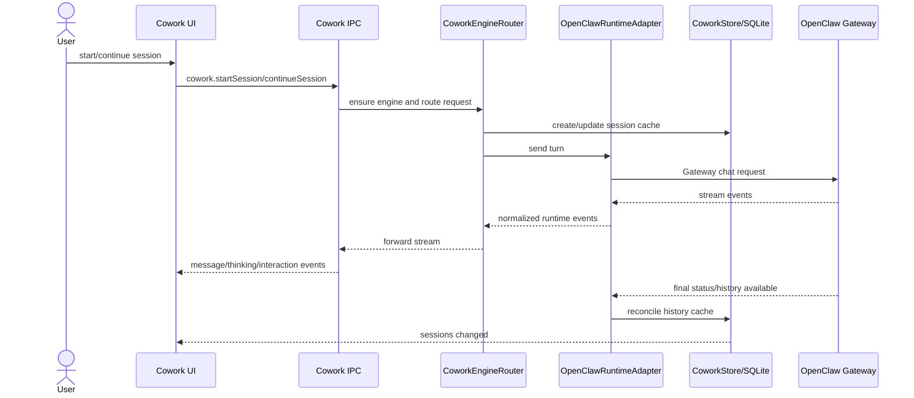
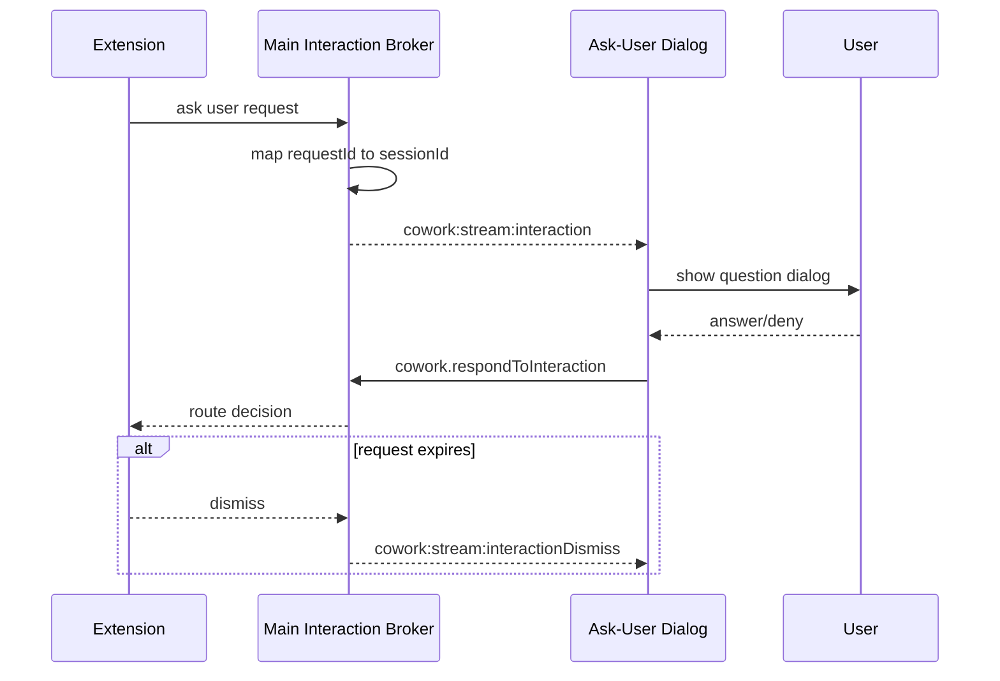

# Cowork 系统

Cowork 是 JustDo 的 AI 工作会话系统。用户在 renderer 中创建或继续会话，Main 进程通过 OpenClaw Gateway 执行任务，并把流式消息、用户交互请求、完成状态和缓存更新转回 UI。

## 关键文件

| 文件                                          | 作用                                     |
| --------------------------------------------- | ---------------------------------------- |
| `src/renderer/features/cowork/`               | Cowork UI、Redux slice、service、组件    |
| `src/main/ipc/cowork/`                        | Cowork IPC handlers                      |
| `src/main/engine/coworkEngineService.ts`      | Cowork engine service                    |
| `src/main/engine/coworkEngineRouter.ts`       | session routing facade                   |
| `src/main/engine/openclawRuntimeAdapter.ts`   | Gateway adapter                          |
| `src/main/engine/coworkRuntimeForwarder.ts`   | runtime events -> IPC events             |
| `src/main/data/coworkStore.ts`                | local session/message/agent persistence  |
| `src/main/openclaw/sessions/`                 | Gateway session key/history/text helpers |
| `src/main/engine/openclaw/subagentGateway.ts` | subagent status/history bridge           |

## 会话生命周期

```mermaid
sequenceDiagram
  actor User
  participant UI as Cowork UI
  participant IPC as Cowork IPC
  participant Router as CoworkEngineRouter
  participant Adapter as OpenClawRuntimeAdapter
  participant Store as CoworkStore/SQLite
  participant GW as OpenClaw Gateway

  User->>UI: start/continue session
  UI->>IPC: cowork.startSession/continueSession
  IPC->>Router: ensure engine and route request
  Router->>Store: create/update session cache
  Router->>Adapter: send turn
  Adapter->>GW: Gateway chat request
  GW-->>Adapter: stream events
  Adapter-->>Router: normalized runtime events
  Router-->>IPC: forward stream
  IPC-->>UI: message/thinking/interaction events
  GW-->>Adapter: final status/history available
  Adapter->>Store: reconcile history cache
  Store-->>UI: sessions changed
```

## 数据边界

| 数据           | 权威来源                            | JustDo 本地角色                |
| -------------- | ----------------------------------- | ------------------------------ |
| 执行历史       | OpenClaw Gateway `chat.history`     | 缓存、搜索、列表展示           |
| 会话列表元数据 | JustDo SQLite + Gateway session key | UI 列表、标题、pin、group、cwd |
| 用户交互请求   | extension host event                | 弹窗和用户响应                 |
| Subagent 状态  | Gateway event/history               | UI 展示和跳转                  |
| Agent 配置     | JustDo SQLite                       | Gateway 配置同步输入           |
| Token 使用统计 | OpenClaw Gateway `usage.cost`       | 设置页按日柱状图展示           |

## 使用统计

设置页的“使用统计”选项卡通过受控 preload API 调用 Main 进程，Main 再向 Gateway 请求
`usage.cost`。查询使用 `agentScope: all` 覆盖所有代理，并按本机 UTC offset 计算最近
7、14 或 30 天的范围。柱状图使用 Gateway 返回的 `daily[].totalTokens`，其中总量口径与
OpenClaw 一致，包括 input、output、cache read 和 cache write Token。

Renderer 不扫描 SQLite 消息缓存自行计数；`cowork_messages.usage` 仅用于消息展示和历史缓存，
无法保证覆盖子代理、归档 transcript 或所有 Gateway 会话。Gateway 未连接或统计请求失败时，
页面显示可重试错误态，不用不完整的本地数据冒充完整统计。

`usage.cost` 可能先返回旧缓存并用 `cacheStatus` 标记为 `refreshing`、`partial` 或 `stale`。
JustDo 必须透传该状态并自动轮询；只有 `fresh`（或旧版 Gateway 未返回状态）才视为本轮加载完成，
避免把后台扫描期间的部分日期展示成最终统计。

## Renderer 状态

`src/renderer/features/cowork/coworkSlice.ts` 保存 Cowork UI 需要的 session、message、streaming、ask-user 交互等状态。删除状态不再作为独立 Redux root slice 挂载，相关逻辑留在 cowork feature 内。

## Attachments

附件契约位于 `src/shared/cowork/attachments.ts`。Renderer 通过 dialog/shell API 选择和预览文件，Main 进程负责把附件 payload 安全传入 Cowork 执行链路。

## 用户交互

JustDo 不实现 OpenClaw 命令审批。Extension host 的 ask-user 请求通过 `cowork:stream:interaction` 发给 renderer；用户在交互弹窗中选择后，renderer 调用 `cowork.respondToInteraction()`，Main 把结果交回 extension host。

## 历史同步

Gateway history 是权威。`historyReconciler` 和 `src/main/openclaw/sessions/openclawHistory.ts` 负责把 Gateway 历史整理为 UI 可展示/可缓存的本地消息。SQLite 损坏或过期不能改变 Gateway 的执行事实。

## 约束

- 新的 Cowork 行为优先通过 Gateway API 实现。
- 不在 renderer 中重建 execution truth。
- 不把 tool-call id、subagent label 或 SQLite message 当成 Gateway 的权威替代。
- 用户可见错误必须 i18n。

## 详细状态模型

### Session Metadata

本地 `cowork_sessions` 存的是 UI 和产品元数据：

- `id`：JustDo UI session id。
- `title`：本地显示标题，可由标题生成服务更新。标题服务通过当前选中模型的
  OpenAI-compatible API 做一次无状态请求，不创建 OpenClaw/Gateway 会话；模型不可用、
  请求失败或超时时回退为首条非空输入的截断文本。该 Main 进程请求可以遵循用户选择的
  系统/自定义代理，但不经过本地 MITM。标题 URL 命中 Outbound Header 白名单时，该确定性
  调用点会显式注入配置 Header；Main 的其他请求不继承这一行为。
- `status`：UI 状态，例如 idle/running/error。
- `cwd`：会话工作目录。
- `execution_mode`：当前只保留 local/sandbox/auto 语义，旧 container 会迁移到 local。
- `active_skill_ids`：本次会话 UI 选择的 skill。
- `agent_id`：绑定 Agent。
- `group_id`：会话分组。
- `pinned`、`created_at`、`updated_at`：列表展示和排序。

这些字段可以驱动 UI，但不能替代 Gateway 的真实运行状态。运行中状态应优先从 Gateway runtime status 和 stream event 获取。

### Runtime Status Polling

Renderer 对当前会话每 3 秒查询一次聚合运行态，空闲时放宽到 10 秒；不可见的后台会话每 30 秒批量查询一次，窗口隐藏时统一放宽到 60 秒。查询经由 `cowork:sessions:runtimeStatus` 到 Main，Main 使用一个 2 秒 TTL 的 single-flight `sessions.list` 快照，同时计算主会话、announce 可见运行和整个 subagent 后代树的状态。

运行态使用 `sessionRuntimeActivity` 作为 UI 的唯一聚合来源：消息输入区的 `In Progress...` 和会话列表蓝色呼吸灯必须读取同一个值。用户提交或收到新 user turn 时立即置为 running；Gateway 返回 running 时立即确认。只有连续两次可信的 idle 快照才清除运行态；超时、断连等未知结果保留上次状态，不能按 idle 处理。主 turn 的 `complete` 事件也不能直接清除聚合状态，因为此时 subagent 或 announce run 可能仍在执行。

### Message Cache

`cowork_messages` 是消息缓存，服务于：

- 会话列表快速恢复。
- 本地搜索。
- Gateway history 暂不可用时的降级展示。
- 旧 UI 组件兼容。

字段 `thinking_content`、`model_name`、`usage` 用于展示增强信息。消息最终仍应以 Gateway history 为准。

## 执行链路

### Start Session

```mermaid
flowchart LR
  Input["CoworkPromptInput submit"] --> Service["coworkService.startSession"]
  Service --> Preload["window.electron.cowork.startSession"]
  Preload --> Handler["registerCoworkSessionExecutionHandlers"]
  Handler --> Ensure["ensureOpenClawRunningForCowork"]
  Ensure --> Sync["sync OpenClaw config"]
  Sync --> Router["CoworkEngineRouter.startSession"]
  Router --> Adapter["OpenClawRuntimeAdapter"]
  Adapter --> Gateway["Gateway chat request"]
```

关键行为：

- Gateway 未启动时自动启动。
- 启动前同步 provider/MCP/hooks/extension 配置。
- 创建本地 session cache。
- 把 cwd、agent、model、skills、attachments 传入 adapter。
- 运行期间通过 event forwarder 更新 renderer。

### Continue Session

继续会话会复用本地 session id 和 Gateway session key。若 Gateway session key 缺失，应通过历史同步/repair 逻辑尽量恢复；恢复失败时要给用户明确错误，而不是静默创建无关联新会话。

### Stop Session

Stop 是用户意图，不保证 Gateway 已经立即停止所有下游工具。UI 应进入 stopping/idle 过渡状态，并根据 final event 或 runtime status 修正。

## Stream Event 分类

| Event                   | 用途                | UI 行为              |
| ----------------------- | ------------------- | -------------------- |
| `message`               | 新消息块            | 插入消息             |
| `messageUpdate`         | 文本 delta          | 更新当前消息         |
| `thinkingUpdate`        | reasoning delta     | 更新 thinking 区域   |
| `messageMetadataUpdate` | usage/tool metadata | 更新附加信息         |
| `messageDelete`         | runtime 删除消息    | 从 UI cache 移除     |
| `interaction`           | ask-user 交互请求   | 打开用户交互弹窗     |
| `interactionDismiss`    | 请求失效            | 关闭弹窗             |
| `complete`              | turn 完成           | 刷新 session/history |
| `error`                 | turn 失败           | 展示错误并标记状态   |

## Ask-User Flow

```mermaid
sequenceDiagram
  participant Tool as Extension
  participant Main as Main Interaction Broker
  participant UI as Ask-User Dialog
  participant User

  Tool->>Main: ask user request
  Main->>Main: map requestId to sessionId
  Main-->>UI: cowork:stream:interaction
  UI->>User: show question dialog
  User-->>UI: answer/deny
  UI->>Main: cowork.respondToInteraction
  Main-->>Tool: route decision
  alt request expires
    Tool-->>Main: dismiss
    Main-->>UI: cowork:stream:interactionDismiss
  end
```

用户交互弹窗要能处理过期请求。`interactionDismiss` 到达后，如果弹窗仍打开，应禁用确认动作并提示用户请求已失效。

## Subagent Flow

Subagent 状态由 Gateway 提供，JustDo 只负责桥接和展示：

- `SubagentMenu` 展示当前会话的子任务入口。
- `SubagentMessageDrawer` 展示子任务消息。
- `cowork.getSubTaskStatus()` 查询 session 下子任务状态。
- `cowork.getSubTaskSession(sessionKey)` 解析子任务会话。

新增 subagent 功能时，优先要求 Gateway 提供稳定 child session id，而不是从 tool output 文本猜测。

## Attachment Flow

附件进入 Cowork 前应满足：

- Renderer 通过用户操作选择文件或目录。
- Main 进程负责读取必要 metadata 或 data URL。
- Payload 使用 `src/shared/cowork/attachments.ts` 中的契约。
- 大文件不应直接塞进 Redux；只传必要引用和预览信息。

## Failure Modes

| 场景                 | 处理                                     |
| -------------------- | ---------------------------------------- |
| Gateway 未就绪       | 返回 `ENGINE_NOT_READY`，UI 显示启动状态 |
| Gateway stream 中断  | 标记 session error，保留可恢复 cache     |
| SQLite cache 损坏    | 重建 cache，优先从 Gateway history 恢复  |
| Interaction 请求过期 | dismiss 弹窗，阻止继续响应               |
| Provider config 无效 | 阻止执行并引导设置模型/API               |
