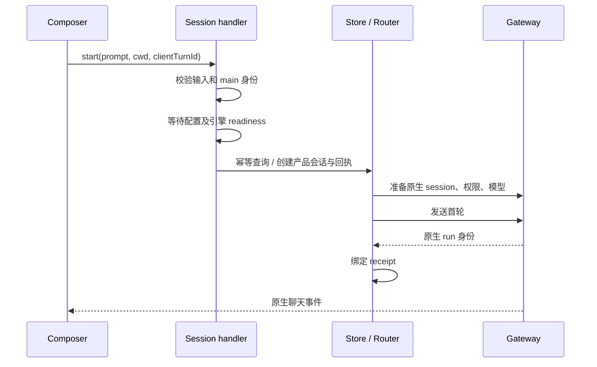
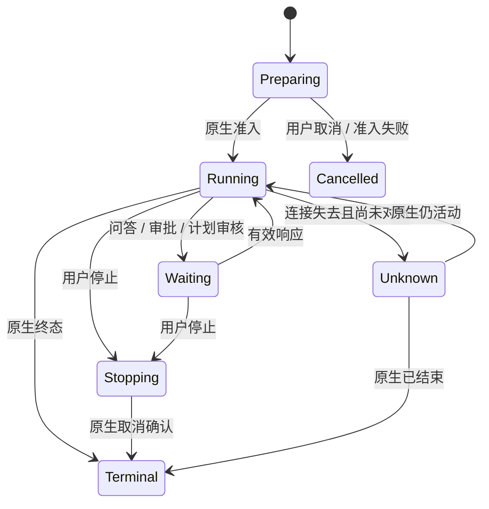

# Cowork：会话、回合与任务生命周期

Cowork 将桌面产品会话映射到 OpenClaw 原生执行。本文以当前 session handlers、CoworkStore、Router/Adapter 及聊天消费方为依据，按任务生命期说明成功、取消、恢复和删除。

## 1. 先区分四类身份

| 身份               | 创建方             | 用途                               |
| ------------------ | ------------------ | ---------------------------------- |
| 产品 sessionId     | Main / CoworkStore | 侧边栏、分组、cwd、模型、权限期望  |
| 原生 sessionKey/id | 受管映射与 Gateway | transcript、原生任务与会话 RPC     |
| clientTurnId       | 产品发送链路       | 用户提交幂等、准入前取消、运行计时 |
| 原生 runId         | Gateway            | 实际执行、事件归属和接收确认       |

受管 session key 包含 Agent 与产品 session 身份，但不能只解析字符串就授予访问。默认用户会话固定 main；任务内助手保留自己的身份，外部集成会话保存单独映射。会话复制、分支和旧 Handoff 来源属于不同关系。

## 2. 状态存放在哪里

`cowork_sessions` 保存产品索引，`cowork_session_runs` 保存 turn/run 绑定与计时，`cowork_plan_handoffs` 保存计划文件交接。Goal 内容、状态与预算由原生 session 持有，Main 的续跑快照另存 `cowork_config`。助手协作表只保存成员与投递元数据。

Redux cowork 管理列表、草稿、交互和产品状态；Lit 控制器维护当前历史窗口及实时投影。Thinking、Tool、Content 的唯一持久来源是 Gateway，不能写回 Main 或 Redux transcript cache。

## 3. 首轮发送与准入前取消

```mermaid
sequenceDiagram
  participant UI as Composer
  participant H as Session handler
  participant S as Store / Router
  participant G as Gateway
  UI->>H: start(prompt, cwd, clientTurnId)
  H->>H: 校验输入和 main 身份
  H->>H: 等待配置及引擎 readiness
  H->>S: 幂等查询 / 创建产品会话与回执
  S->>G: 准备原生 session、权限、模型
  S->>G: 发送首轮
  G-->>S: 原生 run 身份
  S->>S: 绑定 receipt
  G-->>UI: 原生聊天事件
```

消息可以由文字或合法附件组成。cwd 必须明确并经任务工作目录解析；main 模型继承应用默认，不读取历史 main 档案 override。activeSkillIds 是产品请求，不替代 Gateway 最终可用性判断。

handler 用 clientTurnId 管理 pending start。用户在等待配置或启动期间取消，应退出准入，不创建一个稍后偷偷开始的任务。session 已建立时取消转为 Router stop。迟到取消只有在回执仍为当前运行时才生效，不能终止下一 turn。

重复提交已知 clientTurnId 返回同一产品会话和计时记录；不能因一次响应丢失生成第二个任务。原生是否接收仍由 run 绑定及运行状态确认。

## 4. 后续回合与设置修改

后续 turn 可由 Renderer chat controller 直连发送，但先经 Main 做配置等待、模型 readiness 和会话权限准备。产品 ask/auto/full 映射原生 guarded/workspace/full，每次发送前核对 mode/root；不通过修改全局 exec 模式实现单会话权限。

权限切换保存用户期望，活跃 run 期间延迟到适当边界应用；下一次发送必须收敛成功。模型引用保持 provider/model 限定，变更只作用于明确目标，不能让助手独立模型覆盖应用默认。

发送失败要区分准入拒绝、明确原生失败和可能已接收的未知结果。乐观 user message 在 Renderer 中恢复或标错，不能据 UI 是否存在该消息决定是否重发。

## 5. 运行状态与停止

产品活跃状态综合原生主运行、活动后代，以及 Goal continuing/retrying 等阶段。父模型返回不代表后代全部结束；主运行和子任务计数字段不能互相充当对方事实。

```mermaid
stateDiagram-v2
  [*] --> Preparing
  Preparing --> Running: 原生准入
  Preparing --> Cancelled: 用户取消 / 准入失败
  Running --> Waiting: 问答 / 审批 / 计划审核
  Waiting --> Running: 有效响应
  Running --> Terminal: 原生终态
  Running --> Stopping: 用户停止
  Waiting --> Stopping: 用户停止
  Stopping --> Terminal: 原生取消确认
  Running --> Unknown: 连接失去且尚未对账
  Unknown --> Running: 原生仍活动
  Unknown --> Terminal: 原生已结束
```

该图是产品处理阶段，不是新增数据库 enum。实际 run 状态、Goal 阶段和交互状态各自有共享契约。

停止交给原生取消语义，包含队列、后代和审批清理，Main 保留产品 stop latch 与回执。协作任务还冻结用户轮次并停止成员，防止迟到 peer send 重启旧工作。错误事件只有匹配运行及终态语义才结算，不能将任意工具错误视作整个会话结束。

## 6. Goal 自动续跑

原生六种状态为 active、paused、blocked、usage_limited、budget_limited、complete。受限状态独立保留；resume 的预算窗口由原生处理。Main 仅在同一 Goal 仍为 active 时协调下一回合，并考虑等待用户、审批、退避、续跑上限和显式停止。

用户目标操作携带 goalId fence，避免迟到按钮操作改到新目标。重连扫描原生 Goal 和 runtime，再恢复产品快照；不能根据旧 SQLite snapshot 无条件续跑。目标仍存在时，普通消息编辑/撤回受限，目标修改通过 structured mutation 完成。

## 7. 计划、问答与审批

AskUserQuestion 的 pending、默认和超时在 Extension 中；Main 转接 event/RPC，Renderer 展示并提交，重连使用 list/replay。UI 消失不等于问题被回答。

PresentPlan 将规范化计划作为工作区内受控文件持久化，并保存 SHA-256、长度、创建时 workspace root 与 handoff 身份。持久文件、handoff 和 awaitingReview 标记就绪后才展示侧栏。批准后通过原生 reset 建立实施上下文边界，注入隐藏实施指令；可见历史与模型上下文不同，不能删除规划历史来模拟 reset。

审批与计划确认分开。exec/plugin approval 使用原生期限和决策集合；Main 校验请求仍有效，不能把关闭窗口、断线或默认选择视作允许。

## 8. 子任务与平级助手

子任务以 `tasks.list/get` 与 task event 为权威，Subagent 和 ACP 执行共用原生 ledger。详情按 taskId 核对 session 身份，再组合 session lifecycle 与 usage；查询失败不能退回未经核验的任意 sessionKey。completed 的 blocked outcome 仍显示 blocked，不能显示成功。

平级协作由默认关闭的 agent-team 扩展提供。模型准备成员后使用原生 sessions_send，侧栏只显示锚点任务，详情按成员读取原生历史。任务成员不是 Subagent 树节点，accepted 投递也不是任务完成。完整预算与删除协议见[协作机制](../features/multi-agent-collaboration.md)。

## 9. 历史、分支、复制与删除

历史由 Gateway 加载，Renderer 有界分页并与 live state 按身份合并。分支从稳定、已完成的原生助手 entry 创建，不根据屏幕数组索引推导切点。Plan reset 前后及 Goal 会话的操作门禁必须与原生语义一致。

单会话删除、整协作任务删除、定时任务结果删除有不同 owner，不能共用“删一行”的实现。整协作任务先持久冻结，再停止并逐个确认原生删除，最后删产品元数据；部分失败保留进度供重试。外部映射和结果 tombstone 防止后续同步复活已删条目。

附件先经过产品 staging/校验，预览与编辑通过 Main 授权；项目文件不随一般会话索引删除而任意清理。受管计划产物按其保存的 workspace root 定位，不能使用已变化的 cwd 误删。

## 10. 重启与故障诊断

恢复按身份进行：加载产品索引 → 建立 Gateway 连接 → 查询原生会话与任务 → 对账 run receipt、Goal 和交互 → 加载历史并接续实时流。完整应用重启使用 app-start boundary，同进程 Gateway 重启使用原生恢复；两者不等价。

| 症状                     | 优先核对                                                     |
| ------------------------ | ------------------------------------------------------------ |
| 点击发送后一直准备       | config queue、engine readiness、model/permission preparation |
| 停止后列表仍活动         | 原生后代、Goal phase、协作成员及取消失败                     |
| 回答重复或消失           | clientTurn/run 绑定、原生历史、Renderer reconcile            |
| 计划重启后找不到         | handoff 状态、创建时 workspace root、文件摘要                |
| 子任务已结束但父会话仍忙 | required-child join 与原生 task/session revision             |
| 删除失败或又出现         | owner 对应 cleanup/tombstone，而非只看 UI 列表               |

## 11. 实现与回归入口

Main 从 `ipc/cowork/sessionExecution.ts`、`sessions.ts`、`sessionRuntime.ts`、`interactions.ts` 进入；Router 在 `engine/cowork/`，Adapter 在 `engine/openclaw/`，Goal 在 `openclaw/goals/`。Renderer 从 CoworkView、composer、sessions 和聊天 wrapper 组合。

回归应覆盖准入前取消、重复 clientTurn、原生先完成后响应、停止失败、会话切换迟到事件、Plan reset、Goal fence、协作删除部分成功和历史恢复。对应 handler、Store、Adapter 与 controller 都有领域测试；一次正常发送不能替代这些边界验证。
