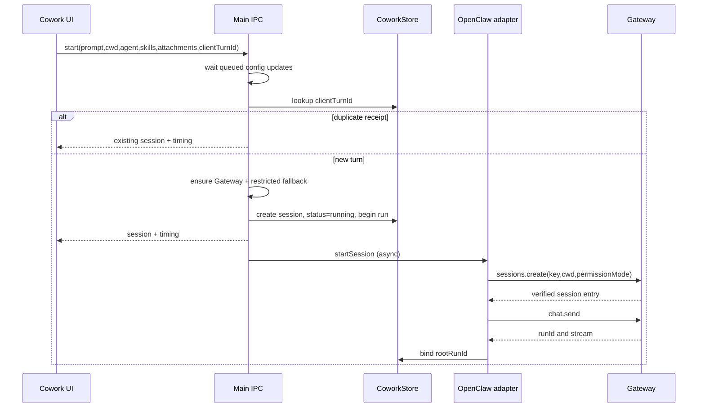
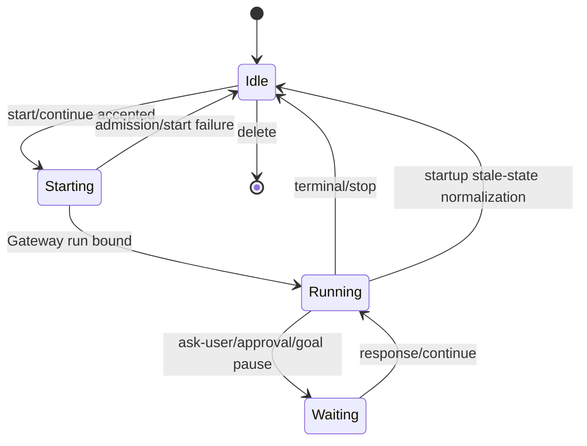

# Cowork 系统

本文按 `v2026.8.27` 的会话 handler、SQLite store、OpenClaw adapter、Renderer feature 和 shared 合约重写。Cowork 是产品会话层，不是另一套 Agent engine。

## 1. 职责与边界

Cowork 负责把本地产品会话映射到 OpenClaw session/run：

- 保存标题、cwd、agent、model、permission、active skills、group、pin，以及与 Gateway goal 分离的本地 execution snapshot；
- 对 start/stop/delete 建立安全 admission 和幂等语义；
- 把 Gateway lifecycle 映射为产品 session/run 状态；
- 让 Renderer 在重连、切页和历史加载后从 Gateway 恢复 chat UI；
- 提供审批、ask-user、附件、subagent、goal、上下文用量和导出 UX。

Gateway 仍是执行与 transcript 权威；JustDo SQLite 只保存产品会话元数据和 run receipt，不再持久化消息副本。Main 与 Redux 也不保留 transcript projection。

## 2. 主要实现

| 层         | 入口                                                                | 职责                                                             |
| ---------- | ------------------------------------------------------------------- | ---------------------------------------------------------------- |
| Shared     | `src/shared/cowork/`、`sessionGoal.ts`、`openclaw/messageDomain.ts` | 附件、run、title、目标、事件分类                                 |
| Main store | `src/main/data/coworkStore.ts`                                      | session/run/config/agent 产品状态持久化                          |
| Main IPC   | `src/main/ipc/cowork/`                                              | execution、session、runtime、config、interaction、subtask、group |
| Router     | `src/main/engine/cowork/coworkEngineRouter.ts`                      | 仅转发到 OpenClaw runtime；不再多引擎路由                        |
| Adapter    | `src/main/engine/openclaw/openclawRuntimeAdapter.ts`                | session/run mapping、Gateway RPC、生命周期/Goal/审批协调         |
| Renderer   | `src/renderer/features/cowork/`                                     | 列表、输入、权限/审批、goal、subagent、文件预览                  |
| Chat       | `src/renderer/libs/openclaw-chat/`                                  | history/live 状态与 timeline 渲染                                |

## 3. 三种身份

一次用户提交必须区分：

| 标识                         | 生成方                      | 用途                                            |
| ---------------------------- | --------------------------- | ----------------------------------------------- |
| local `sessionId`            | `CoworkStore.createSession` | 产品导航、run receipt 与生命周期状态            |
| Gateway `sessionKey`         | managed-key 规则/Gateway    | transcript、session RPC、审批与 subagent parent |
| `clientTurnId` / `rootRunId` | Renderer/Main / Gateway     | 幂等提交和事件归属                              |

`cowork_session_runs` 用唯一 `client_turn_id` 防止双击或 IPC 重试创建第二个 session；Gateway 接受后将真实 `root_run_id` 绑定到 receipt。事件优先按 run id 映射，必要时再按受管 session key 解析。任意远端 key 不得自动映射到本地 session。

## 4. Session 数据模型

本地 session 包含：`id`、`title`、`status`、`pinned`、`cwd`、`executionMode`、`permissionMode`、`activeSkillIds`、`agentId`、`modelRef`、`groupId` 和时间戳。`permissionMode`/`cwd` 是产品的耐久期望投影；执行时权威是 OpenClaw session entry 的 `permissionMode`/`sessionRoot`。当前 engine 固定为 OpenClaw，历史 `container` execution mode 会迁移为 `local`。

状态字段是产品快照，不是判断运行中的唯一依据。实际 `running` 由 adapter memory、Gateway `sessions.list/describe`、root run 和 subagent 状态共同计算；启动时遗留的本地 running 会恢复为 idle。

## 5. Start 流程

```mermaid
sequenceDiagram
  participant UI as Cowork UI
  participant IPC as Main IPC
  participant DB as CoworkStore
  participant RT as OpenClaw adapter
  participant GW as Gateway
  UI->>IPC: start(prompt,cwd,agent,skills,attachments,clientTurnId)
  IPC->>IPC: wait queued config updates
  IPC->>DB: lookup clientTurnId
  alt duplicate receipt
    IPC-->>UI: existing session + timing
  else new turn
    IPC->>IPC: ensure Gateway + restricted fallback
    IPC->>DB: create session, status=running, begin run
    IPC-->>UI: session + timing
    IPC->>RT: startSession (async)
    RT->>GW: sessions.create(key,cwd,permissionMode)
    GW-->>RT: verified session entry
    RT->>GW: chat.send
    GW-->>RT: runId and stream
    RT->>DB: bind rootRunId
  end
```

细节：

- cwd 必须来自请求或 Cowork config，空值直接拒绝；真正任务目录由 `resolveTaskWorkingDirectory` 解析。
- 新会话 permission 使用 shared `resolvePermissionMode` 从 Cowork 默认值创建；Renderer 的 start payload 不承载可信权限值。
- adapter 把 `ask/auto/full` 映射为 `guarded/workspace/full`，并在发送前核对 Gateway 回传的 mode 与规范化 root；不匹配时不发送。
- 初始 model 从所选 agent 读取并写入 session/run，保证统计和显示可追溯。
- handler 不等待完整 Agent run；启动调用异步执行，错误经 stream 广播并落终态。
- Renderer 在临时会话中显示首条 optimistic user item；canonical key 建立后由 Gateway history/实时事件接管，不经 Main 消息缓存。

## 6. 后续回合与模型切换

首轮建立 canonical session 后，后续回合由 Renderer `ChatController` 直接调用 Gateway `chat.send`。发送前 `CoworkView` 必须先经 Main 的 permission coordinator 幂等 reconcile 当前 session mode/root；失败则不调用 `chat.send`。用户可在 run 活跃时修改权限，Main 先持久化新选择并在终态事件后后台应用；当前 run 不被打断，下一回合的 reconcile 仍是不可绕过的安全边界。Controller 负责 optimistic user item、提交串行化、run ownership 和 Gateway history 对账；不再经过旧的 `cowork:session:continue` IPC。

会话模型读写通过 `sessions.patch/get`：

- 输入必须是 qualified `provider/model`；旧的裸 model id 在启动迁移时只在唯一匹配时补齐 provider。
- 模型候选范围仍由 JustDo provider 配置决定；输入框按 Agent 调用 Gateway `models.list`
  的 `provider-config` 视图，以 OpenClaw v2026.9.2 的目录投影补充认证可用性、输入能力和
  上下文窗口。明确不可用的模型保留可见但禁止选择，目录读取失败时退回本地配置，不阻断对话。
- managed config 固定 `agents.defaults.modelSelectionScope=session`。`sessions.patch` 只负责当前
  session override，Agent/全局默认模型仍由 JustDo SQLite 与 config sync 单点持久化，避免双方
  同时改写 `openclaw.json`。
- 返回声明 `appliesTo` 是 next turn 或 subsequent calls，并标记来源是 gateway、local cache 或 agent default。
- UI 不应在 Gateway patch 失败时永久保留乐观模型；需回退显示并提示。
- 同一 session/agent 上下文在完成初始 Agent/模型数据加载后，模型选择由用户拥有：只有模型选择框的手动操作可以改变它。选择值、pending task 和确认态保存在 Redux，模型更新通过跨组件实例共享的串行队列执行，避免导航卸载后的旧结果覆盖新选择。Gateway 回读、终态事件、同 session reload、全局默认值和模型列表刷新不得静默切换；打开另一条 session 时，选择框才按该 session 已保存的模型初始化。

## 7. Stop、删除与终态

用户 Stop 以 session 为范围调用 `sessions.abort {key, clearQueued: true}`，由 Gateway 取消本会话的运行、排队工作及受控后代；内部替换冲突 run 则保留精确 `runId`，避免停止无关的新运行。后代发现不完整或取消失败不能报告完整停止成功，`bestEffort` 也保留未确认的运行状态。停止期间拒绝同会话的新 Main 提交，迟到响应只能清理原运行。

Renderer 的发送准备、Gateway 受理和 Stop 共享会话级操作身份。切换会话后不得将原消息交给新会话的 Controller，迟到的停止也不能清理新会话／新 run 的发送状态。Stop 等待在途发送或首次会话创建收敛，并在晚到受理后再次确认取消。手动压缩在准备阶段尚未注册取消 handle 时，`no-active-run` 不算取消完成；Controller 保留原压缩操作并重复请求取消，直到原请求收敛。压缩与等待用户回答仅限制编辑／发送，不禁用取消；停止进行中禁用重复点击并保持停止控件，失败后显示反馈并允许重试。

发送明确拒绝会结算 Main receipt 并保留草稿。传输超时或断连只能证明受理结果未知，保留原操作身份，通过 Gateway 活动快照和 `agent.wait` 的权威终态恢复；不得把未知请求伪造为成功受理，也不得直接结算 failed。显式停止确认后可结算从未发出的 aborted receipt；已发出但受理未知的请求通过专用生命周期 IPC 保留取消意图，两个 `no-active-run` 也不能证明该请求以后不会被受理。`agent.wait` 的 yielded 证明已受理但不代表整项任务结束，应交回主任务／后代聚合；取消中的 yielded 先确认会话级清队列和子树停止。

删除 session 的顺序包括停止活动、删除本地 row（级联 runs）、通知 adapter 清映射，并递归删除受管 subagent transcript；不能删除通用 `:main` 或不属于本产品的 Gateway session。

业务终态来自明确 chat/lifecycle/runtime 证据。WebSocket disconnect 只触发连接恢复和必要的错误提示，不能自动将所有 run 标成 error。Renderer 在终态后直接刷新 Gateway history，以权威 final text、usage、thinking 和 tool 结果校正活动 timeline。

对 managed JustDo 会话，模型回合终止不等于编排任务终止。OpenClaw v2026.9.2 原生 task
ledger 与 required-child join 在提交 terminal assistant reply 前等待 required children 终态并续跑
同一父会话；只有结果已被父 agent 消费且 continuation 成功提交，父 run 才能结束。显式
fire-and-forget 不形成该 obligation，用户 stop/abort 会中断等待。JustDo 只消费 task RPC/event
并投影 UI，不再用本地补丁复制 join、FIFO、announce ownership 或 terminal guard 状态机。

显式 `sessions_yield` 可能只呈现已完成的一批 child；这不会解除仍在运行 sibling 的 obligation。
若模型此时给出 terminal reply，Gateway 会把同一 controller 的剩余 `waiting` ownership 持久化
转交给 implicit join，完成后再次呈现并续跑。该转换同时覆盖 embedded 与 Codex app-server；
Codex companion 在任何 plugin import 前按锁定版本/hash补齐 managed commit/recovery/handoff 合约。
转换持久化失败时 fail closed 并返回可见 runtime error；abort/timeout 则恢复 native completion，
不能静默结束，也不能通过无界 revision 重试掩盖 durability failure。

## 8. Event 模型

`CoworkRuntimeEvents` 包含：

- `activity`：仅携带 sessionId、user/other 分类和时间，用于会话列表排序、未读与外部触发发现；
- `complete`：session 的明确终态；
- `error`：可见错误，不一定等价 terminal；
- `sessionStopped`：本地停止完成；
- `cronChanged`：触发 scheduled task refresh/reconcile。

Thinking、Tool、Content 不属于 `CoworkRuntimeEvents`；Renderer Gateway client 直接规范化并交给 reducer。共享 `messageDomain` 按 session/run 判定 current、related、foreign、stale 等 admission，并统一 tool terminal status，避免协议分叉。

## 9. 历史与缓存

Main 不再拥有 `HistoryReconciler` 或消息 CRUD。Renderer controller 统一处理：

- `chat.startup` / 分页 `chat.history` 的权威 transcript；
- in-flight snapshot 与实时 Thinking/Tool/Content 的接管；
- 按 stable identity、run、sequence 和 history generation 对账；
- 750 条有界显示窗口及 session 页面生命周期缓存。

这些显示状态不写入 SQLite 或 Redux。导出从当前 controller 的 Gateway 快照生成；会话详情、用量、定时任务结果和 subagent history 由 Main 按需查询 Gateway，查询结果不回填 CoworkStore。

会话列表的“会话详情”通过专用 `cowork:session:details` IPC 读取 Gateway 精确 session row。Token 和实际请求模型使用 `sessions.usage` 的 `range=all`、instance 聚合；总 Token 优先使用 OpenClaw 的 canonical `totalTokens`，缺失时才把 input/output/cacheRead/cacheWrite 相加。摘要、可见用户/助手消息和工具调用次数从同一当前实例的完整 `chat.history` 投影计算；history 失败时整次统计失败，不能把原始 usage count 静默标成“可见消息”。同一原始记录跨分页重放时按投影记录身份合并，保证同名并行工具调用不会被去重；全量分页同时校验 `totalMessages` 并在末尾用 `deltaCursor` 追平，后续活动刷新只读取 delta，遇到 reset、compaction、分支或物理实例切换导致的 `kind=reset` 才丢弃快照重建。OpenClaw v2026.9.2 的 usage 外层缓存会 stale-while-revalidate：终态精确 key 查询使用 session revision 作为稳定 discriminator，活动会话每轮使用新 discriminator；一次查询的所有 fresh 重试复用同一值，避免每次重试污染缓存。合法的 `usage=null` 表示当前还没有 Token，而不是查询失败。终态会话的完整 history 只缓存当前一个 revision，`null` 或 reject 都不留失败缓存；活动会话逐次读取 history，避免同一 run 内 Token、消息和工具计数冻结。运行中详情在上一轮查询完成后才调度下一轮刷新。界面中的“最后活动”优先使用 session row 的 `lastActivityAt`，Session ID 只使用 Gateway `sessionId`，不能用通用 row `id` 或 `cowork_sessions.id` 代替。统计范围与当前 Session ID 一致，不跨 reset/rotation 的历史实例。

## 10. Goal 生命周期

OpenClaw 的 session row 是 Goal 内容、状态、token 预算和状态时间戳的唯一权威。`SessionGoalStatus` 原样保留 `active`、`paused`、`blocked`、`usage_limited`、`budget_limited`、`complete` 六种原生状态；后两者不能折叠成 `blocked`，因为 resume 会为受限 Goal 重置预算窗口。JustDo 的 `GoalExecutionPhase` 仅描述产品侧自动续跑状态：`waiting`、`running`、`continuing`、`retrying`、`awaiting_input`、`awaiting_confirmation`、`stopped`。

新 Goal 通过 `chat.send` 的 `session-goal-start` intent 建立。`message` 是 NFC 规范化后的原文目标，`idempotencyKey` 同时是 operation identity，`issuedAtMs` 在不确定重试时保持不变。发送前必须通过 `sessions.create` 取得并携带精确 `sessionId`；Goal admission 不携带 `timeoutMs`、queue 或其他临时 runtime override。

编辑、暂停、恢复和清除不再拼接 slash command，而走 `sessions.goal.update` / `sessions.goal.clear`。每次请求同时携带 `sessionKey`、`agentId`、`sessionId`、`goalId`、`operationId`、`issuedAtMs`：session/goal identity 防止迟到按钮修改替换后的目标，24 小时 durable receipt 使响应丢失后的同一请求可安全重放。收到 replay receipt 后必须重新 `sessions.describe`，不能把 receipt 中的历史快照直接当当前状态。Resume RPC 会在同一原子流程中激活 Goal 并启动隐藏 continuation，用户补充内容放在最长 2000 字符的 `note` 中；Renderer 不再随后发送第二个普通 chat turn。

Goal continuation coordinator 只负责产品自动续跑：

- `active` Goal 在普通 run 结束且无托管 subagent 未完成时可发起下一 turn；
- `paused` 映射为本地 stopped，`blocked`/两种 limited 映射为 awaiting input，`complete` 映射为 awaiting confirmation；
- reconnect 从本地 execution snapshot 与 Gateway Goal/runtime 恢复，但任何 canonical Goal 状态都会覆盖本地推断；
- completed Goal 接收后续反馈时，必须重新确认同一 `goalId` 仍为 canonical `complete`，再 structured clear，并以用户反馈原文建立新 Goal；
- continue、mutation 和 feedback replacement 均按 session single-flight，且只接受匹配当前 generation 的迟到结果。

Renderer 的 GoalStatusCard 只投影 Gateway Goal 与 Main execution snapshot。卡片区分 usage/budget limited，展示 token 使用量；运行时长在 active 状态增长，其他状态冻结在对应原生时间戳。Renderer 不能乐观伪造服务端 lifecycle。

## 11. Ask-user 与 Approval

`AskUserQuestion` extension 通过 `plugin.ask-user-question.requested/resolved` 产生 interaction。Main 把 extension 的 pending record 绑定到产品 session 并广播问题；Renderer 使用初始居中的非模态悬浮框收集结构化答案，不改变消息区布局。框外区域不拦截指针事件，标题栏可在视口范围内拖动，因此用户能在回答前滚动、选择和复制对话内容。悬浮框只在 interaction 所属 session 为当前会话时显示，切换会话时保留未提交答案与拖动位置；显示期间锁定当前会话的编辑、模型切换和普通发送，停止按钮仍可用，以便用户直接取消等待中的任务。提交前 Main 根据当前投影校验 question/option id，extension 在 `askUserQuestion.resolve` 再按权威 pending record 校验并完成 promise。pending、`expiresAt`、timeout/default 和 abort 都由 extension 持有；adapter 重连和 Renderer 刷新分别通过 `askUserQuestion.list` 与 interaction replay 恢复待答问题；dismiss 只是 UI 生命周期，不代表拒绝或完成。

Exec/plugin approval 走独立 Gateway approval API，并继续使用阻塞式 modal；不得复用 ask-user 的非模态展示语义。session 级 exec grant 绑定 session key，结束/停止/删除时清除。命令审批等待时限在配置页选择，并进入 OpenClaw 原生 request/wait 生命周期；无限等待不显示倒计时。文件范围与 exec reviewer 由 OpenClaw 原生 session mode 统一决定。权限 modal、文本确认模式和 scheduler 的无人值守模式不得共用含糊的 boolean `autoApprove`。

## 12. Attachments 与文件预览

附件先用 shared normalizer 验证类型、名称、路径/内容，再作为结构化 metadata 和 Gateway payload 发送。历史解析会提取实际发送路径用于展示。预览读取通过 Main；编辑必须先取得绑定目标的授权 token。会话导出会把 timeline 转成明确格式，不直接复制内部 Gateway JSON。

## 13. 子任务列表与 Subagent

子任务列表以原生 `tasks.list/get` 与 `task` event 为权威，当前展示会话直接派生的 Subagent 任务；状态稳定化为 `pending/running/done/failed/killed/timeout/blocked`，其中 OpenClaw 的 `completed + terminalOutcome=blocked` 必须保留为 blocked，不能显示成成功。`taskName` 是机器标识，`label` 是展示标题，不能把随机 session key 当用户标题。

Main 对 task 查询做 single-flight 和短时缓存，并用版本化 wire validator 检查分页、cursor、状态、进度摘要和 terminal projection；实时 `task` event 会使对应快照失效，并经 IPC 通知 Renderer 立即重读原生 ledger。Renderer 参考 OpenClaw WebChat 使用右侧 rail：进行中任务固定优先展示，结束历史默认展开且可手动折叠，每行固定按状态灯、标题、原始状态值和详情按钮排列；右上角入口在 rail 收起时显示活动数。列表即使收起也会预加载，并在父会话或任一 child 活动时每 5 秒刷新，全部终态后退避到 30 秒，轮询也作为重连或丢事件的兜底；抽屉只在所选 child 活动时持续刷新，终态只做一次确认。查询不再调用 agent 的 `subagents list` 工具，因此不需要旧 patch 049，也不会计入 agent tool-loop。

Subagent 详情的 Token 用量不使用 `sessions.list.totalTokens`，因为该字段是上下文快照而非当前实例累计消耗。详情打开时通过专用 `cowork:subTask:details` IPC 按 `taskId` 组合 `tasks.get`、`sessions.describe` 和 `sessions.usage`：完整 prompt 和 task terminal outcome 来自 task，精确 session 身份、当前重激活状态及累计运行时长来自 session row，Token 与实际请求模型来自当前 instance usage。每轮状态刷新都读取轻量 session lifecycle；仅当 session revision 不旧于 task 时才覆盖 task 终态。传入 `taskId` 后 task 查询或身份校验失败必须整体失败，不能退化为调用方所给 `sessionKey` 的未验证详情。当前子任务弹框不展示消息计数，因此不能为每次 Token 刷新全量读取 history。“总 Token”使用 OpenClaw canonical total，四项仅作为 breakdown，二者不要求相等。queued 任务没有 `startedAt` 时不显示开始时间或运行时长；重新激活进入 pending/running 时，Main 与 Renderer 都必须清除上一代 terminal 字段，并以 Gateway `runtimeMs` 快照加本地采样后增量连续显示累计运行时长。Renderer 使用请求代次拒绝事件前或同毫秒乱序的旧生命周期响应。读取失败时保留上一次完整结果并明确标记刷新失败。

父会话运行状态聚合真实主运行、活动后代，以及 Goal `Continuing` / `Retrying` 调度阶段；`mainRunning` 与 `subagentRunning` 保留各自含义，父 row 的后代活动字段不能算作主运行。停止按钮和列表圆环消费同一聚合态，独立手动压缩在本地请求期间也保留取消入口。完成通知、工具卡和抽屉必须按 parent/session/run identity 归属，迟到 announce 不能写入另一 turn。该 UI 聚合规则不替代 Gateway 的 terminal guard：前者决定展示 active，后者保证 required child 未被父模型处理时 run 本身不会静默结束。

## 14. Renderer 状态

`coworkSlice` 保存 session 列表、选择、加载/错误等产品状态。大体量 transcript/live reducer 留在 chat component 内，避免 Redux 每个 delta 触发全应用 render。选择器、删除状态机、session presentation、latest serial queue、run activity、context usage display 都有独立纯函数和测试。上下文用量不进入 Redux，也不经专用 IPC 轮询；ChatController 直接投影 Gateway `chat.history.sessionInfo`、`sessions.changed` 与 `session.message.session`，Wrapper 只把选中会话的轻量快照传给输入区。

## 15. 失败与排障

| 现象              | 首查                                                                 |
| ----------------- | -------------------------------------------------------------------- |
| 提交立即失败      | engine status、config sync、permission verification、cwd             |
| UI 一直 running   | runtime status、open run receipt、Gateway sessions、subagent         |
| 消息重复/缺失     | session/run identity、sequence、history reconciliation               |
| stop 后审批仍出现 | session key grant/pending approval cleanup                           |
| goal 不续跑       | goal snapshot、control run、原生 required-child task join、lifecycle |
| 重启后状态错误    | startup reset、Gateway list/describe、channel session sync           |

日志先看每日 main log 与 Gateway condensed log；需要完整 event sequence 时按 `[gateway] log file:` 查看 native JSON log并按时间、run id、session id 关联。

## 16. 维护与测试

变更至少覆盖：重复 client turn、start failure、异步 error broadcast、stop best-effort、run bind/terminal、session key 隔离、重连、history reconcile、goal single-flight、subagent parent、approval cleanup、附件 normalize 和长历史性能。对应测试集中在 cowork handler/store/adapter、shared message/goal 与 Renderer chat/cowork 目录。

## 17. Session 与 Run 状态转换

```mermaid
stateDiagram-v2
  [*] --> Idle
  Idle --> Starting: start/continue accepted
  Starting --> Running: Gateway run bound
  Starting --> Idle: admission/start failure
  Running --> Waiting: ask-user/approval/goal pause
  Waiting --> Running: response/continue
  Running --> Idle: terminal/stop
  Running --> Idle: startup stale-state normalization
  Idle --> [*]: delete
```

SQLite `session.status` 是产品快照，不是完整状态机权威。Gateway runtime、open root run、goal execution 和 managed subagent 共同决定 UI 是否展示 active。任何转换都要保持 terminal 幂等：重复 final、stop 后迟到 event、应用重启修复不能再次结算计时或生成第二条完成消息。

## 18. 并发与幂等约束

- `clientTurnId` 约束一次用户提交；同 id 重试同 session 可识别，跨 session 重用必须拒绝。
- 每个 session 的 mutation 通过 serial queue/single-flight 控制，避免 continue、model patch、stop 交错覆盖。
- root run begin/bind/fail 分阶段记录，Gateway 尚未返回 run id 时失败也可结算。
- Goal continue 与用户反馈动作 single-flight；迟到结果必须检查当前 execution generation。
- 删除前停止活动树并清理 session grants；批量删除逐目标隔离错误，不能误删未选 session。

## 19. 数据恢复顺序

重启后先把 SQLite 残留 `running` 归一，重置 open run clock；随后通过 Gateway session mapping/runtime status 判断是否存在可恢复远端工作，再加载 history。顺序不能反过来，否则离线时间会被计入 run、旧 boolean 会覆盖 Gateway 事实，或 UI 在 reconciliation 前短暂宣告完成。

## 20. 代码证据地图

| 行为                        | 实现/测试入口                                                     |
| --------------------------- | ----------------------------------------------------------------- |
| Session CRUD 与 run receipt | `src/main/data/coworkStore.ts` 及同名测试                         |
| IPC admission               | `src/main/ipc/cowork/` 及 handler tests                           |
| 路由与 stop-all             | `src/main/engine/cowork/coworkEngineRouter.ts`                    |
| OpenClaw 映射               | `src/main/engine/openclaw/openclawRuntimeAdapter.ts` 及测试       |
| History/live merge          | Renderer `chat-controller`、`history-reconciler` 及 reducer tests |
| Goal continuation           | `src/main/openclaw/goals/goalContinuationCoordinator.ts` 及测试   |
| Permission/grants           | `src/main/openclaw/permissions/` 及测试                           |
| UI session 状态             | `src/renderer/features/cowork/`、chat model tests                 |

## 21. 变更清单

新增 session 字段时同步 DDL/compatibility、store mapping、IPC/shared、Renderer selector/form 和 config projection（若影响 Gateway）。新增 lifecycle event 时同步 adapter、domain admission、reducer、history counterpart 和 terminal cleanup。任何“仅修 UI running”的改动都要先证明 Gateway、run receipt 与 subagent 状态没有分歧。
