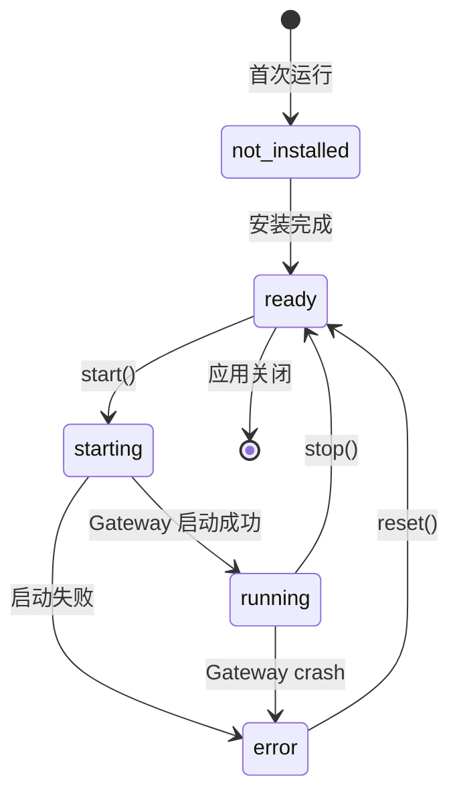

# GucciAI Agent 引擎与 OpenClaw 集成

## 1. 概述

GucciAI 采用 OpenClaw 作为主要 Agent 引擎，通过 Gateway API 进行实时通信。OpenClaw 提供完整的 Agent 运行时能力，包括工具执行、沙箱隔离、持久化记忆等。

### 1.1 架构关系

```
┌─────────────────────────────────────────────────────────────┐
│                     Main Process                             │
│                                                             │
│  ┌─────────────────────────────────────────────────────┐    │
│  │           OpenClaw Engine Manager                    │    │
│  │                                                     │    │
│  │  Status Machine:                                    │    │
│  │  not_installed → ready → starting → running | error │    │
│  │                                                     │    │
│  │  Lifecycle:                                         │    │
│  │  - ensureRunning(): 启动网关                         │    │
│  │  - stop(): 停止网关                                  │    │
│  │  - install(): 安装 runtime                          │    │
│  │  - getStatus(): 查询状态                             │    │
│  └─────────────────────────────────────────────────────┘    │
│                              │                              │
│                              ▼                              │
│  ┌─────────────────────────────────────────────────────┐    │
│  │           OpenClaw Runtime Adapter                   │    │
│  │                                                     │    │
│  │  负责将 Cowork 会话请求转换为 Gateway API 调用        │    │
│  │                                                     │    │
│  │  API:                                               │    │
│  │  - chat.send: 发送对话请求                           │    │
│  │  - chat.history: 获取历史消息                         │    │
│  │  - approval.respond: 响应权限请求                     │    │
│  │  - session.stop: 停止会话                            │    │
│  └─────────────────────────────────────────────────────┘    │
│                              │                              │
│                              │ WebSocket                   │
│                              ▼                              │
├─────────────────────────────────────────────────────────────┤
│                     OpenClaw Runtime                         │
│                   (bundled Gateway)                          │
│                                                             │
│  ┌─────────────────┐  ┌─────────────────┐  ┌─────────────┐  │
│  │ Tool Execution  │  │ Memory System   │  │ Sandbox     │  │
│  │                 │  │                 │  │             │  │
│  │ read_file       │  │ MEMORY.md       │  │ filesystem  │  │
│  │ write_file      │  │ USER.md         │  │ network     │  │
│  │ execute_command │  │ SOUL.md         │  │ process     │  │
│  │ web_search      │  │ memory/YYYY/    │  │             │  │
│  │ ...             │  │                 │  │             │  │
│  └─────────────────┘  └─────────────────┘  └─────────────┘  │
└─────────────────────────────────────────────────────────────┘
```

### 1.2 版本管理

OpenClaw 版本在 `package.json` 中声明：

```json
{
  "openclaw": {
    "version": "v2026.6.9",
    "repo": "https://github.com/openclaw/openclaw.git"
  }
}
```

版本管理流程：

| 步骤 | 说明 | 触发时机 |
|------|------|----------|
| **ensure** | 克隆/checkout pinned version | 运行时启动前 |
| **build check** | 检查 runtime-build-info.json | 每次构建前 |
| **build** | pnpm install → build → ui:build → pack | 仅当版本变化 |

## 2. OpenClaw Engine Manager

### 2.1 状态机

**文件**：`src/main/libs/openclawEngineManager.ts`

```typescript
type EnginePhase = 
  | 'not_installed'   // Runtime 未安装
  | 'ready'           // Runtime 已就绪，网关未启动
  | 'starting'        // 网关启动中
  | 'running'         // 网关运行中
  | 'error';          // 网关出错

interface EngineStatus {
  phase: EnginePhase;
  version?: string;       // Runtime 版本
  lastError?: string;     // 错误信息
  lastStartedAt?: number; // 最后启动时间
  gatewayPid?: number;    // 网关进程 PID
}
```

状态转换：



### 2.2 核心方法

```typescript
class OpenClawEngineManager {
  private status: EngineStatus;
  private gatewayProcess: ChildProcess | null;
  
  // 获取状态
  getStatus(): EngineStatus {
    return this.status;
  }
  
  // 确保 OpenClaw 运行（用于 Cowork）
  async ensureRunningForCowork(): Promise<void> {
    if (this.status.phase === 'running') return;
    
    if (this.status.phase === 'not_installed') {
      await this.install();
    }
    
    await this.start();
  }
  
  // 安装 runtime
  async install(): Promise<void> {
    this.emitProgress({ phase: 'downloading', progress: 0 });
    
    // 1. ensure version
    await this.ensureVersion();
    
    // 2. build runtime
    await this.buildRuntime();
    
    // 3. bundle gateway
    await this.bundleGateway();
    
    this.status.phase = 'ready';
    this.emitProgress({ phase: 'complete', progress: 100 });
  }
  
  // 启动网关
  async start(): Promise<void> {
    this.status.phase = 'starting';
    this.emitStatusChange(this.status);
    
    // 1. 启动 gateway 进程
    const gatewayPath = this.getGatewayPath();
    this.gatewayProcess = spawn(gatewayPath, ['--port', '9750'], {
      env: this.buildGatewayEnv(),
    });
    
    // 2. 等待就绪
    await this.waitForGatewayReady();
    
    // 3. 更新状态
    this.status.phase = 'running';
    this.status.gatewayPid = this.gatewayProcess.pid;
    this.status.lastStartedAt = Date.now();
    this.emitStatusChange(this.status);
  }
  
  // 停止网关
  stop(): void {
    if (this.gatewayProcess) {
      this.gatewayProcess.kill();
      this.gatewayProcess = null;
    }
    this.status.phase = 'ready';
    this.emitStatusChange(this.status);
  }
  
  // 构建环境变量
  private buildGatewayEnv(): Record<string, string> {
    const env = { ...process.env };

    return env;
  }
}
```

### 2.3 进度事件

```typescript
interface InstallProgress {
  phase: 'downloading' | 'building' | 'bundling' | 'complete' | 'error';
  progress: number; // 0-100
  message?: string;
}

// 通过 IPC 发送进度
function emitProgress(progress: InstallProgress): void {
  const win = BrowserWindow.getAllWindows()[0];
  if (win) {
    win.webContents.send('openclaw:engine:onProgress', progress);
  }
}
```

## 3. Gateway API

### 3.1 WebSocket 连接

OpenClaw Gateway 通过 WebSocket 提供实时通信：

```typescript
class OpenClawGatewayClient {
  private ws: WebSocket;
  private sessionId: string;
  
  connect(port: number = 9750): void {
    this.ws = new WebSocket(`ws://localhost:${port}`);
    
    this.ws.on('message', (data) => {
      const event = JSON.parse(data);
      this.handleEvent(event);
    });
  }
  
  private handleEvent(event: GatewayEvent): void {
    switch (event.type) {
      case 'chat.delta':
        this.emit('chatDelta', event.payload);
        break;
      case 'chat.final':
        this.emit('chatFinal', event.payload);
        break;
      case 'approval.requested':
        this.emit('approvalRequested', event.payload);
        break;
      case 'error':
        this.emit('error', event.payload);
        break;
    }
  }
}
```

### 3.2 Chat API

```typescript
interface ChatSendRequest {
  sessionKey: string;      // 会话标识
  prompt: string;          // 用户输入
  onDelta: (delta) => void; // 流式回调
  onFinal: (final) => void; // 完成回调
  onError: (error) => void; // 错误回调
}

interface ChatDelta {
  messageId: string;
  content: string;         // 增量文本
  isStreaming: boolean;
}

interface ChatFinal {
  messageId: string;
  content: string;         // 最终文本
  stopReason: string;      // 'tool_use' | 'end_turn' | 'error'
  toolCalls?: ToolCall[];  // 工具调用（如果有）
}

// 发送对话
chat.send(request: ChatSendRequest): void {
  this.ws.send(JSON.stringify({
    type: 'chat.send',
    payload: {
      sessionKey: request.sessionKey,
      prompt: request.prompt,
    },
  }));
  
  // 注册回调
  this.once(`chatDelta:${request.sessionKey}`, request.onDelta);
  this.once(`chatFinal:${request.sessionKey}`, request.onFinal);
  this.once(`error:${request.sessionKey}`, request.onError);
}

// 获取历史
chat.history(sessionKey: string, limit?: number): Promise<ChatHistory> {
  return this.request({
    type: 'chat.history',
    payload: { sessionKey, limit },
  });
}
```

### 3.3 Approval API

```typescript
interface ApprovalRequest {
  id: string;
  toolName: string;
  toolInput: Record<string, unknown>;
  description: string;
}

interface ApprovalResponse {
  requestId: string;
  approved: boolean;
  reason?: string;        // 拒绝理由
}

// 响应权限请求
approval.respond(response: ApprovalResponse): void {
  this.ws.send(JSON.stringify({
    type: 'approval.respond',
    payload: response,
  }));
}
```

### 3.4 Session API

```typescript
// 停止会话
session.stop(sessionKey: string): void {
  this.ws.send(JSON.stringify({
    type: 'session.stop',
    payload: { sessionKey },
  }));
}
```

## 4. Runtime Adapter

### 4.1 核心职责

OpenClawRuntimeAdapter 负责将 Cowork API 转换为 Gateway API：

1. **会话映射**：Cowork sessionId → OpenClaw sessionKey
2. **事件转换**：Gateway events → Cowork stream events
3. **历史对账**：确保本地消息与 Gateway 一致
4. **权限管理**：转换 approval 请求和响应

### 4.2 Session Key 格式

| 类型 | 格式 | 示例 |
|------|------|------|
| GUI Cowork | `agent:main:gucciai:{sessionId}` | `agent:main:gucciai:abc123` |
| IM Managed | `agent:{agentId}:{platform}:{conversationId}` | `agent:bot1:im:private:12345` |
| IM Channel | `agent:{agentId}:{channel}:{accountId}:{peerKind}:{peerId}` | `agent:bot1:im:acc1:direct:user1` |
| Cron | `cron:{jobId}` | `cron:task-001` |

### 4.3 历史对账

Gateway 的 `chat.history` 是消息的权威来源。Adapter 在 turn 完成后进行对账：

```typescript
// src/main/libs/agentEngine/openclawRuntimeAdapter.ts
async reconcileWithHistory(sessionId: string, sessionKey: string): Promise<void> {
  // 1. 调用 chat.history
  const history = await this.gatewayClient.chat.history({
    sessionKey,
    limit: 50,
  });
  
  // 2. 提取权威消息
  const authoritative = this.extractAuthoritative(history);
  
  // 3. 与本地对比
  const local = this.coworkStore.getSessionMessages(sessionId);
  
  if (!this.messagesMatch(local, authoritative)) {
    // 4. 替换本地消息
    this.coworkStore.replaceConversationMessages(sessionId, authoritative);
  }
}
```

## 5. 配置同步

### 5.1 OpenClawConfigSync

**文件**：`src/main/libs/openclawConfigSync.ts`

将 Cowork 配置同步到 OpenClaw 的 `managed.yaml`：

```typescript
interface ManagedConfig {
  session: {
    scope: string;        // 'per-account-channel-peer'
  };
  sandbox: {
    mode: string;         // 'off' | 'non-main' | 'all'
  };
  channels: {
    // IM 平台账号配置（规划中）
    // 待 IM 集成后定义具体平台结构
  };
}

class OpenClawConfigSync {
  // 同步配置
  sync(coworkConfig: CoworkConfig, imConfig: IMConfig): void {
    const managed = this.buildManaged(coworkConfig, imConfig);
    this.writeManagedYaml(managed);
    this.syncEnvToOpenClawEnvFile(imConfig);
  }
  
  // 映射执行模式
  private mapExecutionMode(mode: ExecutionMode): SandboxMode {
    switch (mode) {
      case 'local': return 'off';
      case 'auto': return 'non-main';
      default: return 'off';
    }
  }
  
  // 构建 accounts
  private buildAccounts(platform: string, instances: InstanceConfig[]): Record<string, AccountConfig> {
    const accounts: Record<string, AccountConfig> = {};
    
    for (let idx = 0; idx < instances.length; idx++) {
      const inst = instances[idx];
      if (!inst.enabled || !inst.clientId) continue;
      
      const accountKey = inst.instanceId.slice(0, 8);
      accounts[accountKey] = {
        clientId: inst.clientId,
        clientSecretEnv: this.getSecretEnvKey(platform, idx),
      };
    }
    
    return accounts;
  }
  
  // Secret 环境变量命名
  private getSecretEnvKey(platform: string, index: number): string {
    const prefix = 'GUCCIAI'; // 前缀
    const platformUpper = platform.toUpperCase();
    
    if (index === 0) {
      return `${prefix}_${platformUpper}_CLIENT_SECRET`;
    }
    return `${prefix}_${platformUpper}_CLIENT_SECRET_${index}`;
  }
}
```

### 5.2 环境变量文件

Secrets 通过 `.env` 文件传递给 Gateway：

```
# .env (OpenClaw runtime)
# IM 平台凭证将在集成后配置
# ...
```

## 6. 运行时打包

### 6.1 打包流程

桌面打包时会自动构建 OpenClaw runtime：

```
npm run dist:win
  │
  ├── npm run openclaw:ensure (checkout pinned version)
  │
  ├── npm run openclaw:patch (apply patches)
  │
  ├── npm run openclaw:runtime:win-x64
  │     │
  │     ├── pnpm install
  │     ├── pnpm run build
  │     ├── pnpm run ui:build
  │     └── pack to asar
  │
  ├── npm run openclaw:bundle
  │     │
  │     ├── bundle gateway.js
  │     └── bundle plugin configs
  │
  ├── npm run openclaw:plugins
  │     │
  │     └── install required plugins
  │
  ├── npm run openclaw:extensions:local
  │     │
  │     └── sync local extensions
  │
  ├── npm run openclaw:precompile
  │     │
  │     └── precompile TypeScript extensions
  │
  └── npm run openclaw:prune
        │
        └── prune unnecessary files
```

### 6.2 Runtime 位置

打包后的 runtime 放置在应用资源目录：

| 平台 | 位置 |
|------|------|
| macOS | `Contents/Resources/cfmind.asar` |
| Windows | `resources/cfmind.asar` |
| Linux | `resources/cfmind.asar` |

### 6.3 缓存机制

通过 `runtime-build-info.json` 记录已构建版本：

```json
{
  "version": "v2026.6.9",
  "platform": "win-x64",
  "builtAt": 1712851200000,
  "outputPath": "release/openclaw-runtime-win-x64.asar"
}
```


## 7. 环境变量

### 7.1 OpenClaw 相关

| 变量 | 说明 | 默认值 |
|------|------|--------|
| `OPENCLAW_FORCE_INSTALL` | 强制重新安装预构建运行时 | — |


## 8. 关键文件清单

| 文件 | 职责 |
|------|------|
| `src/main/libs/openclawEngineManager.ts` | 运行时生命周期 |
| `src/main/libs/agentEngine/openclawRuntimeAdapter.ts` | Gateway 适配 |
| `src/main/libs/openclawConfigSync.ts` | 配置同步 |
| `src/main/libs/openclawChannelSessionSync.ts` | Channel 会话同步 |
| `scripts/bundle-openclaw-gateway.cjs` | Gateway 打包 |
| `scripts/sync-openclaw-runtime-current.cjs` | 同步当前 runtime |
| `scripts/sync-local-openclaw-extensions.cjs` | 同步本地扩展 |
| `scripts/precompile-openclaw-extensions.cjs` | 预编译扩展 |
| `scripts/prune-openclaw-runtime.cjs` | 清理 runtime |