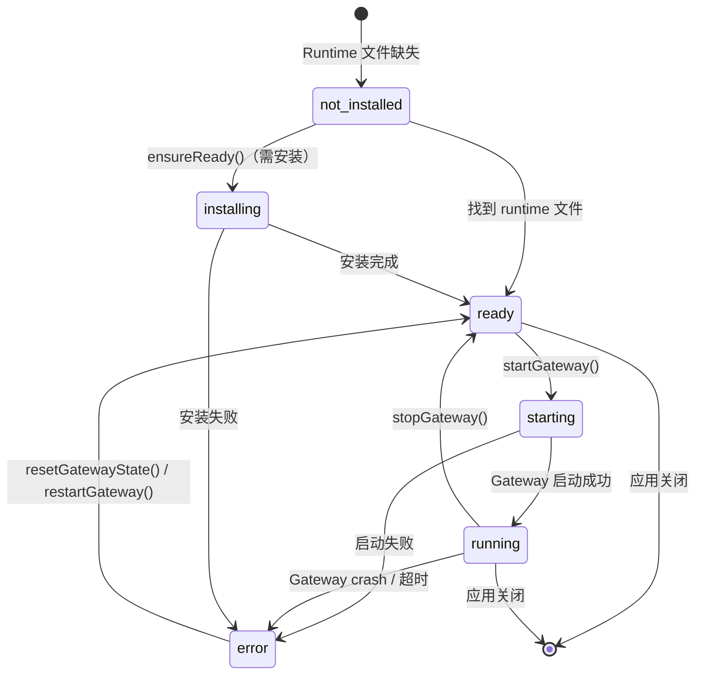

# JustDo Agent 引擎与 OpenClaw 集成

## 1. 概述

JustDo 采用 OpenClaw 作为唯一的 Agent 引擎（v2026.6.9），通过 Gateway WebSocket API 进行实时通信。OpenClaw 提供完整的 Agent 运行时能力，包括工具执行、沙箱隔离、持久化记忆等。JustDo 作为纯薄前端，所有 Agent 逻辑由 OpenClaw Gateway 全权负责。

### 1.1 架构关系

```
┌─────────────────────────────────────────────────────────────────────┐
│                        Main Process                                 │
│                                                                     │
│  ┌─────────────────────────────────────────────────────────────┐    │
│  │                  OpenClaw Engine Manager                      │    │
│  │                                                              │    │
│  │  Status Machine:                                             │    │
│  │  not_installed → installing → ready → starting → running     │    │
│  │                                              ↓                │    │
│  │                                            error              │    │
│  │                                                              │    │
│  │  Lifecycle:                                                  │    │
│  │  - ensureReady(): 确保 runtime 就绪                          │    │
│  │  - startGateway(): 启动 Gateway 进程                         │    │
│  │  - stopGateway(): 停止 Gateway 进程                          │    │
│  │  - getStatus(): 查询状态                                     │    │
│  └─────────────────────────────────────────────────────────────┘    │
│                              │                                      │
│                              ▼                                      │
│  ┌─────────────────────────────────────────────────────────────┐    │
│  │              OpenClaw Runtime Adapter                         │    │
│  │                                                              │    │
│  │  Gateway 客户端 + 事件映射层                                  │    │
│  │  将 Cowork 会话请求转换为 Gateway RPC 调用                    │    │
│  │                                                              │    │
│  │  RPC 方法:                                                   │    │
│  │  - chat.send: 发送对话请求                                   │    │
│  │  - chat.history: 获取权威历史消息                              │    │
│  │  - chat.abort: 取消运行                                      │    │
│  │  - exec.approval.resolve: 响应权限请求                        │    │
│  │  - sessions.subscribe: 注册会话事件监听                       │    │
│  │  - sessions.list: 列出活跃会话                               │    │
│  │  - sessions.delete: 删除会话                                 │    │
│  └─────────────────────────────────────────────────────────────┘    │
│                              │                                      │
│                              │ WebSocket ws://localhost:{port}      │
│                              ▼                                      │
├─────────────────────────────────────────────────────────────────────┤
│                     OpenClaw Runtime                                 │
│             (vendor/openclaw-runtime/current/)                        │
│                   预构建 npm 包（预编译）                             │
│                                                                     │
│  ┌─────────────────┐  ┌─────────────────┐  ┌─────────────────────┐  │
│  │ Tool Execution  │  │ Memory System   │  │ Subagent Manager    │  │
│  │                 │  │                 │  │                     │  │
│  │ read_file       │  │ MEMORY.md       │  │ subagent dispatch   │  │
│  │ write_file      │  │ USER.md         │  │ lifecycle mgmt      │  │
│  │ execute_command │  │ SOUL.md         │  │                     │  │
│  │ web_search      │  │ memory/YYYY/    │  │                     │  │
│  │ ...             │  │                 │  │                     │  │
│  └─────────────────┘  └─────────────────┘  └─────────────────────┘  │
└─────────────────────────────────────────────────────────────────────┘
```

### 1.2 版本管理

OpenClaw 版本在 `package.json` 的 `openclaw` 字段中声明：

```json
{
  "openclaw": {
    "version": "v2026.6.9",
    "repo": "https://github.com/openclaw/openclaw.git",
    "plugins": []
  }
}
```

Runtime 是预构建的 npm 包，直接从 npm registry 下载（非从 git clone + build）。

## 2. OpenClaw Engine Manager

### 2.1 状态机

**文件**：`src/main/libs/openclaw/openclawEngineManager.ts`

```typescript
type OpenClawEnginePhase = 
  | 'not_installed'   // Runtime 未安装/未找到
  | 'installing'      // 安装中
  | 'ready'           // Runtime 已就绪，Gateway 未启动
  | 'starting'        // Gateway 启动中
  | 'running'         // Gateway 运行中
  | 'error';          // Gateway 出错

interface OpenClawEngineStatus {
  phase: OpenClawEnginePhase;
  version: string | null;
  progressPercent?: number;
  message?: string;
  canRetry: boolean;
}
```

状态转换：



### 2.2 核心方法

```typescript
class OpenClawEngineManager extends EventEmitter {
  private status: OpenClawEngineStatus;
  private gatewayProcess: UtilityProcess | ChildProcess | null;
  private gatewayPort: number | null;

  /** Runtime 查找路径：
   *  - 开发模式：vendor/openclaw-runtime/current/
   *  - 打包模式：resources/cfmind/
   */
  private resolveRuntimeMetadata(): RuntimeMetadata { ... }

  /** 确保 runtime 可用（不启动 Gateway） */
  async ensureReady(options?: { forceReinstall?: boolean }): Promise<OpenClawEngineStatus> {
    const runtime = this.resolveRuntimeMetadata();
    if (!runtime.root) {
      this.setStatus({ phase: 'not_installed', ... });
      return this.getStatus();
    }
    // 同步本地扩展
    syncLocalOpenClawExtensionsIntoRuntime(runtime.root);
    this.setStatus({ phase: 'ready', version: this.desiredVersion, ... });
    return this.getStatus();
  }

  /** 启动 Gateway 进程 */
  async startGateway(): Promise<OpenClawEngineStatus> {
    this.setStatus({ phase: 'starting', ... });
    const runtime = this.resolveRuntimeMetadata();
    // 1. 确保 bare entry 文件从 .asar 解压
    this.ensureBareEntryFiles(runtime.root);
    // 2. 生成 Gateway token
    const token = this.ensureGatewayToken();
    // 3. 扫描可用端口
    const port = await this.resolveGatewayPort();
    // 4. 启动 Gateway 进程（UtilityProcess.fork）
    this.gatewayProcess = utilityProcess.fork(openclawEntry, [], {
      env: this.buildGatewayEnv(token, port),
      execArgv: ['--import', '...'],
    });
    // 5. 等待就绪（轮询端口可达 + HTTP 健康检查）
    await this.waitForGatewayReady(port);
    this.setStatus({ phase: 'running', ... });
    return this.getStatus();
  }

  /** 停止 Gateway 进程 */
  stopGateway(): Promise<void> { ... }

  /** 获取连接信息 */
  getGatewayConnectionInfo(): OpenClawGatewayConnectionInfo {
    return {
      version: runtime.version,
      port: this.gatewayPort,
      token: this.readGatewayToken(),
      url: `ws://127.0.0.1:${this.gatewayPort}`,
      clientEntryPath: this.resolveGatewayClientEntry(runtime.root),
    };
  }
}
```

### 2.3 环境变量

在启动 Gateway 时注入的环境变量：

```typescript
private buildGatewayEnv(token: string, port: number): Record<string, string> {
  return {
    ...process.env,
    OPENCLAW_GATEWAY_TOKEN: token,
    OPENCLAW_GATEWAY_PORT: String(port),
    JUSTDO_NODE_RUNTIME_PATH: electronNodeRuntimePath,
    JUSTDO_NPM_BIN_DIR: npmBinDir,
    // 注入 IM secrets
    ...this.secretEnvVars,
  };
}
```

## 3. Gateway API

### 3.1 WebSocket 连接

OpenClaw Gateway 通过 WebSocket 提供实时通信，连接端口通过端口扫描自动确定（默认扫描端口范围，默认起始 42871）。

连接握手协议：
1. WebSocket 打开
2. 等待服务端发送 `connect.challenge` 事件（750ms 超时）
3. 发送 `connect` 请求（携带 auth token）
4. 收到 `hello-ok` 响应

### 3.2 事件类型

Gateway 通过 WebSocket 推送以下事件：

| 事件 | 载荷 | 说明 |
|------|------|------|
| `tick` | 无 | 心跳 |
| `chat` | `{ runId?, sessionKey, state: 'delta'|'final'|'aborted'|'error', message? }` | 聊天流事件 |
| `agent` | `{ runId?, sessionKey?, stream?, data?, tool?, call? }` | 代理事件（推理、工具流） |
| `exec.approval.requested` | `{ id?, request: { command?, ... } }` | 工具执行权限请求 |
| `exec.approval.resolved` | `{ id? }` | 权限请求已处理 |
| `session.tool` | 同 `agent` | 会话工具流事件 |
| `session.message` | 消息内容 | 会话级系统消息 |
| `sessions.changed` | 会话列表变更 | 跨进程会话通知 |

### 3.3 RPC 方法

通过 WebSocket 请求-响应模式调用：

```typescript
interface GatewayRequest {
  type: 'req';
  id: string;
  method: string;
  params: unknown;
}

interface GatewayResponse {
  type: 'res';
  id: string;
  ok: boolean;
  payload?: unknown;
  error?: { code: string; message: string; retryable?: boolean };
}
```

#### Chat API

| 方法 | 参数 | 说明 |
|------|------|------|
| `chat.send` | `{ sessionKey, message, deliver?, idempotencyKey?, attachments? }` | 发送用户消息 |
| `chat.history` | `{ sessionKey, limit? }` | 获取权威历史消息 |
| `chat.startup` | `{ sessionKey }` | 加载会话初始状态 |
| `chat.abort` | `{ sessionKey, runId }` | 取消当前运行 |
| `chat.list` | — | 列出活跃聊天 |

#### Sessions API

| 方法 | 参数 | 说明 |
|------|------|------|
| `sessions.subscribe` | `{}` | 注册会话事件监听 |
| `sessions.list` | `{ activeMinutes?, limit? }` | 列出活跃会话 |
| `sessions.delete` | `{ key, deleteTranscript? }` | 删除会话 |

#### Approval API

| 方法 | 参数 | 说明 |
|------|------|------|
| `exec.approval.resolve` | `{ id, decision }` | 响应权限请求 |

#### Cron API

| 方法 | 说明 |
|------|------|
| `cron.add` | 添加定时任务 |
| `cron.update` | 更新定时任务 |
| `cron.remove` | 删除定时任务 |
| `cron.list` | 列出定时任务 |
| `cron.run` | 手动触发定时任务 |
| `cron.runs` | 查看任务运行历史 |

## 4. Runtime Adapter

### 4.1 OpenClawRuntimeAdapter

**文件**：`src/main/libs/agentEngine/openclawRuntimeAdapter.ts`

核心职责：
1. **Gateway 客户端管理** — 管理 GatewayClient 生命周期和重连
2. **会话映射** — Cowork sessionId → OpenClaw sessionKey
3. **事件转换** — Gateway 事件 → Cowork 事件
4. **历史对账** — 调用 HistoryReconciler 确保本地 UI 缓存与 Gateway 一致
5. **权限管理** — 转换 approval 请求和响应
6. **子代理路由** — 通过 `subagentGateway.ts` 获取子代理状态

Adapter 已不再是厚重的编排层 —— 它只是 Gateway 的轻量客户端 + 事件映射器。

### 4.2 Session Key 格式

| 类型 | 格式 | 示例 |
|------|------|------|
| GUI Cowork | `agent:main:justdo:{sessionId}` | `agent:main:justdo:abc123` |
| IM Managed | `agent:{agentId}:{platform}:{conversationId}` | `agent:bot1:im:private:12345` |
| IM Channel | `agent:{agentId}:{channel}:{accountId}:{peerKind}:{peerId}` | `agent:bot1:im:acc1:direct:user1` |
| Cron | `cron:{jobId}` | `cron:task-001` |

### 4.3 子代理网关

**文件**：`src/main/libs/agentEngine/openclaw/subagentGateway.ts`

Gateway 负责子代理的完整生命周期。JustDo 仅通过 Gateway 查询子代理状态：

```typescript
export type SubagentStatus = 'running' | 'done' | 'failed' | 'killed' | 'timeout';

export interface GatewaySubagent {
  id: string;
  sessionKey: string;
  label: string;
  status: SubagentStatus;
  task?: string;
  model?: string;
  startedAt?: number;
  endedAt?: number;
  runtimeMs?: number;
  totalTokens?: number;
}

// 查询子代理
export async function listGatewaySubagents(
  client: GatewayClientLike,
  sessionKey: string,
): Promise<GatewaySubagent[]> { ... }
```

### 4.4 历史对账

**文件**：`src/main/libs/agentEngine/history/historyReconciler.ts`

Gateway 的 `chat.history` 是消息的权威来源。Adapter 在每次 turn 完成后触发对账：

```typescript
class HistoryReconciler {
  async reconcileWithHistory(
    sessionId: string,
    sessionKey: string,
    options?: { finalSync?: boolean },
  ): Promise<void> {
    // 1. 调用 chat.history 获取权威消息
    const history = await this.gatewayClient.request('chat.history', {
      sessionKey,
      limit: FINAL_HISTORY_SYNC_LIMIT,
    });

    // 2. 提取权威消息条目
    const authoritative = extractGatewayHistoryEntries(history.messages);

    // 3. 与本地 UI 缓存对比
    const local = this.coworkStore.getSessionMessages(sessionId);

    // 4. 不一致则替换
    if (!this.messagesMatch(local, authoritative)) {
      this.coworkStore.replaceConversationMessages(sessionId, authoritative);
    }

    // 5. 更新 token usage 等
    this.syncTokenUsage(sessionId, history.messages);
  }
}
```

## 5. 配置同步

### 5.1 OpenClawConfigSync

**文件**：`src/main/libs/openclaw/openclawConfigSync.ts`

将 JustDo 配置同步到 OpenClaw 的 `managed.yaml`：

```typescript
interface ManagedConfig {
  session: { scope: string };
  sandbox: { mode: string };
  agents: AgentEntry[];
  channels: { [platform: string]: { accounts: AccountConfig[] } };
  mcpTools?: McpToolConfig[];
  controlUI?: { readOnlyMessage?: string };
}

class OpenClawConfigSync {
  sync(coworkConfig: CoworkConfig, agents: Agent[]): void {
    const managed = this.buildManagedConfig(coworkConfig, agents);
    this.writeManagedYaml(managed);
    this.syncEnvToOpenClawEnvFile(agents);
  }

  mapExecutionMode(mode: ExecutionMode): string {
    switch (mode) {
      case 'local': return 'off';
      case 'auto': return 'non-main';
      default: return 'off';
    }
  }

  buildManagedConfig(config: CoworkConfig, agents: Agent[]): ManagedConfig {
    return {
      session: { scope: 'per-account-channel-peer' },
      sandbox: { mode: this.mapExecutionMode(config.executionMode) },
      agents: buildManagedAgentEntries(agents),
      channels: this.buildChannels(agents),
    };
  }
}
```

### 5.2 环境变量文件

Secrets 通过 `.env` 文件传递给 Gateway，环境变量命名规则：

```text
JUSTDO_{PLATFORM}_CLIENT_SECRET
JUSTDO_{PLATFORM}_CLIENT_SECRET_{INDEX}
```

## 6. 运行时打包

### 6.1 安装流程（预构建 npm 包）

Runtime 是预构建的 npm 包，从 npm registry 下载，无需本地编译。完整流程：

```
npm run openclaw:runtime:win-x64
  │
  ├── [1/7]  scripts/install-openclaw-runtime.cjs win-x64
  │          npm pack openclaw@{version}
  │          tar xf (extract tarball)
  │          patch facade-runtime (esbuild bundling 兼容)
  │          patch OpenClaw dist (JustDo 集成)
  │          process skills
  │          install production dependencies
  │          write runtime-build-info.json
  │
  ├── [2/7]  scripts/sync-openclaw-runtime-current.cjs win-x64
  │          symlink/junction target → vendor/openclaw-runtime/current
  │          extract entry files from gateway.asar (for ESM support)
  │
  ├── [3/7]  npm run openclaw:bundle
  │          scripts/bundle-openclaw-gateway.cjs
  │          bundle gateway 配置文件
  │
  ├── [4/7]  npm run openclaw:plugins
  │          scripts/ensure-openclaw-plugins.cjs
  │          安装必需插件
  │
  ├── [5/7]  npm run openclaw:extensions:local
  │          scripts/sync-local-openclaw-extensions.cjs
  │          同步本地扩展
  │
  ├── [6/7]  npm run openclaw:precompile
  │          scripts/precompile-openclaw-extensions.cjs
  │          预编译 TypeScript 扩展
  │
  └── [7/7]  npm run openclaw:prune
             scripts/prune-openclaw-runtime.cjs
             清理不必要文件
```

### 6.2 开发模式

开发模式下 runtime 位于：

```
vendor/openclaw-runtime/current/   ← junction/symlink 指向具体平台目录
vendor/openclaw-runtime/win-x64/  ← 具体平台目录
vendor/openclaw-runtime/mac-arm64/
vendor/openclaw-runtime/linux-x64/
```

启动命令：

```bash
npm run electron:dev:openclaw
# 等同于:
# npm run openclaw:runtime:host && npm run electron:dev
```

### 6.3 打包后位置

打包后的 runtime 放置在应用资源目录：

| 平台 | 位置 |
|------|------|
| macOS | `Contents/Resources/cfmind/` |
| Windows | `resources/cfmind/` |
| Linux | `resources/cfmind/` |

### 6.4 缓存机制

通过 `runtime-build-info.json` 记录已安装版本，避免重复下载：

```json
{
  "openclawVersion": "v2026.6.9",
  "npmVersion": "2026.6.9",
  "targetId": "win-x64",
  "installedAt": 1712851200000,
  "platform": "win32",
  "arch": "x64",
  "nodeVersion": "24.x"
}
```

设置 `OPENCLAW_FORCE_INSTALL=1` 环境变量可强制重新安装。

## 7. 环境变量

### 7.1 OpenClaw 相关

| 变量 | 说明 | 默认值 |
|------|------|--------|
| `OPENCLAW_FORCE_INSTALL` | 强制重新安装预构建运行时 | — |
| `OPENCLAW_GATEWAY_TOKEN` | Gateway 认证令牌 | 自动生成 |
| `OPENCLAW_GATEWAY_PORT` | Gateway 监听端口 | 42871（自动扫描） |
| `JUSTDO_NODE_RUNTIME_PATH` | Electron Node.js 运行时路径 | 自动检测 |
| `JUSTDO_NPM_BIN_DIR` | npm 二进制目录 | 自动检测 |

### 7.2 IM 集成

| 变量 | 说明 |
|------|------|
| `JUSTDO_INTERCOM_CLIENT_SECRET` | Intercom 客户端密钥 |
| `JUSTDO_DISCORD_CLIENT_SECRET` | Discord 客户端密钥 |

## 8. 关键文件清单

### 引擎管理

| 文件 | 职责 |
|------|------|
| `src/main/libs/openclaw/openclawEngineManager.ts` | Gateway 进程生命周期管理 |
| `src/main/libs/agentEngine/openclawRuntimeAdapter.ts` | Gateway 客户端 + 事件映射 |
| `src/main/libs/agentEngine/coworkEngineRouter.ts` | 引擎路由层（透传委托） |
| `src/main/libs/agentEngine/gateway/types.ts` | Gateway 类型定义 |
| `src/main/libs/agentEngine/utils/gatewayHelpers.ts` | Gateway 辅助函数 |

### 历史与子代理

| 文件 | 职责 |
|------|------|
| `src/main/libs/agentEngine/history/historyReconciler.ts` | 历史对账（Gateway 权威 → UI 缓存） |
| `src/main/libs/agentEngine/openclaw/subagentGateway.ts` | 子代理状态查询 |
| `src/main/libs/agentEngine/openclaw/webchatToolStream.ts` | Webchat 工具流同步 |
| `src/main/libs/openclaw/openclawHistory.ts` | Gateway 历史条目提取 |

### 配置

| 文件 | 职责 |
|------|------|
| `src/main/libs/openclaw/openclawConfigSync.ts` | 配置同步到 managed.yaml |
| `src/main/libs/openclaw/openclawChannelSessionSync.ts` | Channel 会话同步 |
| `src/main/libs/openclaw/openclawAgentModels.ts` | Agent 模型配置解析 |
| `src/main/libs/openclaw/openclawLocalExtensions.ts` | 本地扩展同步 |

### 打包脚本

| 文件 | 职责 |
|------|------|
| `scripts/install-openclaw-runtime.cjs` | 下载预构建 npm 包 |
| `scripts/sync-openclaw-runtime-current.cjs` | 同步 current 目录 |
| `scripts/patch-openclaw-runtime.cjs` | 打补丁（JustDo 集成） |
| `scripts/bundle-openclaw-gateway.cjs` | 打包 Gateway 配置 |
| `scripts/ensure-openclaw-plugins.cjs` | 安装必需插件 |
| `scripts/sync-local-openclaw-extensions.cjs` | 同步本地扩展 |
| `scripts/precompile-openclaw-extensions.cjs` | 预编译扩展 |
| `scripts/prune-openclaw-runtime.cjs` | 清理 runtime |
| `scripts/pack-openclaw-tar.cjs` | 打包 tar 存档 |
| `scripts/openclaw-runtime-host.cjs` | 开发模式 runtime host |

---

> **注意**：此文档反映 JustDo v2026.7.1 架构。当前 OpenClaw 版本为 v2026.6.9。Runtime 从 npm registry 下载预构建包，不再从 git 源码构建。
