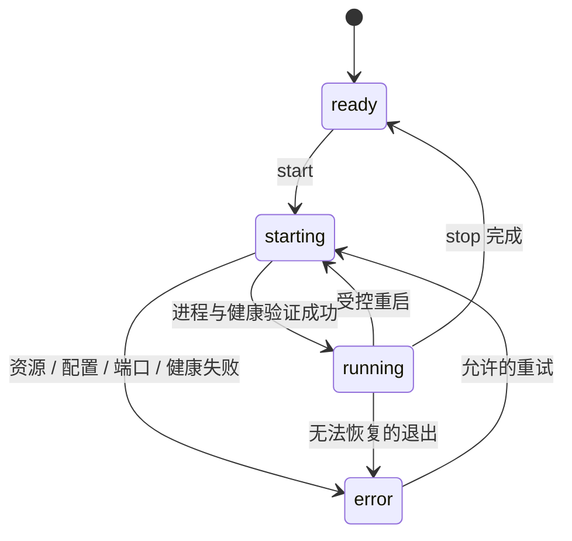
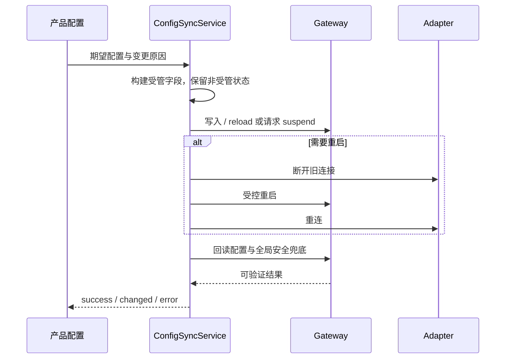

# 执行引擎：配置、准入与 Gateway 恢复

当前 Cowork 执行引擎是 OpenClaw。Router 提供稳定产品接口，Adapter 隔离原生 wire 与生命周期，Manager 托管运行时进程。本文按当前 v2026.9.2 集成组织，运行时补丁清单只维护在[版本目录](../../scripts/patches/v2026.9.2/README.md)。

## 1. 三层控制各管什么

| 层                           | 所有状态                                               | 主要入口                     |
| ---------------------------- | ------------------------------------------------------ | ---------------------------- |
| Router / CoworkEngineService | 产品会话到执行适配器的路由、停止与运行汇总             | `src/main/engine/cowork/`    |
| OpenClawRuntimeAdapter       | 连接、原生身份映射、交互、产品事件、Goal 协调          | `src/main/engine/openclaw/`  |
| OpenClawEngineManager        | runtime 路径、进程 generation、端口、token、启动和重启 | `src/main/openclaw/runtime/` |

Adapter 入口保留生命周期及状态，runtimeGatewayConnection、runtimeGatewayEvents、runtimeHistory、runtimePlanInteractions、runtimeGoalOperations、runtimeSessionStatus 处理各领域操作。它们通过显式实时上下文访问入口状态，不复制控制器状态，更不保存 transcript。

## 2. 从源码到可启动运行时

平台构建从锁定 pristine npm 产物开始：安装及校验来源 → 当前精确补丁 → 同步 current → bundle → 官方插件 → 产品资源 → Extension 预编译 → prune。运行时与应用自身 node_modules 是两套依赖集合。

开发路径和安装包资源路径不同，由 Manager 解析。Windows 命令通过 Electron-safe Node/npm runner 及 MinGit/Python 资源执行，不能把 Electron GUI 当通用 node。bundled Skills、Hooks、Plugins 使用显式运行时目录，不依赖 bundle 中的 import.meta.url 猜源码位置。

冻结 manifest 把补丁、helper、source lock 和构建 recipe 绑定在一起。同版本输入变化也可能拒绝旧产物。历史或部分补丁标记不得就地迁移；从 pristine 包重建，见[开发指南](../development.md)。

## 3. 启动与重启状态

Manager 对外 phase 为 ready、starting、running、error；canRetry 与 message 用于产品反馈。它们不是单个 Agent run 的状态。

```mermaid
stateDiagram-v2
  [*] --> ready
  ready --> starting: start
  starting --> running: 进程与健康验证成功
  starting --> error: 资源 / 配置 / 端口 / 健康失败
  running --> starting: 受控重启
  running --> error: 无法恢复的退出
  error --> starting: 允许的重试
  running --> ready: stop 完成
```

启动使用有界健康轮询，当前 boot timeout 为 300 秒，同进程重启等待上限 60 秒；异常重启最多 5 次并递增退避。调用者应消费状态，不自行启动第二个 Gateway。端口选择限定 loopback，保存端口还需校验范围与占用。

进程 generation 与连接 generation 用于淘汰旧退出通知、重连结果和事件。唤醒或断线后建立新连接，不允许旧 socket 的终态更新新运行。Manager 的进程就绪只代表 Gateway 服务可用，模型认证与 session 权限还有独立验证。

## 4. 配置同步是执行准入的一部分

产品配置来自 app_config、cowork_config、agents、MCP/Hook Store、Extension 开关与受管文件。ConfigSync 构建原生投影，ConfigSyncService 在串行 mutation 中应用并验证。

```mermaid
sequenceDiagram
  participant Product as 产品配置
  participant Sync as ConfigSyncService
  participant G as Gateway
  participant A as Adapter
  Product->>Sync: 期望配置与变更原因
  Sync->>Sync: 构建受管字段，保留非受管状态
  Sync->>G: 写入 / reload 或请求 suspend
  alt 需要重启
    Sync->>A: 断开旧连接
    Sync->>G: 受控重启
    Sync->>A: 重连
  end
  Sync->>G: 回读配置与全局安全兜底
  G-->>Sync: 可验证结果
  Sync-->>Product: success / changed / error
```

不能将“文件已写”当成“配置已生效”。可选 agent-team、stt-local-cli 的用户显式 disable 保留；受保护运行时服务不能被普通开关移除。非 MCP mutation 可发现原生新增 MCP，但产品删除或改名后的同步不能重新导入尚未改写的旧配置。

全局 exec/fs 使用 restricted fallback。会话权限走单独 coordinator，以原生 sessions.create 写入并核对 permissionMode/sessionRoot。失败时不发送，不能用全局 full 兜底“修好”单个会话。

## 5. 模型与凭据进入执行的方式

模型引用使用限定 provider/model，准备时验证模型目录、当前选择和认证状态。main 的会话默认来自应用设置；非 main 助手可配置独立模型。在线语音、图像和视频配置按能力隔离，不隐式借用语言模型凭据。

自定义 provider 的敏感值投影到受限权限文件，原生配置用 file SecretRef。内置模型从 user_info 中的 mtoken 换取短期 JWT，校验账号与有效期，原生只看到 exec SecretRef；SQLite builtin apiKey 保持为空。轮换触发 secrets.reload，logout/到期停止相关访问并清理派生快照。

凭据解析成功与服务端 Team 授权成功也不同。模型发现、连接测试和真正请求的错误需分别报告。二进制包装不等于抵御同用户逆向的密钥保险库，详细链路见[认证专题](../features/authentication-builtin-model-lifecycle.md)。

## 6. 发送、原生事件与产品回执

Adapter 接收产品会话身份，准备原生 session、模型和权限，再提交 chat 请求并绑定原生 run。用户后续直接聊天发送也需要先完成同样的产品准备。

原生 WS 中的文本流由 Renderer 消费；Adapter 只将运行状态、交互、审批、Goal 和会话变化映射为产品事件。wire validator 固定到 v2026.9.2，未知或不合法字段不能在各调用方随意猜测。

网络超时可能发生在原生接收之后。run receipt 需要保留未知状态并查询原生事实；无条件重发将造成重复工具副作用。工具错误不必然是运行终态，late terminal 也不能结束新的 generation。

## 7. Goal、Plan 与子任务不重造执行器

Goal coordinator 在原生目标仍 active 时安排续跑，保存产品 phase、次数和等待状态。六种原生 Goal status 原样保留。用户操作使用 goalId fence，停止 latch 和等待交互阻止后台抢跑。

Plan-mode 通过原生 session extension、turn hook、工具和 scoped RPC 实现。Main 持久化计划文件及 handoff，批准后用原生 reset 建立实施上下文；这是产品交接，不是另一套原生恢复状态机。

子任务查询使用 tasks.list/get 和 task event。原生负责 admission、队列、required-child join 与完成通知；Main 合并状态用于父会话展示，不通过查询工具循环代替 task ledger。平级协作的发送也交给原生 sessions_send，产品只负责任务范围和回执。

## 8. 重启的两种边界

同一 Electron 进程内重启 Gateway，保留稳定 app-start 身份，使用原生 durable recovery。完整应用重新启动，通用 app-start boundary 终止上一宿主实例遗留的活动 session/task，避免旧工作在用户不知情时自动继续。

产品恢复再分别核对：session/runtime、run receipt、Goal、计划 awaitingReview、待答问题和协作投递。恢复待审核侧栏不意味着重放已批准工具；queued 正文不存在也不能从投递元数据伪造消息。

## 9. 网络与日志

Gateway 环境由 Manager 按 generation 构造，包含系统 CA、依赖工具与受控出站代理。仅显式 opt-in 的 one-shot CLI 使用该代理环境；例如 memory index 与普通命令不能因全局 env 污染意外改变网络行为。

embedding host 关闭 Bonjour、shell snapshot、自重生和非产品 channel；不要开启没有配套工具资源的全局 offline 假设。摘要日志会压缩高频消息，完整事件诊断必须对照原生 JSON 日志，见[日志排障](../development.md)。

## 10. 分层定位与验证

| 层   | 典型故障                            | 证据                                     |
| ---- | ----------------------------------- | ---------------------------------------- |
| 资源 | 入口或二进制缺失、freeze 不匹配     | runtime manifest、安装/构建输出          |
| 进程 | 端口占用、启动退出、健康超时        | Manager phase 与 Gateway 启动日志        |
| 配置 | 原生回读不一致、suspend/reload 失败 | ConfigSyncService 结果                   |
| 认证 | JWT 过期、模型不可用、Team 拒绝     | 脱敏模型诊断                             |
| 会话 | mode/root 不收敛、身份失效          | session prepare 与原生 describe          |
| 显示 | 原生有事件但 UI 缺失                | controller generation、history reconcile |

回归入口为 Manager/ConfigSyncService 测试、Adapter 各领域测试、wire validator 测试及 `tests/openclaw/runtime/`。版本升级必须验证 pristine contracts 与最终打包产物，不能用旁边的 OpenClaw 开发副本代替。
