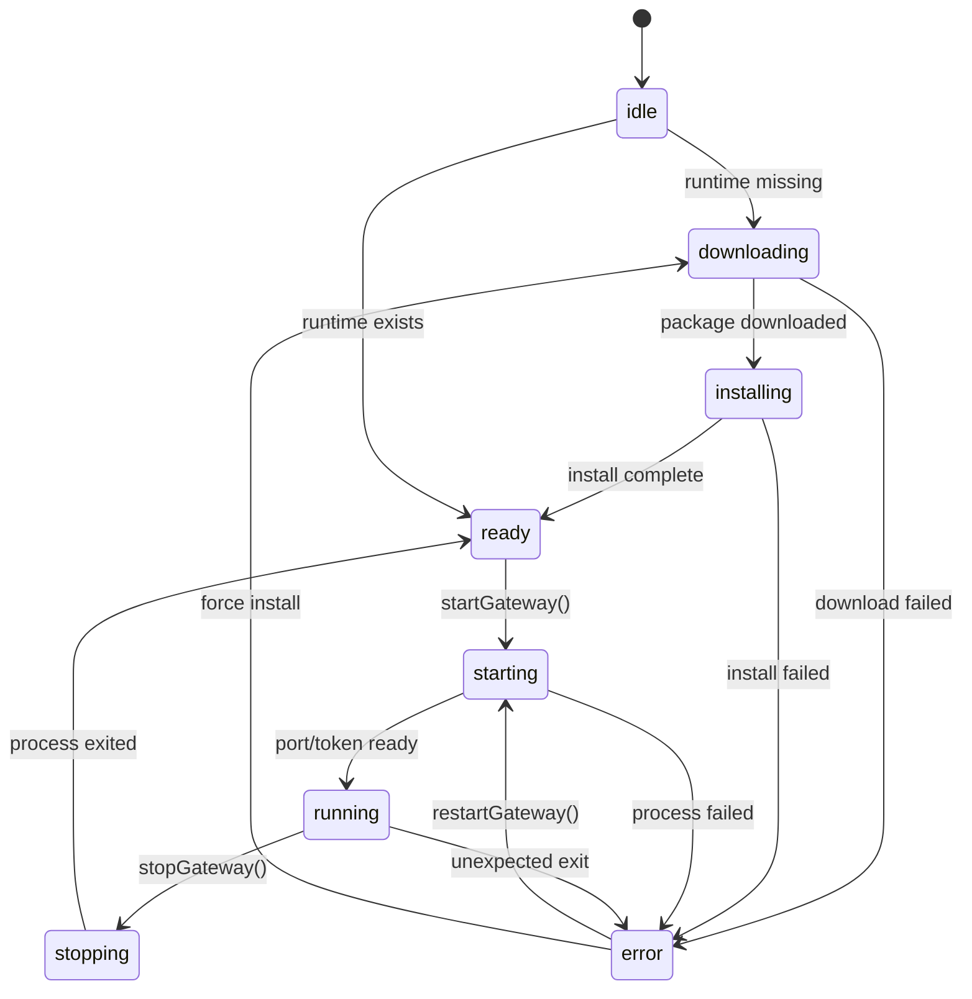
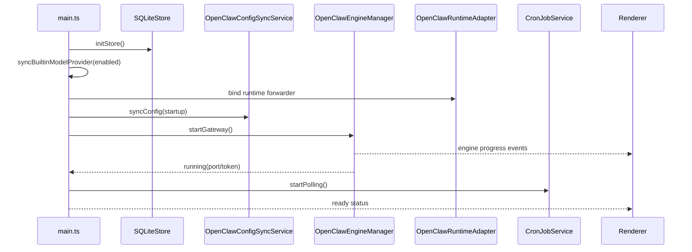
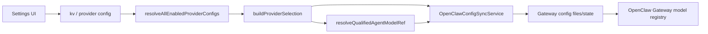

# Agent Engine 与 OpenClaw 集成

JustDo 当前只有一个 AI 执行引擎：OpenClaw Gateway `v2026.6.11`。Main 进程负责启动、停止、配置同步和状态展示，任务执行由 Gateway 完成。

## 关键文件

| 文件 | 作用 |
| --- | --- |
| `src/main/openclaw/runtime/openclawEngineManager.ts` | Gateway runtime 生命周期 |
| `src/main/openclaw/config/openclawConfigSyncService.ts` | 配置同步服务 |
| `src/main/openclaw/config/openclawConfigSync.ts` | provider/MCP/hooks/extension 配置生成 |
| `src/main/engine/openclawRuntimeAdapter.ts` | Cowork 到 Gateway 的 adapter |
| `src/main/engine/gateway/sessionRpc.ts` | Gateway session RPC helper |
| `src/main/cowork/providerApiConfig.ts` | provider 配置解析 |
| `src/main/cowork/builtinModelProvider.ts` | 内置模型 provider 同步 |
| `src/main/openclaw/models/openclawAgentModels.ts` | Agent 模型引用解析 |
| `src/main/ipc/openclaw/engine.ts` | engine IPC handlers |

## Runtime 生命周期


```mermaid
stateDiagram-v2
  [*] --> idle
  idle --> downloading: runtime missing
  downloading --> installing: package downloaded
  installing --> ready: install complete
  idle --> ready: runtime exists
  ready --> starting: startGateway()
  starting --> running: port/token ready
  running --> stopping: stopGateway()
  stopping --> ready: process exited
  downloading --> error: download failed
  installing --> error: install failed
  starting --> error: process failed
  running --> error: unexpected exit
  error --> starting: restartGateway()
  error --> downloading: force install
```

Renderer 可以通过 `openclaw.engine.getStatus()` 和 `openclaw.engine.onProgress()` 展示状态。

## 启动流程

`src/main/main.ts` 中的主流程：

1. 初始化 SQLite。
2. 初始化 provider/config getter，并恢复保存的系统/自定义代理路由。
3. 通过已恢复的代理路由，以显式 `enabled` 访问状态刷新内置模型 provider。
4. 绑定 Cowork runtime forwarder。
5. 同步 OpenClaw config。
6. 启动 OpenClaw Gateway。
7. Gateway ready 后启动定时任务 polling。


```mermaid
sequenceDiagram
  participant Main as main.ts
  participant DB as SQLiteStore
  participant Config as OpenClawConfigSyncService
  participant Manager as OpenClawEngineManager
  participant Adapter as OpenClawRuntimeAdapter
  participant Cron as CronJobService
  participant UI as Renderer

  Main->>DB: initStore()
  Main->>Main: syncBuiltinModelProvider(enabled)
  Main->>Adapter: bind runtime forwarder
  Main->>Config: syncConfig(startup)
  Main->>Manager: startGateway()
  Manager-->>UI: engine progress events
  Manager-->>Main: running(port/token)
  Main->>Cron: startPolling()
  Main-->>UI: ready status
```

## 配置同步

JustDo 本地配置包括：

- provider/model 配置
- Agent 默认模型和技能
- MCP servers
- OpenClaw hooks
- Ask-user extension 配置
- 本地 skill 文件状态

这些配置通过 `OpenClawConfigSyncService` 写入 Gateway 可读取的配置位置。Gateway 正在运行时，某些配置变更会触发 Gateway restart 或 client reconnect。

## 模型引用

Agent 模型引用由 `resolveQualifiedAgentModelRef()` 规范化，避免同名模型在多个 provider 中歧义。Main 启动时会 backfill 空模型并迁移可确定的旧模型引用。

## Runtime 资源

相关 npm scripts：

- `openclaw:runtime:host`
- `openclaw:runtime:win-x64`
- `openclaw:runtime:mac-arm64`
- `openclaw:runtime:linux-x64`
- `openclaw:bundle`
- `openclaw:plugins`
- `openclaw:resources`
- `openclaw:precompile`
- `openclaw:prune`

## 约束

- 不引入第二个 Agent engine。
- 不让 renderer 直接管理 Gateway process。
- Runtime patch 必须小、可审计、可删除，并遵守 `scripts/patches/README.md`。
- OpenClaw 行为差异优先向上游修复，JustDo patch 只作为兼容层。

## 组件分工

### `OpenClawEngineManager`

Engine manager 是 Gateway process 的唯一生命周期 owner。它负责：

- 解析 runtime 路径。
- 检查 runtime 是否可用。
- 下载/安装/同步 runtime。
- 启动 Gateway child process。
- 缓存 port/token/status。
- 停止或重启 Gateway。
- 向 Main 进程发出 status event。

Renderer 只能看到抽象状态，不能拿到 process handle。

### `OpenClawConfigSyncService`

Config sync service 把 JustDo 本地配置转换为 Gateway 可读配置。它的输入来自多个 store/service：

- Cowork/Agent store。
- Provider API config。
- MCP store。
- Hook store。
- Extension ask-user config。
- Gateway runtime manager。

同步时要考虑 Gateway 是否正在运行：

- 启动前同步：直接写配置。
- 运行中同步：判断是否需要 restart/reconnect。
- 有活跃 workload：避免无提示打断正在执行的会话。

### `OpenClawRuntimeAdapter`

Adapter 是 Cowork domain 与 Gateway domain 的边界。它负责把 JustDo 的 session、agent、attachment、stream 概念映射到 Gateway 请求和事件。

Adapter 不应该变成大而全 service。新增 Gateway API 时优先：

1. 放到 `src/main/openclaw/<domain>/` 的专用 helper/service。
2. Adapter 只调用 helper。
3. Renderer 通过已有 Cowork/OpenClaw IPC 获取结果。

## Gateway Connection

Gateway connection info 包含 port 和 token。Main 持有 token，Renderer 需要连接 chat websocket 时通过受控 IPC 获取必要信息。

```text
OpenClawEngineManager
  -> getGatewayPort()
  -> getGatewayToken()
  -> GatewayClient connects ws://127.0.0.1:{port}
```

代理策略会把 Gateway localhost 端口加入 bypass，避免系统代理影响本地 websocket/RPC。

## Provider / Model Flow


```mermaid
flowchart LR
  Settings["Settings UI"] --> Store["kv / provider config"]
  Store --> Resolve["resolveAllEnabledProviderConfigs"]
  Resolve --> Selection["buildProviderSelection"]
  Selection --> AgentRefs["resolveQualifiedAgentModelRef"]
  Selection --> Sync["OpenClawConfigSyncService"]
  AgentRefs --> Sync
  Sync --> GatewayConfig["Gateway config files/state"]
  GatewayConfig --> Gateway["OpenClaw Gateway model registry"]
```

Agent model 绑定可能是：

- 完整 provider-qualified ref。
- 历史未带 provider 的 model id。
- 空值，需要 backfill 默认模型。

`openclawAgentModels.ts` 负责识别 ambiguous model。若同一个 model id 出现在多个 provider，应跳过自动迁移并写 warning，避免把用户 Agent 绑定到错误 provider。

JustDo 生成的所有 `openai-completions` 模型条目都显式设置
`compat.supportsUsageInStreaming: true`。OpenClaw 据此在流式请求中发送
`stream_options.include_usage`，使支持该协议的模型提供商返回上下文与 token 使用统计。

内置模型同步会根据 `/model/info` 的 `model_info.mode` 区分聊天与 embedding
模型。聊天模型进入应用的可选模型列表；embedding 模型按 ID 排序，并将第一个模型写入
`agents.defaults.memorySearch`，复用同一个内置 provider 的 base URL 和 API key。若没有
embedding 模型，则显式设置 `memorySearch.enabled: false`，避免 OpenClaw 回退到 OpenAI。

`syncBuiltinModelProvider()` 要求调用方显式传入 `enabled` 或 `disabled` 访问状态。
当前启动和设置页手动刷新均传入 `enabled`，因此保持现有行为。未来接入登录后，未登录
启动和退出登录传入 `disabled`，登录成功传入 `enabled`；禁用路径不会请求模型接口，
并会从持久化 provider 配置中移除 `builtin_models`，后续 OpenClaw 配置同步会同时移除
对应聊天模型和 memory search provider。

### 未来登录功能接入

登录状态必须由 Main 进程持有和校验。Renderer 可以发起登录、退出或刷新操作，但不能
把自己传入的 `isLoggedIn` 布尔值作为授权依据。接入登录后，建议在 Main 进程封装一个
统一刷新入口（以下为示意代码）：

```ts
const refreshBuiltinModelsForAuthenticatedSession = async (
  reason: 'auth-login' | 'manual-refresh',
): Promise<void> => {
  if (!(await authService.isAuthenticated())) {
    throw new Error('Authentication required to refresh built-in models');
  }

  await syncBuiltinModelProvider(getStore(), { access: BuiltinModelAccess.Enabled });

  const syncResult = await syncOpenClawConfig({
    reason,
    restartGatewayIfRunning: false,
  });
  if (!syncResult.success) {
    console.error(`[Auth] Failed to sync OpenClaw config after ${reason}:`, syncResult.error);
  }
};
```

各生命周期的调用方式：

```ts
// 应用启动：从 Main 进程可信存储恢复登录状态。
const isAuthenticated = await authService.isAuthenticated();
await syncBuiltinModelProvider(store, {
  access: isAuthenticated ? BuiltinModelAccess.Enabled : BuiltinModelAccess.Disabled,
});

// 后面继续执行现有的 startup OpenClaw config sync，无需在这里重复同步。

// 登录成功：服务端会话已验证并持久化之后再刷新。
await refreshBuiltinModelsForAuthenticatedSession('auth-login');

// 退出登录：先关闭授权并阻止新任务，再删除 provider 和强制刷新 Gateway。
authService.markLoggedOut();
executionGate.blockBuiltinModelRuns();
await syncBuiltinModelProvider(getStore(), { access: BuiltinModelAccess.Disabled });
await syncOpenClawConfig({ reason: 'auth-logout', restartGatewayIfRunning: false });
await forceRestartGatewayForAuthRevocation();
await authService.clearCredentials();
```

`forceRestartGatewayForAuthRevocation()` 是登录功能需要新增的强制撤权接口：它必须终止或
拒绝继续执行使用内置模型的活动任务，且不能复用“有活动任务时延迟重启”的普通配置同步
策略。强制重启完成后，如果仍有可用的自定义 provider，可以解除普通任务执行 gate；若
没有可用模型则保持不可执行状态。仅设置 `restartGatewayIfRunning: true` 仍可能触发延迟
重启，不能单独作为退出登录的授权撤销保证。

设置页的 `builtinModels:refresh` IPC 也必须读取 Main 进程的真实登录状态：未登录时调用
`Disabled`（或返回明确的未登录错误），登录后才允许调用 `Enabled`。不能继续在 IPC
handler 中无条件传入 `Enabled`，否则未登录用户仍可通过手动刷新绕过限制。

`syncBuiltinModelProvider()` 会取消同一 store 上较早的刷新，并通过 generation 阻止旧请求
在禁用后写回 provider。认证层仍应串行化登录、退出和手动刷新，并在刷新入口再次核对
当前登录会话。每次运行期切换完成后，还需要通知 Renderer 重新读取 `app_config`，更新
Redux 模型列表；退出登录且没有自定义模型时，UI 应进入“无可用模型”状态。

## Startup And Recovery

启动时的恢复动作包括：

- 重置上次异常退出留下的 running session 标记。
- backfill 空 agent model。
- 迁移可确定的旧 model ref。
- 同步 config。
- 自动启动 Gateway。
- Gateway ready 后启动 scheduled task polling。

系统从 sleep/resume 恢复时，adapter 会处理 Gateway websocket reconnect。

## Engine Status Model

Engine status 至少应支持这些 UI 语义：

- idle：未启动。
- downloading/installing：runtime 准备中。
- ready：runtime 可启动。
- starting：Gateway process 启动中。
- running：Gateway 可用。
- error：启动或运行失败。

UI 不应该根据日志文本推断状态；应使用 status object。

## Patch Interaction

Runtime patch 影响的是 Gateway runtime 行为，因此 engine install/bundle 流程必须能清楚记录 patch 是否应用。Adapter 层如果依赖 patch 行为，需要在对应 feature docs 写明，比如 thinking stream。

Patch 失效时应表现为：

- 构建/安装日志可见。
- Gateway 启动日志可见。
- Feature 降级路径可见。
- 文档能指向具体 patch。
