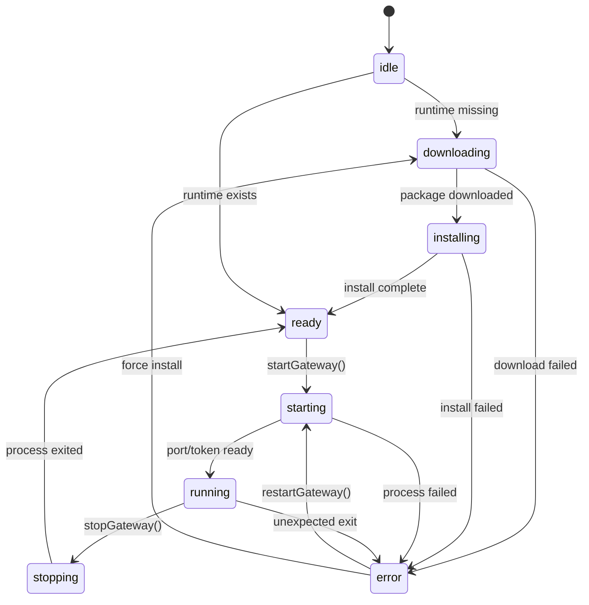
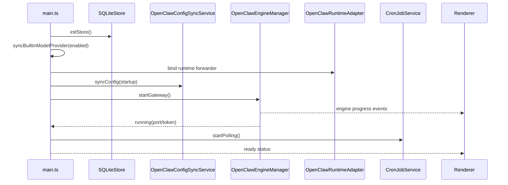
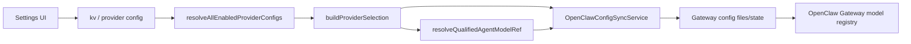

# Agent Engine 与 OpenClaw 集成

JustDo 当前只有一个 AI 执行引擎：OpenClaw Gateway `v2026.6.11`。Main 进程负责启动、停止、配置同步和状态展示，任务执行由 Gateway 完成。

## 关键文件

| 文件                                                    | 作用                                  |
| ------------------------------------------------------- | ------------------------------------- |
| `src/main/openclaw/runtime/openclawEngineManager.ts`    | Gateway runtime 生命周期              |
| `src/main/openclaw/config/openclawConfigSyncService.ts` | 配置同步服务                          |
| `src/main/openclaw/config/openclawConfigSync.ts`        | provider/MCP/hooks/extension 配置生成 |
| `src/main/engine/openclaw/openclawRuntimeAdapter.ts`    | Cowork 到 Gateway 的 adapter          |
| `src/main/engine/gateway/sessionRpc.ts`                 | Gateway session RPC helper            |
| `src/main/cowork/providerApiConfig.ts`                  | provider 配置解析                     |
| `src/main/cowork/builtinModelProvider.ts`               | 内置模型 provider 同步                |
| `src/main/cowork/builtinModelLifecycle.ts`              | 登录/退出模型与 OpenClaw 同步协调     |
| `src/main/openclaw/models/openclawAgentModels.ts`       | Agent 模型引用解析                    |
| `src/main/ipc/openclaw/engine.ts`                       | engine IPC handlers                   |

## Runtime 生命周期


```mermaid
stateDiagram-v2
  [*] --> idle
  idle --> downloading: runtime missing
  downloading --> installing: package downloaded
  installing --> ready: install complete
  idle --> ready: runtime exists
  ready --> starting: startGateway()
  starting --> running: port/token ready
  running --> stopping: stopGateway()
  stopping --> ready: process exited
  downloading --> error: download failed
  installing --> error: install failed
  starting --> error: process failed
  running --> error: unexpected exit
  error --> starting: restartGateway()
  error --> downloading: force install
```

Renderer 可以通过 `openclaw.engine.getStatus()` 和 `openclaw.engine.onProgress()` 展示状态。

## 启动流程

`src/main/main.ts` 中的主流程：

1. 初始化 SQLite。
2. 初始化 provider/config getter，并恢复保存的系统/自定义代理路由。
3. 通过已恢复的代理路由，以显式 `enabled` 访问状态刷新内置模型 provider。
4. 绑定 Cowork runtime forwarder。
5. 同步 OpenClaw config。
6. 启动 OpenClaw Gateway。
7. Gateway ready 后启动定时任务 polling。


```mermaid
sequenceDiagram
  participant Main as main.ts
  participant DB as SQLiteStore
  participant Config as OpenClawConfigSyncService
  participant Manager as OpenClawEngineManager
  participant Adapter as OpenClawRuntimeAdapter
  participant Cron as CronJobService
  participant UI as Renderer

  Main->>DB: initStore()
  Main->>Main: syncBuiltinModelProvider(enabled)
  Main->>Adapter: bind runtime forwarder
  Main->>Config: syncConfig(startup)
  Main->>Manager: startGateway()
  Manager-->>UI: engine progress events
  Manager-->>Main: running(port/token)
  Main->>Cron: startPolling()
  Main-->>UI: ready status
```

## 配置同步

JustDo 本地配置包括：

- provider/model 配置
- Agent 默认模型和技能
- MCP servers
- OpenClaw hooks
- Ask-user extension 配置
- 本地 skill 文件状态

这些配置通过 `OpenClawConfigSyncService` 写入 Gateway 可读取的配置位置。Gateway
运行时使用 OpenClaw 默认的 `hybrid` reload 策略：模型、Agent、MCP、Hook 和插件
启用配置优先原地热更新，Gateway 自身配置等不支持热更新的字段由 Gateway watcher
触发 restart。

JustDo 管理的配置默认写入 `tools.experimental.planTool: true`，使支持结构化
tool calling 的模型可以调用 OpenClaw 原生 `update_plan`。该能力仍由 Gateway
定义协议和执行语义；JustDo 不注册同名 MCP tool、不增加 provider allowlist，也不
通过 runtime patch 模拟计划更新。配置合并 `sandbox` 和 `loopDetection` 时必须保留
`tools.experimental`、既有 deny 列表和 web 配置。

JustDo 同时启用 OpenClaw 原生 `tools.toolSearch.mode: "directory"`，并通过
`010-defer-selected-tool-schemas.cjs` 将其 catalog predicate 收窄到显式名单，目前为
原生 `browser`、`cron`、`get_goal`、`create_goal`、`update_goal`、`memory_search`
和 `memory_get` tool。其他授权工具仍直接暴露；普通请求只看到精简目录项和 Tool Search
控制工具，相关请求则由 Gateway 加载对应完整 schema。工具最终仍通过 Gateway 的正常
权限、审批、Hook、日志与 telemetry 路径执行，JustDo 不实现绕过 schema 校验的代理
tool。OpenClaw 提供受支持的 per-tool defer 名单后，应删除此版本级 patch 并改用原生
配置。

JustDo 通过受支持的 `agents.defaults.compaction` 配置启用 OpenClaw 内置
`compaction-safeguard` hook，而不复制压缩引擎。策略借鉴 Codex 的 continuation
handoff 思路：摘要强调用户意图、约束、已验证进度、未完成事项和精确标识符；关闭会
重复占用 16,000-character 摘要预算的 preserved-turn suffix。OpenClaw 的结构化质量
校验会强制恢复其 `##` 模板，因此 Codex 模式下关闭该校验。配置刻意不写
`keepRecentTokens`：自动压缩仍继承 OpenClaw 的安全 recent-tail
默认值，而手动 `/compact` 会启用 `v2026.6.11` 的强化边界，真正丢弃旧工具结果，
形成接近 Codex 的“用户原话 + 摘要”检查点。mid-turn precheck 会在长工具循环中提前
检查上下文压力。

OpenClaw 的公开 compaction provider 可以替换摘要，但拿不到当前模型认证；公开
`before_compaction` / `after_compaction` hook 又不能修改压缩结果。因此
`011-retain-user-messages-across-compaction.cjs` 只补足原生 hook 无法表达的一层：
从整个压缩前有效分支提取真实 user 文本，在 compaction details 中跨轮滚动保存，并在
后续模型上下文中重放。完整性标记让重复压缩只追加上次边界之后的新输入，并能从旧版
不完整 metadata 补收 recent tail 中的用户原话。手动压缩的顺序是“用户原话 → 摘要”；
自动或 mid-turn 压缩则只回放 native recent tail 之前的用户原话，再接上 OpenClaw 为
安全连续执行而保留的 recent tail，避免 tail 内用户输入重复。用户原话预算与 Codex
一致，约为 20,000 tokens；超限时优先保留较新的完整输入，只截断最老的边界输入。摘要生成仍
完全走 OpenClaw 原生 safeguard hook，但会把 cut point 后的 user、assistant 和 tool
消息按原顺序追加到摘要材料。split-turn 会保持“旧历史 → turn prefix → recent
suffix”顺序，避免 tool result 排在对应 tool call 之前；重复压缩继续以 previous
summary 为基础，再合并本轮全部新回复。Tool result 和 bash output 单条最多保留 6,000
characters，每段摘要输入合计最多保留 24,000 characters；从最新结果向前分配预算，超额的旧
结果合并成一个有界省略标记。这确保最后一条用户消息和最近助手回复参与摘要，而大型
工具输出不会挤占全部摘要上下文。对升级前已经存在、尚无 retention metadata 的
compaction entry，重放层会从 JSONL 中仍保留的旧 message entries 回填一次用户原话。

模型摘要并不是压缩可用性的单点依赖。`019-compaction-emergency-fallback.cjs` 在
safeguard 无法解析摘要模型或认证，以及摘要请求超时、溢出或被 provider 拒绝时，不再
取消 compaction；它会提交一个最多 16,000 characters 的本地应急交接摘要，其中包含
最多 4,000 characters 的旧交接、最多 8,000 characters 的最近 user/assistant 对话，
以及有界的工具失败与文件操作信息。最近对话优先于旧交接，避免总预算截断最新用户请求。
正常的 compaction entry、`011` 的用户原话滚动保留和 native recent tail 仍然生效，
因此外层会把这次压缩视为成功并自动重试当前轮。只有明确的用户取消仍保持 cancel
语义。overflow 最多执行三次有界 compact-and-retry；第二次起使用 `keepRecentTokens: 0`
压缩剩余 recent tail，用户原话仍由 `011` 保留。如果系统提示和工具 schema 本身已经
超过模型容量，最终会显示准确的不可降载提示，而不再建议反复调大
`reserveTokensFloor`。该配置只决定提前量，不再承担摘要服务失败后的恢复职责。

`012-codex-compaction-template.cjs` 替换 SDK 内建的首次、重复和 split-turn 摘要提示词、
摘要 system wording 与回放前缀，并旁路 safeguard 强制的 `## Goal` / `## Progress`
等结构与诊断后缀。用户原话仍由 `011` 作为独立 user 消息重放，不重复塞入 summary
正文；assistant thinking 随完整 assistant 消息参与摘要，压缩后只保留其归纳结果。
`016-litellm-session-id.cjs` 覆盖普通 agent stream、safeguard 自己的分阶段摘要调用，
以及 `tools.exec.reviewer` 使用的 simple-completion 调用。补丁为关联到会话的
OpenAI-compatible 请求注入权威的 `metadata.session_id`，subagent 请求还会注入直接父级
Gateway UUID `metadata.parent_session_id`，并用
`metadata.request_purpose` 区分 `agent`、`context_compaction` 和 `exec_review`；真实用户
直接发起的顶层 agent turn 只有第一次 provider 请求会带上
`metadata.user_initiated=true`，系统 provenance 输入、自动续跑、同一 turn 的后续请求与
子代理请求不会携带该标记；标题生成
的直连请求由 JustDo 标记为 `title_generation`，模型设置页的连接测试请求标记为
`connection_test`。safeguard 原生通过
`generateSummary2()` 直连模型，不复用会话 stream，因此补丁会把当前 OpenClaw
session UUID 和可选的直接父级 UUID 传入每个摘要 chunk。Exec reviewer 同样走独立
simple-completion 链路，会从当前执行上下文取得相同的会话关联信息，但不会把 UUID 写入
reviewer prompt。subagent 创建时会固化父级当时的 Gateway UUID，旧子会话则通过
`spawnedBy` 解析并回填，因此父会话后续 rotation 不会改变已有子会话的归属。
因此手动、threshold、overflow、mid-turn 压缩以及模型安全审查都能在 LiteLLM 中与
原会话关联并按用途统计。

`011`、`012` 和 `019` 都是仅针对 OpenClaw `v2026.6.11` 生成 bundle 的精确文本 patch，并
故意在锚点变化时失败。升级 OpenClaw 时不得把它们原样复制到新版本目录：先检查上游
是否已提供用户原话重放、可替换摘要模板和 replay wrapper；仍需 patch 时，必须根据
新 bundle 重新定位并重写锚点，再分别验证手动、threshold/overflow、mid-turn、重复
压缩和 split-turn。`../openclaw` 只用于源码比对，不参与 JustDo 打包。

配置应用按所有权明确分为四类：

| 变化                                                                         | 应用方式             | 生命周期所有者 |
| ---------------------------------------------------------------------------- | -------------------- | -------------- |
| `meta`、`tools`、`skills`、`session` 等动态读取字段                          | 无进程重启           | OpenClaw       |
| models、Agent、Hook、cron、MCP、普通插件配置                                 | 原生热更新           | OpenClaw       |
| `models.pricing`、`plugins.load`、`plugins.installs`、`gateway`、`discovery` | Gateway 内部 restart | OpenClaw       |
| child process secret 环境或 Extension manifest/tool contract                 | stop/start 硬重启    | JustDo         |

同步服务在写配置前记录 reload generation，并用 Gateway 日志中的 changed paths
把 hot reload、restart acceptance 关联到正确代次。restart acceptance 只是中间状态，
必须等 Gateway 再次 ready 才放行新会话；等待预算覆盖 OpenClaw 的 workload drain 和
Gateway 启动时间。原生应用失败或超时才回退到 JustDo 硬重启。延迟硬重启同时绑定
Gateway process generation；若等待期间用户已停止 Gateway 或其他路径已替换进程，
旧 restart intent 会被丢弃，不会复活或重复重启 Gateway。仅 session store 变化不触发
任何 Gateway restart。

## 模型引用

Agent 模型引用由 `resolveQualifiedAgentModelRef()` 规范化，避免同名模型在多个 provider 中歧义。Main 启动时会 backfill 空模型并迁移可确定的旧模型引用。

## Runtime 资源

相关 npm scripts：

- `openclaw:runtime:host`
- `openclaw:runtime:win-x64`
- `openclaw:runtime:mac-arm64`
- `openclaw:runtime:linux-x64`
- `openclaw:bundle`
- `openclaw:plugins`
- `openclaw:resources`
- `openclaw:precompile`
- `openclaw:prune`

`openclaw:bundle` 在新建 bundle 和命中缓存跳过重建两条路径中都会生成或修复
`gateway-launcher.cjs`。构建脚本与 `OpenClawEngineManager` 共用同一个 launcher
生成器，确保 Electron Builder 校验前以及应用运行时得到一致的 bundle-only 入口。
缓存命中时会先验证 patch manifest；bundle 与 patch 集合均未变化时跳过完整 patch
pass。`predist:win` 由 npm 在执行 `dist:win` 前自动调用，`dist:win` 本身不得再次调用。

## 约束

- 不引入第二个 Agent engine。
- 不让 renderer 直接管理 Gateway process。
- Runtime patch 必须小、可审计、可删除，并遵守 `scripts/patches/README.md`。
- 完整 patch pass 会生成绑定 patch 集合与最终 Gateway bundle 哈希的
  `runtime-patch-manifest.json`；Electron Builder 在打包前和复制产物后各校验一次，
  校验失败时不得生成安装包。
- OpenClaw 行为差异优先向上游修复，JustDo patch 只作为兼容层。

## 组件分工

### `OpenClawEngineManager`

Engine manager 是 Gateway process 的唯一生命周期 owner。它负责：

- 解析 runtime 路径。
- 检查 runtime 是否可用。
- 下载/安装/同步 runtime。
- 启动 Gateway child process。
- 缓存 port/token/status。
- 停止或重启 Gateway。
- 向 Main 进程发出 status event。

Renderer 只能看到抽象状态，不能拿到 process handle。

### `OpenClawConfigSyncService`

Config sync service 把 JustDo 本地配置转换为 Gateway 可读配置。它的输入来自多个 store/service：

- Cowork/Agent store。
- Provider API config。
- MCP store。
- Hook store。
- Extension ask-user config。
- Gateway runtime manager。

同步时要考虑 Gateway 是否正在运行：

- 启动前同步：直接写配置。
- 普通 `openclaw.json` 变化：等待 Gateway watcher 完成热更新或自主 restart；等待失败时才回退到硬重启。
- 子进程 secret 环境变量或 Extension manifest 变化：由 JustDo 硬重启，因为运行中的
  child process 和已加载 manifest 无法通过普通配置热更新替换。
- 仅 managed session store 修复：不重启 Gateway。
- 有活跃 workload：避免无提示打断正在执行的会话。

Engine manager 从 Gateway reload 日志维护同步代次。会话执行在配置写入后等待对应代次
完成，避免 watcher debounce 期间立即发起的新会话读到旧模型或旧插件配置。

### `OpenClawRuntimeAdapter`

Adapter 是 Cowork domain 与 Gateway domain 的边界。它负责把 JustDo 的 session、agent、attachment、stream 概念映射到 Gateway 请求和事件。

Adapter 不应该变成大而全 service。新增 Gateway API 时优先：

1. 放到 `src/main/openclaw/<domain>/` 的专用 helper/service。
2. Adapter 只调用 helper。
3. Renderer 通过已有 Cowork/OpenClaw IPC 获取结果。

### Goal continuation coordinator

`src/main/openclaw/goals/goalContinuationCoordinator.ts` 只负责连续派发，不复制或
持久化 Goal。OpenClaw session 中的 `goal` 始终是生命周期状态的唯一权威来源；
coordinator 仅在进程内维护 `waiting`、`running`、`continuing`、`stopped`、`failed`
执行快照，并由 adapter 转发顶层 JustDo Session 的 lifecycle event、Gateway client
和 renderer IPC。

一个顶层 run 成功结束后，coordinator 用 canonical session key 调用
`sessions.describe`。只有 Goal 此时仍为 `active` 才通过 backend `agent` RPC 派发下一轮；
subagent、cron、channel 和非 JustDo Session 不参与。请求复用原 Session、Agent 与模型
选择，设置 `deliver: false` 和 `suppressPromptPersistence: true`，因此自动生成的
continuation user prompt 不进入历史，而 assistant、thinking 和工具活动仍沿正常事件链
可见。请求不设置 `sessionEffects: internal`，也不设置 token、轮数或时间预算。
自动轮次必须产生成功且结果有变化的非 Goal 工具活动，或通过 `update_goal` 进入终态；
coordinator 对成功工具的名称、输入和输出生成进程内指纹，连续两轮只有 `get_goal`/文本，
或重复完全相同的工具证据时，将 execution 标记为 `failed` 并停止
派发，Goal 仍保持 `active`，由用户检查结果后手动重试。这是无进展安全熔断，不是 token、
总轮数或时间预算；只要每轮持续产生可观察的工具进展，续跑轮数仍不受限制。
为补足 OpenClaw v2026.6.11 尚未提供的 per-turn active Goal context，隐藏 user prompt
每轮直接携带权威 `goal.objective`；目标文本不提升为 system instruction。附加 system
prompt 要求先审计现有历史、产物和工具证据，避免重复已完成工作，并在完成时用
`update_goal` note 留下简短验证证据。blocked 判定与上游工具契约一致：同一阻碍至少
连续三个 Goal turn 且已无其他可推进工作。升级到原生注入 Goal context 的 OpenClaw
版本后应重新审计并移除重复注入。

Goal 变为 `complete`、`blocked`、`paused`、`usage_limited`、`budget_limited` 或被清除时
停止派发；run error、abort、用户 Stop 或 Gateway 请求失败也停止。Stop 路径必须先让
coordinator 禁止续跑，再 abort 当前 run，避免终态竞态；如果 Gateway 未确认 abort，
adapter 会恢复 stop 前的 execution 快照，避免仍在运行的任务被误报为已停止。幂等键由 Goal id、进程内续跑
序号和随机 run id 构成，terminal lifecycle 按 run id 去重，同一 Session 的派发串行化。
自动派发会给上一轮 `chat.final`/history reconciliation 留出短暂收敛窗口，并在窗口后再次
执行 `sessions.describe`；Goal id/status 已变化、用户已 Stop 或新手动 run 已开始时取消
该次派发，避免旧 lifecycle 终态覆盖新意图。
OpenClaw 的 session metadata read 在 run 收尾阶段可能短暂落后于同一 run 内刚完成的
`update_goal` mutation。coordinator 因此还会关联 `update_goal` 的 start/result tool event；
一旦当前顶层 run 的 `complete` 或 `blocked` 更新成功，即使紧随其后的
`sessions.describe` 暂时仍返回 `active`，该 run 也绝不派发下一轮。失败或取消的工具调用
不具备这一终止语义。这个 latch 只约束续跑资格，不复制或改写 OpenClaw Goal。

这些状态需严格区分：Goal lifecycle 描述目标是否 active/paused/complete，Session runtime
activity 描述 Session（含后代）是否存在工作负载，Goal execution snapshot 只描述本次
应用进程内的持续执行。Gateway 断连、runtime 代次变化或应用退出会清空 execution
snapshot；ready/reconnect 不扫描旧 active Goal。重启后 UI 显示等待继续，只有用户手动
继续、恢复或发送新消息产生新的顶层 lifecycle start 后，当前进程才重新取得续跑资格。
手动继续会依次检查 runtime 已知 key、当前 Agent key 和默认 Agent key，并使用真正持有
active Goal 的 `sessions.describe` canonical key，避免历史或迁移 Session 查询与执行错位。

## Gateway Connection

Gateway connection info 包含 port 和 token。Main 持有 token，Renderer 需要连接 chat websocket 时通过受控 IPC 获取必要信息。

```text
OpenClawEngineManager
  -> getGatewayPort()
  -> getGatewayToken()
  -> GatewayClient connects ws://127.0.0.1:{port}
```

代理策略会把 Gateway localhost 端口加入 bypass，避免系统代理影响本地 websocket/RPC。

## Provider / Model Flow


```mermaid
flowchart LR
  Settings["Settings UI"] --> Store["kv / provider config"]
  Store --> Resolve["resolveAllEnabledProviderConfigs"]
  Resolve --> Selection["buildProviderSelection"]
  Selection --> AgentRefs["resolveQualifiedAgentModelRef"]
  Selection --> Sync["OpenClawConfigSyncService"]
  AgentRefs --> Sync
  Sync --> GatewayConfig["Gateway config files/state"]
  GatewayConfig --> Gateway["OpenClaw Gateway model registry"]
```

Agent model 绑定可能是：

- 完整 provider-qualified ref。
- 历史未带 provider 的 model id。
- 空值，需要 backfill 默认模型。

`openclawAgentModels.ts` 负责识别 ambiguous model。若同一个 model id 出现在多个 provider，应跳过自动迁移并写 warning，避免把用户 Agent 绑定到错误 provider。

JustDo 生成的所有 `openai-completions` 模型条目都显式设置
`compat.supportsUsageInStreaming: true`。OpenClaw 据此在流式请求中发送
`stream_options.include_usage`，使支持该协议的模型提供商返回上下文与 token 使用统计。

内置模型同步会根据 `/model/info` 的 `model_info.mode` 区分聊天与 embedding
模型。聊天模型进入应用的可选模型列表；embedding 模型按 ID 排序，并将第一个模型写入
`agents.defaults.memorySearch`，复用同一个内置 provider 的 base URL 和 API key。若没有
embedding 模型，则显式设置 `memorySearch.enabled: false`，避免 OpenClaw 回退到 OpenAI。

登录/退出与内置模型、`openclaw.json`、Gateway 环境之间的接入契约独立记录在
[`docs/features/authentication-builtin-model-lifecycle.md`](../features/authentication-builtin-model-lifecycle.md)，
认证模块应只依赖其中定义的 Main 进程生命周期入口。

## Startup And Recovery

启动时的恢复动作包括：

- 重置上次异常退出留下的 running session 标记。
- backfill 空 agent model。
- 迁移可确定的旧 model ref。
- 同步 config。
- 自动启动 Gateway。
- Gateway ready 后启动 scheduled task polling。

系统从 sleep/resume 恢复时，adapter 会处理 Gateway websocket reconnect。

## Engine Status Model

Engine status 至少应支持这些 UI 语义：

- idle：未启动。
- downloading/installing：runtime 准备中。
- ready：runtime 可启动。
- starting：Gateway process 启动中。
- running：Gateway 可用。
- error：启动或运行失败。

UI 不应该根据日志文本推断状态；应使用 status object。

## Patch Interaction

Runtime patch 影响的是 Gateway runtime 行为，因此 engine install/bundle 流程必须能清楚记录 patch 是否应用。Adapter 层如果依赖 patch 行为，需要在对应 feature docs 写明，比如 thinking stream。

Patch 失效时应表现为：

- 构建/安装日志可见。
- Gateway 启动日志可见。
- Feature 降级路径可见。
- 文档能指向具体 patch。

## Final system prompt replacements

JustDo exposes ordered, system-only regular-expression replacements through
`window.electron.openclaw.engine.getSystemPromptReplacementRules()` and
`setSystemPromptReplacementRules(rules)`. Rules are persisted under the
OpenClaw state directory in `system-prompt-replacements.json`.

The Gateway receives the file path through
`JUSTDO_SYSTEM_PROMPT_REPLACEMENTS_PATH`. Runtime patch `015` reloads changed
rules after OpenClaw prompt hooks have completed and before prompt-cache setup,
overflow preflight, lifecycle observation, and model submission. It updates
the active session system prompt, so subsequent tool-loop calls use the same
transformed value. User, assistant, and tool-history messages are not
transformed.

Rules run sequentially and contain `id`, `pattern`, optional `flags`,
`replacement`, and optional `enabled`. They are trusted local configuration:
invalid rules are rejected by the JustDo API, while the Gateway skips malformed
on-disk entries without logging prompt content. The 100-rule limit applies to
custom rules; registered built-in rules do not consume user capacity.

Built-in rules are registered centrally in
`src/main/openclaw/runtime/systemPromptReplacementRegistry.ts`. They run first
and remain authoritative by `id`; rules added through IPC are persisted after
them. The built-in transforms also remove per-skill `<version>` lines from the
final `<available_skills>` catalog and the accompanying version-refresh
guidance because those hashes do not help model-side skill selection.
Individual rule behavior is documented by co-located tests rather than
duplicated in this architecture document.
