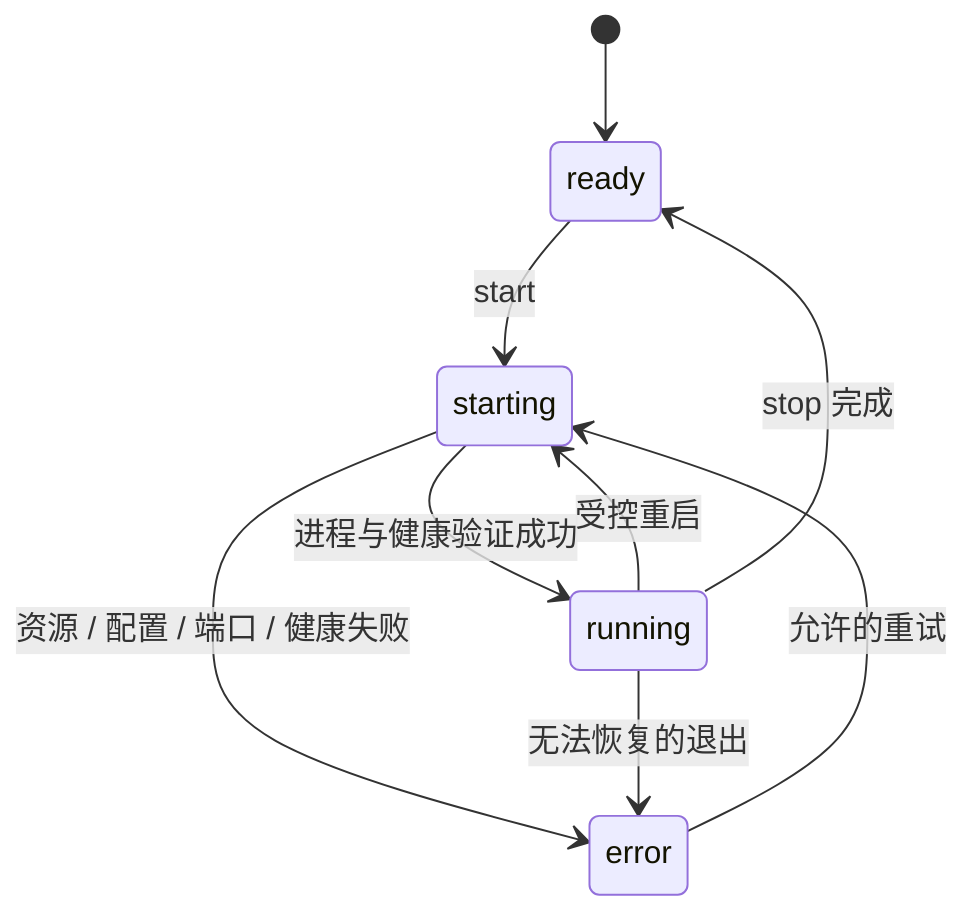
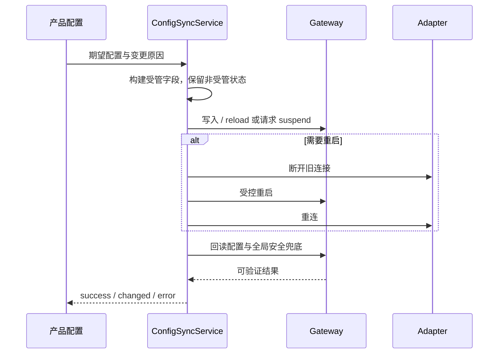

# 执行引擎：配置、准入与 Gateway 恢复

当前 Cowork 执行引擎是 OpenClaw。Router 提供稳定产品接口，Adapter 隔离原生 wire 与生命周期，Manager 托管运行时进程。本文按当前 v2026.9.8 集成组织，运行时补丁清单只维护在[版本目录](../../scripts/patches/v2026.9.8/README.md)。

## Code Mode 工具编排

运行设置中的 Code Mode 是原生 OpenClaw 工具编排能力，保存于现有
`agentRuntimeSettings:v1` 配置记录的 `codeMode.mode`，取值为 `off / auto / on`。
新配置默认 `off`，旧记录缺少该字段时补为 `off`，不重置其他运行偏好。界面保留
“自动（待模型支持）”但禁止选择；已有显式 `auto` 值保留并如实显示，可改选开启或关闭。
配置同步在完整配置、无模型配置、
登录与退出路径中映射到 `tools.codeMode.enabled = false / "auto" / true`，并选择
`executor: "quickjs"`。原生超时、输出、并发等其他 Code Mode 参数保留。

`auto` 由实际模型目录的 `compat.codeMode` 能力标记决定，不根据模型名称自行猜测。
应用投影的自定义模型可能没有该标记，因此自动模式不保证启用；需要验证这些模型时可
选择开启。该设置控制嵌入式 OpenClaw 运行时，不控制外部 ACP 或 provider-native harness。
本期界面管理全局启用方式，不提供逐模型覆盖编辑器；原生覆盖优先级由 OpenClaw 判定，
认证范围同步保留已有 agent/model 覆盖。普通完整同步仍按应用的托管模型与助手配置重建，
不能把手改生成配置当作持久的逐模型设置入口。

模型生成的 JavaScript、工具目录/MCP 发现、结果暂存、`exec / wait`、取消及失败恢复
均由 OpenClaw 管理；Main 不增加执行器或结果缓存。QuickJS 插件的显式禁用仍受尊重，
执行器缺失或被禁用时原生运行失败，不自动降级到 Node VM。内部工具调用继续经过
Gateway 权限、审批及 hooks；QuickJS 隔离本身不授予额外工具权限。

可运行 `node scripts/test/verify-code-mode-runtime.mjs [runtime-directory]`，只读检查
打包产物的 worker、WASM、文本编码模块，并实际验证执行、等待恢复、失败与取消。
该检查无需模型凭据，不替代真实模型/MCP/审批端到端验证。

## 1. 三层控制各管什么

| 层                           | 所有状态                                               | 主要入口                     |
| ---------------------------- | ------------------------------------------------------ | ---------------------------- |
| Router / CoworkEngineService | 产品会话到执行适配器的路由、停止与运行汇总             | `src/main/engine/cowork/`    |
| OpenClawRuntimeAdapter       | 连接、原生身份映射、交互、产品事件、Goal 协调          | `src/main/engine/openclaw/`  |
| OpenClawEngineManager        | runtime 路径、进程 generation、端口、token、启动和重启 | `src/main/openclaw/runtime/` |

Adapter 入口保留生命周期及状态，runtimeGatewayConnection、runtimeGatewayEvents、runtimeHistory、runtimePlanInteractions、runtimeGoalOperations、runtimeSessionStatus 处理各领域操作。它们通过显式实时上下文访问入口状态，不复制控制器状态，更不保存 transcript。

## 2. 从源码到可启动运行时

平台构建从锁定 pristine npm 产物开始：安装及校验来源 → 当前精确补丁 → 同步 current → bundle → 官方插件 → 产品资源 → Extension 预编译 → prune。运行时与应用自身 node_modules 是两套依赖集合。

开发路径和安装包资源路径不同，由 Manager 解析。Windows 命令通过 Electron-safe Node/npm runner 及 MinGit/Python 资源执行，不能把 Electron GUI 当通用 node。bundled Skills、Hooks、Plugins 使用显式运行时目录，不依赖 bundle 中的 import.meta.url 猜源码位置。

Gateway bundle 位于运行时根目录，构建流程必须把原始 `dist/build-info.json` 同步到 bundle 旁，并作为必需 companion 验证。原生迁移检查从执行模块旁读取构建身份；缺失时会把检查点判为失效，每次启动重做迁移检查。这里保留原始构建身份和原生检查点规则，不伪造迁移完成状态；构建、配置或插件迁移指纹变化仍由 OpenClaw 判定是否需要重跑。

冻结 manifest 把补丁、helper、source lock 和构建 recipe 绑定在一起。同版本输入变化也可能拒绝旧产物。历史或部分补丁标记不得就地迁移；从 pristine 包重建，见[开发指南](../development.md)。

## 3. 启动与重启状态

Manager 对外 phase 为 ready、starting、running、error；canRetry 与 message 用于产品反馈。它们不是单个 Agent run 的状态。

```mermaid
stateDiagram-v2
  [*] --> ready
  ready --> starting: start
  starting --> running: 进程与健康验证成功
  starting --> error: 资源 / 配置 / 端口 / 健康失败
  running --> starting: 受控重启
  running --> error: 无法恢复的退出
  error --> starting: 允许的重试
  running --> ready: stop 完成
```

启动使用有界健康轮询，当前 boot timeout 为 300 秒，同进程重启等待上限 60 秒；异常重启最多 5 次并递增退避。调用者应消费状态，不自行启动第二个 Gateway。端口选择限定 loopback，保存端口还需校验范围与占用。

开发时，本地源码扩展只在真正创建 Gateway 进程前异步复制，复用同一个启动任务；健康进程复用、运行时就绪查询和 CLI 环境读取不重写运行中的扩展。显式重启重新准备源码，已预编译的扩展保持不变。复制失败可重试；复制期间停止后，迟到结果不得创建进程或覆盖停止状态。文件复制不能阻塞 Electron 主线程与连接心跳。

Windows Gateway 子进程通过专用 Node IPC 接收退出请求，宿主注入的 shutdown preload 转交给 OpenClaw 原生 SIGTERM 处理器释放数据库租约；父进程断开时也执行同一清理。不能把 Windows `child.kill()` 当作优雅退出，它会跳过清理，遗留租约在 PID 被系统进程复用且无法读取创建时间时可能阻塞下次启动。原生插件与连接清理可能超过 4 秒，退出请求 15 秒后仍未完成才强制结束，整个停止过程最多等待 16 秒。开发宿主清理预算为 30 秒，紧急清理额外等待最多 17 秒，避免宿主先于 Gateway 的退出截止时间结束。

宿主确认健康后通过同一 IPC 通知 launcher 开始周期性持久化 V8 编译缓存。缓存序列化是同步操作，不能在冷启动尚未就绪时执行；独立 CLI 没有宿主 IPC 时保留原有缓存写入行为。应用退出开始时先关闭 Manager 的启动准入，再清理依赖和停止 Gateway，避免后台读取或排队的重启在退出期间重新创建进程。

进程 generation 与连接 generation 用于淘汰旧退出通知、重连结果和事件。唤醒或断线后建立新连接，不允许旧 socket 的终态更新新运行。Manager 的进程就绪只代表 Gateway 服务可用，模型认证与 session 权限还有独立验证。

## 4. 配置同步是执行准入的一部分

桌面主聊天的首轮原生发送支持由实际 Renderer 连接执行：Adapter 准备 session/root、权限、模型、运行 ID 与 Goal intent 后，向受信窗口交出同一份 `chat.send` 参数；Main 保留监听与运行状态。只有已挂载原生 viewer 的 HTTP(S) 聊天连接公告 `inline-widgets`，原生执行按 originating client capability 决定 `show_widget` 是否可用。Main 的后台连接保持 headless，未增加 UI capability 或 native runtime patch。一次 ACK 必须对应原始幂等 ID，停止控制回执和 structured Goal receipt 分别校验；不确定发送只恢复状态，不重新启动任务。

产品配置来自 app_config、cowork_config、agents、MCP/Hook Store、Extension 开关与受管文件。ConfigSync 构建原生投影，ConfigSyncService 在串行 mutation 中应用并验证。

产品暂未接入 OpenClaw Portals 展示流程，配置同步始终在全局 `tools.deny` 中加入
`portal`，覆盖完整配置、无模型配置及登录/退出同步，并保留其他显式工具限制。
该策略禁止 Agent 使用门户工具；它不关闭原生门户服务或具有管理权限的
`portal.open` 接口，也不关闭整个 OpenClaw Control UI。已有门户在 Gateway 重启时结束。

配置同步只更新受管的 `meta.lastTouchedVersion` 并删除不再支持的 `lastTouchedAt`，保留 Gateway 写入的 `meta.migrations` 等原生元数据。完整配置、最小配置及认证切换都遵循这一规则，避免抹掉迁移回执后让 Gateway 再次写入并触发无意义重载。

```mermaid
sequenceDiagram
  participant Product as 产品配置
  participant Sync as ConfigSyncService
  participant G as Gateway
  participant A as Adapter
  Product->>Sync: 期望配置与变更原因
  Sync->>Sync: 构建受管字段，保留非受管状态
  Sync->>G: 写入 / reload 或请求 suspend
  alt 需要重启
    Sync->>A: 断开旧连接
    Sync->>G: 受控重启
    Sync->>A: 重连
  end
  Sync->>G: 回读配置与全局安全兜底
  G-->>Sync: 可验证结果
  Sync-->>Product: success / changed / error
```

不能将“文件已写”当成“配置已生效”。可选 agent-team、stt-local-cli 的用户显式 disable 保留；受保护运行时服务不能被普通开关移除。非 MCP mutation 可发现原生新增 MCP，但产品删除或改名后的同步不能重新导入尚未改写的旧配置。

配置重载分别等待变更检测和应用完成，默认各有最多 30 秒预算，完成即返回。检测到变更后只启动一次完成计时，避免 Windows 凭据解析或插件加载消耗检测预算后，尚在正常执行的热重载被误判为失败并触发多余重启；失败事件仍立即返回，原生接受重启后使用独立的重启完成预算。安全设置切换仍等待主进程同步并验证权限成功，成功后直接更新选项，不再额外运行一次沙盒自检。

Windows 沙盒准入先验证锁定的 MXC 二进制，再运行执行器 `--probe` 与真实无网络隔离进程；插件注册也探测实际选中的执行器。不能用实验性 IsolationSession 的 IsoEnvBroker 服务是否存在来判断 ProcessContainer 可用性。自检失败保持拒绝准入，设置页显示具体原因和诊断入口；系统盘准备仍是用户显式触发的可选操作。详见 [Windows 原生沙盒](17-windows-native-sandbox.md)。

全局 exec/fs 使用 restricted fallback。会话权限走单独 coordinator，以原生 sessions.create 写入并核对 permissionMode/sessionRoot。失败时不发送，不能用全局 full 兜底“修好”单个会话。

## 5. 模型与凭据进入执行的方式

模型引用使用限定 provider/model，准备时验证模型目录、当前选择和认证状态。main 的会话默认来自应用设置；非 main 助手可配置独立模型。在线语音和图像配置按能力隔离；受管 `video-openai` 的端点和 SecretRef 独立于聊天、图像模型。其他已安装原生视频服务商按自己的统一身份配置，可能与同身份语言模型共用凭据，详见[模型管理](../features/models/model-management.md)。

自定义 provider 的敏感值投影到受限权限文件，原生配置用 file SecretRef。内置模型从 user_info 中的 mtoken 换取短期 JWT，校验账号与有效期，原生只看到 exec SecretRef；SQLite builtin apiKey 保持为空。轮换触发 secrets.reload，logout/到期停止相关访问并清理派生快照。

凭据解析成功与服务端 Team 授权成功也不同。模型发现、连接测试和真正请求的错误需分别报告。二进制包装不等于抵御同用户逆向的密钥保险库，详细链路见[认证专题](../features/integrations/authentication-builtin-model-lifecycle.md)。

## 6. 发送、原生事件与产品回执

Adapter 接收产品会话身份，准备原生 session、模型和权限，再提交 chat 请求并绑定原生 run。用户后续直接聊天发送也需要先完成同样的产品准备。

可见 worktree 子会话由模型经原生 `sessions_spawn` 创建。产品会话列表读取 Gateway 原生会话，按 `parentSessionKey` / `spawnedBy` 与受管父会话关联，并持久绑定原生 session key。继续该会话时 Adapter 用 `sessions.describe` 核对 sessionId、worktree 元数据与实际目录（`sessionRoot`、`spawnedCwd` 或 `spawnedWorkspaceDir`），不再调用 `sessions.create`；Renderer 历史使用同一原生 key。设置页 Worktree 面板调用 `worktrees.list/restore/remove/gc` 管理原生登记的记录，不能管理模型通过 shell 自建的普通 Git worktree。

原生绑定的权限变化通过 `sessions.patch` 同步，并使用 `expectedSessionId` / `expectedPermissionMode` 防止写入已替换的会话或覆盖查询后的权限变化；回执必须确认同一检出、权限和实际目录。采用子会话时保留原生 guarded/workspace/full 模式，未声明模式时使用 ask；无法表示的 read-only 模式不接入产品会话。事件关联先查询持久原生 key，保证首次打开之前和重启后仍可映射生命周期、问题和计划事件。设置移除保护必须读取完整会话目录，而不是会话摘要；任何仍被产品会话引用的检出均不允许移除，保护范围包含检出内的子目录。Worktree 会话暂不支持复制/分叉，避免副本共享原检出却没有托管所有权；删除所属会话前也必须先删除使用该检出或其子目录的其他会话。

设置中的 `showWorktreeCheckbox` 默认关闭，仅控制新会话输入框右上角的 Worktree 选项是否显示。显示后每次新会话默认不勾选，既有会话和侧边提问不提供该选项。勾选时 Main 先绑定产品会话的原生 key，再调用无初始消息的 `sessions.create(worktree: true)`，校验原生权限、检出身份与实际目录后更新产品 `cwd`，最后才提交首轮消息。创建结果不确定时保留原生绑定与错误状态，避免重新分配目录；准备过程中取消不会发送首轮消息，创建完成后使用原生会话删除接口回收；只有明确的删除回执才能移除产品记录，清理失败时保留检查入口。明确的创建失败经原生查询确认会话不存在后移除产品记录。

Worktree 设置页同时接入 Gateway 全局 `worktreeRoot` / `worktreeAcceleration`。Main 通过原生 `config.get` 读取并仅投影目录、加速、配置版本和应用状态；保存通过与应用配置同步共享的排他队列及带 `baseHash` 的 `config.patch`，回读核对结果。超时/断线不重试写入，配置版本冲突要求重新读取。完整、无模型与认证配置同步保留这两项原生设置。目录变更和加速开关只影响新分配，已登记目录、快照和恢复路径保持原生所有权；页面显示默认目录与固定 `openclaw/<名称>` 分支规则，不将全局目录解释为项目同级布局。

原生 WS 中的文本流由 Renderer 消费；Adapter 只将运行状态、交互、审批、Goal 和会话变化映射为产品事件。wire validator 固定到 v2026.9.8，未知或不合法字段不能在各调用方随意猜测。

网络超时可能发生在原生接收之后。run receipt 需要保留未知状态并查询原生事实；无条件重发将造成重复工具副作用。工具错误不必然是运行终态，late terminal 也不能结束新的 generation。

## 7. Goal、Plan 与子任务不重造执行器

Goal coordinator 在原生目标仍 active 时安排续跑，保存产品 phase、次数和等待状态。六种原生 Goal status 原样保留。用户操作使用 goalId fence，停止 latch 和等待交互阻止后台抢跑。

Plan-mode 通过原生 session extension、turn hook、工具和 scoped RPC 实现。Main 持久化计划文件及 handoff，批准后用原生 reset 建立实施上下文；这是产品交接，不是另一套原生恢复状态机。

子任务查询使用 `sessions.list({ spawnedBy })` 和 `sessions.describe`；`sessions.changed` 使产品快照失效。OpenClaw v2026.9.8 已移除旧任务账本与 `tasks.*` RPC，原生会话投影统一拥有委派执行与控制归属。原生仍负责 admission、队列、required-child join 与完成通知。平级协作发送使用原生 sessions_send，产品只负责任务范围和回执。SubAgent 与平级协作有独立生命周期；上游 `agents team create` 是角色预设与原生委派配置，不能直接替代产品 room。跨助手原生委派须同时设计目标授权与助手创建、禁用、软删除的同步；当前不自动将受管 roster 扩展为 `subagents.allowAgents`。

展示保留原生 queued、running、done、failed、interrupted、killed、timeout 的区别；interrupted 在产品中显示为已停止。缺少终态证据不能显示成功。详情核对精确原生 session key，再使用同一会话投影中的累计 usage/runtime、activeRunIds 和 lastRunId；新活动运行清除旧终态时间与错误。主模型结束或 UI busy 消失不证明 required child 已被父运行消费。结果不确定时先查原生会话与运行身份，不能重发整个子任务；它可能已经产生文件、网络或 spawn 副作用。

### 执行观测与结果投递

当前原生会话投影提供生命周期、耗时、运行身份与累计用量；旧任务摘要中的 execution、deliveryStatus 和 diffStat 已不属于此读取契约，界面不伪造等待原因、交付状态或变更统计。结果交付仍由原生执行系统管理，执行结束不意味着父任务已消费结果。完整读取替换成员集合；暂时不完整时只保留已核验快照，并保持刷新代次隔离，防止旧请求覆盖更新结果。

精确操作必须经过产品会话与原生 `spawnedBy` 控制树归属核对，最多沿 64 层父身份查询并检测循环；导航关系 `parentSessionKey` 不用于授权。取消对已核验的子会话调用 `sessions.abort({ key, clearQueued: true })`。原生未明确确认或连接中断时保留失败语义，不自动重新 spawn 或重跑工具。上游已移除的结果重投递/忽略按钮同步退役。

嵌套浏览按需请求单层，每页 50 条；多层导航保留稳定原生 session key，游标绑定父层 keys 与 offset。根任务 `getSubTaskStatus` 轮询仍分页遍历全部直接子会话；原生单次投影已包含状态与用量，无需逐条 tasks.get 或二次生命周期拼接。大型历史根列表仍有完整扫描成本。子树浏览和精确操作不创建第二套调度器。

### Swarm 容量配置

运行时设置将 Swarm 与普通 SubAgent 容量分开保存，并通过 ConfigSync 投影到原生 `tools.swarm`。当前受管项是 `enabled`、`maxConcurrent`、`maxChildrenPerGroup`、`maxTotalPerGroup`；缺少新字段的旧设置采用默认值 true、8、50、200。应用校验范围分别为组并发 1–64、组内存活子任务 1–200、组内累计子任务 1–1000；这些是应用设置的可选范围，不是原生硬上限。配置合并保留未受管的原生 Swarm 字段，常规保存、最小配置与认证切换使用一致投影。

这些设置控制原生批量委派容量，不等价于启用平级 agent-team Extension，也不会创建助手档案或协作房间。collector 结果聚合和原生分组执行仍属于 OpenClaw；专用 collector 进度面板及结构化结果展示不属于本次已实现范围。

## 8. 重启的两种边界

Manager 将配置触发的重启排在正在进行的启动之后，不能先停止再复用旧启动 Promise。对外的 `startGateway` 等待已排队重启的最终结果，交互恢复与扩展读取不会收到中间的 stopped 状态；重启内部使用独立的单次启动操作，避免等待自身。等待期间的显式停止取消后续排队启动。

同一 Electron 进程内重启 Gateway，保留稳定 app-start 身份，使用原生 durable recovery。完整应用重新启动，通用 app-start boundary 终止上一宿主实例遗留的活动 session/task，避免旧工作在用户不知情时自动继续。

产品恢复再分别核对：session/runtime、run receipt、Goal、计划 awaitingReview、待答问题和协作投递。恢复待审核侧栏不意味着重放已批准工具；queued 正文不存在也不能从投递元数据伪造消息。

## 9. 网络与日志

Gateway 环境由 Manager 按 generation 构造，包含系统 CA、依赖工具与受控出站代理。仅显式 opt-in 的 one-shot CLI 使用该代理环境；例如 memory index 与普通命令不能因全局 env 污染意外改变网络行为。

embedding host 关闭 Bonjour、shell snapshot、自重生和非产品 channel；不要开启没有配套工具资源的全局 offline 假设。摘要日志会压缩高频消息，完整事件诊断必须对照原生 JSON 日志，见[日志排障](../development.md)。

## 10. 分层定位与验证

运行诊断在 Adapter 的原始 Gateway 事件入口旁路采集安全字段，先保留身份再让执行 owner 清理 active turn；迟到终态可以补充诊断，但不能重新激活执行。只有 `executionSettled: true` 的 lifecycle end/error 确认整轮结果，attempt finishing 和 chat final 另行解释。停止请求保留显式用户来源，连接清理前保存活动运行快照；诊断监听失败与执行隔离。

诊断查询只使用 `getGatewayClient()` 返回的已连接客户端，不能走会自动启动运行时的 `requestGateway()`。可选 `diagnostics.stability` 仅提取全局数量与丢失计数，不能归因为某轮故障。不发送 `/diagnostics` 或调用反馈上传。

用户打开、切换运行或刷新诊断时自动采集日志，也可单独重试；采集期间禁止导出半成品。日志采集使用同一已连接客户端的 `logs.tail`，由原生端选择正确日志源；不使用 stdout 中的路径执行本地文件读取。Main 对本软件 Main/Cowork、运行服务输出及原生结构化 `logs.tail.file` 确认的文件逐块完整扫描、关联及闭合值投影。默认原生日文件枚举同目录同命名族，自定义来源仅扫描精确文件；文件扫描不受预览条数、尾部字节或总耗时限制。每来源完成状态、解析缺口、全部匹配类别计数和预览省略数独立记录；单次 I/O 超时、取消和源文件变化不得标为扫描完成。日志只作为提示证据，不参与权威终态分类；采集生成新快照，导出与界面预览一致。来源不可用、截断和省略均保留在包内，离线不会启动运行时。

| 层   | 典型故障                            | 证据                                     |
| ---- | ----------------------------------- | ---------------------------------------- |
| 资源 | 入口或二进制缺失、freeze 不匹配     | runtime manifest、安装/构建输出          |
| 进程 | 端口占用、启动退出、健康超时        | Manager phase 与 Gateway 启动日志        |
| 配置 | 原生回读不一致、suspend/reload 失败 | ConfigSyncService 结果                   |
| 认证 | JWT 过期、模型不可用、Team 拒绝     | 脱敏模型诊断                             |
| 会话 | mode/root 不收敛、身份失效          | session prepare 与原生 describe          |
| 显示 | 原生有事件但 UI 缺失                | controller generation、history reconcile |

回归入口为 Manager/ConfigSyncService 测试、Adapter 各领域测试、wire validator 测试及 `tests/openclaw/runtime/`。版本升级必须验证 pristine contracts 与最终打包产物，不能用旁边的 OpenClaw 开发副本代替。

## 记忆浏览与索引诊断

首页记忆页只读取 `main` 的工作区 Markdown 资料，不维护第二份记忆库。
显式绝对工作区可离线浏览；用户目录、相对路径和隐式工作区通过原生
`agents.files.list` 取得实际路径，避免复制 OpenClaw 的默认身份和目录推导规则。

搜索经 `memory.search` 返回原生结果与 `searchMode / stale / warning / action`。
页面保留会话和额外目录来源的检索片段，只有通过工作区内规范记忆文件校验的命中
可打开本地预览；片段来源不扩大文件读取权限。过期或失败诊断不能伪装成普通空结果。

索引状态来自 `memory status --agent main --json`，区分语义就绪、仅关键词、过期、
关闭、不可用与尚未确认；原生 `vector.index.state=complete` 且索引身份有效时，
单独标为“索引完整、服务未探测”，可确认索引重建完成，但不证明实时服务健康。
读取到状态或存在分块不证明语义向量可用；需检查
`vector.semanticAvailable`、FTS、索引身份与同步错误。未执行深度探测时不宣称
embedding 服务实时健康。原生诊断经过脱敏后展示，操作建议保留原始命令。

强制重建继续使用原生 `memory index --force --agent main`，保留原生原子发布语义。
退出码为零后还需检查关闭/不支持重建提示与重建后的索引状态。状态无法确认时返回
失败；仅关键词、未能确认索引完整性或命令告警时明确提示，不能显示无条件成功。
文档统计只统计 Markdown 文件，不等价于原生 SQLite 短期召回、整理信号或记忆条目数量。

计划任务的记忆总开关表示配置意愿，原生任务的 enabled 和调度记录表示任务状态。
启用总开关不覆盖原生暂停状态，插件 allow/deny/slot 限制仍生效。

## Multica external runtime

Multica uses the Codex stdio app-server contract through the authenticated local
bridge. The Windows console launcher owns stdio and connects to Main's named pipe
directly; Electron's Windows GUI entry cannot relay stdin. Development startup
rebuilds the launcher for the current data directory. POSIX uses the application's
bridge entry. Model discovery projects enabled provider chat models through the
same catalog routes as application configuration. Assistant identity is separate
from model choice. The native model-mutation queue confirms each turn's selected
model before admission; resume can select a different model within the same
conversation. Main maps thread identities to product sessions and converts live
native Gateway admission, thinking, text and tool events to Codex items. Native
start publishes the accepted input once, while real text and reasoning deltas
keep their segment identity through completion. Provisional terminal text waits
for its native guard commit. Execution and transcripts remain native OpenClaw
responsibilities. Native final agent responses settle external turns;
intermediate attempt completion does not. The external OpenClaw CLI command
interface is removed. See [Multica integration](../features/integrations/multica-integration.md)
for session-marker ownership, setup and supported protocol boundaries.
