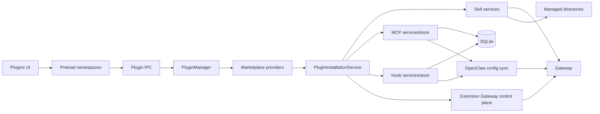
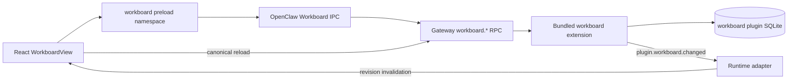
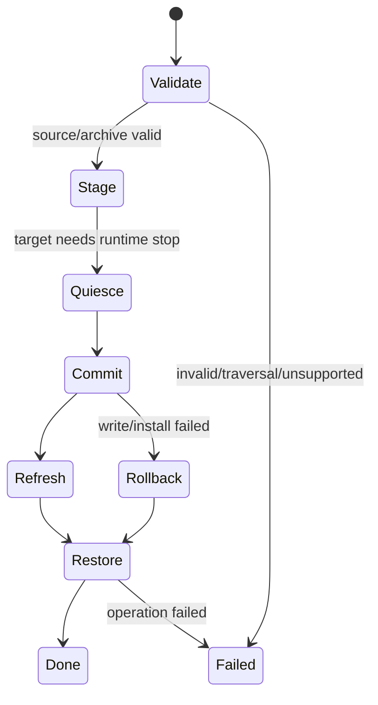

# Plugin 系统

本文按 OpenClaw `v2026.9.2` 的 Gateway plugin control plane、plugin installed index、plugin bundle contract、plugin IPC/UI、shared contracts、OpenClaw config sync 和内置 manifest 重写。JustDo 中“Plugin”是产品聚合概念，包含 Skill、MCP、Hook、Extension 与 Marketplace；它们没有统一的数据权威或安装方式。

## 1. 能力与所有权

| 类型        | 运行时权威                            | JustDo 持久化/文件职责                            | 用户操作                            |
| ----------- | ------------------------------------- | ------------------------------------------------- | ----------------------------------- |
| Skill       | Gateway `skills.status/update`        | bundled manifest；用户 Skill 目录导入/删除        | 查看、启停、导入、删除、安装依赖    |
| MCP server  | OpenClaw config/runtime               | SQLite `mcp_servers`；extension-provided 只读发现 | CRUD、启停、probe、resource read    |
| Hook        | Gateway `hooks.status`                | SQLite `openclaw_hooks` + 用户 Hook 文件          | 导入、启停、删除                    |
| Extension   | Gateway `plugins.*` + installed index | 本地导入时桥接 OpenClaw CLI                       | import、启停、配置、删除            |
| Marketplace | provider adapter                      | 默认无 provider；不保存第三方响应秘密             | source/search/detail/install/update |

不能把 Skill file scanner 当元数据权威，也不能把 Marketplace item 当安装完成的证明。实际状态必须回到对应 runtime/store 查询。

## 2. 架构

## 3. Shared 合约

`src/shared/plugins/marketplace.ts` 定义：

- `PluginKind`: `extension`、`skill`、`mcp`、`hook`；
- 稳定 error code：invalid request/response、source not found、unsupported kind、provider/install failure 等；
- source、summary、detail、query/cursor、install request/response；
- install state `available`、`installed`、`unavailable` 和 operation `install`、`update`。

`src/shared/plugins/skills.ts` 定义 Gateway skill source 及哪些 source 是用户拥有。删除权限必须以 `isUserOwnedSkillSource` 判断，不能凭 UI 分组或路径字符串猜测。

## 4. 内置 Skills

`resources/builtin-skills.json` 是当前内置集合的权威：

| ID                  | 默认状态 |
| ------------------- | -------- |
| `data-analysis`     | enabled  |
| `diagram-generator` | enabled  |
| `frontend-design`   | enabled  |
| `docx`              | enabled  |
| `pdf`               | enabled  |
| `pptx`              | enabled  |
| `skill-creator`     | enabled  |
| `xlsx`              | enabled  |

manifest 的 `disableOpenClawDefaults: true` 表示只使用 JustDo 声明的 bundled defaults；不要在文档或 UI 中硬编码数量。打包同步测试验证 manifest 与实际 resources。

## 5. Skill 系统

与 Skill 路径相关的 Gateway 启动环境只显式固定 `OPENCLAW_STATE_DIR`、
`OPENCLAW_CONFIG_PATH` 与 `OPENCLAW_BUNDLED_SKILLS_DIR`。OpenClaw 原生把
`<stateDir>/skills` 作为 shared managed Skill root，JustDo 不再引入单独的用户 Skill root
环境别名，也不再把同一路径重复写入 `skills.load.extraDirs`。

### 5.1 状态查询与启用

`OpenClawSkillService` 通过 adapter 调用 `skills.status`，返回 workspace/managed dir 和每个 Skill 的 source、eligibility、disabled/allowlist、missing requirements、install options 与 config checks。启停用 `skills.update`，Gateway 返回值是最终成功依据。

Renderer 的 `skillSlice` 只是列表/loading/error 缓存。`skillGroups` 和 `skillRequirements` 负责展示分组与缺失项，不决定运行资格。

### 5.2 文件导入与删除

`OpenClawSkillFiles` 只处理用户文件：读取 Skill 目录/压缩包、验证结构、复制到 `<stateDir>/skills`、拒绝目标逃逸或覆盖受保护来源。`OpenClawSkillFileService` 把操作包在 `ManagedDirectoryOperationCoordinator` 中：

1. 解析准确目标；
2. 执行导入/删除；
3. 遇 Windows lock 时识别锁定进程；若仅由受管 Gateway 占用，必须先在 config mutation queue 中取得原生 suspension，才可 stop/mutate/start；
4. 必要时只停止属于应用/Gateway 的进程；
5. 重试并恢复先前 runtime 状态；
6. 返回结构化 code/syscall/path 的本地化错误。

删除先把 live Skill 原子移动到对应 skill root 同卷的 `.justdo-skill-trash/delete-*` 事务目录，避免递归删除被占用时留下半残目录。`OpenClawSkillFiles` 初始化及后续文件操作会机会式重试清理已知 trash root；清扫只处理该 root 的直接 `delete-*` 子目录，未知条目和 live skills 不受影响，单项清理失败也不能阻断正常 Skill 操作。

它不负责列举所有 Skill 或修改运行态 metadata。

## 6. MCP

用户 MCP 记录存在 `mcp_servers`：id、唯一 name、description、enabled、transport type、config JSON 和时间戳。`McpStore` 负责数据库，`McpConfigSyncService` 将记录写进 OpenClaw config，并保留 `enabled` 状态。若用户在对话中让 OpenClaw 通过原生能力新增 `mcp.servers`，Main 会在插件列表刷新和非 MCP mutation 的配置同步前发现尚未入库的 server，保存到 `mcp_servers` 后再参与同步；JustDo 自己执行 create/update/delete/setEnabled 后的同步不读取尚未改写的旧配置，避免撤销删除或在重命名后复活旧名称。发现逻辑只新增缺失 name，不以配置文件缺失为由删除数据库记录。原生配置中 JustDo 表单尚未建模的 `cwd`、OAuth、TLS、tool filter 等字段也随记录保存并合并回配置，避免重启后降级。

“设置 → 配置”提供用户 MCP Server 的默认单请求 timeout，单位为秒，默认 60，范围 1–86400。该值保存在 `agentRuntimeSettings:v1`；“编辑 MCP 服务”在表单末尾显示当前 Server 的覆盖值，未配置覆盖时直接显示当前全局值。仅在用户改为不同值时写入该记录的 `config_json.requestTimeoutSeconds`，未修改则继续继承全局配置。配置同步按“单 Server 覆盖 → 全局默认”的优先级换算为毫秒并写入 `mcp.servers.<name>.requestTimeoutMs`；它控制已连接 Server 的请求等待，不等于 `connectionTimeoutMs`。Extension 自带的只读 MCP Server 由 Extension 配置负责，不套用此用户 Server 默认值。

主要能力：

- create/update/delete/setEnabled 后触发串行 config sync；
- `probe` 以真实 transport 检查连接和 tools/resources；
- `readResource` 通过 Main/SDK 读取，Renderer 不直接连接 server；
- `discoverExtensionMcpServers` 读取已启用 extension 提供的 server，作为只读来源，不能重复保存为用户 row。

stdio command、args、env 与 remote URL 都是高风险输入：UI 隐藏不是安全措施，Main 必须 validate；credential 不进入日志或 marketplace response。

## 7. Hooks

Hook 元数据/启用状态在 `openclaw_hooks`，文件位于受管目录。一个本地 Hook 至少包含 `HOOK.md`，入口支持 `handler.ts`、`handler.js`、`index.ts`、`index.js`；支持 `.zip`、`.tar`、`.tar.gz`、`.tgz` 导入。

JustDo 的 Gateway 是单文件 bundle，无法依靠 `import.meta.url` 推导 OpenClaw 内置 Hook 目录；启动环境显式设置 `OPENCLAW_BUNDLED_HOOKS_DIR=<runtime>/dist/bundled`。

文件层规范化 hook id、拒绝路径逃逸、拒绝覆盖 built-in 或已安装 Hook；config sync service 只把 store 中已启用且可用的 hook 映射到 OpenClaw。启停和删除都进入 config mutation queue。删除先把目录原子移动到受管根目录之外的隔离区，再修改 SQLite 并同步；同步失败时恢复数据库记录和目录，成功后清理隔离区。

## 8. Extensions

Extension 列表、启停和卸载以 Gateway `plugins.list`、`plugins.setEnabled`、`plugins.uninstall` 为唯一运行态权威；JustDo 不再从目录或 `plugins.entries` 推断最终状态。列表同时投影 bundled、installed-index 和错误状态，只有 Gateway 标为 removable 的非产品托管插件才显示删除操作。

裁剪和预编译后的 bundled extension 根位于运行时的 `dist/extensions`；Gateway 与受管
OpenClaw CLI 都通过 `OPENCLAW_BUNDLED_PLUGINS_DIR` 固定到该目录，不能指向源码布局的
`<runtime>/extensions` 并依赖 OpenClaw 的回退扫描。

本地导入是 Gateway 当前未提供 path/archive mutation 的唯一例外，因此通过受管 OpenClaw CLI 执行 `plugins install`。安装前由锁定版本运行时的 `capability-artifact` 与 `capability-summary` 模块扫描暂存内容，Renderer 展示完整 declared surface、operator grants、source/integrity 与 trust；只有用户提交本次 surface 的 `reviewToken` 且复查结果仍一致，CLI 才使用 `--accept-capabilities` 提交安装。OpenClaw `v2026.9.2` 同时支持原生 code plugin、Codex/Claude/Cursor bundle、Agent Plugins manifest 及允许的 manifestless bundle；JustDo 只负责来源选择、审查界面、进度、进程协调与错误脱敏，最终 schema、capability 和 installed-index 事务完全由 OpenClaw 安装器负责。

安全与事务约束：

- archive 必须是 OpenClaw CLI 支持的 ZIP、TAR、TAR.GZ 或 TGZ；临时解包仅用于安全检查和结果 id 提示，完整合法性由 OpenClaw installer 决定；
- code plugin 使用 `openclaw.plugin.json`；bundle id 按 OpenClaw 的 name/目录 slug 规则投影，不能要求所有包都存在 native manifest；
- 命令 cwd/env 来自 manager，timeout 为 300 秒，输出最多保留 64K；
- 所有 config mutation 进入 exclusive queue；目录锁处理复用 coordinator；
- Gateway transport 不可用时，列表回退到本地已安装目录，启停/卸载回退到冷态 CLI，以便修复导致 Gateway 无法启动的第三方插件；Gateway 返回的 policy/validation 错误不能触发该回退；
- `plugins.uninstall` 返回 v2026.9.2 明确的“目录仍存在且插件保持 disabled/tracked”状态或底层 EACCES/EPERM/EBUSY 时，先核对 Gateway inventory 与操作前保存的本地路径：已提交删除则禁止重复卸载，只恢复 Gateway；仍安装则沿用该路径进入 lock-aware 冷态 CLI，报告外部占用者，或在仅 Gateway 持锁时安全 stop/retry/start。普通 `UNAVAILABLE` 不得被猜测成目录锁；
- `plugins.setEnabled` 要求能力同意时，Renderer 展示 `plugins.inspect` 返回的完整声明、新增能力和 trust 原因，并仅用该次 `reviewToken` 重试；Gateway warnings 必须传回 UI；
- `ask-user-question` 是受保护的内置交互 extension；其启用状态与等待时限由 config sync 管理，不能从通用扩展页禁用或删除；
- `automation-permission` 是受保护的内置安全 extension，不能从通用扩展页重配置、禁用或删除；Gateway 每次连接都必须验证其 trusted policy 已加载；
- 安装成功后重启 Gateway，再由 `plugins.list` 重新列举；CLI 输出或目录存在都不能替代 Gateway 最终状态。

旧版 Extension 与 Hook 不提供迁移保证；升级后按 v2026.9.2 当前 inventory 清理失效的 `entries/installs/allow/deny/slots`，用户可从内网市场重新安装。用户 Skill 文件目录和 SQLite 中的 MCP server 记录属于必须保留的数据，配置同步只能做当前 schema 所需的字段映射，不能删除这些数据。对话中由 OpenClaw 自行安装的 Extension/Skill 由 Gateway 原生 inventory/skill status 重新列举；MCP 则先从原生配置回流 SQLite，因此三者在刷新插件页和重启后都能恢复显示。

## 9. AskUserQuestion Extension

JustDo 使用内置 `ask-user-question` extension 注册模型工具 `AskUserQuestion`，并在受管 `tools.deny` 中关闭 OpenClaw 原生 `ask_user`，避免同一会话出现两套相近但不兼容的协议。工具描述沿用原生能力最重要的决策边界：只有当模型已被一个确实属于用户、且无法从请求、代码、上下文或合理默认值判断的决定阻塞时才能提问；禁止询问是否继续、是否执行下一步或要求确认模型自己的计划；除非多个答案必须一起提交，否则优先一次只问一题。

extension 保留产品原有的丰富结构：一次 1–8 题、每题 2–4 个稳定 id 选项、单选/多选、Other、选项附带必填输入、默认项以及逐题跳过。`timeoutEnabled` 默认关闭，此时必须等待用户；显式开启后使用 runtime settings 中的分钟数。所有题都有默认项时超时自动选默认值，否则把控制权交还模型自行判断。

交互完全使用 OpenClaw plugin API，不再存在 callback server、host controller、共享 secret、端口或额外 HTTP transport：

pending promise、同一 session 只允许一个待答请求、timeout/default、run abort 和最终答案校验都由 extension 自己负责；Gateway service 停止时会取消全部等待。它通过 `gatewayEvents.emit` 发布 `plugin.ask-user-question.requested/resolved`，并提供 `askUserQuestion.list/resolve` 两个有 scope 的 Gateway RPC。Main 只负责严格解析、session 投影、Renderer IPC 和提交前的本地校验，不保存第二份权威状态。adapter 在连接恢复后用 `list` 找回同一 Gateway 进程中的等待项，Renderer reload 再通过 interaction replay 获取投影。

文件范围与 exec reviewer 使用 OpenClaw v2026.9.2 原生 session permission mode。`automation-permission` 只补足原生 session mode 尚未覆盖的模型可见 scheduled-task mutation，并在每次调用时读取原生会话值，不维护第二份权限状态。第三方插件若使用 `plugin.approval.*`，仍作为独立风险域展示和解决，不能复用 exec grant。

`justdo-runtime-bridge` 是随产品安装并受保护的内置 OpenClaw extension。manifest 显式声明 `activation.onStartup: true` 和 hook capability，确保未配置 embedding 或关闭 memory search 时，历史 RPC 与进度 hooks 仍进入 Gateway 的活动插件注册表。仅有 `plugins.entries.<id>.enabled: true` 或能力探测期间的初始化日志不能证明启动激活。它只使用 v2026.9.2 支持的 plugin API，承担三项不应继续做 runtime patch 的集成：

- 从 agent hooks 发布 `preparing`、`waiting_model` 有界进度事件。`model_call_started` 也会出现在成功的工具轮次之后，不是重试信号；插件不再根据同一 run 的调用次数推断 `retrying`；
- 注册 `justdo-runtime-bridge` remote embedding provider，保留 SSRF policy 与 eligible env proxy。批量响应有 `index` 时按请求顺序恢复向量，并拒绝重复、越界或混用有索引/无索引的响应；完全无索引的响应按位置处理；
- 注册 `justdoRuntimeBridge.historyDetails` 的 `operator.read` RPC，只按最多 250 个请求 id 从原生 transcript 投影 tool input 和 compaction detail；并注册 `justdoRuntimeBridge.historyMessage`，只接受session key、Gateway给出的message id、transfer id和递增cursor，在`chat.message.get`报告`oversized`或超过frame预算时按不超过1,048,576字符的块返回原生SQLite transcript的active-branch消息。一次transfer固定同一序列化快照且完成后释放；它不读取inactive branch、不列举消息，也不接受文件路径。

该 RPC 不是通用文件读取器，不返回 transcript 路径，也不接受任意 session 文件路径。Adapter 先用 `chat.history` 获取原生 display projection，仅对缺失 detail 做补充查询。Renderer 对 tool input 和 compaction detail 均按每批最多 250 个去重 ID 顺序查询；一个批次失败不丢弃历史或其他批次的补全结果。

本地扩展在资源同步后预编译到 `dist/extensions`，`package.json` 的入口同时改为 JavaScript。`beforePack` 会重新同步最新源码，因此必须再次等待预编译完成；此阶段编译失败会阻止打包，避免交付陈旧代码或重新依赖 TypeScript 即时编译。

## 10. Marketplace Adapter

当前 `createPluginMarketplaceService` 传入空 provider 数组，因此开源构建默认没有 marketplace source。企业构建通过公司 SDK Provider 接入，目前只声明 Extension、Skill、MCP；Hook 保留通用市场入口和 Provider 扩展点，但没有历史市场数据兼容。Gateway `plugins.list` 只以离线模式读取随 OpenClaw 打包的官方目录元数据，不刷新其默认 ClawHub feed；生成的 OpenClaw 配置也关闭默认远程模型目录刷新。外部目录网络访问只能由显式注册或配置的 product provider 发起。

Provider contract：source metadata、search、detail、prepareInstall。Service 的防御性规则包括：

- source id/name 非空且不超过 256，supportedKinds 只能是 Extension、Skill、MCP、Hook，id 不可重复；企业 Provider 只声明实际支持的 kind；
- query limit 默认 20、范围 1..100；cursor 仅允许恰好一个 source；
- item 的 kind、必填/可选字符串、tags、install state、readme（最大 1,000,000）和 requirements 均验证；
- provider 可返回与市场目录 id 不同的 `runtimeId`，Renderer 用它与实际安装列表对账，安装请求仍使用 provider 的目录 id；
- 跨 source 的同 kind/plugin id 不可重复；
- provider 异常转换为稳定、脱敏的 `MarketplaceError`；
- response 只投影公开字段，丢弃 token/internal URL 等多余属性。

安装流程：公司 SDK 把 Extension/Skill 下载到本地目录，provider `prepareInstall` 返回匹配 kind 的 `sourcePath` 和可选 cleanup；MCP 返回结构化配置。`PluginInstallationService` 再调用对应 OpenClaw/本地配置导入接口。通用层不限制 Extension 目录内容，也不兼容旧 Extension/Hook 市场数据；格式由当前 OpenClaw 安装器判断。无论安装成功或失败都尝试 cleanup 临时目录。

Marketplace 返回的 `installState` 只描述目录侧状态，不能覆盖 OpenClaw/JustDo 的实际安装 inventory。安装完成后 UI 先等待目标 kind 重新列举；只有 `runtimeId`（缺失时用目录 id）出现在实际 inventory 中才显示为已安装，刷新失败不能保留乐观的“已安装”状态。

## 11. Workboard

OpenClaw v2026.9.2 的 bundled `workboard` extension 保留在桌面 runtime prune allowlist 中，并由 JustDo config sync 在用户尚未做出选择时默认启用。它不是 JustDo 运行所必需的受管理扩展：用户可以在“插件 / 扩展”中关闭或重新开启，config sync 必须保留该选择；主页侧栏的任务看板入口只在扩展启用时显示。Gateway plugin 自己的 SQLite 是看板、卡片和执行关联的唯一权威；JustDo 不复制 Workboard 表，也不把卡片写入 Redux。

v2026.9.2 将官方 Workboard 页面迁入 extension 自带的 `controlUi` browser bundle，但该 bundle 依赖 OpenClaw Control UI plugin host。JustDo Renderer 不实现或注入该宿主，也不直接执行 runtime extension 的浏览器代码；桌面端保持 React 产品页面和最小 preload bridge，同时复用同一组稳定的 Gateway RPC 与变更事件。

主页侧栏在“定时任务”下方提供 Workboard 入口。Renderer 通过受限的 `window.electron.workboard` namespace 调用 Main，Main 只映射卡片 list/create/update/move/delete/archive/comment/start/stop、board list、dispatch 与有界的 session resolution，不开放任意 Gateway method。编辑请求携带 Gateway 返回的 `expectedUpdatedAt`，让 plugin 的并发冲突检查继续生效。

卡片点击先进入详情抽屉，编辑是独立动作。详情展示状态、Agent、Task/Run/Session、claim、执行尝试、评论、证明、产物、附件、诊断、worker 日志/协议、自动化信息和事件，并承载移动、归档、停止、删除和添加操作备注。

看板首屏提供可收起的中英文使用引导，用产品语义解释“待梳理→准备→执行→验收”流程，不要将 upstream 的 `triage` 等内部状态名直译给用户。九个状态列始终使用同一套 `minmax` 响应式网格：宽窗口自动等分并显示全部列，窄窗口中列宽随容器收缩，只有达到最小可读宽度后才产生横向滚动。不得为普通窗口回退到比宽窗口更大的固定列宽。

卡片的 `sessionKey`/`execution.sessionKey` 指向 OpenClaw 原生执行会话，不进入 JustDo 普通会话列表。Renderer 对已关联卡片在卡面和详情中都提供明确的“查看会话”入口，先将 provisional key 有界解析为 canonical key，再通过既有 Gateway chat transport 读取历史。Workboard 使用独立 Worker 指令作为首条 user message，而不是标准 `[Subagent Task]` envelope；会话抽屉收到这条权威 `session.message` 后必须立即解除初始加载态，使用户消息与后续增量输出同时可见。启动 RPC 返回的 session key 会被保留，并立即打开该会话。

卡片详情和会话抽屉按卡片执行状态提供“停止执行”，请求携带所查看执行的 session/run/task 身份。Main 在停止前核对身份，避免旧抽屉误停新关联执行；已结束的卡片不再改写。只有所有关联 task 和 session 均已停止或确认不活跃后，才以 `expectedUpdatedAt` 将卡片转为 blocked，不通过强制 release 伪造停止结果。应用重启后的陈旧 running 记录，需要 task 已终止或不存在且 `sessions.list.hasActiveRun` 明确为 `false` 才能收敛；未知 task 状态不视为终态。

主页入口读取插件启用状态，异步目录查询不得覆盖更新的用户开关操作；成功查询发现插件不再存在时隐藏入口，连接暂不可用时保留上次状态。

只有处于 backlog/todo/ready、没有 session/task link 且没有未过期 claim 的卡片才显示“启动”，避免对 triage、review 或已领取卡片发送必然失败的 start 请求。已关联卡片若要重做，必须在编辑中明确解除旧 session link，再移到可启动状态。

变更事件只转发 epoch/revision 失效信号；Renderer 收到后重新读取 canonical snapshot。Gateway 客户端重新握手成功时 adapter 也发送一次不带 revision 的失效信号，用于清除断线期间留下的错误并恢复页面数据。编辑、拖拽或写操作进行中时延迟刷新，结束后补一次读取，避免实时事件覆盖本地交互。插件不可用、Gateway 未连接或 RPC 失败时页面显示可恢复错误，不创建本地伪数据。

## 12. Renderer

`PluginsView` 切换 Skill/MCP/Hook/Extension。Marketplace 分别嵌入各管理页面；未声明对应 kind 的 Provider 时显示未配置状态。Skill 与 MCP 有已挂载 Redux slice；Hook/Extension/Marketplace 主要由组件/service 局部状态管理。文档不能把未 mount 的状态描述为全局 store。

UI 应显示 source、eligible/missing、install state 和操作结果；破坏性删除需要明确目标。安装进行中禁用重复提交，extension progress 允许刷新后重新列举实际状态。

## 13. 安全模型

- 只允许 Main 接触受管路径、archive、子进程、MCP transport 与 config 文件。
- 所有 archive 防 traversal/symlink；所有 delete 验证 resolved target 位于确切 managed root。
- 不自动安装任意 Skill 声明的 shell script；安装选项先展示来源和风险。
- Marketplace provider 是不可信输入；响应 normalize 后才进 Renderer。
- MCP env、Extension config、Skill API key 是 secret，不输出完整 config。
- runtime 在目录操作期间被停止时必须在 finally 路径按原状态恢复。

## 14. 变更与测试

新增 plugin kind 或 provider 时同步 shared union、installer 注册、IPC/preload/declaration、UI、config owner、删除语义和测试。现有测试覆盖 marketplace validation/cleanup/redaction、安装器冲突、Skill/Hook archive/path/lock、extension import/registry、`AskUserQuestion` 状态机与 MCP discovery/probe。运行时行为变化还要更新 capability matrix 与 patch tests。

## 15. 各类型生命周期对照

| Kind        | 发现/列表                    | 安装或导入                       | Enable           | 删除                   | Runtime 生效               |
| ----------- | ---------------------------- | -------------------------------- | ---------------- | ---------------------- | -------------------------- |
| Skill       | Gateway skill API            | 受管 skill 文件事务              | Gateway update   | 验证 user-owned 后移除 | Gateway skill refresh/API  |
| MCP         | SQLite + extension discovery | 表单/配置记录                    | SQLite flag      | 删除 user-owned row    | config sync + probe        |
| Hook        | Gateway `hooks.status`       | archive/目录导入                 | SQLite flag      | path-safe 删除         | config sync/runtime reload |
| Extension   | Gateway `plugins.list`       | OpenClaw CLI path/archive import | Gateway mutation | Gateway uninstall      | Gateway reload/restart     |
| Marketplace | provider 聚合                | prepare payload → kind installer | 由目标 kind 决定 | 由目标 kind 决定       | 安装后重新查询目标权威     |

统一 UI 不代表统一生命周期；尤其不能实现一个“删除 plugin”通用 handler 接收任意 kind/path。

## 16. 文件事务状态机

临时目录 cleanup 和 runtime 恢复放在 `finally` 语义中。目标 path 必须在解压后再次 canonicalize，拒绝 traversal、symlink escape 和不允许的根目录。已有同名项的 replace/冲突语义必须由具体 manager 明确，不能靠文件覆盖默认决定。

## 17. Secret 与配置投影

MCP env、Extension configuration、Skill credential 和 Marketplace provider 内部字段不得原样返回 UI/log。Renderer 需要的是是否配置、缺失字段名或稳定错误码，而不是 secret value。Config sync 只写 JustDo 管理区域并保持其他用户配置；probe 错误需脱敏后再进入 UI。

## 18. 故障与恢复

| 故障                         | 恢复原则                                              |
| ---------------------------- | ----------------------------------------------------- |
| Archive 验证失败             | 未进入 managed root，不改变 runtime                   |
| Commit 中断                  | 回滚 staging/目标，保留可诊断错误                     |
| Runtime stop 后安装失败      | 恢复原运行状态，不能让 cleanup error 覆盖主错误       |
| Config sync 失败             | 产品记录可保留为未生效/错误，UI 不宣告 runtime ready  |
| AskUserQuestion 事件连接中断 | adapter 重连后用 `askUserQuestion.list` 恢复 pending  |
| Marketplace provider 异常    | 隔离 source、返回脱敏稳定错误，不污染其他 source 结果 |

## 19. Plugin Definition of Done

新增能力必须证明 source ownership、manifest/schema validation、managed path、冲突/replace、enable 与 runtime apply、删除/rollback、secret redaction、IPC/preload/UI consumer 和打包资源。若 Marketplace 只是新增 provider adapter但没有 composition 注册，文档与 UI 必须继续显示“未配置”，不能写成已有目录内容。
