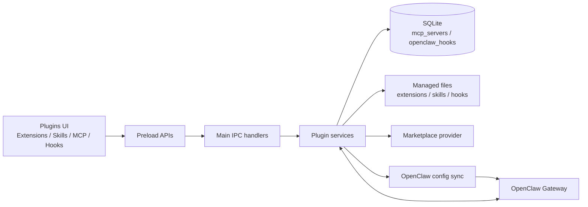
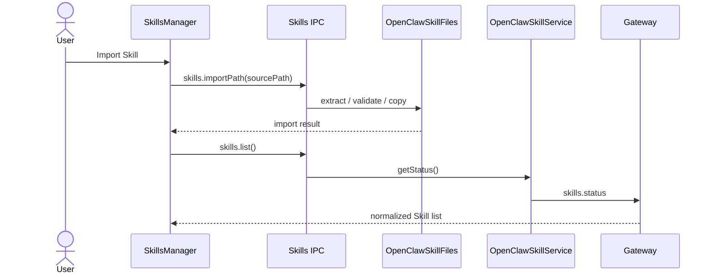
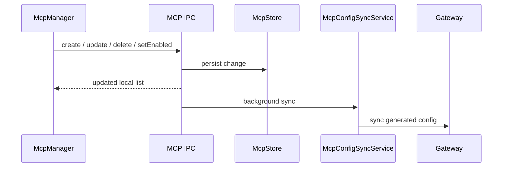

# Plugin 系统

JustDo 的 Plugins 页面统一管理 Extensions、Skills、MCP 和 Hooks。JustDo 负责桌面 UI、本地持久化、文件导入、配置编辑和权限边界；OpenClaw Gateway 负责能力发现、运行时加载和 Agent 执行语义。

Marketplace 是能力分发入口，不是第五种运行时能力。Extension 可以打包 Skill、MCP、Hook 或自定义工具，但这些能力在安装后仍按各自的状态权威和生命周期管理。

## 能力模型

| 类型        | 主要用途                                      | 状态权威                                         | 本地持久化                          | 用户管理入口                 |
| ----------- | --------------------------------------------- | ------------------------------------------------ | ----------------------------------- | ---------------------------- |
| Extension   | 打包并分发一个或多个运行时能力                | Extension manifest、OpenClaw 配置和本地 registry | Extension 安装目录、配置文件        | 导入、配置、启用、删除       |
| Skill       | 向 Agent 提供指令、工作流和资源               | Gateway `skills.status`                          | bundled resources 或用户 Skill 目录 | 导入、市场安装、启用、删除   |
| MCP         | 连接 stdio/HTTP MCP server                    | SQLite `mcp_servers`，同步到 Gateway 配置        | SQLite                              | 创建、编辑、探测、启用、删除 |
| Hook        | 在命令、会话或 Gateway 生命周期事件触发自动化 | Hook 文件发现 + SQLite `openclaw_hooks`          | bundled/managed Hook 目录和 SQLite  | 导入、启用、删除             |
| Marketplace | 搜索、详情和安装分发包                        | configured marketplace provider                  | 搜索结果仅为 UI 临时状态            | 搜索、查看、安装             |

## 总体架构

Renderer 只通过 preload bridge 发起操作，不读取插件文件、不访问 SQLite，也不执行第三方代码。Main process 校验 IPC 输入并调用 `src/main/plugins/` 下的领域服务。Gateway 是 Agent 实际可见和可运行能力的最终运行时权威。

## 关键边界

| 层                               | 职责                                                                |
| -------------------------------- | ------------------------------------------------------------------- |
| `src/renderer/features/plugins/` | 列表、分组、表单、确认弹窗和临时 UI 状态                            |
| `src/main/preload.ts`            | 暴露窄化的 Extensions、Skills、MCP、Hooks API                       |
| `src/main/ipc/openclaw/`         | 校验 payload、匹配当前状态并调用领域服务                            |
| `src/main/plugins/extensions/`   | Extension 导入、registry、配置、host lifecycle 和交互路由           |
| `src/main/plugins/skills/`       | Gateway Skill RPC 和用户 Skill 文件操作                             |
| `src/main/plugins/mcp/`          | MCP SQLite store、probe、resource read 和配置同步                   |
| `src/main/plugins/hooks/`        | Hook SQLite store、文件导入/删除和配置同步                          |
| `src/main/plugins/marketplace/`  | provider-neutral marketplace facade 和 provider adapter             |
| `src/main/plugins/installation/` | 自定义导入与 Marketplace 共用的安装/更新请求、结果和 installer 路由 |

跨进程 channel 和 payload 优先定义在 `src/shared/`。Renderer service 负责把 IPC 结果归一化为 UI 类型，不应成为运行时状态权威。

## 所有权与操作权限

卡片上的启用和删除操作必须反映能力所有权，不应仅根据“是否内置”推断。

| 能力来源                         | 可启用/禁用  | 可在当前页面删除 | 说明                         |
| -------------------------------- | ------------ | ---------------- | ---------------------------- |
| bundled                          | 是           | 否               | 随应用或 runtime 提供        |
| managed/imported                 | 是           | 是               | 用户显式导入或安装           |
| workspace/project/personal Skill | 是           | 是               | 文件属于用户工作区或用户目录 |
| extra-dir / plugin-owned         | 由所有者决定 | 否               | 应删除或禁用对应 Extension   |
| unknown                          | 保守处理     | 否               | 未识别来源不得执行破坏性操作 |

删除操作由 Main process 根据当前权威状态重新匹配目标。Renderer 不传递可直接删除的任意文件路径。

## Extensions

Extension 是原生 OpenClaw 扩展包，manifest 为 `openclaw.plugin.json`。本地导入支持目录、ZIP、TAR、TAR.GZ 和 TGZ；导入服务负责解压、校验 manifest、准备 runtime、安装缺失依赖、写入配置并按需重启 Gateway。

Extension 可以声明配置字段和敏感字段。Renderer 只提交字符串值；Main process 限制字段数量、路径长度和值长度，并由 Extension service 写入配置。敏感值不得进入日志或 UI 明文回显。

Extension 的启用、删除和配置更新由 `OpenClawExtensionImportService` 统一处理。由 Extension 提供的 Skill、MCP 或 Hook 不应在子能力页面直接删除，否则可能破坏 Extension 包完整性。

主要 preload API：

- `extensions.list()`
- `extensions.importPath(request)`
- `extensions.setEnabled(request)`
- `extensions.updateConfiguration(request)`
- `extensions.delete(request)`
- `extensions.onImportProgress(callback)`

## Skills

### 状态与来源

Gateway `skills.status` 是 Skill 列表、来源、启用状态和依赖检查的权威。JustDo 本地文件服务只负责导入和删除文件，不能判断某个 Skill 是否已被 Gateway 加载。

OpenClaw precedence 为 `openclaw-extra` < `openclaw-bundled` < `openclaw-managed` < `agents-skills-personal` < `agents-skills-project` < `openclaw-workspace`。UI 按来源分组，并把更具体、优先级更高的来源显示在前。

### 当前内置 Skills

`resources/builtin-skills.json` 当前声明 15 个 Skill，其中 `agent-browser` 默认禁用，其余 14 个默认启用。`disableOpenClawDefaults` 为 `true`，表示 runtime 以 JustDo 声明的内置 Skill 清单为准。

内置 Skill 位于 `resources/skills/<id>/`。新增、删除或重命名内置 Skill 时必须同步 `resources/builtin-skills.json`、README、打包规则和相关测试。

### 导入与删除

用户可从目录或 ZIP、TAR、TAR.GZ、TGZ 导入 Skill。压缩包先解压到临时目录，校验 `SKILL.md`、拒绝符号链接，再复制到 Gateway state 的 managed Skill 目录。用户数据不应在应用升级时被覆盖。

Skill 卡片仅对 `openclaw-workspace`、`agents-skills-project`、`agents-skills-personal` 和 `openclaw-managed` 来源提供删除。删除请求携带 `id + source`，Main process 从最新 `skills.status` 精确匹配条目，并校验目标为包含 `SKILL.md` 的 `skills/<skill-id>/` 目录。`openclaw-bundled`、`openclaw-extra` 和 `unknown` 来源不可删除。

主要 preload API：

- `skills.list()`
- `skills.setEnabled({ id, enabled })`
- `skills.importPath(sourcePath)`
- `skills.delete({ id, source })`

市场操作不属于 Skill 专用 API，统一通过 `marketplace.listSources/search/detail/install`。

### Skill 数据流

## MCP

MCP server 定义存放在 SQLite `mcp_servers`。`McpStore` 是用户配置的本地权威，支持 stdio/HTTP transport、启用状态和 transport config。创建、更新、删除或切换启用状态后，`McpConfigSyncService` 把已启用 server 写入 OpenClaw 配置。

MCP 的已安装视图同时展示“用户配置”和“扩展提供”两组。`mcp:list` 先独立返回 SQLite 用户配置，不等待扩展发现。扩展 MCP 由 Main process 通过 OpenClaw `plugins inspect --all --json` 读取已安装 Bundle 的 MCP 清单，再由独立 IPC 异步返回，不复制到 SQLite。Renderer 对这些条目只读展示，标注所属扩展及其启用状态；启停、更新和删除仍由 Extension 生命周期管理。扩展清单发现失败不影响用户配置展示。

MCP probe 和 resource read 在 Main process 执行。Renderer 不启动子进程、不直接请求 MCP endpoint，也不读取 server credential。配置同步通过 `mcp:config:syncStart` 和 `mcp:config:syncDone` 广播进度。

主要 preload API：

- `mcp.list()`
- `mcp.create(data)` / `mcp.update(id, data)` / `mcp.delete(id)`
- `mcp.setEnabled({ id, enabled })`
- `mcp.syncConfig()`
- `mcp.probe(id)`
- `mcp.readResource({ id, uri })`

## Hooks

Hook 是在特定生命周期事件运行的自动化脚本。列表由 bundled Hook 目录和 Gateway state 下的 managed Hook 目录共同发现；启用状态存放在 SQLite `openclaw_hooks`，再同步到 OpenClaw 配置。

Hook 包根目录必须包含 `HOOK.md` 和 `handler.js`。本地导入支持目录、ZIP、TAR、TAR.GZ 和 TGZ。Main process 校验 frontmatter name、拒绝符号链接，并拒绝与 bundled Hook 同名的包。导入只安装文件，不自动启用。

UI 按所有权分为自定义、内置、插件提供和其他 Hook。只有 `openclaw-managed` 自定义 Hook 可以删除；bundled 和 plugin-owned Hook 不提供独立删除入口。删除时先清理 SQLite 状态并同步配置，再删除经过 managed root 边界校验的真实 Hook 目录。

主要 preload API：

- `hooks.list()`
- `hooks.importPath(sourcePath)`
- `hooks.setEnabled({ id, enabled })`
- `hooks.delete(id)`

## Marketplace

Renderer 不直接访问 marketplace endpoint。`PluginMarketplaceService` 根据 `PluginKind` 和 configured provider 执行 search/detail/install，并把 provider DTO 转为稳定的应用模型。四类 Marketplace 应复用相同 facade，而不是把 provider 协议泄漏到 renderer。

搜索结果、详情和 installing ids 是临时 UI 状态，不写入 SQLite。Provider 的 `prepareInstall()` 只负责认证、下载和生成 provider-neutral 安装载荷：Extension、Skill、Hook 返回本地包路径，MCP 返回 server 配置；临时下载可通过 `cleanup()` 在安装结束后清理。

自定义导入与市场安装最终都提交 `PluginInstallRequest` 到 `PluginInstallationService`。请求用 `kind + operation + origin + payload` 区分能力类型、安装/更新和来源，再路由到 Extension、Skill、MCP 或 Hook 的 owning installer。Provider 不直接写插件目录、SQLite 或 OpenClaw 配置，因此市场安装自然复用自定义导入已有的包校验、覆盖策略、配置同步和 Gateway restart 逻辑。

Marketplace provider、错误降级、状态机和时序详见 [16-skill-marketplace-adapter.md](16-skill-marketplace-adapter.md)。

## 配置同步

MCP 和 Hook 先写本地 SQLite，再通过 `syncOpenClawConfig` 生成 Gateway 配置。同步服务会合并并发请求、广播开始/完成事件，并把错误返回 UI。Extension 配置和启用状态由 Extension service 管理；Skill 启用和安装通过 Gateway Skill RPC 管理。

配置同步和 runtime restart 是不同动作。只有当前能力的 runtime 行为确实要求重启时，UI 才显示 restart required；不得用 renderer 本地状态假装 Gateway 已应用配置。

## 安全边界

- 安装、启用和删除必须由用户显式触发。
- Renderer 不读取、解析或执行第三方代码。
- 压缩包解压必须限制在临时目录内并拒绝符号链接；目录导入也必须校验入口和目标 root，不能信任 renderer 传入的路径。
- 删除只能使用 Main process 从权威状态解析出的路径，并再次验证所属 root 或目录结构。
- Extension 配置、MCP credential、token 和环境变量不得写入日志。
- Marketplace README 和描述不得作为可信 HTML 直接渲染。
- 插件运行时的工具权限与命令审批由 Gateway/OpenClaw 控制，JustDo 不重复实现执行语义。

## 维护规则

- 修改 Plugin 能力边界、导入/删除、配置同步或 UI 所有权时更新本文档。
- 修改 SQLite `mcp_servers` 或 `openclaw_hooks` 时同步更新 `10-data-storage.md`。
- 修改 marketplace provider 或安装状态机时同步更新 `16-skill-marketplace-adapter.md`。
- 新增 IPC 时同时更新 main handler、preload、renderer 类型和行为测试。
- 用户可见字符串必须同时添加中英文 i18n key。
- Main process 日志使用模块前缀，禁止记录 secrets 或完整 credential object。
