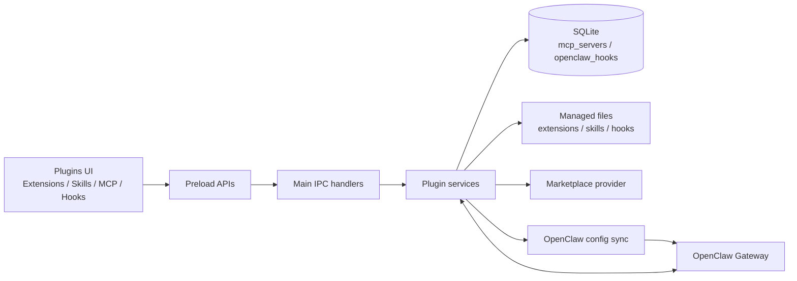
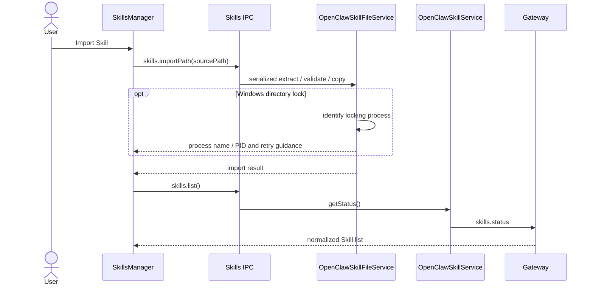
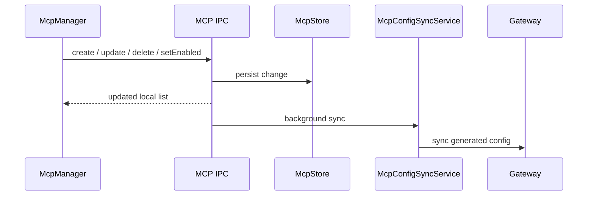

# Plugin 系统

JustDo 的 Plugins 页面统一管理 Extensions、Skills、MCP 和 Hooks。JustDo 负责桌面 UI、本地持久化、文件导入、配置编辑和权限边界；OpenClaw Gateway 负责能力发现、运行时加载和 Agent 执行语义。

Marketplace 是能力分发入口，不是第五种运行时能力。Extension 可以打包 Skill、MCP、Hook 或自定义工具，但这些能力在安装后仍按各自的状态权威和生命周期管理。

## 能力模型

| 类型        | 主要用途                                      | 状态权威                                         | 本地持久化                          | 用户管理入口                 |
| ----------- | --------------------------------------------- | ------------------------------------------------ | ----------------------------------- | ---------------------------- |
| Extension   | 打包并分发一个或多个运行时能力                | Extension manifest、OpenClaw 配置和本地 registry | Extension 安装目录、配置文件        | 导入、配置、启用、删除       |
| Skill       | 向 Agent 提供指令、工作流和资源               | Gateway `skills.status`                          | bundled resources 或用户 Skill 目录 | 导入、市场安装、启用、删除   |
| MCP         | 连接 stdio/HTTP MCP server                    | SQLite `mcp_servers`，同步到 Gateway 配置        | SQLite                              | 创建、编辑、探测、启用、删除 |
| Hook        | 在命令、会话或 Gateway 生命周期事件触发自动化 | Hook 文件发现 + SQLite `openclaw_hooks`          | bundled/managed Hook 目录和 SQLite  | 导入、启用、删除             |
| Marketplace | 搜索、详情和安装分发包                        | configured marketplace provider                  | 搜索结果仅为 UI 临时状态            | 搜索、查看、安装             |

## 总体架构

Renderer 只通过 preload bridge 发起操作，不读取插件文件、不访问 SQLite，也不执行第三方代码。Main process 校验 IPC 输入并调用 `src/main/plugins/` 下的领域服务。Gateway 是 Agent 实际可见和可运行能力的最终运行时权威。

## 关键边界

| 层                               | 职责                                                                |
| -------------------------------- | ------------------------------------------------------------------- |
| `src/renderer/features/plugins/` | 列表、分组、表单、确认弹窗和临时 UI 状态                            |
| `src/main/preload.ts`            | 暴露窄化的 Extensions、Skills、MCP、Hooks API                       |
| `src/main/ipc/openclaw/`         | 校验 payload、匹配当前状态并调用领域服务                            |
| `src/main/plugins/extensions/`   | Extension 导入、registry、配置、host lifecycle 和交互路由           |
| `src/main/plugins/skills/`       | Gateway Skill RPC 和用户 Skill 文件操作                             |
| `src/main/plugins/mcp/`          | MCP SQLite store、probe、resource read 和配置同步                   |
| `src/main/plugins/hooks/`        | Hook SQLite store、文件导入/删除和配置同步                          |
| `src/main/plugins/marketplace/`  | provider-neutral marketplace facade 和 provider adapter             |
| `src/main/plugins/installation/` | 自定义导入与 Marketplace 共用的安装/更新请求、结果和 installer 路由 |

跨进程 channel 和 payload 优先定义在 `src/shared/`。Renderer service 负责把 IPC 结果归一化为 UI 类型，不应成为运行时状态权威。

## 所有权与操作权限

卡片上的启用和删除操作必须反映能力所有权，不应仅根据“是否内置”推断。

| 能力来源                         | 可启用/禁用  | 可在当前页面删除 | 说明                         |
| -------------------------------- | ------------ | ---------------- | ---------------------------- |
| bundled                          | 是           | 否               | 随应用或 runtime 提供        |
| managed/imported                 | 是           | 是               | 用户显式导入或安装           |
| workspace/project/personal Skill | 是           | 是               | 文件属于用户工作区或用户目录 |
| extra-dir / plugin-owned         | 由所有者决定 | 否               | 应删除或禁用对应 Extension   |
| unknown                          | 保守处理     | 否               | 未识别来源不得执行破坏性操作 |

删除操作由 Main process 根据当前权威状态重新匹配目标。Renderer 不传递可直接删除的任意文件路径。

## 托管目录事务

`src/main/core/managedDirectoryOperations.ts` 是 Main process 中安装、更新和删除托管目录的公共模块。它提供：stage-copy、旧目录 backup、原子 publish、失败回滚、隔离删除、Windows ACL 修复、文件系统重试，以及结构化的 `locked` / `permission` / `filesystem` 失败原因。调用方只负责来源校验、能力清单校验和业务结果映射，不得各自再实现一套 rename/copy/rollback。

`ManagedDirectoryOperationCoordinator` 在 Skill 和 Extension 服务之间共享同一串行队列，并由每次调用明确决定是否管理 Gateway 生命周期。Skill 支持热加载，导入、覆盖和删除绝不停止或重启 Gateway；锁冲突会直接通过 Restart Manager 和系统句柄表返回占用程序名与 PID。面向用户的占用列表会过滤 Electron 主进程、renderer/utility 子进程和受管 Gateway，只保留用户能够关闭的外部程序；若诊断结果只有本软件进程，则显示内部占用与重启应用的建议，不暴露无意义的自身 PID。Extension 包变更需要重启 Gateway，因此其锁恢复可先停止 Gateway、重试目录事务，再恢复 Gateway。ACL、磁盘、路径、包格式等非锁错误保留原始分类。Extension 的实际 package stage/publish 仍由 OpenClaw CLI 执行；coordinator 会在调用 CLI 前预检目标目录占用：外部进程占用时不允许 CLI 开始修改并返回程序名和 PID，只有 Gateway 占用时才先停止 Gateway、执行操作并恢复运行。CLI 返回的无错误码 `Permission denied` / `Access denied` 也会进入同一锁诊断流程。

## Extensions

Extension 是原生 OpenClaw 扩展包，manifest 为 `openclaw.plugin.json`。本地导入支持目录、ZIP、TAR、TAR.GZ 和 TGZ；导入服务负责解压、校验 manifest、准备 runtime、安装缺失依赖、写入配置并按需重启 Gateway。

Extension 可以声明配置字段和敏感字段。Renderer 只提交字符串值；Main process 限制字段数量、路径长度和值长度，并由 Extension service 写入配置。敏感值不得进入日志或 UI 明文回显。

Extension 的导入、更新、删除、启用和配置更新由 `OpenClawExtensionImportService` 统一处理。完整的 Extension 变更（包括 CLI、配置后置条件和 Gateway 重启）串行执行，并与 OpenClaw 全局配置同步共享配置写入队列。导入、更新和删除的 CLI 目录事务还接入公共 `ManagedDirectoryOperationCoordinator`，与 Skill 文件变更互斥，并复用 Gateway 句柄释放和外部锁诊断。由 Extension 提供的 Skill、MCP 或 Hook 不应在子能力页面直接删除，否则可能破坏 Extension 包完整性。

配置同步会读取由 Extension 管理界面负责管理的 App state `extensions/`，把其中 manifest 有效的插件 ID 显式并入 `plugins.allow`。当配置已经存在 allowlist 时，JustDo 生成配置的 bundled Extension entries 也会显式并入，避免出现“entry 有配置但不在 allowlist”的启动告警。这既关闭 OpenClaw 的开放式自动发现告警，也让本地插件的信任决定持久化；已有用户 allow 条目继续保留，`plugins.bundledDiscovery="compat"` 保证该 allowlist 不会意外屏蔽 OpenClaw/JustDo 的 bundled plugins。缺失或损坏 manifest 的目录不会被自动信任。管理界面导入或重新启用插件时也会在 Gateway 重启前幂等写入 allowlist；关闭插件只修改 entry 的启用状态并保留信任，便于之后恢复；卸载则移除对应 allow 条目。

内置 `ask-user-question` Extension 通过 Main process 的 loopback HTTP callback server 把结构化问题交给 renderer。Callback server 使用动态端口，因此必须先开始监听，再把当前 URL 和 secret placeholder 同步到 Gateway 配置。每次确保 Gateway 可用时都会先检查 callback host；如果端口变化而 Gateway 仍在运行，Gateway watcher 会热重载 Extension 配置，使它不再请求上一次进程留下的失效端口。只有 secret 环境变量或 Extension manifest 变化才需要 JustDo 硬重启 Gateway。Callback URL 只在 HTTP server 确实处于 listening 状态时对外发布。

每个问题和选项都必须声明请求内唯一的稳定 `id`，格式为 `^[A-Za-z][A-Za-z0-9_-]{0,63}$`，且不能使用 `Object.prototype` 保留属性名。问题选项可以声明 `input: { label, placeholder? }`；存在 `input` 时，renderer 仅在该选项被选中后显示必填补充字段。答案以 question id 为键，`selected` 和 `optionInputs` 保存 option id，并可带独立的 `other` 文本；整个链路不使用展示文本或分隔符关联答案。Main process 和 Extension 会在各自的运行时边界校验问题、ID 唯一性和答案完整性，非法响应按拒绝处理。

Ask-user 请求没有自动选择或超时默认值。Broker 和 Extension 会等待用户明确提交或取消；调用方中止运行或 HTTP 断开时只取消对应请求，应用/Extension host 关闭时则把全部待处理请求按 `deny` 结束。Broker 按 request id 保留原始问题，Host 不信任 renderer 回传的问题定义；renderer 初始化或 reload 后通过 IPC 重放仍在等待的交互。Callback server 和 Host controller 的 start/stop 使用串行生命周期队列，避免重启期间旧 server 的关闭回调影响新实例。

主要 preload API：

- `extensions.list()`
- `extensions.importPath(request)`
- `extensions.setEnabled(request)`
- `extensions.updateConfiguration(request)`
- `extensions.delete(request)`
- `extensions.onImportProgress(callback)`

## Skills

### 状态与来源

Gateway `skills.status` 是 Skill 列表、来源、启用状态和依赖检查的权威。JustDo 本地文件服务只负责导入和删除文件，不能判断某个 Skill 是否已被 Gateway 加载。

JustDo 在 OpenClaw 配置同步时将模型可见的 Skill 目录限制设为最多 200 个、40,000 字符。OpenClaw 仍会先按运行环境和启用状态过滤 Skill；超过预算时先省略 description，再按名称顺序截断。配置同步只覆盖这两个 prompt 限制，并保留用户设置的其他 `skills.limits` 字段。

OpenClaw precedence 为 `openclaw-extra` < `openclaw-bundled` < `openclaw-managed` < `agents-skills-personal` < `agents-skills-project` < `openclaw-workspace`。UI 按来源分组，并把更具体、优先级更高的来源显示在前。

### 当前内置 Skills

`resources/builtin-skills.json` 当前声明 7 个 Skill，全部默认启用。`disableOpenClawDefaults` 为 `true`，表示 runtime 以 JustDo 声明的内置 Skill 清单为准。

内置 Skill 位于 `resources/skills/<id>/`。新增、删除或重命名内置 Skill 时必须同步 `resources/builtin-skills.json`、README、打包规则和相关测试。

技能启用状态由 Gateway 的 `skills.update` 写入 OpenClaw 配置。JustDo 启动时的配置同步会保留现有 `skills` 节点（包括 `entries.<id>.enabled` 和 `load.extraDirs`），避免用户选择在重启后被托管配置覆盖。

### 导入与删除

用户可从目录或 ZIP、TAR、TAR.GZ、TGZ 导入 Skill。压缩包先解压到临时目录，校验 `SKILL.md`、拒绝符号链接，再复制到 Gateway state 的 managed Skill 目录。用户数据不应在应用升级时被覆盖。

Skill 导入、覆盖和删除通过公共托管目录事务模块执行。`OpenClawSkillFiles` 负责 Skill 校验和调用事务性 replace/remove；`OpenClawSkillFileService` 把结构化失败映射为 Skill IPC 结果。它与 Extension 共享 coordinator 以避免 UI、Marketplace 和不同插件类型的请求并发改写目录，但 Skill 操作不启用 coordinator 的 Gateway 生命周期管理。

Skill 卡片仅对 `openclaw-workspace`、`agents-skills-project`、`agents-skills-personal` 和 `openclaw-managed` 来源提供删除。删除请求携带 `id + source`，Main process 从最新 `skills.status` 精确匹配条目，并校验目标为包含 `SKILL.md` 的 `skills/<skill-id>/` 目录。`openclaw-bundled`、`openclaw-extra` 和 `unknown` 来源不可删除。

主要 preload API：

- `skills.list()`
- `skills.setEnabled({ id, enabled })`
- `skills.importPath(sourcePath)`
- `skills.delete({ id, source })`

市场操作不属于 Skill 专用 API，统一通过 `marketplace.listSources/search/detail/install`。

### Skill 数据流

## MCP

MCP server 定义存放在 SQLite `mcp_servers`。`McpStore` 是用户配置的本地权威，支持 stdio/HTTP transport、启用状态和 transport config。创建、更新、删除或切换启用状态后，`McpConfigSyncService` 把已启用 server 写入 OpenClaw 配置。

MCP 的已安装视图同时展示“用户配置”和“扩展提供”两组。`mcp:list` 先独立返回 SQLite 用户配置，不等待扩展发现。扩展 MCP 由 Main process 通过 OpenClaw `plugins inspect --all --json` 读取已安装 Bundle 的 MCP 清单，再由独立 IPC 异步返回，不复制到 SQLite。Renderer 对这些条目只读展示，标注所属扩展及其启用状态；启停、更新和删除仍由 Extension 生命周期管理。扩展清单发现失败不影响用户配置展示。

MCP probe 和 resource read 在 Main process 执行。Renderer 不启动子进程、不直接请求 MCP endpoint，也不读取 server credential。配置同步通过 `mcp:config:syncStart` 和 `mcp:config:syncDone` 广播进度。

Windows 的 npm/npx stdio MCP 通过 Electron 的 Node mode 启动。Main process 生成的 `node`、`npm`、`npx` shim 包含已解析的 Electron 和 npm CLI 路径，因此即使 OpenClaw 按 MCP 安全边界收窄 child environment，也不依赖 `JUSTDO_ELECTRON_PATH` 或 `JUSTDO_NPM_BIN_DIR` 才能启动。

主要 preload API：

- `mcp.list()`
- `mcp.create(data)` / `mcp.update(id, data)` / `mcp.delete(id)`
- `mcp.setEnabled({ id, enabled })`
- `mcp.syncConfig()`
- `mcp.probe(id)`
- `mcp.readResource({ id, uri })`

## Hooks

Hook 是在特定生命周期事件运行的自动化脚本。列表由 bundled Hook 目录和 Gateway state 下的 managed Hook 目录共同发现；启用状态存放在 SQLite `openclaw_hooks`，再同步到 OpenClaw 配置。

Hook 包根目录必须包含 `HOOK.md` 和 `handler.js`。本地导入支持目录、ZIP、TAR、TAR.GZ 和 TGZ。Main process 校验 frontmatter name、拒绝符号链接，并拒绝与 bundled Hook 同名的包。导入只安装文件，不自动启用。

UI 按所有权分为自定义、内置、插件提供和其他 Hook。只有 `openclaw-managed` 自定义 Hook 可以删除；bundled 和 plugin-owned Hook 不提供独立删除入口。删除时先清理 SQLite 状态并同步配置，再删除经过 managed root 边界校验的真实 Hook 目录。

主要 preload API：

- `hooks.list()`
- `hooks.importPath(sourcePath)`
- `hooks.setEnabled({ id, enabled })`
- `hooks.delete(id)`

## Marketplace

Renderer 不直接访问 marketplace endpoint。`PluginMarketplaceService` 根据 `PluginKind` 和 configured provider 执行 search/detail/install，并把 provider DTO 转为稳定的应用模型。四类 Marketplace 应复用相同 facade，而不是把 provider 协议泄漏到 renderer。

搜索结果、详情和 installing ids 是临时 UI 状态，不写入 SQLite。Provider 的 `prepareInstall()` 只负责认证、下载和生成 provider-neutral 安装载荷：Extension、Skill、Hook 返回本地包路径，MCP 返回 server 配置；临时下载可通过 `cleanup()` 在安装结束后清理。

自定义导入与市场安装最终都提交 `PluginInstallRequest` 到 `PluginInstallationService`。请求用 `kind + operation + origin + payload` 区分能力类型、安装/更新和来源，再路由到 Extension、Skill、MCP 或 Hook 的 owning installer。Provider 不直接写插件目录、SQLite 或 OpenClaw 配置，因此市场安装自然复用自定义导入已有的包校验、覆盖策略、配置同步和 Gateway restart 逻辑。

Marketplace provider、错误降级、状态机和时序详见 [16-skill-marketplace-adapter.md](16-skill-marketplace-adapter.md)。

## 配置同步

MCP 和 Hook 先写本地 SQLite，再通过 `syncOpenClawConfig` 生成 Gateway 配置。同步服务会合并并发请求、广播开始/完成事件，并把错误返回 UI。Extension 配置和启用状态由 Extension service 管理；Skill 启用和安装通过 Gateway Skill RPC 管理。

配置同步和 runtime restart 是不同动作。MCP、Hook 和 Extension 启用/配置变化由
Gateway `hybrid` watcher 热更新；同步调用按 changed paths 等待对应 hot reload
完成；restart 被 Gateway 接管后仍等待下一次 ready，再放行新会话。Extension 包文件
或 manifest、Gateway child process secret 环境变化仍要求硬重启。只有当前能力的
runtime 行为确实要求重启时，UI 才显示 restart required；不得用 renderer 本地状态
假装 Gateway 已应用配置。

## 安全边界

- 安装、启用和删除必须由用户显式触发。
- Renderer 不读取、解析或执行第三方代码。
- 压缩包解压必须限制在临时目录内并拒绝符号链接；目录导入也必须校验入口和目标 root，不能信任 renderer 传入的路径。
- 删除只能使用 Main process 从权威状态解析出的路径，并再次验证所属 root 或目录结构。
- Extension 配置、MCP credential、token 和环境变量不得写入日志。
- Marketplace README 和描述不得作为可信 HTML 直接渲染。
- 插件运行时的工具权限与命令审批由 Gateway/OpenClaw 控制，JustDo 不重复实现执行语义。

## 维护规则

- 修改 Plugin 能力边界、导入/删除、配置同步或 UI 所有权时更新本文档。
- 修改 SQLite `mcp_servers` 或 `openclaw_hooks` 时同步更新 `10-data-storage.md`。
- 修改 marketplace provider 或安装状态机时同步更新 `16-skill-marketplace-adapter.md`。
- 新增 IPC 时同时更新 main handler、preload、renderer 类型和行为测试。
- 用户可见字符串必须同时添加中英文 i18n key。
- Main process 日志使用模块前缀，禁止记录 secrets 或完整 credential object。
