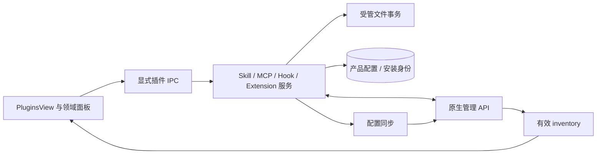

# 插件系统：管理状态、文件事务与运行能力

插件页组合多种能力，但它们不是同一种安装单元。本文以 Main 插件服务、原生 API、配置同步和 Extension 注册为依据，说明读取、启停、安装和恢复各由谁负责。

## 1. 类型与所有权

| 类型        | 运行权威                          | 产品负责                              | 主要限制                                   |
| ----------- | --------------------------------- | ------------------------------------- | ------------------------------------------ |
| Skill       | Gateway skills.status/update      | 用户文件导入删除、列表投影            | 文件存在不等于 eligible                    |
| MCP         | 原生连接与工具调用                | 用户配置 Store、发现与配置同步、probe | Extension 提供项是只读来源                 |
| Hook        | 原生 hook runtime                 | 本地包、产品开关和受管同步            | 与 Extension 的 hook capability 不混为一项 |
| Extension   | plugins.list/setEnabled/uninstall | 审查、受控导入、产品保护规则          | 运行代码进入 Gateway 信任域                |
| Marketplace | 各类型安装器及 inventory          | 公司 SDK 适配、来源/版本身份          | 不是另一份运行态清单                       |

Plugin Hub 有四类插件概念；市场当前只开放 extension、skill、mcp 三种 catalog kind。共享 PluginKind 中有 hook，不代表 Marketplace 也支持安装 Hook。仓库默认未注册业务市场 provider。

## 2. 从页面到运行时

Renderer 显示 loading/error、操作能力和运行结果；不能通过自行扫描目录决定安装状态。启停成功后重新读取 inventory；同名条目的来源变化也需要呈现，不能只把旧卡片布尔值翻转。

## 3. Skill：有效赢家与文件来源

内置 manifest 有 8 个默认启用项：data-analysis、diagram-design、frontend-design、docx、pdf、pptx、skill-creator、xlsx，并关闭 OpenClaw 默认技能集。打包资源必须与 manifest 一致；数量不应散落在 UI 常量中。

skills.status 提供 effective source、eligibility、disabled、缺失依赖和安装选项。产品文件服务只管理用户导入目录；它不能从 SKILL.md 自行重建运行元数据。受管根使用原生 stateDir/skills，避免重复 extraDirs 引入同一路径。

同名技能遵循原生解析赢家。关闭赢家不等于自动切换到下一来源；赢家目录删除后的 fallback 是另一种变化。没有原生 variants contract 时，UI 不展示臆测的 shadowed 数量或逐来源 toggle。

Extension 发布技能的 scope 表示父插件管理，ownershipScope 表示产品展示归属；两者不能合并推导删除能力。系统内置与用户 Extension 的技能均可能由父插件托管。

### 用户文件变更

导入验证结构与精确目标，复制到受管根。删除先原子移入同卷 `.justdo-skill-trash/delete-*`，避免递归删除中途留下半残 live skill。机会式清理仅处理已知 trash 子目录，不能扫描删除未知项目。

Windows 文件被占用时，ManagedDirectoryOperationCoordinator 识别受管进程，必要时取得配置 mutation 中的原生 suspension，再 stop/mutate/start。不能因为文件锁就杀任意进程；恢复失败必须可诊断。

## 4. MCP：配置与原生发现的汇合

用户 MCP 保存在 mcp_servers。新增、改名、删除和启停通过串行配置同步生成原生 mcp.servers；原生新增的 server 可在列表刷新和非 MCP mutation 同步前导入缺失 name。

发现只增加缺失项，不因原生配置暂时缺失就删除产品记录。产品主动删除/改名后不能先读旧原生配置，否则会复活旧 name。未被表单建模的 cwd、OAuth、TLS、tool filter 等字段需要保留合并，不能保存一次表单就丢失。

请求 timeout 按单 server override 优先于全局默认投影为 requestTimeoutMs；连接建立 timeout 是另一概念。Extension 自带 MCP 的配置由父插件拥有，不套用户 server 的默认设置。

probe/readResource 在 Main 使用真实 transport。HTTP/SSE probe 保持流式响应、禁止自动重定向并使用网络策略；stdio command/env 属于执行输入，敏感值不能进入 UI 诊断或日志。

## 5. Hook：文件、数据库与配置共同提交

独立 Hook 包包含 HOOK.md 和受支持入口，导入支持限定压缩格式。ID 和路径先规范化，内置与已有目标不能普通覆盖。bundle 环境通过 OPENCLAW_BUNDLED_HOOKS_DIR 指向实际产物。

删除先隔离目录，再修改 Store 和同步配置；同步失败恢复记录与目录，成功后清理隔离区。SQLite transaction 只保护本地行，无法回滚原生 reload，必须保留跨边界补偿语义。

## 6. Extension：审查与运行态对账

列表、启停和卸载使用原生 plugins API。可删除能力由原生 inventory 与产品保护共同决定，不能由一个“用户安装”标签猜测。bundled plugin 目录固定到 runtime/dist/extensions。

本地 path/archive 安装通过受管 CLI。安装前解析能力 surface、operator grants、来源和 integrity，向 UI 返回审查数据；提交时要求匹配本次 surface 的 reviewToken，重新核对后才调用安装器接受能力。包在审查后变化，旧 token 不能继续安装。

原生 openclaw.plugin.json 包交由原生安装器验证。其他 bundle 格式虽可能被上游识别，产品共用 conversion 入口当前仍会提示未支持并停止；不能把上游格式能力直接宣传为产品已完成转换。临时目录始终清理，CLI 输出和 timeout 有界，失败不伪造 runtime id。

## 7. 产品扩展各有生命周期

| 扩展/能力             | 持有的状态                           | 产品桥接                     |
| --------------------- | ------------------------------------ | ---------------------------- |
| Runtime Services      | 原生历史、进度、回执的受限读取       | Main/Renderer 查询投影       |
| AskUserQuestion       | pending、期限、默认及取消            | 问答 event/RPC、UI replay    |
| Plan mode             | 原生 session mode、待审核交互        | Main 计划文件与 handoff      |
| Automation permission | 按原生 session mode 进行任务变更审批 | 使用原生 plugin approval     |
| Embedded browser      | 原生 browser 工具桥                  | Main guest 所有权与动作执行  |
| agent-team            | 可选工具、技能与原生发送 hooks       | Main 成员、轮次及接收元数据  |
| stt-local-cli         | 本地附件转录工具                     | 已安装 Sherpa 路径及文件策略 |

agent-team 默认关闭，禁用保留历史；Runtime Services 仍读回执并阻止受管 peer send。stt-local-cli 保留显式 disable，附件转录独立于麦克风开关；sandboxed session 不注册该 host tool，文件访问遵循有效 fs policy，无云端 fallback。

插件可拥有工具或钩子，但不能建立第二份产品会话 transcript。角色文件也归原生 agents.files，不把长期助手实现成 Skill 目录的另一套编辑器。

## 8. 请求头 sidecar 与信任

Extension 可用 outbound-header-policy.json 声明 HTTPS 目标、Header 名称和受管 user-info 引用。声明不含凭据值，安装前校验、安装后 canonical path 回读，启用状态参与有效策略合并。

它不能写永久手工 config，也不提供任意凭据 API。Gateway 同进程 Node Extension 仍处于可信代码边界，sidecar 并不是恶意插件网络沙盒。详细规范见[出站指南](../outbound-header-guide/README.md)。

## 9. 故障不能只显示“未安装”

| 阶段           | 失败意义                  | 恢复要求                   |
| -------------- | ------------------------- | -------------------------- |
| 下载/解包      | 尚无有效安装输入          | 清理临时目录，保留原安装   |
| 格式转换       | 产品尚不支持或输入非法    | 明确停止，不调用 CLI       |
| 能力审查       | 内容或授权不匹配          | 重新审查                   |
| 文件变更       | 路径、锁或权限失败        | 保留事务/隔离区证据        |
| 配置应用       | 磁盘与 runtime 可能不一致 | 领域回滚或明确待恢复       |
| inventory 读取 | 无法确认当前状态          | 显示查询失败，不能猜未安装 |

## 10. 测试与维护

从 `src/main/plugins/` 的文件事务、MCP/Hook 同步、Extension import/conversion 和 registry 测试检查产品层；从 `tests/openclaw/extensions/` 与 skill-resolution runtime contract 检查最终原生能力。市场增加 kind 前需完成安装、更新、启停、删除与状态对账闭环，详见[市场适配](16-skill-marketplace-adapter.md)。

## OpenClaw 2026.9.6 integration

The runtime retains the native QuickJS Code Mode executor and GitHub reader plugins,
including explicit allowlist membership while preserving user disable state. Local
extensions import named SDK subpaths. Agent-owned Workshop collections remain
Gateway-owned; the application does not recreate workspace-based skill ownership.
See [upgrade audit](../features/openclaw-upgrade-v2026.9.6.md).
