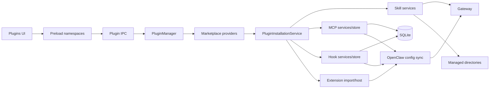
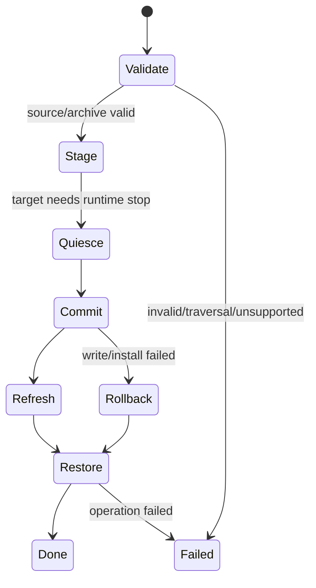

# Plugin 系统

本文按 `v2026.8.12` 的 `src/main/plugins/`、plugin IPC/UI、shared contracts、OpenClaw config sync 和内置 manifest 重写。JustDo 中“Plugin”是产品聚合概念，包含 Skill、MCP、Hook、Extension 与 Marketplace；它们没有统一的数据权威或安装方式。

## 1. 能力与所有权

| 类型        | 运行时权威                        | JustDo 持久化/文件职责                            | 用户操作                            |
| ----------- | --------------------------------- | ------------------------------------------------- | ----------------------------------- |
| Skill       | Gateway `skills.status/update`    | bundled manifest；用户 Skill 目录导入/删除        | 查看、启停、导入、删除、安装依赖    |
| MCP server  | OpenClaw config/runtime           | SQLite `mcp_servers`；extension-provided 只读发现 | CRUD、启停、probe、resource read    |
| Hook        | OpenClaw config/runtime           | SQLite `openclaw_hooks` + 用户 Hook 文件          | 导入、启停、删除                    |
| Extension   | OpenClaw plugin CLI/registry/host | OpenClaw managed plugin 目录与 config             | import、启停、配置、删除            |
| Marketplace | provider adapter                  | 默认无 provider；不保存第三方响应秘密             | source/search/detail/install/update |

不能把 Skill file scanner 当元数据权威，也不能把 Marketplace item 当安装完成的证明。实际状态必须回到对应 runtime/store 查询。

## 2. 架构

## 3. Shared 合约

`src/shared/plugins/marketplace.ts` 定义：

- `PluginKind`: `extension`、`skill`、`mcp`、`hook`；
- 稳定 error code：invalid request/response、source not found、unsupported kind、provider/install failure 等；
- source、summary、detail、query/cursor、install request/response；
- install state `available`、`installed`、`unavailable` 和 operation `install`、`update`。

`src/shared/plugins/skills.ts` 定义 Gateway skill source 及哪些 source 是用户拥有。删除权限必须以 `isUserOwnedSkillSource` 判断，不能凭 UI 分组或路径字符串猜测。

## 4. 内置 Skills

`resources/builtin-skills.json` 是当前内置集合的权威：

| ID                  | 默认状态 |
| ------------------- | -------- |
| `data-analysis`     | enabled  |
| `diagram-generator` | enabled  |
| `frontend-design`   | enabled  |
| `docx`              | enabled  |
| `pdf`               | enabled  |
| `pptx`              | enabled  |
| `skill-creator`     | enabled  |
| `xlsx`              | enabled  |

manifest 的 `disableOpenClawDefaults: true` 表示只使用 JustDo 声明的 bundled defaults；不要在文档或 UI 中硬编码数量。打包同步测试验证 manifest 与实际 resources。

## 5. Skill 系统

### 5.1 状态查询与启用

`OpenClawSkillService` 通过 adapter 调用 `skills.status`，返回 workspace/managed dir 和每个 Skill 的 source、eligibility、disabled/allowlist、missing requirements、install options 与 config checks。启停用 `skills.update`，Gateway 返回值是最终成功依据。

Renderer 的 `skillSlice` 只是列表/loading/error 缓存。`skillGroups` 和 `skillRequirements` 负责展示分组与缺失项，不决定运行资格。

### 5.2 文件导入与删除

`OpenClawSkillFiles` 只处理用户文件：读取 Skill 目录/压缩包、验证结构、复制到 `<stateDir>/skills`、拒绝目标逃逸或覆盖受保护来源。`OpenClawSkillFileService` 把操作包在 `ManagedDirectoryOperationCoordinator` 中：

1. 解析准确目标；
2. 执行导入/删除；
3. 遇 Windows lock 时识别锁定进程；
4. 必要时只停止属于应用/Gateway 的进程；
5. 重试并恢复先前 runtime 状态；
6. 返回结构化 code/syscall/path 的本地化错误。

它不负责列举所有 Skill 或修改运行态 metadata。

## 6. MCP

用户 MCP 记录存在 `mcp_servers`：id、唯一 name、description、enabled、transport type、config JSON 和时间戳。`McpStore` 负责数据库，`McpConfigSyncService` 将记录写进 OpenClaw config，并保留 `enabled` 状态。

“设置 → 配置”提供用户 MCP Server 的默认单请求 timeout，单位为秒，默认 60，范围 1–86400。该值保存在 `agentRuntimeSettings:v1`；“编辑 MCP 服务”在表单末尾显示当前 Server 的覆盖值，未配置覆盖时直接显示当前全局值。仅在用户改为不同值时写入该记录的 `config_json.requestTimeoutSeconds`，未修改则继续继承全局配置。配置同步按“单 Server 覆盖 → 全局默认”的优先级写入 `mcp.servers.<name>.timeout`；它控制已连接 Server 的请求等待，不等于连接建立超时。Extension 自带的只读 MCP Server 由 Extension 配置负责，不套用此用户 Server 默认值。

主要能力：

- create/update/delete/setEnabled 后触发串行 config sync；
- `probe` 以真实 transport 检查连接和 tools/resources；
- `readResource` 通过 Main/SDK 读取，Renderer 不直接连接 server；
- `discoverExtensionMcpServers` 读取已启用 extension 提供的 server，作为只读来源，不能重复保存为用户 row。

stdio command、args、env 与 remote URL 都是高风险输入：UI 隐藏不是安全措施，Main 必须 validate；credential 不进入日志或 marketplace response。

## 7. Hooks

Hook 元数据/启用状态在 `openclaw_hooks`，文件位于受管目录。一个本地 Hook 至少包含 `HOOK.md` 与 `handler.js`；支持 `.zip`、`.tar`、`.tar.gz`、`.tgz` 导入。

文件层规范化 hook id、拒绝路径逃逸、拒绝覆盖 built-in Hook；config sync service 只把 store 中已启用且可用的 hook 映射到 OpenClaw。删除顺序应保证文件与 store/config 不出现长期半状态，失败返回明确结果并可重试。

## 8. Extensions

Extension 使用 `openclaw.plugin.json`，由 OpenClaw CLI/registry 进行最终 manifest 验证和安装。Import service 支持目录或压缩包，阶段性发送 progress：准备、解压/检查、安装、同步/完成或失败。

安全与事务约束：

- archive 必须是支持类型，解压到临时目录；拒绝符号链接和目录逃逸；
- 单根目录 archive 可自动下钻；manifest id 只作为结果标签，完整合法性由 OpenClaw installer 决定；
- 命令 cwd/env 来自 manager，timeout 为 300 秒，输出最多保留 64K；
- 所有 config mutation 进入 exclusive queue；目录锁处理复用 coordinator；
- `action-approval` 是受保护 extension，不能被普通删除/禁用；
- 成功不能只看 exit code，还需匹配 OpenClaw 明确 success 输出并重新列举 registry。

## 9. Extension host 与 ask-user

`OpenClawExtensionHostLifecycle` 管理本地 callback server、host controller 和 MCP transports。它必须在首次 config sync 前启动，因为 callback port 是动态值。

Ask-user contract 最多 8 个问题；question id 满足 `[A-Za-z][A-Za-z0-9_-]{0,63}`。shared parser 验证类型、选项、默认值、required 和 timeout，timeout 最大 24 小时。模型用顶层 `timeoutEnabled` 选择是否启用等待时限，实际分钟数来自“设置 → 配置”，默认 10 分钟，并通过插件 config 的 `timeoutMinutes` 下发。Broker 保存 pending request，interaction router 按 request/session 关联并支持重放；回答只接受原问题中的 id/选项。多问题请求允许用户用 `skipped: true` 明确跳过单题，renderer、Host 和 Extension 都会校验并把该状态明确返回模型。

Renderer 对单题和双选项不做隐式确认按钮降级，所有问题统一展示完整的 option label、description 和可选 input，选择后再提交。单题 header 用作对话框标题。多题向导的单选题在无需补充输入时自动前进；非末题的多选题只有在当前答案完整后才显示“下一个”按钮，由用户确认选择完成后前进。为兼容历史请求，自由文本“其他”默认显示；question 只有显式声明 `allowOther: false` 时才隐藏，shared parser 与 Extension 也只在该情况下拒绝 `other` 回答。需要用户解释某个选择时应使用 option `input`，而不是依赖后续对话。

Action approval extension 补充文件写/cron 等产品 policy，但不重复 Gateway 原生 exec approval。adapter diagnostics 不能被解释为“可信 policy 已激活”；真正 admission 仍要由 config sync 的 active policy verification 证明。

`justdo-runtime-bridge` 是随产品安装并受保护的内置 OpenClaw extension。它只使用 v2026.8.1 支持的 plugin API，承担三项不应继续做 runtime patch 的集成：

- 从 agent hooks 发布 `preparing`、`waiting_model`、`retrying` 有界进度事件；
- 注册 `justdo-runtime-bridge` remote embedding provider，保留 SSRF policy 与 eligible env proxy；
- 注册 `justdoRuntimeBridge.historyDetails` 的 `operator.read` RPC，只按最多 250 个请求 id 从原生 transcript 投影 tool input 和 compaction detail。

该 RPC 不是通用文件读取器，不返回 transcript 路径，也不接受任意 session 文件路径。Adapter 先用 `chat.history` 获取原生 display projection，仅对缺失 detail 做补充查询。

## 10. Marketplace Adapter

当前 `createPluginMarketplaceService` 传入空 provider 数组，因此生产默认没有公开 marketplace source。UI/API 存在不代表当前有商店内容；企业构建需显式注册 provider。

Provider contract：source metadata、search、detail、prepareInstall。Service 的防御性规则包括：

- source id/name 非空且不超过 256，supportedKinds 必须有效，id 不可重复；
- query limit 默认 20、范围 1..100；cursor 仅允许恰好一个 source；
- item 的 kind、必填/可选字符串、tags、install state、readme（最大 1,000,000）和 requirements 均验证；
- 跨 source 的同 kind/plugin id 不可重复；
- provider 异常转换为稳定、脱敏的 `MarketplaceError`；
- response 只投影公开字段，丢弃 token/internal URL 等多余属性。

安装流程：provider `prepareInstall` 返回匹配 kind 的 payload和可选 cleanup；`PluginInstallationService` 按 kind 找已注册 installer；无论安装成功或失败都尝试 cleanup 临时 payload，cleanup 错误不暴露内部路径/秘密。

## 11. Renderer

`PluginsView` 切换 Skill/MCP/Hook/Extension/Marketplace。Skill 与 MCP 有已挂载 Redux slice；Hook/Extension/Marketplace 主要由组件/service 局部状态管理。文档不能把未 mount 的状态描述为全局 store。

UI 应显示 source、eligible/missing、install state 和操作结果；破坏性删除需要明确目标。安装进行中禁用重复提交，extension progress 允许刷新后重新列举实际状态。

## 12. 安全模型

- 只允许 Main 接触受管路径、archive、子进程、MCP transport 与 config 文件。
- 所有 archive 防 traversal/symlink；所有 delete 验证 resolved target 位于确切 managed root。
- 不自动安装任意 Skill 声明的 shell script；安装选项先展示来源和风险。
- Marketplace provider 是不可信输入；响应 normalize 后才进 Renderer。
- MCP env、Extension config、Skill API key 是 secret，不输出完整 config。
- runtime 在目录操作期间被停止时必须在 finally 路径按原状态恢复。

## 13. 变更与测试

新增 plugin kind 或 provider 时同步 shared union、installer 注册、IPC/preload/declaration、UI、config owner、删除语义和测试。现有测试覆盖 marketplace validation/cleanup/redaction、安装器冲突、Skill/Hook archive/path/lock、extension import/registry/host、ask-user 和 MCP discovery/probe。运行时行为变化还要更新 capability matrix 与 patch tests。

## 14. 各类型生命周期对照

| Kind        | 发现/列表                    | 安装或导入                       | Enable           | 删除                   | Runtime 生效               |
| ----------- | ---------------------------- | -------------------------------- | ---------------- | ---------------------- | -------------------------- |
| Skill       | Gateway skill API            | 受管 skill 文件事务              | Gateway update   | 验证 user-owned 后移除 | Gateway skill refresh/API  |
| MCP         | SQLite + extension discovery | 表单/配置记录                    | SQLite flag      | 删除 user-owned row    | config sync + probe        |
| Hook        | SQLite/受管 hook             | archive/目录导入                 | SQLite flag      | path-safe 删除         | config sync/runtime reload |
| Extension   | registry/CLI/host list       | archive/目录 import              | extension config | manager 删除           | host/config sync           |
| Marketplace | provider 聚合                | prepare payload → kind installer | 由目标 kind 决定 | 由目标 kind 决定       | 安装后重新查询目标权威     |

统一 UI 不代表统一生命周期；尤其不能实现一个“删除 plugin”通用 handler 接收任意 kind/path。

## 15. 文件事务状态机

临时目录 cleanup 和 runtime 恢复放在 `finally` 语义中。目标 path 必须在解压后再次 canonicalize，拒绝 traversal、symlink escape 和不允许的根目录。已有同名项的 replace/冲突语义必须由具体 manager 明确，不能靠文件覆盖默认决定。

## 16. Secret 与配置投影

MCP env、Extension configuration、Skill credential 和 Marketplace provider 内部字段不得原样返回 UI/log。Renderer 需要的是是否配置、缺失字段名或稳定错误码，而不是 secret value。Config sync 只写 JustDo 管理区域并保持其他用户配置；probe 错误需脱敏后再进入 UI。

## 17. 故障与恢复

| 故障                      | 恢复原则                                              |
| ------------------------- | ----------------------------------------------------- |
| Archive 验证失败          | 未进入 managed root，不改变 runtime                   |
| Commit 中断               | 回滚 staging/目标，保留可诊断错误                     |
| Runtime stop 后安装失败   | 恢复原运行状态，不能让 cleanup error 覆盖主错误       |
| Config sync 失败          | 产品记录可保留为未生效/错误，UI 不宣告 runtime ready  |
| Extension host 崩溃       | 重新 list/config/start，拒绝遗留 ask-user pending     |
| Marketplace provider 异常 | 隔离 source、返回脱敏稳定错误，不污染其他 source 结果 |

## 18. Plugin Definition of Done

新增能力必须证明 source ownership、manifest/schema validation、managed path、冲突/replace、enable 与 runtime apply、删除/rollback、secret redaction、IPC/preload/UI consumer 和打包资源。若 Marketplace 只是新增 provider adapter但没有 composition 注册，文档与 UI 必须继续显示“未配置”，不能写成已有目录内容。
