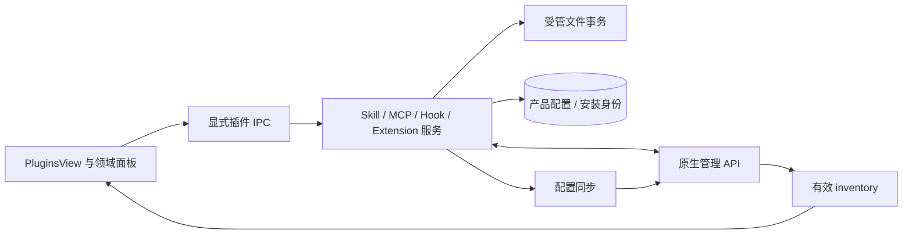
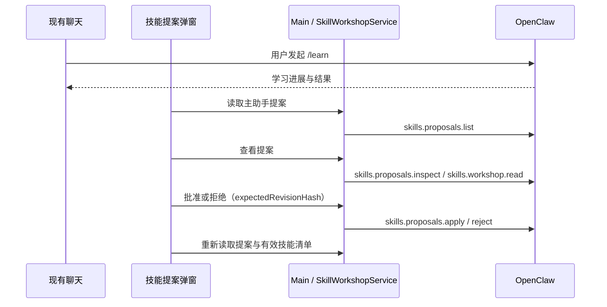

# 插件系统：管理状态、文件事务与运行能力

插件页组合多种能力，但它们不是同一种安装单元。本文以 Main 插件服务、原生 API、配置同步和 Extension 注册为依据，说明读取、启停、安装和恢复各由谁负责。

## 1. 类型与所有权

| 类型        | 运行权威                          | 产品负责                              | 主要限制                                   |
| ----------- | --------------------------------- | ------------------------------------- | ------------------------------------------ |
| Skill       | Gateway skills.status/update      | 用户文件导入删除、列表投影            | 文件存在不等于 eligible                    |
| MCP         | 原生连接与工具调用                | 用户配置 Store、发现与配置同步、probe | Extension 提供项是只读来源                 |
| Hook        | 原生 hook runtime                 | 本地包、产品开关和受管同步            | 与 Extension 的 hook capability 不混为一项 |
| Extension   | plugins.list/setEnabled/uninstall | 审查、受控导入、产品保护规则          | 运行代码进入 Gateway 信任域                |
| Marketplace | 各类型安装器及 inventory          | 公司 SDK 适配、来源/版本身份          | 不是另一份运行态清单                       |

Plugin Hub 有四类插件概念；市场当前只开放 extension、skill、mcp 三种 catalog kind。共享 PluginKind 中有 hook，不代表 Marketplace 也支持安装 Hook。仓库默认未注册业务市场 provider。

## 2. 从页面到运行时

```mermaid
flowchart LR
  UI[PluginsView 与领域面板] --> Preload[显式插件 IPC]
  Preload --> Service[Skill / MCP / Hook / Extension 服务]
  Service --> Files[受管文件事务]
  Service --> Store[(产品配置 / 安装身份)]
  Service --> Sync[配置同步]
  Service <--> Gateway[原生管理 API]
  Sync --> Gateway
  Gateway --> Inventory[有效 inventory]
  Inventory --> UI
```

Renderer 显示 loading/error、操作能力和运行结果；不能通过自行扫描目录决定安装状态。启停成功后重新读取 inventory；同名条目的来源变化也需要呈现，不能只把旧卡片布尔值翻转。

输入框功能入口通过 `extensions:changed` 观察实际启用状态。Main 在启停尝试完成后
串行重读权威目录并通知全部仍存在的窗口；已保存但运行时重启失败时也发出实际
状态，不用请求值假定成功。导入/市场安装和卸载同步通知；通知读取失败保留操作
结果且不伪造状态。Renderer 按插件合并在途开关，关闭版本使快速关闭/开启后的
旧标签选择失效。详见[输入框功能菜单](../features/composer-feature-menu.md)。

Extension 卡片的警告支持鼠标悬停、键盘聚焦和点击进入详情。红色表示原生错误，
橙黄色表示缺少凭据；详情显示错误或缺失项，并提供密码输入框、已配置提示和保存反馈。
Main 优先使用 manifest 的 sensitive `uiHints`；只有 provider 环境变量声明而没有对应
配置字段时，按 `setup.providers[].envVars` / `providerAuthEnvVars` 生成凭据入口。
同一 provider 的变量是替代项，任一已配置即可满足该组；不同 provider 分别检查。
详情使用左右布局；存在替代变量时，左侧下拉选择要填写的凭据，右侧输入其值。
切换选项清空未保存输入，保存仅写入所选的 manifest 声明变量；配置状态按变量呈现。
这些入口保存到原生 `env.vars`，不向空的插件 config schema 写入虚构的 `apiKey`。
Main 每次保存重新读取 manifest 并限制可写字段，inventory 仅返回配置状态，不返回密钥。
完整和最小配置同步保留用户的原生环境配置；配置临时文件在写入前限制凭据文件权限。
原生 Gateway 热重载负责应用环境配置，无法确认应用时使用现有重启协调器。
应用失败时保留待刷新状态，重复保存同一个值也会重新应用。替换凭据同时删除同名的
顶层 `env.NAME`，避免旧值覆盖 `env.vars.NAME`；系统环境提供的变量显示来源并禁止
无效覆盖，用户修改系统变量后重启应用。权限或写入失败直接报错，不触发最小配置重建。

OpenClaw v2026.9.8 的插件管理 RPC 会直接应用运行时变更。CLI 导入等待最终运行时回执：Gateway 已应用则无需额外操作，仅保存到磁盘时调用 `plugins.reload`。CLI 卸载和启停回退后优先调用 `plugins.refresh`；原生热加载失败或出站代理策略变化时再申请 Gateway 重启。各场景和重启边界见 [Gateway reload audit](gateway-reload-audit.md)。

导入尝试已交给原生安装器后，即使最终 reload／重启失败，结果也保留 Extension ID；Main 据此重读权威清单并通知消费者，让已提交的部分安装状态及其附带能力失效刷新，不按失败结果假定没有安装。

本地 Extension 的构建预编译同时覆盖主入口和独立的 `setup-api` 入口（插件根及 `dist/` 下的 TypeScript 文件）。即使主入口已经是 JavaScript，也必须处理 setup 入口；编译成功后移除对应 TypeScript 入口，避免 OpenClaw 优先选中源码。ACPX 的自动启用探针在配置、旧状态检查和重载时都会运行，遗漏其 setup 预编译会触发原生源码代际快照，重复复制、哈希和校验依赖树。预编译让 bundled JavaScript 使用原生快速加载路径，不改变用户插件的源码隔离或完整性校验。

## 3. Skill：有效赢家与文件来源

内置 manifest 有 8 个默认启用项：data-analysis、diagram-design、frontend-design、docx、pdf、pptx、skill-creator、xlsx。v2 manifest 通过 `openclaw.skills` 和 `openclaw.custodianSkills` 显式选择上游技能：分别保留 `coding-agent` 和 `diagnose-gateway`，其余上游技能不打包。系统维护技能留在原生 `custodian-skills/`，仅由系统 Agent（应用配置为 `main`）发现。安装和打包共用同一筛选逻辑，所有选中源校验通过后才清理目录；缺失上游技能时必须从锁定的原始包重建运行时，不能静默跳过。打包资源必须与 manifest 一致；数量不应散落在 UI 常量中。

技能列表和详情使用 Gateway 状态，详情提供有权限的启用／关闭入口，并在更新后显示最新状态与缺失依赖。若原生技能要求显式开启自身的 `skills.entries.<skillKey>.enabled`（如 `coding-agent`），Main 在该条件缺失时显示未启用，即使原生 `disabled` 为 false；其他缺失依赖只影响可用性，不改变启用状态。用户启用仍通过原生 `skills.update` 保存，应用不默认开启或绕过原生技能要求。

Renderer 的缺失依赖徽标和详情提示不重复列出该技能自身的启用条件，由开关表示；其余程序、环境变量、配置和系统要求保持原生结果。原生 `missing.anyBins` 表示任选一种工具即可满足的要求，计为一个缺失依赖组，列表提示和详情明确说明“至少安装一个”；开启技能不会清除该依赖提示。原始 Gateway 状态不受展示过滤影响。

TypeSafe 扩展声明决策模型提供方；原生 `decision_evaluate` 工具按 Agent 的 `decisionModel` 自动提供。9.8 不再注册专用评估工具或 skill，Boolean、Choice、Score 输入由提供方翻译。具体接入见 [Jev evaluations](../features/jev-integration.md)。

内网发行版通过 `resources/openclaw-extension-prune.json` 排除 Anthropic、ElevenLabs、
GitHub、Kie、Z.AI 和 Novita 插件；运行时资源准备与安装包构建共用该剪裁策略。
保留 OpenAI 插件作为内网兼容接口的协议适配器，在线语音设置显式提交内网服务地址、
模型及凭据；保留插件不代表必须连接 OpenAI 公网。实时识别需要兼容 Realtime
Transcription（PCMU 8 kHz），朗读需要兼容 Audio Speech。模型目录仍由用户配置，
不会以插件内置模型元数据填充语音设置。ElevenLabs 不再列入受管语音提供方。

视频服务由应用插件 `openclaw-extensions/video-openai` 注册原生视频 provider，
经现有本地扩展复制、预编译和裁剪保护流程打包。插件默认关闭，设置页保存后由 Main
配置同步器启用并投影 `agents.defaults.mediaModels.video`；模型 ID 和基础地址由用户填写。
`models.providers.video-openai` 独立于聊天和图像配置；非空 API Key 写入受限的
`extension-secrets.json`，通过 file SecretRef 引用；空 Key 不发布凭据引用。
原生 `video_generate` 工具负责权限、参考图片读取和结果交付，插件只实现 multipart
提交、状态轮询和视频内容下载。三阶段共用总超时与原生有界响应读取；使用配置地址和
HTTP 策略、允许显式配置的私有网络地址、拒绝重定向和不确定提交的重试，没有公网地址或凭据回退。

Kie、Z.AI、Novita 原生契约仍保留，但插件不随当前发行版打包；仅实际安装的提供方
显示在设置中。配置同步按插件库存清除缺失注册和视频选择，不写入对应新凭据。
完整和最小同步遵循相同规则。新视频插件通过原生 provider 扩展接入，不恢复 9.6
旧自定义视频配置或迁移。具体协议与输入限制见 [模型管理](../features/model-management.md)。

skills.status 提供 effective source、eligibility、disabled、缺失依赖和安装选项。产品文件服务只管理用户导入目录；它不能从 SKILL.md 自行重建运行元数据。受管根使用原生 stateDir/skills，避免重复 extraDirs 引入同一路径。

同名技能遵循原生解析赢家。关闭赢家不等于自动切换到下一来源；赢家目录删除后的 fallback 是另一种变化。没有原生 variants contract 时，UI 不展示臆测的 shadowed 数量或逐来源 toggle。

Extension 发布技能的 scope 表示父插件管理，ownershipScope 表示产品展示归属；两者不能合并推导删除能力。系统内置与用户 Extension 的技能均可能由父插件托管。

### 用户文件变更

导入验证结构与精确目标，复制到受管根。删除先原子移入同卷 `.justdo-skill-trash/delete-*`，避免递归删除中途留下半残 live skill。机会式清理仅处理已知 trash 子目录，不能扫描删除未知项目。

Windows 文件被占用时，ManagedDirectoryOperationCoordinator 识别受管进程，必要时取得配置 mutation 中的原生 suspension，再 stop/mutate/start。不能因为文件锁就杀任意进程；恢复失败必须可诊断。

### 技能提案审核

学习直接使用现有聊天中的原生 `/learn`，遵循原生工具能力、会话权限与技能配置。
JustDo 不再提供独立学习启动流程，也不通过审核入口修改全局学习或发布策略。
技能页仅保留“技能提案”低频入口，独立模态弹窗打开后才读取和轮询主助手（main）的提案。
技能列表默认显式查询 main，`openclaw-workshop` 来源展示为助手提炼技能，不走导入目录删除逻辑。

```mermaid
sequenceDiagram
  participant C as 现有聊天
  participant U as 技能提案弹窗
  participant M as Main / SkillWorkshopService
  participant G as OpenClaw
  C->>G: 用户发起 /learn
  G-->>C: 学习进展与结果
  U->>M: 读取主助手提案
  M->>G: skills.proposals.list
  U->>M: 查看提案
  M->>G: skills.proposals.inspect / skills.workshop.read
  U->>M: 批准或拒绝（expectedRevisionHash）
  M->>G: skills.proposals.apply / reject
  U->>M: 重新读取提案与有效技能清单
```

审核页对更新提案并列显示完整当前指令与提案指令；新建提案只显示新指令，并展示完整支持文件及原生状态。
更新提案读取当前技能并核对原生目标哈希；无法读取或目标变化时禁止批准。Main 校验 main 归属、pending 状态、
expectedRevisionHash，按提案序列化并发决定，再调用原生审核 API。原生负责最终目标冲突、扫描与原子发布。
超时不重放写操作；清除旧审核快照，刷新权威状态后要求重新打开提案。弹窗关闭/卸载停止轮询，
重新打开从原生恢复；写入期间禁用关闭，切换筛选清空旧详情。学习执行和提案持久化仍由原生负责。

## 4. MCP：配置与原生发现的汇合

用户 MCP 保存在 mcp_servers。新增、改名、删除和启停通过串行配置同步生成原生 mcp.servers；原生新增的 server 可在列表刷新和非 MCP mutation 同步前导入缺失 name。

新增、更新、删除与启停等待受管配置应用完成再返回成功；同步失败恢复原记录（包括原 ID、时间戳和未建模的原生字段）并补偿同步。记录变更、原生应用、补偿、列表发现与手动同步都持有全局配置队列；队列上下文提供直接同步入口，避免嵌套排队死锁，也阻止其他设置同步在删除或改名尚未应用时从旧配置复活记录。MCP／Hook 同步服务为每次请求排队执行，不能将后续变更并入已经读取旧状态的在途同步；无错误文本的失败回执也必须返回失败。

Extension 提供的 MCP 通过受管子进程直接调用原生 manifest registry、MCP 支持检查及有效配置加载器发现，同时支持 bundle 和原生 openclaw 格式；不加载扩展入口或完整插件 CLI。列表展示父扩展与 server 的有效启用状态，并按父扩展 origin 分组：bundled 属于系统内置，用户导入的扩展属于用户安装。展示分组不改变管理权限；提供项仍由父扩展管理，不写入用户 MCP Store。插件页面预取清单，Renderer 保存可刷新展示快照并合并并发读取；扩展变更通知使快照失效，过期响应不能覆盖新清单。初次读取完成前显示加载状态，不提前显示未安装。

MCP 的传输支持状态使用原生清单的 `unsupported` 标记；`hasStdioTransport: false` 也可能表示受支持的 HTTP 传输，不能据此标记为不支持。

发现只增加缺失项，不因原生配置暂时缺失就删除产品记录。产品主动删除/改名后不能先读旧原生配置，否则会复活旧 name。未被表单建模的 cwd、OAuth、TLS、tool filter 等字段需要保留合并，不能保存一次表单就丢失。

请求 timeout 按单 server override 优先于全局默认投影为 requestTimeoutMs；连接建立 timeout 是另一概念。Extension 自带 MCP 的配置由父插件拥有，不套用户 server 的默认设置。

probe/readResource 在 Main 使用真实 transport。HTTP/SSE probe 保持流式响应、禁止自动重定向并使用网络策略；stdio command/env 属于执行输入，敏感值不能进入 UI 诊断或日志。

Extension MCP 卡片提供详情、单项测试和全部测试入口。Main 按完整扩展/server ID 重新读取有效原生配置并核对归属，只连接所选 server；禁用父扩展、禁用 server、错误归属或不受支持项不能启动 transport。保留插件归属映射，但连接配置使用原生 merged MCP 配置，遵守 mcp.servers 同名覆盖与禁用。测试与资源读取使用原生 session MCP runtime，保留路径、cwd、认证和工具筛选语义，并在完成后等待连接清理。UI 只接收原生脱敏连接摘要、统一原生脱敏错误与能力元数据，不接收 env、headers 或原始连接配置；测试不调用工具或修改父插件开关。扩展变更使清单、测试和资源读取的旧回应失效；加载失败不声明空清单，搜索与重复测试期间仍显示不受减少动画设置影响的旋转指示。

## 5. Hook：文件、数据库与配置共同提交

独立 Hook 包包含 HOOK.md 和受支持入口，导入支持限定压缩格式。ID 和路径先规范化，内置与已有目标不能普通覆盖。bundle 环境通过 OPENCLAW_BUNDLED_HOOKS_DIR 指向实际产物。

导入与启停、删除使用同一串行变更队列，并在全局配置队列内完成文件、记录与运行时应用。复制后从 Gateway 清单按安装目录取得原生 hookKey，将启用状态写入 Store，再等待受管配置同步和原生 `plugins.refresh` 的运行时完成回执后返回成功；显式刷新也覆盖配置未改变的重新导入。新发现的 managed Hook 在 `hooks.status` 中默认启用，并不代表执行器已选择加载。同步或刷新失败时移除本次导入目录、恢复原记录并补偿同步及运行时刷新，回滚不完整必须明确报告。成功后的清单刷新失败不撤销已完成的导入。

独立 Hook 的启停只投影到各自 `entries`。非空列表保持原生 internal 总开关启用，避免误停扩展的 legacy Hook；空列表移除受管 internal 配置，同时保留独立的 webhook 设置，包括未配置模型的最小配置路径。

插件附带 Hook 以 `hooks.status` 为清单权威，以 `plugins.list` 的父扩展 origin 补充展示分组；用户扩展附带项进入用户安装区，bundled 父扩展附带项进入系统内置区。父扩展清单暂不可读时仍保留 Hook 展示和管理锁，不能因来源读取失败隐去 Hook，也不能把“由插件管理”等同于“系统内置”。

删除先隔离目录，再修改 Store 和同步配置；同步失败恢复记录与目录，成功后清理隔离区。SQLite transaction 只保护本地行，无法回滚原生 reload，必须保留跨边界补偿语义。

## 6. Extension：审查与运行态对账

列表、启停和卸载使用原生 plugins API。可删除能力由原生 inventory 与产品保护共同决定，不能由一个“用户安装”标签猜测。bundled plugin 目录固定到 runtime/dist/extensions。

本地 path/archive 安装通过受管 CLI。安装前解析能力 surface、operator grants、来源和 integrity，向 UI 返回审查数据；提交时要求匹配本次 surface 的 reviewToken，重新核对后才调用安装器接受能力。包在审查后变化，旧 token 不能继续安装。

```mermaid
flowchart LR
  Source[目录 / 压缩包 / 市场下载] --> Validate[安全解包与格式判断]
  Validate --> Review[能力审查与 reviewToken]
  Review --> Recheck[再次校验同一内容]
  Recheck --> Install[受管原生 CLI 安装]
  Install --> Readback[原生 inventory / installed-index]
  Readback --> Result[结果与配置更新]
```

原生 openclaw.plugin.json 包交由原生安装器验证。其他 bundle 格式虽可能被上游识别，产品共用 conversion 入口当前仍会提示未支持并停止；不能把上游格式能力直接宣传为产品已完成转换。临时目录始终清理，CLI 输出和 timeout 有界，失败不伪造 runtime id。

## 7. 产品扩展各有生命周期

| 扩展/能力             | 持有的状态                           | 产品桥接                     |
| --------------------- | ------------------------------------ | ---------------------------- |
| Runtime Services      | 原生历史、进度、回执的受限读取       | Main/Renderer 查询投影       |
| AskUserQuestion       | pending、期限、默认及取消            | 问答 event/RPC、UI replay    |
| Plan mode             | 原生 session mode、待审核交互        | Main 计划文件与 handoff      |
| Automation permission | 按原生 session mode 进行任务变更审批 | 使用原生 plugin approval     |
| Embedded browser      | 原生 browser 工具桥                  | Main guest 所有权与动作执行  |
| agent-team            | 可选工具、技能与原生发送 hooks       | Main 成员、轮次及接收元数据  |
| stt-local-cli         | 本地附件转录工具                     | 已安装 Sherpa 路径及文件策略 |

Plan mode 使用 `api.session.state.registerSessionExtension`、`sessions.pluginPatch` 和
`sessions.describe.pluginExtensions` 保存与读取会话开关，`agent_turn_prepare` 注入规划约束，
`registerTrustedToolPolicy` 在执行前阻止已知变更工具。`PresentPlan` 保持 direct-only；
Tool Search 分发器由原生对实际目标再次执行策略。动作型工具使用上游
`isReplaySafeToolCall` 分类，包括 `theme` 的 list/get（允许）和 set/import（阻止）。
此策略不是任意第三方工具的通用只读沙盒：未识别的工具仍需审核其实际副作用，不能仅凭名称保证安全。
批准只结束规划轮次，不在该轮放开写权限；Main 完成同会话 reset 后才以关闭 Plan 的状态发起实施。

输入框的“+”功能菜单提供独立的“计划模式”开关，不显示勾选，也不随功能启用改变“+”按钮颜色。
开启后，工具栏在执行权限旁显示灯泡图标与“计划”标记；悬停或键盘聚焦时，图标变为关闭叉号，
点击退出计划模式。保存期间禁用重复操作，保存失败保留当前标记并提示。
执行权限菜单只管理请求批准、智能审批和完全权限，切换权限不改变计划模式。
`/plan` 不再提供命令入口；运行期间不能开启计划模式，但已开启时仍可从“+”菜单关闭，
待审计划通过现有服务取消后退出，即使计划审批暂时禁用了普通输入。

agent-team 默认关闭，禁用保留历史；Runtime Services 仍读回执并阻止受管 peer send。两个发送 hook 均避让原生 SubAgent 与 ACP 子会话，由 OpenClaw 判断子会话归属和可见性；这些发送不计入平级协作预算。stt-local-cli 保留显式 disable，附件转录独立于麦克风开关；sandboxed session 不注册该 host tool，文件访问遵循有效 fs policy，无云端 fallback。

新版 Gateway 可以为执行 hook、工具工厂和服务创建不同的插件注册实例。Team 的临时 scoped grant 因此由 `collaboration.dispatch` 所在的 Gateway 实例统一登记，不能仅保存在执行 hook 的局部 Map。登记前固定目标 sessionId，授权继续受源会话、运行、准确目标及有效期限制。`collaboration.release` 提前撤销，`native-result` 回报路径再次撤销；前者 RPC 失败不得阻止真实发送结果回报 Main。禁用插件仍可通过 Runtime Services 读取历史，不通过扩大全局会话可见性实现平级交流。

服务停止会推进生命周期代次并清空临时状态，旧请求即使随后返回，也不能重新写入授权。发送授权最长 60 秒；结果回报使用独立的准入身份记录（最长 10 分钟、最多 512 条），校验源会话、toolCallId、runId、deliveryId 和目标。该记录不授予会话访问权限，不保存正文；撤销授权后仍允许准确关联的迟到结果更新 Main 回执。取消准入时，即使 release RPC 失败，也通过绑定的取消结果撤权并结束 dispatching 状态。

插件可拥有工具或钩子，但不能建立第二份产品会话 transcript。角色文件也归原生 agents.files，不把长期助手实现成 Skill 目录的另一套编辑器。

## 8. 请求头 sidecar 与信任

Extension 可用 outbound-header-policy.json 声明 HTTPS 目标、Header 名称和受管 user-info 引用。声明不含凭据值，安装前校验、安装后 canonical path 回读，启用状态参与有效策略合并。

它不能写永久手工 config，也不提供任意凭据 API。Gateway 同进程 Node Extension 仍处于可信代码边界，sidecar 并不是恶意插件网络沙盒。详细规范见[出站指南](../developer-integration/outbound-headers/README.md)。

## 9. 故障不能只显示“未安装”

| 阶段           | 失败意义                  | 恢复要求                   |
| -------------- | ------------------------- | -------------------------- |
| 下载/解包      | 尚无有效安装输入          | 清理临时目录，保留原安装   |
| 格式转换       | 产品尚不支持或输入非法    | 明确停止，不调用 CLI       |
| 能力审查       | 内容或授权不匹配          | 重新审查                   |
| 文件变更       | 路径、锁或权限失败        | 保留事务/隔离区证据        |
| 配置应用       | 磁盘与 runtime 可能不一致 | 领域回滚或明确待恢复       |
| inventory 读取 | 无法确认当前状态          | 显示查询失败，不能猜未安装 |

## 10. 测试与维护

从 `src/main/plugins/` 的文件事务、MCP/Hook 同步、Extension import/conversion 和 registry 测试检查产品层；从 `tests/openclaw/extensions/` 与 skill-resolution runtime contract 检查最终原生能力。市场增加 kind 前需完成安装、更新、启停、删除与状态对账闭环，详见[市场适配](16-skill-marketplace-adapter.md)。

## OpenClaw 2026.9.8 integration

The runtime retains the native QuickJS Code Mode executor and CUA desktop-control plugin,
including explicit allowlist membership while preserving user disable state. Local
extensions import named SDK subpaths. Agent-owned Workshop collections remain
Gateway-owned; the application does not recreate workspace-based skill ownership.
See [upgrade audit](../openclaw-upgrades/v2026.9.8.md).

### 可选本机电脑控制

运行时裁剪保留上游 `cua-computer`，配置同步为已安装插件写入默认
`enabled: false`，并加入原生插件 allowlist。设置 → 电脑操控提供一个即时保存的
开关，通过带原生配置版本的单次 `config.patch` 同时更新插件和全局 `computer`
工具许可；关闭时写入明确的工具 deny，开启时只移除该工具的 deny，并扩展当前
allow 或 alsoAllow，保留其他工具权限。同步、登录和退出登录按插件选择维持两者
一致，不新增产品数据库中的开关副本。扩展列表继续显示同一个原生插件，并沿用
受管理扩展的锁定状态；主进程拒绝通过通用扩展管理入口启停或改写该插件，
仅设置页开关更新启用状态，不新增提示文案。
页面只显示开关和当前会话模型必须支持图像的说明，不单独配置模型或图像能力。
主进程以隔离的 Node 子进程调用锁定运行时的原生工具策略函数，只传入全局
profile、allow、alsoAllow、deny，读取真实的全局许可状态并在启用写入前校验。
保留通配符 deny 和受限 profile；若现有 profile 与绝对白名单组合仍阻止
`computer`，启用返回失败，不扩大其他工具权限或显示假成功。
上游在 Windows/Linux 上要求 `plugins.entries.cua-computer.enabled: true`，
仅保留文件或依赖插件 manifest 的默认值并不能启用本机控制。

OpenClaw 的原生 `computer` 工具通过 Gateway 电脑服务调用 CUA，拥有截图、
动作、引用校验、串行执行和运行结束清理；应用沿用通用工具调用展示，
不添加鼠标键盘 IPC、截图缓存或独立执行器。截图用于模型观察，
不自动作为聊天附件发送。它与现有 `browser` 工具及内置浏览器承载独立。

Windows x64/ARM64 和 glibc Linux x64/ARM64 使用上游固定版本的本地
`@trycua/cua-driver` SDK 及对应平台原生包，依赖由锁定 OpenClaw 包的生产安装提供。
扩展预编译保持 CUA SDK 和 `rastermill` 外部加载，保留原生库的包目录解析。
Gateway 须处于可访问的交互式桌面会话，聊天模型须支持图片。
macOS 仍依赖上游原生应用持有的驱动端点与系统权限；保留插件不表示
Electron 应用已经实现该平台的原生承载。

启用开关为全局工具策略显式加入 `computer`，支持编程工具集和非空 allowlist；
关闭开关保留原有限制性 allowlist，避免移除最后一个元素后变成无限制策略。
提供商、独立助手和其他显式限制仍由原生工具策略处理。应用不把宿主桌面控制加入
沙箱工具白名单。命令审批仅约束 `exec`，不能视为对每次电脑输入的审批。
开发中已裁剪的冻结运行时须从锁定的 pristine 包重新构建，不能在原目录补拷插件。

## 内置浏览器与执行策略

`embedded-browser` 只替换原生 `browser` 工具的桌面执行承载，提供工具契约、请求事件桥和结果，不注册提示词钩子，也不向普通聊天逐轮注入浏览器使用规则或工具不可用说明。工具是否可用由 OpenClaw 原生执行策略过滤决定；工作区网页可见不代表 Agent 获得操作权限。

默认沙箱策略不提供宿主 `browser` 工具。用户可在“设置 → 安全 → 任务执行方式”选择本机执行，应用不因打开网页而修改策略。内置模式禁用原生 browser 插件，由桌面扩展提供工具，因此 OpenClaw Control UI 的原生 browser.request 查看入口不适用于该模式。

## Workboard：四栏展示与原生执行

Workboard 对没有显式配置的用户默认关闭；已有开启或关闭设置保持不变。
独立 Swarm Workflow 不要求开启 Workboard，也不会向其面板写入卡片。

Workboard 仍使用 OpenClaw 插件的 `workboard.cards.*` / `workboard.boards.*`
接口和原生 SQLite。Renderer 的四栏是展示投影，不改写持久化状态：

| 展示列 | 原生状态                                         |
| ------ | ------------------------------------------------ |
| 待执行 | triage、backlog、todo、scheduled、ready          |
| 执行中 | running；存在 running execution 时优先显示在此列 |
| 需处理 | review、blocked                                  |
| 已完成 | done                                             |

新建任务默认 todo；编辑描述保留原生状态。详情提供“确认完成”和“放回待执行”，
取消任意状态拖放和九状态选择器，执行中任务必须先停止。已排期任务保留原生时间约束；
没有具体时间的旧 scheduled 卡片允许重新加入待执行。

单任务启动继续调用 `workboard.cards.start`。已结束的历史 session 关联不阻止重做；
活动 execution、claim、独立 task 仍限制启动。批量启动先为可执行卡片补默认助手，
将无未来排期、无前置依赖的 todo/backlog 卡片以 `expectedUpdatedAt` 转为 ready，再调用
原生 dispatch；依赖、时间和 owner 并发容量仍由上游检查。停止操作确认 task/session
已停止后，以版本校验更新 blocked、释放 claim，并清除已停止的独立 task 关联，保留会话历史。
手动状态操作从 Renderer 传入所见卡片版本，Main 再读当前卡片并拒绝活动执行或过期版本，
原生写入继续携带同一版本，避免旧的验收操作覆盖新结果。停止后的对账重新读取卡片，
校验 session/run/task 身份；只对已确认停止的同一次执行释放占用，保留已经到达的完成或审核状态。
已知 runId 的定向停止失败时，不降级为整个 session 的停止，避免误停后来启动的任务。

接口核对与可复现验证见 [Workboard 操作契约](../features/workboard.md)。

## Jev typed evaluations

The optional `typesafe` extension is vendored from a pinned upstream revision in
`openclaw-extensions/typesafe/` and assembled by the existing local-extension
pipeline. Without decision-model settings it defaults off and remains user-toggleable.
Settings → Models → Decision models requires URL/API Key and supports provider/model
CRUD, discovery and import/export. It selects `agents.defaults.decisionModel` and
the evaluation-tool default, and then owns TypeSafe activation/configuration.
Deleting all providers disables it. The chat model decides when to call its tool.
A documented `serviceUrl` seam supports authenticated intranet System One endpoints
without redirects, environment proxies or hosted fallback.

Bundled extensions expose their native sensitive configuration hints in the
extension dialog. For declared structured secret inputs, Main writes credentials
to a permission-restricted `extension-secrets.json` and stores only a file
SecretRef under `plugins.entries.<id>.config`. Credential rotation refreshes native
prepared secrets through the existing Gateway restart coordinator. Config sync
preserves plugin opt-in, references, and the secret provider across startup,
settings changes, login, and logout. Native OpenClaw owns transport, validation,
cancellation and tool results. The extension inventory exposes only credential
metadata; model settings persist credentials in existing application config.
Settings projects file SecretRefs and uses managed native secret refresh on rotation.
See [Jev integration](../features/jev-integration.md) for setup and scope.

The Gateway bundler keeps the native `secret-input-runtime` SDK state-owner modules
external, so the Gateway and dynamic plugins share prepared credential and
unavailable-owner state through the same native ESM instances. The shared boundary
also includes configuration preparation scopes, environment publication, auth
cache/ownership state and native error classes used across these modules. This is a packaging
boundary, not a runtime patch or a fallback credential reader. The build recipe
fingerprints this boundary. Rebuild frozen runtimes from the locked pristine
artifact when it changes; never edit their source or proof manifests in place.

## Swarm Workflow：独立持久化任务流

`openclaw-extensions/swarm-workflow` 使用插件 service 生命周期及原生 Gateway / subagent API。
`swarm_workflow_start` 提供明确请求的工具入口；输入框的精确标记通过提示钩子限定发起工具，主会话利用历史和附件整理完整说明后建立流程。工具从当前原生用户条目派生幂等键，并单独保留原始指派依据，后台不缓存聊天历史。
发起轮只整理任务说明并调用启动工具，规划、执行和进度由工作流服务负责，通用任务规则不扩展这一轮的工具权限；提供直接调用与 Code Mode 参数示例。尚未接受时，原生 `before_agent_finalize` 可反馈本轮有界工具错误并请求最多三轮安全纠正；每轮仍绑定原始用户请求并收窄工具面。父身份、项目、权限或当前请求变化后不继续纠正，接受后按原始请求去重。短期准入元数据不包含聊天内容；原生取消、超时、潜在副作用或未知结果仍禁止回放，无需增加运行时补丁。
插件拥有规划、DAG 校验、节点准入、运行核对、独立验收和主聊天交付，服务不依赖 Renderer 存活。
启动 RPC 在助手名单查询前冻结服务代次与父身份、目录、权限及策略，返回后重新核对同一代次、当前规划模式和原生工具准入的 30 秒有效期；失效请求不能在重启后的服务中创建流程。
注册的 `swarmWorkflow.health/start/list/detail/control/intervene` 使用原生 operator scopes，产品 IPC 再绑定本地会话身份。主会话另有 `swarm_workflow_status/control/intervene`：查询有界的流程状态与节点证据，按明确用户意图控制流程或给节点补充输入/继续/重跑，和 Tab 共用 FlowEngine 及 `contract.flowActions`。管理工具只提供给托管主会话，写入在版本 2 工具工厂中重新确认当前原生调用授权、归属、父身份与 revision。pause/stop 只要求原生父 sessionId 仍与创建时一致，允许项目、权限或规划模式变化后终止原流程；resume/retry 与全部节点介入继续严格核验原始项目、权限和策略。running 且正在最终投递时禁止 pause/stop；投递未确认且已 blocked 后可停止，不重发交付。运行中的节点只能保存下次执行输入，不启动第二次执行。控制与补充的幂等身份来自原生 sessionKey/runId/toolCallId 及规范化动作，不能由模型指定会话或操作来源；同一原生调用重放幂等，新调用须新有效 revision。只有新有效提交与原生成功终态才能推进下游。

服务对需要处理的阻塞保存有界通知意图，再通过 `chat.inject` 添加主会话提示；包含流程已 blocked、节点仍 running 且带错误的超时等待，相同节点尝试/原因不重复通知。提醒只核验父身份，策略变化造成的执行拒绝仍可提示；最终交付保持完整策略核验。原生注入无持久幂等参数，回复丢失后标为未确认，不自动重发；status 如实返回该状态。通知循环与执行调度独立，不因慢请求拖住恢复派发；ACK 从最新流程合并，不能覆盖同时发生的人工操作。停止时禁止新通知，等待在途请求后才关闭存储。它不唤醒主助手自动处理，不保存聊天历史副本。现有 `sessions.steer` 为 interrupt 模式且无法指定精确目标 run，因此不接入运行中传话；补充信息仍在下一轮执行读取。详见 [主会话管理方案](../features/swarm-workflow-main-session-management.md)。

执行会话保留插件 ownership；主会话绑定、权限和模型在准入时核验，不绕过原生 parent-link 限制。
所有阶段继承主会话的原生 permissionMode 和项目目录；任务 access 只定义读写意图及调度互斥，不自动把只读任务降为禁止全部命令的原生 read-only。只读任务约束随派发携带，真正的权限上限仍由原生会话策略执行。
无法表达的受限执行策略拒绝启动。配置同步默认启用此插件且保留显式禁用，不注册 Workboard 面板。
配置同步同时投影 `availableAgentIds`，只包含 main 及产品中启用、未删除的助手；创建流程和每次节点准入均读取当前配置，与原生名单取交集。删除助手先同步禁用名单，再保存软删除标记，失败则回滚可用性。该名单只限制 Swarm 新节点，不撤销其他原生入口权限，也不删除历史会话。
构建过程按既有自定义扩展发现机制打包，运行时无需修改上游 ownership 逻辑。发布 `beforePack` 同步本地扩展并预编译；开发应使用 `npm run electron:dev:openclaw` 准备当前插件。普通 build/electron:dev 不替换 vendor 中已编译插件，不能仅重启旧运行时验证新工具。
新工作/验收节点使用原生身份绑定的提交工具，将有界总结、证据及验收结论保存为工作流元数据；版本 2 工具工厂在写入前核验当前调用权限。提交和原生执行结束分别确认，两者均成功才放行依赖，不从最终聊天文字推断完成。显式重试只重跑已经失败且无活动执行的节点，使用新会话/run 并保留旧执行身份，最多三次执行；结果不确定及不确定最终交付不能重试。
Gateway 启动的流程服务在同一进程内由各助手的独立工具/钩子注册实例共享；服务生命周期仍由启动实例管理，跨助手提交继续校验各自的原生调用身份。
提交工具的证据入口支持文字或列表，摘要缺省时仅从显式提交的证据生成；入库始终为有界摘要和证据列表，验收仍要求显式布尔 verdict，不以终态聊天文字补造成功。
提交错误通过原生工具结果反馈模型；`before_agent_finalize` 尽可能提前准备有界修正指令。服务确认原生成功终态后独立检查提交，不依赖钩子必定触发；空回复补全/隔离结束说明也必须收敛。缺少提示时，通过原生 `subagent.getSessionMessages` 按需读取最多 64 条记录，只提取有界提交错误，再次核对父会话与节点/run 后在同一会话追加最多三轮修正，每轮使用新的原生 run ID。`before_prompt_build` 与工具调用钩子共同限定修正阶段只能提交结果或报告阻塞。取消、失败、未知及权限变化的执行不续跑，暂停时等待恢复，耗尽修正次数仍失败；该机制不重跑任务、不回退工具活动，也不复制原生消息历史。
实现与验证细节见 [Swarm 图形任务流](../features/swarm-workflow.md)。

批量扩展将容器阶段与执行项分开：阶段图保留有界 DAG，JSONL/文件输入经可信父会话 fsPolicy、真实根及当前权限核验后冻结，执行项、原生 run 归属、预约和操作身份由插件 SQLite 保存。服务按所有流程轮转派发；普通项目写任务互斥，批次项在各自尝试目录协作并行。后台冻结、准备和发布保留预约并纳入 stop/drain，不阻塞其他流程取消。工作/验收提交和原生 `executionSettled`、`cleanupSettled` 三者均满足才发布结果。通过 before_tool_call 阻止叶子额外派发，可信 Code Mode exec/wait 外壳仍可完成收敛，内层实际工具继续校验。

批量能力可用时，规划 schema 要求每个任务显式提供顶层 `batch`（普通任务为 `null`，批量任务为输入源对象），避免将展开指令藏在普通节点说明中。格式/依赖错误在派发工作前反馈给同一原生规划会话，最多纠正三轮；轮数与有界错误摘要持久化，纠正运行仍按原生终态/清理证据释放预约，暂停、停止和权限准入照常生效。助手不可用、父权限缺失等问题直接阻塞。批量叶子仅处理分配的一个输入，清单可由固定路径的上游准备节点创建。

原生 034 为通用插件 SDK 增加每次运行的 timeoutSeconds、可选 managedToolsLifetime='run'、精确 describeRun 和 owned cancelRun，复用原生 registry、whole-run lifecycle 与 process supervisor。未知旧 epoch 或缺少清理证据保留占用，不自动启动替代执行。普通插件仍沿用原有工具生命周期，不能把此模式等同于沙盒或 OS 文件隔离。

原生 035 将已解析的 attempt.contextTokenBudget 填入已有的 before_prompt_build 上下文字段。结果分页以当前运行的有效预算计算完整工具包装大小；不使用模型窗口代替实际预算，缺证据时保持保守额度。该补丁只暴露元数据，不改变原生模型解析、截断或上下文守卫。

通用扩展配置表单支持 manifest 明确声明的有界 integer/number 字段。Swarm 的五个参数使用精确 hotPrefixes；并发影响后续准入，其他默认值保存于新流程。数值保存不因 reload ACK 缺失自动重启。manifest 可声明 configurationStatusMethod，保存后核对服务实际配置；Swarm health 返回有限数值配置、hash、生效并发和服务代际。未确认或未运行时显示待生效，重复保存不能伪装已应用。助手名单归应用所有，其余用户数值和显式禁用状态保留。
