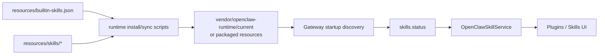
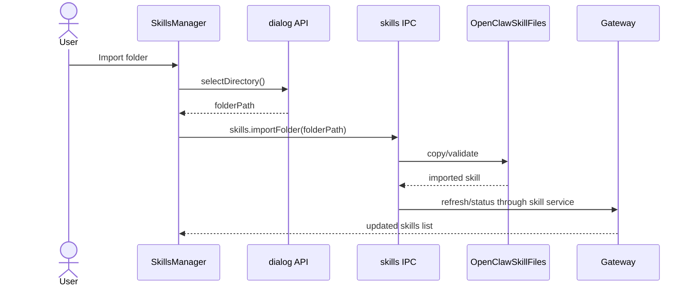
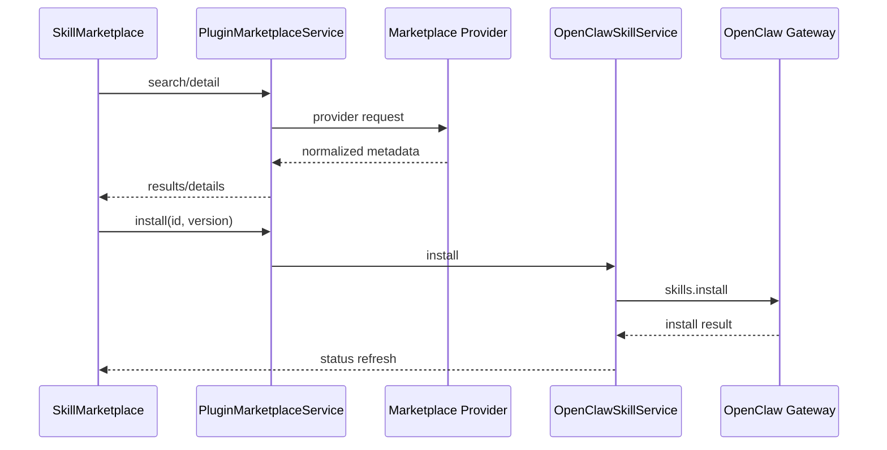

# Skills 系统

Skills 由 OpenClaw Gateway 管理，JustDo 提供桌面 UI、本地文件导入/删除、marketplace adapter 和配置同步。内置 skill 清单由 `resources/builtin-skills.json` 声明。

## 当前内置 Skills

`resources/builtin-skills.json` 当前声明 15 个 skill：

| Skill | 默认启用 |
| --- | --- |
| `agent-browser` | false |
| `algorithmic-art` | true |
| `data-analysis` | true |
| `diagram-generator` | true |
| `docx` | true |
| `multi-search-engine` | true |
| `ontology` | true |
| `pdf` | true |
| `playwright` | true |
| `pptx` | true |
| `self-improvement` | true |
| `skill-creator` | true |
| `taskflow` | true |
| `theme-factory` | true |
| `xlsx` | true |

`disableOpenClawDefaults` 当前为 `true`，表示以 JustDo 声明的内置技能为准。

## 关键文件

| 文件 | 作用 |
| --- | --- |
| `resources/builtin-skills.json` | 内置 skill manifest |
| `resources/skills/*/SKILL.md` | 内置 skill 定义 |
| `src/main/plugins/skills/openclawSkillService.ts` | Gateway skill RPC service |
| `src/main/plugins/skills/openclawSkillFiles.ts` | 用户导入 skill 文件操作 |
| `src/main/plugins/skills/openclawSkillFileService.ts` | skill 文件 service wrapper |
| `src/main/plugins/marketplace/` | marketplace provider 和 adapter |
| `src/main/ipc/openclaw/skills.ts` | skill IPC handlers |
| `src/renderer/features/plugins/components/skills/` | Skills UI |
| `src/renderer/features/plugins/services/skillService.ts` | Renderer skill service |
| `src/renderer/features/plugins/slices/skillSlice.ts` | Skill Redux state |

## Renderer API

Preload 暴露：

- `skills.list()`
- `skills.setEnabled({ id, enabled })`
- `skills.install({ id, version?, force? })`
- `skills.importFolder(folderPath)`
- `skills.search({ query?, limit? })`
- `skills.detail({ id })`
- `skills.delete(id)`

## Marketplace 边界

Renderer 只调用 Main IPC。Main process 负责：

- 校验和归一化输入。
- 调用 configured marketplace provider。
- 通过 OpenClaw skill service 执行安装。
- 把错误转换为 UI 可展示结果。

Renderer 不直接访问 marketplace server。

## 用户导入 Skills

用户导入的 skill 文件放在 Gateway state 下的用户 skill 目录。`openclawSkillFiles.ts` 只负责复制、删除和文件级操作，不维护 Gateway 的 skill truth。Gateway 仍负责发现、启用、禁用和运行。

## 维护规则

- 新增内置 skill 时必须同时添加 `resources/skills/<id>/` 和 `resources/builtin-skills.json`。
- 删除或改名内置 skill 时同步 README、本文档和相关 UI 分组逻辑。
- Skill UI 新增用户可见字符串必须进入 renderer i18n map。
- Runtime 默认 skill 策略变化时同步 `disableOpenClawDefaults` 的说明。

## 运行时设计

### 内置 Skill 与用户 Skill

JustDo 区分两类 skill：

| 类型 | 来源 | 管理方式 | 典型用途 |
| --- | --- | --- | --- |
| 内置 skill | `resources/skills/` + `resources/builtin-skills.json` | 打包/安装 runtime 时同步 | Office、PDF、搜索、Playwright、数据分析 |
| 用户导入 skill | 用户选择的本地目录 | 复制到 Gateway state 下的用户 skill 区域 | 私有工作流、自定义工具、团队内部能力 |

内置 skill 是产品能力的一部分，应随版本发布；用户 skill 是用户数据，不应在应用升级时被覆盖。

### Skill 状态来源

Gateway 是 skill 状态权威。JustDo UI 看到的状态来自 `OpenClawSkillService` 调用 Gateway RPC 后的结果。JustDo 本地文件服务只能说明“本地导入目录中有什么”，不能说明 Gateway 是否实际启用或可运行。

```text
SkillsManager
  -> skillService.ts
  -> window.electron.skills.list()
  -> registerSkillHandlers()
  -> OpenClawSkillService
  -> OpenClawRuntimeAdapter/Gateway client
  -> Gateway skills.status
```

## 配置同步流程



用户导入：



安装 marketplace skill：



## Skill Marketplace 设计

Marketplace adapter 的目标是让 renderer 不知道 marketplace 的网络协议。Renderer 只处理 UI 状态：

- 搜索关键词。
- 结果列表。
- 详情面板。
- 安装按钮。
- 安装错误/进度。

Main process 负责：

- provider 选择。
- search/detail 参数归一化。
- 安装请求校验。
- Gateway RPC 调用。
- 错误降级和日志。

共享类型放在 `src/shared/plugins/marketplace.ts`，避免 renderer 和 main 对 marketplace item 字段理解不一致。

## UI 分组与状态

Skills UI 位于 Plugins 页面。推荐的 UI 状态拆分：

- `available skills`：Gateway 返回的全部 skill。
- `enabled skills`：当前启用集合。
- `active session skills`：Cowork 当前会话选择的 skill。
- `marketplace results`：临时搜索结果，不应写入 SQLite。
- `installing ids`：安装中的 skill id 集合。

如果未来增加 skill config schema，config form 应基于 Gateway 返回的 schema 渲染，而不是在 renderer 中硬编码每个 skill 的参数。

## 安全边界

Skill 可能带来文件、网络、浏览器、命令执行等能力。JustDo 的边界是：

- 安装和启用由用户显式触发。
- 运行时权限仍通过 Gateway/JustDo permission flow 控制。
- Renderer 不执行 skill 代码。
- 用户导入目录只作为文件复制来源，不在 renderer 中解析执行。
- Marketplace 返回内容不应直接渲染为可信 HTML。

## 常见变更场景

### 新增内置 Skill

1. 添加 `resources/skills/<id>/SKILL.md`。
2. 更新 `resources/builtin-skills.json`。
3. 确认打包过滤规则不会误删必需资产。
4. 更新本文档和 README 的 skill 数量/说明。
5. 补充 UI 分组测试或 manifest 测试。

### 删除内置 Skill

1. 从 manifest 删除或设为 disabled。
2. 检查历史用户配置中引用该 skill 的 Agent/session。
3. UI 应能显示“已不可用”或自动过滤。
4. 更新文档和迁移说明。

### 修改 Skill ID

Skill ID 是用户配置和 Agent 绑定的一部分。改名应视为 breaking change，优先新增新 ID 并提供迁移，而不是直接改目录名。
