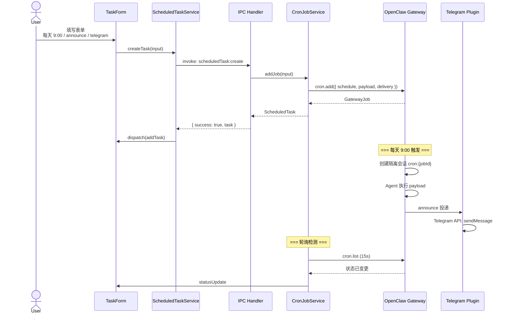
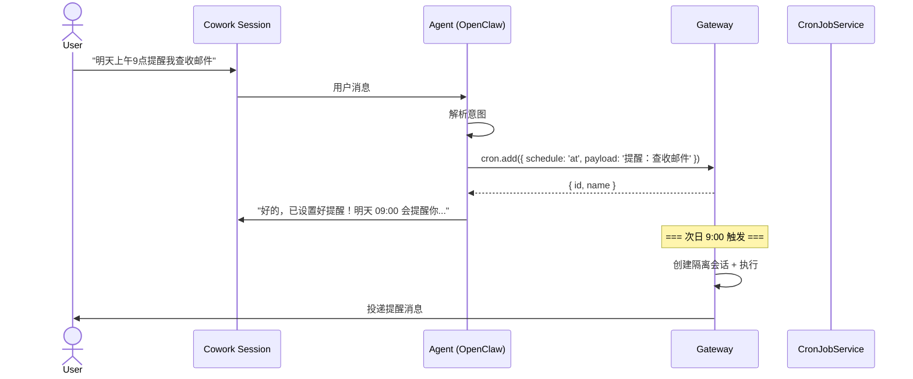

# JustDo 定时任务系统设计文档

## 1. 概述

JustDo 定时任务系统是一套横跨 **Renderer(UI) → Main Process(IPC) → OpenClaw Gateway(调度引擎)** 三层的端到端自动化执行框架。用户可通过 UI 界面或对话创建定时任务，由 OpenClaw Cron 引擎调度触发，执行结果可推送到 IM 平台或 Webhook。

### 1.1 核心设计理念

| 理念 | 说明 |
|------|------|
| **OpenClaw 驱动** | 所有调度、执行、投递由 OpenClaw Gateway 原生完成，JustDo 仅负责任务 CRUD 和 UI 展示 |
| **策略模式(Policy Pattern)** | 不同来源的任务各自拥有独立策略类，控制默认参数、绑定关系、只读字段 |
| **来源推断(Origin Inference)** | 通过 `sessionKey` 格式反向推断任务来源，实现与旧数据无缝兼容 |
| **流式轮询** | 15 秒间隔轮询机制将 OpenClaw 状态变化实时推送到 UI |

### 1.2 系统架构

```
┌─────────────────────────────────────────────────────────────┐
│                     Renderer Process                         │
│  ┌─────────────────┐  ┌─────────────────┐  ┌─────────────┐  │
│  │   TaskForm      │  │    TaskList     │  │  TaskDetail │  │
│  └─────────────────┘  └─────────────────┘  └─────────────┘  │
│                                                             │
│  ┌─────────────────────────────────────────────────────┐    │
│  │           ScheduledTaskService (IPC 封装)           │    │
│  │           scheduledTaskSlice (Redux Store)          │    │
│  └─────────────────────────────────────────────────────┘    │
├─────────────────────────────────────────────────────────────┤
│                     Main Process                             │
│  ┌─────────────────────────────────────────────────────┐    │
│  │          IPC Handlers (scheduledTask:*)             │    │
│  │          CronJobService (Gateway 适配器)            │    │
│  └─────────────────────────────────────────────────────┘    │
│                                                             │
│  ┌─────────────────────────────────────────────────────┐    │
│  │     TaskModelMapper / TaskPolicyRegistry            │    │
│  │     inferOriginAndBinding / enginePrompt            │    │
│  └─────────────────────────────────────────────────────┘    │
├─────────────────────────────────────────────────────────────┤
│                     OpenClaw Gateway                         │
│  ┌─────────────────┐  ┌─────────────────┐  ┌─────────────┐  │
│  │  Cron Scheduler │  │  Agent Executor │  │ Delivery    │  │
│  └─────────────────┘  └─────────────────┘  └─────────────┘  │
│                                                             │
│  ┌─────────────────────────────────────────────────────┐    │
│  │   Channel Adapters (Telegram / Discord / Webhook)   │    │
│  └─────────────────────────────────────────────────────┘    │
└─────────────────────────────────────────────────────────────┘
```

---

## 2. 类型系统

### 2.1 常量定义

所有枚举值定义在 [constants.ts](src/scheduledTask/constants.ts):

```typescript
// 调度类型
export const ScheduleKind = {
  At: 'at',      // 一次性任务
  Every: 'every', // 固定间隔
  Cron: 'cron',  // Cron 表达式
} as const;

// Payload 类型
export const PayloadKind = {
  AgentTurn: 'agentTurn',  // Agent 对话轮次
  SystemEvent: 'systemEvent', // 系统事件注入
} as const;

// 投递模式
export const DeliveryMode = {
  None: 'none',       // 不投递
  Announce: 'announce', // IM 通道投递
  Webhook: 'webhook',  // HTTP POST 投递
} as const;

// 会话目标
export const SessionTarget = {
  Main: 'main',       // 在主会话中执行
  Isolated: 'isolated', // 创建隔离会话
} as const;

// 唤醒模式
export const WakeMode = {
  Now: 'now',             // 立即触发
  NextHeartbeat: 'next-heartbeat', // 等待下次心跳
} as const;

// 任务来源类型
export const OriginKind = {
  Legacy: 'legacy',   // 旧版任务
  IM: 'im',           // IM 创建
  Cowork: 'cowork',   // Cowork 会话创建
  Cron: 'cron',       // Cron 系统创建
  Manual: 'manual',   // UI 手动创建
} as const;

// 执行绑定类型
export const BindingKind = {
  NewSession: 'new_session',   // 每次创建新会话
  UISession: 'ui_session',     // 绑定 UI 会话
  IMSession: 'im_session',     // 绑定 IM 会话
  SessionKey: 'session_key',   // 使用显式 sessionKey
} as const;

// 任务状态
export const TaskStatus = {
  Success: 'success',
  Error: 'error',
  Skipped: 'skipped',
  Running: 'running',
} as const;
```

### 2.2 核心类型定义

类型定义在 [types.ts](src/scheduledTask/types.ts):

```typescript
// 调度配置
export interface ScheduleAt {
  kind: 'at';
  at: string;  // ISO 8601 时间戳
}
export interface ScheduleEvery {
  kind: 'every';
  everyMs: number;  // 间隔毫秒数
  anchorMs?: number; // 首次触发锚点
}
export interface ScheduleCron {
  kind: 'cron';
  expr: string;  // Cron 表达式
  tz?: string;   // 时区
  staggerMs?: number; // 随机延迟
}
export type Schedule = ScheduleAt | ScheduleEvery | ScheduleCron;

// 执行内容
export interface AgentTurnPayload {
  kind: 'agentTurn';
  message: string;  // Agent 执行的 prompt
  timeoutSeconds?: number;
  model?: string;   // 可选模型指定
}
export interface SystemEventPayload {
  kind: 'systemEvent';
  text: string;  // 注入的系统事件文本
}
export type ScheduledTaskPayload = AgentTurnPayload | SystemEventPayload;

// 投递配置
export interface ScheduledTaskDelivery {
  mode: DeliveryMode;
  channel?: string;    // IM 通道: 'telegram', 'discord'
  to?: string;         // 目标标识
  accountId?: string;  // 多账号标识
  bestEffort?: boolean;
}

// 任务状态
export interface TaskState {
  nextRunAtMs: number | null;     // 下次触发时间
  lastRunAtMs: number | null;     // 最后执行时间
  lastStatus: TaskLastStatus;     // 最后状态
  lastError: string | null;       // 最后错误
  lastDurationMs: number | null;  // 最后执行时长
  runningAtMs: number | null;     // 正在执行时间戳
  consecutiveErrors: number;      // 连续错误次数
}

// 任务定义
export interface ScheduledTask {
  id: string;
  name: string;
  description: string;
  enabled: boolean;
  schedule: Schedule;
  sessionTarget: SessionTarget;
  wakeMode: WakeMode;
  payload: ScheduledTaskPayload;
  delivery: ScheduledTaskDelivery;
  agentId: string | null;
  sessionKey: string | null;
  state: TaskState;
  createdAt: string;
  updatedAt: string;
}
```

---

## 3. 来源与绑定推断

### 3.1 TaskOrigin -- 任务来源

定义在 [origin.ts](src/scheduledTask/origin.ts):

```typescript
export type TaskOrigin =
  | { kind: 'legacy' }                                         // 旧版任务
  | { kind: 'im'; platform: string; conversationId: string }   // IM 创建
  | { kind: 'cowork'; sessionId: string }                      // Cowork 创建
  | { kind: 'cron'; jobId: string }                            // Cron 系统创建
  | { kind: 'manual' };                                        // UI 手动创建
```

### 3.2 ExecutionBinding -- 执行绑定

```typescript
export type ExecutionBinding =
  | { kind: 'new_session' }                                      // 每次触发创建新会话
  | { kind: 'ui_session'; sessionId: string }                    // 绑定 UI 会话
  | { kind: 'im_session'; platform: string; conversationId: string; sessionId?: string } // 绑定 IM 会话
  | { kind: 'session_key'; sessionKey: string };                 // 使用显式 sessionKey
```

### 3.3 inferOriginAndBinding -- 反向推断函数

通过解析 `sessionKey` 格式反向推断来源和绑定:

```typescript
// 文件: src/scheduledTask/origin.ts

export function inferOriginAndBinding(task: InferableTask): {
  origin: TaskOrigin;
  binding: ExecutionBinding;
} {
  const sk = (task.sessionKey ?? '').trim();

  // 1. Managed session key: "agent:main:JustDo:{sessionId}"
  if (sk && isManagedSessionKey(sk)) {
    const parsed = parseManagedSessionKey(sk);
    if (parsed) {
      // 检查是否配置了 IM 通道投递
      const isIMChannel = task.delivery?.mode === 'announce' && 
        task.delivery?.channel && task.delivery.channel !== 'last';
      
      if (isIMChannel) {
        return {
          origin: { kind: 'im', platform: task.delivery.channel, conversationId: '' },
          binding: { kind: 'im_session', platform: task.delivery.channel, conversationId: '', sessionId: parsed.sessionId },
        };
      }
      return {
        origin: { kind: 'cowork', sessionId: parsed.sessionId },
        binding: { kind: 'ui_session', sessionId: parsed.sessionId },
      };
    }
  }

  // 2. Cron session key: "cron:{jobId}" or "agent:{agentId}:cron:{jobId}"
  if (sk && isCronSessionKey(sk)) {
    const idx = sk.lastIndexOf('cron:');
    const jobId = idx >= 0 ? sk.slice(idx + 'cron:'.length) : sk;
    return {
      origin: { kind: 'cron', jobId },
      binding: { kind: 'session_key', sessionKey: sk },
    };
  }

  // 3. Unknown sessionKey → session_key binding
  if (sk) {
    return {
      origin: { kind: 'cowork', sessionId: '' },
      binding: { kind: 'session_key', sessionKey: sk },
    };
  }

  // 4. No sessionKey → manual origin
  return {
    origin: { kind: 'manual' },
    binding: { kind: 'new_session' },
  };
}
```

### 3.4 SessionKey 格式说明

| 类型 | 格式 | 示例 | 用途 |
|------|------|------|------|
| 托管会话 | `agent:main:JustDo:{sessionId}` | `agent:main:JustDo:abc123` | UI/Cowork 创建的会话 |
| 通道会话 | `agent:{agentId}:{platform}:{subtype}:{conversationId}` | `agent:main:telegram:direct:ou_xxx` | IM 通道会话 |
| Cron 会话 | `cron:{jobId}` | `cron:job-456` | 隔离 Cron 任务的独立会话 |

---

## 4. 策略模式 (Policy Pattern)

策略模式是定时任务系统的核心设计抽象，用于处理不同来源任务的差异化行为。

### 4.1 TaskPolicy 接口

定义在 [policies/types.ts](src/scheduledTask/policies/types.ts):

```typescript
export interface TaskPolicy {
  readonly kind: TaskOrigin['kind'];

  /** 返回该来源任务的默认参数 */
  getCreateDefaults(origin: TaskOrigin): Partial<PolicyTaskInput>;

  /** 保存前的归一化校验（自动填充、绑定一致性） */
  normalizeDraft(draft: PolicyTaskModel): PolicyTaskModel;

  /** 用户修改投递配置时联动更新绑定关系 */
  onDeliveryChanged(draft: PolicyTaskModel, newDelivery: PolicyDelivery): PolicyTaskModel;

  /** 将 ExecutionBinding 映射为 sessionTarget/sessionKey */
  toWireBinding(binding: ExecutionBinding): WireBinding;

  /** 生成人类可读的运行行为描述 */
  describeRunBehavior(task: PolicyTaskModel): string;

  /** 返回 UI 中不可编辑的字段列表 */
  getReadonlyFields(): string[];
}
```

### 4.2 四种策略实现

| 策略类 | 文件 | 来源类型 | 默认 sessionTarget | 默认 wakeMode | 默认 delivery | 只读字段 |
|--------|------|----------|-------------------|---------------|--------------|---------|
| `ManualTaskPolicy` | [manualPolicy.ts](src/scheduledTask/policies/manualPolicy.ts) | `manual` | `isolated` | `now` | `announce` + `last` | 无 |
| `IMTaskPolicy` | [imPolicy.ts](src/scheduledTask/policies/imPolicy.ts) | `im` | `main` | `now` | `announce` + 来源平台 | `origin` |
| `CoworkTaskPolicy` | [coworkPolicy.ts](src/scheduledTask/policies/coworkPolicy.ts) | `cowork` | `main` | `now` | `announce` + `last` | `origin` |
| `LegacyTaskPolicy` | [legacyPolicy.ts](src/scheduledTask/policies/legacyPolicy.ts) | `legacy` | `main` | `next-heartbeat` | 无 | `origin` |

### 4.3 ManualTaskPolicy 实现

```typescript
// 文件: src/scheduledTask/policies/manualPolicy.ts

export class ManualTaskPolicy implements TaskPolicy {
  readonly kind = OriginKind.Manual;

  getCreateDefaults(): Partial<PolicyTaskInput> {
    return {
      sessionTarget: SessionTarget.Isolated,
      wakeMode: WakeMode.Now,
      delivery: { mode: DeliveryMode.Announce, channel: DeliveryChannel.Last },
    };
  }

  normalizeDraft(draft: PolicyTaskModel): PolicyTaskModel {
    // 如果选择了 IM 投递但绑定不是 im_session，自动关联
    if (draft.delivery.mode === DeliveryMode.Announce
        && draft.delivery.channel
        && draft.delivery.channel !== DeliveryChannel.Last
        && draft.binding.kind !== BindingKind.IMSession) {
      return {
        ...draft,
        binding: { kind: BindingKind.IMSession, platform: draft.delivery.channel, conversationId: '' },
      };
    }
    // 如果绑定是 im_session 但 delivery 不是 announce，重置
    if (draft.binding.kind === BindingKind.IMSession
        && draft.delivery.mode !== DeliveryMode.Announce) {
      return { ...draft, binding: { kind: BindingKind.NewSession } };
    }
    return draft;
  }

  onDeliveryChanged(draft: PolicyTaskModel, newDelivery: PolicyDelivery): PolicyTaskModel {
    // 选择 IM 投递时自动切换为 im_session 绑定
    if (newDelivery.mode === DeliveryMode.Announce
        && newDelivery.channel
        && newDelivery.channel !== DeliveryChannel.Last) {
      return {
        ...draft,
        delivery: newDelivery,
        binding: { kind: BindingKind.IMSession, platform: newDelivery.channel, conversationId: '' },
      };
    }
    // 切换为 none/webhook 时重置绑定
    if (newDelivery.mode === DeliveryMode.None || newDelivery.mode === DeliveryMode.Webhook) {
      return { ...draft, delivery: newDelivery, binding: { kind: BindingKind.NewSession } };
    }
    return { ...draft, delivery: newDelivery };
  }

  toWireBinding(binding: ExecutionBinding): WireBinding {
    switch (binding.kind) {
      case BindingKind.NewSession:
        return { sessionTarget: SessionTarget.Main, sessionKey: null };
      case BindingKind.UISession:
        return { sessionTarget: SessionTarget.Main, sessionKey: buildManagedSessionKey(binding.sessionId) };
      case BindingKind.IMSession:
        if (binding.sessionId) {
          return { sessionTarget: SessionTarget.Main, sessionKey: buildManagedSessionKey(binding.sessionId) };
        }
        return { sessionTarget: SessionTarget.Main, sessionKey: null };
      case BindingKind.SessionKey:
        return { sessionTarget: SessionTarget.Isolated, sessionKey: binding.sessionKey };
    }
  }

  describeRunBehavior(task: PolicyTaskModel): string {
    switch (task.binding.kind) {
      case BindingKind.NewSession: return RunBehavior.newSession;
      case BindingKind.UISession: return RunBehavior.uiSession;
      case BindingKind.IMSession: return RunBehavior.imSession(task.binding.platform);
      case BindingKind.SessionKey: return RunBehavior.sessionKey;
    }
  }

  getReadonlyFields(): string[] {
    return [];  // UI 创建的任务无只读字段
  }
}
```

### 4.4 TaskPolicyRegistry

定义在 [policies/registry.ts](src/scheduledTask/policies/registry.ts):

```typescript
export class TaskPolicyRegistry {
  private readonly policies: Map<string, TaskPolicy>;

  constructor(policies: TaskPolicy[]) {
    this.policies = new Map(policies.map(p => [p.kind, p]));
  }

  get(origin: TaskOrigin): TaskPolicy {
    return this.policies.get(origin.kind) ?? this.policies.get(OriginKind.Manual)!;
  }
}

export const taskPolicyRegistry = new TaskPolicyRegistry([
  new LegacyTaskPolicy(),
  new IMTaskPolicy(),
  new CoworkTaskPolicy(),
  new ManualTaskPolicy(),
]);
```

---

## 5. TaskModelMapper

负责 **线格式(Wire Format)** 与 **领域模型(Domain Model)** 之间的双向转换。

定义在 [modelMapper.ts](src/scheduledTask/modelMapper.ts):

```typescript
export class TaskModelMapper {
  /** 从 IPC 数据还原领域模型（含 origin + binding） */
  fromWire(wire: WireTask, meta?: { origin: TaskOrigin; binding: ExecutionBinding }): PolicyTaskModel {
    const resolved = meta ?? inferOriginAndBinding(wire);
    return {
      ...wire,
      origin: resolved.origin,
      binding: resolved.binding,
    };
  }

  /** 保存时转为 IPC 格式 */
  toWireInput(model: PolicyTaskModel, policy: TaskPolicy): PolicyTaskInput {
    const wireBinding = policy.toWireBinding(model.binding);
    return {
      name: model.name,
      description: model.description,
      enabled: model.enabled,
      schedule: model.schedule,
      sessionTarget: wireBinding.sessionTarget,
      wakeMode: model.wakeMode,
      payload: model.payload,
      delivery: model.delivery,
      agentId: model.agentId,
      sessionKey: wireBinding.sessionKey,
    };
  }

  /** 创建空白草稿 */
  createDraft(origin: TaskOrigin, defaults: Partial<PolicyTaskInput>): PolicyTaskModel {
    const now = new Date().toISOString();
    return {
      id: `draft-${Date.now()}`,
      name: defaults.name ?? '',
      description: defaults.description ?? '',
      enabled: defaults.enabled ?? true,
      schedule: defaults.schedule ?? { kind: ScheduleKind.Every, everyMs: 3600000 },
      sessionTarget: defaults.sessionTarget ?? SessionTarget.Main,
      wakeMode: defaults.wakeMode ?? WakeMode.Now,
      payload: defaults.payload ?? { kind: PayloadKind.SystemEvent, text: '' },
      delivery: defaults.delivery ?? { mode: DeliveryMode.None },
      agentId: defaults.agentId ?? null,
      sessionKey: defaults.sessionKey ?? null,
      state: { nextRunAtMs: null, lastRunAtMs: null, lastStatus: null, lastError: null, lastDurationMs: null, runningAtMs: null, consecutiveErrors: 0 },
      createdAt: now,
      updatedAt: now,
      origin,
      binding: { kind: BindingKind.NewSession },
    };
  }
}
```

---

## 6. IPC 通信设计

### 6.1 IPC 通道定义

定义在 [constants.ts](src/scheduledTask/constants.ts):

```typescript
export const IpcChannel = {
  // CRUD 操作
  List: 'scheduledTask:list',
  Get: 'scheduledTask:get',
  Create: 'scheduledTask:create',
  Update: 'scheduledTask:update',
  Delete: 'scheduledTask:delete',
  Toggle: 'scheduledTask:toggle',
  
  // 执行控制
  RunManually: 'scheduledTask:runManually',
  Stop: 'scheduledTask:stop',
  
  // 运行历史
  ListRuns: 'scheduledTask:listRuns',
  CountRuns: 'scheduledTask:countRuns',
  ListAllRuns: 'scheduledTask:listAllRuns',
  ResolveSession: 'scheduledTask:resolveSession',
  
  // 通道查询
  ListChannels: 'scheduledTask:listChannels',
  ListChannelConversations: 'scheduledTask:listChannelConversations',
  
  // 状态推送
  StatusUpdate: 'scheduledTask:statusUpdate',  // 任务状态变更
  RunUpdate: 'scheduledTask:runUpdate',        // 运行记录更新
  Refresh: 'scheduledTask:refresh',            // 全量刷新信号
} as const;
```

### 6.2 IPC Handlers 实现

定义在 [handlers.ts](src/main/ipcHandlers/scheduledTask/handlers.ts):

```typescript
export function registerScheduledTaskHandlers(deps: ScheduledTaskHandlerDeps): void {
  const { getCronJobService, getOpenClawRuntimeAdapter } = deps;

  // 列出所有任务
  ipcMain.handle(ScheduledTaskIpc.List, async () => {
    if (!getOpenClawRuntimeAdapter()?.getGatewayClient()) {
      return { success: true, tasks: [] };  // Gateway 未就绪时返回空列表
    }
    const tasks = await getCronJobService().listJobs();
    return { success: true, tasks };
  });

  // 创建任务
  ipcMain.handle(ScheduledTaskIpc.Create, async (_event, input) => {
    const task = await getCronJobService().addJob(input);
    return { success: true, task };
  });

  // 更新任务
  ipcMain.handle(ScheduledTaskIpc.Update, async (_event, id, input) => {
    const task = await getCronJobService().updateJob(id, input);
    return { success: true, task };
  });

  // 手动触发执行
  ipcMain.handle(ScheduledTaskIpc.RunManually, async (_event, id) => {
    await getCronJobService().runJob(id);
    return { success: true };
  });

  // ... 其他 handlers
}
```

---

## 7. CronJobService -- Gateway 适配器

### 7.1 职责

`CronJobService` 是 JustDo 与 OpenClaw Gateway 之间的适配器层，封装所有 Cron RPC 调用。

定义在 [cronJobService.ts](src/scheduledTask/cronJobService.ts):

```typescript
export class CronJobService {
  private readonly getGatewayClient: () => GatewayClientLike | null;
  private readonly ensureGatewayReady: () => Promise<void>;
  private pollingTimer: ReturnType<typeof setInterval> | null = null;
  private lastKnownStates: Map<string, string> = new Map();
  private lastKnownRunAtMs: Map<string, number> = new Map();
  private jobNameCache: Map<string, string> = new Map();  // jobId → name 映射
  private runningJobIds: Set<string> = new Set();

  private static readonly POLL_INTERVAL_MS = 15_000;  // 15 秒轮询间隔

  // Gateway RPC 方法映射
  async addJob(input: ScheduledTaskInput): Promise<ScheduledTask>;
  async updateJob(id: string, input: Partial<ScheduledTaskInput>): Promise<ScheduledTask>;
  async removeJob(id: string): Promise<void>;
  async listJobs(): Promise<ScheduledTask[]>;
  async toggleJob(id: string, enabled: boolean): Promise<ScheduledTask>;
  async runJob(id: string): Promise<void>;
  async listRuns(jobId: string, limit?: number, offset?: number): Promise<ScheduledTaskRun[]>;
  async listAllRuns(limit?: number, offset?: number): Promise<ScheduledTaskRunWithName[]>;

  // 轮询机制
  startPolling(): void;
  stopPolling(): void;
}
```

### 7.2 Gateway RPC 方法映射

| CronJobService 方法 | Gateway RPC | 说明 |
|---------------------|------------|------|
| `addJob()` | `cron.add` | 创建 Cron Job |
| `updateJob()` | `cron.update` | 更新 Cron Job (patch 模式) |
| `removeJob()` | `cron.remove` | 删除 Cron Job |
| `toggleJob()` | `cron.update` | 更新 enabled 字段 |
| `runJob()` | `cron.run` | 立即触发执行 |
| `listJobs()` | `cron.list` | 列出所有 Job (含 disabled) |
| `listRuns()` | `cron.runs` | 查询运行历史 |
| `listAllRuns()` | `cron.runs` | 查询全局运行历史 |

### 7.3 类型映射

```typescript
// Gateway 类型 → JustDo 类型
export function mapGatewaySchedule(schedule: GatewaySchedule): Schedule;
export function mapGatewayTaskState(state: GatewayJobState, deliveryMode?: DeliveryMode): TaskState;
export function mapGatewayJob(job: GatewayJob): ScheduledTask;
export function mapGatewayRun(entry: GatewayRunLogEntry): ScheduledTaskRun;

// JustDo 类型 → Gateway 类型
function toGatewaySchedule(schedule: Schedule): GatewaySchedule;
function toGatewayPayload(payload: ScheduledTaskPayload): GatewayPayload;
function toGatewayDelivery(delivery?: ScheduledTaskDelivery): GatewayDelivery | undefined;
```

### 7.4 轮询机制

```typescript
// 文件: src/scheduledTask/cronJobService.ts

private async pollOnce(): Promise<void> {
  const client = this.getGatewayClient();
  if (!client) return;

  // 1. 获取所有任务状态
  const result = await client.request<{ jobs?: GatewayJob[] }>('cron.list', {
    includeDisabled: true,
    limit: 200,
  });
  const jobs = Array.isArray(result.jobs) ? result.jobs : [];

  // 2. 更新 jobId → name 缓存
  this.jobNameCache.clear();
  this.runningJobIds.clear();
  for (const job of jobs) {
    this.jobNameCache.set(job.id, job.name);
    if (job.state.runningAtMs) {
      this.runningJobIds.add(job.id);
    }
  }

  // 3. 检测状态变更并推送
  for (const job of jobs) {
    const stateHash = JSON.stringify(job.state);
    const previousHash = this.lastKnownStates.get(job.id);
    if (previousHash !== stateHash) {
      this.lastKnownStates.set(job.id, stateHash);
      if (previousHash !== undefined) {
        const task = mapGatewayJob(job);
        this.emitStatusUpdate(task.id, task.state);  // → UI
      }
    }

    // 4. 检测新运行记录
    const lastRunAtMs = job.state.lastRunAtMs ?? 0;
    const previousRunAtMs = this.lastKnownRunAtMs.get(job.id) ?? 0;
    if (lastRunAtMs > previousRunAtMs && previousRunAtMs > 0) {
      const runs = await this.listRuns(job.id, 1, 0);
      if (runs[0]) {
        const task = mapGatewayJob(job);
        this.emitRunUpdate({ ...runs[0], taskName: task.name });  // → UI
      }
    }
    this.lastKnownRunAtMs.set(job.id, lastRunAtMs);
  }

  // 5. 首次轮询发送刷新信号
  if (!this.firstPollDone) {
    this.firstPollDone = true;
    this.emitFullRefresh();
  }
}
```

---

## 8. OpenClaw Cron 调度引擎

OpenClaw Gateway 内置 Cron 调度引擎，负责定时任务的存储、调度触发、会话创建、Agent 执行和结果投递。

### 8.1 Cron Job 数据模型

```typescript
interface GatewayJob {
  id: string;
  name: string;
  description?: string;
  enabled: boolean;
  schedule: GatewaySchedule;           // at | every | cron
  sessionTarget: 'main' | 'isolated';
  wakeMode: 'now' | 'next-heartbeat';
  payload: GatewayPayload;            // systemEvent | agentTurn
  delivery?: GatewayDelivery;         // announce | webhook | none
  agentId?: string | null;
  sessionKey?: string | null;
  deleteAfterRun?: boolean;           // 一次性任务自动删除
  state: GatewayJobState;
  createdAtMs: number;
  updatedAtMs: number;
}
```

### 8.2 执行路径

| sessionTarget | 执行路径 | 说明 |
|---------------|---------|------|
| `main` | 主会话路径 | 将 `systemEvent` 注入主会话时间线，按 `wakeMode` 触发 Agent |
| `isolated` | 隔离会话路径 | 创建独立会话 `cron:{jobId}`，Agent 在独立上下文执行 |

### 8.3 Announce 投递流程

当隔离任务完成且 `delivery.mode = 'announce'` 时:

1. **Channel 路由**: 根据 `delivery.channel` 选择 Channel Adapter (Telegram/Discord)
2. **目标解析**: `delivery.to` 指定接收者
3. **消息分块**: 长消息自动分块适配平台限制
4. **去重检查**: 跳过已发送的重复消息
5. **心跳过滤**: 纯心跳响应不投递

### 8.4 重试与错误处理

**瞬态错误（自动重试）**:
- 速率限制 (429)
- 网络错误 (timeout, ECONNRESET)
- 服务器错误 (5xx)

**永久错误（立即禁用）**:
- 认证失败
- 配置/验证错误

**重试策略**:

| 任务类型 | 重试次数 | 退避策略 | 失败后行为 |
|---------|---------|---------|-----------|
| 一次性 (`at`) | 最多 3 次 | 30s → 1m → 5m | 禁用或删除 |
| 循环 (`cron`/`every`) | 不限次 | 30s → 1m → 5m → 15m → 60m | 保持启用 |

---

## 9. Engine Prompt

定义 Agent 在不同引擎下如何处理定时任务请求。

定义在 [enginePrompt.ts](src/scheduledTask/enginePrompt.ts):

```typescript
export function buildScheduledTaskEnginePrompt(engine: CoworkAgentEngine): string {
  if (engine === 'openclaw') {
    return [
      '## Scheduled Tasks',
      '- Use the native `cron` tool for any scheduled task creation or management request.',
      '- For scheduled-task creation, call native `cron` with `action: "add"` / `cron.add`.',
      '- Prefer the active conversation context when the user wants scheduled replies.',
      '- When `cron.add` includes any channel delivery config, you MUST set `sessionTarget: "isolated"`.',
      '- For one-time reminders (`schedule.kind: "at"`), send a future ISO timestamp with timezone offset.',
      '- Do not use wrapper payloads or channel-specific relay formats for reminders.',
      '- Never emulate reminders with Bash, `sleep`, background jobs, or manual process management.',
      '',
      '### Message delivery in scheduled-task sessions',
      '- When running in a scheduled-task session, do NOT call `message` tool directly.',
      '- The cron system handles result delivery automatically based on delivery config.',
      '- Output results as plain text; the cron system will forward if delivery is configured.',
    ].join('\n');
  }

  // 非 OpenClaw 引擎提示用户切换
  return [
    '## Scheduled Tasks',
    `- Scheduled tasks are only available in OpenClaw. Switch the agent engine to OpenClaw.`,
  ].join('\n');
}
```

---

## 10. 完整生命周期示例

### 10.1 UI 创建 + Telegram 投递



### 10.2 对话中创建定时提醒



---

## 11. 关键文件清单

| 文件 | 职责 |
|------|------|
| [src/scheduledTask/constants.ts](src/scheduledTask/constants.ts) | 常量定义 (ScheduleKind, PayloadKind, DeliveryMode, IPC 通道等) |
| [src/scheduledTask/types.ts](src/scheduledTask/types.ts) | 核心类型定义 (ScheduledTask, Schedule, Payload, Delivery, TaskState) |
| [src/scheduledTask/origin.ts](src/scheduledTask/origin.ts) | 来源与绑定推断 (TaskOrigin, ExecutionBinding, inferOriginAndBinding) |
| [src/scheduledTask/modelMapper.ts](src/scheduledTask/modelMapper.ts) | Wire ↔ Domain 模型转换 |
| [src/scheduledTask/cronJobService.ts](src/scheduledTask/cronJobService.ts) | Gateway 适配器 (RPC 封装 + 轮询) |
| [src/scheduledTask/enginePrompt.ts](src/scheduledTask/enginePrompt.ts) | Agent 行为提示词 |
| [src/scheduledTask/policies/types.ts](src/scheduledTask/policies/types.ts) | TaskPolicy 接口定义 |
| [src/scheduledTask/policies/manualPolicy.ts](src/scheduledTask/policies/manualPolicy.ts) | UI 手动创建策略 |
| [src/scheduledTask/policies/imPolicy.ts](src/scheduledTask/policies/imPolicy.ts) | IM 创建策略 |
| [src/scheduledTask/policies/coworkPolicy.ts](src/scheduledTask/policies/coworkPolicy.ts) | Cowork 创建策略 |
| [src/scheduledTask/policies/legacyPolicy.ts](src/scheduledTask/policies/legacyPolicy.ts) | 旧版任务兼容策略 |
| [src/scheduledTask/policies/registry.ts](src/scheduledTask/policies/registry.ts) | 策略注册表 |
| [src/main/ipcHandlers/scheduledTask/handlers.ts](src/main/ipcHandlers/scheduledTask/handlers.ts) | IPC Handler 实现 |
| [src/main/ipcHandlers/scheduledTask/helpers.ts](src/main/ipcHandlers/scheduledTask/helpers.ts) | 辅助函数 (通道列表) |
| [src/renderer/services/scheduledTask.ts](src/renderer/services/scheduledTask.ts) | Renderer IPC 封装 |
| [src/renderer/components/scheduledTasks/](src/renderer/components/scheduledTasks/) | UI 组件 (TaskForm, TaskList, TaskDetail) |

---

## 12. 设计决策总结

| 决策 | 理由 |
|------|------|
| 策略模式区分任务来源 | 不同来源的默认参数、绑定关系、只读字段各不相同，策略模式避免了大量 if-else |
| 来源推断而非存储 | 通过 sessionKey 格式反推来源，无需修改 OpenClaw 数据模型即可兼容旧数据 |
| 15 秒轮询而非 WebSocket | OpenClaw Gateway 不暴露实时事件流，轮询是简单可靠的状态同步方式 |
| `isolated` + `announce` 作为 IM 投递标准模式 | 隔离会话避免污染主聊天记录，announce 模式让 OpenClaw 原生处理消息投递 |