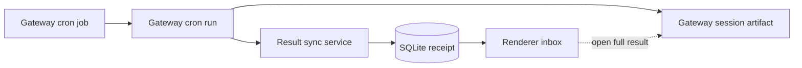

# 定时任务系统

本文按当前 `src/main/scheduler/`、`src/main/ipc/scheduledTask/`、`src/shared/scheduledTask/`、SQLite result store 与 Renderer 页面重写。系统使用 OpenClaw 原生 cron；JustDo 不是第二个调度器。

## 1. 双层模型

| 数据                               | 权威                                | 说明                                  |
| ---------------------------------- | ----------------------------------- | ------------------------------------- |
| Job 定义、enabled、next/last state | Gateway `cron.*`                    | JustDo 每次 list/get 映射 wire object |
| Run history 与执行 session         | Gateway `cron.runs`/session         | 可分页、可追溯完整 transcript         |
| 应用内结果、未读、读取时间         | SQLite receipt                      | Gateway run 的本地投影                |
| 结果同步 cursor/watermark          | SQLite KV                           | 保证跨重启 catch-up                   |
| 删除过的本地结果                   | 同步 suppression + artifact cleanup | 防 reconcile 立刻复活                 |

“in-app”是阅读位置，不是 OpenClaw delivery channel。delivery mode 仍只有 `none`、`announce`、`webhook`。

## 2. 领域类型

### 2.1 Schedule

- `at`: ISO 时间字符串；一次性执行。
- `every`: `everyMs` 和可选 `anchorMs`。
- `cron`: 表达式、可选 timezone 和 `staggerMs`。

### 2.2 Payload

- `agentTurn`: message，可选 timeout/model；使用隔离 scheduler agent。
- `systemEvent`: text；通常目标 main session。

### 2.3 Delivery 与目标

Delivery 包含 mode、channel、to、accountId、bestEffort。Session target 是 `main` 或 `isolated`；wake mode 是 `now` 或 `next-heartbeat`。channel option 可标 disabled，并用 accountId 区分多实例 bot。

### 2.4 状态

产品状态：success/error/skipped/running；Gateway wire 的 `ok` 映射为 success。TaskState 包含 next/last/running timestamp、last error/duration 和 consecutive errors。Run 另外保存 session id/key、summary、delivery status/error。

## 3. 组件

| 组件                             | 职责                                                        |
| -------------------------------- | ----------------------------------------------------------- |
| `CronJobService`                 | `cron.list/add/update/remove/run/runs` 映射、轮询、任务修复 |
| `ScheduledTaskResultStore`       | receipt、未读、cursor 分页、baseline/catch-up metadata      |
| `ScheduledTaskResultSyncService` | baseline、增量/强制 reconcile、durable catch-up、事件       |
| `OpenClawCronRunCleanupService`  | 删除 result 对应的 session tree、transcript/archive/run log |
| `cronJobServiceManager`          | 延迟组合 adapter、DB、services 和窗口广播                   |
| IPC handlers                     | 输入 normalize、job/result API、session history resolve     |
| Renderer slice/UI                | CronView、history、ResultInbox、RunSessionModal             |

## 4. Job CRUD

`CronJobService` 先 ensure Gateway ready，再调用 RPC。list 使用 `limit=200` 和 offset 遍历全部 job，去重 id，并验证 `nextOffset` 单调增加。get/update/toggle/run 先通过窄 query 找到当前 job，避免基于过期 UI patch。

Create 映射 schedule/payload/delivery；Agent-turn 强制 `agentId = justdo-scheduler`。Update 根据 payload kind 原子调整：

- 转为 agentTurn 时默认 isolated、分配 scheduler agent；
- 转为 systemEvent 时清除 scheduler agent 和不再适用的 session key；
- delivery 显式设 none 时发 `{mode:'none'}`，不是遗漏字段；
- mutation 按 task id 串行，避免 toggle/update/run 互相覆盖。

新建 job 即使调用方省略 delivery，也必须显式发送 `delivery: {mode:'none'}`。这样应用内结果不会因 OpenClaw 默认 delivery 改变而意外 announce；只有用户明确选择外发模式时才发送 channel/webhook 字段。

## 5. Scheduler agent 隔离

`justdo-scheduler` 是受管 agent，JustDo 创建或接管的 Agent-turn job 必须由它执行。list 会修复没有 `declarationKey` 的普通 job 的错误 assignment：成功则返回修复后 job；失败且 job enabled 时尝试禁用，避免以普通交互 agent/错误权限继续无人值守执行；连禁用都失败则整次 list 报错。带 `declarationKey` 的 job 由 OpenClaw extension/core 声明并维护（例如 memory dreaming），JustDo 不改写其 owner；这类环境任务通过 `agents.defaults.systemAgent.agentId = main` 获得明确归属。

toggle enabled 与 manual run 也会再次确认 assignment。用户不能用普通 cron mutation 把其他 agent 升级为 scheduler 的 full/unattended policy。

## 6. Delivery 修复

应用内结果不需要外部 channel。历史任务若因为默认 announce 且缺 channel 进入 delivery error/backoff，list 流程会识别 in-app-only 条件，修正为无外部 delivery 并清除不适用 backoff。不能吞掉真实 webhook/channel 发送失败。

## 7. Polling 与事件

Gateway 启动成功后开始 polling，退出清理先停止 polling。轮询比较 job state 和 lastRunAt，发 `StatusUpdate`、`RunUpdate`/`Refresh`，并调用 result sync。任务 ID 集合发生增删时必须发 `Refresh`，避免一次性任务执行后 Renderer 留下已被 Gateway 删除的陈旧 job。Gateway `cronChanged` 也触发 list/reconcile，并在完成或失败后通知 Renderer 刷新。

轮询失败记录 module-prefixed error并等待下轮；不能用空成功列表覆盖 UI，因为启动时事件可能早于 Renderer 订阅。`isCoworkBusy` 可用于降低后台竞争，但不是永远暂停调度的理由。

## 8. Result baseline

首次启用本地结果收件箱时不能把全部历史突然标未读：

1. 记录 `baselineAt`。
2. 全局取最近 200 个 run，每 task 最多 20 个。
3. 作为已知 baseline 写入 receipt/watermark，不产生 new-unread event。
4. 后续只把 baseline 后完成的新 run 作为 unread。

任务不在有限 baseline 窗口时，使用该任务 Gateway `lastRunAtMs` watermark 或 baseline timestamp，防止漏掉下一次运行。

## 9. 增量 reconcile 与 durable catch-up

普通轮询仅处理 lastRun 超过本地 completed-through 的任务。启动/手工刷新先 upsert 有界全局窗口，再按 task 分页向旧方向 catch-up：

- 页面 50；每轮最多收集 100；
- 以 boundary run id、startedAt、stopAt、ignoreKnown、resumeOffset 表达 continuation；
- continuation 持久化，应用重启后继续；
- run 按时间正序 upsert，因此事件和未读语义稳定；
- id 去重，校验 task/run id 和时间；坏数据跳过并记录脱敏警告；
- 已存在 receipt 可更新 summary/status/delivery，但保留已读状态。

同一时刻只允许一个 sync。force reconcile 在当前 sync 后排队；删除期间 reconcile 等待，避免竞态复活。

## 10. Result Store

`scheduled_task_run_receipts` 以 run id 为主键，保存任务名快照、session、状态、summary/error、delivery、时间、observed/read/updated。列表按 `(started_at DESC, run_id DESC)` keyset cursor 分页，limit 在 IPC 限为 1..100。unread 查询排除 running，mark read 使用 `COALESCE` 保留第一次阅读时间。

`scheduled_task_result_cleanup` 记录清理过程中归档路径/进度，支持失败重试。Baseline/watermark/catch-up metadata 位于 KV 的受管 key，不是 Gateway job 定义。

## 11. 删除结果

删除不是简单 `DELETE receipt`：

1. 校验 run id，读取 receipt；running 结果拒绝删除。
2. 对该 run 加 suppression，等待在途 sync。
3. Cleanup service 验证 session key属于 cron run，枚举最多 1000 个 session tree。
4. 通过 Gateway 删除 child -> root session/transcript，清 session approval grants。
5. 清 OpenClaw run log/受管 archive artifacts；路径必须在 state dir。
6. 全部成功后才物理删除 receipt；失败保留 receipt 以便重试。
7. 更新 unread count，解除 suppression。

删除 job 不自动等同删除所有已同步结果；两者生命周期独立。

## 12. Session resolve

结果详情先显示 receipt summary；用户打开完整运行时，用 `sessionKey` 调 adapter `fetchSessionHistoryByKey`，沿用 canonical chat projection。它依次尝试 `chat.history`、`sessions.resolve` 和 `sessions.get` fallback。

重试耗尽的诊断只记录 run id 规范化值、status、session kind、session key SHA-256 前 12 位 fingerprint 和是否有 sessionId，不记录完整 key 或消息内容。

## 13. Renderer

`scheduledTaskSlice` 保存 tasks、runs、result pages/unread 等共享状态。`CronView` 管理 create/edit/toggle/manual run；`TaskRunHistory` 展示单任务历史；`ResultInbox` 提供未读筛选、分页、标记和删除；`RunSessionModal` 复用 chat pipeline 展示完整历史。

事件订阅后仍需主动首次 list/results，不能依赖可能已错过的 startup refresh。optimistic toggle/run 应以 handler 返回或下次权威 list 回正。

## 14. IPC

Job：List/Get/Create/Update/Delete/Toggle/RunManually/ListRuns/ResolveSession/ListChannels。事件：StatusUpdate/RunUpdate/Refresh。Result：ListResults/MarkResultRead/MarkAllResultsRead/DeleteResult/ReconcileResults，以及 ResultUpserted/UnreadCountChanged。

IPC 对 id/taskId trim，limit clamp，cursor decode 校验；失败对 Renderer 返回稳定通用信息，详细内部错误只进日志且不能含 prompt/credential。

## 15. 失败处理

| 故障                        | 行为                                                  |
| --------------------------- | ----------------------------------------------------- |
| Gateway 未 ready            | handler 等待 ensureReady 或返回失败，不返回空成功     |
| list pagination cursor 异常 | 终止并报错，防无限循环                                |
| scheduler assignment 失败   | enabled job 尝试禁用，禁止不安全运行                  |
| reconcile 某批失败          | 恢复批前 continuation，下次从同边界重试               |
| artifact cleanup 失败       | 保留 receipt，不产生“已删除”假象                      |
| session history 暂不可用    | receipt仍可读；UI重试并做 fingerprint 诊断            |
| external delivery 缺失      | 仅在 in-app-only 条件修复，不掩盖真实 channel failure |

## 16. 测试与维护

修改 scheduled tasks 必须同步 shared、Main scheduler/IPC、Renderer 和数据文档。测试至少覆盖三类 schedule、payload 转换、assignment、pagination、manual run、polling、baseline、跨多页 catch-up、重启恢复、重复 upsert、read preservation、删除竞态/失败、session tree 安全和 UI 初始查询/事件。Gateway API 变更还需更新 capability matrix 与相关 runtime patch 测试。

## 17. Job 与 Result 是两套生命周期

```mermaid
flowchart LR
  Job[Gateway cron job]
  Run[Gateway cron run]
  Session[Gateway session artifact]
  Sync[Result sync service]
  Receipt[(SQLite receipt)]
  Inbox[Renderer inbox]

  Job --> Run --> Session
  Run --> Sync --> Receipt --> Inbox
  Inbox -.open full result.-> Session
```

禁用/删除 job 不等于删除已经产生的 result；删除 receipt 也不改写 job。Result summary 可以在 Gateway artifact 清理前存在，但用户请求删除时必须先完成或记录 artifact cleanup，避免 UI 消失而敏感内容仍遗留。

## 18. Polling 并发与游标

- 同一轮 reconcile 使用稳定分页边界，cursor 无进展或重复必须终止，防止无限循环。
- 批量 upsert 保留已有 `readAt`，重复观察同一 run 不应重新变未读。
- 失败时保存批次前 continuation；不能越过失败页提交更后的 cursor。
- startup baseline 区分“安装前历史”和“离线期间新结果”，durable catch-up 状态跨重启保存。
- poll、手工 refresh 和 Gateway event 可能并发，service 需串行/去重而不是并行覆盖 unread count。

## 19. Unattended 安全不变量

`agentTurn` 任务必须绑定 `justdo-scheduler` 隔离 agent，并使用受管无人值守 policy。错误 assignment 的 enabled job 要修复或禁用；绝不能回退到交互 agent 并等待不可出现的 approval modal。Webhook/channel delivery 中的 credential 由 Gateway/受管配置处理，receipt/log 只保留脱敏错误。

## 20. 代码与测试地图

| 行为                     | 入口                                                  |
| ------------------------ | ----------------------------------------------------- |
| Cron API mapping         | `src/main/scheduler/cronJobService.ts` 及测试         |
| Service composition      | `src/main/ipc/scheduledTask/cronJobServiceManager.ts` |
| IPC validation           | `src/main/ipc/scheduledTask/handlers.ts` 及测试       |
| Result reconcile         | `scheduledTaskResultSyncService.ts` 及同名测试        |
| Receipt/cleanup schema   | `src/main/data/scheduledTaskResultStore.ts` 及测试    |
| Shared schedule/delivery | `src/shared/scheduledTask/` 及测试                    |
| Renderer state/views     | `features/scheduled-tasks/`、`scheduledTaskSlice.ts`  |

## 21. 变更完成条件

新增 cron 字段必须从 shared type 到 Gateway mapping、create/update/read-back、UI edit 和测试全链路对称；新增 run status 要更新 result normalize、排序/终态、delivery error 和展示。任何 polling 优化必须验证跨多页、重启、重复事件和 read preservation，不能只测空列表与单页。
