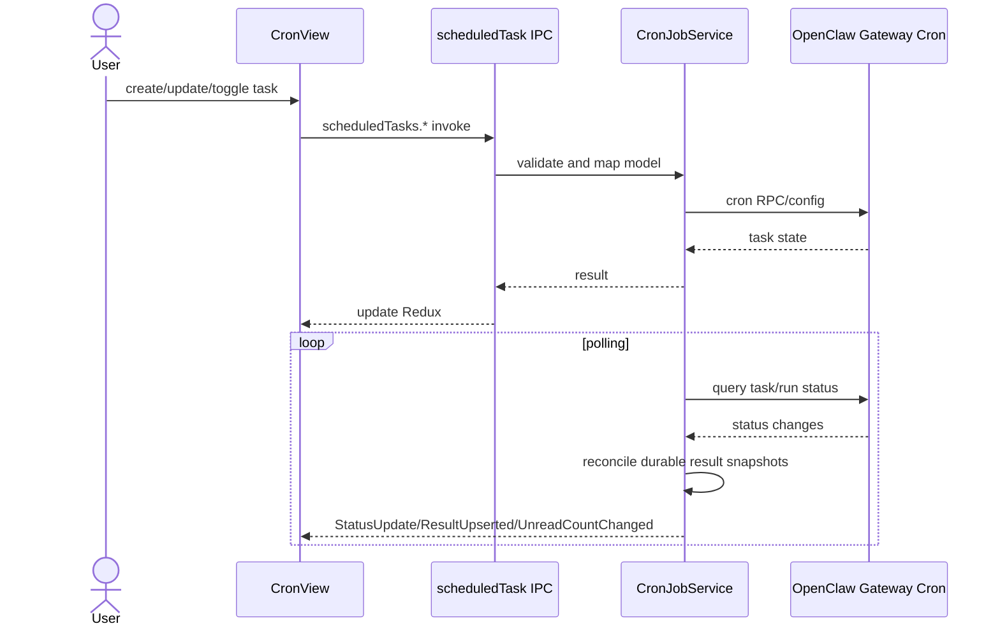
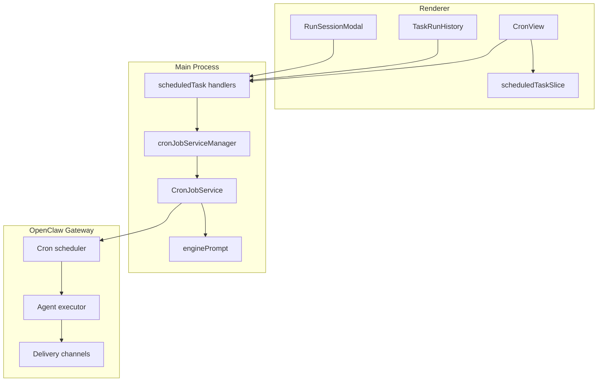
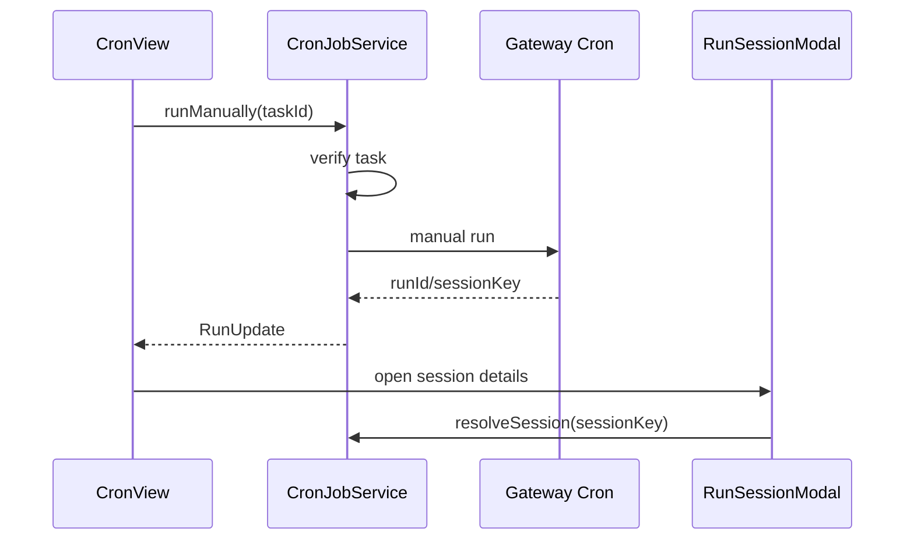

# 定时任务系统

JustDo 的定时任务 UI 在 renderer 中实现，Main 进程通过 OpenClaw cron runtime 执行任务。JustDo 保存任务展示和运行关联所需的本地状态，Gateway 负责实际执行。

## 关键文件

| 文件                                                   | 作用                                     |
| ------------------------------------------------------ | ---------------------------------------- |
| `src/renderer/features/scheduled-tasks/`               | 定时任务 UI、service、Redux slice        |
| `src/shared/scheduledTask/`                            | IPC constants、types、reminder text      |
| `src/main/ipc/scheduledTask/`                          | 定时任务 IPC handlers 和 service manager |
| `src/main/scheduler/cronJobService.ts`                 | OpenClaw cron adapter/polling            |
| `src/main/scheduler/scheduledTaskResultSyncService.ts` | Durable result reconciliation            |
| `src/main/data/scheduledTaskResultStore.ts`            | Result pagination and read receipts      |
| `src/main/scheduler/enginePrompt.ts`                   | 执行 prompt 构造                         |

## Preload API

`window.electron.scheduledTasks` 暴露：

- `list()`
- `get(id)`
- `create(input)`
- `update(id, input)`
- `delete(id)`
- `toggle(id, enabled)`
- `runManually(id)`
- `listRuns(taskId, limit?, offset?)`
- `resolveSession(sessionKey)`
- `listChannels()`
- `onStatusUpdate(callback)`
- `onRunUpdate(callback)`
- `onRefresh(callback)`
- `listResults(query?)`
- `markResultRead(runId)`
- `markAllResultsRead(taskId?)`
- `deleteResult(runId)`
- `reconcileResults()`
- `onResultUpserted(callback)`
- `onUnreadCountChanged(callback)`

IPC channel 常量位于 `src/shared/scheduledTask/constants.ts`。

## 执行流程


```mermaid
sequenceDiagram
  actor User
  participant UI as CronView
  participant IPC as scheduledTask IPC
  participant Service as CronJobService
  participant GW as OpenClaw Gateway Cron

  User->>UI: create/update/toggle task
  UI->>IPC: scheduledTasks.* invoke
  IPC->>Service: validate and map model
  Service->>GW: cron RPC/config
  GW-->>Service: task state
  Service-->>IPC: result
  IPC-->>UI: update Redux
  loop polling
    Service->>GW: query task/run status
    GW-->>Service: status changes
    Service->>Service: reconcile durable result snapshots
    Service-->>UI: StatusUpdate/ResultUpserted/UnreadCountChanged
  end
```

手动执行同样通过 `CronJobService` 委派给 Gateway，并用 session key 关联到可查看的 Cowork/Gateway 会话。

## UI 组件

| 组件                  | 作用                 |
| --------------------- | -------------------- |
| `CronView.tsx`        | 主视图               |
| `RunSessionModal.tsx` | 查看任务运行关联会话 |
| `TaskRunHistory.tsx`  | 运行历史             |
| `utils.ts`            | UI 辅助函数          |

## 数据边界

| 数据          | 权威来源                                   | JustDo 角色                |
| ------------- | ------------------------------------------ | -------------------------- |
| Cron 执行     | OpenClaw Gateway                           | 发起、展示、轮询           |
| 任务列表      | Gateway cron runtime + 本地 UI state       | 管理 UI                    |
| Run session   | Gateway session key                        | 解析和打开会话             |
| Result inbox  | SQLite snapshot + Gateway run facts        | 持久化摘要、状态和已读回执 |
| Reminder text | `src/shared/scheduledTask/reminderText.ts` | UI/Prompt 共享文本         |

## 维护规则

- 新增任务状态或 IPC channel 时，先更新 `src/shared/scheduledTask/constants.ts` 和 `types.ts`。
- Renderer 不直接轮询 Gateway；通过 Main IPC 和 service manager。
- 与自然语言 reminder 相关的用户可见文本需要 i18n 或共享纯函数覆盖测试。
- 修改 schedule parsing、run mapping、manual run 行为时补充 Vitest。

## 类型模型

定时任务契约位于 `src/shared/scheduledTask/`，目的是让 Main 和 Renderer 使用同一套领域语言。

核心概念：

| 概念           | 说明                                            |
| -------------- | ----------------------------------------------- |
| Schedule       | 任务触发时间，可以是一次性、固定间隔或 cron     |
| Payload        | 执行内容，通常是一次 agent turn 或 system event |
| Delivery       | 运行结果是否投递到外部 channel                  |
| Session target | 在已有会话执行，还是创建隔离会话                |
| Wake mode      | 立即唤醒或等待下一次 runtime heartbeat          |
| Run history    | 每次执行的状态、错误、耗时、关联 session        |

JustDo 只为主 Agent 配置 30 分钟 heartbeat，使 `main + systemEvent` 任务可以在
`wakeMode: "now"` 时立即唤醒主会话；自定义 Agent 不继承该周期。主 Agent 同时保留
OpenClaw 的常规 heartbeat 检查；`includeSystemPromptSection` 保持关闭，避免向普通
会话注入 heartbeat 说明。

共享 constants 中的 discriminant 必须使用 `as const` 对象，避免 renderer/main 写出不同字符串。

## Renderer 设计

```text
src/renderer/features/scheduled-tasks/
  scheduledTaskSlice.ts       Redux state
  scheduledTaskService.ts     preload API wrapper
  components/
    CronView.tsx              主页面、表单、列表
    TaskRunHistory.tsx        运行历史
    RunSessionModal.tsx       运行关联会话
    utils.ts                  展示辅助
```

Renderer 只负责：

- 表单输入和校验。
- 调用 CRUD API。
- 展示 next run、last run、last error。
- 订阅状态事件并刷新。
- 打开 run 对应的会话。
- 展示 SQLite 权威的未读数和分页结果列表。
- 按本地日期将结果组织为时间轴，并允许用户删除单条结果。

Renderer 不负责解析 Gateway cron 内部状态，也不直接访问 Gateway。

## Main 设计

```text
src/main/ipc/scheduledTask/
  index.ts
  handlers.ts
  helpers.ts
  cronJobServiceManager.ts

src/main/scheduler/
  cronJobService.ts
  scheduledTaskResultSyncService.ts
  enginePrompt.ts
```

`cronJobServiceManager` 负责在 Gateway adapter 可用后提供 `CronJobService`。这样应用启动早期即使 Gateway 未 ready，IPC handler 也可以返回清晰的“runtime not ready”状态。

`enginePrompt.ts` 负责把用户任务描述构造成 Gateway 执行 prompt。此处的变更会影响任务实际行为，应有测试覆盖。

JustDo 的内置 Gateway 会在原生 `cron` 工具边界为省略 `delivery` 的
`agentTurn` 任务补上 `{ mode: "none" }`。这适用于该 Gateway 服务的所有
Agent 会话；显式传入的 `announce` 和 `webhook` 保持不变。这样“仅在应用内”
是可靠的产品默认值，而不只依赖模型遵循 prompt。

### 无人值守权限

AgentTurn 定时任务固定使用隐藏的 `justdo-scheduler` Agent。OpenClaw 原生支持
`agents.list[].tools.exec` 每 Agent 覆盖；该 Agent 的 exec 与文件工具策略为 Full，host approvals
也使用独立的 per-agent Full entry。普通对话继续使用用户当前的全局 Ask/Smart/Full，任务是否启用
不会禁用或修改权限选择器。

JustDo UI 创建 AgentTurn 任务时直接写入 scheduler agent id。启动轮询、周期轮询、任务列表和
Gateway `cron` 事件都会分页迁移旧任务及经原生 cron 工具创建的任务；迁移失败的已启用任务会被
禁用，重新启用和手动运行则把归属校正与操作放进同一个任务锁。文件权限 compatibility extension
只对配置中明确列出的 scheduler agent 跳过审批，不根据 session key 或 job id 推断权限。
SystemEvent 只是唤醒目标会话，不作为独立 Full AgentTurn。

JustDo 不再根据 `agent:<agentId>:cron:<jobId>:run:<runId>` session key 和 job existence 自动放行。
session key 可由 Gateway 客户端构造，而 OpenClaw v2026.7.1-2 的公开 API 没有提供可与 approval 绑定的
可信 active-run attestation；在该证明缺失时自动 `allow-once` 会形成权限提升边界。

Agent 可以在对话中通过原生 cron 工具调用 add/update/remove/run；Ask/Smart 下这些修改操作进入
一次性人工审批，Full 下直接执行。compatibility extension 以随机 nonce 暂存有界的完整请求，Main
通过只读 Gateway 方法取回，并同时校验 agent、session 与 tool-call 身份；审批框以可滚动的多行
内容展示原始 cron 参数，包括任务名称、计划、启用状态、目标与 payload。详情取回失败时 Main
把该 approval 标记为只能拒绝，并在 resolve 层拒绝放行。批准创建只授权所展示的任务变更，
真正到点运行不再请求批准。
JustDo UI 则通过 scheduled-task IPC 直接调用 Gateway。两条入口最终使用同一个 Gateway cron
runtime，AgentTurn 任务在 scheduler Agent 中执行，不继承或修改交互会话权限。

OpenClaw 原生 cron 工具会先把新任务限定到调用 Agent；JustDo 收到事件后才能以 operator RPC 改为
scheduler。因此“已批准且立即到期”的原生任务仍存在极短的归属迁移窗口，可能先按普通 Agent 权限
执行并失败，但不会借此绕过 Ask/Smart 审批获得 Full。完全消除该窗口需要 OpenClaw 提供原子的
受信 scheduler assignment。Gateway operator、CLI、状态目录以及 scheduler Agent 的 host exec
仍属于受信任边界，完整隔离需要独立凭据和不可写的 scheduler state。


```mermaid
flowchart TB
  subgraph Renderer["Renderer"]
    View["CronView"]
    History["TaskRunHistory"]
    Modal["RunSessionModal"]
    Slice["scheduledTaskSlice"]
  end

  subgraph Main["Main Process"]
    Handlers["scheduledTask handlers"]
    Manager["cronJobServiceManager"]
    Service["CronJobService"]
    Prompt["enginePrompt"]
  end

  subgraph Gateway["OpenClaw Gateway"]
    Cron["Cron scheduler"]
    Agent["Agent executor"]
    Delivery["Delivery channels"]
  end

  View --> Slice
  View --> Handlers
  History --> Handlers
  Modal --> Handlers
  Handlers --> Manager
  Manager --> Service
  Service --> Prompt
  Service --> Cron
  Cron --> Agent
  Agent --> Delivery
```

## Polling 与事件

当前 Main 进程通过 polling 把 Gateway cron 状态变化推给 renderer：

```text
CronJobService.startPolling()
  -> periodically query Gateway cron.list
  -> compare task state with local result cursors
  -> reconcile bounded cron.runs pages into SQLite
  -> BrowserWindow.webContents.send(StatusUpdate/ResultUpserted/UnreadCountChanged)
```

首次启用结果收件箱时，Main 最多导入 200 条全局历史并在同一事务中标记为已读；
之后启动/重连使用全局增量同步，普通轮询只对 `lastRunAtMs` 推进的任务读取历史。
每任务单次 reconciliation 最多导入 100 条。Renderer 不增加 timer。

删除单条结果时，Main 会先暂停该 run 的 reconciliation 投影。对于 OpenClaw
为该 cron run 独立创建的 session，Main 会递归调用 `sessions.delete` 清理
关联 session/子 session，并删除 Gateway 生成的 transcript 归档；共享 main
session 不会随单条结果一起删除。随后 Main 从
OpenClaw state SQLite 精确删除对应的 `cron_run_logs` 行，最后物理删除 JustDo
SQLite 中的结果并更新全局未读数。任何 OpenClaw 清理错误都会保留 JustDo
结果，避免界面显示“已删除”但原始数据仍存在。当前固定 OpenClaw 版本没有公开
单条 cron run 删除 RPC，因此 state SQLite 删除逻辑必须按 `job_id` 和
`run_id`（旧记录使用 `run_at_ms/ts`）精确匹配，并有版本升级回归测试。

Gateway 可能把应用内任务残留的“缺少 channel”投递错误计入退避。
`CronJobService` 只对已经明确为 `delivery.mode = none`（或完全缺少 delivery）
的任务重新提交 schedule，让 Gateway 按正常周期重算 `nextRunAtMs`。任何
`announce` 或 `webhook` 都视为外部投递意图，不会被静默改写；编辑界面也要求
`announce` 必须选择通道。

## Manual Run

手动执行不是简单地修改 next run time，而是用户主动触发一次 run：


```mermaid
sequenceDiagram
  participant UI as CronView
  participant Main as CronJobService
  participant GW as Gateway Cron
  participant Modal as RunSessionModal

  UI->>Main: runManually(taskId)
  Main->>Main: verify task
  Main->>GW: manual run
  GW-->>Main: runId/sessionKey
  Main-->>UI: RunUpdate
  UI->>Modal: open session details
  Modal->>Main: resolveSession(sessionKey)
```

手动执行应保留正常调度计划，不应破坏下一次 cron 触发时间。

## Session Resolution

`resolveSession(sessionKey)` 用于把 Gateway run 结果关联到可展示的 OpenClaw 历史。Main
只负责按 `sessionKey` 加载历史，并在必要时通过 `sessionId` 解析规范 key 或通过
`sessions.get` 读取持久化 transcript。返回的原始 Gateway 消息直接进入与普通会话
相同的 `justdo-chat` / `projectPersistedTimeline`，不经过
`Gateway -> CoworkMessage -> Gateway` 往返转换。

- session 可直接通过 Gateway `chat.history` 加载。
- run key 已变化，但可通过 Gateway session ID 找到规范 key。
- display history 为空，但持久化 transcript 仍可通过 `sessions.get` 加载。
- session 已被 Gateway 清理，UI 展示不可打开状态。

定时任务弹窗保持只读，不复用普通会话的发送、实时订阅和 Redux 生命周期；两者仅共享
OpenClaw 原始消息的标准化、时间线投影和最终渲染。这样 Gateway 新增消息字段时，定时
任务不会因为中间字段白名单而单独丢失。

## 失败处理

| 场景                 | 处理                                                  |
| -------------------- | ----------------------------------------------------- |
| Gateway 未运行       | 返回 engine not ready，不创建假任务                   |
| Cron 表达式无效      | Main 返回 validation failure，Renderer 标记字段错误   |
| 手动运行失败         | 记录 run error，保留任务定义                          |
| run session 无法解析 | 历史仍显示，但打开按钮禁用或提示不可用                |
| polling 失败         | 写日志，下一轮重试，UI 保留上次状态                   |
| renderer reload      | Main 继续持久化，renderer 通过 `listResults` 重建列表 |

## 测试建议

- schedule discriminant mapping。
- reminder text 生成。
- engine prompt 构造。
- handlers 对 invalid input 的返回。
- run history pagination。
- manual run 不改变正常 schedule。
