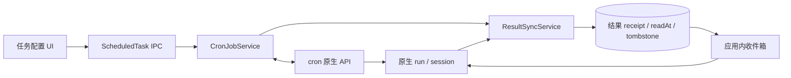
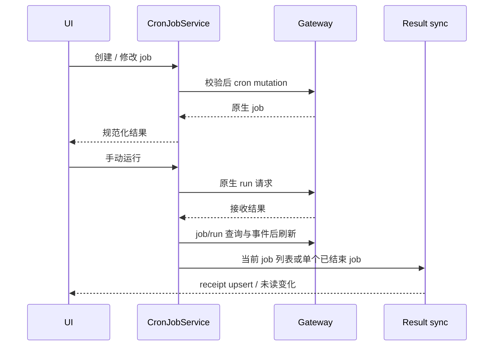
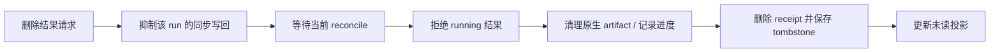

# 定时任务：原生调度与应用结果收件箱

本页按 CronJobService、ScheduledTaskResultSyncService、结果 Store 和 IPC 描述当前实现。系统由两个不同模型组成：原生 job/run 决定何时执行；产品 result receipt 决定用户如何发现和管理结果。

## 1. 两个生命周期

| 模型           | 权威                 | 持久内容                                              |
| -------------- | -------------------- | ----------------------------------------------------- |
| Job            | Gateway cron         | schedule、payload、owner、enabled、delivery、运行状态 |
| Run            | Gateway cron/session | 原生运行身份、结果和历史                              |
| Result receipt | 产品 SQLite          | task/run 映射、摘要、readAt、清理与 tombstone         |
| UI             | Redux/页面状态       | 列表、筛选、加载错误和未读投影                        |

暂停 job 不删除旧结果；删除结果也不等于删除 job。原生 transcript 不复制进结果表，打开详情时仍定位原生会话。

```mermaid
flowchart LR
  UI[任务配置 UI] --> IPC[ScheduledTask IPC]
  IPC --> Service[CronJobService]
  Service <--> Gateway[cron 原生 API]
  Gateway --> Runs[原生 run / session]
  Service --> Sync[ResultSyncService]
  Runs --> Sync
  Sync --> DB[(结果 receipt / readAt / tombstone)]
  DB --> Inbox[应用内收件箱]
  Inbox --> Runs
```

## 2. 配置写入与执行归属

产品编辑器的 schedule 合约为 at/every/cron，payload 区分 agentTurn 与 systemEvent。原生可能包含更多高级任务形态，adapter 需保留可识别但表单未建模的能力，不能保存一次普通编辑就静默抹掉。

新建 Agent-turn 默认由 main 执行，也可选择已有助手，使用隔离运行会话。外部或模型创建的 job 保留原 owner；列表、启停和手动运行不能偷偷接管。产品操作需验证可编辑性、时间与 payload，而非直接透传任意 cron JSON。

JustDo 新建 job 默认显式发送 delivery mode=none，不依赖上游省略值的默认行为。announce/webhook 是原生外发配置；应用收件箱不是一种外发 channel，是否进入本地收件箱不取决于是否发到 IM。

模型发起任务变更时由 automation-permission 根据原生 session mode 审批。无人值守不意味着自动 full，也不能用某个 Agent 名称绕开审批。

## 3. 创建、手动运行与轮询

```mermaid
sequenceDiagram
  participant U as UI
  participant S as CronJobService
  participant G as Gateway
  participant R as Result sync
  U->>S: 创建 / 修改 job
  S->>G: 校验后 cron mutation
  G-->>S: 原生 job
  S-->>U: 规范化结果
  U->>S: 手动运行
  S->>G: 原生 run 请求
  G-->>S: 接收结果
  S->>G: job/run 查询与事件后刷新
  S->>R: 当前 job 列表或单个已结束 job
  R-->>U: receipt upsert / 未读变化
```

手动运行的请求返回不是完成通知。列表需要后续原生状态更新；重复查询可合并，写请求不能因轮询超时自行重试成第二次执行。shutdown 先停止 polling，避免依赖关闭后再产生后台工作。

## 4. 首次同步：建立已读基线

结果同步器初次没有 baseline 时，抓取有界全局历史窗口，最多 200 条、每任务最多 20 条。初始化保存 baseline 时间及任务 watermark，已有历史作为基线，而不是突然产生大量新未读通知。

baseline 必须持久化，不能每次启动重新决定“什么算新结果”。成功提交后再发送 refreshed/unread 事件，UI 通知失败不能回滚已持久结果。

这些数值来自 `scheduledTaskResultSyncService.ts`，是同步窗口而非原生历史保留上限。

## 5. 增量对账和中断恢复

启动对账重新 upsert 最近最多 100 条，以修复映射并保留已有 readAt；随后按每任务 watermark 和 lastRunAtMs 决定是否 catch-up。分页大小为 50，追赶位置持久化，中断后从保存的进度继续。

旧 watermark 在本轮同步开始前捕获，不能先写最新结果再把它当追赶终点，导致跳过中间运行。结果按时间顺序 upsert，稳定原生身份去重。

单个 finished job 的快速同步不代表拿到了权威 job 列表，不能据此删除其他任务的 catch-up。普通 reconcile 用 single-flight 合并；forceGlobal 若遇正在同步则等待后再执行完整对账。

## 6. 结果读取、未读与跳转

ScheduledTaskResultStore 提供分页、未读计数及 readAt 更新。读状态属于产品，不依赖原生运行是否成功；失败任务同样可能有应查看结果。重复 upsert 不重置用户已经读过的结果。

打开结果先解析对应原生 session 身份，再复用聊天详情。失去原生 artifact 应给出不可用状态，不能创建空 transcript 假装结果恢复。系统管理任务的操作能力与普通用户任务区分展示。

## 7. 删除是可恢复的跨边界事务

```mermaid
flowchart LR
  Request[删除结果请求] --> Barrier[抑制该 run 的同步写回]
  Barrier --> Wait[等待当前 reconcile]
  Wait --> Check[拒绝 running 结果]
  Check --> Cleanup[清理原生 artifact / 记录进度]
  Cleanup --> Delete[删除 receipt 并保存 tombstone]
  Delete --> Unread[更新未读投影]
```

删除和同步有共享 barrier，避免刚删除又被正在进行的分页写回复活。清理失败保留结果及可重试记录；不能先删 receipt 再失去 artifact 身份。

响应丢失后再次删除，若 receipt 已不存在但 durable tombstone 证明删除完成，返回幂等成功。纯内存 suppression 只保护当前并发，跨重启防复活依赖持久 tombstone。

## 8. 失败与用户结果

| 故障                   | 应有行为                                           |
| ---------------------- | -------------------------------------------------- |
| Gateway 断开           | 列表显示连接/刷新失败，不用空数组推断所有 job 被删 |
| 单页历史查询失败       | 保留已持久结果与 catch-up 位置                     |
| 重复原生 run           | upsert 同一 receipt，保留 readAt                   |
| 原生结果被外部清理     | 结果条目可诊断，详情不伪造消息                     |
| 删除运行中结果         | 拒绝，先完成或停止原生执行                         |
| 部分 artifact 清理成功 | 按进度重试，不无限重复已完成步骤                   |

## 9. 修改与验证入口

主要代码位于 `src/main/scheduler/`、`src/main/ipc/scheduledTask/`、`src/main/data/scheduledTaskResultStore.ts`、`src/shared/scheduledTask/` 和 Renderer scheduled-tasks feature。

回归需覆盖 schedule 与时区、原生 owner 保留、默认 delivery、基线不泛滥未读、超过一页的追赶、中断重启、readAt 保留、删除和 reconcile 竞争、tombstone 幂等及原生历史缺失。测试应验证用户看到的结果，不只比对请求对象字段。
