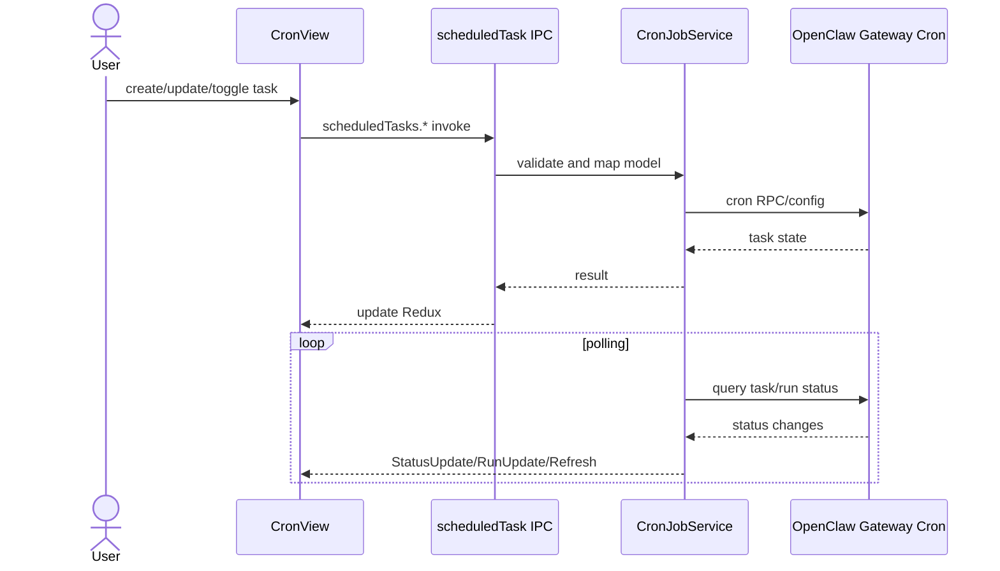
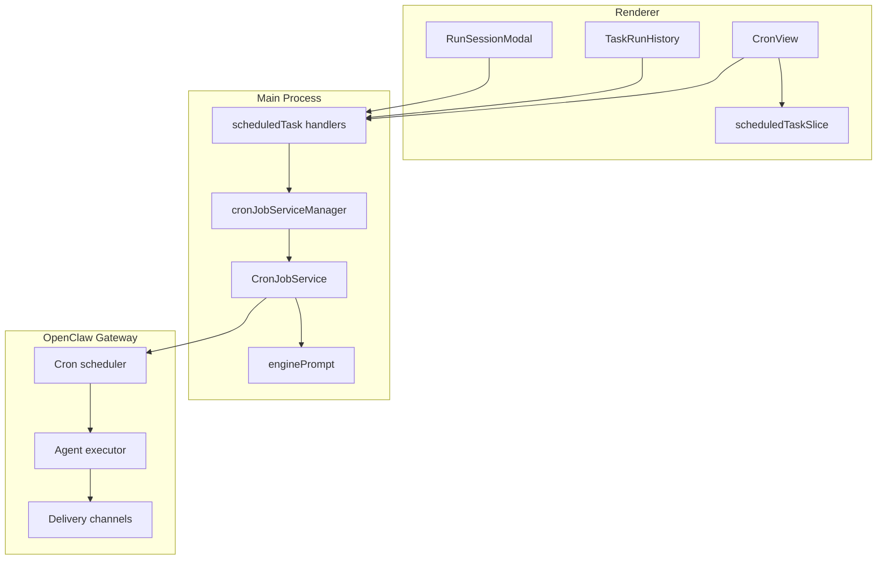
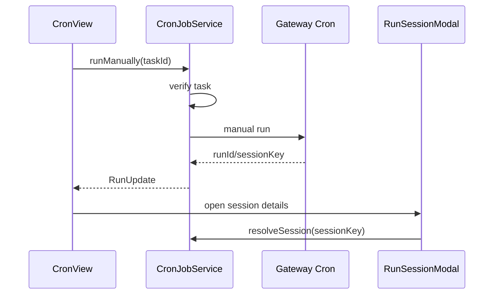

# 定时任务系统

JustDo 的定时任务 UI 在 renderer 中实现，Main 进程通过 OpenClaw cron runtime 执行任务。JustDo 保存任务展示和运行关联所需的本地状态，Gateway 负责实际执行。

## 关键文件

| 文件 | 作用 |
| --- | --- |
| `src/renderer/features/scheduled-tasks/` | 定时任务 UI、service、Redux slice |
| `src/shared/scheduledTask/` | IPC constants、types、reminder text |
| `src/main/ipc/scheduledTask/` | 定时任务 IPC handlers 和 service manager |
| `src/main/scheduler/cronJobService.ts` | OpenClaw cron adapter/polling |
| `src/main/scheduler/enginePrompt.ts` | 执行 prompt 构造 |

## Preload API

`window.electron.scheduledTasks` 暴露：

- `list()`
- `get(id)`
- `create(input)`
- `update(id, input)`
- `delete(id)`
- `toggle(id, enabled)`
- `runManually(id)`
- `listRuns(taskId, limit?, offset?)`
- `resolveSession(sessionKey)`
- `listChannels()`
- `onStatusUpdate(callback)`
- `onRunUpdate(callback)`
- `onRefresh(callback)`

IPC channel 常量位于 `src/shared/scheduledTask/constants.ts`。

## 执行流程


```mermaid
sequenceDiagram
  actor User
  participant UI as CronView
  participant IPC as scheduledTask IPC
  participant Service as CronJobService
  participant GW as OpenClaw Gateway Cron

  User->>UI: create/update/toggle task
  UI->>IPC: scheduledTasks.* invoke
  IPC->>Service: validate and map model
  Service->>GW: cron RPC/config
  GW-->>Service: task state
  Service-->>IPC: result
  IPC-->>UI: update Redux
  loop polling
    Service->>GW: query task/run status
    GW-->>Service: status changes
    Service-->>UI: StatusUpdate/RunUpdate/Refresh
  end
```

手动执行同样通过 `CronJobService` 委派给 Gateway，并用 session key 关联到可查看的 Cowork/Gateway 会话。

## UI 组件

| 组件 | 作用 |
| --- | --- |
| `CronView.tsx` | 主视图 |
| `RunSessionModal.tsx` | 查看任务运行关联会话 |
| `TaskRunHistory.tsx` | 运行历史 |
| `utils.ts` | UI 辅助函数 |

## 数据边界

| 数据 | 权威来源 | JustDo 角色 |
| --- | --- | --- |
| Cron 执行 | OpenClaw Gateway | 发起、展示、轮询 |
| 任务列表 | Gateway cron runtime + 本地 UI state | 管理 UI |
| Run session | Gateway session key | 解析和打开会话 |
| Reminder text | `src/shared/scheduledTask/reminderText.ts` | UI/Prompt 共享文本 |

## 维护规则

- 新增任务状态或 IPC channel 时，先更新 `src/shared/scheduledTask/constants.ts` 和 `types.ts`。
- Renderer 不直接轮询 Gateway；通过 Main IPC 和 service manager。
- 与自然语言 reminder 相关的用户可见文本需要 i18n 或共享纯函数覆盖测试。
- 修改 schedule parsing、run mapping、manual run 行为时补充 Vitest。

## 类型模型

定时任务契约位于 `src/shared/scheduledTask/`，目的是让 Main 和 Renderer 使用同一套领域语言。

核心概念：

| 概念 | 说明 |
| --- | --- |
| Schedule | 任务触发时间，可以是一次性、固定间隔或 cron |
| Payload | 执行内容，通常是一次 agent turn 或 system event |
| Delivery | 运行结果是否投递到外部 channel |
| Session target | 在已有会话执行，还是创建隔离会话 |
| Wake mode | 立即唤醒或等待下一次 runtime heartbeat |
| Run history | 每次执行的状态、错误、耗时、关联 session |

共享 constants 中的 discriminant 必须使用 `as const` 对象，避免 renderer/main 写出不同字符串。

## Renderer 设计

```text
src/renderer/features/scheduled-tasks/
  scheduledTaskSlice.ts       Redux state
  scheduledTaskService.ts     preload API wrapper
  components/
    CronView.tsx              主页面、表单、列表
    TaskRunHistory.tsx        运行历史
    RunSessionModal.tsx       运行关联会话
    utils.ts                  展示辅助
```

Renderer 只负责：

- 表单输入和校验。
- 调用 CRUD API。
- 展示 next run、last run、last error。
- 订阅状态事件并刷新。
- 打开 run 对应的会话。

Renderer 不负责解析 Gateway cron 内部状态，也不直接访问 Gateway。

## Main 设计

```text
src/main/ipc/scheduledTask/
  index.ts
  handlers.ts
  helpers.ts
  cronJobServiceManager.ts

src/main/scheduler/
  cronJobService.ts
  enginePrompt.ts
```

`cronJobServiceManager` 负责在 Gateway adapter 可用后提供 `CronJobService`。这样应用启动早期即使 Gateway 未 ready，IPC handler 也可以返回清晰的“runtime not ready”状态。

`enginePrompt.ts` 负责把用户任务描述构造成 Gateway 执行 prompt。此处的变更会影响任务实际行为，应有测试覆盖。


```mermaid
flowchart TB
  subgraph Renderer["Renderer"]
    View["CronView"]
    History["TaskRunHistory"]
    Modal["RunSessionModal"]
    Slice["scheduledTaskSlice"]
  end

  subgraph Main["Main Process"]
    Handlers["scheduledTask handlers"]
    Manager["cronJobServiceManager"]
    Service["CronJobService"]
    Prompt["enginePrompt"]
  end

  subgraph Gateway["OpenClaw Gateway"]
    Cron["Cron scheduler"]
    Agent["Agent executor"]
    Delivery["Delivery channels"]
  end

  View --> Slice
  View --> Handlers
  History --> Handlers
  Modal --> Handlers
  Handlers --> Manager
  Manager --> Service
  Service --> Prompt
  Service --> Cron
  Cron --> Agent
  Agent --> Delivery
```

## Polling 与事件

当前 Main 进程通过 polling 把 Gateway cron 状态变化推给 renderer：

```text
CronJobService.startPolling()
  -> periodically query Gateway
  -> compare task/run status
  -> BrowserWindow.webContents.send(StatusUpdate/RunUpdate/Refresh)
```

Polling 的好处是对 Gateway event 支持要求低；缺点是实时性受间隔影响。若未来 Gateway 提供稳定 push event，可以在 Main 内部替换实现，保持 preload API 不变。

## Manual Run

手动执行不是简单地修改 next run time，而是用户主动触发一次 run：


```mermaid
sequenceDiagram
  participant UI as CronView
  participant Main as CronJobService
  participant GW as Gateway Cron
  participant Modal as RunSessionModal

  UI->>Main: runManually(taskId)
  Main->>Main: verify task
  Main->>GW: manual run
  GW-->>Main: runId/sessionKey
  Main-->>UI: RunUpdate
  UI->>Modal: open session details
  Modal->>Main: resolveSession(sessionKey)
```

手动执行应保留正常调度计划，不应破坏下一次 cron 触发时间。

## Session Resolution

`resolveSession(sessionKey)` 用于把 Gateway run 结果关联到 JustDo 可展示会话。可能情况：

- session 已在本地 `cowork_sessions` 中存在。
- session 只有 Gateway history，需要创建/补全本地 UI cache。
- session 已被 Gateway 清理，UI 展示不可打开状态。

## 失败处理

| 场景 | 处理 |
| --- | --- |
| Gateway 未运行 | 返回 engine not ready，不创建假任务 |
| Cron 表达式无效 | Main 返回 validation failure，Renderer 标记字段错误 |
| 手动运行失败 | 记录 run error，保留任务定义 |
| run session 无法解析 | 历史仍显示，但打开按钮禁用或提示不可用 |
| polling 失败 | 写日志，下一轮重试，UI 保留上次状态 |

## 测试建议

- schedule discriminant mapping。
- reminder text 生成。
- engine prompt 构造。
- handlers 对 invalid input 的返回。
- run history pagination。
- manual run 不改变正常 schedule。
