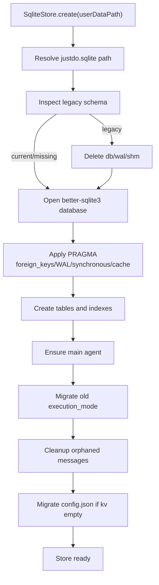
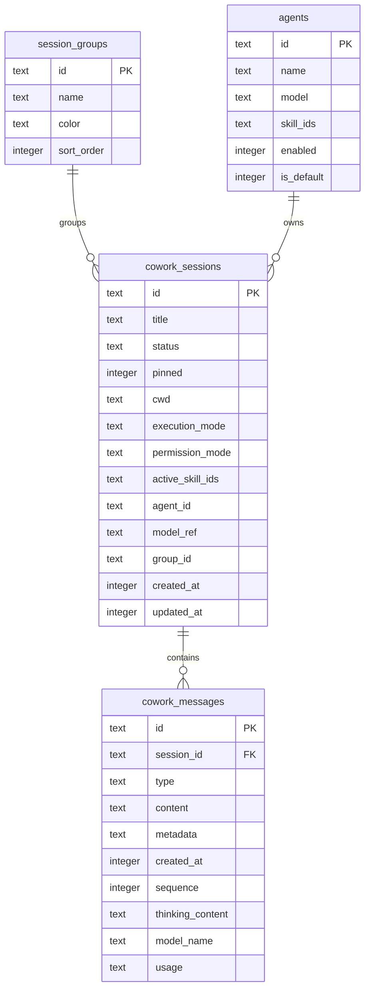

# 数据存储

JustDo 使用 `better-sqlite3` 保存本地配置、UI 缓存和产品元数据。数据库文件名来自 `src/main/core/appConstants.ts`，当前为 `justdo.sqlite`。Electron `userData` 目录名来自 `package.json.productName`，路径为 `<appData>/<package.json.productName>`。

`package.json.name` 当前为 `justdo`，它是稳定内部包标识，不参与可见目录派生，也不随产品换名修改。`package.json.productName` 当前为 `JustDo`，它是对外产品名，决定 `userData` 目录和默认工程根目录。数据库文件名 `justdo.sqlite` 仍是内部稳定标识，不从 `productName` 派生。

开发者功能的可见性是一个独立的启动期文件配置，不存入 SQLite。Main process 每次启动读取 `<userData>/developer/config.json`（Windows 默认为 `%APPDATA%/<package.json.productName>/developer/config.json`）；文件不存在时自动创建 `{ "showDeveloperMode": false }`。只有 `showDeveloperMode` 为 JSON 布尔值 `true` 时，Renderer 才展示“开发者模式”选项及其已启用的开发入口。文件缺失、解析失败或任何其他值都按隐藏处理，运行期间修改需重启应用生效。

会话权限模式保存在 SQLite `cowork_sessions.permission_mode`；新会话、缺失值或非法值均回退为 `full`。
`cowork_config.permissionMode` 仅保存当前激活的 runtime 权限快照。Main 通过 OpenClaw
公开的 `tools.exec.mode`、`tools.fs.workspaceOnly` 与 Gateway
`exec.approvals.get/set` 配置 npm runtime；写入 host exec policy 时使用 `baseHash` 并发保护。
JustDo 不创建 `permission-policy.json`，也不直接读写 `exec-approvals.json`。文件修改审批由
JustDo 自有、版本锁定的 bundled extension 通过 OpenClaw 公开 trusted tool policy 接口完成。
打开旧会话只恢复其已存展示值；发起新 turn 前才将该会话权限激活到 runtime。
OpenClaw 权限配置是 Gateway 全局快照。权限修改始终通过原生热更新立即生效，
不会因为一个或多个会话正在运行而禁用或拒绝；并行任务共同使用最新的 runtime 权限快照。
`SessionPermissionModeCoordinator` 与 cowork config IPC 共用串行队列，在 Main 中原子协调
权限同步、会话持久化和失败回滚。

`productName` 必须是长度 1–64 的单个英文单词，只允许 ASCII 字母 `A-Z` / `a-z`。构建配置和运行时都会校验该约束。更换它会直接使用新的 `userData` 和默认工程目录，不提供旧品牌目录的兼容或迁移。

## SQLite 初始化

入口：`src/main/data/sqliteStore.ts`

初始化行为：

- 打开 SQLite database。
- 启用 `foreign_keys = ON`。
- 启用 WAL：`journal_mode = WAL`。
- 设置 `synchronous = NORMAL`。
- 创建/迁移表和索引。
- 检测旧 schema，必要时删除 legacy database 并重新创建。
- 从旧 `config.json` 迁移 `electron-store` 数据到 `kv`。
- 清理 orphaned cowork messages。



## 当前核心表

| 表                              | 用途                                                      |
| ------------------------------- | --------------------------------------------------------- |
| `kv`                            | 通用 key/value 配置                                       |
| `cowork_sessions`               | Cowork 会话 UI 元数据和 Gateway session id 映射           |
| `cowork_messages`               | Cowork 消息 UI cache                                      |
| `cowork_config`                 | Cowork 配置，包括工作目录、engine 和当前 runtime 权限快照 |
| `agents`                        | Agent 定义、模型、技能绑定                                |
| `mcp_servers`                   | MCP server 配置                                           |
| `openclaw_hooks`                | OpenClaw hook 配置                                        |
| `session_groups`                | 会话分组                                                  |
| `scheduled_task_run_receipts`   | 定时任务结果快照与持久已读回执                            |
| `scheduled_task_result_cleanup` | 跨 OpenClaw 删除失败时的 transcript 清理续传状态          |



## 重要字段

`cowork_sessions` 包含：

- `id`
- `title`
- `status`
- `pinned`
- `cwd`
- `execution_mode`
- `permission_mode`
- `active_skill_ids`
- `agent_id`
- `model_ref`
- `group_id`
- `created_at`
- `updated_at`

`cowork_messages` 包含：

- `id`
- `session_id`
- `type`
- `content`
- `metadata`
- `created_at`
- `sequence`
- `thinking_content`
- `model_name`
- `usage`

## Store 层

| 文件                                 | 作用                                 |
| ------------------------------------ | ------------------------------------ |
| `sqliteStore.ts`                     | DB 初始化、kv store、migration       |
| `coworkStore.ts`                     | Cowork sessions/messages/agents CRUD |
| `groupStore.ts`                      | session group CRUD                   |
| `scheduledTaskResultStore.ts`        | 定时任务结果 upsert、分页、未读统计和 read receipt |
| `plugins/mcp/mcpStore.ts`            | MCP server store                     |
| `plugins/hooks/openclawHookStore.ts` | hook store                           |

## 权威边界

SQLite 不是 OpenClaw execution history 的权威。Gateway `chat.history` 是消息事实来源，SQLite 的 `cowork_messages` 是 UI cache，用于列表、搜索、快速恢复和展示。
打开会话后，Main 已加载到 Redux 的 `cowork_messages` snapshot 会由
`JustDoChatWrapper` 转换并作为 `sqlite-fallback` 注入 `ChatController`，用于
Gateway history 返回前的快速首屏及请求失败时的降级展示。Controller 不直接访问
SQLite；Gateway 成功历史始终升级为更高 authority，缓存快照不能覆盖 Gateway
状态，也不能清除正在运行的 canonical live turn。

`scheduled_task_run_receipts` 同样不是完整 transcript 的权威；它保存 Gateway
run facts 的本地投影（状态、摘要、执行/投递错误、session identifiers）和 JustDo
拥有的 `observed_at` / `read_at`。任务名称按首次观察时快照保存，任务删除不会级联
删除结果。首次基线导入和 `kv` 中的初始化标记在同一个 SQLite transaction 内提交。
初始化标记的 `updated_at` 同时作为升级基线水位，避免未进入有限基线窗口的旧任务
在后续启动时被误判为新未读。超过单批同步上限时，`kv` 还持久化每任务的 catch-up
边界、旧水位和分页位置；完整追到旧水位后删除该 checkpoint。

`scheduled_task_result_cleanup` 只在删除执行结果的跨存储流程尚未完成时存在。
Gateway 将 transcript 改名为 `.deleted.*` 后，JustDo 会先持久化精确归档路径，
再物理删除文件；如果中途失败或应用退出，用户重试删除时会先恢复这一步。全部
OpenClaw run/session/transcript 和本地结果清理完成后，该续传记录立即删除。

结果分页按 `(started_at DESC, run_id DESC)` 使用 Main 生成的不透明 cursor。关键索引：

- `idx_scheduled_task_results_started`
- `idx_scheduled_task_results_task_started`
- `idx_scheduled_task_results_unread`

## 迁移规则

- 添加表或字段时，在 `sqliteStore.ts` 中加入兼容逻辑或迁移。
- 添加跨进程共享数据类型时同步 `src/shared/`。
- 修改 schema 后更新本文档并添加/更新 `*.test.ts`。
- 不在 renderer 中直接读写 SQLite。

## Schema 详细说明

### `kv`

通用配置表，存储 JSON 序列化值。

| 字段         | 类型             | 说明        |
| ------------ | ---------------- | ----------- |
| `key`        | TEXT PRIMARY KEY | 配置键      |
| `value`      | TEXT             | JSON string |
| `updated_at` | INTEGER          | 更新时间戳  |

典型数据包括 app config、auto launch 初始化标记、防休眠设置等。`SqliteStore.get/set/delete` 会触发 in-process change event，供 Main 内部监听配置变化。

### `cowork_sessions`

Cowork 会话列表和 UI 元数据表。OpenClaw session key 由运行时根据本地 session 和 agent 计算，
不在该表重复持久化。旧版本数据库中可能仍存在未使用的 `claude_session_id` 列；为避免重建用户
数据库，该冗余列会被忽略，新数据库不再创建。

JustDo 在完整、最小和认证生命周期配置同步中都显式启用 session maintenance：普通 OpenClaw
session 的年龄保留阈值为 `365d`，每个 session store 的 `maxEntries` 配置为 500。OpenClaw
maintenance 触发后会清理超龄条目，并将普通条目压回数量阈值；受保护会话不受普通条目上限约束。
JustDo SQLite 中的会话列表和消息缓存独立于该运行时保留策略。

`model_ref` 保存最近一次由 Gateway `sessions.describe` 确认的会话模型，格式为
`provider/model`。它用于恢复会话模型选择器和建立发送屏障；Agent 的 `model` 只作为新会话
默认值。每条 assistant 消息的实际模型仍由 Gateway history 决定，并独立保存在
`cowork_messages.model_name`，后续切换会话模型不会改写历史消息。

关键索引：

- `idx_cowork_sessions_agent_order`
- `idx_cowork_sessions_order`

排序规则通常是 pinned 优先，再按 updated_at 倒序。

### `cowork_messages`

消息缓存表，外键指向 `cowork_sessions(id)`，并在 session 删除时 cascade delete。

关键索引：

- `idx_cowork_messages_session_id`
- `idx_cowork_messages_session_sequence`

`sequence` 优先用于 Gateway/history 顺序，缺失时可用 `created_at` 降级排序。

### `agents`

Agent 定义表。默认会确保存在 `main` agent。

字段包括：

- `id`
- `name`
- `description`
- `system_prompt`
- `identity`
- `model`
- `icon`
- `skill_ids`
- `enabled`
- `is_default`
- `created_at`
- `updated_at`

Agent model refs 在启动时会通过 `openclawAgentModels.ts` 做 backfill/qualification，避免同名模型歧义。

### `mcp_servers`

MCP server 本地定义表。`config_json` 保存 stdio/http 等 transport config。Main process 根据该表生成 Gateway 可读取的 MCP 配置，并可执行 probe。

### `openclaw_hooks`

OpenClaw hook 配置表。Main process 负责把 enabled hooks 同步到 Gateway 配置。

### `session_groups`

会话分组表，用于 Cowork sidebar 分组展示。删除 group 时应处理关联 session 的 `group_id`。

## Legacy Recovery

`SqliteStore.create()` 会检查已有数据库是否缺少关键字段。如果检测到 legacy schema，会删除旧 database、wal、shm 文件并创建新库。这是为了避免旧 schema 让主流程半启动、半损坏。

删除 legacy database 是有损动作，因此判断条件必须保守，只针对已知关键表缺字段的旧版本。

## WAL 策略

当前配置：

```sql
PRAGMA foreign_keys = ON;
PRAGMA journal_mode = WAL;
PRAGMA synchronous = NORMAL;
PRAGMA cache_size = -8000;
PRAGMA wal_autocheckpoint = 1000;
```

WAL 能改善桌面应用并发读写体验。退出时 `getStore().close()` 会关闭 database，释放 WAL/SHM 文件句柄。

## 数据访问规则

- Renderer 不直接访问 database。
- Main IPC handler 不直接拼复杂 SQL，优先通过 store/service。
- JSON 字段读写要在 store 层集中 parse/stringify。
- 对用户可编辑字段做长度和类型校验。
- 删除 session 时依赖外键清理 messages，但其他关联数据要按 domain 规则处理。

## 备份与排障

日志导出功能应能帮助定位：

- database path。
- migration warning。
- orphan cleanup count。
- Gateway history reconciliation failure。

排障时要先判断问题在 Gateway authority 还是 SQLite cache。若 Gateway history 正常而 SQLite cache 异常，应优先重建 cache。
