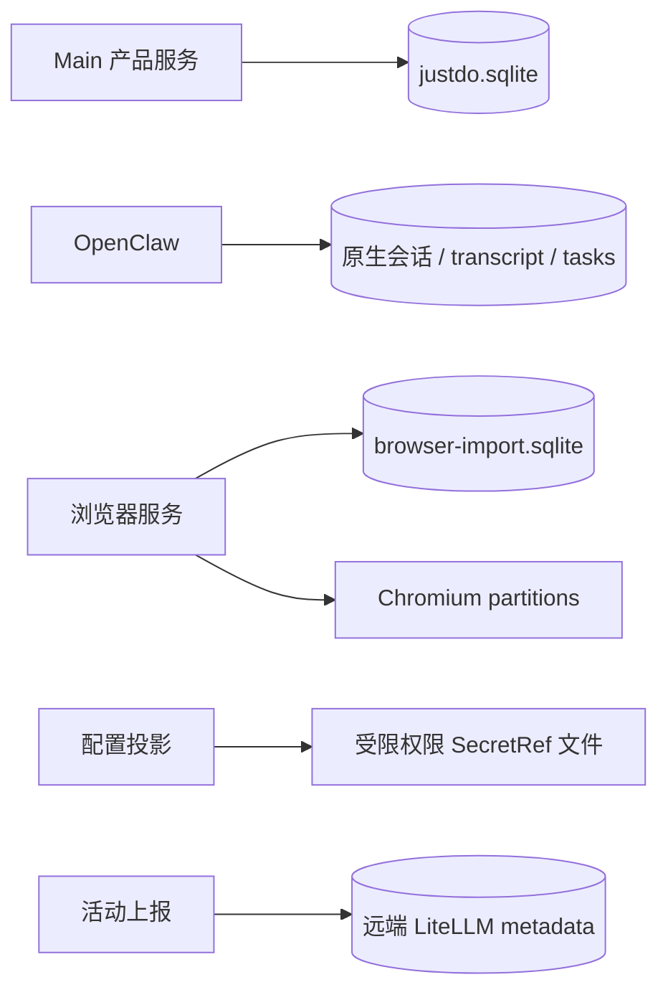

# 数据存储：权威、约束与恢复

本文按 SqliteStore、CoworkStore、CollaborationStore 和 ScheduledTaskResultStore 的当前实现组织。产品数据、原生 transcript、浏览器数据与服务端统计分别拥有独立生命周期，不能用“SQLite 中有数据”概括所有持久状态。

## 1. 存储边界

产品数据库位于 app.getPath('userData') 下，默认 `<appData>/<productName>/justdo.sqlite`。内部文件名稳定，productName 改变时不自动迁移旧品牌目录。Gateway state 和项目目录不是该数据库的子表，备份和删除时需要分别处理。

消息唯一持久权威是 OpenClaw 的原生 SQLite transcript。初始化删除旧 cowork_messages 缓存，不迁移其消息；Renderer 按原生历史恢复，不从 Main 或 Redux 寻找持久正文。

## 2. 初始化与兼容规则

SqliteStore.create 先检查已知 legacy schema，再打开连接，设置 PRAGMA，初始化表及增量列/索引，调用协作 schema 初始化器，最后处理 app_config 中遗留凭据引用。

| PRAGMA             | 值     | 影响                    |
| ------------------ | ------ | ----------------------- |
| foreign_keys       | ON     | 删除/引用约束生效       |
| journal_mode       | WAL    | 数据可能仍在 WAL 中     |
| synchronous        | NORMAL | 性能与掉电耐久性的折中  |
| cache_size         | -8000  | 以 KiB 表示页面缓存目标 |
| wal_autocheckpoint | 1000   | 自动 checkpoint 阈值    |

已知 cowork_sessions 缺少必需列时，现有 legacy 检测会删除数据库及 WAL/SHM 后重建；检查本身失败则记录并保留文件。这是有损兼容分支，不能泛化为任何 schema 问题都可自动删库。新增正常字段使用 ensureColumn 等增量逻辑。

旧双会话 Plan 的 segments 与不符合当前约束的 handoff schema 有专门清理分支；该处理不适用于普通用户数据。产品数据库迁移与 OpenClaw 运行时补丁升级是两回事，后者必须从 pristine 包重建。

## 3. 核心产品表全表清单

SqliteStore 直接建 14 张表，并委派 CollaborationStore 建 6 张，共 20 张。

| 表                                   | 责任与关键身份                          |
| ------------------------------------ | --------------------------------------- |
| `kv`                                 | JSON 设置与内部元数据，key 主键         |
| `cowork_sessions`                    | 产品会话索引，id 主键                   |
| `cowork_session_runs`                | clientTurnId 唯一，映射原生 rootRunId   |
| `cowork_external_sessions`           | source + externalSessionKey 唯一映射    |
| `cowork_external_session_tombstones` | 外部会话删除防复活                      |
| `cowork_plan_handoffs`               | planId、文件身份、实施接收状态          |
| `cowork_config`                      | Cowork 设置和产品执行快照               |
| `agents`                             | 助手档案、启用/默认状态及 deleted_at    |
| `mcp_servers`                        | 用户 MCP 配置，name 唯一                |
| `openclaw_hooks`                     | Hook 开关及配置                         |
| `session_groups`                     | 分组名称、颜色和排序                    |
| `scheduled_task_run_receipts`        | 原生 run 对应的结果索引与 readAt        |
| `scheduled_task_result_cleanup`      | 原生结果 artifact 清理进度              |
| `scheduled_task_result_tombstones`   | 删除完成的 run 防同步复活               |
| `collaboration_rooms`                | 唯一 anchorSessionId                    |
| `collaboration_members`              | room 内唯一 agent；session/key 全局唯一 |
| `collaboration_rounds`               | 用户轮次及 stopped_at                   |
| `collaboration_deliveries`           | 路由、摘要哈希、原生接收和状态          |
| `collaboration_deletions`            | 删除冻结记录                            |
| `collaboration_deleted_members`      | 已确认原生删除的成员                    |

## 4. 会话与运行回执

cowork_sessions 保存 title、status、pinned、cwd、execution_mode、permission_mode、active_skill_ids、agent_id、model_ref、group_id 及时间。status 是产品快照，不能替代原生 runtime 查询。列表索引服务 pinned/updated_at 排序和 Agent 范围查询。

forked_from_* 保存原生分支来源，源会话删除时引用置空并保留标题快照。handoff_from_* 和 handoff_request_id 保留旧手动交接来源及幂等约束，当前 UI/IPC 已不提供该创建入口。

运行表保存 started_at、accepted_at、ended_at 与 state，区分用户提交、原生接收和结束。client_turn_id 全局唯一；每个 session 通过 ended_at IS NULL 的部分唯一索引限制一个未结束回执。终态和计时必须幂等结算，不能重启后重新开始计算同一已结束 run。

外部 session 另存来源、原生 key、首次绑定的 agent/cwd 和运行状态。删除产品会话的 trigger 写外部 tombstone；外部客户端再次同步不能复活用户已删记录。

## 5. Plan 与 Goal

Plan handoff 保存创建时 workspace root、相对路径、SHA-256、字节长度、原生身份与阶段时间。状态为 presented → dispatching → admitted → resolved，失败用 failed；每 session 只允许一个 presented/dispatching/admitted handoff。

计划文件发布、SQLite 写入和 Gateway 准入跨三个系统。批准前与实施注入前复核文件身份，不能根据后改 cwd 重定位文件；原生接收后记录 admitted，避免恢复时把已发送实施当成未发送。

Goal 内容、预算和六种状态由原生 session 持有。`cowork_config` 的 `goalExecution:<sessionId>` 只保存 Main 自动续跑阶段、次数及时间等产品快照。读取校验 sessionId 和 phase，坏值不能触发自动运行。usage_limited/budget_limited 保留原生语义，不归一化为 blocked。

## 6. 配置与凭据不等于全库加密

kv.app_config 是应用配置来源。当前 appConfigCredentials 转换清空 builtin apiKey 和旧内置引用，并能读取早期 `justdo-os-credential-v1` 记录；它不会把所有新的自定义凭据统一加密。读取旧加密记录要求可用 OS cipher，Linux basic_text/unknown 不作为安全 backend。

因此不能宣称数据库已全库加密，也不能宣称所有自定义 key 都使用 safeStorage。内置模型的新访问凭据不保存在 SQLite，而是短期 JWT 的受限派生快照，原生使用 exec SecretRef；自定义 provider secret file 则由产品配置派生，采用文件权限保护。详情见[认证](../features/authentication-builtin-model-lifecycle.md)和[安全模型](11-security-model.md)。

其他持久键包括更新偏好、结果 baseline/catch-up、市场安装身份与助手创建摘要。key prefix 是长期数据接口；改名要有明确迁移，不能让新旧模块各写一套。

## 7. 助手与协作

agents 的 model 为空表示继承；main 不以遗留档案 model 作为用户会话默认。角色文件归原生 agents.files，旧 system_prompt/identity 列不作为另一套编辑 backing store。

删除助手原子设置 deleted_at 并清除 enabled，保留名称及关联键。设置页隐藏、后续变更拒绝，历史图仍能显示身份。原生 agents.delete 会清索引，因此不用于这个保留历史的删除流程。同名重建使用新 ID。

模型创建的 `assistantCreation:<agentId>` KV 只保存参数摘要与 preparing/ready 阶段；准备档案先停用，原生配置和角色文件读回后启用。中断不自动派发任务。

协作 delivery 唯一键为 room、发送人、sourceRunId、toolCallId，input_digest 检查重试参数冲突；表中没有正文。round 的 stopped_at 持久冻结旧轮次，预算包括失败尝试。重启恢复将 queued 转 failed、dispatching 转 unknown，不从元数据重造载荷。

## 8. 删除补偿与结果收件箱

协作整任务删除先写 freeze，停止全部成员，确认原生状态，再逐个删除原生 session 并保存进度，最后事务删除产品会话。外键级联不能代替前面的原生清理。

结果收件箱以 run_id 为主键，保存摘要、状态、原生 session、投递结果和 read_at。按 started_at/run_id 分页，按 task_id 查询，未读有部分索引。upsert 保留 read_at；baseline 与追赶水位不放在 Renderer 内存中充当持久事实。

删除结果先抑制并发同步写回，清理原生 artifact，再移除 receipt 并写 tombstone。清理表记录已处理路径；失败保留可重试条目。两种删除都不是一个跨网络 SQLite transaction。

## 9. 浏览器与服务端数据

browser-import.sqlite 独立保存导入历史、safeStorage 加密密码、下载记录和命名 profile；浏览器 Cookie/storage/cache 在 Chromium partition。Renderer 不获取密码密文或下载真实路径，打开文件按记录 ID 经 Main 验证。

按时间清理历史记录与清空 Chromium 存储的能力不同，后者可能全量清除，UI 必须说明。删除下载记录不等于删除磁盘文件。

LiteLLM 活动记录是服务端 EndUser metadata，不计入本地 20 表。客户端开关控制上报，JWT 负责身份校验；未收到活动不能证明用户没启动。服务端部署与字段保留见[认证专题](../features/authentication-builtin-model-lifecycle.md)。

## 10. 备份、修复与变更验收

正常备份先退出应用再复制产品数据；在线备份使用 SQLite backup/checkpoint 机制，不能只复制主文件忽略 WAL。原生 transcript、角色文件、模型派生凭据和项目文件要按需求另行纳入，不能把整套数据默认作为 issue 附件。

修改 schema 时验证新库、旧库、重复启动、坏 JSON、部分操作中断和重试。同步事务内不等待网络；写入前确定唯一键与查询索引，状态迁移使用 expected-state 约束。重点测试位于 sqliteStore、coworkStore、collaborationStore 与 scheduledTaskResultStore 旁。
