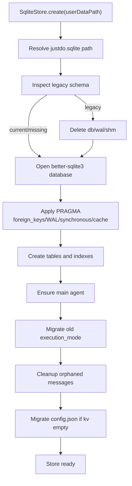
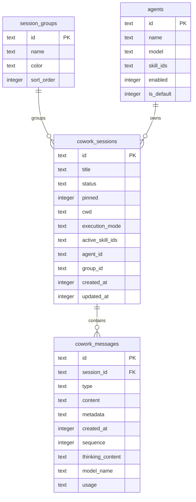

# 数据存储

JustDo 使用 `better-sqlite3` 保存本地配置、UI 缓存和产品元数据。数据库文件名来自 `src/main/core/appConstants.ts`，当前为 `justdo.sqlite`。Electron `userData` 目录名来自 `package.json.productName`，当前路径为 `userData/JustDo`。`productName` 只控制对外品牌与可见目录，不改变 `justdo.sqlite`等内部持久化标识。

`productName` 必须是长度 1–64 的单个英文单词，只允许 ASCII 字母 `A-Z` / `a-z`。构建配置和运行时都会校验该约束。更换它会直接使用新的 `userData` 和默认工程目录，不提供旧品牌目录的兼容或迁移。

## SQLite 初始化

入口：`src/main/data/sqliteStore.ts`

初始化行为：

- 打开 SQLite database。
- 启用 `foreign_keys = ON`。
- 启用 WAL：`journal_mode = WAL`。
- 设置 `synchronous = NORMAL`。
- 创建/迁移表和索引。
- 检测旧 schema，必要时删除 legacy database 并重新创建。
- 从旧 `config.json` 迁移 `electron-store` 数据到 `kv`。
- 清理 orphaned cowork messages。



## 当前核心表

| 表 | 用途 |
| --- | --- |
| `kv` | 通用 key/value 配置 |
| `cowork_sessions` | Cowork 会话 UI 元数据和 Gateway session id 映射 |
| `cowork_messages` | Cowork 消息 UI cache |
| `cowork_config` | Cowork 配置 |
| `agents` | Agent 定义、模型、技能绑定 |
| `mcp_servers` | MCP server 配置 |
| `openclaw_hooks` | OpenClaw hook 配置 |
| `session_groups` | 会话分组 |



## 重要字段

`cowork_sessions` 包含：

- `id`
- `title`
- `status`
- `pinned`
- `cwd`
- `execution_mode`
- `active_skill_ids`
- `agent_id`
- `group_id`
- `created_at`
- `updated_at`

`cowork_messages` 包含：

- `id`
- `session_id`
- `type`
- `content`
- `metadata`
- `created_at`
- `sequence`
- `thinking_content`
- `model_name`
- `usage`

## Store 层

| 文件 | 作用 |
| --- | --- |
| `sqliteStore.ts` | DB 初始化、kv store、migration |
| `coworkStore.ts` | Cowork sessions/messages/agents CRUD |
| `groupStore.ts` | session group CRUD |
| `plugins/mcp/mcpStore.ts` | MCP server store |
| `plugins/hooks/openclawHookStore.ts` | hook store |

## 权威边界

SQLite 不是 OpenClaw execution history 的权威。Gateway `chat.history` 是消息事实来源，SQLite 的 `cowork_messages` 是 UI cache，用于列表、搜索、快速恢复和展示。

## 迁移规则

- 添加表或字段时，在 `sqliteStore.ts` 中加入兼容逻辑或迁移。
- 添加跨进程共享数据类型时同步 `src/shared/`。
- 修改 schema 后更新本文档并添加/更新 `*.test.ts`。
- 不在 renderer 中直接读写 SQLite。

## Schema 详细说明

### `kv`

通用配置表，存储 JSON 序列化值。

| 字段 | 类型 | 说明 |
| --- | --- | --- |
| `key` | TEXT PRIMARY KEY | 配置键 |
| `value` | TEXT | JSON string |
| `updated_at` | INTEGER | 更新时间戳 |

典型数据包括 app config、auto launch 初始化标记、防休眠设置等。`SqliteStore.get/set/delete` 会触发 in-process change event，供 Main 内部监听配置变化。

### `cowork_sessions`

Cowork 会话列表和 UI 元数据表。OpenClaw session key 由运行时根据本地 session 和 agent 计算，
不在该表重复持久化。旧版本数据库中可能仍存在未使用的 `claude_session_id` 列；为避免重建用户
数据库，该冗余列会被忽略，新数据库不再创建。

关键索引：

- `idx_cowork_sessions_agent_order`
- `idx_cowork_sessions_order`

排序规则通常是 pinned 优先，再按 updated_at 倒序。

### `cowork_messages`

消息缓存表，外键指向 `cowork_sessions(id)`，并在 session 删除时 cascade delete。

关键索引：

- `idx_cowork_messages_session_id`
- `idx_cowork_messages_session_sequence`

`sequence` 优先用于 Gateway/history 顺序，缺失时可用 `created_at` 降级排序。

### `agents`

Agent 定义表。默认会确保存在 `main` agent。

字段包括：

- `id`
- `name`
- `description`
- `system_prompt`
- `identity`
- `model`
- `icon`
- `skill_ids`
- `enabled`
- `is_default`
- `created_at`
- `updated_at`

Agent model refs 在启动时会通过 `openclawAgentModels.ts` 做 backfill/qualification，避免同名模型歧义。

### `mcp_servers`

MCP server 本地定义表。`config_json` 保存 stdio/http 等 transport config。Main process 根据该表生成 Gateway 可读取的 MCP 配置，并可执行 probe。

### `openclaw_hooks`

OpenClaw hook 配置表。Main process 负责把 enabled hooks 同步到 Gateway 配置。

### `session_groups`

会话分组表，用于 Cowork sidebar 分组展示。删除 group 时应处理关联 session 的 `group_id`。

## Legacy Recovery

`SqliteStore.create()` 会检查已有数据库是否缺少关键字段。如果检测到 legacy schema，会删除旧 database、wal、shm 文件并创建新库。这是为了避免旧 schema 让主流程半启动、半损坏。

删除 legacy database 是有损动作，因此判断条件必须保守，只针对已知关键表缺字段的旧版本。

## WAL 策略

当前配置：

```sql
PRAGMA foreign_keys = ON;
PRAGMA journal_mode = WAL;
PRAGMA synchronous = NORMAL;
PRAGMA cache_size = -8000;
PRAGMA wal_autocheckpoint = 1000;
```

WAL 能改善桌面应用并发读写体验。退出时 `getStore().close()` 会关闭 database，释放 WAL/SHM 文件句柄。

## 数据访问规则

- Renderer 不直接访问 database。
- Main IPC handler 不直接拼复杂 SQL，优先通过 store/service。
- JSON 字段读写要在 store 层集中 parse/stringify。
- 对用户可编辑字段做长度和类型校验。
- 删除 session 时依赖外键清理 messages，但其他关联数据要按 domain 规则处理。

## 备份与排障

日志导出功能应能帮助定位：

- database path。
- migration warning。
- orphan cleanup count。
- Gateway history reconciliation failure。

排障时要先判断问题在 Gateway authority 还是 SQLite cache。若 Gateway history 正常而 SQLite cache 异常，应优先重建 cache。
