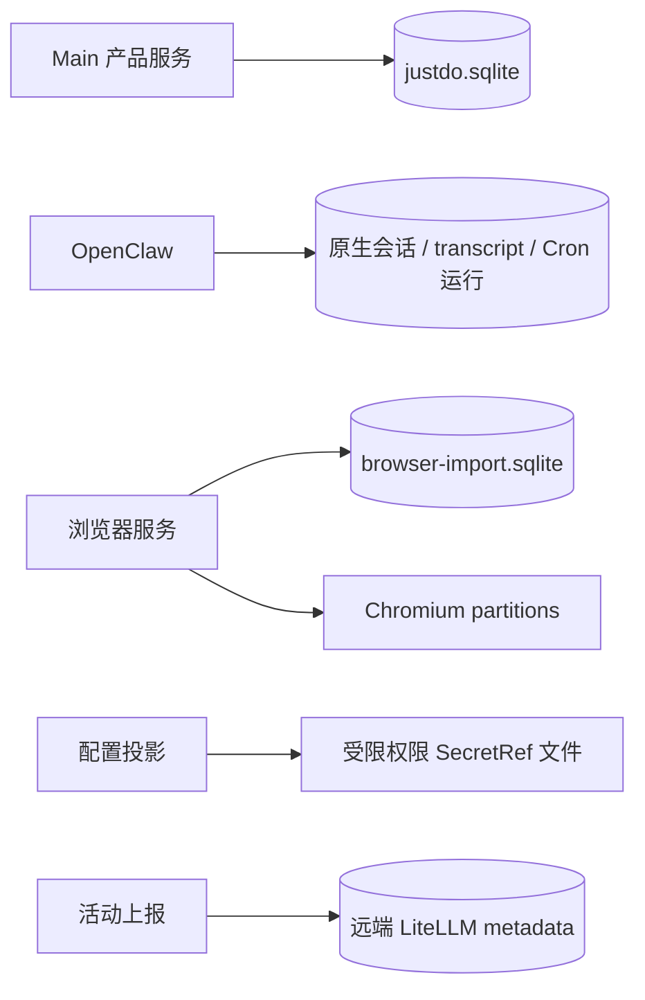
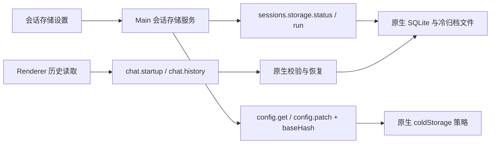

# 数据存储：权威、约束与恢复

本文按 SqliteStore、CoworkStore、CollaborationStore 和 ScheduledTaskResultStore 的当前实现组织。产品数据、原生 transcript、浏览器数据与服务端统计分别拥有独立生命周期，不能用“SQLite 中有数据”概括所有持久状态。

## 1. 存储边界

独立 `swarm-flow` 扩展在 Gateway `stateDir/swarm-flow/flows.sqlite` 保存流程目标、
已校验 DAG、阶段结果、修订号、启动意图和原生运行引用。它是插件调度状态，
不属于产品 SQLite 的消息表，也不复制原生 transcript。执行会话由插件拥有，
流程与主会话的关联是插件元数据，不写入主会话原生 ownership 或伪造 spawnedBy。
未知提交和未知最终投递不自动重试；恢复先核对已有运行。
主会话被删除后身份检查阻止下一次派发，原生工作历史与插件记录不会自动级联清除。
参见 [Swarm 实施计划](../features/swarm-plugin-implementation-plan.md)。

会话诊断增加 `cowork_run_diagnostic_events` 和 `cowork_run_diagnostic_coverage`。两表通过产品 run 外键级联删除；前者只存闭合值运行元数据，后者保留采集起点和裁剪计数，不存正文或任意错误文本。每轮普通/关键事件分别限 200/32 条，全局 20,000 条、14 天；coverage 随既有 run 生命周期保留，事件裁剪不会抹掉丢失证据。

原生运行时的循环退出分支及最后回复种类以 `loopExit` / `responseShape` 闭合枚举
投影到事件 JSON，并保留到导出。只有已结算的整轮结束事件用于最终原因；
中途尝试的退出不代表整轮结束。没有新增表、消息缓存或历史回填。

查询按已校验会话和 run 关联，复制/fork 不复制诊断表。事件 JSON 可包含闭合系统错误码、有效 HTTP 错误状态及有限非负耗时；原生 `command_output` 结束事件投影为 `command` 类型，保存整数退出码和失败状态，不重复增加工具失败计数。终态还可保留闭合的超时阶段、空回复类别和回复 disposition，不保留 terminalReply 正文。旧记录不回填；诊断表不保存错误原文、工具名称、参数或输出。Renderer 无持久诊断缓存，Main 仅保留最多 8 份、5 分钟的诊断快照。按需通过 `chat.history` 读取原生会话数据库，快照可以包含最多 40 条脱敏失败节选及工具名，每条正文最多 1600 字符，以及最后回复的内容种类布尔值和结束原因（用于识别 thinking-only/空响应）；不保存完整历史、不将节选或回复形状写入 SQLite。诊断不是 OpenClaw transcript 的第二份权威。见[会话诊断](../features/session-diagnostics.md)。

工具事件可额外保留闭合 `operation` 操作类别及 `toolValidationFailed` 布尔标记；后者只从上游固定参数校验摘要精确匹配生成，摘要原文不入库。新增可选字段沿用有界事件 JSON，不新增表或迁移。

```mermaid
flowchart LR
  Main[Main 产品服务] --> Product[(justdo.sqlite)]
  Gateway[OpenClaw] --> Native[(原生会话 / transcript / Cron 运行)]
  Browser[浏览器服务] --> BrowserDB[(browser-import.sqlite)]
  Browser --> Partition[Chromium partitions]
  Config[配置投影] --> Secret[受限权限 SecretRef 文件]
  Activity[活动上报] --> Remote[(远端 LiteLLM metadata)]
```

产品数据库位于 app.getPath('userData') 下，默认 `<appData>/<productName>/justdo.sqlite`。内部文件名稳定，productName 改变时不自动迁移旧品牌目录。Gateway state 和项目目录不是该数据库的子表，备份和删除时需要分别处理。

消息唯一持久权威是 OpenClaw 的原生 SQLite transcript。初始化删除旧 cowork_messages 缓存，不迁移其消息；Renderer 按原生历史恢复，不从 Main 或 Redux 寻找持久正文。

### 未发布 9.6 数据兼容已撤回

9.6 版本未发布。按用户要求，本次 9.8 升级新增的 9.6→9.8 原生 SQLite 兼容迁移已移除，包括应用维护桥接、启动门禁、专项测试和构建资产。当前应用不承诺自动升级该未发布版本的 shared18／agent23 数据。

原生 transcript 与数据库格式仍由 OpenClaw 管理，应用不读取或复制正文到产品表，也不为此次升级添加迁移 SQL、Doctor 修复或自动删库重建逻辑。

此前合成旧数据迁移演练仅保留为已撤回方案的历史证据，不属于现行能力或可复跑验收项。下文现有产品数据库初始化规则不在本次删除范围内；运行包仍须从 pristine 重建。

## 2. 初始化与兼容规则

Code Mode 偏好复用 `cowork_config` 中的 `agentRuntimeSettings:v1` JSON 记录，新增
`codeMode: { mode: "off" | "auto" | "on" }`。读取旧记录时只为缺失字段补上 `off`，
已有显式 `auto` 值保留；界面暂不允许新选自动模式。
非法显式值由运行设置校验器拒绝。保存、配置同步和失败回滚沿用现有运行设置 IPC；
不新增数据表，也不持久化 JavaScript VM、工具中间结果或等待快照。

SqliteStore.create 先检查已知 legacy schema，再打开连接，设置 PRAGMA，初始化表及增量列/索引，调用协作 schema 初始化器，最后处理 app_config 中遗留凭据引用。

| PRAGMA             | 值     | 影响                    |
| ------------------ | ------ | ----------------------- |
| foreign_keys       | ON     | 删除/引用约束生效       |
| journal_mode       | WAL    | 数据可能仍在 WAL 中     |
| synchronous        | NORMAL | 性能与掉电耐久性的折中  |
| cache_size         | -8000  | 以 KiB 表示页面缓存目标 |
| wal_autocheckpoint | 1000   | 自动 checkpoint 阈值    |

已知 cowork_sessions 缺少必需列时，现有 legacy 检测会删除数据库及 WAL/SHM 后重建；检查本身失败则记录并保留文件。这是有损兼容分支，不能泛化为任何 schema 问题都可自动删库。新增正常字段使用 ensureColumn 等增量逻辑。

旧双会话 Plan 的 segments 与不符合当前约束的 handoff schema 有专门清理分支；该处理不适用于普通用户数据。产品数据库迁移与 OpenClaw 运行时补丁升级是两回事，后者必须从 pristine 包重建。

## 3. 核心产品表全表清单

SqliteStore 直接建 14 张表，并委派 CollaborationStore 建 6 张，共 20 张。

| 表                                   | 责任与关键身份                          |
| ------------------------------------ | --------------------------------------- |
| `kv`                                 | JSON 设置与内部元数据，key 主键         |
| `cowork_sessions`                    | 产品会话索引，id 主键                   |
| `cowork_session_runs`                | clientTurnId 唯一，映射原生 rootRunId   |
| `cowork_external_sessions`           | source + externalSessionKey 唯一映射    |
| `cowork_external_session_tombstones` | 外部会话删除防复活                      |
| `cowork_plan_handoffs`               | planId、文件身份、实施接收状态          |
| `cowork_config`                      | Cowork 设置和产品执行快照               |
| `agents`                             | 助手档案、启用/默认状态及 deleted_at    |
| `mcp_servers`                        | 用户 MCP 配置，name 唯一                |
| `openclaw_hooks`                     | Hook 开关及配置                         |
| `session_groups`                     | 分组名称、颜色和排序                    |
| `scheduled_task_run_receipts`        | 原生 run 对应的结果索引与 readAt        |
| `scheduled_task_result_cleanup`      | 原生结果 artifact 清理进度              |
| `scheduled_task_result_tombstones`   | 删除完成的 run 防同步复活               |
| `collaboration_rooms`                | 唯一 anchorSessionId                    |
| `collaboration_members`              | room 内唯一 agent；session/key 全局唯一 |
| `collaboration_rounds`               | 用户轮次及 stopped_at                   |
| `collaboration_deliveries`           | 路由、摘要哈希、原生接收和状态          |
| `collaboration_deletions`            | 删除冻结记录                            |
| `collaboration_deleted_members`      | 已确认原生删除的成员                    |

## 4. 会话与运行回执

cowork_sessions 保存 title、status、pinned、cwd、execution_mode、permission_mode、active_skill_ids、agent_id、model_ref、group_id 及时间。status 是产品快照，不能替代原生 runtime 查询。列表索引服务 pinned/updated_at 排序和 Agent 范围查询。

原生可见 worktree 子会话被发现后，产品在 `cowork_sessions` 中增加一条导航记录。`native_session_key` 唯一绑定原生会话，`native_parent_session_id` 保留产品父会话关系；`cwd` 是原生实际执行目录。两列通过增量 schema 初始化添加。发现和绑定在一个 SQLite 事务中完成，重启后按原生 key 去重。产品不复制 transcript 或 worktree 快照；OpenClaw 仍是会话内容与检出目录的权威。父会话存在产品侧原生子会话时，不允许先删除父会话。

用户勾选 Worktree 创建的主会话复用上述原生绑定，`native_parent_session_id` 为 NULL，`cwd` 在 Gateway 确认检出目录后更新。显示偏好 `showWorktreeCheckbox` 存在 `cowork_config` 中，缺省为 false；它控制入口可见性，不自动开启新任务的 worktree。

会话摘要包含可选 `nativeSessionKey`，供搜索使用原生 key 并限制尚未支持的复制操作；摘要仍不包含工作目录。涉及检出移除或删除所属会话的保护规则必须通过完整会话读取实际 `cwd`。原生 key 可从 SQLite 反查产品会话身份，不依赖运行时内存映射。

存储目录与文件系统加速属于 OpenClaw 全局配置，保存在原生 `openclaw.json` 的 `worktreeRoot` / `worktreeAcceleration`，不复制进 SQLite。设置保存使用 Gateway 配置版本进行并发校验；JustDo 配置同步保留其值。恢复默认目录会移除 `worktreeRoot` 覆盖，已有 worktree 记录及快照路径不迁移。

forked_from_* 保存原生分支来源，源会话删除时引用置空并保留标题快照。handoff_from_* 和 handoff_request_id 保留旧手动交接来源及幂等约束，当前 UI/IPC 已不提供该创建入口。

运行表保存 started_at、accepted_at、ended_at 与 state，区分用户提交、原生接收和结束。client_turn_id 全局唯一；每个 session 通过 ended_at IS NULL 的部分唯一索引限制一个未结束回执。终态和计时必须幂等结算，不能重启后重新开始计算同一已结束 run。

外部 session 另存来源、原生 key、首次绑定的 agent/cwd 和运行状态。删除产品会话的 trigger 写外部 tombstone；外部客户端再次同步不能复活用户已删记录。

## 5. Plan 与 Goal

Plan handoff 保存创建时 workspace root、相对路径、SHA-256、字节长度、原生身份与阶段时间。状态为 presented → dispatching → admitted → resolved，失败用 failed；每 session 只允许一个 presented/dispatching/admitted handoff。

计划文件发布、SQLite 写入和 Gateway 准入跨三个系统。批准前与实施注入前复核文件身份，不能根据后改 cwd 重定位文件；原生接收后记录 admitted，避免恢复时把已发送实施当成未发送。

Goal 内容、预算和六种状态由原生 session 持有。`cowork_config` 的 `goalExecution:<sessionId>` 只保存 Main 自动续跑阶段、次数及时间等产品快照。读取校验 sessionId 和 phase，坏值不能触发自动运行。usage_limited/budget_limited 保留原生语义，不归一化为 blocked。

## 6. 配置与凭据不等于全库加密

kv.app_config 是应用配置来源。当前 appConfigCredentials 转换清空 builtin apiKey 和旧内置引用，并能读取早期 `justdo-os-credential-v1` 记录；它不会把所有新的自定义凭据统一加密。读取旧加密记录要求可用 OS cipher，Linux basic_text/unknown 不作为安全 backend。

因此不能宣称数据库已全库加密，也不能宣称所有自定义 key 都使用 safeStorage。内置模型的新访问凭据不保存在 SQLite，而是短期 JWT 的受限派生快照，原生使用 exec SecretRef；自定义 provider secret file 则由产品配置派生，采用文件权限保护。详情见[认证](../features/authentication-builtin-model-lifecycle.md)和[安全模型](11-security-model.md)。

其他持久键包括更新偏好、结果 baseline/catch-up、市场安装身份与助手创建摘要。key prefix 是长期数据接口；改名要有明确迁移，不能让新旧模块各写一套。

## 7. 助手与协作

agents 的 model 为空表示继承；main 不以遗留档案 model 作为用户会话默认。角色文件归原生 agents.files，旧 system_prompt/identity 列不作为另一套编辑 backing store。

删除助手原子设置 deleted_at 并清除 enabled，保留名称及关联键。设置页隐藏、后续变更拒绝，历史图仍能显示身份。原生 agents.delete 会清索引，因此不用于这个保留历史的删除流程。同名重建使用新 ID。

模型创建的 `assistantCreation:<agentId>` KV 只保存参数摘要与 preparing/ready 阶段；准备档案先停用，原生配置和角色文件读回后启用。中断不自动派发任务。

协作 delivery 唯一键为 room、发送人、sourceRunId、toolCallId，input_digest 检查重试参数冲突；表中没有正文。round 的 stopped_at 持久冻结旧轮次，预算包括失败尝试。重启恢复将 queued 转 failed、dispatching 转 unknown，不从元数据重造载荷。

## 8. 删除补偿与结果收件箱

协作整任务删除先写 freeze，停止全部成员，确认原生状态，再逐个删除原生 session 并保存进度，最后事务删除产品会话。外键级联不能代替前面的原生清理。

结果收件箱以 run_id 为主键，保存摘要、状态、原生 session、投递结果和 read_at。按 started_at/run_id 分页，按 task_id 查询，未读有部分索引。upsert 保留 read_at；baseline 与追赶水位不放在 Renderer 内存中充当持久事实。

删除结果先抑制并发同步写回，清理原生 artifact，再移除 receipt 并写 tombstone。清理表记录已处理路径；失败保留可重试条目。两种删除都不是一个跨网络 SQLite transaction。

## 9. 浏览器与服务端数据

browser-import.sqlite 独立保存导入历史、safeStorage 加密密码、下载记录和命名 profile；浏览器 Cookie/storage/cache 在 Chromium partition。Renderer 不获取密码密文或下载真实路径，打开文件按记录 ID 经 Main 验证。

`imported_history.favicon_url` 保存内置浏览器声明的 HTTP(S) 图标 URL，沿用历史 URL 的凭据移除与敏感参数脱敏；不保存图像正文。旧数据库只读查询可返回无图标记录，首次写入时补列并保留历史。图标事件可在页面加载结束前或后到达，Main 单独更新图标，不增加访问次数或改动访问时间；缺失图标的再次访问保留已有图标。清理历史时随记录一并删除，无独立图标索引或缓存表。

按时间清理历史记录与清空 Chromium 存储的能力不同，后者可能全量清除，UI 必须说明。删除下载记录不等于删除磁盘文件。

LiteLLM 活动记录是服务端 EndUser metadata，不计入本地 20 表。客户端开关控制上报，JWT 负责身份校验；未收到活动不能证明用户没启动。服务端部署与字段保留见[认证专题](../features/authentication-builtin-model-lifecycle.md)。

## 10. 备份、修复与变更验收

### 会话冷归档

设置 → 统计与存储 → 会话存储直接查询 OpenClaw `sessions.storage.status`，按 Agent 展示数据库、WAL、外部冷归档字节数与冷热 transcript 数量。合计只累加 `databaseBytes + walBytes + archiveBytes`；`embeddedArchiveBytes` 已包含在数据库大小内，不再累加。该统计不涵盖浏览器缓存、项目、附件文件，也不等于产品会话列表数量。

```mermaid
flowchart LR
  Settings[会话存储设置] --> IPC[Main 会话存储服务]
  IPC --> Status[sessions.storage.status / run]
  IPC --> Config[config.get / config.patch + baseHash]
  Config --> NativePolicy[原生 coldStorage 策略]
  Status --> NativeStore[原生 SQLite 与冷归档文件]
  Chat[Renderer 历史读取] --> History[chat.startup / chat.history]
  History --> Restore[原生校验与恢复]
  Restore --> NativeStore
```

`session.maintenance.coldStorage.enabled / afterDays` 由原生配置持久化，缺省展示关闭、30 天。归档设置单独保存，不写入产品运行时设置或新增 SQLite 表；普通启动、模型配置和最小配置同步保留已有 `coldStorage` 与非产品拥有的 maintenance 字段。保存携带用户读取到的配置 hash，冲突或响应不确定时重新读取，不自动重放写入。`config.get` 必须返回有效快照，且 `configRevisionHash` 与 `appliedConfigHash` 一致，才把策略视为已生效；诊断快照、损坏字段和缺少生效版本不降级为默认策略。维护状态逐字段投影，原生错误仅转换为错误码，不向 Renderer 透传内部诊断或数据库路径。

`sessions.storage.run({})` 是所有配置存储范围的一轮后台维护，不支持单会话、单助手参数，且要求原生归档开关已启用。结果返回不等于归档完成，页面按维护状态展示本轮数量和错误。关闭页面只释放轮询，不取消原生任务；维护记录仅反映当前 Gateway 生命周期。

压缩、索引、活跃任务保护和恢复全部由 OpenClaw 管理。应用不直接改写原生数据库，也不更改 `cowork_sessions`、分组或助手历史归属。冷归档不是隐藏、删除或永久保留；既有 `pruneAfter: 365d`、`maxEntries: 500` 清理策略仍有效，本功能不修改它们。原生全文搜索会报告其可见冷历史范围，但不保证搜索归档正文，也不为搜索主动恢复全部历史。

聊天导出仍是当前已加载快照，不能充当全会话备份；历史读取失败或未完成时禁止导出。仅复制 `justdo.sqlite` 无法恢复原生历史，完整备份还需包含原生数据库和关联冷归档文件，并按需求包含角色文件、项目及附件。在线备份应使用原生快照或正确的 SQLite 备份流程，不能遗漏 WAL。归档文件引用存在不代表附件实体已被备份。

技能提炼提案及其草稿、支持文件、状态和 revisionHash 全部由 OpenClaw Workshop 持久化。
应用不新增提案表或历史正文缓存。手动学习复用 cowork_sessions / cowork_session_runs 的产品身份与运行记录，
内容仍从原生会话读取；审核页仅持有页面级快照，重启或重进页面通过 skills.proposals.* 恢复。

正常备份先退出应用再复制产品数据；在线备份使用 SQLite backup/checkpoint 机制，不能只复制主文件忽略 WAL。原生 transcript、角色文件、模型派生凭据和项目文件要按需求另行纳入，不能把整套数据默认作为 issue 附件。

修改 schema 时验证新库、旧库、重复启动、坏 JSON、部分操作中断和重试。同步事务内不等待网络；写入前确定唯一键与查询索引，状态迁移使用 expected-state 约束。重点测试位于 sqliteStore、coworkStore、collaborationStore 与 scheduledTaskResultStore 旁。

`cowork_config.allowMainAgentSwitch` stores the opt-in conversation assistant selector as `true`/`false`; a missing key is false. Disabling resets new conversation selection to main and does not change existing `cowork_sessions.agent_id` or native transcripts. No schema migration is needed for this key.

Swarm 节点派发前将实际发送的任务信封（message、createdAt）与运行意图一起保存到独立插件流程库，列表投影不携带信封，详情按会话归属及依赖边验证后按需读取。它是工作流执行输入，不是原生消息历史的镜像。节点详情复用 ChatMessageDisplay，通过独立 ChatController 直接读取 Gateway 原生历史与实时事件，不增加 Main 或 Redux transcript 缓存。连线只展示已保存的输入；缺失历史输入不重新生成。

### Swarm 节点提交记录

节点可选 `interventions` 保存显式用户输入（操作 ID、动作、文字、时间），每节点最多 30 条、每条最多 4000 字符。它们是工作流输入而非聊天历史副本；只通过归属验证后的详情读取，不进入图列表、Main 或 Redux 缓存。人工继续保留 sessionKey，新建 run ID 并归档旧执行身份/提交，重新执行使用新 sessionKey；两者共享三次执行上限。操作 ID 持久保留用于重发去重；节点的可选 `continuation` 标记与待派发状态一起保存，进程重启不会丢失已接受的继续意图。旧 payload 不需改写，不新增产品数据库表。

独立 `swarm-flow` 插件的 `flows.sqlite` 继续保存任务流 JSON。节点增加可选的本次执行提交记录（runId、总结、证据、验收结论、时间）及最多三次执行的身份/失败元数据。它们用于派发、验收和显式重试，不复制原生工具/Thinking/Content 聊天历史；原生会话键仍负责查看每次执行记录。不新增产品数据库表，不迁移或重写已保存节点；新节点依赖工具提交，旧节点按已派发的协议收敛。

节点的私有 `submissionRepair` 保存当前修正 run ID、最多三轮的计数、有界修正指令、待派发标记及已结束 run 的身份/时间。服务先确认原生成功终态，再保存新 run 的启动意图，随后在原会话追加提交修正；启动结果未知时仍按原有规则核对，不能自动重放。重启后保留工具限制及预算；显式任务重试归档已结束的修正 run 身份并清除当前修正状态。列表投影不暴露该内部字段，原始连线派发消息不改写。具体错误从结束前钩子的原生投影即时提取；钩子被原生隔离结束路径跳过时，服务通过 `subagent.getSessionMessages` 按需读取本节点最后最多 64 条记录，仅形成最多 2000 字符的错误提示。读取前后重新校验归属与权限；返回的消息只在本次调用中存在，不保存原生消息、工具结果或 Thinking 历史副本。
