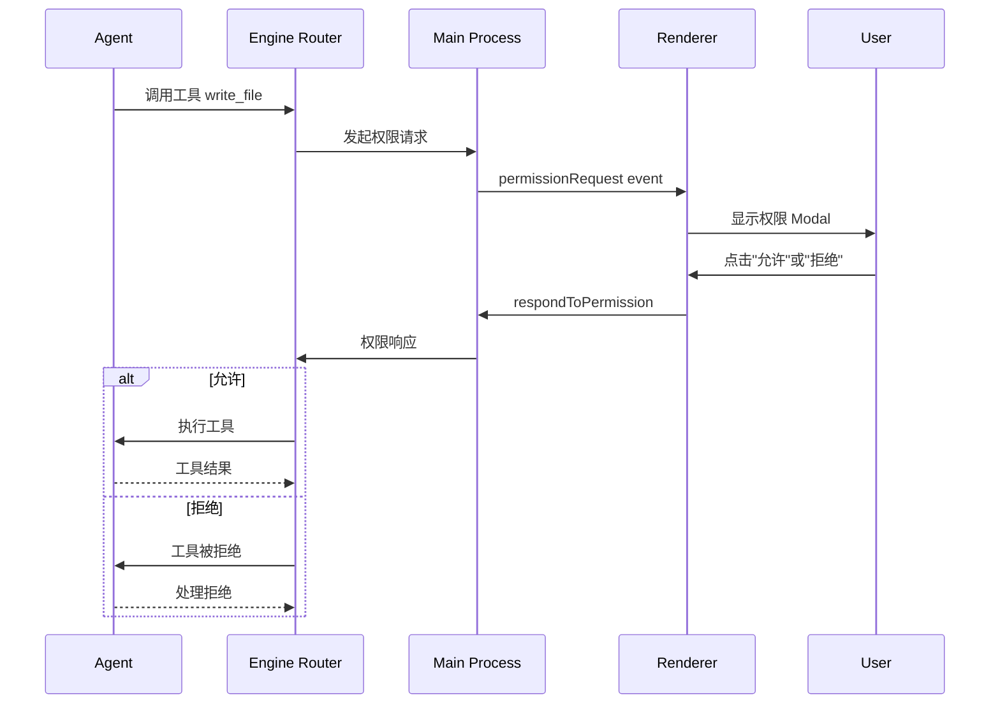

# JustDo 安全模型与权限控制

## 1. 安全架构

JustDo 采用多层安全防护，确保用户数据和系统安全。

### 1.1 安全层次

```
┌─────────────────────────────────────────────────────────────┐
│                    应用层安全                                 │
│                                                             │
│  - 用户认证（OAuth/Portal）                                   │
│  - API Key 加密存储                                           │
│  - Secrets 环境变量注入                                        │
└─────────────────────────────────────────────────────────────┘
                              │
                              ▼
┌─────────────────────────────────────────────────────────────┐
│                    进程层安全                                 │
│                                                             │
│  - Context Isolation 启用                                    │
│  - Node Integration 禁用                                     │
│  - Sandbox 启用                                               │
│  - Preload 安全桥接                                           │
└─────────────────────────────────────────────────────────────┘
                              │
                              ▼
┌─────────────────────────────────────────────────────────────┐
│                    权限控制层                                 │
│                                                             │
│  - 工具调用审批                                               │
│  - 工作目录边界                                               │
│  - 风险等级评估                                               │
│  - 单次/会话级授权                                            │
└─────────────────────────────────────────────────────────────┘
                              │
                              ▼
┌─────────────────────────────────────────────────────────────┐
│                    内容安全层                                 │
│                                                             │
│  - HTML Sandbox                                              │
│  - DOMPurify 净化                                            │
│  - Mermaid Strict Mode                                       │
│  - iframe 隔离                                                │
└─────────────────────────────────────────────────────────────┘
                              │
                              ▼
┌─────────────────────────────────────────────────────────────┐
│                    网络安全层                                 │
│                                                             │
│  - CORS 限制                                                  │
│  - HTTPS 强制                                                 │
│  - API 请求签名                                               │
│  - Rate Limiting                                              │
└─────────────────────────────────────────────────────────────┘
```

## 2. 进程安全

### 2.1 BrowserWindow 配置

```typescript
const mainWindow = new BrowserWindow({
  webPreferences: {
    preload: path.join(__dirname, 'preload.js'),
    
    // Context Isolation: 启用
    // Renderer 无法直接访问 Node.js API
    contextIsolation: true,
    
    // Node Integration: 禁用
    // Renderer 无法使用 require()
    nodeIntegration: false,
    
    // Sandbox: 启用
    // Renderer 运行在 Chromium 沙箱
    sandbox: true,
    
    // Web Security: 启用
    webSecurity: true,
    
    // 禁用远程模块
    enableRemoteModule: false,
  }
});
```

### 2.2 Preload 安全桥接

```typescript
// preload.ts
import { contextBridge, ipcRenderer } from 'electron';

// 仅暴露必要的 API，不暴露 ipcRenderer 本身
contextBridge.exposeInMainWorld('electron', {
  cowork: {
    startSession: (params) => ipcRenderer.invoke('cowork:startSession', params),
    // 其他方法...
  },
  store: {
    get: (key) => ipcRenderer.invoke('store:get', key),
    set: (key, value) => ipcRenderer.invoke('store:set', key, value),
  },
  // ... 其他命名空间
  
  // 不暴露：
  // - ipcRenderer.send
  // - ipcRenderer.sendSync
  // - require
  // - process
});
```

### 2.3 IPC 类型验证

所有 IPC 调用进行参数验证：

```typescript
// main.ts - IPC handler
ipcMain.handle('cowork:startSession', (event, params) => {
  // 参数类型验证
  if (!params || typeof params !== 'object') {
    throw new Error('Invalid params');
  }
  
  if (!params.prompt || typeof params.prompt !== 'string') {
    throw new Error('Invalid prompt');
  }
  
  // 工作目录验证
  if (params.workingDirectory) {
    if (!isAbsolutePath(params.workingDirectory)) {
      throw new Error('Working directory must be absolute path');
    }
  }
  
  // 执行业务逻辑
  return handleStartSession(params);
});
```

## 3. 权限控制

### 3.1 工具分类

| 级别 | 工具类型 | 示例 | 授权方式 |
|------|----------|------|----------|
| `low` | 信息读取 | read_file, list_directory | 可设置会话级授权 |
| `medium` | 文件修改 | write_file, create_directory | 必须单次授权 |
| `high` | 系统操作 | execute_command, network_request | 必须单次授权，显示警告 |
| `critical` | 危险操作 | delete_recursive, install_package | 必须单次授权，双重确认 |

### 3.2 权限请求流程



### 3.3 权限请求结构

```typescript
interface PermissionRequest {
  sessionId: string;
  permissionId: string;        // 请求 ID
  toolName: string;            // 工具名称
  toolInput: Record<string, unknown>;  // 工具输入
  riskLevel: 'low' | 'medium' | 'high' | 'critical';
  description: string;         // 工具用途描述
  warnings?: string[];         // 风险警告
}

// 权限响应
interface PermissionResponse {
  sessionId: string;
  permissionId: string;
  approved: boolean;
  scope: 'single' | 'session'; // 单次或会话级
}
```

### 3.4 风险评估

```typescript
function assessRiskLevel(toolName: string, toolInput: Record<string, unknown>): RiskLevel {
  // 工具风险表
  const toolRiskMap: Record<string, RiskLevel> = {
    'read_file': 'low',
    'list_directory': 'low',
    'write_file': 'medium',
    'create_directory': 'medium',
    'execute_command': 'high',
    'web_search': 'medium',
    'network_request': 'high',
    'delete_file': 'high',
    'delete_directory': 'critical',
  };
  
  let level = toolRiskMap[toolName] || 'medium';
  
  // 根据输入调整风险级别
  if (toolName === 'execute_command') {
    // 检查命令是否危险
    if (isDangerousCommand(toolInput.command as string)) {
      level = 'critical';
    }
  }
  
  if (toolName === 'write_file') {
    // 检查是否写入系统目录
    if (isSystemPath(toolInput.file_path as string)) {
      level = 'critical';
    }
  }
  
  return level;
}

function isDangerousCommand(command: string): boolean {
  const dangerousPatterns = [
    /rm\s+-rf/,
    /sudo/,
    /chmod\s+777/,
    /mkfs/,
    /dd\s+if=/,
    />\s*\/dev\/sd/,
    /curl\s+.*\|\s*bash/,
    /wget\s+.*\|\s*sh/,
  ];
  
  return dangerousPatterns.some(p => p.test(command));
}
```

### 3.5 工作目录边界

所有文件操作限制在工作目录内：

```typescript
function isWithinWorkingDirectory(filePath: string, workingDir: string): boolean {
  const resolvedPath = path.resolve(filePath);
  const resolvedWorkingDir = path.resolve(workingDir);
  
  // 检查路径是否以工作目录开头
  return resolvedPath.startsWith(resolvedWorkingDir);
}

// 工具执行前检查
function validateFilePath(toolInput: Record<string, unknown>, workingDir: string): void {
  const filePath = toolInput.file_path || toolInput.path;
  
  if (filePath && !isWithinWorkingDirectory(filePath, workingDir)) {
    throw new Error(`路径 ${filePath} 超出工作目录 ${workingDir}`);
  }
}
```

### 3.6 权限 Modal UI

**文件**：`src/renderer/components/cowork/CoworkPermissionModal.tsx`

```typescript
function CoworkPermissionModal({ request, onRespond }: Props) {
  const [scope, setScope] = useState<'single' | 'session'>('single');
  
  const getRiskColor = (level: RiskLevel): string => {
    switch (level) {
      case 'low': return 'green';
      case 'medium': return 'yellow';
      case 'high': return 'orange';
      case 'critical': return 'red';
    }
  };
  
  return (
    <Modal className="permission-modal">
      <div className="permission-header">
        <h3>工具执行请求</h3>
        <span className={`risk-badge ${getRiskColor(request.riskLevel)}`}>
          {request.riskLevel} risk
        </span>
      </div>
      
      <div className="permission-body">
        <p className="tool-name">{request.toolName}</p>
        <p className="description">{request.description}</p>
        
        <div className="tool-input">
          <pre>{JSON.stringify(request.toolInput, null, 2)}</pre>
        </div>
        
        {request.warnings && (
          <div className="warnings">
            {request.warnings.map(w => (
              <p className="warning">{w}</p>
            ))}
          </div>
        )}
      </div>
      
      <div className="permission-footer">
        {request.riskLevel === 'low' && (
          <label>
            <input
              type="checkbox"
              checked={scope === 'session'}
              onChange={(e) => setScope(e.target.checked ? 'session' : 'single')}
            />
            本次会话自动允许此类操作
          </label>
        )}
        
        <div className="actions">
          <button
            className="approve"
            onClick={() => onRespond({ approved: true, scope })}
          >
            允许
          </button>
          
          <button
            className="deny"
            onClick={() => onRespond({ approved: false })}
          >
            拒绝
          </button>
        </div>
      </div>
    </Modal>
  );
}
```

## 4. 内容安全

### 4.1 HTML Sandbox

Artifact HTML 在隔离 iframe 中渲染：

```typescript
// iframe sandbox 属性
<iframe
  srcDoc={htmlContent}
  sandbox="allow-scripts"  // 仅允许脚本，不允许同源
  // 不包含：allow-same-origin, allow-forms, allow-popups
/>
```

### 4.2 DOMPurify 净化

SVG 和用户输入 HTML 使用 DOMPurify 净化：

```typescript
import DOMPurify from 'dompurify';

// 净化 SVG
const cleanSvg = DOMPurify.sanitize(svgContent, {
  USE_PROFILES: { svg: true },
  FORBID_TAGS: ['script', 'iframe'],
  FORBID_ATTR: ['onload', 'onerror', 'onclick'],
});

// 净化 HTML
const cleanHtml = DOMPurify.sanitize(htmlContent, {
  ALLOWED_TAGS: ['p', 'div', 'span', 'a', 'img', 'h1', 'h2', 'h3', 'ul', 'li'],
  ALLOWED_ATTR: ['href', 'src', 'class', 'id'],
});
```

### 4.3 Mermaid Strict Mode

Mermaid 图表使用严格安全模式：

```typescript
mermaid.initialize({
  securityLevel: 'strict',  // 禁止点击事件和脚本
  startOnLoad: false,
});
```

### 4.4 React Artifact 隔离

React 组件在完全隔离的 iframe 中编译和渲染：

```typescript
// React artifact iframe
<iframe
  srcDoc={`
    <!DOCTYPE html>
    <html>
    <head>
      <script src="https://unpkg.com/babel-standalone"></script>
      <script src="https://unpkg.com/react@18/umd/react.development.js"></script>
      <script src="https://unpkg.com/react-dom@18/umd/react-dom.development.js"></script>
    </head>
    <body>
      <div id="root"></div>
      <script type="text/babel">
        ${componentCode}
      </script>
    </body>
    </html>
  `}
  sandbox="allow-scripts"  // 仅允许脚本
  // 无网络访问权限
/>
```

## 5. Secrets 管理

### 5.1 环境变量注入

API Keys 和 Secrets 通过环境变量注入，不硬编码：

```typescript
// OpenClaw 环境变量
const gatewayEnv = {
  // IM 平台凭证将在集成后配置
  // ...
};

// 启动 Gateway
spawn(gatewayPath, [], { env: gatewayEnv });
```

### 5.2 SQLite 加密存储

敏感数据在 SQLite 中加密存储：

```typescript
// API Key 加密
function encryptApiKey(key: string): string {
  // 使用 Electron safeStorage 加密
  return safeStorage.encryptString(key).toString('base64');
}

function decryptApiKey(encrypted: string): string {
  return safeStorage.decryptString(Buffer.from(encrypted, 'base64'));
}
```

### 5.3 配置文件安全

OpenClaw managed.yaml 不包含 Secrets：

```yaml
# managed.yaml - Secrets 通过环境变量引用
channels:
  dingtalk:
    accounts:
      acc1:
        clientId: xxx
        clientSecretEnv: JUSTDO_DINGTALK_CLIENT_SECRET  # 环境变量名
```

## 6. 网络安全

### 6.1 HTTPS 强制

所有外部 API 调用使用 HTTPS：

```typescript
function validateApiUrl(url: string): void {
  if (!url.startsWith('https://')) {
    throw new Error('API URL 必须使用 HTTPS');
  }
}
```

### 6.2 CORS 限制

Renderer 只能访问特定域名：

```typescript
// 网络请求限制
const allowedDomains = [
  'localhost',
  '127.0.0.1',
  // 用户自定义的本地模型服务地址
  // ...
];

function validateRequestDomain(url: string): void {
  const domain = new URL(url).hostname;
  if (!allowedDomains.includes(domain)) {
    throw new Error(`域名 ${domain} 不在允许列表中`);
  }
}
```

### 6.3 Rate Limiting

API 调用实施速率限制：

```typescript
class RateLimiter {
  private requests: Map<string, number[]> = new Map();
  
  check(key: string, maxRequests: number, windowMs: number): boolean {
    const now = Date.now();
    const requests = this.requests.get(key) || [];
    
    // 过滤窗口外的请求
    const validRequests = requests.filter(t => t > now - windowMs);
    
    if (validRequests.length >= maxRequests) {
      return false; // 超过限制
    }
    
    validRequests.push(now);
    this.requests.set(key, validRequests);
    return true;
  }
}
```

## 7. Skills 安全审计

### 7.1 SkillSecurityScanner

**文件**：`src/main/libs/skillSecurity/skillSecurityScanner.ts`

安装第三方 Skill 前进行安全扫描：

```typescript
class SkillSecurityScanner {
  scan(skillPath: string): SecurityScanResult {
    const issues: SecurityIssue[] = [];
    
    // 1. 脚本内容扫描
    issues.push(...this.scanScripts(skillPath));
    
    // 2. 依赖扫描
    issues.push(...this.scanDependencies(skillPath));
    
    // 3. 网络访问扫描
    issues.push(...this.scanNetworkAccess(skillPath));
    
    // 4. 文件访问扫描
    issues.push(...this.scanFileAccess(skillPath));
    
    return {
      skillPath,
      issues,
      riskLevel: this.calculateRiskLevel(issues),
      passed: issues.every(i => i.severity !== 'critical'),
    };
  }
  
  scanScripts(skillPath: string): SecurityIssue[] {
    const issues: SecurityIssue[] = [];
    
    // 扫描危险模式
    const dangerousPatterns = [
      /eval\s*\(/,
      /Function\s*\(/,
      /child_process/,
      /exec\s*\(/,
      /spawn\s*\(/,
      /require\s*\(\s*['"]child_process['"]\s*\)/,
    ];
    
    // 扫描硬编码密钥
    const secretPatterns = [
      /api[_-]?key\s*=\s*['"][^'"]+['"]/i,
      /secret\s*=\s*['"][^'"]+['"]/i,
      /password\s*=\s*['"][^'"]+['"]/i,
      /token\s*=\s*['"][^'"]+['"]/i,
    ];
    
    return issues;
  }
}
```

### 7.2 SecurityIssue 类型

```typescript
interface SecurityIssue {
  type: 'dangerous_pattern' | 'hardcoded_secret' | 'unsafe_dependency' | 'network_access';
  severity: 'low' | 'medium' | 'high' | 'critical';
  file: string;
  line?: number;
  description: string;
  recommendation?: string;
}

interface SecurityScanResult {
  skillPath: string;
  issues: SecurityIssue[];
  riskLevel: RiskLevel;
  passed: boolean;
}
```

## 8. 日志安全

### 8.1 敏感信息过滤

日志输出过滤敏感信息：

```typescript
function sanitizeLogMessage(message: string): string {
  // 过滤 API Keys
  message = message.replace(/api[_-]?key[=:]\s*\S+/gi, 'api_key=REDACTED');
  
  // 过滤 Secrets
  message = message.replace(/secret[=:]\s*\S+/gi, 'secret=REDACTED');
  
  // 过滤 Tokens
  message = message.replace(/token[=:]\s*\S+/gi, 'token=REDACTED');
  
  // 过滤密码
  message = message.replace(/password[=:]\s*\S+/gi, 'password=REDACTED');
  
  return message;
}
```

### 8.2 错误信息脱敏

用户可见的错误信息不包含敏感细节：

```typescript
function sanitizeErrorMessage(error: Error): string {
  // 不暴露内部路径
  let message = error.message.replace(/\/Users\/\w+/g, '/Users/xxx');
  message = message.replace(/C:\\Users\\\w+/g, 'C:\\Users\\xxx');
  
  // 不暴露 API URLs
  message = message.replace(/https:\/\/[^\s]+/g, 'https://api.example.com');
  
  return message;
}
```

## 9. 安全清单

### 9.1 提交前检查

```markdown
- [ ] 无硬编码密钥（API keys, passwords, tokens）
- [ ] 所有用户输入已验证
- [ ] SQL 注入防护（使用参数化查询）
- [ ] XSS 防护（HTML/SVG 已净化）
- [ ] CSRF 保护启用
- [ ] 认证/授权已验证
- [ ] 所有端点启用 Rate Limiting
- [ ] 错误信息不泄露敏感数据
```

### 9.2 代码审查重点

- 文件路径操作：检查工作目录边界
- 网络请求：检查 HTTPS 和域名限制
- 子进程执行：检查命令危险度
- 用户输入：检查净化和验证
- Secrets 存储：检查加密和环境变量

## 10. 关键文件清单

| 文件 | 职责 |
|------|------|
| `src/main/main.ts` | BrowserWindow 安全配置 |
| `src/main/preload.ts` | Preload 安全桥接 |
| `src/main/libs/agentEngine/openclawRuntimeAdapter.ts` | 权限请求处理 |
| `src/main/libs/skillSecurity/skillSecurityScanner.ts` | Skill 安全扫描 |
| `src/main/libs/skillSecurity/skillSecurityRules.ts` | 安全规则定义 |
| `src/renderer/components/cowork/CoworkPermissionModal.tsx` | 权限 UI |
| `src/renderer/utils/dompurify.ts` | DOMPurify 配置 |