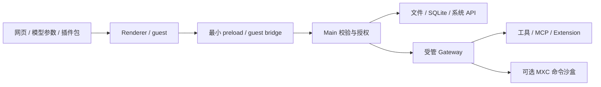

# 安全模型：能力边界与剩余风险

本页描述当前代码实施的控制，不把配置声明当成所有平台的实测保证。安全目标是让外部内容、模型参数、Renderer 请求和插件包只能通过明确能力访问用户资源；已有边界也有可见限制。

## 1. 威胁与资产

需要保护的资产包括用户项目、原生历史、模型与代理凭据、浏览器状态、工具执行权限和无人值守任务。输入来自模型、网页、附件、MCP、Marketplace、外部客户端及可能失陷的 Renderer，不能因“运行在本机”而免除验证。

```mermaid
flowchart LR
  External[网页 / 模型参数 / 插件包] --> UI[Renderer / guest]
  UI --> Bridge[最小 preload / guest bridge]
  Bridge --> Main[Main 校验与授权]
  Main --> Files[文件 / SQLite / 系统 API]
  Main --> Gateway[受管 Gateway]
  Gateway --> Tools[工具 / MCP / Extension]
  Gateway --> Sandbox[可选 MXC 命令沙盒]
```

Gateway 是受管组件，但其可加载的 Node Extension 与宿主工具仍有高权限。插件声明、提示词和“只读”文案不能代替实际运行时策略。

## 2. Electron 与网页隔离

主窗口启用 nodeIntegration=false、contextIsolation=true、sandbox=true 和 webSecurity；图片预览也是独立沙箱窗口。外部 guest 由 Main 强制固定 preload、合法 partition、无 Node 和导航策略。普通网页不能继承主 Renderer 的 window.electron。

当前生产源码没有主动追加 no-sandbox。发布检查仍需查看实际启动参数和平台环境，不能仅凭 BrowserWindow preference 宣称 OS 级隔离始终可用。

应用 CSP 针对应用 origin/file 页面生效，允许 PDF.js 所需 wasm-unsafe-eval，生产不允许普通 JS eval；style 保留 inline，connect-src 仍为 self + 通配，frame 允许 self/http/https。它不是网络访问白名单。Markdown、Mermaid 和公式输出仍需统一清洗。

外链、guest 导航、子 frame、下载和权限请求分别验证。应用自己的认证弹窗不能被网页或 Agent 输入锁劫持；导航、超时和窗口销毁应取消所属请求。

## 3. IPC 与资源所有者

Main 将 payload 当 unknown 处理，验证类型、枚举、大小、长度、路径、URL、调用来源和资源归属。TypeScript 只能约束编译期，不能证明请求安全。

网络取消、PDF 读取、编辑 grant 等按 sender/request 绑定；另一个窗口不能凭同名 requestId 使用资源。浏览器 webContentsId 需同时满足窗口归属、类型、partition 和真实 storage path，不能只检查 ID 存在。

preload 只暴露具体方法和可解除订阅，兼容 IPC 也限白名单。返回数据只包含 UI 所需内容，不返回任意文件句柄、完整配置或 credential object。

## 4. 四种不同权限控制

| 控制面                             | 决定什么                  | 不能替代什么               |
| ---------------------------------- | ------------------------- | -------------------------- |
| Session permissionMode/root        | 当前会话文件/命令执行策略 | 其他会话或全局授权         |
| Exec/plugin approval               | 某次或受限范围的原生授权  | UI 关闭不代表允许          |
| Session visibility / scoped access | 跨会话读取和发送范围      | 文件沙盒                   |
| Windows MXC sandbox                | 工具子进程可见文件和网络  | Main、模型 API、浏览器隔离 |

ask/auto/full 映射原生 guarded/workspace/full。权限期望先保存产品会话，活跃期间延迟应用，下一 turn 必须回读核对 mode/root 成功；失败不提升全局权限兜底。

审批由原生请求生命周期拥有，Main 检查 kind、允许决策和请求身份。期限到达、停止、撤销与重复回复均要收敛，不能因为 Renderer 没收到 dismiss 就继续接受许可。计划模式和 scheduled-task mutation 另有原生扩展门禁。

协作发送使用可信调用上下文与精确目标实例，限定任务成员、轮次和有效期。助手禁用/删除是产品入口限制，不等于撤销所有原生或外部客户端授权。

## 5. 文件读取、编辑与产物

文件预览不是通用 fs API。扩展名、普通文件、symlink、realpath、大小和文件身份需在读取边界检查。编辑 token 绑定 canonical path、owner、版本摘要和期限；真正写入重新验证，采用同目录临时文件与原子替换，冲突显式返回。

浏览器 Agent 上传限任务工作区内真实普通文件；PDF/下载目标验证真实父目录、拒绝覆盖并做 canonical reservation，防止并发争抢同一产物。取消和窗口销毁释放 reservation 并清理部分文件。

`localfile://` 当前转换成 net.fetch(file://...)，保留文件名转义和 UNC host，只规范化 Windows 盘符分隔符；没有内建 allow-root/token。它是敏感展示入口，不能描述成通用安全文件服务器。

## 6. 插件包与代码信任

解包拒绝 traversal、绝对/别名路径、symlink、特殊文件、重复项和过大展开。目标必须位于精确受管根；删除系统或父 Extension 托管项不能由 UI 任意构造 path 完成。

Extension 导入审查 capability surface、operator grants、来源和 integrity，再以 reviewToken 绑定同一内容。审查后重新校验，包变化就失效。已安装 inventory 才是运行态事实。

这些检查减少安装错误和未授权能力，不把 Node Extension 变成恶意代码沙盒。它可能读取 Gateway 进程环境；安装可信代码仍是重要信任决定。

## 7. 凭据与认证

| 载体                         | 当前保护与限制                                                 |
| ---------------------------- | -------------------------------------------------------------- |
| Gateway token                | 本地认证能力，只交集中式聊天 client；不进入日志/Redux          |
| Chrome app-server capability | 每进程随机，连同 path/Origin 验证；与 relay/Gateway token 分离 |
| Multica bridge token         | 当前用户受限发现文件与认证管道                                 |
| 内置模型 JWT                 | 短期、账号绑定、派生快照与 exec SecretRef；退出/到期清理       |
| 自定义模型秘密               | 产品配置来源及受限权限派生 file SecretRef；不宣称全部 OS 加密  |
| 导入浏览器密码               | browser-import.sqlite 内 safeStorage 密文，Renderer 不读取     |

appConfigCredentials 当前兼容读取早期 OS 加密记录并清空旧 builtin 引用，不统一加密新的自定义 key。数据库整体也没有全库加密。二进制 JWT 包装不能防同用户逆向，bearer token 在有效期内仍有重放风险。

内置模型服务端校验 JWT 签名与 Team 授权，X-User-Account 不能独立授权；客户端不持有服务端 master key。登录交接、模型发现、SecretRef 解析及服务端拒绝要分别诊断。

## 8. 网络请求与出站请求头

Electron session、Main fetch 和 Gateway 子进程是三个作用域。代理切换按 generation 串行处理，避免旧连接和全局 env 污染。模型连接测试通过受限 purpose 入口校验 method/endpoint/body，通用 fetch 不拥有任意请求头注入权。

Extension sidecar 只声明 HTTPS 目标、Header 名称和受管 user-info 引用，不包含值，不写永久手工配置。安装后 canonical readback 决定有效声明；代理选择性注入，不把凭据下发 UI。此机制是合作式配置，不是阻止恶意 Gateway 插件读取环境的沙盒。

远程 URL、redirect、loopback 及内网访问按具体服务校验，不因 CSP 通配而免除 SSRF 防线。原生网络工具与浏览器网页内容仍作为不可信模型输入。

## 9. 日志、更新与剩余风险

日志记录状态、计数、脱敏来源和必要身份，不记录 token、原始认证头、完整配置及用户内容。Gateway 摘要会省略事件；排障原生 JSON 时先检查上下文隐私，不能直接提交到仓库。

Windows updater 当前 verifyUpdateCodeSignature=false。构建的 hash/更新 artifact 校验不能被宣传为已完成发布者签名验证。runtime source lock、补丁和二进制 hash 校验也不能取代安装渠道的信任。

剩余风险至少包括：广泛 connect-src、localfile 缺少 token/root 授权、同用户本地凭据可访问面、可信 Node 插件、共享项目写冲突，以及不同平台实际隔离差异。文档不能用“本地优先”隐藏这些边界。

## 10. 安全回归按攻击路径组织

验证恶意 IPC payload、跨窗口 resource ID、symlink/路径别名、解包逃逸、审查后换包、凭据轮换、取消后的迟到请求、跨任务 send、审批过期和禁用扩展后的残留入口。测试位置包括 Main window/network/filesystem、IPC、permission coordinator、插件 import 和 runtime extension tests。

只运行正常安装和正常发送无法证明边界成立；新能力应明确最小权限、所有者、销毁点及失败关闭方式。Windows 工具隔离细节见[原生沙盒](17-windows-native-sandbox.md)。
