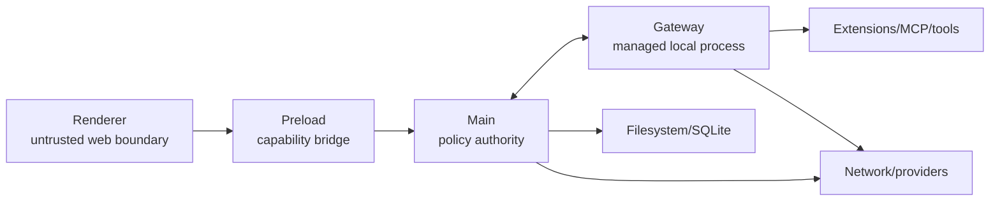
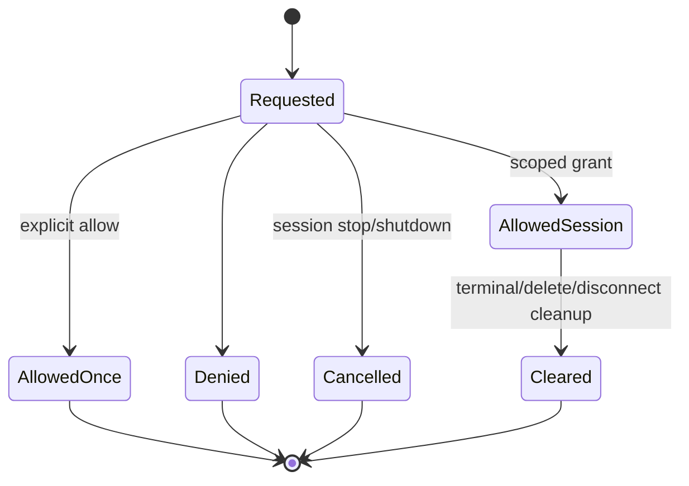

# 安全模型

本文按 `v2026.8.12` 的 Electron window、preload/IPC、权限 coordinator、文件/网络服务、plugin import、Gateway manager 和测试重写。它记录当前防线，也明确仍需关注的风险。

## 1. 资产与攻击面

需要保护：模型/API 凭证、Gateway/extension/browser relay token、用户文件与 workspace、SQLite 会话内容、OpenClaw state/transcript、系统代理凭证、工具执行权限和无人值守 cron 权限。

主要不可信输入：Renderer payload、模型生成的 tool 参数、Gateway/extension/Marketplace/MCP 响应、用户选择的目录/压缩包、remote URL/redirect、历史 transcript、外部页面和本地其他进程。

## 2. 信任边界

```mermaid
flowchart LR
  R[Renderer\nuntrusted web boundary]
  P[Preload\ncapability bridge]
  M[Main\npolicy authority]
  G[Gateway\nmanaged local process]
  X[Extensions/MCP/tools]
  F[Filesystem/SQLite]
  N[Network/providers]
  R --> P --> M
  M <--> G
  G --> X
  M --> F
  M --> N
  G --> N
```

Gateway 是受管组件但其 event/payload 仍需运行时验证；extension/Marketplace/MCP 更不能默认可信。

## 3. Electron 防线

`mainWindowFactory` 当前设置：`nodeIntegration:false`、`contextIsolation:true`、`sandbox:true`、`webSecurity:true`、生产禁用 DevTools、禁 WebSQL、禁页面 dialogs、禁 drag-drop navigation。Preload 是唯一系统桥。

新窗口通过 `setWindowOpenHandler` 拒绝内嵌创建并交给 `shell.openExternal`。这里仍要求调用方/handler限制允许协议；不能把任意 `file:`、自定义 scheme 或 credential URL 当安全外链。

Main 在 Linux/Windows启动参数中加入 `no-sandbox` 以处理平台/管理员 GPU 降权问题，这与 BrowserWindow 的 sandbox preference 存在平台实际差异。威胁模型不能宣称 OS sandbox 在这些平台始终有效，因此 IPC 最小化和输入验证尤为关键。

## 4. CSP

生产 CSP：default/script self；style self + inline；image self/data/http/https/localfile；font self/data；media self；worker self/blob；frame self。开发 script 额外允许本地 Vite/HMR。

当前 `connect-src *` 为 provider/Gateway/插件连接提供广泛网络能力，是明确剩余风险；CSP 不能代替 Main network policy。Markdown HTML 仍必须 DOMPurify 清洗，Mermaid/KaTeX output也不能绕过 sanitizer。

## 5. Preload 与 IPC

- 只暴露语义 namespace；禁止通用 invoke/send。
- 订阅封装 handler 并返回 unsubscribe，避免旧页面 listener 接收敏感事件。
- Main 将 payload 视为 unknown：枚举、长度、数量、URL、path、numeric range 和 record shape 均校验。
- 返回值只包含 UI 需要字段；Error、child process、DB handle、完整 config 不跨边界。
- request cancellation 绑定 `event.sender.id`，另一个 Renderer 不能取消其请求。
- preview authorization 和 pending operations 绑定 sender；sender destroyed 自动取消/撤销。

## 6. Agent 权限

产品模式 ask/auto/full 映射为 OpenClaw 原生 session `guarded/workspace/full`。每个 turn 前以 `sessions.create` 幂等写入并核对 `permissionMode` 与规范化 `sessionRoot`。显式切换先把用户期望值写入 SQLite；空闲时立即同步，run 活跃时允许操作并延迟到终态后台应用。同步失败保留待应用状态，不恢复旧权限；下一 turn 必须严格收敛成功才能发送。全局 config 固定 restricted fallback，不能因某个会话选择 Full 而提升其他会话。

Exec 与 plugin approval 分开。allow-once/allow-session/allow-always/deny 只有 Gateway/shared contract允许的组合可提交；session grant 绑定 session key并在 terminal/stop/delete 清理。UI modal 关闭不能等同允许。

命令审批等待时限由 `agentRuntimeSettings:v1` 管理，预设无限、10、20、30、60 分钟。该值通过受管进程环境进入 OpenClaw 原生 exec approval 生命周期；UI 只展示 Gateway 给出的期限，不自行延长后端请求。设置变更只影响后续审批。

OpenClaw 原生 session mode 同时约束管理型文件工具与 exec reviewer；旧 `action-approval` 扩展及其全局 mode 已删除。受保护的 `automation-permission` extension 直接读取原生 session mode，补足 scheduled-task mutation 门禁；它不保存独立模式，缺失时 Gateway readiness 失败。无人值守 `justdo-scheduler` 只有在原生 cron-run session key 下才可豁免，普通交互 session 不能继承或冒用该权限。

`tools.sessions.visibility` 是独立的跨会话读取与消息范围，不等同于文件/命令 permission mode。它由“设置 → 配置”的 `self/tree/agent/all` 选择生成，默认 `tree`；旧 `agentRuntimeSettings:v1` 缺少字段时同样回填 `tree`，避免升级后静默扩大到同 Agent 的全部会话。OpenClaw 默认对沙盒会话施加 spawned-only clamp，有效范围统一为当前任务树；这会收窄 `agent/all`，但也意味着沙盒内的 `self` 不能被产品文案描述为绝对的单会话安全边界。

## 7. 命令与工具

命令安全属于 Main/Gateway policy，不在 Renderer字符串过滤。工具名必须使用声明的 core contract，不猜 alias；参数审批展示实际 command/path/action。高危动作不能因模型声称“用户已同意”而跳过。

Extension/MCP stdio 会启动子进程：command、args、env、cwd 来源需验证，secret 环境不可打印。受管目录锁诊断只终止可证明属于应用/Gateway 的 PID，不能杀任意系统进程。

## 8. 文件读取与预览编辑

Preview 只支持 shared allowlist extension，最大 2 MiB。读取流程用 `lstat` 拒绝 symlink/非普通文件，realpath 后再次核对 extension、device/inode、size/mtime，防 TOCTOU。

读取生成随机 edit token，绑定 canonical path、file identity、SHA-256 version、Renderer owner 和 30 分钟 TTL；最多 128 个 grant。真正编辑需二次 authorize，写入时再次核对 owner、version/identity与大小。写采用同目录 `wx` 临时文件、flush、最终核对后原子 rename；冲突由用户选择 cancel/overwrite/reload。Drawer 关闭会 revoke。

`shell.openPath/showItemInFolder` 与 preview read 分离；相对路径按明确 cwd 解析。用户选择 dialog 是授权信号，但后续用途仍需验证。

## 9. `localfile://` 风险

当前 protocol handler把 URL pathname decode 后交给 `net.fetch(file://...)`，用于本地图片展示，但代码本身没有 allow-root/token检查。安全性依赖只有受信 UI 生成 URL、CSP 和 Renderer 无任意导航。它应被视为敏感攻击面；新增使用时必须限制来源，不能把它描述成通用安全文件服务器。

## 10. Plugin 文件安全

- Skill/Hook/Extension目标必须在精确 managed root，删除前 canonicalize。
- archive 支持类型有限；解压检查 traversal，Extension 递归拒绝 symlink。
- built-in/protected item（如受管 runtime bridge、built-in Hook）不可普通覆盖/删除；退役 permission extension 由同步代码定向清理。
- Extension CLI 有 300 秒 timeout与 64K 输出上限；成功需明确模式和重新列举。
- Marketplace response 逐字段 allowlist、长度/数量限制，provider error 脱敏；prepared payload finally cleanup。
- MCP config/remote resource 不进入 DOM 前需 normalize；credential/env 不记录。

## 11. 网络与代理

网络分三条作用域：Electron session、Main fetch、Gateway child。系统/custom/direct preference 串行应用 generation，Electron切换后 `closeAllConnections`；custom URL 写入 env 时可能含 credential，日志只说已启用，不输出 URL。

Main `api.fetch` 使用 Electron session，取消键绑定 sender/request id；outbound header policy 只对 allowlisted origin/name匹配时注入，并拒绝不安全值。日志记录 source、origin、随机 request id 和注入数量，不记录值。

Gateway child 与显式 opt-in 的 OpenClaw one-shot CLI 通过 selective outbound header proxy 和独立
env；当前 memory search/index CLI 属于 opt-in consumer。动态 bypass 当前本地 Gateway port，避免
loopback RPC 被系统代理。代理是本机网络边界，需防任意本地调用者、过宽 MITM 与全局 env 竞态；
详见功能审计文档。

## 12. Token 与 Secrets

- Gateway token 是随机 24-byte hex，存 state `gateway-token`，通过 child env/launch arg 使用；不得写日志。
- Browser extension relay token 是 32-byte hex，host-local 文件用 exclusive create 和 `0600`，配对复制到剪贴板但 status API不回 token。
- `AskUserQuestion` 只通过已认证 Gateway 的 scoped `plugin.ask-user-question.*` event、`askUserQuestion.*` RPC 与固定 Electron IPC 流转；Main 和 extension 都按稳定 id 校验 Renderer 回传，extension pending record 是最终权威。该链路没有额外 HTTP listener、callback secret 或开放端口。
- Provider API key、proxy password、MCP env、Marketplace内部字段和 auth header 不输出。
- Renderer encryption helper不能被当作强 secret vault；真正凭证的落盘/传输边界由 Main/provider config负责。

## 13. 日志与隐私

Main log 使用模块 prefix；只记录 ids/fingerprint/计数/状态和脱敏 origin。不得记录 prompt全文、tool credential、Authorization、完整 session key、用户 header 值或原始 Marketplace error。

Gateway condensed log刻意省略高频/敏感细节。native JSON log可能包含用户内容，只用于本地排障，不加入 commit；分享片段前检查上下文。日志导出 zip 是显式用户动作，也应限制到受管 log目录。

## 14. 数据库与本地状态

SQLite 和 OpenClaw state含敏感会话/路径/配置，依赖 OS 用户目录权限；当前没有全库加密。删除 session/result 时应清对应 transcript/artifact，但备份/WAL/上游 provider 已接收数据无法由本地删除保证抹除。

Legacy schema destructive reset只有严格列缺失检测才执行；误判是数据可用性风险。插件/结果清理必须失败保留可恢复记录，不制造半删除。

## 15. Browser 模式

isolated、user、extension 三种模式具有不同 cookie/profile/人工确认边界。Extension relay只监听 loopback并要求 token；打开 remote debugging/extension management 是显式用户动作。无人值守用户浏览器不能宣称绕过 Chrome 的首次安装/授权安全提示。

当前扩展仅在 `attach` 时强制校验tab group membership；`cdp`、`closeTab`、`activateTab` 没有同等级校验，Unpair也只清配对storage/socket而不主动detach既有debugger attachment或清理group。因此tab group目前是可见授权信号，但还不是完整的命令级capability边界；修复前不得宣称组外tab绝对不可控制或撤销立即释放全部调试权限。

## 16. 更新与供应链

依赖由 lockfile固定；OpenClaw runtime按版本、patch manifest、freeze/prune tests验证；Windows打包包含固定 MinGit/Python与 hashed Python requirements。Extension/Marketplace 安装仍是执行第三方代码的供应链入口，需要显示来源/版本/权限并支持失败清理。

Auto update仅在受支持的已安装 Windows构建启用。当前 builder `verifyUpdateCodeSignature:false` 是明确风险，需要由可信 HTTPS feed、artifact manifest/发布流程补偿；不能在文档中声称客户端执行了代码签名验证。

## 17. 已知限制

- Linux/Windows进程级 `no-sandbox` 降低 Chromium OS sandbox保障。
- CSP `connect-src *` 过宽。
- `localfile://` handler没有内建 allow-root/token。
- SQLite/OpenClaw state未全盘加密。
- Gateway token目前可经受控 preload API供本地 chat连接，扩大了 Renderer被攻陷后的影响面。
- 通用 `api.fetch` 的 URL/method/header/response size约束仍应持续加强。
- Windows updater禁用了客户端签名验证。

这些不是移除现有防线的理由；涉及这些区域的变更必须单独 threat review。

## 18. 安全评审清单

1. 输入是否来自 Renderer/model/Gateway/第三方？运行时如何验证？
2. 是否新增路径、URL、command、archive 或 credential？边界和上限是什么？
3. 是否可能跨 session/run/Renderer owner 混淆授权？
4. config sync失败是否 fail closed？scheduler 是否仍无人值守安全？
5. 是否记录了 secret、用户正文、完整 key/path或第三方原始错误？
6. 删除/覆盖是否 canonicalize目标、处理 symlink/TOCTOU并可恢复？
7. 事件乱序/重连/重复是否可能绕过审批或生成假终态？
8. 新依赖/patch/runtime资产如何锁定和验证？
9. 是否补充失败、跨 owner、超限、竞态和回滚测试？
10. 是否同步安全、IPC、数据或插件文档？

## 19. 威胁到控制映射

| 威胁                          | 主要控制                                               | 剩余风险                                  |
| ----------------------------- | ------------------------------------------------------ | ----------------------------------------- |
| Renderer XSS 获得特权         | context isolation、无 Node、专用 preload、DOMPurify    | preload 中 token/通用接口仍扩大影响面     |
| 恶意 Gateway/model payload    | shared normalize、domain admission、Markdown 清洗      | 新 event/schema 若绕过统一 pipeline       |
| 路径 traversal/symlink escape | Main canonicalize、managed root、archive validation    | TOCTOU 与 `localfile://` 全局边界仍需收紧 |
| 命令越权                      | command safety、exec approval、session grant           | full/unattended policy 本身具有高权限     |
| Credential 泄露               | Main-only storage、日志脱敏、公开字段投影              | 本地明文 state/剪贴板 pairing token       |
| SSRF/任意网络访问             | Main fetch validation、proxy policy                    | `connect-src *` 与通用 fetch 面仍较宽     |
| 供应链篡改                    | lock/hash、fixed runtime、patch verify、artifact tests | updater 客户端签名验证当前关闭            |
| 跨 session 授权混淆           | session/run owner、终态 grant cleanup                  | 乱序/错误映射需持续回归测试               |

## 20. Approval 生命周期

```mermaid
stateDiagram-v2
  [*] --> Requested
  Requested --> AllowedOnce: explicit allow
  Requested --> AllowedSession: scoped grant
  Requested --> Denied
  Requested --> Cancelled: session stop/shutdown
  AllowedSession --> Cleared: terminal/delete/disconnect cleanup
  AllowedOnce --> [*]
  Denied --> [*]
  Cancelled --> [*]
  Cleared --> [*]
```

批准必须绑定 kind、session key、run/request identity；exec 与 plugin approval 不共享泛化 grant。UI modal 关闭不等于批准或拒绝，Main/Gateway 的 resolve 结果才是权威。Scheduler 不走等待交互的生命周期，而使用受管无人值守策略。

## 21. 文件操作检查顺序

1. 验证输入类型、长度和禁止字符。
2. 解析为绝对 canonical target，验证位于明确 allow root。
3. 对现存对象检查 symlink/reparse point；archive 对每个 entry 检查 traversal。
4. 在覆盖/删除前展示精确目标并取得所需授权。
5. 使用最小权限 API执行，避免 shell 字符串拼接。
6. 处理检查与使用之间的变化，必要时重新验证 parent/target。
7. 返回稳定结果，日志不输出用户内容/secret；临时目录在 finally 清理。

## 22. 安全日志规则

允许记录模块、操作类型、稳定 error code、耗时、脱敏 id 和必要路径类别；禁止记录 token、API key、Authorization、完整 credential/config、原始 prompt、未清洗第三方响应。Gateway condensed log 仍可能含 80 字内容预览，分享前必须人工审查；native JSON log 不得加入仓库。

## 23. 安全测试要求

高风险 handler 至少测试空/超长/错误 enum、路径越界、symlink/archive traversal、重复/乱序 approval、session owner 不匹配、shutdown pending cleanup、日志脱敏和失败回滚。网络路径测试 loopback、代理 bypass、redirect、timeout/size；渲染路径测试 script/event handler/危险 URL/超大 Mermaid/KaTeX。

## 24. 剩余风险治理

已知限制应有 owner、缓解控制和收紧时的兼容计划。收紧 CSP/localfile/token API 可能影响 chat media 或本地连接，必须先枚举 consumer；恢复 Chromium sandbox 需验证 native/runtime/平台启动；启用 updater 签名验证需与实际签名发布链一起交付，不能孤立切开关后让所有更新失败。
