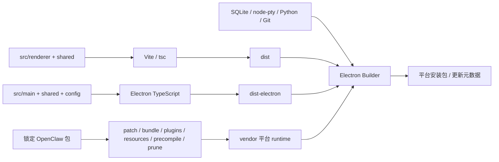

# 工程构建、运行时资源与发布

本文解释构建输入如何变成可运行安装包，以及为什么 Renderer 构建通过不代表 Gateway、原生模块和平台资源都已可用。日常启动命令见[开发与排障](../development.md)。

## 1. 版本有三个层次

| 项目     | 声明/锁定                            | 解释                            |
| -------- | ------------------------------------ | ------------------------------- |
| 应用     | v2026.8.27                           | package.json 与 lockfile 根版本 |
| Node     | .nvmrc 24.21.0；engine >=24.16.0 <25 | 开发工具与原生构建环境          |
| Electron | 声明 ^42.6.2；lockfile 42.7.0        | 桌面运行时与 Electron ABI       |
| OpenClaw | v2026.9.6                            | 独立锁定 pristine runtime       |
| 包管理   | npm、package-lock.json               | 应用依赖解析                    |

package.json 范围、lockfile 实际版本与最终 bundle manifest 不能混为一谈。运行时还有自己的依赖树；主应用 dependencies 列表不是全部随包工具清单。

## 2. 编译边界

Renderer 使用 React 18、Redux Toolkit、Lit、Tailwind、自有主题、Markdown-it/KaTeX/Mermaid/DOMPurify 及 Monaco。Main 使用 Electron、better-sqlite3、ws、网络代理、归档和系统工具库。

| 配置                   | 输入与目标                                                      | 关键限制                                    |
| ---------------------- | --------------------------------------------------------------- | ------------------------------------------- |
| tsconfig.json          | renderer + shared；ES2020、ESNext、bundler、DOM、strict、noEmit | 不导入 Main/Node 特权实现                   |
| electron-tsconfig.json | main + shared + config；CommonJS、ESNext、dist-electron         | noImplicitAny，排除测试                     |
| Vite                   | Renderer HTML、应用 bundle 和开发入口                           | 根目录在 src/renderer，环境配置仍从仓库读取 |
| Electron Builder       | 应用 bundle + 原生依赖 + 平台资源                               | 目标架构与资源预备必须匹配                  |

Shared 同时参与两套编译，不能靠某个 tsconfig 恰好提供的全局隐藏跨进程依赖。主题生成脚本在 scripts/theme，浏览器主题数据与运行时留在 Renderer。

## 3. 构建产物不是一个目录

app.asar 不能包含需要直接加载的所有 native 二进制；better-sqlite3 和 node-pty 使用 asarUnpack。Gateway bundle、扩展、运行时工具和本地语音资源通过额外资源规则进入目标包，不能仅检查 dist 存在。

## 4. 开发路径与原生 ABI

`dev` 仅启动 Vite；`electron:dev` 编译并启动桌面；`electron:dev:openclaw` 先准备 host runtime。隔离预览用独立 userData，不自动导入真实模型凭据。

better-sqlite3 必须对应执行它的 Node/Electron ABI。npm test 的包装脚本先 npm rebuild 到 Node，运行 Vitest，finally 恢复 Electron native；失败也执行恢复。不要并行跑测试与依赖 SQLite 的桌面预览或 native rebuild。

Builder 显式 npmRebuild=false，是因为项目自己准备 SQLite，node-pty 使用预构建；它不表示无需原生二进制，也不能拿 host 架构产物跨平台打包。

## 5. OpenClaw 供应链

运行时从 source-lock 固定的 npm 包及完整性开始，验证 pristine contracts，再应用当前补丁。构建 recipe 变化会使冻结快照失效；同版本修改也需重建。历史/部分补丁形态明确拒绝，不做就地修补。

平台脚本执行安装、current 同步、Gateway bundle、官方插件、产品资源、扩展预编译和裁剪。必须对最终 bundle 验证能力，不能只验证邻近源码仓库。当前补丁职责、依赖和上游删除条件只维护在[版本目录](../../scripts/patches/v2026.9.6/README.md)。

## 6. 平台资源和安装器

Windows 准备 MinGit、便携 Python 和 hashed requirements，依赖装入 bundled-site-packages；Python 工具基线不等于系统装有 LibreOffice/Poppler 等外部程序。本地语音引擎与按需模型分开，不能把运行时 DLL 存在当模型已安装。

MXC 是 Windows 专属 OpenClaw 插件，SDK、执行器与提权 helper 有固定 hash 和签名验证。macOS/Linux 不携带或启用这个后端。

Windows 使用 NSIS，macOS 使用 DMG，Linux 使用 AppImage/deb。NSIS archive 固定 BCJ 过滤以兼容安装时解码器，包括 prepackaged 路径；不要删除这一构建约束后只验证 7za 本机能解压。具体安装故障处理见[安装器说明](../windows-installer.md)。

## 7. 品牌、更新与发布身份

Builder 从 productName 派生 executableName、appId、桌面显示和安装器名称，内部 justdo 协议保持稳定。productName 仅允许英文字母，安装路径和项目路径可含中文、空格；测试不应把品牌校验扩展成路径限制。

Windows 更新使用 generic feed，发布元数据和 artifact hash 由专用脚本核对；verifyUpdateCodeSignature 当前关闭，不能宣称已建立发布者签名验证。自动安装前先完成应用 shutdown cleanup。

## 8. 命令和验证的实际范围

| 命令                            | 证明范围                              |
| ------------------------------- | ------------------------------------- |
| validate:product-metadata       | 品牌声明与派生规则                    |
| lint                            | 配置范围内的静态规则                  |
| build                           | Renderer 类型与 Vite 产物             |
| compile:electron                | Main/shared/config 编译及 native 前置 |
| test                            | Vitest 行为回归，执行前后切换 ABI     |
| openclaw:patches:verify         | 锁定运行时补丁/契约验证               |
| pack                            | 当前资源组成的目录包                  |
| dist:win/mac/linux              | 平台预备流程和安装包构建              |
| verify:windows-update-artifacts | Windows 更新产物的一致性              |

通用 pack/dist 不自动等价于所有平台的资源预备。macOS 架构目标、签名配置与 Windows native 资源需按对应 script/hook 检查。一次 build 成功不能写成全平台发布通过。

## 9. CI 当前限制

ci.yml 按路径过滤 renderer/main/skills/scripts/docs，并使用 .nvmrc。现有 workflow 使用 npm install，npm cache key 只 hash package.json；skill job 调用尚未在 package.json 定义的 build:skills。lockfile 根版本已同步，不再属于缺口。

文档不修改这些工作流，也不据局部通过掩盖失败项。依赖升级需核对原生 ABI、目标架构、runtime freeze、插件预编译、license、安装器和更新产物，而不是只更新一个版本字符串。

## 10. 发布排障

先确定失败阶段：依赖安装 → TypeScript/Vite → native ABI → runtime 组装 → Builder 资源 → 安装解包 → 首次启动 → 自动更新。保留该阶段的脱敏日志与 manifest，避免为一个缺 DLL 的问题重写会话代码。

文档变更只做格式、链接和差异检查；行为或构建变更才运行相关测试。测试结果记录命令、目标平台与实际范围，不复制旧文档中的通过数量。
