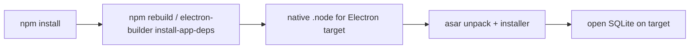

# 技术栈、构建与发布

本文按 `v2026.8.12` 的 `package.json`、TypeScript/Vite/Electron Builder 配置、runtime 脚本和 GitHub Actions 重写。依赖版本以 lockfile 为最终安装依据；下文列主版本与工程用途。

## 1. Runtime 基线

| 组件       | 当前版本/约束                     | 用途                                           |
| ---------- | --------------------------------- | ---------------------------------------------- |
| Node.js    | `24.15.0`，engine `>=24.15.0 <25` | 开发脚本、Main、OpenClaw tooling               |
| Electron   | `^42.6.2`（42.6 系列）            | 桌面进程、窗口、IPC、系统集成                  |
| OpenClaw   | `v2026.7.1-2`                     | Agent/Gateway/session/tool/cron/plugin runtime |
| npm        | package dependency `^11.18.0`     | 安装与脚本                                     |
| TypeScript | `^5.7.3`                          | Renderer/Main/shared 静态检查                  |

使用 `nvm use 24`。不要用 Node 22/25 生成或测试 native/runtime 产物；`better-sqlite3` ABI 与 Electron target 必须一致。

## 2. Renderer

- React 18、React DOM、React Redux 9、Redux Toolkit 2。
- Lit 3 用于 `<justdo-chat>` custom element，降低高频 stream 对 React tree 的影响。
- Tailwind CSS 3、PostCSS/Autoprefixer 和自有 theme token/engine。
- Markdown-it + task lists + texmath，KaTeX、Highlight.js、Mermaid core；DOMPurify负责 HTML 清洗。
- Monaco Editor 用于文本/代码预览编辑，Vite plugin只打包 editor/TypeScript/JSON workers。
- Heroicons 和自有 icon components；dnd-kit用于拖拽排序；cronstrue用于 schedule 描述。

Renderer 不运行 Node/Electron API。alias：`@/ -> src/renderer/`，`@shared/ -> src/shared/`。

## 3. Main

- Electron main APIs：BrowserWindow、contextBridge/IPC、session/net、tray、auto launch、power、updater。
- `better-sqlite3 ^12.11.1`：同步 SQLite store，native binary必须重建。
- `electron-log`：每日 Main 日志；`electron-updater`：Windows generic feed 更新。
- `proxy-agent`、`http-mitm-proxy`：Main/system/Gateway 网络代理的不同路径。
- `extract-zip`、`tar`、`yazl`、7zip-bin：plugin/runtime/log archive。
- `json5`、`js-yaml`：OpenClaw/extension 配置与 manifest。
- `@modelcontextprotocol/sdk`：MCP probe/resource transport。

OpenClaw runtime有自己的生产依赖；不要因为应用的 `package.json.dependencies` 很少就认为 Gateway只使用这些包。

## 4. TypeScript 分层

Renderer `tsconfig.json`：ES2020/ESNext、bundler resolution、DOM libs、strict、noEmit、React JSX，包含 renderer+shared。

Main `electron-tsconfig.json`：ESNext target、CommonJS、Node resolution、输出 `dist-electron`，包含 main+shared并排除 tests。它启用 `noImplicitAny`，但与 Renderer strict flags不完全相同。

Shared 必须同时满足两个 config；不得引用只在一个环境可用的全局。

## 5. Vite 构建

`vite.config.ts` 同时配置：

1. HTML `%PRODUCT_NAME%` 安全转义替换；
2. React renderer；
3. Monaco workers；
4. Electron Main entry `src/main/main.ts`；
5. Preload entry `src/main/preload.ts`；
6. renderer compatibility plugin。

开发端口从 `JUSTDO_DEV_SERVER_PORT` 或 `package.json.devServer.port=43127` 读取，`strictPort:true`。生产 renderer输出 `dist`，Main/preload输出 `dist-electron`；生产关闭 sourcemap并用 esbuild minify。Mermaid alias指向无动态 import 的 core build。

Main bundle externalize Electron、updater、better-sqlite3 和若干 optional/native/channel dependencies；产物保持 CJS且不 code-split。`.electron-ready` 用于启动脚本等待构建完成。

## 6. 常用命令

```bash
npm install
npm run dev
npm run electron:dev
npm run electron:dev:openclaw
npm run lint
npm run build
npm run compile:electron
npm test
npm run format:check
```

`npm test` 前置重建 better-sqlite3。`npm run build` 先验证 product metadata，再执行 `tsc && vite build`。`compile:electron` 的 pre-script会让 electron-builder安装 target deps并调用 native rebuild。

非平凡提交建议 `npm run lint && npm run build && npm test`；docs-only 至少 `git diff --check`。

## 7. OpenClaw runtime pipeline

每个平台脚本依次：

1. `install-openclaw-runtime.cjs <platform-arch>`；
2. `sync-openclaw-runtime-current.cjs`；
3. bundle Gateway；
4. ensure plugins；
5. sync runtime resources；
6. precompile extensions；
7. prune development/unneeded files。

Host 开发使用 `openclaw-runtime-host.cjs`。`verify-openclaw-runtime-patches.cjs` 检查 patch 能在固定 upstream 上应用；`tests/openclaw/runtime/` 验证 staging/freeze/prune，patch manifest/tests 验证能力标记。

## 8. Windows 资源

Windows distribution先 clean release并准备 win-x64 runtime；`dist:win` 还执行：

- `setup-mingit.js --required`：准备固定 MinGit asset；
- `setup-python-runtime.js`：准备便携 Python并把 `resources/python-requirements.txt` 的 hashed dependencies安装到 `Lib/bundled-site-packages`；
- build/compile；
- electron-builder NSIS x64。

Windows runtime先打成 tar，再以 zstd level 10预压缩为 `build-tar/win-resources.tar.zst`，并生成包含 entry 总数的 `win-resources-metadata.json`。NSIS 将 `.zst` 作为已压缩资源直接写盘；安装后 `unpack-cfmind.cjs` 由 Electron内置 Node流式解码 zstd，再优先通过 stdin交给 Windows原生 `tar.exe` 展开，不生成数百 MB的裸 tar中间文件。原生路径按已读取的压缩字节显示真实的当前阶段百分比；压缩流读完后的文件落盘、校验和清理无法可靠换算为总体百分比，因此切回 marquee，并以 heartbeat/elapsed 明确安装程序仍在运行。NSIS 将 StdUtils 的 `hProc:` token解析为只用于非阻塞 `WaitForSingleObject` 的句柄，进程结束后仍交回 `WaitForProcEx` 获取退出码并关闭句柄。系统 tar不可用时，解码流直接进入 app.asar内的 npm `tar` 并按真实 entry/total汇报当前阶段进度。升级时，三个大 runtime在旧卸载器运行前通过同卷目录级移动暂存，避免逐项遍历数万文件；新应用文件写入后再恢复，交给 runtime事务替换和回滚。安装器在旧版应用退出后还会精确停止可执行文件位于 `%APPDATA%/<productName>/runtimes/python-win/` 的遗留进程；旧目录删除采用有限重试并保持非致命，无法结束的进程或外部扫描锁不会回滚已经验证的新 runtime。Windows NSIS应用归档在配置加载和 `beforePack` 两个入口固定使用 BCJ而非 BCJ2，以保持与安装器内置 Nsis7z解码器兼容；`artifactBuildCompleted` 在发布事件之前检查最终 exe内嵌归档的方法、关键 Electron/runtime payload，并执行完整 7z解压/CRC测试，拒绝发布旧解码器无法读取、缺少关键文件或数据损坏的产物。`afterAllArtifactBuild` 只在通过门禁后生成 update manifest。测试覆盖 MinGit、Python、runtime archive、native/fallback流、runtime暂存恢复、NSIS和 update manifest。

安装页刚开始时，electron-builder 会同步执行旧版本清理、将应用 7z 展开到临时目录，再原子复制到安装目录；`Nsis7z` 不提供可用于自定义 UI 的连续文件级进度，杀毒软件实时扫描还可能放大这段延迟。安装页因此使用独立 marquee 明确表示仍在工作，进入 `customInstall` 后再切换为单调的阶段进度。进入 runtime阶段前会统一确认主程序、`app.asar`、资源解包脚本/archive/metadata与 native module存在；若旧解码器漏解、下载损坏或安全软件隔离文件，会给出明确错误而不是伪装成 runtime展开失败。交互式 all-users安装的 UAC inner会在 `customInit` 中补做模板跳过的进程检查和 runtime暂存；普通 outer仍在最终路径确定后走 electron-builder标准检查。

诊断在 `preInit` 中先于架构、单实例和 multi-user检查启动，并记录 session id、PID、UAC角色、阶段、耗时、最终状态与最后事件。`install-timing.log` 记录 NSIS生命周期、进程检查、electron-builder core、资源子进程退出码和收尾；同目录的 `install-resource.log` 记录 archive大小、目标磁盘空间、解码器选择、heartbeat、验证、回滚和错误栈。安装器在 multi-user切换 shell context之前捕获 current-user路径，并按 `%APPDATA%/<productName>`、`%LOCALAPPDATA%/<productName>`、`%TEMP%/<app filename>-installer-logs`、安装包同目录下的 `<app filename>-installer-logs`依次选择一个能同时写入两份日志的位置；运行中失效会成对迁移并记录新旧路径，所有持久位置均不可写时则明确停止安装。`.onInstSuccess`、`.onInstFailed`、MUI取消回调与 `.onGUIEnd` 提供成功、失败、取消和内部 `Quit` 的终态证据。原始命令行不写日志，避免记录调用方可能附带的敏感参数。

## 9. Electron Builder

`electron-builder.config.cjs` 在基础 JSON上动态派生 productName/appId/protocol和 update feed。内部 scheme固定 `justdo`。主要 target：macOS DMG、Windows NSIS、Linux AppImage+deb。

- asar启用，better-sqlite3 `.node` 解包。
- Electron locale只保留 `en-US`、`zh-CN`，与产品当前 `en`/`zh` 语言集合一致。
- 打包排除 source maps、declarations、tests、README/change logs和 native source。
- macOS hardened runtime + entitlements，afterSign notarize；DMG配置自身 `sign:false`。
- Windows NSIS非 one-click，可选安装目录，卸载删除 app data，requested level `asInvoker`。
- Windows auto-update发布 generic feed，builder当前 `verifyUpdateCodeSignature:false`。兼容更新协议继续使用 `latest.yml`，打包时另行生成 `release-history.json`；新版客户端仅在用户展开历史变更时按需读取后者，读取失败不影响检查、下载或安装。客户端默认每天本地时间 10:00 检查，用户可改为每周一 10:00或从不；错过计划时间会在下次启动后补查。检查阶段只读取版本元数据，发现新版本后必须由用户点击才开始下载，下载完成后再由用户确认重启安装。
- Linux runtime直接作为 `cfmind` extraResource；Windows使用 tar。

## 10. Product metadata

`package.json.name=justdo` 不变；`productName` 由 validator限制 `[A-Za-z]{1,64}`。Builder、HTML、app name、userData/default workspace统一通过 helper读取，不允许新增用户可见硬编码。`appId=com.<lowercase productName>.app`；归一化名字改变会形成新OS identity。

## 11. CI

`ci.yml` 用 path filter区分 renderer/main/skills/scripts/docs，Node 24运行相应检查。提交/PR的具体矩阵以 workflow当前内容为准，不能只在文档假设所有 job必跑。

`build-platforms.yml` 支持手工选择平台或 tag构建：macOS/Windows/Linux分别安装 Node 24和依赖，生成 artifact；Windows额外准备 Python并验证 update artifacts。tag触发后汇总为 draft GitHub Release。

当前 workflow使用 `npm install` 而非 `npm ci`，cache key只 hash `package.json`；这是可改进的 reproducibility点，不能在文档中宣称 CI完全 lockfile-reproducible。另有两个当前一致性缺口：`ci.yml` 的 skill job调用不存在的 `npm run build:skills`，而 `package-lock.json` 根版本仍是 `v2026.8.5`，未与 `package.json` 的 `v2026.8.12` 同步。它们需要在构建配置中修复，文档不能把相应路径写成已验证成功。

## 12. Native 与跨平台风险

- Electron升级后重建 `better-sqlite3`，不能复用 host Node binary。
- Windows路径可能含中文/空格；相关脚本必须使用参数数组和 literal path，不能字符串拼 shell。
- macOS需要签名/notarization secrets和 Calendar/Reminders/Apple Events entitlement文案。
- Linux runner需 GTK/NSS/XSS/XTST/AT-SPI/secret等系统库。
- optional channel依赖 externalize，不代表所有平台产物都应携带。

## 13. 依赖升级检查

升级前确认 Node/Electron ABI、Vite plugin兼容、DOMPurify/Markdown安全、Mermaid/Monaco bundle、OpenClaw patch适用和 builder hook。升级后运行 lint/build/compile/test、pack smoke test和目标平台安装；涉及 runtime必须跑 patch verify/staging/freeze/prune，涉及 Windows必须验证 exe/blockmap/latest.yml。

## 14. 构建产物地图

| 产物                                       | 生成入口                                   | 运行时消费者                  | 关键注意事项                                          |
| ------------------------------------------ | ------------------------------------------ | ----------------------------- | ----------------------------------------------------- |
| `dist/`                                    | Vite Renderer build                        | BrowserWindow                 | 不包含 Node 能力；HTML productName 替换需转义         |
| `dist-electron/main.js`                    | Electron Main bundle                       | Electron main process         | CJS、无 code split；native/optional 依赖 external     |
| `dist-electron/preload.js`                 | Preload bundle                             | BrowserWindow isolated world  | API 面应与 renderer declaration 对齐                  |
| OpenClaw platform runtime                  | install/sync/bundle/patch/precompile/prune | `openclawEngineManager`       | 固定版本和 platform-arch，不能依赖开发机 node_modules |
| Windows `win-resources.tar.zst` + metadata | pack、校验并预压缩 runtime tar             | zstd stream + native tar hook | archive 内容、路径、回退和进度有专门集成测试          |
| MinGit                                     | `setup-mingit.js`                          | Windows tool/runtime flows    | 固定 asset，缺失时 `--required` 应失败                |
| Portable Python                            | `setup-python-runtime.js`                  | Python skills/tools           | hashed requirements 安装到 bundled site-packages      |
| Installer/update files                     | electron-builder                           | OS installer/updater          | Windows 需 exe、blockmap、latest.yml 一致性验证       |

源码目录中存在一个文件并不表示它已进入最终包。新增 runtime asset 时必须同时检查 builder `files`/`extraResources`、平台条件、archive staging、prune allowlist 和安装后解析路径。

## 15. 开发模式的三条路径

### 15.1 `npm run dev`

只启动 Vite Renderer。它适合纯 UI 开发，但没有真实 Electron preload/Main；依赖 `window.electron` 的能力必须由已有开发适配或测试覆盖，不能据此完成端到端验收。

### 15.2 `npm run electron:dev`

先准备 browser extension，再清理/编译 `dist-electron` 并通过开发启动脚本拉起 Electron。它使用当前已有 OpenClaw runtime，不负责从 host upstream 准备一套新的 runtime。

### 15.3 `npm run electron:dev:openclaw`

先运行 `openclaw:runtime:host` 准备 host platform runtime，再进入 Electron 开发流程。修改 patch、Gateway bundle 或 runtime resources 时应使用这条路径。

三者不能互相替代。尤其不能因为 Vite 页面正常就认定 IPC/native/Gateway/packaged-resource 路径正常。

## 16. TypeScript 与 bundle 边界

Shared 同时被 Renderer 和 Main 编译，因此只允许纯数据结构、常量、验证/归一化函数：

- 不导入 `electron`、Node built-in、DOM-only API 或进程环境。
- 不在 module load 时读取 `process.env`、用户目录或文件。
- discriminant/IPC name 使用常量，避免两侧字符串漂移。
- runtime payload 先归一成 shared contract，不把第三方任意 shape 直接传给 UI。

Main bundle externalize 的依赖必须在 Electron/package/runtime 环境真实可解析。把包 externalize 可以解决 bundler 问题，但不会自动把包放进安装产物；反之，把 native `.node` 打进 asar 会导致加载失败，因此 `better-sqlite3` 需要 unpack 和 ABI rebuild。

## 17. Native ABI 生命周期

`better-sqlite3` 同时涉及 host Node、Electron Node ABI 和目标平台架构：



- `npm test` 的 `pretest` 会重建 native module；这会改变当前工作区 binary，切换 host/Electron 流程时需要留意。
- `compile:electron` 的 precompile 同样安装 app deps 并重建。
- Electron version/arch 改变后必须重新生成，不能从缓存复制另一个 ABI 的 `.node`。
- 打包成功不等于 native load 成功，目标平台 smoke test 应实际打开数据库。

## 18. OpenClaw Runtime 供应链

Runtime pipeline 的每一步解决不同问题：

1. **install**：取得固定 upstream/version 的平台内容。
2. **sync current**：建立本次构建的 current source，而不是直接修改历史缓存。
3. **bundle**：生成应用启动的 Gateway bundle。
4. **plugins/resources**：放入 JustDo 所需 plugin 与运行资源。
5. **precompile**：把需要的 extension 预编译，降低最终环境动态构建依赖。
6. **prune**：删除开发、测试和非运行必需文件，同时受 allowlist/测试约束。
7. **pack/platform include**：按 Linux/macOS 目录或 Windows tar 进入应用。

Patch verify 证明补丁可应用于 pristine upstream；staging/freeze 测试证明构建输入稳定；prune 测试证明必要文件未误删；consumer/feature tests才证明 patched capability 被 JustDo 正确使用。四者不是同一种验证。

## 19. Windows Python 与 MinGit

### Python

`resources/python-requirements.txt` 使用 hash 锁定。setup 脚本把内置依赖安装到 portable runtime 的 `Lib/bundled-site-packages`，避免依赖用户全局 Python。用户运行时通过 pip 新装的包使用 `<userData>/runtimes/python-user/Python312/site-packages`；App 将 `PYTHONUSERBASE` 传给受管终端，并连同 value-bound provenance 传给 Gateway。OpenClaw patch `001` 在保留原生 deny-list 的前提下只向 child tool 恢复这组受管值。修改 requirements 或 Python 环境注入时要同时验证：目标 Python 版本 wheel 可用、所有行 hash 完整、离线/缓存行为、archive 大小、runtime path 注入，以及 pip 安装后跨应用升级仍可导入。

### MinGit

MinGit 是 Windows 打包资源，不应在运行时静默回退到任意用户 Git 并改变可重复性或命令行为。`--required` 使发布构建在 asset 缺失时显式失败；路径包含空格/中文时必须通过参数数组调用。

## 20. Electron 安全构建配置

`src/main/core/mainWindowFactory.ts` 是 BrowserWindow webPreferences 的实现入口，preload path 由 composition root 注入。检查 Electron 升级时至少复核 context isolation、Node integration、navigation/window-open policy、CSP 注入和 custom protocol。

当前 Linux/Windows Main 使用 `no-sandbox`，不是推荐的长期安全终点；它不能成为在 Renderer 暴露 Node 或通用 IPC 的理由。生产 sourcemap 关闭减少源码暴露，但不替代输入验证、HTML 清洗或 secret 管理。

## 21. CI 与本地命令对应关系

| 变更                   | 最小本地验证                                | CI/发布额外关注                           |
| ---------------------- | ------------------------------------------- | ----------------------------------------- |
| Docs only              | Prettier、`git diff --check`、链接/路径审计 | docs path filter 是否触发预期 job         |
| Renderer/shared        | lint、build、相关 Vitest                    | Vite/Monaco/Mermaid bundle                |
| Main/IPC/SQLite        | lint、build、compile、test                  | native ABI、Electron verify               |
| OpenClaw patch/runtime | patch verify + feature test                 | staging/freeze/prune、各 platform runtime |
| Browser extension      | prepare + extension tests                   | resources 是否打包、Chrome smoke          |
| Windows packaging      | `dist:win` 或等价验证                       | MinGit/Python、exe/blockmap/latest.yml    |
| Builder metadata       | product metadata validation + pack          | appId/protocol/install/update 路径        |

Workflow 是实际 CI 权威。修改 script 名称、依赖顺序或 artifact path 时必须同步 `.github/workflows/` 和 `tests/build/package-scripts.test.ts`，不能只更新本文命令块。

## 22. 发布故障定位

| 现象                     | 优先检查                                                        |
| ------------------------ | --------------------------------------------------------------- |
| 开发正常、安装包白屏     | `dist`/preload 是否包含、生产 CSP、资源 base path               |
| 安装包启动即崩溃         | Main log、native ABI、extraResource 解析、runtime unpack        |
| Gateway 仅开发可用       | platform runtime 是否安装/打包、prune 是否误删、launcher path   |
| Windows Python tool 缺包 | requirements hash、bundled-site-packages、portable sys.path     |
| MCP 在 Windows 失败      | MinGit/runner、Windows MCP patch、命令参数 quoting              |
| 更新下载后无法安装       | feed 元数据、exe/blockmap/latest.yml、优雅清理/installer switch |
| macOS 分发被拒           | hardened runtime、entitlements、sign/notarize credentials       |

## 23. 升级 Definition of Done

- `package.json`、lockfile、Node/Electron ABI 与 CI runner 一致。
- Renderer/Main/preload/shared 均由各自 config 编译通过。
- native module 在目标 Electron/arch 可加载。
- OpenClaw pristine patch、staging、freeze、prune 和 consumer test 全部通过。
- 目标平台 pack/install 能启动窗口、打开 SQLite、拉起 Gateway。
- 新资源在 packaged path 可发现，不依赖源码 cwd 或开发机全局软件。
- 更新/签名/notarization 产物按平台验证，失败路径可诊断。
- 版本、命令、产物和已知风险同步回文档，而不是只更新 dependency range。
